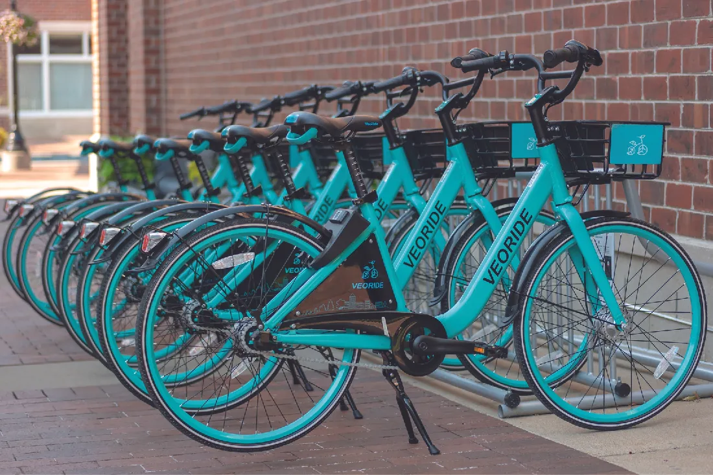

## 1.3   Tư duy khởi nghiệp

> **🎯 Mục tiêu học tập**
>
> Đến cuối phần này, bạn sẽ có thể:
>
> - Giải thích ý nghĩa của việc có tư duy khởi nghiệp
> - Mô tả tinh thần hoặc đam mê khởi nghiệp là gì

Khởi nghiệp có nhiều hình thức khác nhau (xem [Bảng 1.1](1-1-entrepreneurship-today)), nhưng các doanh nhân có chung một đặc điểm lớn: **doanh nhân** là người nhận ra cơ hội và lựa chọn hành động theo cơ hội đó. Phần lớn các dự án kinh doanh là những biến thể đổi mới của một ý tưởng sẵn có đã lan rộng qua các cộng đồng, khu vực và quốc gia, chẳng hạn như mở nhà hàng hoặc cửa hàng bán lẻ. Những dự án này, ở một số phương diện, là cách tiếp cận ít rủi ro hơn nhưng vẫn mang tính khởi nghiệp. Chẳng hạn, **Warby Parker**, một công ty khởi nghiệp sinh lời do bốn học viên cao học tại Wharton sáng lập, đã phá vỡ thế thống trị của một doanh nghiệp lớn hiện hữu là **Luxottica** bằng cách cung cấp dòng sản phẩm thuận tiện hơn, ban đầu là trực tuyến, giá hợp lý hơn và phong cách hơn cho một bộ phận lớn người tiêu dùng. Theo nghĩa này, sự đổi mới của họ nằm ở việc tạo ra điều gì đó mới, độc đáo hoặc khác biệt với dòng chính. Tuy vậy, họ vẫn khai thác một phân khúc sẵn có và phần nào đã trưởng thành của một ngành đã được xác lập. Theo một cách khác, **McDonalds**, công ty có 90 phần trăm thuộc sở hữu của các bên nhận nhượng quyền, đã giới thiệu thực đơn “bữa sáng cả ngày” vào năm 2017 và đạt thành công lớn; thực đơn này cũng nhắm đến một nhóm khách hàng rộng hơn, trong đó có người tiêu dùng trẻ, và lôi kéo trở lại những khách hàng từng chọn phương án khác. Tóm lại, nhiều doanh nhân khởi đầu một dự án mới bằng cách giải quyết một vấn đề quan trọng và mang đến một giá trị mà người khác sẽ trân trọng nếu sản phẩm hoặc dịch vụ ấy sẵn có với họ.

Nhận thức được môi trường xung quanh và những trải nghiệm trong cuộc sống có thể mở ra nhiều cơ hội khởi nghiệp. Trong cuộc sống hàng ngày, chúng ta liên tục tìm thấy những khía cạnh có thể được cải thiện. Ví dụ, bạn có thể hỏi: “Nếu chúng ta không phải đi lại để làm việc thì sao?” “Nếu chúng ta không phải sở hữu một phương tiện nhưng vẫn có quyền sử dụng nó thì sao?” “Nếu chúng ta có thể thư giãn khi lái xe đi làm thay vì bị căng thẳng vì kẹt xe thì sao?” Những câu hỏi dạng này đã truyền cảm hứng cho các dự án khởi nghiệp như dịch vụ chia sẻ xe như **Uber**, ngành xe tự lái,[^21] và việc tiếp cận xe đạp ngắn hạn trong chương trình chia sẻ xe đạp miễn phí ở Pella, Iowa ([Hình 1.10](1-3-the-entrepreneurial-mindset#OSX_Eship_01_03_Bicycle)).[^22]

*Hình 1.10: Một chương trình chia sẻ xe đạp ở Pella, Iowa, cho phép người dùng tiếp cận xe tại nhiều địa điểm khác nhau. (nguồn tín dụng: “Corral of VeoRide Dockless Bike Share” của “paul.wasneski”/Flickr, Public Domain)*

Những ý tưởng này xuất phát từ việc có **tư duy khởi nghiệp**, tức sự nhận thức và tập trung vào việc xác định cơ hội thông qua giải quyết vấn đề, cùng với sự sẵn sàng tiến lên để thúc đẩy ý tưởng đó. Tư duy khởi nghiệp là lăng kính mà qua đó doanh nhân nhìn thế giới, nơi mọi thứ đều được cân nhắc dưới ánh sáng của hoạt động kinh doanh khởi nghiệp. Doanh nghiệp luôn là một yếu tố được cân nhắc khi doanh nhân đưa ra quyết định. Trong phần lớn trường hợp, hành động mà doanh nhân thực hiện là vì lợi ích của doanh nghiệp, nhưng đôi khi nó cũng giúp người ấy chuẩn bị để hình thành tư duy phù hợp. Tư duy đó trở thành một lối sống của doanh nhân. Họ thường thiên về hành động để đạt được mục tiêu và mục đích của mình. Họ suy nghĩ hướng về phía trước, luôn lập kế hoạch trước, và thường xuyên tham gia vào các phân tích kiểu “điều gì sẽ xảy ra nếu”. Họ thường tự hỏi: “Nếu chúng ta làm điều này thì sao?” hoặc “Nếu một đối thủ làm điều kia thì sao?” rồi cân nhắc những hệ quả kinh doanh có thể phát sinh.

Phần lớn mọi người đi theo thói quen và truyền thống mà không thực sự nhận biết môi trường xung quanh hay nhận ra các cơ hội để trở thành doanh nhân. Bởi bất kỳ ai cũng có thể thay đổi góc nhìn từ việc làm theo những khuôn mẫu sẵn có sang việc chú ý đến các cơ hội quanh mình, nên bất kỳ ai cũng có thể trở thành doanh nhân. Không có giới hạn nào về tuổi tác, giới tính, chủng tộc, quốc gia xuất thân hay thu nhập cá nhân. Để trở thành doanh nhân, bạn cần nhận ra rằng một cơ hội đang tồn tại và sẵn sàng hành động theo cơ hội đó. Tuy nhiên, cần lưu ý rằng cách hiện thực hóa tư duy khởi nghiệp khác nhau ở những nơi khác nhau trên thế giới. Ví dụ, trong nhiều nền văn hóa châu Á, việc ra quyết định theo nhóm phổ biến hơn và được xem là một phẩm chất đáng giá. Ở những khu vực đó, doanh nhân nhiều khả năng sẽ xin lời khuyên từ các thành viên gia đình hoặc cộng sự kinh doanh trước khi hành động. Trái lại, chủ nghĩa cá nhân được đề cao ở Hoa Kỳ, nên nhiều doanh nhân Mỹ sẽ quyết định triển khai kế hoạch kinh doanh mà không cần tham khảo ý kiến người khác.

### Tinh thần và đam mê khởi nghiệp

**Tinh thần khởi nghiệp** cho phép doanh nhân mang theo mỗi ngày một cách suy nghĩ giúp họ vượt qua trở ngại và đối diện thử thách với thái độ “có thể làm được”. Có tinh thần khởi nghiệp nghĩa là gì? Trong phạm vi thảo luận này, điều đó có thể có nghĩa là giàu đam mê, sống có mục đích, tích cực, táo bạo, tò mò hoặc kiên trì.

Những người sáng lập **Airbnb** có niềm đam mê ủng hộ quyền của cá nhân trong việc cho thuê không gian chưa sử dụng. Vì sao mô hình khách sạn truyền thống lại phải luôn chiếm ưu thế? Vì sao một chủ nhà cá nhân không nên có quyền tự do cho thuê phần không gian bỏ trống và biến không gian đó thành nguồn thu nhập? Airbnb đã thành công trong việc tạo ra những lựa chọn linh hoạt hơn và có chi phí phải chăng hơn trong nền kinh tế “chia sẻ” đang tăng trưởng rất nhanh. Đồng thời, một số bang và chính quyền địa phương cũng nêu lên các vấn đề về quy định giám sát những dự án như vậy. Dù tinh thần khởi nghiệp một phần là sự đấu tranh cho quyền và tự do cá nhân, vẫn cần có sự cân bằng giữa tự do kinh tế và bảo vệ người tiêu dùng. Tinh thần khởi nghiệp bao gồm niềm đam mê đưa ra một ý tưởng có giá trị và đáng theo đuổi, cùng với sự sẵn sàng suy nghĩ vượt ra ngoài những khuôn mẫu và quy trình đã được thiết lập, trong khi vẫn lưu ý đến luật pháp và quy định địa phương, nhằm thay đổi những khuôn mẫu đó hoặc ít nhất là đưa ra các phương án thay thế.

Đam mê là một thành tố then chốt của quá trình khởi nghiệp. Nếu thiếu nó, doanh nhân có thể đánh mất động lực vận hành doanh nghiệp. Đam mê giúp doanh nhân tiếp tục tiến bước khi thế giới bên ngoài gửi đến những thông điệp tiêu cực hoặc phản hồi kém tích cực. Chẳng hạn, nếu bạn thực sự đam mê việc mở một trại cứu hộ động vật vì tình yêu với động vật, bạn sẽ tìm ra cách để biến điều đó thành hiện thực. Động lực nội tại muốn giúp đỡ những con vật đang cần hỗ trợ sẽ thôi thúc bạn làm bất cứ điều gì cần thiết để trại cứu hộ ấy thành hình. Điều tương tự cũng đúng với những loại hình công ty khởi nghiệp khác và những người chủ có niềm đam mê tương tự. Tuy nhiên, đam mê cần được định hướng bởi tầm nhìn và sứ mệnh của doanh nhân; chỉ đam mê vì đam mê là chưa đủ. Một **tuyên bố sứ mệnh** rõ ràng, nêu cụ thể vì sao doanh nghiệp tồn tại và mục tiêu của doanh nhân trong việc hoàn thành sứ mệnh đó, sẽ định hướng đam mê của doanh nhân và giữ cho doanh nghiệp đi đúng hướng. Đam mê, tầm nhìn và sứ mệnh có thể củng cố lẫn nhau và giúp doanh nhân tiếp tục đi đúng đường với những bước đi tiếp theo của doanh nghiệp.

Một số ý tưởng có thể trông nhỏ bé hoặc không đáng kể, nhưng trong lĩnh vực khởi nghiệp, điều quan trọng là nhận ra rằng với mỗi công ty khởi nghiệp mới, một người khác có thể lại nhìn ra một ý tưởng phát sinh giúp mở rộng ý tưởng ban đầu. Cơ hội để xác định những khả năng mới là vô tận. Hãy xem lại công việc của bạn trong việc tạo ra các ý tưởng phát sinh cho những dự án của Angad Darvani hoặc cho dự án Miracle Messages của Kevin F. Adler. Hoặc hãy cân nhắc những ý tưởng phát sinh có thể nảy sinh quanh công nghệ được dùng trong nông nghiệp. Việc tạo ra các ý tưởng phát sinh rất phù hợp với thảo luận của chúng ta về tư duy phân kỳ và hoạt động động não. Thông qua các quá trình này, chúng ta có thể khám phá những cách sử dụng mới cho công nghệ hiện có, giống như **Ring** đã làm khi sử dụng công nghệ hình ảnh để tăng cường an ninh bằng cách cho phép khách hàng nhìn thấy ai đang ở trước cửa mà không cần mở cửa.

### Tư duy khởi nghiệp trong chuyên ngành hoặc lĩnh vực của bạn

Trong ngành mà bạn quan tâm hoặc lĩnh vực bạn đang học, những thách thức nào đang gây ra sự bức bối? Làm thế nào để biến chúng thành cơ hội? Trước đó trong chương này, chúng ta đã đề cập đến **Evernote**, một công ty tập trung vào việc mở rộng khả năng ghi nhớ của chúng ta bằng cách lưu trữ và tổ chức thông tin. Bây giờ hãy xem thêm một số ví dụ khác về nỗ lực khởi nghiệp trong những ngành cụ thể để giúp bạn lên kế hoạch cho dự án của mình trong chính lĩnh vực bạn theo đuổi.

Trong ngành nông nghiệp, côn trùng, cỏ dại, điều kiện thời tiết và những khó khăn trong thu hoạch mùa màng đều là những lĩnh vực giàu tiềm năng cho hoạt động khởi nghiệp. Xu hướng chuyển sang nông sản hữu cơ cũng tác động đến ngành này. Từ góc nhìn khởi nghiệp, bạn có thể phát minh ra sản phẩm nào để vừa hỗ trợ canh tác hữu cơ vừa xử lý vấn đề côn trùng gây hại hoặc phá hủy mùa màng? Phương pháp cũ là dùng thuốc phun hóa học để tiêu diệt côn trùng, nhưng ngày nay, nhu cầu ngày càng tăng đối với thực phẩm hữu cơ cùng với nhận thức cao hơn về tác động của thuốc hóa học lên môi trường đang làm thay đổi bối cảnh này. Một ý tưởng mới để giải quyết vấn đề này là kết hợp máy hút với một thiết bị nông nghiệp.

> **🔗 Liên kết học tập**
>
> Hãy xem [đoạn phim về quá trình tạo ra một máy hút côn trùng trên đồng ruộng](https://openstax.org/l/52BugVacuum) để tìm hiểu thêm.

Máy hút côn trùng là một ví dụ cho thấy việc sử dụng tư duy phân kỳ đã góp phần tạo ra giải pháp loại bỏ côn trùng khỏi cây trồng mà không cần dùng hóa chất. Trong hoạt động nhóm nhằm tạo ra các ý tưởng phân kỳ, ý tưởng này có thể ban đầu không được đón nhận tích cực. Tuy nhiên, ở giai đoạn ủ ý, nó hẳn đã nổi lên như một giải pháp khả thi. Doanh nhân thường phải đối mặt với áp lực phải tuân theo những thói quen và khuôn mẫu đã được xác lập trong ngành.

Thường thì **tư duy khởi nghiệp** bao gồm những ý tưởng hướng tới tương lai làm rung chuyển các quy trình thông thường, truyền thống vốn được xây dựng trên kinh nghiệm tích lũy theo thời gian. Những quy trình và sản phẩm đã được thử nghiệm kỹ lưỡng, có lịch sử thành công rõ ràng, có thể trở thành trở ngại rất lớn đối với các ý tưởng mới. Một ý tưởng mới thậm chí có thể bị xem là bất khả thi hoặc kỳ quặc, thậm chí là đáng xấu hổ trước những thực hành ổn định và dễ dự đoán đã được thiết lập trong ngành. Điều này tạo ra một tình thế tiến thoái lưỡng nan: liệu chúng ta có nên thử một điều mới mẻ, chưa được kiểm chứng và thiếu nghiên cứu được ghi nhận hay không? Đôi khi, chúng ta phải tạm gác sang một bên các thành công và kết quả nghiên cứu trong quá khứ để cởi mở với những khả năng thành công và thất bại mới. Tư duy khởi nghiệp bao gồm sự sáng tạo, kỹ năng giải quyết vấn đề và xu hướng đổi mới.[^23] Tư duy cởi mở là một đặc điểm hỗ trợ sáng tạo, giải quyết vấn đề và đổi mới. Dành thời gian khám phá ý tưởng mới, mơ ước, suy ngẫm và nhìn tình huống từ một góc độ mới đều góp phần tạo nên tư duy khởi nghiệp. Một số đổi mới có thể dẫn đến sự gián đoạn trong ngành, hoặc thậm chí tạo ra một ngành hoàn toàn mới.

Khái niệm thế tiến thoái lưỡng nan của nhà đổi mới do Clayton **Christensen** đưa ra để giải thích **công nghệ đột phá**, tức những công nghệ mà khi được giới thiệu sẽ thay thế các khuôn mẫu, quy trình và hệ thống trước đó từng được xem là bình thường hoặc được chấp nhận. Một ví dụ về công nghệ đột phá là **Airbnb**, công ty đe dọa ngành khách sạn truyền thống bằng cách kết nối các nguồn lực cá nhân với những người mong muốn các nguồn lực đó. Nếu bạn có một phòng ngủ trống không dùng đến, vì sao không cho một người đang muốn và cần không gian đó thuê?

Airbnb đã trở thành một mối đe dọa đáng kể đối với mô hình kinh doanh truyền thống của ngành khách sạn, vốn dựa trên việc xây dựng những khách sạn lớn và cho khách hàng thuê phòng trong các khách sạn đó. Airbnb đã tái cấu hình mô hình ấy, và kể từ khi ra mắt năm 2008, 150 triệu du khách đã sử dụng 3 triệu danh sách chỗ ở của Airbnb tại hơn 191 quốc gia. Airbnb đã huy động được hơn 3 tỷ USD, chưa kể hạn mức tín dụng 1 tỷ USD, và đang cân nhắc bán cổ phiếu để hỗ trợ việc mở rộng quy mô mạnh mẽ. Giá trị của Airbnb vào khoảng 30 tỷ USD. Hãy so sánh giá trị thị trường đó với mức vốn hóa 19 tỷ USD của **Hilton** và 35 tỷ USD của **Marriott**. Nếu bạn là CEO của Hilton hoặc Marriott, bạn có lo lắng không? Ngành khách sạn đã nhận ra Airbnb là một mối đe dọa, và vào năm 2016 bắt đầu vận động để ban hành luật nhằm kiềm chế sự tăng trưởng và mức độ phổ biến của Airbnb. Từ góc nhìn của ngành khách sạn, Airbnb không chơi theo cùng một bộ luật. Đó chính là định nghĩa của công nghệ đột phá: tập trung vào việc tạo ra một ý tưởng hoặc quy trình mới phủ định hoặc thách thức những quy trình hay sản phẩm đã được thiết lập.[^24]

Đôi khi công nghệ đột phá lại xuất hiện từ việc *không* lắng nghe khách hàng. Khách hàng không phải lúc nào cũng biết họ muốn gì. Nhóm khách hàng có thể cần được đội ngũ khởi nghiệp xác định lại dựa trên những mô hình tốt hơn, trên khả năng biết khi nào nên đầu tư phát triển các sản phẩm hiệu năng thấp hơn nhưng hứa hẹn biên lợi nhuận thấp hơn trong khi vẫn đáp ứng nhu cầu, và biết khi nào nên theo đuổi những thị trường nhỏ thay vì các thị trường lớn hoặc đã được xác lập. Về cơ bản, công nghệ đột phá xuất hiện thông qua việc nhận diện các quy trình và sản phẩm mới có giá trị.

Những người sáng lập Airbnb nhận ra rằng có những người sở hữu các nguồn lực chưa sử dụng, như phòng ngủ trống, trong khi người khác lại cần những nguồn lực đó. Chúng ta có thể áp dụng ý tưởng này cho những nguồn lực nhàn rỗi khác như phương tiện giao thông hoặc nhà di động. Mô hình ấy hiện được tái hiện trong các chương trình cho thuê xe ngắn hạn và chia sẻ xe đạp.
