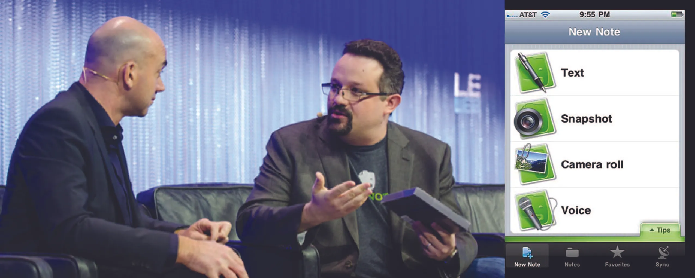

*Hình 1.1: Phil Libin, cựu CEO của Evernote, trao đổi về sản phẩm của mình. Evernote là một ứng dụng cho phép người dùng tạo ghi chú ở nhiều định dạng khác nhau, rồi lưu và chia sẻ chúng trên nhiều nền tảng. (nguồn tín dụng (a): chỉnh sửa từ “Phil Libin and Loic Le Meur - LeWeb Day 1 - Dan Taylor/Heisenberg Media” của Heisenberg Media/Flickr, CC BY 2.0; nguồn tín dụng (b): chỉnh sửa từ “screenshot of the old Evernote iPhone app” của Jason Jones/Flickr, CC BY 2.0)*

## Dàn ý chương

- [1.1 Khởi nghiệp ngày nay](1-1-entrepreneurship-today)
- [1.2 Tầm nhìn và mục tiêu khởi nghiệp](1-2-entrepreneurial-vision-and-goals)
- [1.3 Tư duy khởi nghiệp](1-3-the-entrepreneurial-mindset)

## Giới thiệu

Phil **Libin**, đồng sáng lập và cựu CEO của **Evernote**, từng nói rằng có “rất nhiều lý do không tốt để thành lập một công ty. Nhưng chỉ có một lý do chính đáng, thực sự tốt... đó là thay đổi thế giới.”[^1] Evernote là một ví dụ về một công ty khởi nghiệp. Mục tiêu của công ty là giúp cuộc sống của chúng ta ngăn nắp hơn và tăng cường khả năng ghi nhớ cá nhân bằng cách lưu trữ những thông tin cần thiết hoặc mong muốn trên ứng dụng Evernote. Evernote được thiết kế để thu nhận thông tin thông qua việc ghi chú, bao gồm hình ảnh, trang web, bản vẽ, thậm chí cả âm thanh, rồi theo dõi, sắp xếp, lưu giữ và lưu trữ thông tin đó. Evernote Corporation tự mô tả mình là “không chỉ là một tổ chức, mà là một gia đình các chuyên gia sáng tạo, đổi mới và dày dạn kinh nghiệm trong lĩnh vực của mình.”[^2]

Trên khắp thế giới, các cá nhân, cộng đồng và tổ chức đều vận động cho và hỗ trợ phong trào khởi nghiệp. Nhiều trường cao đẳng và đại học cung cấp các học phần, chương trình cấp bằng và cuộc thi dành cho các nhóm khởi nghiệp. Cộng đồng hỗ trợ thông qua các dịch vụ như vườn ươm doanh nghiệp, nơi thúc đẩy hoạt động lập kế hoạch và khởi sự. Các tổ chức như **UNESCO’s Global Action Programme on Education for Sustainable Development** hằng năm tổ chức một cuộc thi khởi nghiệp dành cho thanh niên.[^3] Tại đó, vào năm 2017, sinh viên Chloe **Huang** đã gửi ý tưởng về một **gian trưng bày năng lượng từ tảo** cho cuộc thi Giáo dục vì Phát triển bền vững. Huang nhận ra vấn đề các hồ bị tảo phát triển quá mức và nhìn thấy một giải pháp ở việc chuyển đổi tảo thành nhiên liệu sinh học, qua đó tạo ra năng lượng xanh đồng thời giảm bớt một vấn đề môi trường.[^4]

Trong cả hai ví dụ của Libin và Huang, các sản phẩm khởi nghiệp đều tập trung vào việc ứng dụng công nghệ và cải thiện cuộc sống, nhưng đồng thời cũng đại diện cho hai cách tiếp cận rất khác nhau đối với khởi nghiệp. Libin tập trung vào việc nâng cao chất lượng cuộc sống bằng cách cho phép người dùng theo dõi và tổ chức thông tin trong công việc lẫn đời sống cá nhân, trong khi Huang tập trung vào một vấn đề môi trường toàn cầu nhằm cải thiện bền vững chất lượng nước. Mỗi ý tưởng đều giải quyết một vấn đề mà nhiều người thậm chí có thể chưa từng nhận ra. Nhận diện những vấn đề cần được giải quyết, rồi giải quyết chúng để làm cho cuộc sống của chúng ta dễ dàng hoặc tốt đẹp hơn, chính là một phần của góc nhìn khởi nghiệp.
