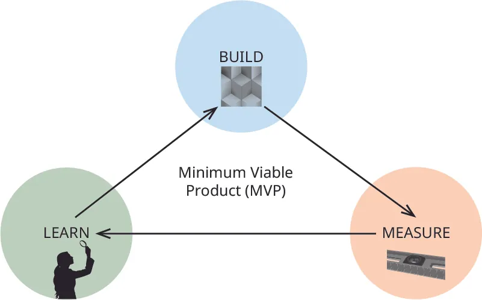

## 10.1   Khởi sự doanh nghiệp chưa hoàn hảo: Khởi nghiệp tinh gọn

> **🎯 Mục tiêu học tập**
>
> Cuối phần này, bạn sẽ có thể:
>
> - Mô tả cách các doanh nghiệp sử dụng các nguyên tắc khởi nghiệp Lean để phát triển sản phẩm và kiểm tra thị trường.
> - Xác định cách phương pháp  *xây dựng-đo lường-học hỏi*  giúp các công ty hiểu khách hàng tiềm năng mong muốn gì ở một sản phẩm.
> - Xác định một sản phẩm khả thi tối thiểu (MVP) là gì và giải thích tại sao các công ty không cần phải có một sản phẩm hoàn hảo để ra mắt.
> - Giải thích tại sao các công ty cần học cách xây dựng một bản trình bày Lean cho các nhà đầu tư và khách hàng tiềm năng.
> - Giải thích điều gì là ‘pivoting’ (đổi hướng) và khi nào nó là cần thiết đối với các công ty.

Như bạn có thể thấy từ ví dụ của **Dropbox**, doanh nghiệp không nhất thiết phải hoàn hảo mới có thể vận hành. Ban đầu, công ty chỉ đưa ra một [đoạn video ngắn giới thiệu sản phẩm Dropbox](https://openstax.org/l/52Dropbox) dù lúc đó sản phẩm còn chưa được lập trình thành chương trình hoàn chỉnh.[^5] Bằng cách này, họ có thể thử nghiệm ý tưởng và nhận phản hồi từ khách hàng mà không mất thời gian hay tiền bạc cho những sản phẩm không hiệu quả. Nếu cần thay đổi, họ vẫn có thể linh hoạt điều chỉnh vì đó mới chỉ là nguyên mẫu ban đầu và chưa có khoản đầu tư lớn nào được rót vào sản phẩm. Nhiều điều chỉnh ban đầu tập trung vào thiết kế giao diện, như các nút bấm, thao tác người dùng và khả năng lưu trữ mà khách hàng thường xuyên góp ý.

Các doanh nghiệp mới cần thời gian để phát triển bản sắc, tương tác với thị trường mục tiêu, tạo và phát triển các sản phẩm phù hợp, và rèn luyện chiến lược. Các công ty khởi nghiệp không có mô hình kinh doanh đã được phát triển và chứng minh hoàn toàn như các công ty đã thành lập. Tầm nhìn hoặc ý tưởng ban đầu của một doanh nghiệp có thể phát triển thành điều gì đó khác vì phản hồi ban đầu từ bản nguyên mẫu chỉ ra một hướng đi khác.

**Houston** (hình ảnh minh họa trong [Hình 10.2](10-1-launching-the-imperfect-business-lean-startup#OSX_Eship_10_01_Houston)) và **Ferdowsi** đã biết họ không có sản phẩm hoàn hảo, vì vậy họ đã sử dụng một hệ thống có tên là **khởi nghiệp tinh gọn**, một phương pháp mà các nhà kinh doanh sử dụng để giúp họ đổi mới bằng cách liên tục kiểm tra sản phẩm của họ và nhận phản hồi từ khách hàng theo thời gian thực. Phương pháp này kêu gọi một sản phẩm được chia sẻ với người chấp nhận sớm trong giai đoạn phát triển ban đầu và nhận phản hồi ngay lập tức. Điều này đảm bảo rằng mọi người thích sản phẩm và sẵn sàng mua nó. Các công ty công nghệ chủ yếu sử dụng phương pháp này vì họ đã học được rằng việc làm việc trên một sản phẩm trong nhiều năm mà không đo lường là rất rủi ro, đặc biệt là trong một môi trường công nghệ thay đổi nhanh chóng. Chiến lược Lean, mặc dù vậy, có thể áp dụng cho hầu hết các doanh nghiệp và ngành công nghiệp.

Ngay cả khi có doanh thu 1 tỷ đô la và hơn 500 triệu người dùng của Dropbox, hành trình của Houston vẫn có những lúc thăng trầm. Anh ấy đã học được rằng công việc của CEO thay đổi khi dự án tiến triển vì nhu cầu của công ty thay đổi trong suốt chu kỳ sống của nó. CEO phải chuyển trọng tâm, chẳng hạn như xây dựng các nguyên mẫu, kiểm tra người dùng, khám phá các kênh phân phối tốt nhất và quản lý dòng tiền. Những trở ngại này cần được giải quyết khi chúng nảy sinh.[^6] Hãy cùng xem xét kỹ hơn về khởi nghiệp tinh gọn và cách nó bắt đầu.

*Hình 10.2: Andrew Houston tin rằng, với vai trò là CEO, bạn phải chuyển trọng tâm khi nhu cầu kinh doanh của doanh nghiệp thay đổi. (công nhận: “Drew Houston (Dropbox) bởi Financial Times/Wikimedia Commons, CC BY 2.0)*

### Khởi nghiệp tinh gọn

Nhà văn và doanh nhân Eric **Ries** đã phát triển phương pháp khởi nghiệp tinh gọn sau khi dành rất nhiều thời gian, công sức và tiền bạc khi công ty công nghệ đầu tiên của mình phải đóng cửa. May mắn thay, sự thất vọng của Ries đã dẫn đến việc anh ấy nghiên cứu các công ty thành công khác và các chương trình sản xuất tinh gọn, bao gồm cả chương trình sản xuất tinh gọn thành công, **Toyota** **quy trình sản xuất tinh gọn**, đã dạy anh ấy cách linh hoạt và nhanh chóng khi xây dựng sản phẩm. Anh ấy đã học được rằng anh ấy không cần phải có một sản phẩm được thiết kế đầy đủ dựa trên nhiều năm phát triển; thay vào đó, anh ấy có thể có một sản phẩm không hoàn hảo hoạt động mà không có các tính năng hào nhoáng, một sản phẩm mà mọi người có thể kiểm tra và cung cấp phản hồi theo thời gian.

> **🔗 Liên kết học tập**
>
> Steve Blank là người sáng tạo ra phương pháp phát triển khách hàng, được coi là nền tảng của chuyển động khởi nghiệp tinh gọn. Hãy xem xét bản trình bày của anh ấy về các khái niệm quan trọng nhất của phương pháp này [ở đây](https://openstax.org/l/52BlankLean). Những thành phần này là trái tim của [14 nguyên tắc quản lý của Toyota](https://openstax.org/l/52ToyotaWay) được gọi là Cách Toyota,

vòng lặp xây dựng – đo lường – học hỏi bước để điều hướng một công ty khởi nghiệp, cách thay đổi hướng nếu cần thiết, kiên trì và tăng tốc sự phát triển của nó. Điều này cũng được gọi là vòng lặp xây dựng-đo lường-học, có nghĩa là một nguyên mẫu được xây dựng, hoặc ít nhất là ý tưởng được viết ra, nó được trình bày cho khách hàng để nhận phản hồi để công ty có thể biết những gì cần giữ lại và những gì cần thay đổi, sau đó nó thực hiện những thay đổi đối với nguyên mẫu và bắt đầu lại, các lần lặp cải tiến quy trình cho đến khi nguyên mẫu đủ tốt để đưa vào thị trường. [Hình 10.3](10-1-launching-the-imperfect-business-lean-startup#OSX_Eship_10_01_BML) minh họa quy trình này. Ngay cả sau khi nó đạt đến thị trường hàng loạt, quy trình này vẫn có thể tiếp tục được sử dụng để cải thiện sản phẩm.

*Hình 10.3: Vòng lặp xây dựng-đo lường-học là một khuôn khổ giúp các nhà khởi nghiệp phát triển ý tưởng của họ thành một sản phẩm khả thi tối thiểu (MVP), đo lường tác động của nó đối với mọi người và học cách thay đổi hoặc kiên trì nếu cần thiết. (bản ghi nhận: Copyright Rice University, OpenStax, theo giấy phép CC BY NC-SA 4.0)*

Sau khi công ty khởi nghiệp đầu tiên không thành công, Ries thành lập công ty thứ hai mang tên IMVU.[^7] **IMVU** là một **nền tảng avatar**, hay một dạng "**metaverse**", dành cho những người muốn mua quần áo, đồ nội thất và phụ kiện trong một cộng đồng trực tuyến nhưng vẫn giữ an toàn cho danh tính của mình. Về bản chất, IMVU là một thế giới thực tế ảo có tích hợp thương mại điện tử, nội dung do người dùng tạo và các nhân vật 3D. Trong lúc xây dựng IMVU, Ries và các đồng sáng lập đã làm việc liên tục suốt sáu tháng để tạo ra một nguyên mẫu avatar 3D, rồi sau đó mới nhận ra rằng không ai thực sự muốn nó. Tháng đầu tiên, họ chỉ thu được tổng cộng 300 đô la. Tháng sau, họ thu được 400 đô la sau khi nài nỉ bạn bè và người thân dùng thử.

Sau khi thấy những khách hàng đầu tiên trung thành của ông và các nhà đồng sáng lập biến mất, họ và các nhà đồng sáng lập đã quyết định chuyển từ sự thất vọng sang trò chuyện với khách hàng tiềm năng. Họ đã thử nghiệm sản phẩm của mình với thanh thiếu niên, những người dùng công nghệ nặng và khách hàng phổ thông. Những khách hàng phổ thông không biết làm gì với sản phẩm. Họ thấy nó quá kỳ lạ. Nhưng những người có kỹ năng công nghệ cao và trẻ tuổi lại hào hứng thử. Họ đưa ra rất nhiều phản hồi, dẫn đến việc tạo ra một phiên bản tốt hơn của cộng đồng nhân vật. [^8]

Nền tảng ban đầu được thiết kế như một **sản phẩm khả thi tối thiểu (MVP)**, tức là một nguyên mẫu rất sớm của sản phẩm.[^9] Theo Ries, MVP có thể chỉ cần ở mức tối thiểu để mọi người hiểu sản phẩm dùng để làm gì. Thậm chí sản phẩm còn không nhất thiết phải được xây dựng hoàn chỉnh mới được xem là MVP; thay vào đó, nó có thể được thể hiện qua bản phác thảo, video hoặc phần giải thích về hình hài dự kiến của sản phẩm. MVP cũng có thể là một phiên bản cơ bản của sản phẩm, giống như website IMVU vốn ban đầu chưa tốt. Mục tiêu là có một sản phẩm cơ bản để giới thiệu cho người dùng tiềm năng, đủ nội dung để khơi gợi phản hồi về điều họ thấy hữu ích và những thuộc tính nào là quan trọng, mà không phải đầu tư quá nhiều tiền bạc và thời gian. Không có một kiểu MVP nào đúng hay sai; chủ doanh nghiệp phải tự quyết định nên trình bày ý tưởng và thử nghiệm nó theo cách nào để biết mọi người thích gì, không thích gì, và làm sao đưa ý tưởng lên bước tiếp theo.

Thông qua trải nghiệm MVP này, Ries (ảnh trong [Hình 10.4](10-1-launching-the-imperfect-business-lean-startup#OSX_Eship_10_01_Ries)) nhận ra rằng nền tảng đầu tiên của mình có các lỗi và vấn đề có thể làm sập máy tính của người dùng; tuy nhiên, bất chấp những lỗi này, ông vẫn quyết tâm thu thập phản hồi của khách hàng mà không tốn kém quá nhiều tiền hoặc thời gian. Khi ông và các nhà đồng sáng lập đã có nền tảng chất lượng thấp đang chạy, họ quyết định tính phí cho dịch vụ. Họ đã gửi hàng chục thay đổi đến người theo dõi trung thành của họ cho đến khi họ phát triển một sản phẩm sẽ hoạt động cho một cơ sở khách hàng lớn hơn. Những thay đổi này bao gồm việc thêm các nhân vật mới, các chuyển động của nhân vật mới, các lựa chọn quần áo và các thế giới mới cho các nhân vật để khám phá. IMVU đã có tiếng trước về phương pháp khởi nghiệp tinh gọn này, phương pháp mà các doanh nghiệp mới trên khắp thế giới hiện nay đang sử dụng. Ngày nay, IMVU là một doanh nghiệp thành công với doanh thu hơn 55 triệu đô la và 50 triệu người dùng.[^10]

*Hình 10.4: Eric Ries, ở bên trái thứ ba, nói tại một hội nghị về quy trình khởi nghiệp tinh gọn mà ông đã phát triển khi tạo ra doanh nghiệp thứ hai của mình. (tưởng trưng bởi sửa đổi “Eric Ries TechCrunch Disrupt” của “kawanet”/Wikimedia Commons, CC BY 2.0)*

Một khởi nghiệp tinh gọn bắt đầu với giai đoạn đầu của việc xây dựng một sản phẩm cơ bản (MVP) có chỉ những lợi ích cốt lõi và không có bất kỳ tính năng bổ sung nào. Houston và các nhà phát triển đã tạo ra một nền tảng cơ bản để người chấp nhận sớm kiểm tra. **Người chấp nhận sớm** là những người thích thử các sản phẩm mới ngay khi chúng ra mắt. Họ không ngại, ví dụ, phần mềm bị lỗi hoặc thiết kế cồng kềnh vì họ là những người đổi mới và thích thử những điều mới. Dropbox không tạo ra một sản phẩm hoàn hảo ngay từ đầu vì các nhà phát triển không biết nó sẽ như thế nào cho đến khi họ nhận được phản hồi từ người dùng. Sau khi đăng ký sớm và phản hồi về nguyên mẫu đầu tiên, họ đã có thể tạo ra phiên bản đầu tiên của sản phẩm. Sau đó, họ thực hiện các **các lần lặp cải tiến**, hoặc các bổ sung hoặc thay đổi cho phiên bản của sản phẩm, sử dụng ý tưởng và đề xuất của khách hàng.

Zappos là một ví dụ khác về một dự án phát triển MVP. Nick **Swinmurn**, người sáng lập công ty giày trực tuyến, đã khởi xướng ý tưởng này vào năm 1998 bằng cách tạo một trang web cơ bản để bán giày và đo lường lưu lượng truy cập trang web.[^11IMVU, là một nền tảng tạo hình ảnh (avatar), hay còn gọi là “metaverse”, dành cho những người muốn mua quần áo, đồ nội thất và phụ kiện trong một cộng đồng trực tuyến và bảo vệ danh tính của họ. Về cơ bản, IMVU là một thế giới ảo với một công cụ thương mại điện tử, nội dung do người dùng tạo ra và các nhân vật 3D. Trong khi Ries đang xây dựng IMVU, ông và các nhà đồng sáng lập đã làm việc không ngừng trong sáu tháng để tạo ra một nguyên mẫu của các nhân vật 3D mà sau đó họ nhận ra không ai muốn. Trong tháng đầu tiên, họ kiếm được tổng cộng 300 đô la. Tháng tiếp theo, họ kiếm được 400 đô la sau khi nhờ bạn bè và gia đình thử nó.]

> **📝 Thực hành: Năm Nguyên tắc Lean**
>
> Truy cập trang web [http://theleanstartup.com/#principles](http://theleanstartup.com/#principles) và nhấp vào liên kết “Quy trình Lean Startup Chi tiết.”
>
>
> - Chọn một chủ đề mà bạn quan tâm và viết một bản tóm tắt một trang về khái niệm đó.
> - Thêm một ví dụ để minh họa cho chủ đề đó.

Tiếp tục tìm hiểu giai đoạn *xây dựng* này, chúng ta thấy rằng các bước này dẫn một doanh nhân qua một vòng lặp hoặc chu trình bắt đầu bằng cách định nghĩa vấn đề đang giải quyết và xây dựng **MVP để cho những người tiêu dùng tiềm năng một mẫu sản phẩm và xem phản ứng của họ như thế nào. Trong nhiều trường hợp, việc bán sản phẩm chất lượng thấp này cũng có thể giúp đo lường phản ứng của người dùng. Các chỉ số, hoặc phép đo, được phát triển để kiểm tra các giả định về sản phẩm của các kỹ sư đã tạo ra nó. Mục tiêu là kiểm tra MVP với thị trường mục tiêu bằng cách đặt câu hỏi về thiết kế, khả năng sử dụng, bộ lợi ích cốt lõi hoặc gói lợi ích, và các thuộc tính khác làm tăng trải nghiệm của khách hàng.**

Ví dụ, các đặc điểm thiết kế khác nhau có thể được đo lường bằng cách hỏi khách hàng xem họ có thích một tính năng hoặc tập hợp các tính năng của sản phẩm họ đang kiểm tra hay không. Số lượng thích hoặc không thích có thể được thống kê, và bình luận có thể được thu thập về các tính năng bổ sung nào cần được thêm hoặc xóa. Khi phản hồi đến, các nhà kinh doanh có thể đưa ra các thay đổi. Sau đó, họ có thể chuyển sang giai đoạn tiếp theo, đó là *đo lường* xem liệu các thay đổi đối với sản phẩm dựa trên phản hồi có thực sự giúp tiến bộ hay không.

Cùng với một sản phẩm có số lượng nhỏ nhất, **Ries** khuyến khích sử dụng một khái niệm đánh giá tài chính tối thiểu được gọi là **kế toán đổi mới** để đánh giá xem liệu các thay đổi đối với sản phẩm có tạo ra kết quả mong muốn hay không. Điều này có nghĩa là các doanh nhân không nên nhìn vào các phép đo tài chính cơ bản truyền thống của các doanh nghiệp - chẳng hạn như doanh số, lợi nhuận và lợi tức đầu tư - vì các phép đo truyền thống không phải là các chỉ số phù hợp nhất ở giai đoạn này. Thay vào đó, họ nên đo lường sự tiến bộ theo một cách khác. Các phép đo có thể bao gồm kiểm tra các giả định về doanh nghiệp, các thuộc tính mà khách hàng thích, số lượng đăng ký và tỷ lệ giữ chân có thể được phân tách thành các nhóm và kiểm tra, ví dụ như hàng tuần khi các sản phẩm được thay đổi.

> **🔗 Liên kết học tập**
>
> Đọc bài báo này [về kế toán đổi mới](https://openstax.org/l/52InnovAccount) và chú ý đến các chỉ số có sẵn để đo lường tiến trình và các trường hợp chúng có hiệu quả.

Trong giai đoạn *học hỏi*, doanh nhân sử dụng phản hồi thu được để đánh giá tiến trình của sản phẩm một cách khách quan. Doanh nhân thực hiện các thay đổi đối với MVP và bắt đầu chu kỳ lại cho đến khi quá trình đạt đến một điểm mà nó có thể tăng tốc hoặc cần phải xoay sở.

Trong quá trình học tập cho công ty, phản hồi là vô cùng quan trọng trong quy trình lean. Phản hồi giúp các công ty thiết kế sản phẩm tốt hơn và đưa ra các phiên bản mới, phục vụ tốt hơn cho khách hàng. Các công ty sẽ làm việc với người chấp nhận sớm trong một thời gian trước khi mở rộng phạm vi với một sản phẩm tốt hơn và thuyết phục nhiều người hơn sử dụng nó.

> **💼 Doanh nhân thực chiến: Tổng Công ty General Electric rất lớn và lean.**
>
> Tổng Công ty General Electric (GE) là một công ty đã hoạt động trong nhiều năm và có danh mục kinh doanh khổng lồ dưới sự kiểm soát của công ty mẹ. Eric Ries đã khuyến khích công ty khổng lồ này tận dụng dòng chảy lean bằng cách hợp tác với ông trong một chương trình mới có tên **Fast Works**. Chương trình này được tạo ra để truyền tải các nguyên tắc đổi mới lean vào phương pháp phát triển sản phẩm của họ bằng cách đào tạo hàng ngàn nhân viên về phương pháp này và giúp họ phát triển các sản phẩm đáp ứng nhu cầu của người dùng nhanh hơn.
>
>
>
> Ví dụ, GE đã cải tiến một turbine bằng cách sử dụng phương pháp lean bằng cách thu thập phản hồi của khách hàng. Nhiều khách hàng cần các tính năng khác nhau, chẳng hạn như độ tin cậy tốt hơn, hiệu quả nhiên liệu tốt hơn và vận hành nhanh hơn. Đội ngũ làm việc trên dự án này đã quyết định sử dụng Fast Works để đáp ứng tất cả các yêu cầu của khách hàng. Cách tiếp cận này sẽ cho phép họ rút ngắn quá trình phát triển và tiết kiệm tiền cho khách hàng. Ba trăm thành viên của đội ngũ turbine GE biết rằng đây sẽ là một nhiệm vụ khó khăn do vị trí của họ trên khắp thế giới và các quy trình liên quan đến phê duyệt, vì vậy họ đã bắt tay vào công việc. Một số người tập trung vào việc đơn giản hóa quy trình phê duyệt, trong khi những người khác làm việc để giải quyết các tắc nghẽn và khuyến khích các kỹ sư cấp thấp đưa ra các quyết định khó khăn mà không cần tham khảo ý ý quan.

### Lặp lại, Trình bày và Điều chỉnh

Nhiều công ty đầu tư thời gian và công sức vào các dự án có vẻ như là ý tưởng hay trên lý thuyết nhưng thất bại khi đưa ra thị trường. Phương pháp khởi nghiệp tinh gọn là một cách tiếp cận mới để phát triển và quản lý các sản phẩm mà mọi người muốn trong một khoảng thời gian ngắn hơn. Các công ty có thể học hỏi từ việc khám phá và xác thực khách hàng rằng giá trị hoặc ưu đãi của sản phẩm không hiệu quả và cần được cải thiện hoặc thay đổi.

Sau khi Ries trải qua thất bại kinh doanh đầu tiên, ông nhận ra vấn đề của các công ty dành thời gian và tiền bạc cho các dự án bị người tiêu dùng từ chối, và ông muốn tìm ra giải pháp. Khi ông bắt đầu cộng đồng avatar cho công ty mới của mình, ông cho phép các nhóm của mình các lần lặp cải tiến sản phẩm - những thay đổi nhỏ đối với phiên bản hiện tại của sản phẩm để làm cho nó phù hợp hơn với nhu cầu của người tiêu dùng. Trong giai đoạn này, và dựa trên những bài học từ thất bại đầu tiên của mình, ông cố gắng tạo ra một phiên bản sản phẩm cốt lõi hoạt động đủ tốt để cung cấp giá trị cốt lõi cho khách hàng, thu thập phản hồi của khách hàng và thực hiện các điều chỉnh nhỏ dựa trên những gì người dùng coi là quan trọng nhất. Điều này cho phép IMVU cải thiện sản phẩm theo cách đưa công ty ngày càng gần hơn với việc cung cấp giá trị tốt nhất.

Một lần các lần lặp cải tiến đã chứng minh là thành công rất lớn là điều chỉnh cách avatar di chuyển trong thế giới thực ảo của nó. Các avatar ban đầu không có khả năng đi bộ như trong các trò chơi điện tử đa người chơi phổ biến. Mặc dù ông biết điều này là một bất lợi, nhưng ông đã gửi phiên bản này cho người chấp nhận sớm và yêu cầu phản hồi. Khách hàng phản hồi rằng sự thiếu khả năng di chuyển cho thấy phần mềm chất lượng thấp. Do không muốn đầu tư vào các công nghệ lớn để thực hiện điều này, Ries và nhóm của ông đã quyết định thử một lần các lần lặp cải tiến nhỏ như một giải pháp thay thế: Họ đã làm cho avatar biến mất khỏi điểm bắt đầu và xuất hiện tại vị trí mới của nó. Khách hàng phản hồi tích cực, cho rằng điều này tốt hơn so với những gì có và là một biến thể chất lượng cao. Lần các lần lặp cải tiến nhanh chóng và chi phí thấp đã trở thành con đường thành công tốt nhất.

Ngoài ra, trong khi quá trình này đang diễn ra, doanh nhân liên tục trình bày ý tưởng của mình cho những người tiêu dùng và nhà đầu tư tiềm năng. Việc trình bày ý tưởng có thể khiến các doanh nhân cảm thấy khó khăn, vì họ có thể lo lắng khi nói trước đám đông. Tuy nhiên, việc trình bày ý tưởng có thể quan trọng như việc xây dựng sản phẩm phù hợp cho đúng đối tượng mục tiêu: Nó cần được luyện tập và thành thạo.

**Pitching** là cách trình bày bằng lời nói về một ý tưởng hoặc kế hoạch kinh doanh, cùng với một yêu cầu gửi đến một nhóm nhà đầu tư, khách hàng hoặc đối tác kinh doanh tiềm năng của doanh nhân ([Telling Your Entrepreneurial Story and Pitching the Idea](7-introduction)). Là một doanh nhân, biết cách trình bày khái niệm kinh doanh của bạn với nhà đầu tư là một trong những yếu tố then chốt để thành công. Tuy nhiên, nếu bạn đang sử dụng phương pháp khởi nghiệp lean, thì bài trình bày của bạn có lẽ sẽ khác biệt rất nhiều so với một bài trình bày thông thường.

**Bài thuyết trình tinh gọn** yêu cầu người trình bày xây dựng một câu chuyện hấp dẫn và được phát triển tốt về công ty, sản phẩm của công ty và những gì khiến sản phẩm này đặc biệt, với đủ chi tiết để cho thấy rằng công ty không chỉ là một câu chuyện trong tâm trí người trình bày. Phương pháp lean tập trung vào khách hàng và cố gắng giải quyết các vấn đề của khách hàng và giải quyết các vấn đề, đồng thời đo lường sản phẩm của mình điên cuồng cho đến khi nó đúng. Câu chuyện phải thể hiện quá trình hiểu biết của họ về khách hàng cũng như vấn đề và các vấn đề của họ. Sau đó, có một lời giải thích về các lần các lần lặp cải tiến, kiểm tra thiết kế và học hỏi từ phản hồi của khách hàng mà chứng minh cách tiếp cận tập trung vào khách hàng. Các thí nghiệm, dữ liệu và thông tin chi tiết được chia sẻ để cho thấy sự tiến bộ của công ty. Như bạn nhớ lại từ [Telling Your Entrepreneurial Story and Pitching the Idea](7-introduction), khi sử dụng một cách tiếp cận trình bày thông thường, người trình bày sẽ cung cấp tất cả các chi tiết về sản phẩm và việc ra mắt tương lai. Bài trình bày truyền thống này yêu cầu đầu tư mà không có bất kỳ kiểm tra giả định nào hoặc có nhiều dữ liệu hoặc thử nghiệm nào để chứng minh rằng ý tưởng sẽ hoạt động.[^16] Ngày càng nhiều bài trình bày lean thành công đòi hỏi các nhà trình bày phải có một số hình thức xác minh mô hình kinh doanh của họ vì điều này cho thấy nhiều sự thật hơn cho tầm nhìn. Nhiều nhà đầu tư tìm kiếm các công ty có một khoản đầu tư nhất định và một cơ sở khách hàng hạt giống dưới sự quản lý của họ. Họ đặc biệt quan tâm đến những người biết số liệu bán hàng, chi phí, dự báo bán hàng của họ và có một hồ sơ về doanh số bán hàng tăng, số lượng khách hàng và lợi nhuận. [Table 10.1](10-1-launching-the-imperfect-business-lean-startup#fs-idm325291072) trình bày một cách tiếp cận từng bước để trình bày với nhà đầu tư và đối tác tiềm năng.

**Bảng 10.1: Pitching của Lean Startup**

| Bước | Mẹo |
| --- | --- |
| 1. Kể một câu chuyện thú vị khiến bạn chuyển nhanh chóng sang kết quả cụ thể | Đừng làm một bài thuyết trình bán hàng; hãy là chính mình bằng cách cởi mở và chân thật. Xây dựng một câu chuyện thú vị và được thiết kế tốt để thu hút khán giả và giới thiệu điều này như một doanh nghiệp đã đang hoạt động nên nhà đầu tư biết ngay từ đầu rằng bạn đang sử dụng các kỹ thuật khởi nghiệp lean. |
| 2. Mô tả vấn đề và giải pháp đang có và những gì khiến bạn khác biệt. | Rõ ràng xác định vấn đề bạn đang giải quyết và cách bạn đã giải quyết vấn đề đó với giải pháp đã được kiểm chứng và đo lường tốt nhất. |
| 3. Mô tả thị trường mục tiêu và cách nó sẽ được hưởng lợi từ sản phẩm. | Chứng minh rằng bạn hiểu rõ khách hàng tiềm năng của mình vì bạn đã thu thập phản hồi từ khách hàng. Cung cấp ví dụ về quá trình phát triển sản phẩm ban đầu và chia sẻ phản hồi chính từ khách hàng đã giúp bạn cải thiện hoặc tích hợp các lợi ích mới. Trình diễn sản phẩm, tập trung vào các lợi ích, không phải các tính năng. |
| 4. Nêu rõ vị thế của bạn với các bằng chứng và kết quả đã đạt được. | Cung cấp thêm các thử nghiệm, thí nghiệm, phản hồi từ khách hàng và bất kỳ thứ gì có thể chứng minh các tuyên bố của bạn. Trình bày dữ liệu và thông tin chi tiết thực tế đã thu thập, nhấn mạnh các sự thật và giả định đã được xác thực mà bạn đã đưa ra. Mô tả những thách thức ban đầu và cách bạn thích ứng mà không bỏ cuộc. |
| 5. Đơn giản | Đừng sử dụng thuật ngữ chuyên ngành. Nói như thể bạn đang giải thích nó cho một người lạ đang ngồi bên cạnh bạn trong một quán cà phê. |
| 6. Cho thấy tiến độ hiện tại | Hãy trình bày những thành tựu bạn đã đạt được trong doanh số/lợi nhuận đến nay. |
| 7. Đưa ra yêu cầu/mục đích. | Kết thúc bài thuyết trình bằng cách xác định bạn đang tìm kiếm gì. Nếu bạn đang tìm kiếm một khoản đầu tư, một đối tác, một thành viên mới tham gia, hoặc một cố vấn, hãy kết thúc bằng yêu cầu. |

Sau khi xem xét kỹ lưỡng vòng lặp **xây dựng-đo lường-học hỏi**, sẽ đến lúc công ty tăng tốc hoặc nhận ra rằng đã đến lúc chuyển hướng chiến lược. **Chuyển hướng chiến lược** là một thay đổi quan trọng và thường khó khăn, được thực hiện để kiểm tra các giả thuyết về sản phẩm cơ bản, tiềm năng tăng trưởng và mô hình kinh doanh. Sau khi sản phẩm đã được kiểm tra và thử nghiệm nhiều lần đối với những thay đổi trong hành vi của người tiêu dùng hoặc bất kỳ chỉ số nào mà công ty đặt ra để đạt được, nếu nó không đạt được sự tăng trưởng, thì bước tiếp theo là chuyển hướng chiến lược thay vì tiếp tục đi theo con đường hiện tại.

Đây là lúc đưa ra những quyết định khó khăn: Bạn có tiếp tục làm việc trên doanh nghiệp, sản phẩm hoặc dự án hay nên thay đổi? Công ty có đang đạt tiến bộ hướng tới mục tiêu của mình, hay các chiến lược có cần những điều chỉnh lớn không? Mặc dù dữ liệu có thể đo lường được, chẳng hạn như sự thích hoặc không thích các thuộc tính, hoặc số lượng đăng ký, giai đoạn đo lường cũng có một thành phần sáng tạo, trực quan và có tầm nhìn. Việc biết khi nào nên thay đổi không thể được xác định chỉ bằng cách tính toán số liệu. Nó cũng đòi hỏi phán đoán của con người, và khi kết hợp với công thức xây dựng-đo lường-học hỏi, có thể giúp một công ty thoát khỏi sự tầm thường.

> **📝 Thực hành: Mười cách để chuyển hướng chiến lược**
>
> Đọc bài báo này trên Forbes.com để xem thêm các ví dụ về những cách các doanh nhân có thể chuyển hướng chiến lược: [https://www.forbes.com/sites/martinzwilling/2011/09/16/top-10-ways-entrepreneurs-pivot-a-lean-startup/#3286d2422d2b](https://www.forbes.com/sites/martinzwilling/2011/09/16/top-10-ways-entrepreneurs-pivot-a-lean-startup/#3286d2422d2b).
>
>
> - Cách nào (các cách) sẽ phù hợp nhất cho dự án kinh doanh hiện tại của bạn? Tại sao?
> - Bạn sẽ có những tính năng sản phẩm nào để đảm bảo tăng trưởng trong tương lai mà không cần đầu tư quá nhiều?

Nếu một doanh nghiệp không tăng trưởng, thì nó đang **thu hẹp** hoặc **trì trệ**.[^17] Một lần xoay trục, cũng giống như trong bóng rổ, đòi hỏi một chân trụ vững trên mặt đất và chân còn lại di chuyển. Điều đó có nghĩa là bạn giữ lại những gì đã học được từ khách hàng như chân trụ của mình, nhưng thử nghiệm một hướng đi khác để tiến lên. Dưới đây là một số ví dụ nổi tiếng về xoay trục:

- **Twitter**  đã chuyển mình thành một gã khổng lồ mạng xã hội từ một công ty tên là  **Odeo**, một nền tảng phát sóng ban đầu được tạo ra để truyền video, âm thanh và podcast. Tuy nhiên,  **Apple**  đã vượt lên khi ra mắt tính năng podcast trên  **iTunes**, và điều đó khiến những người sáng lập thấy không còn hợp lý để tiếp tục theo đuổi hướng đi ấy, nên họ quyết định tạo ra Twitter thay thế.
- **PayPal**  (trước đây là  **Confinity**) cho phép mọi người gửi thanh toán điện tử hoặc “truyền” thanh toán từ các thiết bị Palm Pilots (thiết bị trợ lý cá nhân kỹ thuật số đầu tiên được tạo ra bởi  **Palm Computing**) cũng như từ các thiết bị khác. Lúc đó, người dùng PayPal đã đăng ký một số thẻ, tải ứng dụng truyền và có thể thực hiện thanh toán chuyển khoản từ một thiết bị sang thiết bị khác. Khi công nghệ phát triển, nó đã hợp nhất với  **X.com**  để trở thành phương thức thanh toán được ưa chuộng trên  **Ebay**, giúp công ty trở nên phổ biến hơn.”
- **Avon**  được tạo ra bởi một người bán sách du lịch, người đó sẽ thêm nước hoa vào các giao dịch bán hàng của mình như một phần thưởng cho khách hàng nữ của mình. Cuối cùng, ông nhận ra rằng phụ nữ quan tâm hơn đến nước hoa hơn là sách, nên ông bắt đầu một công ty mới từ một văn phòng nhỏ ở New York.
- **Fab.com**, một trang web thương mại điện tử thiết kế, ban đầu được gọi là  **Fabulis**, và nó bắt đầu như một trang mạng xã hội để kết nối những người đàn ông đồng tính. Sau khi trang mạng xã hội thất bại, các nhà đồng sáng lập đã chuyển hướng đến bán các lựa chọn thiết kế của họ cho các sản phẩm gia đình, phụ kiện và quần áo tốt nhất dành cho tất cả mọi người.[^18]

> **📝 Thực hành: Thị trường cho các trải nghiệm**
>
> Từ cuộc suy thoái năm 2009, mọi người đã chi nhiều hơn cho những *trải nghiệm* như du lịch và ăn uống, thay vì hàng hóa. Thay vì sở hữu nhiều sản phẩm, người dân, đặc biệt là thế hệ Millennials và Gen Z, đang chuyển đổi nhiều ngành công nghiệp. Họ thích đi lại bằng **Uber và có **Airbnb trải nghiệm, nơi các địa điểm và con người quan trọng hơn đồ vật. Họ thích làm việc tự do hơn là làm việc cho các tập đoàn và có xu hướng thử những món ăn và giải trí mới thay vì tích lũy tài sản. Xu hướng thị trường này đã khiến nhiều nhà bán lẻ lớn phải cắt giảm hoặc đóng cửa. Các nhà bán lẻ nhỏ cũng bị ảnh hưởng. Tuy nhiên, các nhà bán lẻ trực tuyến, cửa hàng nội thất và chuỗi siêu thị đã phần lớn không bị ảnh hưởng bởi những thay đổi trong thói quen mua sắm.****
>
>
> - Nếu bạn là một cửa hàng bán lẻ chuyên biệt tập trung vào việc bán quần áo và dụng cụ thể thao, và có nhiều cửa hàng khu vực trên khắp đất nước, bạn sẽ điều chỉnh hoạt động kinh doanh như thế nào để tránh làm chậm doanh số?
> - Lập một danh sách từng bước các chiến lược chính của bạn và cách mỗi chiến lược sẽ giúp bạn tránh phá sản doanh nghiệp.

Bạn có thể tự hỏi, một công ty có thể chuyển hướng (pivot) bao nhiêu lần? **Ries** thích sử dụng phép so sánh về "đường băng" (runway). Bạn cần đo thời gian bạn còn lại để công ty đạt được mục tiêu, và liệu bạn có thất bại trong việc cất cánh (đốt sạch toàn bộ nguồn tiền mặt) hay sẽ cất cánh thành công (tạo ra doanh thu, lượt đăng ký, thêm khách hàng mới). Đường băng có thể được tính bằng cách chia số tiền mặt trong ngân hàng cho số tiền đang bị đốt mỗi tháng. Ví dụ, nếu công ty bạn có 550.000 đô la trong ngân hàng và đốt (burn) 50.000 đô la mỗi tháng, thì bạn sẽ có thời gian dự kiến là 11 tháng (550.000/50.000). Một cách để làm chậm tốc độ đốt tiền mặt – và kéo dài đường băng – là cắt giảm một số chi phí hoặc kêu gọi nhà đầu tư rót thêm vốn. [^19]

Ngoài ra, còn có nhiều loại chuyển đổi chiến lược khác nhau cho các nhu cầu khác nhau. [Bảng 10.2](10-1-launching-the-imperfect-business-lean-startup#fs-idm373767152) trình bày mười chuyển đổi mà một doanh nhân có thể thực hiện dựa trên phản hồi.

**Bảng 10.2 Eric Ries mô tả mười chiến lược chuyển đổi này trong The Lean Startup.: Các loại chuyển đổi20**

| Chiến lược chuyển đổi | Mô tả |
| --- | --- |
| Thu hẹp phạm vi | Một tính năng duy nhất của sản phẩm trở thành một sản phẩm hoàn chỉnh. |
| Thu nhỏ | Đây là đối nghịch của thao tác phóng to. Một tính năng duy nhất không đủ cho khách hàng, vì vậy sản phẩm cần có thêm các tính năng bổ sung. |
| Phân khúc khách hàng | Có nhu cầu thay đổi phân khúc khách hàng, vì phân khúc đã nghiên cứu không đại diện cho những người sẽ mua sản phẩm trên quy mô lớn hơn. |
| Nhu cầu của khách hàng | Phản hồi từ khách hàng cho thấy vấn đề được giải quyết không quan trọng. Sản phẩm cần được điều chỉnh lại hoặc tạo ra một sản phẩm mới để giải quyết một vấn đề thực sự. |
| Nền tảng | Một sự thay đổi từ ứng dụng thành nền tảng hoặc ngược lại là cần thiết. Các công ty khởi nghiệp thường bắt đầu bằng một ‘ứng dụng đột phá’ cho nền tảng của họ, sau đó trở thành cách thức cho các bên thứ ba tạo ra các sản phẩm của riêng họ. |
| Kiến trúc kinh doanh | Đây là sự thay đổi từ biên lợi nhuận cao, số lượng bán thấp sang biên lợi nhuận thấp, số lượng bán cao. Điều này tương ứng với việc chuyển từ mô hình doanh nghiệp với doanh nghiệp (B2B) sang doanh nghiệp với người tiêu dùng (B2C). |
| Thu thập giá trị | Đây là những thay đổi liên quan đến việc tạo doanh thu hoặc thu thập giá trị (gọi vốn). |
| Động cơ tăng trưởng | Một công ty khởi nghiệp thay đổi động cơ tăng trưởng của mình (từ mô hình tăng trưởng duy trì (sticky), sang trả phí (paid), hoặc lan truyền (viral)). Thông thường, công ty cần thay đổi cách tạo ra doanh thu. |
| Kênh | Các kênh phân phối được thay đổi khi sản phẩm đòi hỏi các lựa chọn nhanh hơn hoặc rộng hơn để tiếp cận người tiêu dùng. Internet đã trở thành một yếu tố gây xáo trộn lớn cho các kênh. |
| Công nghệ | Đôi khi, việc đạt được một giải pháp phục vụ khách hàng hiện tại thông qua các biện pháp rẻ hơn xảy ra khi sử dụng các công nghệ khác (thiết bị sản xuất mới, phần mềm mới, v.v.). Điều này phổ biến hơn với các doanh nghiệp đã thành lập. |

> **💼 Doanh nhân thực chiến: Trường hợp Nintendo**
>
> **Nintendo** có thể trở nên tồi tệ trong thế giới trò chơi nếu không thực hiện đúng một bước ngoặt quyết định vào một thời điểm khó khăn. Được thành lập vào năm 1889 (thực sự bất ngờ, phải không?) tại Kyoto, Nhật Bản, Nintendo sản xuất "hanafuda", hoặc bộ bài hoa (hình ảnh trong [Hình 10.5](10-1-launching-the-imperfect-business-lean-startup#OSX_Eship_10_01_Nintendo)) **(a)** được sử dụng để chơi các trò chơi bài. Nó hoạt động tốt cho đến khi ngành công nghiệp bài bạc bị suy giảm vào những năm 1960. Fusajiro **Yamauchi**, người sáng lập Nintendo, đã cố gắng chuyển sang các thị trường khác bằng cách cung cấp dịch vụ khách sạn và taxi. Những bước ngoặt này đã là những lựa chọn không thành công, và Nintendo gần như đóng cửa. Tuy nhiên, nó vẫn sản xuất các bộ bài của mình, hiện có lớp phủ nhựa, và, nhờ một thỏa thuận với **Disney**, đã bước vào thị trường bộ bài nhân vật.
>
>
>
> Tuy nhiên, công ty vẫn hoạt động ì ạch cho đến khi, may mắn thay, một kỹ sư lắp ráp dòng máy đã tạo ra một thiết bị để khôi phục doanh số bán hàng. Anh ấy thiết kế một món đồ chơi có tên Ultra Hand, mà trẻ em có thể thao tác để lấy các vật thể ở xa. Sau khi bán một triệu đơn vị thành công, công ty đã đổi tên thành **Nintendo Games** và bước vào thị trường đồ chơi đang phát triển.
>
>
>
> Lần xâm nhập vào trò chơi video của họ thành công đầu tiên với việc phát hành trò chơi Color TV Block Breaker vào năm 1977 (hình ảnh trong [Hình 10.5](10-1-launching-the-imperfect-business-lean-startup#OSX_Eship_10_01_Nintendo) **(b)**). Năm 1981, khi công nghệ thay đổi ngành công nghiệp trò chơi, Nintendo đã tạo ra Donkey Kong, và sau đó vào những năm 1980, Mario Brothers. Nhờ bước ngoặt này, Nintendo hiện có giá trị hơn 22 tỷ đô la và tiếp tục phát triển như một trong những công ty trò chơi hàng đầu trên thế giới.[^21]
>
>
>
> 
>
> *Hình 10.5: Nintendo bắt đầu với một công ty nhỏ tạo ra (a) bộ bài Hanafuda và (b) trò chơi Color TV Block Breaker. Ngày nay, Nintendo là một trong những công ty lớn nhất trong ngành công nghiệp trò chơi, với giá trị hơn 22 tỷ đô la. (tài liệu (a): sửa đổi “Koi-Koi Setup” của “Aldaron”/Wikimedia Commons, CC BY-SA 3.0; tài liệu (b): sửa đổi “Nintendo-Color-TV-Game-Blockbreaker-FL” của “Evan-Amos”/Wikimedia Commons, Công khai)*
