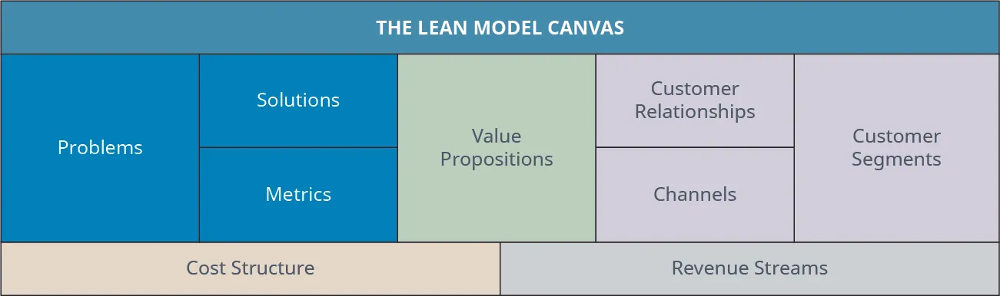
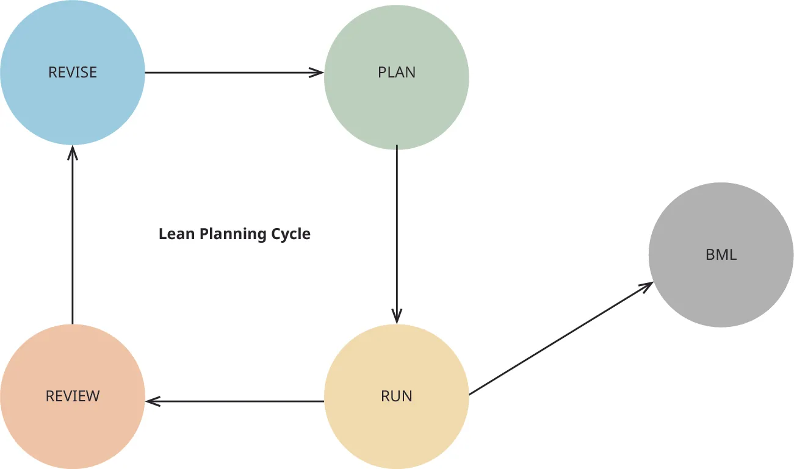

## 10.4   Quản lý, thực hiện và điều chỉnh kế hoạch ban đầu

> **🎯 Mục tiêu học tập**
>
> Đến cuối phần này, bạn có thể:
>
> - Giải thích sự khác nhau giữa kế hoạch kinh doanh và kế hoạch kinh doanh tinh gọn
> - Biết cách xây dựng một kế hoạch kinh doanh tinh gọn nhanh chóng và chính xác
> - Vận hành vòng lặp xây dựng-đo lường-học hỏi

Trong chương này, chúng ta đã thảo luận cách khởi sự một doanh nghiệp chưa hoàn hảo bằng cách tiếp cận lean startup. Chúng ta đã xem xét vòng lặp xây dựng-đo lường-học hỏi và cách kiểm thử một MVP. Chúng ta cũng đề cập đến cách đối phó với nỗi sợ thất bại và vượt qua lối suy nghĩ tiêu cực. Ngoài ra, chúng ta còn bàn về cách các nhóm thiểu số có thể tận dụng nguồn lực để thành công. Bây giờ là lúc xây dựng kế hoạch kinh doanh tinh gọn để giúp bạn ra mắt dự án khởi nghiệp của mình.

Như bạn có thể thấy, việc có một kế hoạch kinh doanh tinh gọn là rất quan trọng để thực thi toàn bộ quy trình. **Kế hoạch kinh doanh tinh gọn** đi theo định hướng của **phương pháp tinh gọn**. Đây là một bản kế hoạch kinh doanh ngắn gọn được trình bày cho nhà đầu tư tiềm năng và nhân viên, là cách nhanh chóng và hiệu quả để thiết lập, quản lý và đánh giá các mục tiêu cũng như chiến lược kinh doanh. [Hình 10.13](10-4-managing-following-and-adjusting-the-initial-plan#OSX_Eship_10_04_LeanPlan) cho thấy các thành phần của kế hoạch này.

Theo cách truyền thống, một **kế hoạch kinh doanh** đòi hỏi một tài liệu chi tiết về bối cảnh doanh nghiệp, khách hàng mục tiêu, mục tiêu, tình hình tài chính và chiến lược marketing. Việc xây dựng tài liệu này thường mất khá nhiều thời gian, từ vài tháng đến một năm, như bạn sẽ thấy trong [Mô hình và kế hoạch kinh doanh](11-introduction). Một kế hoạch kinh doanh đầy đủ cần lượng thông tin phong phú vì nó được phát triển cho mục đích nội bộ, cho ngân hàng hoặc nhà đầu tư cần bằng chứng rằng doanh nghiệp là một khoản đầu tư tốt, và cho các bên liên quan khác. Ngược lại, kế hoạch kinh doanh tinh gọn ngắn hơn và chỉ bao gồm những thông tin chọn lọc, đủ để đi qua **vòng lặp xây dựng-đo lường-học hỏi**. Đây là nơi bạn làm rõ những ý tưởng ban đầu về sản phẩm để có thể vận hành vòng lặp đó và chia sẻ với nhà đầu tư tiềm năng cũng như nhân viên, những người chỉ cần lượng thông tin vừa đủ để quyết định vai trò của họ trong dự án.

*Hình 10.13: Những người sáng lập doanh nghiệp xây dựng một kế hoạch kinh doanh tinh gọn để giúp xác lập kỳ vọng và mục tiêu. (ghi công: Bản quyền Đại học Rice, OpenStax, theo giấy phép CC BY NC-SA 4.0)*

### Xây dựng kế hoạch kinh doanh tinh gọn

Như đã đề cập trước đó, một kế hoạch kinh doanh tinh gọn sử dụng phương pháp tinh gọn. Kiểu lập kế hoạch này bắt đầu bằng việc soạn một bộ danh sách ngắn có thể cập nhật liên tục để định hướng cho bạn, nghĩa là bạn có thể điều chỉnh nó trong suốt quá trình thực hiện.[^67] Kế hoạch này không nên mất hàng tháng để phát triển; bạn có thể thiết lập nó chỉ trong vài ngày. Kế hoạch tập trung vào cốt lõi của doanh nghiệp, vì vậy chỉ những chi tiết quan trọng về marketing, mô hình kinh doanh, tài chính, vòng lặp xây dựng-đo lường-học hỏi và **MVP** mới được đưa vào.[^68]

Sau đây là danh sách các quy trình cơ bản và các chi tiết cần đưa vào một kế hoạch kinh doanh tinh gọn.

1. Viết một tài liệu ngắn gọn và đơn giản.
2. Kiểm thử MVP của bạn thông qua vòng lặp xây dựng-đo lường-học hỏi.
3. Rà soát kết quả của bạn.
4. Điều chỉnh kế hoạch của bạn.

Khi hoàn thành các bước này, doanh nhân có thể bắt đầu hoặc tiếp tục dự án khởi nghiệp của mình.

#### Viết một tài liệu ngắn gọn và đơn giản

Kế hoạch này không cần phải bao gồm tóm tắt điều hành, bối cảnh công ty hay thông tin về đội ngũ. Về bản chất, đây là một bản trình bày ngắn mà bạn có thể dùng để chia sẻ với nhà đầu tư và đối tác tiềm năng. Hãy tập trung vào những gì quan trọng và bao gồm các nội dung sau:

- Các chiến lược cơ bản về sản phẩm, giá, địa điểm, xúc tiến; nếu là dịch vụ thì bổ sung thêm con người, môi trường vật chất và quy trình
- Các chiến lược cơ bản về thị trường mục tiêu và định vị
- Các chiến thuật hằng ngày, bao gồm những nhiệm vụ hoặc hành động cụ thể để hoàn thành mục tiêu
- Lịch trình có nêu thời điểm xin các giấy phép cần thiết, ngày ra mắt, và thời điểm rà soát cũng như điều chỉnh kế hoạch
- Một mô hình kinh doanh mô tả rõ bạn sẽ kiếm tiền bằng cách nào
- Dự báo cơ bản về doanh số, chi phí, lợi nhuận và phân tích hòa vốn

Kế hoạch này thực chất chỉ là một danh sách tối giản về những việc cần hoàn thành và người chịu trách nhiệm cho từng việc. Nó cũng bao gồm mốc thời gian, chi phí và lợi ích mong đợi. Nó ít giống một tài liệu truyền thống hơn mà giống một chuỗi danh sách và gạch đầu dòng hơn. Trong trường hợp này, doanh nhân chỉ ghi lại những yếu tố cốt lõi của doanh nghiệp để đạt được mục tiêu trước mắt. Về sau, khi cần một tài liệu cho các bên liên quan bên ngoài hoặc để vay vốn ngân hàng, bạn có thể phát triển một kế hoạch đầy đủ hơn với nghiên cứu và chi tiết rõ ràng hơn về thị trường, môi trường, xu hướng và chiến lược.

Ví dụ, một doanh nhân vừa mở công ty chân tay giả có thể bắt đầu kế hoạch kinh doanh tinh gọn bằng cách mô tả sản phẩm chính của mình, chẳng hạn tập trung vào việc tạo chân tay giả theo yêu cầu cho trẻ em. Sau đó, họ có thể bổ sung mức giá cơ bản hoặc khoảng giá cho sản phẩm cốt lõi này, vì đây là sản phẩm tùy chỉnh nên giá có thể thay đổi theo từng khách hàng. Một chiến lược khác cần được giữ trong kế hoạch là địa điểm kinh doanh. Một vị trí trung tâm có lẽ là ý tưởng tốt, đặc biệt nếu gần bác sĩ và bệnh viện. Cuối cùng, các chiến lược xúc tiến cơ bản dùng để tiếp cận thị trường này, chẳng hạn trao đổi với các bệnh viện nhi và bác sĩ địa phương có thể giới thiệu bệnh nhân cho công ty, cũng nên được liệt kê. Ngoài ra, doanh nhân có thể quyết định tạo một website cơ bản, quảng cáo trực tuyến và các brochure đơn giản để cung cấp thông tin cho khách hàng tiềm năng. Khi toàn bộ các chiến lược đã được phác thảo, có thể thêm các mốc thời gian từ lúc khởi đầu đến ngày ra mắt, bao gồm cả việc phân công cho từng người phụ trách hoạt động trong doanh nghiệp mới này. Những người đó có thể gồm quản lý văn phòng, chuyên gia chân tay giả và nhân sự marketing.

Tiếp theo, doanh nhân có thể làm rõ doanh nghiệp sẽ kiếm tiền bằng cách nào. Doanh nghiệp mới sẽ thu tiền trực tiếp từ khách hàng cho sản phẩm hay không? Có chấp nhận bảo hiểm và khoản đồng chi trả không? Đây là những câu hỏi cần được ghi lại. Sau đó, một dự báo cơ bản về nhu cầu thị trường sẽ giúp dự báo doanh số, chi phí và lợi nhuận.

#### Kiểm thử MVP của bạn thông qua vòng lặp xây dựng-đo lường-học hỏi

Khi **kế hoạch kinh doanh tinh gọn** đã được thiết lập, bước tiếp theo là thực thi nó và kiểm thử MVP thông qua vòng lặp xây dựng-đo lường-học hỏi. Đây là lúc lý thuyết được đưa vào thực tế và mọi giả định đã nêu trong kế hoạch sẽ được kiểm chứng trong đời sống thật.

- Xây dựng MVP của bạn.
- Kiểm thử ý tưởng của bạn bằng cách chia sẻ nó với khách hàng tiềm năng.
- Đo lường kết quả bằng cách trò chuyện với khách hàng và ghi nhận phản hồi.
- Đặt ra những câu hỏi như: Chúng ta có đang xây dựng sản phẩm mà mọi người thực sự muốn không? Chúng ta cần bổ sung những lợi ích nào? Đây có đúng là thị trường mục tiêu của chúng ta không?
- Kiểm thử các phiên bản khác nhau và các nhóm người dùng khác nhau.

Trong ví dụ của chúng ta, doanh nhân sẽ có cơ hội chế tạo chân tay giả và đặt ra những câu hỏi giúp tạo ra sản phẩm tốt hơn theo thời gian. Ở giai đoạn này, doanh nhân có thể phát hiện rằng sản phẩm có thể mở rộng sang cả thiết bị chỉnh hình chứ không chỉ chân tay giả, và có lẽ người lớn cũng có thể được đưa vào thị trường mục tiêu.

#### Rà soát kết quả của bạn

Bước này nên được thực hiện ít nhất mỗi tháng một lần, trong đó phản hồi khách hàng, hoạt động marketing và các kết quả đạt được sẽ được xem xét kỹ lưỡng. Đây là cơ hội rất tốt để doanh nhân đánh giá xem mục tiêu đã đạt được hay chưa và xác định những điểm cần cải thiện. Tuy nhiên, trong nhiều trường hợp, việc rà soát kết quả có thể gây ra sự phản kháng từ nhân viên (nếu có), vì họ có thể cảm thấy mệt mỏi với việc lập kế hoạch, họp về kế hoạch và phải chứng minh kết quả. Quá trình đánh giá này cũng có thể làm nảy sinh lo sợ hoặc cảm xúc tiêu cực do lo bị quy trách nhiệm, nhưng với vai trò người lãnh đạo, bạn luôn phải bảo đảm với họ rằng quy trình này giúp họ làm tốt hơn công việc của mình, đồng thời cung cấp thông tin và công cụ cần thiết để tạo ra những thay đổi đưa doanh nghiệp đến con đường thành công hơn. Vấn đề ở đây là quản lý kết quả chứ không bị kết quả làm chùn bước.

- Rà soát phản hồi của khách hàng và đối chiếu lại với kế hoạch của bạn.
- Rà soát thị trường mục tiêu, 7Ps của marketing, các tính năng và lợi ích.
- Rà soát các con số hoặc kết quả, có thể bao gồm doanh số, lợi nhuận, số lượt đăng ký của khách hàng, và cả phản ứng của khách hàng đối với quảng cáo cũng như các thuộc tính của sản phẩm.

Trong ví dụ của chúng ta, nếu doanh nghiệp chân tay giả không thu hút đủ khách hàng để duy trì hoạt động, thì đây chính là cơ hội để xác định những vấn đề đang tồn tại và điều chỉnh kế hoạch kinh doanh tinh gọn cho phù hợp.

> **❓ Bạn đã sẵn sàng chưa?: Một kế hoạch kinh doanh tinh gọn cho doanh nghiệp xe scooter**
>
> Bạn quan tâm đến việc mở một doanh nghiệp xe scooter điện mới tại thành phố nhỏ của mình, nơi hiện chưa có đối thủ cạnh tranh. Bạn muốn mang đến cho thị trấn của mình một giải pháp di chuyển thông minh, thân thiện với môi trường và giảm sự phụ thuộc vào các phương tiện giao thông thông thường như xe buýt và ô tô.
>
>
> - Hãy xây dựng một kế hoạch kinh doanh tinh gọn trình bày chi tiết cách bạn dự định bắt đầu doanh nghiệp của mình.

#### Điều chỉnh kế hoạch

Hãy điều chỉnh kế hoạch khi cần thiết. Khi các chỉ số đã được đo lường so với kết quả, hoạt động marketing đã được kiểm thử và đánh giá, đồng thời phản hồi của khách hàng đã được thu nhận, thì đã đến lúc rà soát lại kế hoạch và thực hiện các điều chỉnh. Những điều chỉnh này có thể ở dạng bổ sung một tính năng cho sản phẩm, thêm sản phẩm mới, thay đổi chiến thuật xúc tiến hoặc thay đổi cách giao tiếp với khách hàng và chuyên gia tư vấn.

Nếu không có đủ khách hàng để duy trì doanh nghiệp chân tay giả, đây là lúc những người sáng lập cần thực hiện thay đổi để điều chỉnh hướng đi. Có thể khách hàng chưa biết đến doanh nghiệp, hoặc số lượng khách hàng là trẻ em chưa đủ và có thể cần mở rộng thị trường mục tiêu sang cả người lớn. Khi kế hoạch được điều chỉnh và các thay đổi tương ứng được thực hiện, doanh nghiệp có thể tiếp tục vận hành và quá trình kiểm thử sẽ được khởi động lại. Như bạn có thể thấy ở [Hình 10.14](10-4-managing-following-and-adjusting-the-initial-plan#OSX_Eship_10_04_LeanWheel), đây là một quy trình liên tục. Nó đòi hỏi việc cập nhật thường xuyên và sự hợp tác của tất cả những người tham gia vào doanh nghiệp. Khi quy trình này đã được thiết lập, việc duy trì nó sẽ dễ dàng hơn và nó sẽ được nhìn nhận như một phần cần thiết giúp doanh nghiệp phát triển.

*Hình 10.14: Chu trình kế hoạch kinh doanh tinh gọn dành cho doanh nghiệp nhỏ. (ghi công: Bản quyền Đại học Rice, OpenStax, theo giấy phép CC BY NC-SA 4.0)*

Tim **Berry**, doanh nhân, cựu nhân viên **Apple**, tác giả và hiện là một chuyên gia nổi bật về lean startup, tư vấn cho doanh nghiệp về nghệ thuật lập kế hoạch kinh doanh tinh gọn vì chính ông không thích những bản kế hoạch dài dòng và rất thiếu kiên nhẫn với các kế hoạch quá đồ sộ hay phức tạp. Theo Berry, lập kế hoạch kinh doanh tinh gọn không bao gồm những thông tin cầu kỳ hay chi tiết không cần thiết cho việc vận hành doanh nghiệp. Nó không hẳn là một tài liệu theo nghĩa truyền thống, mà là tập hợp của các gạch đầu dòng ngắn, một số danh sách và bảng biểu. Với Berry, các bước quan trọng nhất trong lập kế hoạch kinh doanh tinh gọn là phải có những yếu tố sau:

1. Một chiến lược hoặc kế hoạch kinh doanh tinh gọn đã được thiết lập
2. Thực thi kế hoạch (hay vận hành nó như trong  [Hình 10.14](10-4-managing-following-and-adjusting-the-initial-plan#OSX_Eship_10_04_LeanWheel))
3. Rà soát kết quả và đối chiếu với các mốc quan trọng
4. Điều chỉnh kế hoạch, thay đổi những gì không hiệu quả và bắt đầu lại toàn bộ quy trình[^69]

> **❓ Bạn đã sẵn sàng chưa?: Xây dựng kế hoạch kinh doanh tinh gọn**
>
> Một doanh nhân địa phương sở hữu một cửa hàng in đã hoạt động được 20 năm. Chủ cửa hàng chủ yếu in danh thiếp, tờ rơi, áp phích, brochure và banner cho các doanh nghiệp địa phương. Họ nhận thấy doanh số đã suy giảm trong suốt năm năm qua vì hoạt động quảng bá đang chuyển dần sang quảng cáo số, mạng xã hội và các kỹ thuật marketing trên Internet thay vì tài liệu in ấn. Nếu muốn tiếp tục tồn tại, họ sẽ cần phải đổi mới.
>
>
>
> Tuần trước, chủ cửa hàng đã đến gặp một giảng viên môn khởi nghiệp của bạn để nhờ một sinh viên hoặc ai đó hỗ trợ. Vì bạn học rất tốt môn này, giảng viên tin rằng bạn có thể chỉ cho chủ doanh nghiệp cách xây dựng một kế hoạch kinh doanh tinh gọn, và họ đề nghị bạn tham gia một kỳ thực tập. Bạn vui vẻ nhận lời và bắt đầu làm việc với dự án này.
>
>
> - Hãy xây dựng một kế hoạch kinh doanh tinh gọn và giải thích cho chủ doanh nghiệp biết kế hoạch này có thể giúp họ tăng trưởng như thế nào trong ba năm tới.
