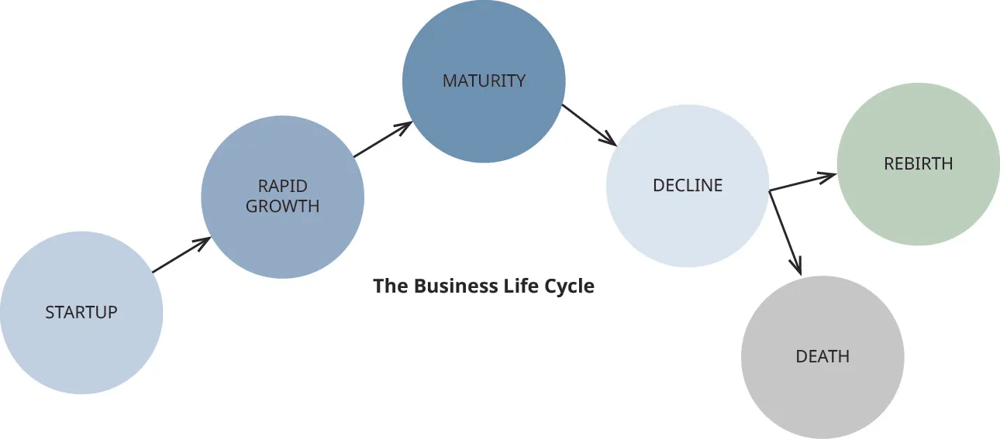
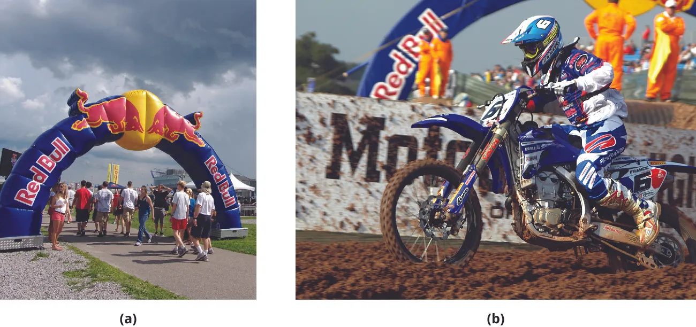

## 10.5   Tăng trưởng: Dấu hiệu, khó khăn và lưu ý

> **🎯 Mục tiêu học tập**
>
> Cuối phần này, bạn sẽ có thể:
>
> - Xác định chu kỳ phát triển của một doanh nghiệp
> - Xác định các chiến lược để quản lý các nhu cầu chính ở mỗi giai đoạn của chu kỳ
> - Giải thích cách các doanh nghiệp phát triển và thích ứng với những thay đổi trong chu kỳ của chúng

Công việc của doanh nhân không kết thúc sau khi một doanh nghiệp được khởi động. Luôn có những thay đổi liên tục cần quản lý. Phát triển bền vững của doanh nghiệp đòi hỏi một công ty phải cải thiện lợi nhuận bằng cách tăng doanh thu, cắt giảm chi phí, hoặc cả hai. Tăng lợi nhuận hàng năm cho thấy sự cải thiện và giúp doanh nghiệp có được nguồn tài chính từ các ngân hàng, thu hút và thưởng cho các nhà đầu tư, hỗ trợ cơ hội mở các chi nhánh kinh doanh mới, và giúp tái đầu tư những lợi nhuận này vào nghiên cứu và phát triển. Khi doanh nghiệp trưởng thành và ổn định, doanh thu và lợi nhuận của nó cũng tăng, đôi khi giữ cho công ty không ngừng phát triển nếu không có sự thay đổi nào được thực hiện.

Tại giai đoạn khởi nghiệp của bạn, mọi thứ đều mới, thú vị và đôi khi (hoặc có vẻ) ít phức tạp hơn so với khi dự án phát triển. Có lẽ bạn có một hoặc hai nhân viên và bạn quản lý các hoạt động hàng ngày của doanh nghiệp. Quản lý doanh nghiệp vẫn nằm trong khả năng của bạn, và cấu trúc của doanh nghiệp tương đối đơn giản. Khi doanh nghiệp bắt đầu phát triển và đối mặt với những thách thức của quá trình này, chẳng hạn như tuyển dụng thêm nhân viên để đáp ứng nhu cầu, phát triển các sản phẩm mới, hoặc mở rộng sang các địa điểm mới, bạn sẽ cần nhiều nguồn lực hơn và một cách tiếp cận chiến lược khác để quản lý doanh nghiệp. Bạn cần nhận thức được những thay đổi này và điều khiển doanh nghiệp theo hướng đúng đắn để tiếp tục phát triển. Khi bạn bắt đầu nhận biết những dấu hiệu của sự tăng trưởng, bạn có thể đánh giá chính xác thách thức và đưa ra các giải pháp. Quá trình trải qua những thay đổi này được gọi là **vòng đời doanh nghiệp**, một quy trình gồm năm giai đoạn cơ bản: thành lập doanh nghiệp, tăng trưởng (mở rộng sang các thị trường và sản phẩm mới), trưởng thành, suy giảm và phá sản hoặc tái sinh, như [Hình 10.15](10-5-growth-signs-pains-and-cautions#OSX_Eship_10_05_LifeCycle) cho thấy.

*Hình 10.15: Doanh nghiệp trải qua các chu kỳ sinh, trưởng thành, chín muồi, suy giảm và tái sinh hoặc chết. Hiểu biết về chu kỳ của doanh nghiệp và ngành của bạn sẽ giúp bạn đưa ra các bước đi đúng hướng. (thông tin trích dẫn: Copyright Rice University, OpenStax, theo giấy phép CC BY NC-SA 4.0)*

### Giai đoạn vòng đời doanh nghiệp

Khi doanh nghiệp bước sang các **giai đoạn khác nhau của vòng đời**, chủ sở hữu cần chú ý đến các dấu hiệu thay đổi. Những dấu hiệu này có thể bao gồm doanh số tăng nhanh (giai đoạn tăng trưởng), chững lại (giai đoạn trưởng thành) hoặc suy giảm (giai đoạn suy thoái). Chúng cũng có thể bao gồm việc không thể theo kịp nhu cầu nếu không đầu tư thêm vào vốn, thiết bị, phần mềm hoặc công nghệ. Các dấu hiệu khác có thể là nhu cầu tăng nhân sự và tuyển các nhà quản lý cấp cao hoặc cấp trung để giám sát lực lượng lao động đang mở rộng, hoặc nhu cầu tăng trưởng bằng cách cập nhật sản phẩm, giới thiệu sản phẩm mới hay mở thêm thị trường.

#### Giai đoạn khởi đầu/**Khởi đầu**

Giai đoạn này tập trung vào việc thu hút nhóm khách hàng đầu tiên. Các nhà sáng lập chú trọng vào khả năng thực sự cung cấp và giao sản phẩm, mở rộng tệp khách hàng và duy trì đủ dòng tiền để đáp ứng nhu cầu. Mối quan tâm lớn nhất là sống sót và ít nhất phải **hòa vốn**. Giai đoạn này khá đơn giản về mặt sở hữu vì thường chỉ có vài nhân viên, nếu có. Các quy trình thường còn mang tính không chính thức, còn công nghệ và hệ thống có thể ở mức tối thiểu. Chủ doanh nghiệp thường phải kiêm nhiều vai trò để khởi động hoạt động kinh doanh.

Ví dụ, một công ty quảng cáo có thể bắt đầu hoạt động chỉ với các đồng sáng lập và có thể thêm một hoặc hai nhân viên làm thiết kế mỹ thuật hoặc quản lý khách hàng. Ban đầu, mục tiêu là có được khách hàng và cung cấp đúng các dịch vụ, sản phẩm đã hứa, như quảng cáo truyền hình, quảng cáo phát thanh, quảng cáo in hoặc quảng cáo số, đồng thời tư vấn và quản lý tài khoản khách hàng. Mục tiêu là tạo được niềm tin với khách hàng và bảo đảm họ thanh toán cho các dịch vụ đã cung cấp để công ty có thể trả lương cho nhân viên và thanh toán cho nhà cung cấp. Hòa vốn là mục tiêu cơ bản nhất, tức là ít nhất chi phí được bù đắp nhưng doanh nghiệp vẫn chưa tạo ra lợi nhuận. Trong nhiều trường hợp, chủ doanh nghiệp sẽ không nhận lương trong nhiều tháng, thậm chí nhiều năm, để bảo đảm doanh nghiệp cất cánh.

#### Giai đoạn tăng trưởng

Giai đoạn **tăng trưởng**, khi doanh số bán hàng tăng do nhu cầu cao hơn, đầy ắp những thay đổi. Có sự gia tăng doanh số bán hàng, lợi nhuận, thâm nhập thị trường/sản phẩm mới và nhân sự chuyên nghiệp. Thường có sự gia tăng tiền mặt vào và ra. Một yếu tố then chốt trong giai đoạn này là tránh tình trạng căng thẳng về mặt tiền mặt bằng cách chú ý đến chi phí và đảm bảo thanh toán từ khách hàng đối với sản phẩm và dịch vụ được cung cấp bằng cách xem xét các báo cáo chi phí và doanh số hàng ngày, hàng tuần và/hoặc hàng tháng. Tại giai đoạn này, các hệ thống như cơ sở dữ liệu và hệ thống phần mềm giúp theo dõi khách hàng và doanh số bán hàng, cũng như các quy trình chính thức, cần được triển khai cho marketing, công nghệ, sản xuất và nguồn nhân lực. Chủ sở hữu cũng phải quyết định xem có tiếp tục với các chiến lược hiện tại hay không, bán hàng hay thậm chí sáp nhập với một công ty khác để tiếp tục phát triển. Chủ sở hữu thường sẽ thuê các nhà quản lý có kinh nghiệm để đưa công ty lên một tầm cao hơn. Tại thời điểm này, chủ sở hữu có thể cần phải vay các khoản vay và sử dụng sức mạnh vốn hoặc cổ phần của công ty làm vốn để tận dụng sự tăng trưởng hơn nữa. Chương chương về [Tài chính và Kế toán Doanh nghiệp](9-introduction) thảo luận về các chiến lược này chi tiết hơn.

Tại thời điểm này trong ví dụ về phòng quảng cáo của chúng ta, có nhiều khách hàng được phục vụ; công ty đang mở rộng khi nó thêm các khách hàng mới vào danh sách và thuê nhiều nhân viên hơn để đáp ứng nhu cầu. Doanh thu cao hơn, nhưng chi phí cũng tăng lên. Các quy trình cần được triển khai để nhân viên biết nhiệm vụ của họ và cách thực hiện chúng. Phần mềm xử lý hoạt động, chẳng hạn như kế toán và quản lý dự án, được triển khai vì số lượng người và quy trình đang tăng lên. Đôi khi, sự tăng trưởng là vô song nên có thể cần thiết phải sáp nhập với một công ty khác để có thể cung cấp tất cả các dịch vụ mà khách hàng cần.

#### **Giai đoạn trưởng thành**

Khi doanh nghiệp tiếp tục phát triển, nó có thể bước vào giai đoạn trưởng thành, điều này có nghĩa là nó đã phát triển đến mức doanh thu và lợi nhuận ổn định. Có đủ nhân viên và nhiều quản lý tham gia vào việc duy trì hoạt động. Hệ thống được phát triển tốt trong tất cả các bộ phận và hoạt động hiệu quả, với các con số tài chính và quản lý lớn hơn. Bí quyết để vẫn hoạt động và thúc đẩy sự sống mới cho doanh nghiệp là phải linh hoạt và tiếp tục là một công ty sáng tạo và doanh nhân. **Apple** là một ví dụ tuyệt vời của một công ty mà, mặc dù quy mô và sức mạnh của nó đã tăng lên rất nhiều, nhưng nó vẫn tiếp tục đổi mới như thể nó là một công ty nhỏ. Các công ty khác như **GE** và **Procter & Gamble**, mặc dù là các tập đoàn lớn với nhiều nguồn lực, hiện đã trưởng thành và cân bằng tốt vì họ đã hoạt động trong nhiều năm. Tuy nhiên, họ cũng phải tiếp tục đổi mới và thích ứng với xu hướng, và ở đây phương pháp luận lean startup phù hợp tốt với cả các doanh nghiệp nhỏ và lớn vì nó cho phép họ sáng tạo và doanh nhân, bất kể quy mô.

#### **Giai đoạn suy thoái**

Ở giai đoạn này, khi các ngành công nghiệp thay đổi hoặc chủ doanh nghiệp không cập nhật sản phẩm/dịch vụ của họ, sự suy giảm là điều khó tránh khỏi. Doanh số giảm sút, và có thể dự đoán sự tái sinh hoặc sự sụp đổ của doanh nghiệp.

Ví dụ, **Sears**, **Payless**, **Victoria’s Secret**, và **JCPenney** gần đây đã phải đối mặt với các xu hướng công nghệ và thời trang mới, ảnh hưởng đến các nhà bán lẻ vật lý. Cách khách hàng mua sắm đang thay đổi từ việc dành thời gian lướt xem và mua sắm tại cửa hàng thực tế sang việc áp dụng công nghệ mới để mua sắm từ máy tính và thiết bị di động. Ngày nay, **Amazon** và các nhà bán lẻ trực tuyến khác đã phát triển các phương án chiến lược để giúp khách hàng mua sắm các mặt hàng họ muốn với giá cả phải chăng từ thiết bị của họ. Các nhà bán lẻ phải tìm ra những cách tiếp cận trải nghiệm mới để tương tác với người tiêu dùng. Thú vị là, các công ty như **GoPro** và **Fitbit** cũng đang gặp khó khăn với doanh số sụt giảm do cạnh tranh, nhu cầu giảm đối với máy ảnh và giá cả. GoPro và Fitbit vẫn là những thương hiệu tốt có thể hưởng lợi từ việc mua lại từ một công ty lớn hơn, vì vậy chúng có thể có một sự tái sinh.

#### **Giai đoạn tái sinh hoặc chấm dứt**

Khi có những thay đổi lớn trong giai đoạn suy giảm mà công ty không thích ứng để đáp ứng, hoặc chủ doanh nghiệp không giữ được niềm đam mê, sự tập trung, hoặc khả năng cho công việc kinh doanh, thì doanh nghiệp sẽ sụp đổ. Blockbuster đã thất bại trong việc đón nhận kỷ nguyên mới của dịch vụ phát trực tuyến và đóng cửa các cửa hàng vào năm 2013. Tương tự, các cửa hàng bán lẻ nhỏ, nhà hàng, các công ty công nghệ, và các nhà sản xuất không đổi mới cũng không thể duy trì hoạt động kinh doanh và thường sẽ giải thể.

Điều đó không có nghĩa là sự tái sinh không thể xảy ra. Nếu một doanh nghiệp đổi mới và thay đổi để đón nhận công nghệ và ý tưởng mới, nó có thể khởi động lại chu kỳ sống. **Polaroid**, một người đi đầu trong thị trường máy ảnh lấy liền, đã sụp đổ vào những năm 2000 khi ngành công nghiệp nhiếp ảnh bắt đầu chuyển sang các sản phẩm kỹ thuật số. Công ty này phá sản vào năm 2001 và được bán cho một số công ty sở hữu (các công ty sở hữu cổ phần trong doanh nghiệp nhưng không điều hành hoạt động kinh doanh), những công ty này đã cấp phép sử dụng tên Polaroid cho nhiều nhà sản xuất thiết bị điện tử. Gần đây, công ty đã ký kết một thỏa thuận với một công ty sở hữu liên kết chuyên về sự phục sinh thương hiệu để phát triển các sản phẩm nhiếp ảnh. Các sản phẩm này bao gồm một máy ảnh lấy liền mới và ứng dụng Polaroid Swing cho phép mọi người tạo ra các hình GIF động, đó là một vài bức ảnh xoay chuyển để thể hiện chuyển động và trông giống như video rất ngắn. [^70] Mới nhất, Polaroid đã tung ra máy ảnh OneStep+, kết nối máy ảnh với điện thoại thông qua ứng dụng, cho phép nhiếp ảnh gia sử dụng các bộ lọc khác nhau và chụp và in ngay lập tức. [^71] Máy ảnh này, cùng với các dòng máy ảnh lấy liền khác của Polaroid, đã giúp phục hồi thương hiệu này.

### Những khó khăn khi tăng trưởng

Mở rộng một doanh nghiệp thường đi kèm với những khó khăn ban đầu. Các yếu tố gây căng thẳng nghề nghiệp có thể bao gồm việc tìm cách phục vụ khách hàng tốt nhất có thể, sản xuất sản phẩm phù hợp, xây dựng một thương hiệu tuyệt vời, bán đúng số lượng, quản lý tiền mặt, ủy thác công việc cho người khác và đảm bảo có đủ người và hệ thống phù hợp. Và tất nhiên, còn có những căng thẳng cá nhân về việc duy trì sự cân bằng giữa công việc và cuộc sống cá nhân và đáp ứng các yêu cầu của doanh nghiệp.

Năm 2011, Jessica **Thompson**, chủ sở hữu **Johnson Security** ở Thành phố New York, đã cảm thấy áp lực khi doanh nghiệp phát triển. Cô đã mở rộng từ 60 lên 70 nhân viên và dự kiến sẽ thuê thêm 10-20 nhân viên nữa trong năm đó. Tin tức về sự tăng trưởng doanh nghiệp chưa từng có của Johnson Security đã giúp tăng doanh số nhờ đánh giá khách hàng tốt hơn và hợp đồng được viết rõ ràng hơn, nhưng cũng làm tăng thêm những lo ngại của cô. Cô phải thuê thêm người. Cô phải xây dựng cơ sở hạ tầng cần thiết để hỗ trợ các vị trí mới. Cô phải đảm bảo chi phí trách nhiệm pháp lý dựa trên ước tính giờ làm việc, vì khi số lượng nhân viên tăng lên, chi phí cũng tăng lên. Thành công công khai và dễ thấy của cô cũng khiến cô trở thành mục tiêu của Bộ Lao động bang New York, đã kiểm tra công ty để đảm bảo cô đã phân loại nhân viên của mình chính xác là nhân viên W-2 thay vì là nhà thầu. Kết quả kiểm tra là tốt và sự tăng trưởng của cô là phát triển theo chiều tự nhiên, nhưng áp lực này là điều cô phải trải qua để thành công như một doanh nhân.

Victor **Clark** của **Clarke Inc.**, một công ty tư vấn, cũng có chút kinh nghiệm về những khó khăn khi phát triển. Khi được hỏi về kinh nghiệm của mình khi là chủ doanh nghiệp, Clark nói: “Bài học lớn nhất của tôi là ‘lợi nhuận là một ý kiến, tiền mặt là sự thật.’” Ông nói rằng ông đã nhiều lần gặp khó khăn với dòng tiền vì ông đã bỏ qua tài khoản ngân hàng của mình và vì các khoản phải thu trễ hạn. Ông khuyên nên chú ý đến tài khoản ngân hàng, không bao giờ làm công việc khiến bạn mất tiền, biết chi phí của bạn và xem xét số liệu của bạn mỗi tháng một lần.

### Chiến lược phát triển

Một số chiến lược để tăng trưởng là gì? Tăng trưởng có thể có nghĩa là tăng doanh thu và lợi nhuận, đồng thời giảm chi phí. Dưới đây là một số chiến lược có thể giúp mở rộng doanh nghiệp, dù là các công ty mới thành lập hay đã thành lập.

#### Cải tiến sản phẩm

Một cách dễ dàng và rẻ tiền để tăng doanh số của một sản phẩm mới là cải tiến sản phẩm. Điều này có thể ở dạng cập nhật thiết kế, làm cho nó bền hơn, thay đổi kích thước, thêm một tính năng mới hoặc nâng cao chất lượng. Cải tiến sản phẩm dễ dàng hơn nhiều so với việc bắt đầu hoàn toàn từ đầu.

Hãy xem ví dụ về các thiết bị gia dụng. Thay vì tạo ra một máy mới để giặt quần áo, **Samsung** liên tục thêm các tính năng vào máy giặt của mình. Gần đây, công ty đã thay đổi công nghệ sang công nghệ hiệu quả năng lượng (HE) để tiết kiệm nước và năng lượng, và đã thêm một tính năng riêng biệt để giặt các vật dụng bằng tay.

Thường thì, các công ty sản xuất nước hoa và nước xịt hương có thể dễ dàng điều chỉnh các loại nước hoa hiện tại của họ bằng cách thêm một thành phần hoặc hương mới thay vì phát triển một loại nước hoa hoàn toàn mới. Các công ty khởi nghiệp nước hoa thủ công như **Phlur** và **Pinrose** đã gần đây phát triển các dòng nước hoa riêng của họ, có ý thức về môi trường, không thử nghiệm trên động vật và tốt cho cơ thể. Một số loại nước hoa của họ hiện có các phiên bản mới của nước hoa gợi ý, đồng thời họ cũng tạo ra các sản phẩm mới từ các hương thơm ban đầu bằng cách thêm chúng vào xịt cơ thể, sữa dưỡng ẩm, son bóng môi và nến có mùi giống nguyên bản.

> **🔗 Liên kết học tập**
>
> Hãy đọc bài báo [bài báo của *Forbes* về nước hoa Phlur](https://openstax.org/l/52ForbesPhlur) và thấy cách Phlur đã bán hàng ngàn chai nước hoa của mình trước khi khách hàng có thể ngửi thấy mùi.

#### Thâm nhập thị trường

Thâm nhập thị trường có nghĩa là bán nhiều hơn cho khách hàng hiện tại bằng cách giới thiệu các cách sử dụng mới cho một sản phẩm hiện có. Đây là cách tốn kém nhất để thu hút thêm khách hàng từ thị trường hiện có. Ví dụ điển hình là tính linh hoạt của nguyên liệu thực phẩm phổ biến bạn thấy trong [Hình 10.16](10-5-growth-signs-pains-and-cautions#OSX_Eship_10_05_BakingS), baking soda (baking soda). Cho đến những năm 1920, baking soda chỉ được sử dụng làm chất làm nở để nướng bánh. Sự xuất hiện vào giữa thế kỷ của các loại thực phẩm tiện lợi, bao gồm cả các sản phẩm bánh nướng đã sẵn, đã làm giảm nhu cầu về sản phẩm khi mọi người ít nướng bánh hơn tại nhà. Để tăng doanh số, **Arm & Hammer** đã khám phá các cách sử dụng khác và bắt đầu bán nó như một chất khử mùi, chất giặt rửa, phương thuốc chữa hoang tưởng và như một chất bổ sung cho các sản phẩm khác như chất giặt, kem đánh răng và chất tẩy rửa.

*Hình 10.16: Arm & Hammer đã thâm nhập vào thị trường baking soda bằng cách mở rộng các cách sử dụng của sản phẩm. (tùy chỉnh từ "Baking Soda Box White Powder" bởi "evita-ochel”/Pixabay, CC0)*

#### Kênh Phân phối Mới

Việc thêm các **kênh phân phối** mới giúp khách hàng hiện tại có nhiều cách hơn để mua sản phẩm. Ví dụ, Internet đã cung cấp cơ hội cho các công ty mở rộng phạm vi tiếp cận của họ bằng cách bán hàng trực tuyến. Hãy xem xét một tiệm bánh mà, ngoài việc phân phối bánh quy trong cửa hàng và thông qua các nhà bán lẻ, còn thêm một cửa hàng trực tuyến. Mặc dù có rất nhiều công ty có trang web và ứng dụng có thể bán hàng trực tiếp cho khách hàng, các doanh nhân không muốn hoặc không có chức năng thương mại điện tử trên trang web của họ có thể sử dụng các cổng thông tin như **Etsy**, **Amazon** và **Ebay**. Một nhà làm đồ trang sức, ví dụ, có thể bán hàng thông qua một trong những trang web này mà không cần phải trả ai đó để tạo hoặc quản lý trang web cho doanh nghiệp của họ. Các phương pháp truyền thống khác để sử dụng các hệ thống phân phối khác nhau bao gồm cung cấp sản phẩm có sẵn trong cửa hàng bán lẻ, tủ bán hàng tự động hoặc cửa hàng tạp hóa. Ví dụ, **California Pizza Kitchen**. Ban đầu nó chỉ tồn tại như một chuỗi nhà hàng nhưng hiện nay đã tạo ra những chiếc bánh pizza đông lạnh mà chúng ta có thể mua tại cửa hàng tạp hóa.

#### Mở rộng Dòng sản phẩm

Một doanh nghiệp có thể mở rộng dòng sản phẩm của mình để đáp ứng nhu cầu và ngân sách khác nhau của nhiều đối tượng khách hàng. Nó có thể bắt đầu với một sản phẩm cơ bản, không có những tính năng cao cấp để phục vụ người tiêu dùng ở phân khúc thấp. Sau đó, nó có thể cung cấp một sản phẩm chất lượng cao hơn, có giá thành cao hơn với một vài tính năng bổ sung. Một bước cao hơn là sản phẩm cao cấp hơn, sang trọng hơn hoặc có những lợi ích và khả năng bổ sung khác có giá thành cao hơn. Chiến lược này thường được sử dụng với máy ảnh, phần mềm, xe ô tô và khách sạn. Các công ty công nghệ sẽ có những sản phẩm cơ bản của họ và tăng cường chất lượng và lợi ích của các thiết bị phụ kiện để làm chúng trở nên sang trọng hơn và thu hút các thị trường khác nhau trên đường đi. Ví dụ, **Uber** cung cấp dịch vụ đi xe cơ bản cho tất cả những ai yêu cầu đi xe. Tài xế có thể đón họ bằng bất kỳ loại xe nào họ sở hữu. Một nâng cấp cho dịch vụ này là dịch vụ mới **Uber Black**, cho phép khách hàng yêu cầu một chiếc xe sang hoặc SUV. Những chiếc xe này phải mới hơn năm năm tuổi và phải ở trong tình trạng tốt. Dịch vụ này đắt hơn so với các chuyến đi thông thường, có giá ba hoặc bốn lần so với giá của một chuyến đi bằng xe thông thường.

#### Thêm Các Thị Trường Mới

Phát triển các thị trường mới là con đường rủi ro hơn để tăng trưởng. Một công ty chỉ phục vụ khách hàng địa phương có thể mở thêm một địa điểm ở một thị trấn hoặc vùng khác, hoặc cung cấp sản phẩm trực tuyến để tiếp cận khách hàng ở các thành phố, bang hoặc quốc gia khác.

Các công ty thời trang nhanh đã là người tiên phong trong xu hướng này. Đây là các nhà bán lẻ thiết kế, sản xuất và phân phối sản phẩm cho khách hàng một cách nhanh chóng và rẻ tiền bằng cách bỏ qua bốn mùa của năm thời trang thông thường. Thay vào đó, họ thường xuyên đưa ra các thiết kế mới mỗi hai hoặc ba tuần và khuyến khích người mua hàng mua quần áo với tốc độ nhanh hơn. Nhà bán lẻ Zara **Zara**, (hình ảnh trong [Hình 10.17](10-5-growth-signs-pains-and-cautions#OSX_Eship_10_05_For21Zara)), một công ty thời trang nhanh từ Tây Ban Nha, đã đạt được sự phát triển chưa từng có thông qua mở rộng sang các thị trường khác, ví dụ.

*Hình 10.17: Công ty thời trang nhanh Zara đã thành công trong việc phát triển các thị trường mới. (nguồn: chỉnh sửa từ “Zara 222 Broadway” của “Lollasp”/Wikimedia Commons, CC0)*

#### Các doanh nghiệp toàn cầu ngay từ đầu

Như đã đề cập trước đó, mở rộng thị trường toàn cầu là một phương pháp phổ biến để phát triển doanh nghiệp. Một số công ty sẽ tìm đến mở rộng thị trường quốc tế trong giai đoạn tăng trưởng hoặc trưởng thành, và một số công ty sẽ tìm kiếm thị trường toàn cầu ngay từ đầu, như các **doanh nghiệp toàn cầu ngay từ đầu** làm. Một doanh nghiệp toàn cầu ngay từ đầu là công ty có mục tiêu phục vụ thế giới với sản phẩm của mình. Các công ty có các sản phẩm mới chưa từng được tạo ra trước đây—hiện nay chủ yếu là các sản phẩm công nghệ và y tế—thường được hưởng lợi từ chiến lược này. Các sản phẩm giải trí và tiêu dùng khác cũng có thể được xem là toàn cầu, đặc biệt là khi đó là một danh mục sản phẩm mới.

**Red Bull** là một ví dụ về doanh nghiệp toàn cầu ngay từ đầu, vốn đã hướng tầm nhìn ra sân khấu quốc tế ngay cả trước khi bắt đầu tăng trưởng, bởi họ có một sản phẩm mới mà chưa công ty nào từng tạo ra. Sau khi Red Bull tung ra sản phẩm của mình, các công ty khác nhanh chóng làm theo, và một danh mục sản phẩm mới là nước tăng lực đã ra đời. Cho đến nay, công ty đã tồn tại 31 năm, có hơn 12.000 nhân viên tại 171 quốc gia và đã bán hơn 75 tỷ lon trên toàn thế giới.[^75] Thành công mà doanh nghiệp toàn cầu ngay từ đầu này đạt được có thể được lý giải bởi cách tiếp cận marketing cơ sở tại các khuôn viên đại học, việc tài trợ các sự kiện ([Hình 10.18](10-5-growth-signs-pains-and-cautions#OSX_Eship_10_05_RedBull) cho thấy hai ví dụ), cũng như chiến lược phân phối quy mô lớn nhắm đến giới trẻ, các vận động viên thể thao mạo hiểm và những người chuyên nghiệp cần tăng cường năng lượng.

*Hình 10.18: Red Bull thành công nhờ những nỗ lực quảng bá trên toàn thế giới. Công ty đã tìm thấy thành công (a) bằng cách nhắm mục tiêu đến những người tiêu dùng quan tâm đến các môn thể thao khắc nghiệt, chẳng hạn như những người cổ động viên tham dự sự kiện nhảy cliff tại Massachusetts, và (b) bằng cách tài trợ cho các sự kiện như cuộc thi **cấp phép**. (cấp phép (a): sửa đổi công việc của "{enry"/Flickr, CC BY 2.0; cấp phép (b): sửa đổi công việc của "GO Visual"/Flickr, CC BY 2.0)*

> **🔗 Liên kết học tập**
>
> Trong những nỗ lực trở thành một công ty toàn cầu, Red Bull tài trợ cho rất nhiều sự kiện. Năm 2012, [Red Bull tài trợ cho Stratos, lần nhảy cao nhất từng được ghi nhận bởi một người từ không gian](https://openstax.org/l/52RBStratos), một sự kiện "vượt ra ngoài tầm thường". Họ cũng tài trợ cho cuộc thi ["Can You Make It?" 2018](https://openstax.org/l/52RBCanMakeIt), trong đó các đội học sinh du hành khắp châu Âu đến Amsterdam trong một tuần chỉ bằng tiền Red Bull làm tiền tệ.

#### Cấp phép, nhượng quyền thương mại, liên doanh, sáp nhập và mua lại

Các cách tăng trưởng rủi ro hơn bao gồm việc tích hợp các doanh nghiệp bên ngoài thông qua cấp phép, sáp nhập và mua lại, liên doanh và liên minh chiến lược.

**Cấp phép** là một hợp đồng trong đó một công ty cho phép một thực thể khác sản xuất và bán sản phẩm của họ để đổi lấy một khoản phí bản quyền, là một khoản thanh toán để đổi lấy việc sử dụng tài sản hoặc tài sản, dù là trí tuệ hay vật chất để tạo ra doanh thu. Một số tài sản có thể cấp phép có thể ở dạng thiết kế, bản quyền, phát minh, bằng sáng chế hoặc công thức. [^76] Thay vì đầu tư trực tiếp vào sản xuất và tiếp thị các mặt hàng bổ sung, nhiều công ty như **Disney**, **Mattel**, **NBA** và **Warner Brothers** cho phép nhân vật và bản quyền của họ được các công ty khác sử dụng trên hàng hóa của họ. Họ nhận được một **phí bản quyền** cho việc cấp phép này.

Cấp phép cũng có thể xảy ra theo chiều ngược lại: Các công ty nhỏ có công nghệ, giải pháp y tế, phần mềm hoặc sản phẩm mà họ không thể sản xuất có thể tìm kiếm các công ty để cấp phép tài sản **trí tuệ** của họ. Công ty nhỏ hơn cũng có thể cấp phép từ một công ty khác và tạo ra sản phẩm hoặc dịch vụ vì đó là thế mạnh cốt lõi của họ.

**Nhượng quyền thương mại** là một hình thức cấp phép cho phép doanh nghiệp (**bên nhượng quyền**) chia sẻ mô hình kinh doanh để mở rộng doanh nghiệp thông qua nhiều nhà phân phối (**bên nhận nhượng quyền**) để đổi lấy phí. Đổi lại, bên nhượng quyền cung cấp đào tạo, marketing, kiến ​​thức chuyên môn, quản lý và hỗ trợ để giúp bên nhận nhượng quyền đạt được mục tiêu doanh số. Nhượng quyền thương mại phổ biến trong các ngành công nghiệp như nhà hàng, ô tô, khách sạn, vệ sinh, dịch vụ nhà và nhiều hơn nữa. Các thương hiệu nhượng quyền thương mại nổi tiếng bao gồm các nhà hàng nhanh, chẳng hạn như **Chick-Fil-A** hoặc **McDonald’s**, những nhà này đã nhanh chóng mở rộng tại Hoa Kỳ—và trên toàn thế giới trong trường hợp của McDonald’s. Các thương hiệu nhượng quyền thương mại địa phương và quốc gia nhỏ hơn bao gồm **Fit4Mom**, **Mosquito Squad**, **Chocolate Factory** và **Soccer Shots**.

Một **liên doanh** là việc tạo ra một doanh nghiệp mới trong đó hai công ty khác nhau chia sẻ chi phí và lợi nhuận để đạt được các mục tiêu cụ thể của một dự án. Cách tiếp cận này giảm thiểu rủi ro khi đầu tư trực tiếp vào thiết bị vốn và cũng cho phép họ chia sẻ kiến ​​thức và chuyên môn của nhau. Bạn có thể thấy điều này được thực hiện với các doanh nghiệp nhỏ hợp tác để tiết kiệm tiền và giúp đỡ lẫn nhau.

Các công ty lớn cũng làm điều này để tận dụng lợi thế, giảm thiểu rủi ro và chi phí. [^77] **Google** và **NASA** đã hợp tác để đưa thông tin thời tiết, vị trí và dự báo thời tiết của NASA đến tay mọi người thông qua tìm kiếm Google. Thỏa thuận hợp tác này đã mang lại kết quả tốt, và họ tiếp tục hợp tác trong nhiều dự án, bao gồm cả robot và khám phá không gian. [^78]

Trong các thương vụ sáp nhập và mua lại, hai công ty kết hợp lại hoặc một công ty mua cổ phần lớn nhất của công ty kia. Mục đích là để tăng lợi nhuận và giảm thiểu rủi ro bằng cách đa dạng hóa danh mục đầu tư, kết hợp các nguồn lực như hội đồng quản trị, phối hợp nỗ lực để đạt được hiệu quả (ví dụ, có khả năng tăng sản xuất và giảm chi phí sản xuất), mở rộng thị trường tiếp cận, chia sẻ công nghệ và tăng khả năng tiếp cận vốn. Thông thường, các thương vụ sáp nhập và mua lại được thực hiện bởi các công ty lớn như **Dow Chemical** và **DuPont**, **Anheuser-Busch InBev** và **SAB Miller**, **Heinz** và **Kraft**, và **CVS** và **Aetna**, nhưng các công ty nhỏ hơn cũng có thể hưởng lợi nếu cả hai đều có cơ hội để tạo ra sự phù hợp).

Các liên minh chiến lược là các thỏa thuận mà hai hoặc nhiều thực thể tạo ra để làm việc trên một dự án bằng cách chia sẻ một số điểm mạnh và nguồn lực của họ, nhưng không thực sự tạo ra một thực thể mới như trong trường hợp của một liên doanh. Trong liên minh này, cả hai thực thể vẫn được coi là độc lập và chỉ tập trung nguồn lực để làm việc trên một dự án cụ thể vì nó có thể nhanh hơn và hiệu quả hơn về chi phí để làm việc cùng nhau. Tài sản của cả hai công ty vẫn riêng biệt. [^79] Một ví dụ về điều này là **Star Alliance**, một liên minh phân phối chiến lược giữa nhiều hãng hàng không như **United Airlines**, **Lufthansa**, **Air New Zealand**, **Turkish Airlines**, **Croatia Airlines**, và 22 hãng hàng không khác để kết nối khách hàng trên khắp thế giới thông qua một hệ thống đặt vé chung. [^80]

### Ưu và Nhược điểm của Chiến lược Phát Triển

Mỗi cơ hội phát triển đều có ưu và nhược điểm, những điều này được trình bày trong [Bảng 10.6](10-5-growth-signs-pains-and-cautions#fs-idm239870480).

**Bảng 10.6: Ưu và Nhược Điểm của Các Chiến Lược Phát Triển**

| Chiến lược | Ưu điểm | Nhược điểm |
| --- | --- | --- |
| Cải tiến sản phẩm | Nâng cao hiệu suất, chất lượng và chi phí của sản phẩm; cũng có thể tăng doanh số và lợi nhuận. | Không mang lại lợi ích; có thể trở thành một khoản đầu tư lãng phí. |
| Phát triển sản phẩm mới | Duy trì ưu thế cạnh tranh, tăng doanh số/lợi nhuận, thâm nhập vào các thị trường mới. | Tạo ra các sản phẩm mà không ai muốn, gây ra những sai lầm tốn kém. |
| Thâm nhập thị trường | Tăng doanh số bằng cách bổ sung các lợi ích mới cho các sản phẩm hiện có. | Sắp xếp sản phẩm không đúng cách, điều này sẽ khiến bạn không truyền đạt thông tin đến đúng thị trường hoặc truyền đạt những lợi ích mà thị trường mục tiêu không quan tâm. |
| Các kênh phân phối mới | Tiếp cận thị trường mục tiêu nhiều lần hoặc tiếp cận họ ít nhất một lần | Có nhiều kênh hơn để theo dõi và quản lý. |
| Mở rộng dòng sản phẩm | Đáp ứng các thị trường và các mức giá khác nhau; giáo dục người tiêu dùng để mong muốn những sản phẩm tốt hơn, đắt tiền hơn. | Không phân biệt được giữa các sản phẩm, tình trạng tự tước đoạt doanh thu (giảm doanh số do cùng một công ty giới thiệu sản phẩm mới) |
| Thêm các thị trường mới | Mở rộng phạm vi khách hàng, tăng doanh số và lợi nhuận | Phải chăm sóc nhiều khách hàng hơn mà chưa tiếp cận họ đúng cách |
| Tìm kiếm thị trường toàn cầu | Phục vụ thị trường toàn cầu, tiếp cận nhiều khách hàng hơn, tăng doanh số và lợi nhuận | Giải quyết với số lượng khách hàng nhiều hơn, có thể xảy ra sai sót ở nhiều lĩnh vực |
| Tích hợp doanh nghiệp | Thêm các khả năng mới, sự phối hợp, đảm nhận nhiều dự án hơn | Mất vốn đầu tư, mất dự án, không hòa hợp, tan vỡ |
