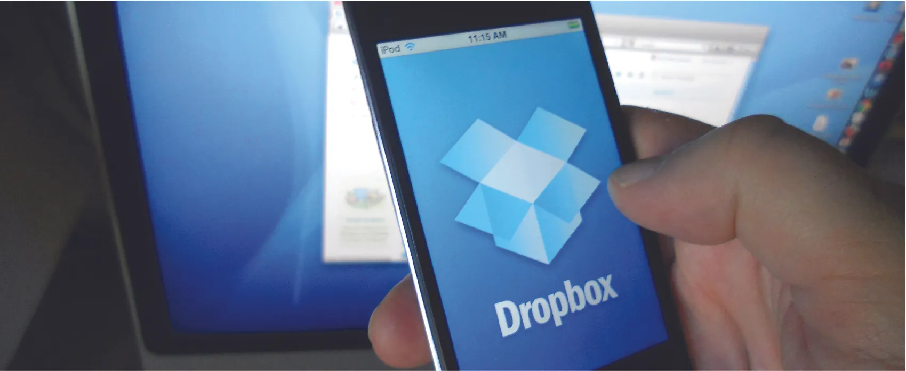

*Hình 10.1: Dropbox, do Drew Houston và Arash Ferdowsi sáng lập, đã đạt mức tăng trưởng chưa từng có, với giá trị công ty lên tới hàng tỷ đô la. (nguồn: chỉnh sửa từ “Dropbox” của Ian Lamont/Flickr, CC BY 2.0)*

## Dàn ý chương

- [10.1   Khởi sự doanh nghiệp chưa hoàn hảo: Lean startup](10-1-launching-the-imperfect-business-lean-startup)
- [10.2   Vì sao thất bại sớm có thể dẫn đến thành công về sau](10-2-why-early-failure-can-lead-to-success-later)
- [10.3   Sự thật đầy thách thức về việc sở hữu doanh nghiệp](10-3-the-challenging-truth-about-business-ownership)
- [10.4   Quản lý, thực hiện và điều chỉnh kế hoạch ban đầu](10-4-managing-following-and-adjusting-the-initial-plan)
- [10.5   Tăng trưởng: Dấu hiệu, khó khăn và lưu ý](10-5-growth-signs-pains-and-cautions)

## Giới thiệu

**Dropbox**, một công ty do Drew **Houston** và Arash **Ferdowsi** sáng lập vào năm 2007, đã làm thay đổi cách người tiêu dùng và doanh nghiệp lưu trữ cũng như chia sẻ tệp điện tử. Ý tưởng này xuất hiện vào một ngày khi Houston, trên chuyến tàu đi làm, nhận ra mình đã để quên chiếc USB ở nhà. Đây không phải lần đầu anh quên chiếc “tủ hồ sơ điện tử” nhỏ bé đó, và anh tin rằng nhiều người khác cũng thường xuyên quên như vậy. Từ đó, anh nảy ra một ý tưởng: lưu trữ các tệp của mình trên một “đám mây” trên Internet để bất kỳ ai cũng có thể truy cập từ bất cứ đâu bằng bất kỳ thiết bị nào.[^1] Anh muốn quản lý việc lưu trữ tệp với tốc độ nhanh hơn và dung lượng lớn hơn so với một số ít hệ thống lưu trữ trực tuyến đang tồn tại khi đó, thông qua một giao diện dễ sử dụng. Mặc dù Houston nảy ra ý tưởng về *lưu trữ đám mây* trong lúc đi lại, nhưng khái niệm *điện toán đám mây* đã được bàn đến trong giới công nghệ từ vài năm trước.[^2]

Đầy hy vọng, anh đã giới thiệu ý tưởng của mình với Y Combinator, một quỹ đầu tư mạo hiểm tại California hỗ trợ tài trợ cho các startup bằng cách tổ chức chương trình, đào tạo và giúp họ định hình bài thuyết trình gọi vốn với nhà đầu tư. Dù trước đó họ từng từ chối một ý tưởng kinh doanh mà anh trình bày, lần này họ cho rằng ý tưởng mới rất hứa hẹn và yêu cầu anh tìm được một đồng sáng lập trước khi gọi vốn. Một đồng sáng lập sẽ giúp việc huy động vốn thuyết phục hơn vì điều đó cho thấy ý tưởng có tính chính danh, có sự ủng hộ và có thêm chuyên môn từ một người khác. Houston nhanh chóng tìm được Ferdowsi, một sinh viên MIT cùng học ngành kỹ thuật và khoa học máy tính.[^3] Cùng nhau, họ huy động được 1,2 triệu đô la từ các nhà đầu tư, dù nguyên mẫu của họ khi đó vẫn chưa hoạt động đầy đủ. Sau đó, họ tuyển các lập trình viên và kỹ sư để tạo ra một phiên bản hoàn thiện hơn, có thể vận hành trên hầu hết các hệ điều hành máy tính.

Dropbox nhanh chóng áp dụng các nguyên tắc của *lean startup*, tức là tung ra một phiên bản sớm cho nhóm người dùng chấp nhận sớm. Houston gặp khó khăn khi giải thích sản phẩm cho những người dùng ban đầu, nên anh đã làm một video với phần thuyết minh dí dỏm để thu hút họ. Việc phát hành sản phẩm sớm này đã thành công vang dội: Chỉ trong một ngày, lượng người dùng của họ tăng từ 5.000 lên 75.000 người, đồng thời những người dùng này cũng cung cấp phản hồi cho các phiên bản tiếp theo.

Nhờ thành công to lớn đó, Dropbox được định giá 10 tỷ đô la vào năm 2014.[^4] Tuy nhiên, một số nhà phân tích cho rằng con số này bị thổi phồng khi các đối thủ cạnh tranh của Dropbox bắt đầu giành thị phần. Công ty vẫn tiếp tục thu nhận phản hồi của khách hàng để thực hiện những lần cải tiến cần thiết cho các phiên bản tốt hơn.
