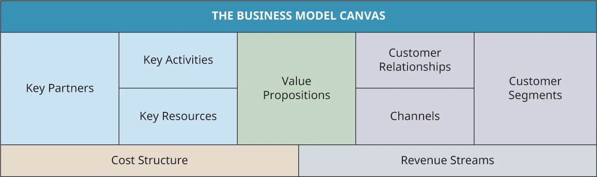
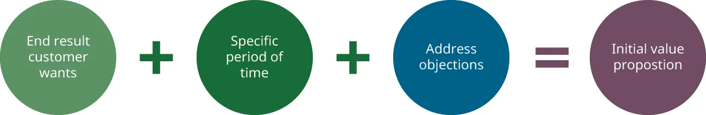
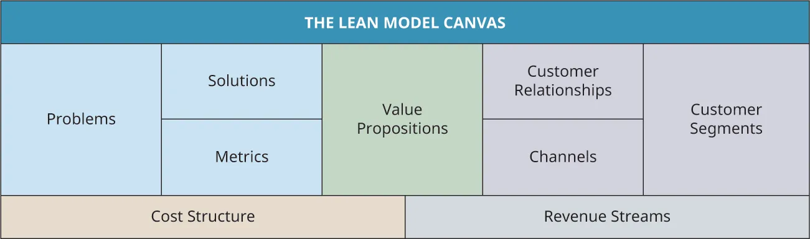
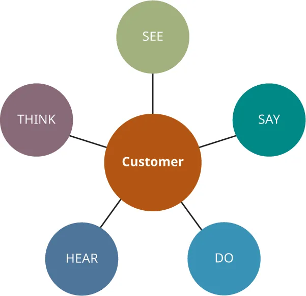
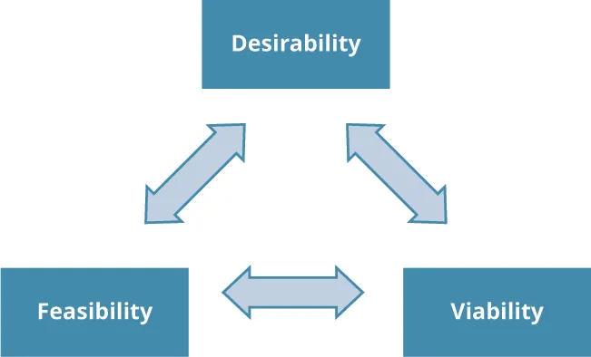
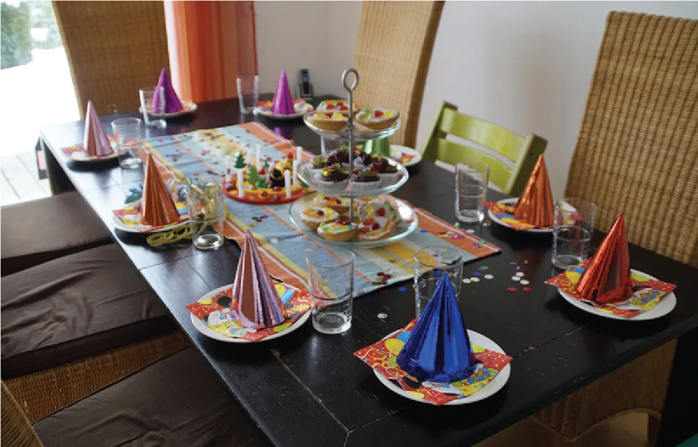

## 11.2   Thiết kế mô hình kinh doanh

Một số phần nội dung trong mục này dựa trên công trình gốc của Geoffrey Graybeal và được thực hiện với sự hỗ trợ của Rebus Community. Bản gốc được cung cấp miễn phí theo giấy phép CC BY 4.0 tại [https://press.rebus.community/media-innovation-and-entrepreneurship/](https://press.rebus.community/media-innovation-and-entrepreneurship/).

> **🎯 Mục tiêu học tập**
>
> Đến cuối phần này, bạn sẽ có thể:
>
> - Định nghĩa mô hình kinh doanh và mục đích của nó
> - Mô tả mô hình kinh doanh canvas
> - Mô tả mô hình lean canvas
> - Mô tả mô hình kinh doanh xã hội canvas

Theo Alexander **Osterwalder** và Yves **Pigneur**, tác giả của *Business Model Generation*, mô hình kinh doanh “mô tả logic về cách một tổ chức tạo ra, phân phối và nắm bắt giá trị.” Tuy vậy, không có một định nghĩa duy nhất cho thuật ngữ này và cách sử dụng của nó rất đa dạng.[^29]

Trong cách dùng kinh doanh tiêu chuẩn, **mô hình kinh doanh** là kế hoạch về cách dự án được tài trợ; cách dự án tạo giá trị cho các bên liên quan, bao gồm khách hàng; cách các sản phẩm chào bán của dự án được tạo ra và phân phối đến người dùng cuối; và cách thu nhập sẽ được tạo ra trong suốt quá trình đó. Mô hình kinh doanh nói nhiều hơn về thiết kế của doanh nghiệp, trong khi **kế hoạch kinh doanh** là tài liệu lập kế hoạch dùng cho vận hành.

Mỗi mô hình kinh doanh là duy nhất đối với công ty mà nó mô tả. Một mô hình kinh doanh điển hình đề cập đến mức độ hấp dẫn, tính khả thi và khả năng duy trì của một công ty, sản phẩm hoặc dịch vụ. Ở mức tối thiểu, mô hình kinh doanh cần đề cập đến các dòng doanh thu, đề xuất giá trị và các phân khúc khách hàng. Nói theo ngôn ngữ đời thường, điều đó có nghĩa là bạn cần trả lời ý tưởng của mình là gì, ai sẽ sử dụng nó, vì sao họ sẽ sử dụng nó, và bạn sẽ kiếm tiền từ đó bằng cách nào.

Canvas là một bảng hiển thị mà những người chuẩn bị khởi nghiệp thường dùng để lập bản đồ và lên kế hoạch cho các thành phần khác nhau của mô hình kinh doanh. Có nhiều loại canvas khác nhau, trong đó business model canvas và lean canvas là hai loại được dùng phổ biến nhất. Có cả các canvas bản cứng được mô phỏng theo khung vải hội họa lẫn các phiên bản số. Các canvas vật lý nguyên gốc được tạo ra như những công cụ trực quan, dùng kèm giấy ghi chú và các bản phác thảo.

Theo cách Osterwalder và Pigneur phát triển, **Mô hình kinh doanh canvas** có chín thành phần, như thể hiện ở [Hình 11.6](11-2-designing-the-business-model#OSX_Eship_11_02_BMCParts).

*Hình 11.6: Mô hình kinh doanh canvas có thể được dùng để lập bản đồ hoặc bố trí ý tưởng ban đầu của doanh nghiệp bạn. (ghi công: Bản quyền Rice University, OpenStax, theo giấy phép CC BY NC-SA 4.0)*

> **🔗 Liên kết học tập**
>
> Hãy truy cập [trang này để xem các ví dụ về Business Model Canvas đã hoàn chỉnh cho nhiều ngành khác nhau](https://openstax.org/l/52BMCsamples), từ đó hiểu sâu hơn cách điền từng nhóm nội dung.

Osterwalder và Pigneur viết *Value Proposition Design* như phần tiếp theo của *Business Model Generation*. Canvas đề xuất giá trị của họ là một công cụ bổ sung cho business model canvas, đi sâu vào các hoạt động như khuyến khích doanh nhân nhận diện và xử lý nỗi đau, lợi ích và các câu hỏi gợi mở về jobs-to-be-done của khách hàng, đồng thời thiết kế các yếu tố giảm nỗi đau và tạo lợi ích. Các hoạt động và tài nguyên bổ trợ đi kèm này hữu ích cho việc đào sâu và hiểu rõ hơn quá trình tạo ra giá trị khách hàng dưới dạng đề xuất giá trị, dù vẫn có các cách khác để khái niệm hóa đề xuất giá trị của bạn. Với Christensen, người khởi xướng lý thuyết đổi mới đột phá và jobs-to-be-done, đề xuất giá trị là một sản phẩm giúp khách hàng hoàn thành một công việc mà họ đang cố làm theo cách hiệu quả hơn, thuận tiện hơn và tiết kiệm hơn.

Theo doanh nhân Ash **Maurya**, tác giả của *Scaling Lean* và *Running Lean*, việc tìm ra giao điểm giữa vấn đề của khách hàng và giải pháp của bạn là cách để tạo ra một đề xuất giá trị độc đáo. Trong *Running Lean*, Maurya đưa ra công thức sau để xây dựng đề xuất giá trị ban đầu trong canvas, như minh họa ở [Hình 11.7](11-2-designing-the-business-model#OSX_Eship_11_02_IVPFormula).

*Hình 11.7: Công thức của Maurya để xác định đề xuất giá trị xem xét nhu cầu khách hàng và những phản đối tiềm tàng trong một khoảng thời gian cụ thể. (ghi công: Bản quyền Rice University, OpenStax, theo giấy phép CC BY NC-SA 4.0)*

Maurya đã điều chỉnh business model canvas tiêu chuẩn để tạo ra lean canvas. Nó trùng với business model canvas ở năm trong chín thành phần: phân khúc khách hàng, đề xuất giá trị, dòng doanh thu, kênh và cơ cấu chi phí ([Hình 11.8](11-2-designing-the-business-model#OSX_Eship_11_02_LeanCanv)). Thay vì đề cập tới đối tác chủ chốt, hoạt động chủ chốt và nguồn lực chủ chốt, lean canvas giúp bạn xử lý vấn đề, giải pháp và các chỉ số chủ chốt.

*Hình 11.8: **Mô hình lean canvas** là một biến thể của Business Model Canvas. (ghi công: Bản quyền Rice University, OpenStax, theo giấy phép CC BY NC-SA 4.0)*

> **🔗 Liên kết học tập**
>
> Hãy truy cập [trang này để xem các ví dụ về Lean Model Canvas hoàn chỉnh của một số công ty lớn](https://openstax.org/l/52LMCsamples), qua đó hiểu sâu hơn cách canvas này có thể được áp dụng.

Mặc dù business model canvas và lean canvas có hình thức tương tự nhau, nhưng có những khác biệt về cách sử dụng. Nhìn chung, mô hình lean canvas được xem là phù hợp hơn với startup, trong khi business model canvas vận hành tốt với các doanh nghiệp đã hình thành. Lean canvas đơn giản hơn; business model canvas cung cấp cái nhìn đầy đủ hơn về một doanh nghiệp trưởng thành.

> **🔗 Liên kết học tập**
>
> Hãy xem [video của Railsware minh họa cách lean canvas có thể được áp dụng cho startup](https://openstax.org/l/52LeanCanvUb) để tìm hiểu thêm. Trong ví dụ tình huống của video, lean canvas được áp dụng cho ứng dụng gọi xe P2P thành công Uber như thể nó vẫn đang ở giai đoạn startup.

Cả business model canvas lẫn lean canvas đều được thiết kế cho quá trình lặp liên tục, cho phép có nhiều phiên bản và thay đổi trong suốt hành trình khởi nghiệp. Một phần của quá trình đó là customer discovery; vì vậy, các canvas này gắn với thiết kế lấy khách hàng làm trung tâm. Khách hàng mục tiêu được tích hợp vào canvas ngay từ đầu thông qua việc sử dụng bản đồ thấu cảm khách hàng và một số hoạt động lên ý tưởng theo tư duy thiết kế.[^30] **Bản đồ thấu cảm khách hàng** là chân dung của một **khách hàng mục tiêu**, ứng viên hứa hẹn nhất trong các phân khúc khách hàng của doanh nghiệp, nhằm khám phá và hiểu vấn đề cũng như nhu cầu của người đó ([Hình 11.9](11-2-designing-the-business-model#OSX_Eship_11_02_EmpMap)). **Osterwalder** và **Pigneur** đã dùng bản đồ thấu cảm khách hàng như một phần của giai đoạn lên ý tưởng thiết kế khi phát triển business model canvas. Có nhiều phiên bản khác nhau của bản đồ thấu cảm khách hàng, nhưng phần lớn đều tìm cách trả lời những câu hỏi phổ biến về khách hàng, chẳng hạn:

- Chúng ta đang đồng cảm với ai?
- Họ cần làm gì?
- Họ nhìn thấy gì?
- Họ nói gì?
- Họ làm gì?
- Họ nghe thấy gì?
- Họ nghĩ gì?

Phillips, Proctor & Gamble, Microsoft và Yeti là những ví dụ về các công ty nổi tiếng sử dụng customer empathy mapping bởi theo tạp chí *Entrepreneur*, mọi giao dịch đều có thể được chuyển hóa thành một tương tác khách hàng có ý nghĩa và có giá trị.[^31] Khi một công ty phân tích kết quả của các bài tập lập bản đồ khách hàng, điều đó hoàn toàn có thể dẫn đến những sản phẩm mới phục vụ tốt hơn nhu cầu và/hoặc mong muốn của khách hàng.

Ví dụ, Philips đã sử dụng bản đồ thấu cảm để phát hiện mức độ sợ hãi cao ở các bệnh nhi ngay trước khi thực hiện thủ thuật MRI, vì vậy công ty đã sáng tạo ra một phiên bản thu nhỏ của thiết bị CAT scan dùng trong quy trình này mang tên “kitten scanner”, đi kèm các nhân vật thú nhồi bông để xua tan nỗi sợ MRI ở trẻ em. Proctor & Gamble tạo ra một quảng cáo mới được phát hành cho Olympic 2012, hình dung những thử thách và nhọc nhằn của các bà mẹ khi nuôi dạy vận động viên trẻ, qua đó cho thấy Proctor and Gamble hiểu rằng một số khách hàng của họ mong muốn hoặc cần sự thấu cảm đối với những hy sinh mà họ đã bỏ ra để giúp con cái thành công. Tương tự, Microsoft đã cố gắng thể hiện sự thấu cảm với những lo ngại về quyền riêng tư của khách hàng bằng cách phát triển một trang web tương tác giải thích không chỉ dữ liệu bị đánh cắp như thế nào mà còn cách chúng ta có thể bảo vệ dữ liệu của mình tốt hơn.[^32]

Trên website công ty, nhà sản xuất thùng giữ lạnh Yeti nay đã rất nổi tiếng công khai ca ngợi giá trị của bản đồ thấu cảm, giải thích rằng nó dẫn đến những sản phẩm tốt hơn. Yeti không chỉ tự tạo bản đồ thấu cảm cho riêng mình, mà còn thực sự yêu cầu khách hàng cùng làm việc với công ty để xây dựng một bản đồ như vậy.[^33] Vì vậy, với Yeti, bản đồ thấu cảm là một phần của quá trình phát triển sản phẩm.

Bản đồ thấu cảm khách hàng cũng cố gắng giải quyết những nỗi đau của khách hàng (trong trường hợp này là nỗi sợ, sự thất vọng và lo âu) và những lợi ích họ mong muốn (mong muốn, nhu cầu, hy vọng và ước mơ).[^34]

*Hình 11.9: Bản đồ thấu cảm khắc họa khách hàng mục tiêu nhằm hiểu các nhu cầu của thị trường. (ghi công: Bản quyền Rice University, OpenStax, theo giấy phép CC BY NC-SA 4.0)*

> **🔗 Liên kết học tập**
>
> **Strategyzer** cung cấp [sáu video trình bày về business model canvas](https://openstax.org/l/52BMCvideos) với tổng thời lượng khoảng 12 phút; cụ thể, chúng bao quát hành trình nguyên mẫu hóa từ khâu lên ý tưởng đến việc trực quan hóa sự hình thành khái niệm.

### Mô hình kinh doanh canvas[^35]

Theo mô tả của Osterwalder và Pigneur trong *Media Innovation and Entrepreneurship*, các khối của business model canvas bao gồm dòng doanh thu, phân khúc khách hàng, đề xuất giá trị, cơ cấu chi phí, kênh, hoạt động chủ chốt, đối tác chủ chốt, nguồn lực chủ chốt và quan hệ khách hàng.

Ở giai đoạn đầu, trọng tâm lớn nhất của bạn nên nằm ở phía bên phải của canvas vì:

- Đây, trên nhiều phương diện, là những khía cạnh quan trọng nhất khi khởi sự một dự án mới (phân khúc khách hàng, đề xuất giá trị, kênh và dòng doanh thu).
- Đây cũng là những phần linh hoạt nhất (dòng doanh thu, kênh và đề xuất giá trị nhiều khả năng sẽ khác nhau giữa các phân khúc khách hàng khác nhau và có thể thay đổi khi bạn lặp lại và thích nghi trong suốt quá trình customer discovery).
- Chúng tuân theo một trình tự thời gian hợp lý (không cần tập trung vào chi phí xây dựng một công ty nếu bạn sẽ không có khách hàng).

Trong phần tiếp nối của business model generation, nhóm Strategyzer đã tạo ra canvas thứ hai là canvas đề xuất giá trị: [https://www.strategyzer.com/canvas/value-proposition-canvas](https://www.strategyzer.com/canvas/value-proposition-canvas). **Canvas đề xuất giá trị** là một công cụ mới tách riêng khối phân khúc khách hàng và khối đề xuất giá trị ra khỏi business model canvas, đồng thời khuyến khích việc khám phá sâu hơn hai khối này để đạt được sự phù hợp tốt giữa chúng. Công cụ canvas đề xuất giá trị xem xét nỗi đau, lợi ích và jobs to be done ở phía khách hàng, còn ở phía đề xuất giá trị thì xem xét các yếu tố giảm nỗi đau, tạo lợi ích, cùng sản phẩm và dịch vụ.[^36]

> **🔗 Liên kết học tập**
>
> Hãy đọc [bài blog này, trong đó hướng dẫn từng bước cách điền canvas đề xuất giá trị](https://openstax.org/l/52VPfillin), để tìm hiểu thêm.

Khi gạt bỏ ngôn ngữ chuyên môn dùng để mô tả mô hình kinh doanh, các giai đoạn đầu của lập kế hoạch startup thực chất quy về một chuỗi câu hỏi. Khi xây dựng mô hình kinh doanh cho một ý tưởng startup, một khung khác cũng rất phổ biến trong giới khởi nghiệp là bộ ba desirability-feasibility-viability ([Hình 11.10](11-2-designing-the-business-model#OSX_Eship_11_02_Framework)). Khung này buộc doanh nhân phải trả lời những câu hỏi rộng về ý tưởng startup:

- Mức độ hấp dẫn: Sản phẩm hấp dẫn đến đâu? Ai sẽ sử dụng nó và vì sao?
- Tính khả thi: Ý tưởng này khả thi đến mức nào? Chi phí để tạo ra nó là bao nhiêu? Khái niệm này thực tế đến đâu?
- Khả năng duy trì: Ý tưởng này có duy trì được lâu dài không? Nó sẽ kiếm tiền bằng cách nào? Nó sẽ được duy trì theo thời gian ra sao?

Sau đó, những câu hỏi này bắt đầu liên kết lại để tạo thành một câu chuyện về việc ý tưởng startup đến từ đâu, phục vụ ai, vì sao cần thiết, sẽ kiếm tiền bằng cách nào và sẽ được duy trì trong tương lai ra sao.

*Hình 11.10: Khung desirability, feasibility và viability tạo thành một câu chuyện về quá trình khởi sự của doanh nghiệp. (ghi công: Bản quyền Rice University, OpenStax, theo giấy phép CC BY NC-SA 4.0)*

Các đề xuất giá trị, quan hệ khách hàng, phân khúc khách hàng và kênh giải quyết những giả định sẽ tạo ra **giá trị khách hàng** (mức độ hấp dẫn). Khối cơ cấu chi phí và dòng doanh thu hướng đến khả năng duy trì, tức vượt qua những mô hình kinh doanh khiếm khuyết. Các đối tác chủ chốt, hoạt động chủ chốt và nguồn lực chủ chốt liên quan đến thực thi và giải quyết tính khả thi. Rủi ro thực thi kém có thể làm suy yếu giả định của bạn rằng bạn đã chọn đúng hạ tầng để triển khai mô hình kinh doanh của mình. Rủi ro giải quyết một “công việc” không liên quan của khách hàng (đôi khi bị mỉa mai là “một giải pháp đi tìm vấn đề”) sẽ làm suy giảm mức độ hấp dẫn trong doanh nghiệp của bạn. Rủi ro của một mô hình kinh doanh sai lệch sẽ cản trở giả định tài chính rằng doanh nghiệp sẽ kiếm được nhiều tiền hơn mức chi ra. Khả năng thích ứng liên quan đến giả định rằng bạn đã chọn đúng mô hình kinh doanh trong bối cảnh các yếu tố bên ngoài như thay đổi công nghệ, cạnh tranh và quy định.

Business model canvas hoàn toàn không phải là công cụ lập kế hoạch toàn diện cho mọi thứ.[^37],[^38] Rủi ro từ các mối đe dọa bên ngoài như vậy không được đề cập cụ thể trong các khối của canvas. Các mối đe dọa bên ngoài không nằm trực tiếp trên canvas có thể được thiết kế theo hướng thích ứng; nói cách khác, business model canvas là thành phần cần thiết nhưng chưa đủ để xác định tính sống được của ý tưởng/khái niệm kinh doanh. Có nhiều yếu tố không được đưa vào canvas mà doanh nhân vẫn phải xử lý. Chẳng hạn, phân tích ngành, bao gồm cả phân tích cạnh tranh, nằm “ngoài canvas” nhưng vẫn rất quan trọng.

### Lean Model Canvas

**Mô hình lean canvas** là sự điều chỉnh của Ash **Maurya** từ business model canvas ban đầu. Như đã lưu ý trước đó, các khối quan hệ khách hàng, hoạt động chủ chốt, đối tác chủ chốt và nguồn lực chủ chốt được loại bỏ. Thay vào đó, một khối vấn đề được thêm vào, bởi như Maurya giải thích, “Phần lớn startup thất bại không phải vì họ không xây được thứ họ định xây, mà vì họ lãng phí thời gian, tiền bạc và công sức để xây sai sản phẩm. Tôi cho rằng một yếu tố đóng góp đáng kể vào thất bại này là thiếu sự ‘thấu hiểu vấn đề’ đúng đắn ngay từ đầu.” Sau đó, Maurya thêm khối giải pháp vào mô hình lean canvas, khối này tương ứng khá tốt với các tính năng trên một **sản phẩm khả dụng tối thiểu** (MVP), khái niệm mà bạn hẳn còn nhớ đã được trình bày khá sâu trong phần [Launch for Growth to Success](10-introduction). Mô hình lean canvas cũng bổ sung một khối “Unfair Advantage”, tương tự như khối lợi thế cạnh tranh hoặc rào cản gia nhập thường thấy trong kế hoạch kinh doanh.[^39]

### Mô hình kinh doanh xã hội Canvas

Như bạn đã nhận ra đến lúc này, các thành phần cốt lõi của canvas là điểm chung xuyên suốt các phiên bản khác nhau. Nhiều khối của **mô hình kinh doanh xã hội canvas** tương tự các khối dùng trong business model canvas và mô hình lean canvas.[^40] Một vài điểm khác biệt, do **Tandemic** phát triển, tập trung vào những lĩnh vực riêng có của các dự án khởi nghiệp xã hội. Ví dụ, các khu vực mới được thêm vào bao gồm thước đo về loại tác động xã hội mà bạn đang tạo ra hoặc phát triển, thước đo thặng dư để xử lý câu hỏi lợi nhuận sẽ được dùng ra sao và bạn định tái đầu tư chúng vào đâu, cùng các thước đo về phân khúc thụ hưởng, và đề xuất giá trị xã hội lẫn giá trị khách hàng.[^41] Những thước đo này có thể là số cây được trồng, số người tị nạn được cung cấp chỗ ở và thức ăn, số việc làm được tạo ra hoặc số khoản đầu tư được thực hiện, tùy theo từng dự án. **Tác động xã hội** xem xét sứ mệnh xã hội của một tổ chức vượt ra ngoài lợi nhuận thuần túy. Cách đo lường có thể khác nhau giữa các doanh nhân xã hội, nhưng trong bối cảnh canvas, các thước đo tác động là nỗ lực nhằm thiết lập các chỉ số có thể định lượng được.

Tác động xã hội có thể khó đo lường, nhưng dù vậy, nhiều doanh nhân xã hội vẫn hướng đến tác động lâu dài.[^42] Một báo cáo năm 2014 của mạng lưới thành viên, tổ chức tư vấn và think tank SustainAbility liệt kê sở hữu hợp tác, nguồn cung ứng bao trùm và mô hình “mua một, tặng một” là ba hình thức tác động xã hội.[^43] Ngoài mô hình kinh doanh xã hội canvas của Tandemic, còn có các phiên bản canvas tương tự khác được dùng cho khởi nghiệp xã hội. Chẳng hạn, **Osterwalder** đã điều chỉnh business model canvas cho các tổ chức định hướng sứ mệnh thành mission model canvas.[^44] Ngoài ra còn có social lean canvas, bổ sung phần purpose (giải thích lý do bạn tạo ra dự án trong mối liên hệ với các vấn đề xã hội hoặc môi trường) và phần impact (mô tả tác động xã hội hoặc môi trường mà dự án hướng đến).[^45]

> **🔗 Liên kết học tập**
>
> Bản [mô hình kinh doanh xã hội canvas hoàn chỉnh cho nền tảng cho vay ngang hàng nổi tiếng Kiva](https://openstax.org/l/52SocialBMC) này minh họa cách business model canvas có thể, và có lẽ nên, được điều chỉnh cho các dự án khởi nghiệp xã hội.

> **🛠️ Bạn có thể làm gì?: TOMS Shoes**
>
> **Toms Shoes** có lẽ là một trong những công ty nổi tiếng nhất trong việc tích hợp mục đích khởi nghiệp xã hội vào mô hình kinh doanh của mình. Một phần thành công ban đầu của công ty phụ thuộc vào việc cứ mỗi đôi giày khách hàng mua, công ty lại tặng một đôi cho người đang cần. Công ty đã giành giải thưởng năm 2006 nhờ giải pháp sáng tạo đối với vấn đề nghèo đói. “**Mô hình kinh doanh 1 đổi 1**” này, đôi khi thường được gọi là “mô hình Toms” theo tên công ty giày đã phổ biến hóa nó, đã tạo đà cho nhiều công ty khác làm theo, khi họ nhìn thấy cả thành công xã hội lẫn thành công tài chính của mô hình Toms. **Warby Parker** là một ví dụ khác về công ty thực hiện gần như điều tương tự: Khách hàng mua một cặp kính và công ty tặng một cặp kính khác (dù Warby Parker trả tiền cho bên thứ ba để cung ứng kính, vì kính mắt cần đơn thuốc cá nhân, trong khi giày thì không).
>
>
> - Bạn có thể nghĩ ra một mô hình kinh doanh khởi nghiệp xã hội mang tính sáng tạo nào không?

> **🛠️ Bạn có thể làm gì?: The Birthday Party Project**
>
> 
>
> *Hình 11.11: The Birthday Party Project giúp tổ chức các buổi mừng sinh nhật nhằm tôn vinh sinh nhật của trẻ em vô gia cư. (nguồn: phóng tác từ "children's birthday table" của "Efraimstochter"/Pixabay, CC0)*
>
>
>
> Paige **Chenault** muốn những đứa trẻ vô gia cư ở Dallas cảm thấy mình thật đặc biệt vào ngày sinh nhật. Nhiều em chưa từng được trải nghiệm một bữa tiệc sinh nhật. Vì vậy, nhà tổ chức sự kiện chuyên nghiệp này đã hành động vào tháng 1 năm 2012. Cô thành lập **Birthday Party Project** ([https://www.thebirthdaypartyproject.org/](https://www.thebirthdaypartyproject.org/)), một tổ chức phi lợi nhuận có sứ mệnh tôn vinh cuộc sống của trẻ em vô gia cư (từ một đến hai mươi hai tuổi). Nhóm này tổ chức các bữa tiệc sinh nhật hằng tháng cùng với những nơi trú ẩn đối tác. Kể từ khi thành lập, ý tưởng này đã lan ra ngoài Texas đến nhiều thành phố trên khắp Hoa Kỳ, bao gồm Atlanta, Chicago, Los Angeles, New York và San Francisco. Trong sáu năm, Birthday Party Project đã tổ chức 4.800 sinh nhật với 30.000 trẻ em tham dự, ăn 40.000 chiếc cupcake, bẻ 30.000 que phát sáng và hát 1.100 lần bài “Happy Birthday.”
>
>
> - Hãy xác định một nhu cầu trong cộng đồng của bạn có thể trở thành một doanh nghiệp khởi nghiệp xã hội, tương tự cách Paige phát hiện ra từ một dự án khởi đầu bằng đam mê.
