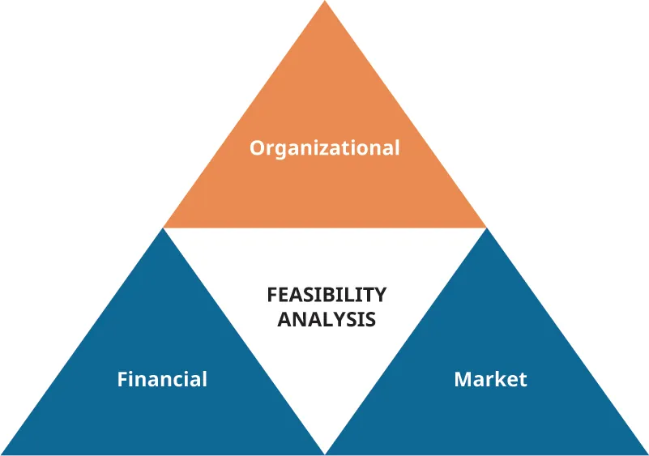
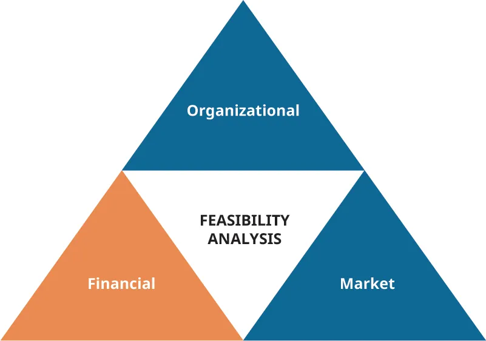
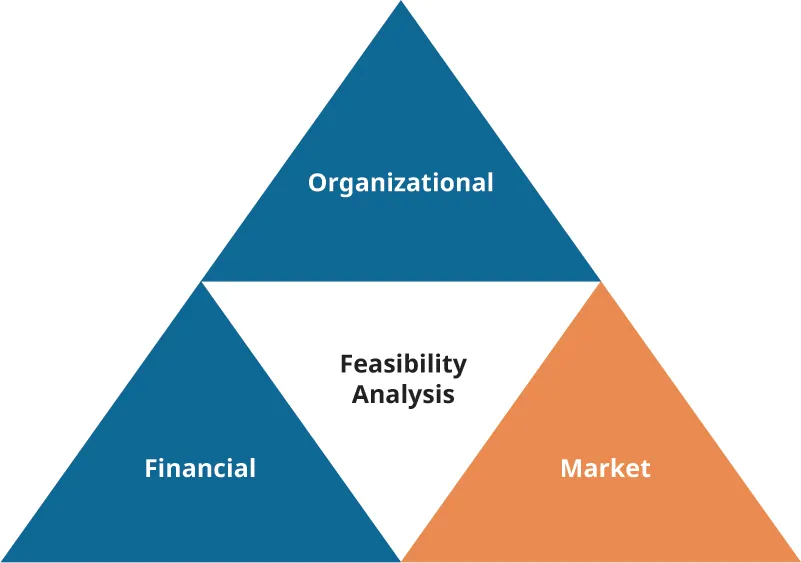

## 11.3   Tiến hành phân tích tính khả thi

> **🎯 Mục tiêu học tập**
>
> Đến cuối phần này, bạn sẽ có thể:
>
> - Mô tả mục đích của phân tích tính khả thi
> - Mô tả và xây dựng các phần của phân tích tính khả thi
> - Hiểu cách áp dụng kết quả tính khả thi cho một dự án mới

Đúng như tên gọi, **phân tích tính khả thi** được thiết kế để đánh giá xem nỗ lực khởi nghiệp của bạn trên thực tế có khả thi hay không. Bằng cách đánh giá đội ngũ quản lý, xem xét thị trường cho ý tưởng của bạn, ước tính tính khả thi tài chính và xác định các trở ngại tiềm ẩn, bạn có thể đưa ra lựa chọn có cơ sở về khả năng thực hiện dự án khởi nghiệp của mình. Phân tích tính khả thi chủ yếu dựa trên các con số và có thể đi sâu hơn nhiều so với **kế hoạch kinh doanh** (được thảo luận trong phần [The Business Plan](11-4-the-business-plan)). Cuối cùng, nó kiểm nghiệm tính sống được của một ý tưởng, một dự án hoặc một doanh nghiệp mới. Nghiên cứu tính khả thi có thể trở thành nền tảng cho kế hoạch kinh doanh, tức tài liệu phác thảo các bước hành động cần thiết để đưa một đề xuất từ giai đoạn hình thành ý tưởng đến hiện thực hóa. Nghiên cứu tính khả thi giúp doanh nghiệp giải quyết câu hỏi sẽ hoạt động ở đâu và như thế nào, đối thủ cạnh tranh là ai, những trở ngại có thể gặp và nguồn vốn cần thiết để bắt đầu. Sau đó, kế hoạch kinh doanh cung cấp một khuôn khổ như tấm bản đồ để theo đuổi và triển khai tầm nhìn khởi nghiệp.

### Phân tích tính khả thi về tổ chức

Tính khả thi về tổ chức nhằm đánh giá năng lực của bộ máy quản lý và mức độ đầy đủ của nguồn lực để đưa một sản phẩm hoặc ý tưởng ra thị trường [Hình 11.12](11-3-conducting-a-feasibility-analysis#OSX_Eship_11_03_OrgFeas). Công ty nên đánh giá năng lực của đội ngũ quản lý ở cả khía cạnh quan tâm lẫn thực thi. Các thước đo điển hình về năng lực quản lý bao gồm đánh giá đam mê của nhà sáng lập đối với ý tưởng kinh doanh, cùng với chuyên môn ngành, nền tảng học vấn và kinh nghiệm nghề nghiệp. Các nhà sáng lập nên trung thực khi tự xếp hạng mình theo những phương diện này.

*Hình 11.12: Phân tích tính khả thi về tổ chức tập trung vào nhu cầu nguồn lực và năng lực quản lý. (ghi công: Bản quyền Rice University, OpenStax, theo giấy phép CC BY NC-SA 4.0)*

Mức độ đầy đủ của nguồn lực liên quan đến các nguồn lực phi tài chính mà dự án cần có để tiến lên thành công, và nhằm đánh giá liệu doanh nhân có sở hữu đủ các nguồn lực đó hay không. Tổ chức nên xếp hạng một cách nghiêm túc năng lực của mình trong sáu đến mười hai loại nguồn lực phi tài chính then chốt như: sự sẵn có của không gian văn phòng, chất lượng nguồn lao động, khả năng có được sự bảo hộ sở hữu trí tuệ (nếu áp dụng), mức độ sẵn lòng của nhân sự chất lượng cao khi gia nhập công ty, và khả năng hình thành các quan hệ đối tác chiến lược thuận lợi. Nếu phân tích cho thấy các nguồn lực cốt yếu còn thiếu, dự án có thể không khả thi theo kế hoạch hiện tại.[^46]

### Phân tích tính khả thi tài chính

**Phân tích tài chính** nhằm dự phóng doanh thu và chi phí (các dự báo này sẽ xuất hiện muộn hơn trong kế hoạch kinh doanh đầy đủ), xây dựng bức tranh tài chính và ước tính chi phí dự án, định giá và dự phóng dòng tiền [Hình 11.13](11-3-conducting-a-feasibility-analysis#OSX_Eship_11_03_FinFeas).

*Hình 11.13: Phân tích tính khả thi tài chính tập trung vào chi phí, dòng tiền và doanh thu dự phóng. (ghi công: Bản quyền Rice University, OpenStax, theo giấy phép CC BY NC-SA 4.0)*

Phân tích tài chính thường có thể bao gồm những mục sau:

- Dự phóng lãi lỗ trong mười hai tháng
- Dự phóng lãi lỗ trong ba hoặc bốn năm
- Dự phóng dòng tiền
- Bảng cân đối kế toán dự phóng
- Tính toán điểm hòa vốn

Phân tích tài chính nên ước tính doanh số hoặc doanh thu mà bạn kỳ vọng doanh nghiệp tạo ra. Có nhiều công thức và phương pháp khác nhau để tính ước tính doanh số. Bạn có thể dùng dữ liệu ngành hoặc dữ liệu hiệp hội để ước tính doanh số của doanh nghiệp tiềm năng của mình. Bạn cũng có thể tìm các doanh nghiệp tương tự ở những địa điểm tương tự để hình dung doanh nghiệp của mình có thể hoạt động ra sao so với kết quả của các đối thủ tương tự. Một phương trình thường dùng cho mô hình doanh số là nhân số khách hàng mục tiêu với doanh thu trung bình trên mỗi khách hàng để tạo lập dự phóng doanh số:

 T×A=S Khách hàng mục tiêuDoanh thu trung bình trên mỗi khách hàng×Dự phóng doanh số

Một phần then chốt khác trong việc lập kế hoạch cho chủ doanh nghiệp mới là hiểu **điểm hòa vốn**, tức mức hoạt động tạo ra đúng đủ doanh thu để bù đắp chi phí (xem [Entrepreneurial Finance and Accounting](9-introduction) để có phần thảo luận chi tiết về cách tính điểm hòa vốn và phân loại các loại chi phí). Nó không tạo ra lãi cũng không gây lỗ. Để tính điểm hòa vốn, trước tiên bạn phải hiểu hai loại chi phí: cố định và biến đổi. **Chi phí cố định** là những khoản chi không thay đổi theo lượng bán hàng. Tiền thuê là một ví dụ, nhưng hầu hết các chi phí khác của doanh nghiệp cũng vận hành theo cách này. Dù một số chi phí thay đổi theo từng tháng, chúng chỉ được gọi là biến đổi nếu sẽ tăng lên khi công ty bán thêm dù chỉ một đơn vị. Các chi phí như bảo hiểm, tiền lương và vật tư văn phòng thường được xem là chi phí cố định. **Chi phí biến đổi** dao động theo mức doanh thu bán hàng và bao gồm các khoản như nguyên vật liệu, hàng mua để bán lại và lao động trực tiếp. Với thông tin đó, bạn có thể tính điểm hòa vốn của mình, tức mức doanh số mà tại đó doanh nghiệp không lãi cũng không lỗ.[^47] Các dự phóng phải nhiều hơn các con số đơn thuần: hãy kèm theo phần giải thích những giả định nền tảng dùng để ước tính thu nhập và chi phí của dự án.

**Dòng tiền dự kiến** phác thảo các chi phí ban đầu, chi phí vận hành và các khoản dự trữ, về bản chất là bạn cần bao nhiêu trước khi khởi động công ty. Bạn cần xác định khi nào mình kỳ vọng nhận được tiền mặt và khi nào phải viết séc để chi trả chi phí. Dòng tiền được thiết kế để cho thấy vốn lưu động của bạn có đủ hay không. **Bảng cân đối kế toán** thể hiện tài sản và nợ phải trả, cần thiết cho báo cáo và quản trị tài chính. Khi lấy tài sản trừ đi nợ phải trả, phần còn lại là vốn chủ sở hữu. Các khái niệm và báo cáo tài chính được giới thiệu ở đây được thảo luận đầy đủ trong [Entrepreneurial Finance and Accounting](9-introduction).

### Phân tích tính khả thi thị trường

**Phân tích thị trường** cho phép bạn xác định đối thủ cạnh tranh và định lượng khách hàng mục tiêu và/hoặc người dùng trong thị trường thuộc ngành bạn chọn bằng cách phân tích mức độ quan tâm tổng thể của thị trường mục tiêu đối với sản phẩm hoặc dịch vụ trong ngành [Hình 11.14](11-3-conducting-a-feasibility-analysis#OSX_Eship_11_03_MarFeas). Bạn có thể định nghĩa thị trường theo quy mô, cấu trúc, triển vọng tăng trưởng, xu hướng và tiềm năng doanh số. Thông tin này giúp bạn định vị doanh nghiệp tốt hơn khi cạnh tranh giành thị phần. Sau khi xác định quy mô tổng thể của thị trường, bạn có thể xác định thị trường mục tiêu của mình, từ đó dẫn đến **tổng thị trường khả dụng (TAM)**, tức số lượng người dùng tiềm năng trong phạm vi ảnh hưởng của doanh nghiệp. Thị trường này có thể được phân khúc theo địa lý, thuộc tính khách hàng hoặc phân khúc theo sản phẩm. Từ TAM, bạn có thể tiếp tục chắt lọc phần của thị trường mục tiêu đó có khả năng bị doanh nghiệp của bạn thu hút. Phân khúc thị trường này được gọi là **thị trường khả dụng có thể phục vụ (SAM)**.

*Hình 11.14: Phân tích tính khả thi thị trường xem xét toàn bộ thị trường và tập trung vào phần thị phần mục tiêu được kỳ vọng. (ghi công: Bản quyền Rice University, OpenStax, theo giấy phép CC BY NC-SA 4.0)*

Việc dự phóng thị phần có thể mang tính chủ quan, không chỉ dựa trên phân tích thị trường mà còn dựa trên các chiến lược định giá, xúc tiến và phân phối. Cũng như doanh thu, bạn sẽ có trong tay nhiều dạng dự báo và công cụ khác nhau. Những nội dung khác bạn có thể đưa vào phân tích thị trường bao gồm đánh giá cạnh tranh đầy đủ, kết quả vận hành lịch sử của thị trường, thay đổi trong cung và cầu, và mức tăng trưởng nhu cầu được dự báo theo thời gian.

> **❓ Bạn đã sẵn sàng chưa?: Phân tích tính khả thi thị trường**
>
> Bạn được một chuỗi khách sạn hàng đầu thuê để xác định tiềm năng thị trường và tài chính cho việc phát triển một bất động sản đa chức năng, trong đó có một khách sạn đầy đủ dịch vụ tại trung tâm Orlando, tọa lạc ở số 425 East Central Boulevard, Orlando, Florida. Địa chỉ cụ thể rất quan trọng để bạn có thể xác định đối thủ hiện có và mức độ phù hợp tổng thể của địa điểm. Hãy sử dụng thông tin đã cho để thực hiện một phân tích thị trường có thể trở thành một phần của nghiên cứu tính khả thi lớn hơn.

> **📝 Thực hành: Tính khả thi về địa điểm**
>
> 
>
> *Hình 11.15: Nếu bạn muốn mở doanh nghiệp ở trung tâm Atlanta, bạn sẽ cần nghiên cứu tính khả thi của việc vận hành một địa điểm tại đó. (nguồn: “Atlanta,Georgia,downtown skyline,dusk” của “tableatny”/Flickr, CC BY 2.0)*
>
>
>
> Bạn đang cân nhắc mở một cửa hàng quần áo boutique ở trung tâm Atlanta. Bạn đã đọc các bản tin nói về việc khu trung tâm Atlanta và bản thân thành phố đang phát triển và thay đổi so với những thập kỷ trước. Với những dự án phát triển mới đang diễn ra tại đó, bạn chưa chắc một dự án như vậy có khả thi hay không. Hãy phác thảo những bước bạn cần thực hiện để tiến hành một nghiên cứu tính khả thi nhằm xác định liệu trung tâm Atlanta có phải là địa điểm phù hợp cho cửa hàng quần áo mà bạn dự định mở hay không.

### Áp dụng kết quả phân tích tính khả thi

Sau khi thực hiện phân tích tính khả thi, bạn phải xác định có tiếp tục dự án hay không. Một kỹ thuật thường được dùng trong quản lý dự án được gọi là **quyết định tiếp tục hoặc dừng**. Công cụ này cho phép một nhóm quyết định xem các tiêu chí để tiếp tục dự án đã được đáp ứng hay chưa. Các tiêu chí làm căn cứ ra quyết định được thiết lập và theo dõi theo thời gian. Bạn có thể xây dựng tiêu chí cho từng phần của phân tích tính khả thi để xác định có nên tiếp tục hay không, rồi đánh giá những tiêu chí đó theo hướng “go” hoặc “no go”, dùng kết quả đó để đưa ra nhận định cuối cùng về tính khả thi tổng thể của ý tưởng. Hãy xác định xem bạn có đủ thoải mái để tiếp tục với đội ngũ quản lý hiện tại hay không, liệu bạn có thể “đi tiếp” với các nguồn lực phi tài chính hiện có hay không, liệu triển vọng tài chính dự phóng có đáng để tiếp tục hay không, và đưa ra kết luận về thị trường cũng như ngành. Nếu bạn hài lòng rằng có đủ tiêu chí “go” được đáp ứng, bước tiếp theo có khả năng sẽ là phát triển chiến lược của mình dưới dạng một kế hoạch kinh doanh.

> **🛠️ Bạn có thể làm gì?: Love Beyond Walls**
>
> Khi Terence **Lester** nhìn thấy một người đàn ông vô gia cư sống phía sau một tòa nhà bỏ hoang, xuống cấp, ông hỏi người đó liệu ông có thể chở anh ta đến một nơi trú ẩn không. Người đàn ông cười nhạt và đáp rằng Lester nên thử ngủ trong nơi trú ẩn đó đi. Và ông đã làm vậy, nhờ đó nhìn thấy vấn đề từ góc nhìn của người vô gia cư. Nơi trú ẩn đông đúc và có mùi khó chịu. Bạn gần như không thể ngủ được vì người khác có thể tìm cách lấy cắp những vật dụng ít ỏi của bạn. Tòa nhà xuống cấp kia lại mang đến sự tách biệt khỏi người khác, đồng thời tạo ra sự yên tĩnh và cảm giác an toàn theo cách riêng mà nơi trú ẩn không thể có. Trải nghiệm này khiến Lester tự nguyện sống như một người vô gia cư trong vài tuần. Hành trình đó đã dẫn ông đến việc tạo ra **Love Beyond Walls** ([www.lovebeyondwalls.org](https://www.lovebeyondwalls.org)), một tổ chức hỗ trợ người vô gia cư cùng nhiều mục tiêu khác. Lester không tiến hành một nghiên cứu tính khả thi chính thức, nhưng ông đã làm điều đó theo cách không chính thức bằng việc thực sự bước vào hoàn cảnh của khách hàng mục tiêu của mình. Một nghiên cứu tính khả thi về tình trạng vô gia cư trong một khu vực cụ thể có thể mang lại những phát hiện bất ngờ, từ đó dẫn đến các dự án khởi nghiệp xã hội.
>
>
> - Theo bạn, nguyên nhân xã hội nào có thể hưởng lợi từ một nghiên cứu tính khả thi chính thức xoay quanh một giải pháp khởi nghiệp tiềm năng?
