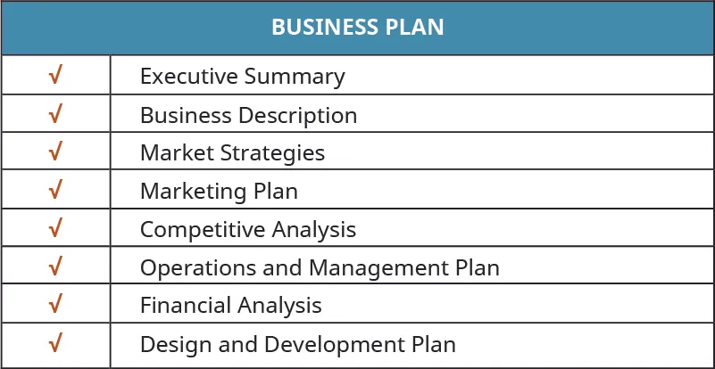
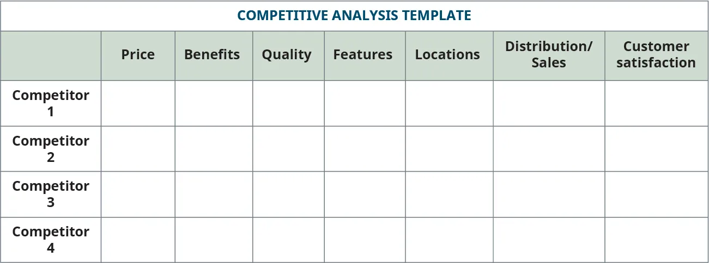
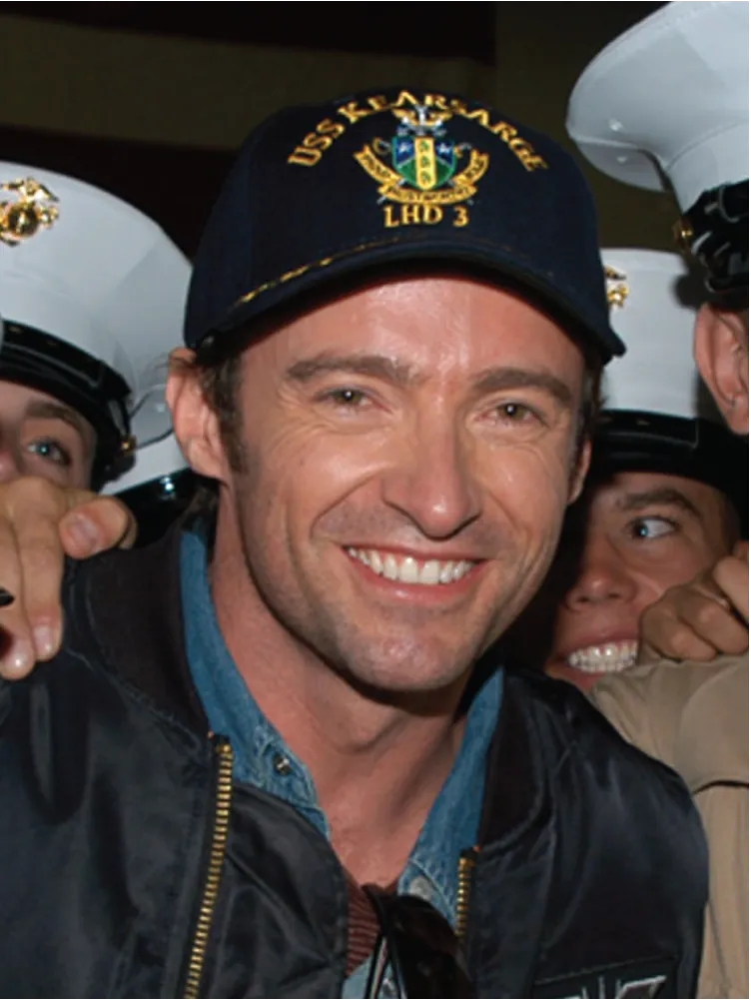

## 11.4 Kế hoạch kinh doanh

> **🎯 Mục tiêu học tập**
>
> Đến cuối phần này, bạn sẽ có thể:
>
> - Mô tả các mục đích khác nhau của kế hoạch kinh doanh
> - Mô tả và xây dựng các thành phần của kế hoạch kinh doanh ngắn
> - Mô tả và xây dựng các thành phần của kế hoạch kinh doanh đầy đủ

Không giống những định dạng ngắn hoặc tinh gọn đã được giới thiệu trước đó, **kế hoạch kinh doanh** là một tài liệu chính thức dùng cho việc hoạch định dài hạn hoạt động của công ty. Tài liệu này thường bao gồm thông tin nền, thông tin tài chính và phần tóm tắt doanh nghiệp. Các nhà đầu tư gần như luôn yêu cầu một kế hoạch kinh doanh chính thức vì đây là phần không thể tách rời trong quá trình họ đánh giá có nên đầu tư vào công ty hay không. Dù trong kinh doanh không có gì là vĩnh viễn, kế hoạch kinh doanh thường có những thành phần “cố định” hơn so với **canvas mô hình kinh doanh**, vốn thường được dùng như bước đầu của quá trình lập kế hoạch và xuyên suốt các giai đoạn đầu của một doanh nghiệp còn non trẻ. Kế hoạch kinh doanh có xu hướng mô tả doanh nghiệp và ngành, chiến lược thị trường, tiềm năng doanh số và phân tích cạnh tranh, cũng như các mục tiêu và định hướng dài hạn của công ty. Một kế hoạch kinh doanh chính thức, đi sâu hơn, thường sẽ xuất hiện ở các giai đoạn sau, sau nhiều vòng lặp của business model canvas. Kế hoạch kinh doanh thường dự phóng dữ liệu tài chính trong ba năm và thường được các ngân hàng hoặc nhà đầu tư khác yêu cầu để cấp vốn. Kế hoạch kinh doanh là bản đồ đường đi cho công ty trong nhiều năm.

Một số doanh nhân thích sử dụng quy trình canvas thay cho kế hoạch kinh doanh, trong khi số khác lại dùng một phiên bản ngắn hơn của kế hoạch kinh doanh và nộp cho nhà đầu tư sau vài vòng lặp. Cũng có những doanh nhân dùng kế hoạch kinh doanh sớm hơn trong quá trình khởi nghiệp, hoặc trước canvas, hoặc song song với canvas. Ví dụ, Chris **Guillebeau** có một mẫu kế hoạch kinh doanh một trang trong cuốn *The $100 Startup*.[^48] Phiên bản của ông về cơ bản là phần mở rộng của một bản phác trên khăn giấy nhưng thiếu độ chi tiết của một kế hoạch kinh doanh đầy đủ. Khi tiến triển, bạn cũng có thể cân nhắc một kế hoạch kinh doanh ngắn (khoảng hai trang) nếu muốn hỗ trợ việc ra mắt doanh nghiệp nhanh, và/hoặc một kế hoạch kinh doanh tiêu chuẩn.

Cũng như nhiều khía cạnh khác của khởi nghiệp, không có những quy tắc cứng nhắc và tuyệt đối để đạt được thành công khởi nghiệp. Bạn có thể gặp những người khác nhau muốn những thứ khác nhau (canvas, bản tóm tắt, kế hoạch kinh doanh đầy đủ), và bạn cũng có sự linh hoạt để theo đuổi công cụ nào phù hợp nhất với mình. Cũng như canvas, các phiên bản khác nhau của kế hoạch kinh doanh đều là những công cụ hỗ trợ bạn trong nỗ lực khởi nghiệp.

### Tổng quan về kế hoạch kinh doanh

Phần lớn kế hoạch kinh doanh có một số mục riêng biệt ([Hình 11.16](11-4-the-business-plan#OSX_Eship_11_03_BPlan)). Kế hoạch kinh doanh có thể dài từ vài trang đến hai mươi lăm trang hoặc hơn, tùy thuộc vào mục đích và đối tượng người đọc. Trong phần thảo luận này, chúng ta sẽ mô tả một kế hoạch kinh doanh ngắn và một kế hoạch kinh doanh tiêu chuẩn. Nếu bạn có thể thiết kế business model canvas thành công, thì bạn sẽ có nền tảng để phát triển một kế hoạch kinh doanh rõ ràng có thể nộp để được xem xét về tài chính.

*Hình 11.16: Phần lớn kế hoạch kinh doanh đều bao gồm những phần quan trọng giống nhau. (ghi công: Bản quyền Rice University, OpenStax, theo giấy phép CC BY NC-SA 4.0)*

Cả hai loại kế hoạch kinh doanh đều nhằm cung cấp một bức tranh và một lộ trình để đi từ ý tưởng đến hiện thực. Nếu bạn chọn kế hoạch kinh doanh ngắn, bạn sẽ chủ yếu tập trung vào việc trình bày một cái nhìn tổng thể về khái niệm kinh doanh của mình.

Kế hoạch kinh doanh đầy đủ hướng đến việc thực thi tầm nhìn, xử lý những chi tiết vốn thường là phần khó nhất. Việc xây dựng một kế hoạch kinh doanh đầy đủ sẽ hỗ trợ những người cần một lộ trình chi tiết và có cấu trúc hơn, hoặc những người có ít hay không có nền tảng về kinh doanh. Quá trình lập kế hoạch kinh doanh bao gồm mô hình kinh doanh, phân tích tính khả thi và kế hoạch kinh doanh đầy đủ, nội dung mà chúng ta sẽ bàn sâu hơn ở phần sau của mục này. Tiếp theo, chúng ta xem xét cách một kế hoạch kinh doanh có thể đáp ứng nhiều nhu cầu khác nhau.

### Mục đích của kế hoạch kinh doanh

Kế hoạch kinh doanh có thể phục vụ nhiều mục đích khác nhau, có mục đích nội bộ, có mục đích đối ngoại. Như đã bàn trước đó, bạn có thể dùng kế hoạch kinh doanh như một công cụ lập kế hoạch nội bộ ở giai đoạn sớm, như phần mở rộng của một bản phác trên khăn giấy, và như bước tiếp nối của một trong các công cụ canvas. Kế hoạch kinh doanh có thể là một **lộ trình tổ chức**, tức một công cụ lập kế hoạch nội bộ và kế hoạch làm việc mà bạn áp dụng cho doanh nghiệp để đạt những mục tiêu mong muốn trong vài năm. Kế hoạch kinh doanh nên do chính chủ sở hữu của dự án viết ra, vì điều đó buộc họ phải trực tiếp xem xét hoạt động kinh doanh và giúp họ tập trung vào những khu vực cần cải thiện.

Hãy nhất quán nhắc đến dự án kinh doanh trong toàn bộ tài liệu. Nói chung, kế hoạch kinh doanh không nên được viết ở ngôi thứ nhất.

Một mục đích đối ngoại quan trọng của kế hoạch kinh doanh là như một công cụ đầu tư, phác thảo các dự báo tài chính và trở thành tài liệu được thiết kế để thu hút nhà đầu tư. Trong nhiều trường hợp, kế hoạch kinh doanh có thể bổ trợ cho bài pitch chính thức dành cho nhà đầu tư. Trong bối cảnh này, kế hoạch kinh doanh là một kế hoạch trình bày, hướng đến đối tượng bên ngoài có thể quen hoặc không quen với ngành, doanh nghiệp và đối thủ cạnh tranh của bạn.

Bạn cũng có thể dùng kế hoạch kinh doanh như một kế hoạch dự phòng bằng cách phác thảo một số kịch bản “điều gì xảy ra nếu” và khám phá cách bạn có thể phản ứng nếu các kịch bản đó diễn ra. **Pretty Young Professional** ra mắt vào tháng 11 năm 2010 như một nguồn tài nguyên trực tuyến nhằm dẫn dắt một thế hệ nữ lãnh đạo mới nổi. Trang web tập trung vào các nữ sinh viên mới tốt nghiệp đại học và sinh viên đang tìm kiếm vai trò nghề nghiệp chuyên môn, cùng những người đang ở những vị trí chuyên môn đầu tiên của mình. Nó được thành lập bởi bốn người bạn, vốn là đồng nghiệp tại hãng tư vấn toàn cầu McKinsey. Nhưng sau khi vị trí và tỷ lệ sở hữu được quyết định giữa họ, những khác biệt cơ bản trong quan điểm về định hướng kinh doanh đã xuất hiện giữa hai phe, theo lời đồng sáng lập kiêm cựu CEO Kathryn **Minshew**. “Tôi nghĩ, một cách ngây thơ, rằng nếu chúng tôi cứ trì hoãn xử lý một số chuyện đó thì rồi chúng tôi cũng sẽ giải quyết được,” Minshew nói. Sau này Minshew tiếp tục sáng lập một trang nghề nghiệp khác là **The Muse** và mang theo phần lớn đội ngũ biên tập của Pretty Young Professional.[^49] Trong khi việc lập kế hoạch tốt hơn có thể đã ngăn được sự sụp đổ sớm của Pretty Young Professional, thì một thay đổi trong kế hoạch lại dẫn đến thành công gần như qua đêm cho Joshua **Esnard** và đội ngũ **The Cut Buddy**. Esnard đã phát minh và đăng ký bằng sáng chế cho khuôn nhựa cắt tóc mà anh bán trực tuyến từ gara ở Fort Lauderdale trong khi vẫn làm một công việc toàn thời gian. Doanh số của công ty từng gặp khó khăn trước khi một người bạn thách thức các giả định của anh và thuyết phục anh tập trung vào nhóm khách hàng và kênh khác. Sau đó, công ty thu hút được sự chú ý toàn quốc thông qua *Shark Tank*.

> **🔗 Liên kết học tập**
>
> Hãy xem [video nhà sáng lập Cut Buddy, Joshua Esnard, kể câu chuyện công ty của mình](https://openstax.org/l/52CutBuddy) để tìm hiểu thêm.

Nếu bạn chọn kế hoạch kinh doanh ngắn, bạn sẽ chủ yếu tập trung vào việc trình bày bức tranh tổng thể của khái niệm kinh doanh. Phiên bản này được dùng để thu hút nhà đầu tư tiềm năng, nhân viên và các bên liên quan khác; nó sẽ bao gồm một “hộp” tóm tắt tài chính, nhưng cần có tuyên bố miễn trừ trách nhiệm, và người sáng lập/doanh nhân có thể cần yêu cầu những người nhận tài liệu ký **thỏa thuận bảo mật (NDA)**. Kế hoạch kinh doanh đầy đủ hướng đến việc thực thi tầm nhìn, cung cấp các chi tiết hỗ trợ, và sẽ được các tổ chức tài chính cùng những đối tượng khác yêu cầu khi họ chính thức trở thành các bên liên quan trong dự án. Cả hai đều nhằm cung cấp một bức tranh và một lộ trình để đi từ hình thành ý tưởng đến hiện thực hóa.

### Các loại kế hoạch kinh doanh

Kế hoạch kinh doanh ngắn tương tự như một bản tóm tắt điều hành mở rộng từ kế hoạch kinh doanh đầy đủ. Tài liệu súc tích này cung cấp cái nhìn rộng về khái niệm khởi nghiệp của bạn, các thành viên trong đội ngũ, cách và lý do bạn sẽ triển khai kế hoạch của mình, cũng như vì sao chính bạn là người phù hợp để làm điều đó. Bạn có thể xem kế hoạch kinh doanh ngắn như phần mở cảnh, hoặc vì chương này bắt đầu bằng một liên hệ đến điện ảnh, như trailer của bộ phim đầy đủ. Kế hoạch kinh doanh ngắn là phiên bản thương mại tương đương với trailer của *Field of Dreams*, còn kế hoạch đầy đủ là tương đương với bộ phim trọn vẹn.

#### Kế hoạch kinh doanh ngắn hoặc tóm tắt điều hành

Đúng như tên gọi, **kế hoạch kinh doanh ngắn** hoặc **tóm tắt điều hành** tóm lược những yếu tố then chốt của toàn bộ kế hoạch kinh doanh, chẳng hạn ý tưởng kinh doanh, đặc điểm tài chính và vị thế kinh doanh hiện tại. Phiên bản tóm tắt điều hành của kế hoạch kinh doanh là cơ hội để bạn trình bày một cách bao quát khái niệm tổng thể và tầm nhìn của công ty cho chính mình, cho các nhà đầu tư tiềm năng, và cho nhân viên hiện tại cũng như tương lai.

Một bản tóm tắt điều hành điển hình thường không dài quá một trang, nhưng bởi vì kế hoạch kinh doanh ngắn về cơ bản là một bản tóm tắt điều hành mở rộng, phần tóm tắt điều hành lại trở nên vô cùng quan trọng. Đây chính là “đề nghị” gửi tới nhà đầu tư. Bạn nên bắt đầu bằng cách nêu rõ mình đang yêu cầu điều gì trong phần tóm tắt này.

Ở giai đoạn khái niệm kinh doanh, bạn sẽ mô tả doanh nghiệp, sản phẩm và thị trường của nó. Hãy mô tả phân khúc khách hàng mà doanh nghiệp phục vụ và vì sao công ty của bạn có lợi thế cạnh tranh. Phần này có thể tương ứng tương đối với các phần phân khúc khách hàng và đề xuất giá trị trong một canvas.

Tiếp theo, hãy làm nổi bật các đặc điểm tài chính quan trọng, bao gồm doanh số, lợi nhuận, dòng tiền và tỷ suất hoàn vốn. Tương tự phần tài chính của phân tích tính khả thi, thành phần phân tích tài chính trong kế hoạch kinh doanh thường có thể bao gồm các mục như dự phóng lãi lỗ 12 tháng, dự phóng lãi lỗ 3 hoặc 4 năm, dự phóng dòng tiền, bảng cân đối kế toán dự phóng và tính toán điểm hòa vốn. Bạn có thể tìm hiểu nghiên cứu tính khả thi và các dự báo tài chính sâu hơn trong kế hoạch kinh doanh chính thức. Ở đây, bạn muốn tập trung vào bức tranh lớn của các con số và ý nghĩa của chúng.

Phần vị thế kinh doanh hiện tại có thể cung cấp những thông tin liên quan về bạn, các thành viên trong đội ngũ và toàn bộ công ty. Đây là cơ hội để bạn kể câu chuyện về cách thành lập công ty, mô tả tình trạng pháp lý của nó (hình thức hoạt động), và liệt kê những nhân sự chủ chốt. Trong một phần của bản tóm tắt điều hành mở rộng, bạn có thể trình bày lý do bắt đầu kinh doanh: đây là cơ hội để xác định rõ những nhu cầu mà bạn nghĩ mình có thể đáp ứng và có thể đi sâu vào những nỗi đau cũng như lợi ích của khách hàng. Bạn cũng có thể cung cấp bản tóm tắt về định hướng chiến lược tổng thể mà bạn dự định dẫn dắt công ty đi theo. Hãy mô tả sứ mệnh, tầm nhìn, mục tiêu và chỉ tiêu của công ty, mô hình kinh doanh tổng thể, và đề xuất giá trị của công ty.

Cuộc thi Student Business Plan Competition của Rice University, một trong những cuộc thi kế hoạch kinh doanh dành cho học viên cao học lớn nhất và được đánh giá cao nhất nói chung (xem [Telling Your Entrepreneurial Story and Pitching the Idea](7-introduction)), yêu cầu nộp bản tóm tắt điều hành dài tối đa năm trang để tham gia.[^51][^,][^52] Các phần gợi ý của cuộc thi được thể hiện trong [Bảng 11.2](11-4-the-business-plan#fs-idm353643616).

**Bảng 11.2: Các thành phần tóm tắt điều hành gợi ý cho cuộc thi kế hoạch kinh doanh của Rice University53**

| Phần | Mô tả |
| --- | --- |
| Tóm tắt công ty | Tổng quan ngắn (một đến hai đoạn) về vấn đề, giải pháp và khách hàng tiềm năng |
| Phân tích khách hàng | Mô tả khách hàng tiềm năng và bằng chứng cho thấy họ sẽ mua sản phẩm |
| Phân tích thị trường | Quy mô thị trường, thị trường mục tiêu và thị phần |
| Sản phẩm hoặc dịch vụ | Tình trạng phát triển hiện tại của sản phẩm và bằng chứng cho thấy nó khả thi |
| Sở hữu trí tuệ | Nếu áp dụng, thông tin về bằng sáng chế, giấy phép hoặc các tài sản sở hữu trí tuệ khác |
| Khác biệt cạnh tranh | Mô tả đối thủ cạnh tranh và lợi thế cạnh tranh của bạn |
| Nhà sáng lập công ty, đội ngũ quản lý và/hoặc cố vấn | Tiểu sử của các nhân sự chủ chốt thể hiện chuyên môn và kinh nghiệm liên quan của họ |
| Tài chính | Dự phóng doanh thu, lợi nhuận và dòng tiền trong ba đến năm năm |
| Số tiền đầu tư | Yêu cầu vốn và cách sử dụng nguồn vốn |

> **❓ Bạn đã sẵn sàng chưa?: Tạo một kế hoạch kinh doanh ngắn**
>
> Hãy điền một canvas do bạn lựa chọn cho một startup nổi tiếng như Uber, Netflix, Dropbox, Etsy, Airbnb, Bird/Lime, Warby Parker, hoặc bất kỳ công ty nào xuất hiện trong chương này hay một công ty bạn tự chọn. Sau đó, hãy tạo một kế hoạch kinh doanh ngắn cho doanh nghiệp đó. Hãy xem liệu bạn có thể tìm được một phiên bản bản tóm tắt điều hành, kế hoạch kinh doanh hoặc canvas thực tế của công ty hay không. So sánh và đối chiếu góc nhìn của bạn với những gì công ty đã trình bày.
>
>
> - Những công ty này đã rất vững chắc, nhưng liệu có thành phần nào trong sơ đồ bạn xây dựng mà bạn sẽ khuyên công ty nên thay đổi để đảm bảo khả năng duy trì trong tương lai không?
> - Hãy lập một kế hoạch dự phòng cho kịch bản “điều gì xảy ra nếu” trong đó một khía cạnh then chốt của công ty hoặc môi trường hoạt động của nó bị thay đổi mạnh mẽ.

#### Kế hoạch kinh doanh đầy đủ

Ngay cả kế hoạch kinh doanh đầy đủ cũng có thể khác nhau về độ dài, quy mô và phạm vi. Rice University đặt giới hạn mười trang cho các kế hoạch kinh doanh nộp vào vòng thi đầy đủ. **IndUS Entrepreneurs**, một trong những mạng lưới doanh nhân toàn cầu lớn nhất, cũng tổ chức các cuộc thi kế hoạch kinh doanh cho sinh viên thông qua chương trình Tie Young Entrepreneurs. Trái lại, các kế hoạch kinh doanh nộp cho cuộc thi đó thường có thể dài tới hai mươi lăm trang. Đây chỉ là hai ví dụ. Một số thành phần có thể khác đôi chút, nhưng các yếu tố chung thường xuất hiện trong dàn ý chính thức của kế hoạch kinh doanh. Phần tiếp theo sẽ cung cấp các thành phần mẫu của một kế hoạch kinh doanh đầy đủ cho một doanh nghiệp hư cấu.

#### Tóm tắt điều hành

**Bản tóm tắt điều hành** nên cung cấp cái nhìn tổng quan về doanh nghiệp của bạn cùng những điểm và vấn đề then chốt. Vì phần tóm tắt được tạo ra để tóm lược toàn bộ tài liệu, tốt nhất nên viết phần này sau cùng, dù nó đứng đầu về trình tự. Văn phong trong phần này cần đặc biệt cô đọng. Người đọc phải có thể hiểu nhu cầu và năng lực của bạn ngay từ cái nhìn đầu tiên. Phần này nên cho người đọc biết bạn muốn gì và “đề nghị” của bạn phải được nêu rõ trong phần tóm tắt.

Hãy mô tả doanh nghiệp, sản phẩm hoặc dịch vụ của nó, và nhóm khách hàng mục tiêu. Giải thích cái gì sẽ được bán, sẽ bán cho ai, và doanh nghiệp có những lợi thế cạnh tranh nào. [Bảng 11.3](11-4-the-business-plan#fs-idm366618080) cho thấy một ví dụ tóm tắt điều hành cho công ty hư cấu La Vida Lola.

**Bảng 11.3: Tóm tắt điều hành cho La Vida Lola**

| Thành phần của tóm tắt điều hành | Nội dung |
| --- | --- |
| Khái niệm | La Vida Lola là một xe bán đồ ăn phục vụ những món ăn Mỹ Latin và Caribbean ngon nhất trong khu vực Atlanta, đặc biệt là các món Puerto Rico và Cuba, với phong cách lễ hội đặc trưng. La Vida Lola cung cấp những món ăn được chuẩn bị tươi mới từ căn bếp di động của đầu bếp sáng lập kiêm người đặt tên Lola Gonzalez, người sinh ra tại Duluth, Georgia và đã trở về quê nhà để khởi động dự án đầu tiên sau khi làm việc dưới quyền một số đầu bếp hàng đầu thế giới. La Vida Lola sẽ phục vụ tại các lễ hội, công viên, văn phòng, sự kiện cộng đồng, sự kiện thể thao và các nhà máy bia trong toàn khu vực. |
| Lợi thế thị trường | Ẩm thực Latin đậm đà hương vị và phong cách là điểm hấp dẫn chính của La Vida Lola. Những hương vị thấm đẫm văn hóa Mỹ Latin và Caribbean có thể được thưởng thức từ thực đơn gồm món ăn đường phố, sandwich và các món ăn đích thực bắt nguồn từ gốc gác Puerto Rico và Cuba của gia đình Gonzalez.*Những người yêu ẩm thực thế hệ millennial* đang tìm kiếm trải nghiệm món ăn sắc tộc và *những người yêu món Latin* là nhóm khách hàng chính, nhưng bất kỳ ai yêu thích những bữa ăn nhà làm ngon miệng ở Atlanta đều có thể đặt mua. Việc một người bản địa khu vực Atlanta trở về quê hương sau khi làm việc tại các nhà hàng trên khắp thế giới để chia sẻ món ăn với cộng đồng địa phương tạo nên lợi thế cạnh tranh cho La Vida Lola dưới hình thức đầu bếp sáng lập Lola Gonzalez. |
| Tiếp thị | Dự án sẽ áp dụng chiến lược tiếp thị tập trung. Hỗn hợp xúc tiến của công ty sẽ bao gồm quảng cáo, khuyến mãi bán hàng, quan hệ công chúng và bán hàng cá nhân. Phần lớn hoạt động xúc tiến sẽ tập trung vào mạng xã hội song ngữ. |
| Đội ngũ dự án | Hai thành viên sáng lập của đội ngũ quản lý có tổng cộng gần bốn thập kỷ kinh nghiệm trong ngành nhà hàng và khách sạn. Nền tảng của họ bao gồm kinh nghiệm về thực phẩm và đồ uống, khách sạn và du lịch, kế toán, tài chính và xây dựng doanh nghiệp. |
| Nhu cầu vốn | La Vida Lola đang tìm kiếm 50.000 đô la vốn khởi nghiệp để triển khai xe bán đồ ăn tại khu vực Atlanta. Thêm 20.000 đô la nữa sẽ được huy động thông qua chiến dịch gọi vốn cộng đồng dựa trên quyên góp. Dự án có thể đi vào hoạt động trong vòng sáu tháng đến một năm. |

#### Mô tả doanh nghiệp

Phần này mô tả ngành, sản phẩm, doanh nghiệp và các yếu tố thành công. Nó nên cung cấp triển vọng hiện tại cũng như các xu hướng và diễn biến tương lai. Bạn cũng nên đề cập đến sứ mệnh, tầm nhìn, mục tiêu và chỉ tiêu của công ty. Hãy tóm tắt định hướng chiến lược tổng thể, lý do bạn bắt đầu doanh nghiệp, mô tả sản phẩm và dịch vụ, mô hình kinh doanh và đề xuất giá trị của công ty. Hãy cân nhắc bao gồm mã **Standard Industrial Classification/North American Industry Classification System (SIC/NAICS)** để xác định ngành và đảm bảo nhận diện đúng. Ngành không chỉ giới hạn ở nơi doanh nghiệp đặt trụ sở và hoạt động, mà còn nên bao quát động lực quốc gia và toàn cầu. [Bảng 11.4](11-4-the-business-plan#fs-idm329591776) cho thấy một ví dụ về mô tả doanh nghiệp cho La Vida Lola.

**Bảng 11.4: Mô tả doanh nghiệp cho La Vida Lola**

| Mô tả doanh nghiệp | La Vida Lola sẽ hoạt động trong ngành dịch vụ ẩm thực di động, được nhận diện bởi mã SIC 5812 Eating Places và mã NAICS 722330 Mobile Food Services, gồm các cơ sở chủ yếu chuẩn bị và phục vụ bữa ăn cũng như đồ ăn nhẹ để tiêu dùng ngay từ phương tiện có động cơ hoặc xe đẩy không động cơ.Lấy cảm hứng dân tộc học để phục vụ nhóm người tiêu dùng khao khát những món ăn Latin đậm gia vị hơn, La Vida Lola là một xe bán đồ ăn trong khu vực Atlanta chuyên về ẩm thực Latin, đặc biệt là các món Puerto Rico và Cuba gắn với cội nguồn của đầu bếp sáng lập kiêm người đặt tên, Lola Gonzalez.La Vida Lola hướng tới việc lan tỏa niềm đam mê với ẩm thực Latin trong các cộng đồng địa phương thông qua những món ăn đậm hương vị, được chế biến tươi mới trong một khu vực vốn đã đón nhận ẩm thực quốc tế. Thông qua căn bếp di động của mình, La Vida Lola dự định xuất hiện tại các công viên, lễ hội, tòa nhà văn phòng, nhà máy bia, và các sự kiện thể thao cũng như cộng đồng khắp vùng đô thị Atlanta mở rộng. Khả năng tăng trưởng trong tương lai nằm ở việc mở rộng số lượng xe bán đồ ăn, tích hợp giao đồ ăn theo yêu cầu, và bổ sung một quầy ẩm thực tại chợ thực phẩm địa phương.Sau một thập kỷ làm việc tại những nhà hàng danh tiếng, gần đây nhất là dưới quyền đầu bếp nổi tiếng José Andrés, đầu bếp Lola Gonzalez đã trở về quê nhà Duluth, Georgia để bắt đầu dự án riêng. Dù được đào tạo bài bản bởi những đầu bếp hàng đầu thế giới, chính những món ăn Puerto Rico và Cuba đích thực do ông bà cô nấu trong căn bếp gia đình mới là điều đã ảnh hưởng sâu sắc đến Gonzalez.Những nguyên liệu tươi ngon nhất từ chợ địa phương, các loại gia vị vùng đảo và sự tỉ mỉ của cô chính là tia lửa đã châm ngòi cho niềm đam mê nấu nướng của Lola. Theo tinh thần đó, cô mang những hương vị đậm chất văn hóa Mỹ Latin và Caribbean vào một thực đơn phong phú gồm đầy đủ món ăn đường phố, sandwich và các món ăn đích thực. Với mức giá hợp lý, La Vida Lola mang đến món ăn hấp dẫn nhiều nhóm khách hàng khác nhau, từ những người yêu ẩm thực thế hệ millennial đến người Latin bản địa và những cư dân địa phương khác có gốc gác Latin. |
| --- | --- |

### Phân tích ngành và chiến lược thị trường

Ở đây, bạn nên định nghĩa thị trường của mình theo quy mô, cấu trúc, triển vọng tăng trưởng, xu hướng và tiềm năng doanh số. Bạn sẽ muốn đưa vào **TAM** của mình và dự báo **SAM**. (Cả hai thuật ngữ này đều đã được thảo luận trong phần [Conducting a Feasibility Analysis](11-3-conducting-a-feasibility-analysis).) Đây là nơi để đề cập đến các chiến lược phân khúc thị trường theo địa lý, thuộc tính khách hàng hoặc định hướng sản phẩm. Hãy mô tả cách định vị của bạn so với đối thủ về giá, phân phối, kế hoạch xúc tiến và tiềm năng doanh số. [Bảng 11.5](11-4-the-business-plan#fs-idm331506384) cho thấy một ví dụ về phân tích ngành và chiến lược thị trường cho La Vida Lola.

**Bảng 11.5: Phân tích ngành và chiến lược thị trường cho La Vida Lola**

| Phân tích ngành và chiến lược thị trường | Theo báo cáo thường niên đầu tiên *Mobile Food Trends and Insights* của Off The Grid, một công ty có trụ sở ở San Francisco chuyên hỗ trợ các chợ ẩm thực trên toàn quốc, chỉ riêng ngành xe bán đồ ăn tại Hoa Kỳ được dự báo sẽ tăng gần 20 phần trăm, từ 800 triệu đô la năm 2017 lên 985 triệu đô la năm 2019. Trong khi đó, báo cáo của *IBISWorld* cho thấy ngành bán hàng rong có tốc độ tăng trưởng hằng năm 4,2 phần trăm để đạt 3,2 tỷ đô la vào năm 2018. Theo báo cáo của *IBISWorld*, các xe bán đồ ăn và người bán đồ ăn đường phố ngày càng đầu tư nhiều hơn vào món ăn chuyên biệt, dân tộc học đích thực và ẩm thực lai.Mặc dù báo cáo của *IBISWorld* dự báo nhu cầu sẽ chậm lại trong 5 năm tới, báo cáo này lưu ý rằng vẫn còn những cơ hội tăng trưởng bền vững ở các khu vực đô thị lớn. Ngành bán hàng rong là một điểm sáng đặc biệt trong toàn bộ lĩnh vực dịch vụ ăn uống rộng hơn.Ngành này đang ở giai đoạn tăng trưởng của vòng đời. Chi phí đầu tư ban đầu thấp để thiết lập một cơ sở mới đã cho phép nhiều cá nhân, đặc biệt là các đầu bếp chuyên môn đang muốn tự mở doanh nghiệp, sở hữu một xe bán đồ ăn thay vì mở hẳn một nhà hàng hoàn chỉnh. Báo cáo thường niên của Off the Grid cho biết khoản đầu tư ban đầu điển hình để mở một xe bán đồ ăn di động dao động từ 55.000 đến 75.000 đô la.Ngành nhà hàng chiếm 800 tỷ đô la doanh số trên toàn quốc, theo dữ liệu của National Restaurant Association. Các nhà hàng tại Georgia tạo ra tổng cộng 19,6 tỷ đô la trong năm 2017, theo số liệu của Georgia Restaurant Association.Có khoảng 12.000 nhà hàng tại vùng đô thị Atlanta. Khu vực Atlanta chiếm gần 60 phần trăm ngành nhà hàng của Georgia. SAM được ước tính vào khoảng 360 triệu đô la.Ngành ẩm thực di động/người bán hàng rong có thể được phân khúc theo loại khách hàng, loại ẩm thực (Mỹ, tráng miệng, Trung và Nam Mỹ, châu Á, pha trộn sắc tộc, Hy Lạp - Địa Trung Hải, hải sản), vị trí địa lý và loại hình (quầy thức ăn di động, quầy giải khát di động, quầy đồ ăn nhẹ di động, người bán rong thực phẩm, quầy nhượng quyền thực phẩm di động).Các ngành cạnh tranh thứ cấp bao gồm nhà hàng chuỗi, nhà hàng phục vụ đầy đủ tại một địa điểm, nhà thầu dịch vụ thực phẩm, đơn vị catering, nhà hàng thức ăn nhanh, và cửa hàng cà phê cùng đồ ăn nhẹ.Theo tờ *Atlanta Journal-Constitution*, nhật báo tại thị trường của La Vida Lola, những đối thủ xe bán đồ ăn hàng đầu gồm Bento Bus, Mix’d Up Burgers, Mac the Cheese, The Fry Guy và The Blaxican. Bento Bus định vị mình là một xe ẩm thực lấy cảm hứng từ Nhật Bản, sử dụng nguyên liệu hữu cơ và phục vụ bằng vật dụng thân thiện môi trường. The Blaxican định vị mình là nơi bán thứ mà họ gọi là “Mexican soul food,” tức sự pha trộn giữa món Mexico và comfort food miền Nam. Sau nhiều năm vận hành xe bán đồ ăn, The Blaxican gần đây còn mở nhà hàng cố định đầu tiên. The Fry Guy chuyên khoai tây chiên đường phố kiểu Bỉ với nhiều loại sốt chấm tự làm. Ba xe này sẽ là đối thủ chính của La Vida Lola vì cùng nằm trong không gian “ẩm thực sắc tộc”, trong khi hai xe còn lại phục vụ món Mỹ truyền thống. Cả năm đều đã xây dựng được bản sắc thương hiệu và lượng người theo dõi/khách hàng trung thành vì là những đơn vị dẫn đầu ngành, được xác lập qua các danh sách “best of” của các ấn phẩm địa phương như *Atlanta Journal-Constitution*. Phần lớn món chính của đối thủ có giá từ 10 đến 13 đô la. Các món của La Vida Lola sẽ dao động từ 6 đến 13 đô la.Một phát hiện then chốt từ báo cáo *Mobile Food Trends and Insights* của Off the Grid là ẩm thực di động đã “chứng minh mình là một phương tiện mạnh mẽ để xúc tác cho tinh thần khởi nghiệp đa dạng,” khi 30 phần trăm doanh nghiệp ẩm thực di động thuộc sở hữu người nhập cư, 30 phần trăm thuộc sở hữu phụ nữ và 8 phần trăm thuộc sở hữu cộng đồng LGBTQ. Trong nhiều trường hợp, chủ vận hành đóng vai trò rất quan trọng đối với bản sắc thương hiệu của doanh nghiệp, và La Vida Lola cũng như vậy.Atlanta cũng đã đón nhận xu hướng ẩm thực kiểu food hall trên toàn quốc. Những khu food hall này ngày càng phổ biến tại các trung tâm đô thị như Atlanta. Một mặt, những khu vực do cộng đồng dẫn dắt này, nơi các nhà bán thực phẩm và bán lẻ bán sản phẩm cạnh nhau, là đối thủ cạnh tranh thứ cấp của xe bán đồ ăn. Nhưng mặt khác, chúng cũng mở ra cơ hội tăng trưởng cho việc mở rộng trong tương lai khi thương hiệu củng cố được sự ủng hộ của khách hàng trong khu vực. Những food hall nổi tiếng nhất tại Atlanta là Ponce City Market ở Midtown, Krog Street Market dọc theo BeltLine trail trong khu Inman Park, và Sweet Auburn Municipal Market ở trung tâm Atlanta. Bên cạnh các xu hướng này, Atlanta từ lâu đã ủng hộ ẩm thực quốc tế khi Buford Highway (biệt danh “BuHi”) nổi tiếng là một hành lang ẩm thực pha trộn với vô số nhà hàng châu Á và gốc Hispanic nổi tiếng.Khu vực Atlanta là nơi sinh sống của một cộng đồng Hispanic và Latinx sôi động, với gần một nửa dân số sinh ở nước ngoài trong khu vực đến từ Mỹ Latin. Có hơn nửa triệu cư dân Hispanic và Latin sinh sống tại vùng đô thị Atlanta, với mức tăng dân số 150 phần trăm được dự đoán đến năm 2040. Tuổi trung vị của người Latino tại vùng đô thị Atlanta là 26. La Vida Lola sẽ cung cấp ẩm thực đích thực phù hợp với phân khúc khách hàng chính này.La Vida Lola phải đối mặt với các quy định của chính quyền địa phương liên quan đến vận hành dự án ẩm thực di động và các quy định y tế, nhưng khu vực Atlanta nhìn chung ủng hộ kiểu hoạt động này. Có nhiều công viên và lễ hội tổ chức xe ẩm thực tham gia hằng tuần. |
| --- | --- |

### Phân tích cạnh tranh

**Phân tích cạnh tranh** là tuyên bố về chiến lược kinh doanh trong mối liên hệ với cạnh tranh. Bạn cần có khả năng xác định đối thủ cạnh tranh chủ yếu của mình là ai và đánh giá thị phần của họ, các thị trường họ phục vụ, chiến lược họ sử dụng và phản ứng dự kiến của họ khi có người mới gia nhập. Có khả năng bạn sẽ muốn tiến hành một **phân tích SWOT** cổ điển (Điểm mạnh, Điểm yếu, Cơ hội, Thách thức) và hoàn thành một lưới sức mạnh cạnh tranh hoặc ma trận cạnh tranh. Hãy phác thảo những thế mạnh cạnh tranh của công ty bạn so với đối thủ về sản phẩm, phân phối, định giá, xúc tiến và quảng cáo. Những lợi thế cạnh tranh của công ty bạn là gì và chúng có khả năng tác động ra sao đến thành công của công ty? Mấu chốt là xây dựng công cụ này đúng cách cho các đặc điểm/lợi ích liên quan (theo trọng số của khách hàng) và cách startup của bạn so sánh với các doanh nghiệp đương nhiệm. **Ma trận cạnh tranh** nên cho thấy rõ startup có lợi thế cạnh tranh rõ ràng (dù hiện tại chưa chắc đo được) như thế nào và vì sao. Một số đặc điểm phổ biến trong ví dụ bao gồm giá cả, lợi ích, chất lượng, loại tính năng, địa điểm, và phân phối/bán hàng. Các mẫu ví dụ được thể hiện trong [Hình 11.17](11-4-the-business-plan#OSX_Eship_11_04_Compet1) và [Hình 11.18](11-4-the-business-plan#OSX_Eship_11_04_Compet2). Phân tích cạnh tranh giúp bạn tạo ra một chiến lược tiếp thị có thể nhận diện những tài sản hoặc kỹ năng mà đối thủ của bạn đang thiếu, để bạn lên kế hoạch lấp đầy các khoảng trống đó và tạo ra lợi thế cạnh tranh khác biệt. Khi xây dựng phân tích đối thủ, điều quan trọng là tập trung vào các đặc điểm và yếu tố then chốt mà khách hàng quan tâm, thay vì quá chú trọng vào ý tưởng và mong muốn của bản thân doanh nhân.

![Competitor analysis comparing five different restaurants by price, location, quality, and food type. La Vida Lola sells Latin food of mid to high quality at a variety of locations for between six and 13 dollars. Mix’D Up Burgers sells American food/burgers of low quality at both rotating and Smyrna locations for around ten dollars. Mac the Cheese sells American comfort food of mid quality at rotating locations for between ten and thirteen dollars. The Fry Guy sells American food of high quality in Buckhead for at minimum thirteen dollars. The Blaxican sells soul/Mexican fusion food of high quality in Midtown at high prices.](../assets/img-11-4-2.webp)

*Hình 11.17: Biểu đồ này cho thấy một định dạng mẫu của phân tích đối thủ cạnh tranh. (ghi công: Bản quyền Rice University, OpenStax, theo giấy phép CC BY NC-SA 4.0)*

*Hình 11.18: Biểu đồ này cung cấp một mẫu phức tạp hơn để xây dựng phân tích cạnh tranh. (ghi công: Bản quyền Rice University, OpenStax, theo giấy phép CC BY NC-SA 4.0)*

### Kế hoạch vận hành và quản lý

Trong phần này, hãy phác thảo cách bạn sẽ quản lý công ty. Hãy mô tả cấu trúc tổ chức của công ty. Tại đây, bạn có thể đề cập đến hình thức sở hữu và, nếu phù hợp, đưa vào sơ đồ/cấu trúc tổ chức. Hãy làm nổi bật nền tảng, kinh nghiệm, trình độ, lĩnh vực chuyên môn và vai trò của các thành viên trong đội ngũ quản lý. Đây cũng là nơi để nhắc đến những bên liên quan khác, như hội đồng quản trị hoặc hội đồng cố vấn, cùng mối liên hệ của họ với nhà sáng lập, kinh nghiệm và giá trị của họ trong việc giúp dự án thành công, cũng như các hãng dịch vụ chuyên môn hỗ trợ quản lý như kế toán và tư vấn pháp lý.

[Bảng 11.6](11-4-the-business-plan#fs-idm326177680) cho thấy một kế hoạch vận hành và quản lý mẫu cho La Vida Lola.

**Bảng 11.6: Kế hoạch vận hành và quản lý cho La Vida Lola**

| Hạng mục kế hoạch vận hành và quản lý | Nội dung |
| --- | --- |
| Nhân sự quản lý chủ chốt | Đội ngũ quản lý chủ chốt gồm Lola Gonzalez và Cameron Hamilton, là những người quen biết lâu năm từ thời đại học. Đội ngũ quản lý sẽ chịu trách nhiệm tài trợ cho dự án cũng như bảo đảm các khoản vay để khởi động dự án. Dưới đây là phần tóm tắt về nền tảng của những nhân sự chủ chốt này.*Lola Gonzalez:* Đầu bếp Lola Gonzalez đã làm việc trực tiếp trong ngành dịch vụ ăn uống 15 năm. Dù ẩm thực là niềm đam mê suốt đời học được từ căn bếp của ông bà, đầu bếp Gonzalez đã được đào tạo dưới sự dẫn dắt của một số đầu bếp hàng đầu thế giới, gần đây nhất là làm việc với đầu bếp đoạt giải James Beard Jose Andres. Là người bản địa của Duluth, Georgia, đầu bếp Gonzalez cũng có bằng cử nhân quản lý thực phẩm và đồ uống. Giá trị cô mang lại cho công ty nằm ở việc đóng vai trò là “gương mặt đại diện” và người đặt tên doanh nghiệp, trực tiếp chuẩn bị món ăn, tạo ra các khái niệm ẩm thực và điều hành hoạt động hằng ngày của La Vida Lola.*Cameron Hamilton:* Cameron Hamilton đã làm việc trong ngành khách sạn hơn 20 năm và có kinh nghiệm về kế toán và tài chính. Ông có bằng thạc sĩ quản trị kinh doanh và bằng cử nhân quản lý khách sạn và du lịch. Ông đã mở và quản lý một số dự án kinh doanh thành công trong ngành khách sạn. Giá trị ông mang lại cho công ty nằm ở vận hành kinh doanh, kế toán và tài chính. |
| Hội đồng cố vấn | Trong năm đầu hoạt động, công ty dự định duy trì vận hành tinh gọn và không có kế hoạch triển khai hội đồng cố vấn. Cuối năm hoạt động đầu tiên, đội ngũ quản lý sẽ tiến hành rà soát kỹ lưỡng và thảo luận về nhu cầu thành lập hội đồng cố vấn. |
| Chuyên gia hỗ trợ | Stephen Ngo, Kế toán viên Công chứng (CPA), ở Valdosta, Georgia, sẽ cung cấp dịch vụ tư vấn kế toán. Joanna Johnson, một luật sư và là bạn của đầu bếp Gonzalez, sẽ đưa ra khuyến nghị liên quan đến dịch vụ pháp lý và thành lập doanh nghiệp. |

### Kế hoạch tiếp thị

Tại đây, bạn nên phác thảo và mô tả một chiến lược tiếp thị tổng thể hiệu quả cho dự án, cung cấp chi tiết về định giá, xúc tiến, quảng cáo, phân phối, sử dụng truyền thông, quan hệ công chúng và hiện diện số. Hãy mô tả đầy đủ kế hoạch quản lý bán hàng và cấu thành lực lượng bán hàng của bạn, cùng với một ngân sách toàn diện và chi tiết cho kế hoạch tiếp thị. [Bảng 11.7](11-4-the-business-plan#fs-idm361316656) cho thấy một kế hoạch tiếp thị mẫu cho La Vida Lola.

**Bảng 11.7: Kế hoạch tiếp thị cho La Vida Lola**

| Hạng mục kế hoạch tiếp thị | Nội dung |
| --- | --- |
| Tổng quan | La Vida Lola sẽ áp dụng một chiến lược tiếp thị tập trung. Hỗn hợp xúc tiến của công ty sẽ bao gồm quảng cáo, khuyến mãi bán hàng, quan hệ công chúng và bán hàng cá nhân. Với nhóm mục tiêu là người yêu ẩm thực thế hệ millennial, phần lớn hoạt động xúc tiến sẽ tập trung vào các nền tảng mạng xã hội. Các nội dung mạng xã hội khác nhau sẽ được tạo ra bằng cả tiếng Tây Ban Nha và tiếng Anh. Công ty cũng sẽ khởi động một chiến dịch gọi vốn cộng đồng trên hai nền tảng gọi vốn cộng đồng nhằm đồng thời phục vụ mục đích quảng bá/công khai và huy động vốn. |
| Quảng cáo và xúc tiến bán hàng | Cũng như với mọi kế hoạch tiếp thị mạng xã hội cho gọi vốn cộng đồng, nơi đầu tiên nên bắt đầu là bạn bè và gia đình của chủ doanh nghiệp. Chủ yếu sử dụng Facebook/Instagram và Twitter, La Vida Lola sẽ công bố sáng kiến gọi vốn cộng đồng cho mạng lưới cá nhân của họ và kêu gọi những người bạn, người thân đó chia sẻ thông tin. Đồng thời, La Vida Lola cần tập trung vào việc xây dựng một cộng đồng người ủng hộ và nuôi dưỡng sức hút cảm xúc của việc trở thành một phần trong gia đình La Vida Lola.Để xây dựng cộng đồng gọi vốn cộng đồng qua mạng xã hội, La Vida Lola sẽ thường xuyên chia sẻ địa điểm của mình, nếu có thể là hằng ngày, trên cả Facebook, Instagram và Twitter. Việc mời gọi và khuyến khích mọi người ghé thăm và nếm thử đồ ăn có thể khơi dậy sự quan tâm tới mục tiêu này. Khi chiến dịch sắp đạt mục tiêu, sẽ rất hữu ích nếu tặng miễn phí một món ăn cho những người ủng hộ ở một mức cụ thể, chẳng hạn 50 đô la, vào một ngày xác định. Việc chia sẻ điều này trên mạng xã hội trong một hoặc hai ngày trước đợt tặng quà và trong chính ngày đó có thể khuyến khích thêm nhiều người cam kết ủng hộ.Cập nhật hằng tuần về chiến dịch và toàn bộ dự án là điều bắt buộc. Các cập nhật trên Facebook và Twitter về dự án, kết hợp với việc chia sẻ thông tin mang tính giáo dục, giúp những người ủng hộ cảm thấy mình là một phần của cộng đồng La Vida Lola.Cuối cùng, tại mọi địa điểm mà La Vida Lola phục vụ món ăn, bảng hiệu sẽ thông báo cho công chúng về sự hiện diện trên mạng xã hội và chiến dịch gọi vốn cộng đồng hiện tại. Mỗi bữa ăn sẽ đi kèm lời mời từ người phục vụ khuyến khích khách ghé thăm trang gọi vốn và cân nhắc đóng góp. Danh thiếp liệt kê thông tin mạng xã hội và gọi vốn cộng đồng sẽ được đặt ở vị trí dễ thấy nhất, có thể là quầy phục vụ.Trước khi triển khai chiến dịch gọi vốn cộng đồng, La Vida Lola sẽ tạo trang web của mình. Trang web là nơi tuyệt vời để thiết lập và chia sẻ thương hiệu, tầm nhìn, video, thực đơn, nhân sự và các sự kiện của La Vida Lola. Nó cũng là nguồn thông tin tuyệt vời cho những người ủng hộ tiềm năng còn do dự trong việc đóng góp cho các chiến dịch gọi vốn cộng đồng. Trang web sẽ bao gồm các yếu tố sau:*Về chúng tôi*. Trả lời các câu hỏi sau: Bạn là ai? Các nguyên tắc định hướng của La Vida Lola là gì? Doanh nghiệp bắt đầu như thế nào? La Vida Lola đã hoạt động bao lâu? Bao gồm hình ảnh của đầu bếp Gonzalez.*Thực đơn.* Danh sách các món hiện có cùng mức giá.*Lịch sự kiện.* Bao gồm các sự kiện quảng bá và địa điểm nơi khách hàng có thể tìm thấy xe vào những sự kiện khác nhau.*Mạng xã hội.* Các bước sẽ được thực hiện để tăng lượng người theo dõi trên mạng xã hội trước khi ra mắt chiến dịch gọi vốn cộng đồng. Trừ khi đã có sẵn một lượng người theo dõi lớn, doanh nghiệp nên đẩy mạnh các chiến dịch mạng xã hội ít nhất ba tháng trước khi khởi động gọi vốn cộng đồng. Việc tăng lượng người theo dõi trên mạng xã hội trước thời điểm khởi động chiến dịch cũng sẽ cho phép những người quyên góp tiềm năng tìm hiểu thêm về La Vida Lola và xây dựng quan hệ trước khi doanh nghiệp bắt đầu huy động vốn. |
| Nội dung và quảng cáo trên Facebook | Nội dung cốt lõi sẽ là video pitch của chiến dịch, được đăng lại như một video tải lên trực tiếp trên Facebook. Liên kết đến các chiến dịch gọi vốn cộng đồng có thể được đưa vào phần chú thích. Việc chia sẻ cùng một video chất lượng cao được đăng trên trang chiến dịch sẽ kích thích người hâm mộ ghé thăm Kickstarter để tìm hiểu thêm về dự án và các phần thưởng dành cho người ủng hộ.Bài đăng được quảng bá: Việc tăng cường/quảng bá một bài đăng Facebook chỉ với 5 đô la có thể mang lại hiệu quả lớn cho một trang doanh nghiệp quy mô như của La Vida Lola. Tầm tiếp cận và mức độ tương tác sẽ cao hơn theo cấp số nhân so với cách lan truyền tự nhiên. Quảng bá hai hoặc ba bài đăng trong vài tuần đầu của chiến dịch sẽ rất hiệu quả.Quảng cáo lượt xem video: Quảng cáo video tham vọng hơn bài đăng quảng bá và cũng tốn kém hơn một chút. Nhưng mục tiêu vẫn như nhau: tăng số người xem video pitch và đưa họ đến trang chiến dịch. |
| Các chiến dịch gọi vốn cộng đồng | Foodstart được tạo riêng cho nhà hàng, nhà máy bia, quán cà phê, xe bán đồ ăn và các doanh nghiệp thực phẩm khác, cho phép chủ doanh nghiệp huy động tiền theo những khoản nhỏ. Nền tảng này tương tự Indiegogo ở chỗ cung cấp cả mô hình tài trợ linh hoạt và cố định, đồng thời thu phí theo tỷ lệ phần trăm trên các chiến dịch thành công, mức mà họ khẳng định là thấp nhất trong các nền tảng gọi vốn cộng đồng. Nó sử dụng hệ thống phần thưởng thay vì vốn chủ sở hữu, trong đó người ủng hộ được nhận phần thưởng hoặc đặc quyền, từ đó tạo ra “nguồn vốn chi phí thấp và một mạng lưới những người nay có động lực để thấy bạn thành công.”[54](11-4-the-business-plan#fs-idm364775504)Foodstart sẽ lưu trữ các chiến dịch gọi vốn cộng đồng của La Vida Lola vì những lý do sau: (1) nó phục vụ đúng thị trường ngách của họ; (2) nó có ít cạnh tranh hơn từ các dự án khác, đồng nghĩa La Vida Lola sẽ nổi bật hơn và không bị chìm trong đám đông; và (3) nó đã/đang xây dựng tên tuổi/thương hiệu cho chính mình, đồng nghĩa với việc nhiều người ủng hộ tiềm năng biết đến nó hơn.La Vida Lola cũng sẽ chạy đồng thời một chiến dịch gọi vốn cộng đồng trên Indiegogo, nền tảng có sức hấp dẫn đại chúng rộng hơn. |
| Công khai truyền thông | Mạng xã hội có thể là công cụ tiếp thị quý giá để đưa mọi người đến các trang gọi vốn cộng đồng trên Foodstarter và Indiegogo. Nó cung cấp phương tiện để tương tác với người theo dõi và cập nhật cho các nhà tài trợ/người ủng hộ về các cột mốc gây quỹ hiện tại. Công việc đầu tiên là tăng cường sự hiện diện của La Vida Lola trên Facebook, Instagram và Twitter. Thiết lập và dùng một hashtag chung như #FundLola trên mọi nền tảng sẽ thúc đẩy mức độ quen thuộc và khả năng tìm kiếm, đặc biệt trên Instagram và Twitter. Hashtag cũng đang dần xuất hiện trên Facebook. Hashtag này sẽ được sử dụng trên mọi ấn phẩm in ấn.La Vida Lola sẽ cần xác định các social influencer, tức những người khác trên mạng xã hội có thể hỗ trợ thu hút người theo dõi và chia sẻ thông tin. Những người theo dõi hiện tại, gia đình, bạn bè, nhà cung cấp thực phẩm địa phương và các cơ sở lân cận không cạnh tranh nên được kêu gọi hỗ trợ chia sẻ thương hiệu, sứ mệnh và những nội dung khác của La Vida Lola. Hoạt động quảng bá chéo sẽ giúp mở rộng hơn nữa độ phủ xã hội và mức độ tương tác của La Vida Lola. Những influencer này cũng có thể được huy động để quảng bá chéo cho các sự kiện và ưu đãi sắp tới.Chiến lược gọi vốn cộng đồng sẽ sử dụng mô hình phần thưởng tăng dần và thiết lập lịch phần thưởng như sau:5 đô la trở lên (không giới hạn): Cập nhật độc quyền về tiến độ gây quỹ10 đô la trở lên (500 suất): Giảm 1 đô; phiếu giảm 1 đô cho lần mua hàng20 đô la trở lên (200 suất): Mua một món chính, tặng một món chính miễn phí50 đô la trở lên (100 suất): Phiếu nhận miễn phí một món chính250 đô la trở lên (2 suất): Gặp riêng đầu bếp Gonzalez!Bên cạnh sự chú ý truyền thông được tạo ra qua các kênh mạng xã hội và chiến dịch gọi vốn cộng đồng, La Vida Lola sẽ liên hệ với các ấn phẩm trực tuyến và in ấn trong khu vực (cả tiếng Anh lẫn tiếng Tây Ban Nha) để thực hiện các bài viết chuyên đề. Các bài viết này thường được gợi dẫn và/hoặc chia sẻ qua mạng xã hội. Việc liên hệ với các đài phát thanh và truyền hình địa phương cũng có thể mở ra cơ hội. La Vida Lola sẽ tuyển một thực tập sinh mạng xã hội để hỗ trợ phát triển và triển khai kế hoạch nội dung truyền thông xã hội. Việc tương tác với khán giả và phản hồi mọi bình luận, góp ý là rất quan trọng cho thành công của chiến dịch.Một số chân dung người dùng từ phân khúc mục tiêu trong chiến dịch:Influencer Isabel: Người ảnh hưởng Latinx trẻ tuổi, thành thạo mạng xã hộiFood truck Freddie: Một tín đồ xe bán đồ ăn, người chuyên nghiệp 33 tuổi mang phong cách hipster đô thị này thường xuyên săn lùng những xe ẩm thực ngon nhất trong thị trấn để thỏa cơn “thèm đồ ăn.”Taco townies: Những cư dân nội thành luôn ăn taco vào “taco Tuesday” như một nghi thức gia đình dành cho các cặp đôi và con cái. Cả khu phố cùng xuất hiện, biến sự kiện đó thành một hoạt động cộng đồng theo đúng nghĩa. |

### Kế hoạch tài chính

**Kế hoạch tài chính** nhằm dự báo doanh thu và chi phí; xây dựng bức tranh tài chính; và ước tính chi phí dự án, định giá, cũng như các dự phóng dòng tiền. Phần này nên trình bày một kế hoạch tài chính chính xác, thực tế và có thể thực hiện được cho dự án của bạn (xem [Entrepreneurial Finance and Accounting](9-introduction) để có các thảo luận chi tiết về cách thực hiện những dự phóng này). Hãy đưa vào dự báo doanh số, dự phóng thu nhập, các báo cáo tài chính pro forma ([Building the Entrepreneurial Dream Team](12-2-building-the-entrepreneurial-dream-team)), phân tích hòa vốn và ngân sách vốn. Xác định các nguồn tài trợ khả dĩ của bạn (được thảo luận trong [Conducting a Feasibility Analysis](11-3-conducting-a-feasibility-analysis)). [Hình 11.19](11-4-the-business-plan#OSX_Eship_11_06_CashFlow) cho thấy một mẫu nhu cầu dòng tiền cho La Vida Lola.

![Cash flow template that tracks income for every day of the week and expenses. Fixed monthly expenses include facility rental, personal loans, insurance, credit cards, Farmer’s Market overheads, planned savings, and other. Variable monthly expenses include food/beverages, utilities (electricity, gas), uniforms, wages, fuel (vehicle), medical expenses, and other. Fixed infrequent expenses included insurance, annual subscriptions, property rates/taxes, union fees, education, and other. Variable infrequent expenses include gifts, holidays, vehicle repairs and registration, durable goods purchase, donations, and other. The difference between total income and total expenses is the income available.](../assets/img-11-4-4.webp)

*Hình 11.19: La Vida Lola có thể dùng một mẫu như thế này để dự phóng dòng tiền. (ghi công: Bản quyền Rice University, OpenStax, theo giấy phép CC BY NC-SA 4.0)*

> **💼 Doanh nhân thực chiến: Laughing Man Coffee**
>
> Hugh **Jackman** ([Hình 11.20](11-4-the-business-plan#OSX_Eship_11_03_Hugh)) có lẽ được biết đến nhiều nhất nhờ vai diễn một siêu anh hùng truyện tranh dùng năng lực đột biến để bảo vệ thế giới khỏi kẻ xấu. Nhưng nam diễn viên thủ vai *Wolverine* này cũng đang nỗ lực làm cho hành tinh trở nên tốt đẹp hơn ngoài đời thực, không phải bằng những vuốt adamantium mà thông qua khởi nghiệp xã hội.
>
>
>
> 
>
> *Hình 11.20: Hugh Jackman đã khởi động một dự án khởi nghiệp xã hội mang tên Laughing Man Coffee. (nguồn: “Hugh Jackman navy” của “U.S. Navy photo by Photographer's Mate Airman Dennard Vinson”/Wikimedia Commons, Public Domain)*
>
>
>
> Tình yêu với cà phê đã khiến Jackman hành động vào năm 2009, khi ông đến Ethiopia cùng một nhóm nhân đạo Cơ đốc để quay phim tài liệu về tác động của chứng nhận thương mại công bằng đối với những người trồng cà phê ở đó. Ông quyết định khởi sự kinh doanh và đi theo bước chân của cố diễn viên Paul Newman, một nghệ sĩ nổi tiếng khác đã trở thành nhà từ thiện thông qua các dự án thực phẩm.
>
>
>
> Jackman ra mắt **Laughing Man Coffee** hai năm sau đó; ông bán dòng sản phẩm này cho **Keurig** vào năm 2015. Một quán cà phê Laughing Man Coffee tại New York vẫn tiếp tục hoạt động độc lập, đầu tư phần doanh thu của mình vào các chương trình từ thiện hỗ trợ nhà ở tốt hơn, y tế và giáo dục trong các cộng đồng nông nghiệp thương mại công bằng.[^55] Dù địa điểm ở New York là quán cà phê duy nhất, thương hiệu cà phê vẫn tiếp tục được phân phối, với Keurig đóng góp một phần doanh thu của Laughing Man cho những mục tiêu đó (trong khi Jackman quyên góp toàn bộ lợi nhuận của mình). Ban đầu, công ty quyên góp lợi nhuận cho World Vision, nhóm nhân đạo Cơ đốc mà Jackman đã đi cùng vào năm 2009. Năm 2017, công ty thành lập **Laughing Man Foundation** để chủ động hơn trong việc quản lý và phân phối tiền của mình.
>
>
> - Hãy vào vai doanh nhân. Nếu bạn là Jackman, bạn có bán công ty cho Keurig không? Vì sao hoặc vì sao không?
> - Bạn có thành lập Laughing Man Foundation không?
> - Jackman còn có thể làm gì khác để hỗ trợ các thực hành thương mại công bằng cho người trồng cà phê?

> **🛠️ Bạn có thể làm gì?: Textbooks for Change**
>
> Được thành lập năm 2014, **Textbooks for Change** sử dụng mô hình bù chéo, trong đó một phân khúc khách hàng trả tiền cho sản phẩm hoặc dịch vụ, còn lợi nhuận từ nguồn doanh thu đó được dùng để cung cấp cùng sản phẩm hoặc dịch vụ cho một phân khúc khác đang chưa được phục vụ đầy đủ. Textbooks for Change hợp tác với các tổ chức sinh viên để thu gom sách giáo khoa đại học đã qua sử dụng, trong đó một số được bán lại còn một số khác được quyên góp cho sinh viên cần hỗ trợ tại các trường đại học thiếu thốn trên khắp thế giới. Tổ chức này đã tái sử dụng hoặc tái chế 250.000 cuốn giáo trình, mang lại khả năng tiếp cận cho 220.000 sinh viên thông qua bảy đối tác học xá tại Đông Phi. Doanh nghiệp xã hội dạng B-corp này giải quyết một vấn đề và đưa ra một giải pháp có liên quan trực tiếp đến những sinh viên đại học như chính bạn. Bạn có từng quan sát thấy một vấn đề trong trường đại học của mình hoặc ở các trường khác chưa được phục vụ tốt không? Liệu nó có thể dẫn đến một doanh nghiệp xã hội không?

> **📝 Thực hành: Bên nhận nhượng quyền tự tách ra**
>
> Một bên nhận nhượng quyền của East Coast Wings, chuỗi nhà hàng có hàng chục địa điểm ở Hoa Kỳ, đã quyết định tách khỏi hệ thống. Cửa hàng mới sẽ có cùng khái niệm cơ bản là quán thể thao kiêm nhà hàng và phục vụ các món cơ bản tương tự: cánh gà, burger, sandwich và những món tương tự. Nhà hàng mới này không thể dựa vào cùng một hệ thống nhà phân phối và nhà cung cấp như trước. Vì vậy, cần có một kế hoạch kinh doanh mới.
>
>
> - Nhà hàng mới nên thực hiện những bước nào để xây dựng một kế hoạch kinh doanh mới?
> - Nó có nên cố gắng phục vụ cùng nhóm khách hàng cũ không? Vì sao hoặc vì sao không?

> **🔗 Liên kết học tập**
>
> Video của [*New York Times*, “An Unlikely Business Plan,” mô tả sự trỗi dậy của tinh thần khởi nghiệp](https://openstax.org/l/52EntreResurg) tại Detroit, Michigan.
