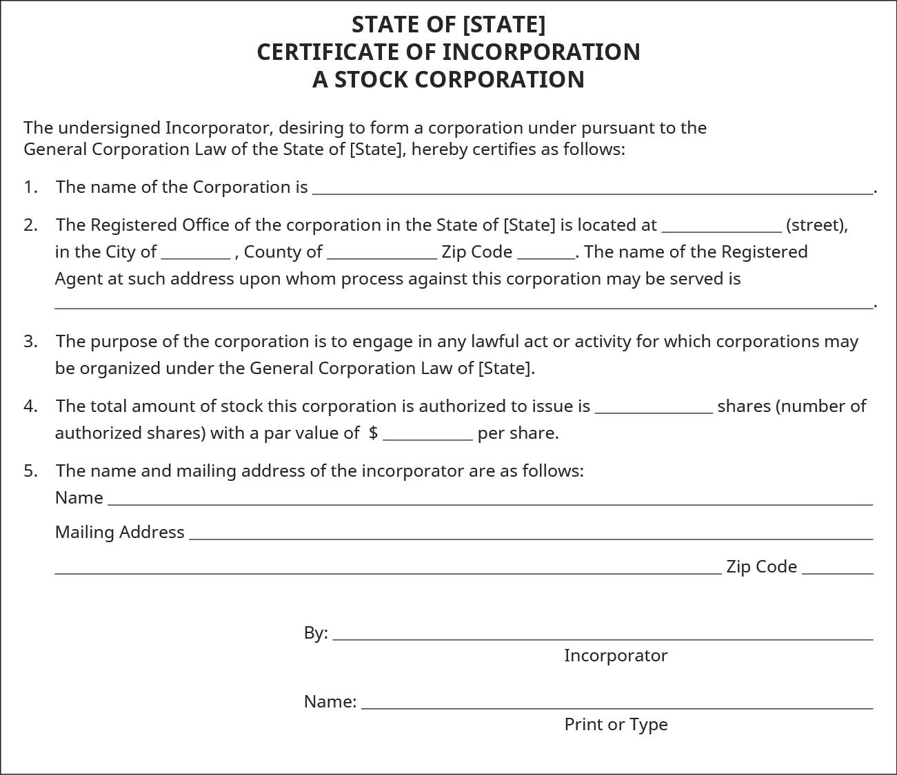
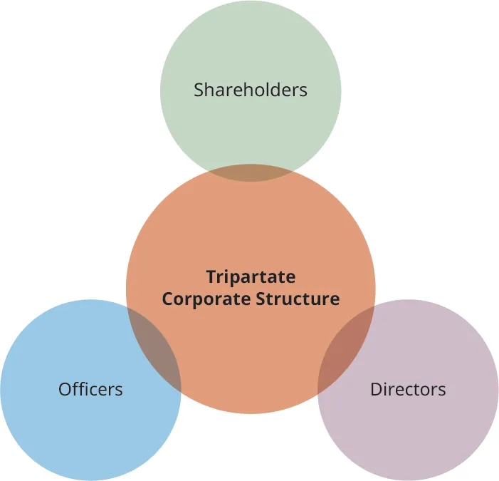
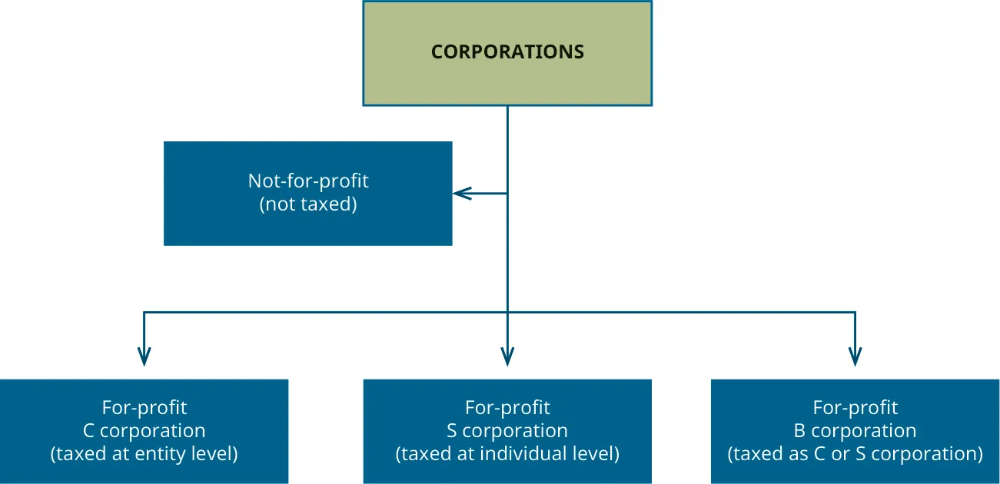
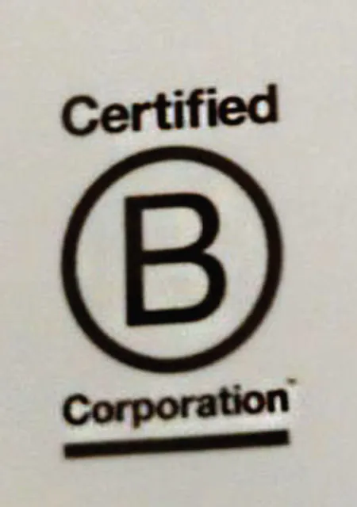
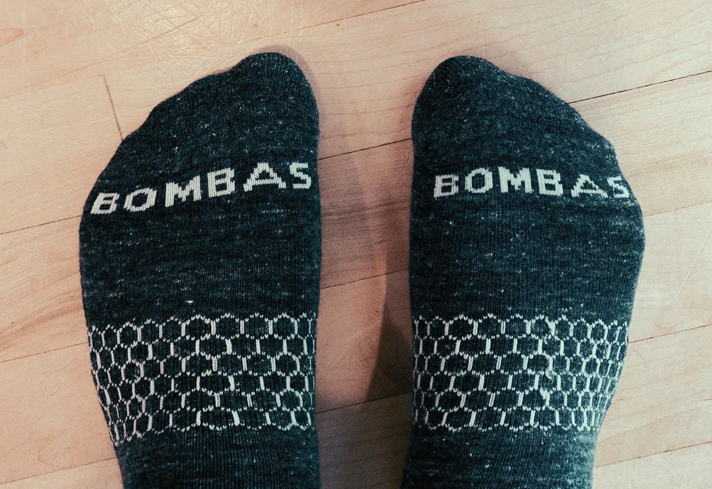

## 13.2   Công ty cổ phần

> **🎯 Mục tiêu học tập**
>
> Đến cuối phần này, bạn sẽ có thể:
>
> - Phân biệt Công ty Cs, Công ty Ss và Doanh nghiệp B Corps
> - Phân biệt công ty tư nhân (không niêm yết) và công ty đại chúng
> - Giải thích cách công ty cổ phần bị đánh thuế

Một **công ty cổ phần** là cấu trúc doanh nghiệp phức tạp được tạo ra bằng cách nộp các tài liệu phù hợp tại **bang nơi đăng ký thành lập** ([Hình 13.4](13-2-corporations#OSX_Eship_13_02_ArticleInc)). Chúng được hình thành khi những người sáng lập ban đầu nộp một tài liệu chính thức gọi là **điều lệ thành lập**, hoặc các tài liệu tương tự khác, với một cơ quan bang, thường là văn phòng bộ trưởng ngoại giao bang hoặc chi cục quản lý công ty của bang. Công ty cổ phần hoạt động như một pháp nhân tách biệt với chủ sở hữu. Chủ sở hữu được gọi là **cổ đông** và có thể là cá nhân, các công ty cổ phần trong nước hoặc nước ngoài khác, LLC, partnership và các thực thể pháp lý khác. Công ty cổ phần có thể hoạt động vì lợi nhuận hoặc phi lợi nhuận, như đã thảo luận trước đó.

*Hình 13.4: Đây là mẫu rút gọn của tài liệu được nộp cho Văn phòng Bộ trưởng Ngoại giao bang để thành lập một công ty cổ phần. (ghi công: Bản quyền Rice University, OpenStax, theo giấy phép CC BY NC-SA 4.0)*

Thành lập một công ty cổ phần có nghĩa là công ty hoạt động như một thực thể có một số quyền tương tự như cá nhân. Ví dụ, cá nhân và công ty cổ phần đều có thể khởi kiện và bị kiện, và công ty cổ phần có quyền sở hữu tài sản, ký kết và thực thi hợp đồng, đóng góp từ thiện và chính trị, vay và cho vay tiền, và điều hành doanh nghiệp như thể công ty cổ phần là một cá nhân. Hầu hết các bang yêu cầu một công ty cổ phần phải đăng ký tại bang đó để tiến hành các hoạt động kinh doanh cũng như tham gia và bào chữa cho các vụ kiện tại bang đó, đặc biệt nếu doanh nghiệp được thành lập ở một bang khác. Việc đăng ký không giống với việc thành lập công ty ban đầu; đó chỉ đơn giản là quy trình nộp các tài liệu thông tin của các thực thể đã được thành lập ở bang khác. Các bang cũng đánh thuế trên các hoạt động hoặc doanh số bán hàng của một công ty cổ phần tại bang nơi công ty có một số hoạt động nhất định.

### Tổng quan về công ty cổ phần

Công ty cổ phần là loại thực thể duy nhất mà pháp luật cho phép bán **cổ phần**. Không có thực thể nào khác, như LLC hay partnership, có thể làm như vậy. Những cá nhân hoặc thực thể khác mua cổ phần trở thành **cổ đông** và sở hữu công ty cổ phần. Một số công ty cổ phần có hàng triệu cổ đông, số khác chỉ có một cổ đông. Luật thành lập doanh nghiệp của các bang có sự khác biệt: một số bang yêu cầu tối thiểu ba cổ đông, nhưng các bang khác lại cho phép doanh nghiệp một chủ sở hữu được đăng ký thành lập công ty cổ phần. Do đó, một doanh nghiệp có thể bắt đầu công ty với tư cách là chủ sở hữu duy nhất và sau đó thành lập công ty cổ phần rồi bán cổ phần hoặc trái phiếu cho các nhà đầu tư khác trong công ty.

Các công ty cổ phần bán, hoặc phát hành cổ phần để huy động **vốn**, hoặc tiền, nhằm vận hành hoạt động kinh doanh của họ. Người sở hữu cổ phần (cổ đông) mua một phần của công ty cổ phần và có quyền đòi hỏi đối với một phần tài sản và thu nhập của công ty. Nói cách khác, cổ đông hiện là chủ sở hữu của công ty cổ phần. Do đó, một cổ phần (còn gọi là **vốn chủ sở hữu**) là một loại chứng khoán thể hiện quyền sở hữu theo tỷ lệ trong công ty cổ phần phát hành. Cổ phần được mua và bán chủ yếu trên các sàn giao dịch chứng khoán, mặc dù cũng có thể có giao dịch tư nhân giữa người bán và người mua. Các giao dịch này phải tuân thủ một hệ thống luật pháp và quy định quản lý cực kỳ phức tạp của chính phủ (ví dụ: Đạo luật Chứng khoán Liên bang năm 1933/34), nhằm bảo vệ các nhà đầu tư.

Việc sử dụng công ty cổ phần cho phép doanh nhân bảo vệ bản thân và các chủ sở hữu khác khỏi trách nhiệm cá nhân đối với hầu hết các nghĩa vụ pháp lý và tài chính. Lợi ích của trách nhiệm hữu hạn là một trong những lý do chính khiến các nhà doanh nghiệp thành lập công ty cổ phần. Tuy nhiên, việc quản lý một công ty cổ phần đòi hỏi nhiều thủ tục chính thức hơn so với các loại thực thể khác, chẳng hạn như doanh nghiệp tư nhân (sole proprietorship) và công ty hợp danh (partnership). Công ty cổ phần phải tuân thủ các quy tắc dành cho thực thể đó. Các yêu cầu bao gồm duy trì điều lệ (bylaws), tổ chức các cuộc họp cổ đông và hội đồng quản trị thường niên, ghi biên bản các quyết định lớn của cổ đông và hội đồng quản trị, đảm bảo các chức danh quản lý và thành viên hội đồng quản trị ký các tài liệu nhân danh công ty cổ phần, và quan trọng là duy trì tài khoản ngân hàng tách biệt với chủ sở hữu của họ và lưu giữ hồ sơ tài chính và doanh nghiệp chi tiết. Việc không tuân thủ các quy tắc có thể dẫn đến việc mất trách nhiệm hữu hạn, được gọi là “piercing the corporate veil” (phá vỡ lớp vỏ bọc pháp nhân).

> **📝 Giải quyết vấn đề: Phá vỡ lớp vỏ bọc pháp nhân của trách nhiệm hữu hạn**
>
> Như chúng ta đã thảo luận, các nhà doanh nghiệp nhìn chung nên thành lập một thực thể pháp lý riêng biệt để hạn chế trách nhiệm cá nhân phát sinh từ các nghĩa vụ kinh doanh, chẳng hạn như hợp đồng. Việc đăng ký thành lập công ty hoặc tổ chức dưới dạng LLC có thể hạn chế trách nhiệm cá nhân của các chủ sở hữu trong phạm vi khoản đầu tư của họ. Tuy nhiên, lá chắn trách nhiệm pháp lý này không phải là không có ngoại lệ: đặc biệt là tình huống được gọi là “**piercing the corporate veil**” (phá vỡ lớp vỏ bọc pháp nhân). Một vụ việc thực tế gần đây vào năm 2018 (Woodruff Construction, LLC kiện Clark, Số 17-1422 [Tòa phúc thẩm Iowa, ngày 15 tháng 8 năm 2018]) là minh chứng cho điểm này.
>
>
>
> Tổng quan thực tế: Bị cáo là chủ sở hữu duy nhất của một công ty cổ phần và đã ký hợp đồng loại bỏ bùn thải cho nguyên đơn tại một cơ sở xử lý chất thải. Bị cáo không bao giờ hoàn thành công việc. Nguyên đơn đã khởi kiện và thắng kiện với phán quyết yêu cầu công ty cổ phần bồi thường 400.000 USD vì vi phạm hợp đồng. Tuy nhiên, nguyên đơn không thể thu hồi tiền từ công ty cổ phần do không đủ tài sản. Nguyên đơn sau đó đã yêu cầu tòa án phá vỡ vỏ bọc của công ty cổ phần, điều này sẽ cho phép thu hồi nợ từ tài chính cá nhân của chủ sở hữu công ty.
>
>
>
> Phá vỡ vỏ bọc pháp nhân: Bằng chứng cho thấy mặc dù bị cáo có mở tài khoản ngân hàng riêng cho công ty cổ phần, ông ta đã trộn lẫn quỹ của công ty với tài chính cá nhân của mình, đây là một hành vi vi phạm rõ ràng nghĩa vụ ủy thác. Ông ta đã sử dụng các tài khoản ngân hàng của công ty cổ phần thay thế cho các tài khoản ngân hàng khác. Hơn nữa, bị cáo đã không tuân thủ các thủ tục bắt buộc của công ty vì không có điều lệ hoặc nghị quyết, không có hồ sơ bỏ phiếu, và không có tài liệu hoặc biên bản họp cổ đông nào.
>
>
>
> Phán quyết: Tòa án cho phép nguyên đơn phá vỡ vỏ bọc pháp nhân của công ty. Điều này có nghĩa là bị cáo, chủ sở hữu duy nhất của công ty cổ phần, đã phải trả hơn 400.000 USD từ tài sản cá nhân của mình. (Lưu ý: Mặc dù đúng là LLC có ít yêu cầu thủ tục chính thức hơn, vụ việc này có khả năng cũng mang lại kết quả tương tự nếu chủ sở hữu là một LLC vì các quy tắc phá vỡ vỏ bọc trách nhiệm hữu hạn về cơ bản là giống nhau.)
>
>
>
> Tư duy phản biện:
>
>
> - Làm thế nào bạn có thể bảo vệ bản thân để điều này không xảy ra với mình?

Hầu hết các công ty cổ phần sử dụng cách tiếp cận ba bên (tripartite) đối với quyền sở hữu và quản lý ([Hình 13.5](13-2-corporations#OSX_Eship_13_02_Corporate)). Sau khi công ty cổ phần được thành lập và các hoạt động bắt đầu, các cổ đông thường bầu ra một **hội đồng quản trị**, và hội đồng này có trách nhiệm giám sát đối với các hoạt động của công ty. Hội đồng quản trị sau đó sẽ bổ nhiệm các **chức danh quản lý** chịu trách nhiệm cho các hoạt động vận hành hằng ngày của công ty cổ phần.

*Hình 13.5: Trong cách tiếp cận ba bên, có ba nhóm tham gia vào việc sở hữu và quản lý một công ty cổ phần. Cổ đông bầu ra hội đồng quản trị và hội đồng này bổ nhiệm các chức danh quản lý. Cổ đông là chủ sở hữu, và các thành viên hội đồng quản trị/chức danh quản lý có thể là, và thường là, cổ đông. (ghi công: Bản quyền thuộc về Đại học Rice, OpenStax, theo giấy phép CC BY NC-SA 4.0)*

Đối với các tổ chức nhỏ, luật của bang cho phép các cổ đông trực tiếp quản lý công ty mà không cần sử dụng hội đồng quản trị. Loại công ty này là **công ty đóng (closed corporation)** hoặc **công ty đại chúng quy mô nhỏ (closely held corporation)**, và rất phổ biến đối với các công ty khởi nghiệp. Luật thành lập công ty của bang, kết hợp với luật thuế liên bang của IRS, điều chỉnh việc thành lập và hoạt động của một công ty đại chúng quy mô nhỏ. Các quy tắc cơ bản quy định rằng, nhìn chung, một công ty đóng/quy mô nhỏ là một công ty cổ phần có hơn 50% giá trị cổ phần đang lưu hành được sở hữu (trực tiếp hoặc gián tiếp) bởi năm cá nhân trở xuống tại bất kỳ thời điểm nào trong nửa sau của năm tính thuế.[^3]

### Công ty Cs, Công ty Ss và Doanh nghiệp B Corps

Việc phân loại công ty cổ phần thành công ty C hoặc công ty S chủ yếu là sự phân biệt về thuế. Một **công ty S** là thực thể chuyển thu nhập qua chủ sở hữu, nơi các cổ đông báo cáo và khai báo lợi nhuận kinh doanh là của riêng họ và nộp thuế thu nhập cá nhân trên đó. Ngược lại, chính phủ đánh thuế một **công ty C** ở cấp doanh nghiệp, rồi lại đánh thuế lần nữa trên tờ khai thuế thu nhập cá nhân của các chủ sở hữu nếu thu nhập của công ty được phân phối dưới dạng cổ tức.

Ngược lại, sự khác biệt giữa doanh nghiệp B Corp và công ty C hoặc công ty S hoàn toàn không dựa trên thuế, mà dựa trên mục đích và cách tiếp cận. Một **doanh nghiệp B Corp** được chứng nhận là doanh nghiệp đáp ứng tiêu chuẩn rất cao về hiệu quả xã hội và môi trường, tính minh bạch công khai và trách nhiệm giải trình để cân bằng lợi nhuận với mục đích xã hội. Các doanh nghiệp B Corp cũng có thể là các công ty C hoặc công ty S. [Hình 13.6](13-2-corporations#OSX_Eship_13_02_CorpStruc) tóm tắt các loại công ty này.

### Tính chất riêng của doanh nghiệp B Corp và/hoặc benefit corporation

Một hình thức mới của công ty cổ phần vì lợi nhuận phi truyền thống là **benefit corporation (công ty lợi ích)**, thực thể này có thể đồng thời là doanh nghiệp B Corp hoặc không. Mặc dù *B corporations* và *benefit corporations* chia sẻ một số mục tiêu chung, doanh nghiệp B Corp phải trải qua một quy trình chứng nhận. Trở thành một doanh nghiệp B Corp được chứng nhận là một quy trình chính thức liên quan đến việc tuân thủ các tiêu chuẩn khác nhau và một cuộc kiểm toán về sự tuân thủ này (do tổ chức B Corporation quản lý).[^4] Bản chất của các doanh nghiệp B Corp mới này là “họ nhận thức được tính bắt buộc của việc không gây hại và tạo ra tác động tích cực trong toàn bộ chuỗi giá trị.”[^5] Theo tổ chức B Corporation, các doanh nghiệp được chứng nhận này bắt buộc về mặt pháp lý phải xem xét tác động từ các quyết định của họ đối với người lao động, khách hàng, nhà cung cấp, cộng đồng và môi trường. Tính đến năm 2019, có khoảng 3.000 doanh nghiệp B Corp được chứng nhận ở 65 quốc gia, bao phủ 150 ngành công nghiệp khác nhau.[^6] Chứng nhận doanh nghiệp B Corp phần nào giống như một con dấu phê duyệt cho các doanh nghiệp tự nguyện cố gắng có trách nhiệm với xã hội. Một benefit corporation là một công ty cổ phần được công nhận bởi một cơ quan chính phủ theo luật của bang (khoảng 30 bang hiện công nhận benefit corporation với các yêu cầu pháp lý về mục đích cao hơn, trách nhiệm giải trình và tính minh bạch) nhưng không mang chứng nhận của một doanh nghiệp B Corp. Tuy nhiên, xét về mục đích liên quan đến trách nhiệm xã hội của doanh nghiệp, hai thực thể này rất giống nhau.

Mục tiêu của benefit corporation hướng tới việc tối đa hóa lợi ích cho tất cả các bên liên quan, có nghĩa là công ty mang lại lợi ích cho bất kỳ người nào có quyền lợi hoặc mối quan tâm đến doanh nghiệp. Nó không chỉ tối đa hóa lợi nhuận cho cổ đông. Việc tối đa hóa lợi ích của các bên liên quan được định hướng thông qua điều lệ của benefit corporation. Bang thành lập định hướng cách thức tạo ra các benefit corporation, nhưng nhìn chung, “mô hình quản trị mới này mở rộng góc nhìn của luật công ty truyền thống bằng cách kết hợp các khái niệm về mục đích, trách nhiệm giải trình và tính minh bạch đối với tất cả các bên liên quan của công ty, chứ không chỉ các cổ đông.”[^7] Điều này có nghĩa là việc sử dụng loại cấu trúc kinh doanh này cần được nhà doanh nghiệp cân nhắc cẩn thận vì trách nhiệm của doanh nghiệp sẽ bao gồm cả việc xem xét các bên liên quan được vạch ra trong điều lệ công ty, chứ không chỉ tối đa hóa lợi nhuận cho các cổ đông.

*Hình 13.6: Công ty C, công ty S và doanh nghiệp B Corp đều là các loại công ty cổ phần vì lợi nhuận, trái ngược với công ty cổ phần phi lợi nhuận. (ghi công: Bản quyền thuộc về Đại học Rice, OpenStax, theo giấy phép CC BY NC-SA 4.0)*

> **❓ Bạn đã sẵn sàng chưa?: Chứng nhận doanh nghiệp B Corp**
>
> Trang web B Corporation giải thích quy trình để trở thành doanh nghiệp B Corp. Quy trình này bao gồm ba bước cụ thể: Hiệu quả được xác minh (Verified Performance), Trách nhiệm pháp lý (Legal Accountability), và Minh bạch công khai (Public Transparency). Hãy truy cập [https://bcorporation.net/about-b-corps](https://bcorporation.net/about-b-corps) và đọc về doanh nghiệp B Corp để biết họ cần đáp ứng các yêu cầu gì để được phép hiển thị logo doanh nghiệp B Corp sau đây được thể hiện trong [Hình 13.7](13-2-corporations#OSX_Eship_13_02_BCorpLogo).
>
>
>
> 
>
> *Hình 13.7: Để trở thành một doanh nghiệp B Corp được chứng nhận, một công ty phải trải qua một cuộc kiểm toán độc lập bên ngoài về việc tuân thủ từng yêu cầu của doanh nghiệp B Corp. (nguồn: chỉnh sửa từ “Runa B Corp Label” bởi “Lelepanne”/Wikimedia Commons, CC0)*

### Công ty tư nhân (không niêm yết) so với công ty đại chúng

Thuật ngữ liên quan đến việc một công ty thuộc sở hữu công hay tư đôi khi có thể gây nhầm lẫn. Ví dụ, các tập đoàn lớn như **Exxon** hay **Amazon** là các công ty cổ phần tư nhân (sở hữu tư), nhưng cổ phần của họ lại được nắm giữ công khai bởi công chúng (publicly held). Điều này có nghĩa là bất kỳ thành viên nào của công chúng đầu tư cũng có thể sở hữu cổ phần trong công ty cổ phần đó. Một công ty công (**public corporation**) thực sự, trên thực tế, là một thực thể bán chính phủ, một thực thể do chính phủ sở hữu hoặc tài trợ. Các công ty do chính phủ sở hữu bao gồm **Bưu điện Hoa Kỳ (US Postal Service)**, **Tổng công ty Phát thanh Truyền hình Công cộng (Corporation for Public Broadcasting)**, **AmeriCorps** và **Amtrak**. Các công ty do chính phủ tài trợ bao gồm **Freddie Mac** và **Fannie Mae**, các thực thế liên quan đến thế chấp. Một **công ty tư nhân (không niêm yết)**, phổ biến ở Châu Âu, là một công ty không cho phép công chúng đầu tư sở hữu cổ phần. Gia đình hoặc bạn bè của người sáng lập, hoặc có lẽ là một nhóm nhà đầu tư tư nhân như một công ty đầu tư mạo hiểm, có thể nắm giữ nó. Các ví dụ bao gồm **Facebook** trước khi niêm yết công khai vào năm 2012, hoặc **Cargill** hoặc **Mars**.

#### Công ty giao dịch công khai

Một công ty đại chúng (**publicly held corporation**) là một thực thể mà các thành viên của công chúng đầu tư sở hữu cổ phần như đã mô tả. Một thuật ngữ thường được áp dụng cho các công ty như vậy là công ty đại chúng được giao dịch công khai (***publicly traded corporation***), nghĩa là cổ phần có thể được mua và bán trên thị trường công cộng, chẳng hạn như **Sở giao dịch chứng khoán New York (New York Stock Exchange)**. Một công ty giao dịch công khai có nhiều cơ hội tiếp cận các nhà đầu tư hơn và do đó có nhiều vốn hơn, nhưng nó phải hoạt động theo một bộ quy tắc chính thức do **Ủy ban Chứng khoán và Giao dịch (SEC)** và Quốc hội thiết lập, giả sử các cổ phần được bán công khai tại Hoa Kỳ. Việc kiểm toán các công ty đại chúng được giao dịch công khai cũng phải tuân thủ các quy tắc của **Ủy ban Giám sát Kế toán Công ty Đại chúng (PCAOB)**. “PCAOB giám sát việc kiểm toán các công ty đại chúng và các nhà môi giới-đại lý nhằm bảo vệ các nhà đầu tư và lợi ích công chúng bằng cách thúc đẩy các báo cáo kiểm toán độc lập, chính xác và nhiều thông tin.”[^8] Việc tuân thủ các quy tắc của SEC và PCAOB nhấn mạnh vào việc bảo vệ nhà đầu tư nhưng có thể phức tạp, vì nó làm tăng cả chi phí thành lập và vận hành cho dự án kinh doanh do các quy định pháp lý và báo cáo tăng lên.

Một công ty giao dịch công khai được yêu cầu phải có một hội đồng quản trị với nhiệm vụ kép là vừa tư vấn cho ban giám đốc về định hướng chiến lược của công ty vừa giám sát hiệu quả hoạt động của công ty. Hội đồng quản trị không quản lý trực tiếp công ty, và các thành viên của hội đồng độc lập với ban giám đốc.[^9] Hội đồng quản trị sẽ có nhiều ủy ban để hỗ trợ chức năng của mình, và one of the committees is the audit committee. Ủy ban kiểm toán của một công ty giao dịch công khai phải thuê một kiểm toán viên bên ngoài được PCAOB phê duyệt để kiểm toán sổ sách của công ty giao dịch công khai đó. Hơn nữa, giám đốc điều hành (CEO) và giám đốc tài chính (CFO) của công ty giao dịch công khai phải ký giấy chứng nhận báo cáo kết quả hoạt động kinh doanh, đảm bảo tính trung thực của báo cáo đó. Các quy tắc và quy định bắt buộc phải tuân thủ đối với một công ty giao dịch công khai khắt khe hơn so với một công ty tư nhân hoặc công ty đại chúng quy mô nhỏ.

#### Công ty đại chúng quy mô nhỏ

Một **công ty đại chúng quy mô nhỏ (closely held corporation)**, còn được gọi là **công ty đóng (close corporation)**, giống như một công ty tư nhân xét theo mục đích của luật chứng khoán. Tuy nhiên, khái niệm này có một ý nghĩa thứ hai liên quan đến cấu trúc quản lý. Một công ty đóng cũng là một cấu trúc quản lý cho một công ty cổ phần thường được các công ty nhỏ lựa chọn khi họ sử dụng phong cách quản lý ít chính thức hơn của một công ty hợp danh chung nhưng vẫn giữ được trách nhiệm hữu hạn của một công ty cổ phần. Về bản chất, có ít thủ tục chính thức hơn đối với một công ty đóng, và nó cho phép quyền kiểm soát lớn hơn đối với nhóm nhỏ cổ đông.

Một công ty đóng bắt buộc phải tổ chức cuộc họp cổ đông thường niên và ghi biên bản cuộc họp. Tất cả các chi tiết này đều bắt buộc phải được ghi lại trong hồ sơ doanh nghiệp, ngay cả khi chỉ có một cổ đông duy nhất. Các chủ sở hữu doanh nghiệp tư nhân sử dụng cấu trúc công ty cổ phần làm cấu trúc kinh doanh phải tuân theo các quy tắc liên quan đến công ty cổ phần của bang nơi họ đăng ký thành lập. Một số bang thậm chí có thể giải thể một công ty cổ phần không tổ chức họp thường niên hoặc không lưu giữ hồ sơ công ty thích hợp. Khi một công ty cổ phần bị giải thể, các cổ đông sẽ phải chịu trách nhiệm cá nhân đối với các khoản nợ của công ty, và trách nhiệm hữu hạn của cổ đông sẽ bị mất. Quản lý một công ty đại chúng quy mô nhỏ đòi hỏi nhà doanh nghiệp phải tuân theo các hướng dẫn của bang trong khi vận hành công ty cổ phần đó tương ứng.

Cổ phần của một công ty đóng/quy mô nhỏ không được giao dịch trên thị trường mở và thường chỉ có một vài cổ đông. Các công ty đóng/quy mô nhỏ có ít yêu cầu báo cáo hơn so với các công ty giao dịch công khai và thường không bắt buộc phải có báo cáo tài chính đã kiểm toán, trừ khi điều lệ công ty có quy định khác. Báo cáo tài chính đã kiểm toán rất tốn kém và là bắt buộc đối với các công ty giao dịch công khai. Báo cáo tài chính đã kiểm toán giúp các nhà đầu tư mua và bán cổ phần trên thị trường chứng khoán định giá cổ phần và không nhất thiết cần thiết đối với một công ty đóng/quy mô nhỏ. Tuy nhiên, rất khó để định giá một công ty đóng/quy mô nhỏ vì không có thị trường sẵn sàng cho các cổ phần sở hữu đó.

### Công ty cổ phần phi lợi nhuận

Các công ty cổ phần phi lợi nhuận được thành lập ở một bang nhưng có thể hoạt động hoặc kêu gọi quyên góp ở các bang khác. Một công ty cổ phần phi lợi nhuận hoạt động hoặc kêu gọi quyên góp ở nhiều bang cần phải đăng ký hoạt động với tư cách là một công ty cổ phần phi lợi nhuận ở mọi bang mà nó hoạt động.

Các công ty cổ phần phi lợi nhuận được tổ chức theo cách tương tự như các công ty cổ phần vì lợi nhuận, với hội đồng quản trị và các chức danh quản lý, nhưng họ không có cổ đông, cổ phần hay chủ sở hữu. Các bên liên quan của một công ty cổ phần phi lợi nhuận đóng một vai trò quan trọng trong việc giám sát chi phí cố định (overhead) và phân bổ các quỹ. Vì hầu hết các quỹ là tiền quyên góp và được khấu trừ thuế, các tổ chức giám sát công cộng có thể theo dõi báo cáo tài chính của các tổ chức được miễn thuế liên bang. Thực tế là Internet cung cấp quyền truy cập dễ dàng vào dữ liệu tài chính liên quan đến các tổ chức phi lợi nhuận được miễn thuế liên bang giúp các tổ chức giám sát dễ dàng tiếp cận dữ liệu tài chính và có khả năng phân tích các hoạt động cũng như thù lao của những người tổ chức và nhân viên của tổ chức phi lợi nhuận đó.

> **💼 Doanh nhân trong hành động: Bombas: Đạt được cả mục tiêu lợi nhuận và phi lợi nhuận**
>
> Trong một cuộc phỏng vấn năm 2017 với Robin Roberts của ABC News, nhà đồng sáng lập thương hiệu tất **Bombas** ([Hình 13.8](13-2-corporations#OSX_Eship_13_02_Bombas)) David **Heath** cho biết: “Quay lại năm 2011, tôi tình cờ đọc được một câu trích dẫn trên Facebook nói rằng... tất là mặt hàng quần áo được yêu cầu nhiều nhất tại các nhà cứu trợ người vô gia cư.”[^10] Vì vậy, ông đã quyết định khởi nghiệp một công ty mới và đạt được thành công chỉ sau một đêm, được thúc đẩy thêm bởi sự xuất hiện trên chương trình ***Shark Tank*** vào năm 2014. Ông đã thành lập công ty của mình, Bombas, cùng với nhà doanh nhân đồng sáng lập Randy **Goldberg**. Họ thành lập công ty với mục tiêu đóng góp lại cho cộng đồng bằng cách tặng tất cho người vô gia cư, trong khi ý tưởng sản phẩm thực tế là mục tiêu thứ yếu.[^11] Họ đã quyên góp hơn 25 triệu sản phẩm thông qua hơn 2.500 đối tác trên khắp cả nước.[^12]
>
>
>
> 
>
> *Hình 13.8: Đây là một đôi tất Bombas. (nguồn: chỉnh sửa từ “Bombas Socks” bởi Tony Webster/Flickr, CC BY 2.0)*
>
>
>
> Bombas hiện là một công ty sản xuất tất thành công sử dụng một thực thể kinh doanh như một cách để giải quyết sự thiếu hụt tất quyên góp tại các nhà cứu trợ người vô gia cư. Heath và Goldberg đã dành hai năm để phát minh ra những đôi tất chất lượng cao với các tính năng bổ sung như đệm chân được gia cố và các tab chống phồng rộp, kết hợp với các đường may theo đường viền chân. Tuy nhiên, đối với các doanh nhân này, đó không chỉ là về công nghệ sản xuất tất, mà là về việc làm điều gì đó có ý nghĩa cùng một lúc—sự kết hợp của cả mục tiêu lợi nhuận và phi lợi nhuận. Do đó, họ đã đưa ra cam kết với những người gặp khó khăn, và kể từ năm 2013, công ty đã quyên góp hơn 10 triệu đôi tất cho các nhà cứu trợ người vô gia cư, nhờ vào mô hình tiếp thị tất 'mua một, tặng một' của họ.
>
>
>
> Những đôi tất mà Bombas quyên góp cho người vô gia cư không phải là loại tất rẻ tiền dùng một lần. Thay vào đó, chúng được thiết kế riêng cho những người vô gia cư sử dụng, ví dụ, được xử lý kháng khuẩn để ngăn ngừa vi khuẩn nếu chúng không thể được giặt thường xuyên và các đường may được gia cố để tăng độ bền, vì người vô gia cư không có tiền để liên tục mua những đôi tất mới.[^13]
>
>
>
> Về bản chất, công ty tạo ra khách hàng, và công ty hợp tác với những người vô gia cư.
>
>
> - Liệu Bombas có thực sự chi trả cho dự án giúp đỡ người vô gia cư này hay khách hàng mới là người chi trả?
> - Liệu Bombas chỉ đang tạo điều kiện cho ý tưởng tốt này và khách hàng đang trả tiền cho nó, hay bạn nghĩ Bombas cũng đang đóng góp một phần lợi nhuận của mình?

> **🔗 Liên kết học tập**
>
> Hãy truy cập [trang web của Bombas](https://openstax.org/l/52Bombas) để xem video giải thích những gì họ làm như một phần cam kết của một doanh nghiệp **B Corp**.

### Tổng quan về thuế của công ty cổ phần

Tất cả công ty cổ phần vì lợi nhuận đều chịu thuế thu nhập ở cấp liên bang, và thường cả ở cấp bang. Bất kể lựa chọn thuế nào, cả C- lẫn công ty S đều thuộc diện chịu thuế.

Lập kế hoạch thuế là một vấn đề lớn đối với hầu hết các công ty cổ phần và có thể giải thích một số quyết định quan trọng, chẳng hạn như nơi họ đặt trụ sở. Điều đó có thể liên quan đến các quyết định về việc trụ sở chính của công ty nằm ở bang nào, hoặc thậm chí ở quốc gia nào. Điều này là do luật thuế có thể khác nhau đáng kể theo cả bang và quốc gia.

Thuế suất thuế thu nhập liên bang hiện tại đối với các công ty cổ phần trong năm 2019 là 21%, giảm mạnh so với mức 35% trước năm 2018. Nhiều bang cộng thêm thuế thu nhập cấp bang, dao động từ 2% đến 12%, trong khi một số bang như Texas không đánh thuế thu nhập doanh nghiệp nhằm nỗ lực thu hút các công ty cổ phần đến bang của mình.[^14]

#### Đánh thuế công ty C

Các **công ty C** nộp thuế thu nhập doanh nghiệp trên lợi nhuận tạo ra. Các cổ đông cá nhân cũng phải nộp thuế thu nhập cá nhân trên mọi khoản cổ tức họ nhận được. Hầu hết các luật sư và kế toán gọi khái niệm này là bất lợi đánh thuế hai lần (double taxation). Tuy nhiên, bất lợi về thuế trong lịch sử này gần đây đã được giảm bớt do việc giảm thuế suất thuế thu nhập mà các công ty C phải nộp theo Đạo luật Cắt giảm Thuế và Việc làm (Tax Cuts and Jobs Act).[^15] Sự giảm thuế này, đến lượt nó, lại làm giảm bất lợi thuế kép. Hơn nữa, khả năng giữ lại và tái đầu tư lợi nhuận trong công ty với mức thuế suất thuế doanh nghiệp thấp hơn là một lợi thế.

Một công ty C đi kèm với một mức độ thủ tục bổ sung nhất định, hay như một số người gọi là thủ tục rườm rà (red tape). Theo luật công ty của hầu hết các bang, cũng như luật thuế và chứng khoán liên bang, công ty cổ phần phải có điều lệ công ty và phải nộp báo cáo thường niên, báo cáo tiết lộ tài chính và báo cáo tài chính. Họ phải tổ chức ít nhất một cuộc họp mỗi năm cho các cổ đông và hội đồng quản trị để ghi chép và lưu giữ biên bản họp nhằm thể hiện tính minh bạch. Một công ty C cũng phải lưu giữ hồ sơ bỏ phiếu của các thành viên hội đồng quản trị của công ty và danh sách tên cũng như tỷ lệ sở hữu của các chủ sở hữu.

Bất chấp những tác động về thuế, cấu trúc công ty C là cấu trúc duy nhất hợp lý đối với hầu hết các doanh nghiệp lớn của Hoa Kỳ vì nó cho phép bán cổ phần trên quy mô rộng lớn với số lượng lớn cho công chúng đầu tư phổ thông mà không bị giới hạn. Một công ty C có thể có số lượng cổ đông không giới hạn là cá nhân hoặc các thực thể kinh doanh khác, và là công dân Hoa Kỳ hoặc công dân nước ngoài.

#### Đánh thuế công ty S

Một **công ty S** là thực thể chuyển thu nhập qua chủ sở hữu, nơi lợi nhuận của công ty được chuyển qua cho các cổ đông, thường theo tỷ lệ đầu tư của họ - điều này được gọi là cơ chế thuế chuyển qua chủ sở hữu (pass-through taxation).

Các công ty S bị giới hạn về số lượng cổ đông. Không giống như công ty C, Bộ luật Thuế vụ giới hạn số lượng cổ đông của công ty S ở mức 100 trở xuống, và chủ sở hữu chỉ có thể là cá nhân (hoặc di sản và một số loại thực thể được miễn thuế). Ngoài ra, các cổ đông cá nhân cũng phải là công dân Hoa Kỳ hoặc thường trú nhân hợp pháp. Hơn nữa, các công ty S chỉ được phép có một loại cổ phần, trong khi các công ty C có thể có nhiều loại cổ phần khác nhau. Ví dụ, trong một công ty C, có thể có cổ phần có quyền biểu quyết, cổ phần không có quyền biểu quyết, cổ phần phổ thông (loại hầu hết mọi người mua) và cổ phần ưu đãi (loại được thanh toán trước trong trường hợp phá sản).
