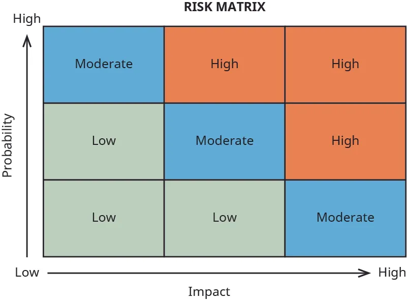

## 13.7   Giảm thiểu và quản lý rủi ro

> **🎯 Mục tiêu học tập**
>
> Đến cuối phần này, bạn sẽ có thể:
>
> - Giải thích quản trị rủi ro doanh nghiệp và cách doanh nghiệp sử dụng nó
> - Mô tả rủi ro kiện tụng và rủi ro tài chính
> - Mô tả những nhu cầu bảo hiểm phổ biến

Quản trị rủi ro là yếu tố then chốt để vận hành bất kỳ doanh nghiệp nào theo cách có lợi nhuận. Có rất nhiều rủi ro mà doanh nhân phải đối mặt khi khởi động và vận hành một dự án kinh doanh mới. Điều quan trọng là loại bỏ những rủi ro sẽ gây hại cho dự án, đồng thời chấp nhận những rủi ro có thể mang lại lợi nhuận dài hạn. Những rủi ro mà doanh nhân đối mặt cần được nhận diện ban đầu như một phần của quá trình xây dựng kế hoạch kinh doanh và được xem xét lại thường xuyên trong quá trình vận hành liên tục. Việc chuẩn bị cho các sự kiện bất lợi ảnh hưởng đến dự án kinh doanh mới là cần thiết, nhưng quá bi quan hoặc để nỗi sợ các sự kiện bất lợi ngăn doanh nhân chấp nhận bất kỳ rủi ro nào sẽ khiến doanh nghiệp không thể đạt tới tiềm năng và lợi nhuận lớn nhất của mình.

Điều quan trọng là doanh nhân phải phát triển sự hiểu biết về những rủi ro của môi trường kinh doanh. Các rủi ro đó bao gồm rủi ro trách nhiệm phát sinh từ hợp đồng và hành vi dân sự gây thiệt hại, đôi khi được gọi là rủi ro vận hành, rủi ro tuân thủ quy định, rủi ro tài chính và rủi ro chiến lược, bao gồm cả thuế. Hiểu được cấu trúc doanh nghiệp được dùng để vận hành dự án kinh doanh như thế nào sẽ cho phép doanh nhân xây dựng kế hoạch quản lý tăng trưởng doanh nghiệp và hiểu rủi ro kinh doanh.

### Quản trị rủi ro doanh nghiệp

Những dự án có lợi nhuận xây dựng một chương trình **quản trị rủi ro doanh nghiệp** mạnh, tức một cách tiếp cận tích hợp, liên ngành để giám sát rủi ro. Tổ chức cần nhìn vào cả rủi ro dài hạn và ngắn hạn ở mọi cấp độ của tổ chức, và các rủi ro này cần được đánh giá từ góc nhìn của mọi bên liên quan rồi phát triển thành một chương trình áp dụng cho toàn doanh nghiệp.

Quản trị rủi ro doanh nghiệp cố gắng xử lý các rủi ro cụ thể đã được thảo luận ở phần trước bằng cách triển khai một chương trình rủi ro cho phép doanh nghiệp nhận diện và quản lý rủi ro. Cụ thể, doanh nghiệp sẽ trải qua một quy trình nhiều giai đoạn bao gồm nhận diện rủi ro, đánh giá rủi ro và giảm thiểu rủi ro. Ví dụ về các rủi ro mà doanh nghiệp phải đối mặt gồm rủi ro từ nguyên nhân tự nhiên, kinh tế và con người.

**Natural causes of risk** bao gồm các thảm họa như bão và lũ lụt, cũng như động đất hay những thảm họa khác gây thiệt hại về người, tài sản và làm gián đoạn hoạt động kinh doanh. Ví dụ, một doanh nghiệp ở New Orleans có thể bị ngập do bão. Điều này gây hư hại cơ sở vật chất và sản phẩm, đồng thời đe dọa tính mạng người lao động. Để đối phó với các nguyên nhân như vậy, doanh nghiệp cần lập kế hoạch trước cho tính liên tục kinh doanh, mua bảo hiểm toàn diện và có sẵn kế hoạch sơ tán/ngừng hoạt động.

**Economic causes of risk** bao gồm các sự kiện toàn cầu làm tăng giá nguyên liệu thô, biến động tiền tệ, lãi suất cao và dĩ nhiên là cạnh tranh từ các công ty khác trong cùng ngành. Một ví dụ là các cuộc chiến thương mại khó lường với Trung Quốc dẫn đến thuế quan.

**Nguyên nhân rủi ro từ con người** đề cập đến hành động của nhân viên, nhà thầu và những người mà công ty có quyền kiểm soát. Những sự kiện này có thể bao gồm hành vi dân sự gây thiệt hại phát sinh từ sự bất cẩn tại nơi làm việc, đình công, thiếu hụt lao động được đào tạo đủ năng lực và quản trị doanh nghiệp yếu kém. Một ví dụ của loại rủi ro này là việc biển thủ tiền bởi một giám đốc tài chính nội bộ.

Việc sử dụng một cách tiếp cận toàn diện cho phép thực thể kinh doanh rà soát và kết hợp mọi rủi ro dưới một góc nhìn chức năng, giúp doanh nhân đánh giá rủi ro và tích hợp những rủi ro mới khi các cơ hội khác nhau trở nên quan trọng hơn với dự án kinh doanh. Doanh nghiệp đôi khi sử dụng ma trận rủi ro để đánh giá hoặc mô tả xác suất và tác động của rủi ro ([Hình 13.11](13-7-mitigating-and-managing-risks#OSX_Eship_13_07_RiskMatrix)). Việc dùng công cụ như vậy có thể giúp doanh nghiệp lượng hóa rủi ro và quyết định có nên thực hiện một hoạt động dựa trên mức độ rủi ro của nó hay không.

*Hình 13.11: Ma trận rủi ro có thể là công cụ hữu ích để đánh giá khả năng xảy ra và mức độ nghiêm trọng của rủi ro mà một dự án có thể gặp. (ghi công: Bản quyền Rice University, OpenStax, theo giấy phép CC BY NC-SA 4.0)*

**Mức độ chấp nhận rủi ro** là yếu tố quan trọng mà dự án kinh doanh cần cân nhắc cả khi tạo cấu trúc doanh nghiệp lẫn trong quá trình vận hành liên tục. [Bảng 13.1](13-7-mitigating-and-managing-risks#fs-idm341493856) cho thấy tổng quan các cân nhắc mà dự án kinh doanh nên xem xét trong cả giai đoạn hình thành và vận hành.

**Bảng 13.1 Tài liệu Enterprise Risk Management, Understanding and Communicating Risk Appetite của COSO nêu ra các cân nhắc này để đánh giá mức chấp nhận rủi ro của doanh nghiệp.: Mức độ chấp nhận rủi ro25**

| Hạng mục rủi ro | Cân nhắc |
| --- | --- |
| Hồ sơ rủi ro hiện hữu | Mức độ hiện tại và sự phân bổ rủi ro trong toàn doanh nghiệp và giữa các nhóm rủi ro |
| Năng lực chịu rủi ro | Mức rủi ro mà doanh nghiệp có thể gánh chịu trong khi theo đuổi mục tiêu |
| Ngưỡng dung sai rủi ro | Mức biến động mà doanh nghiệp có thể chấp nhận trong khi theo đuổi mục tiêu |
| Thái độ đối với rủi ro | Quan điểm của ban quản lý đối với tăng trưởng, rủi ro và lợi nhuận |

Đây là cách tiếp cận cơ bản để đánh giá mức chấp nhận rủi ro của một dự án mới. Việc xác định và hiểu rõ những rủi ro mà dự án mới phải đối mặt nên bắt đầu ngay trong quá trình chuẩn bị kế hoạch kinh doanh bằng văn bản và tiếp tục xuyên suốt giai đoạn vận hành của dự án.

### Rủi ro pháp lý và sự bảo vệ

Hoạt động kinh doanh dưới bất kỳ hình thức nào cũng cần tuân thủ các luật và quy định kinh doanh. Việc không tuân thủ có thể dẫn đến tiền phạt, kiện tụng, thậm chí là chế tài hình sự. **Rủi ro pháp lý** phát sinh chủ yếu từ **vi phạm hợp đồng** và/hoặc việc thực hiện một **hành vi dân sự gây thiệt hại**. Ví dụ phổ biến của loại rủi ro này là **các vụ kiện trách nhiệm sản phẩm**.

Do rủi ro trách nhiệm pháp lý, chủ doanh nghiệp và nhà đầu tư luôn tìm cách giới hạn trách nhiệm cá nhân của mình. Việc thành lập pháp nhân là một chiến lược bảo vệ rủi ro tiêu chuẩn cho vấn đề này, cũng như việc sử dụng các cấu trúc trách nhiệm hữu hạn khác như LLCs. Đây là một trong những lợi thế chính của công ty cổ phần và LLCs được vận hành đúng cách, vì chúng cho phép **trách nhiệm cá nhân hữu hạn** cho chủ sở hữu và nhà đầu tư. Các partner trong GP và chủ doanh nghiệp tư nhân phải chịu trách nhiệm cá nhân cho mọi khoản nợ của doanh nghiệp, thậm chí vượt quá khoản đầu tư của chính họ vào doanh nghiệp.

### Rủi ro tài chính và sự bảo vệ

Doanh nhân cần tiền để khởi động doanh nghiệp, dù số tiền đó đến từ khoản vay của gia đình, tiền tiết kiệm của bản thân hay nhà đầu tư. Người sáng lập được kỳ vọng phải đặt tiền của chính mình vào rủi ro, dù dưới dạng khoản vay cho doanh nghiệp của mình hay phần vốn chủ sở hữu trong chính doanh nghiệp đó. Nếu họ không có “skin in the game”, người khác sẽ không hứng thú cho họ vay tiền. Điều này có nghĩa là nếu doanh nghiệp thất bại, chủ sở hữu vẫn sẽ chịu hệ quả, ngay cả khi hoạt động dưới dạng công ty cổ phần hoặc LLC. Đó là bản chất của **rủi ro tài chính**: khởi động một doanh nghiệp mới với nguồn vốn không đủ để duy trì hoạt động trong một khoảng thời gian dài.

### Sự bảo vệ bằng bảo hiểm

Quản trị và bảo vệ rủi ro được tăng cường khi mua các loại **bảo hiểm** khác nhau, tức là phân tán rủi ro trên một số lượng lớn người tham gia (**người tham gia bảo hiểm**). Nếu công ty là công ty cổ phần, công ty có thể cần bảo hiểm trách nhiệm cho giám đốc và cán bộ điều hành để bồi hoàn cho họ nếu họ bị kiện. Một hợp đồng bảo hiểm khác mà nhiều công ty mua là bảo hiểm sai sót và thiếu sót; bảo hiểm này bảo vệ nhân viên trong các yêu cầu bồi thường do bất cẩn và trong các trường hợp trộm cắp do nhân viên gây ra. Những loại bảo hiểm khác mà đa số doanh nghiệp có gồm bảo hiểm ô tô, bảo hiểm y tế, bảo hiểm tài sản và bảo hiểm vi phạm dữ liệu/an ninh mạng. Phạm vi bảo hiểm cho một dự án kinh doanh cần phù hợp cụ thể với cấu trúc doanh nghiệp và hoạt động của nó. Hãy nhớ rằng không phải mọi rủi ro đều có thể được bảo hiểm-ví dụ như một nền kinh tế xấu dẫn đến mất việc kinh doanh hoặc một quyết định sai của chủ sở hữu khi bước vào một thị trường không hiệu quả.

### Công nghệ thông tin/an ninh mạng cho doanh nghiệp nhỏ

Theo **SBA**, rủi ro bị tấn công mạng, ransomware và xâm phạm quyền riêng tư của khách hàng có mức độ nghiêm trọng đối với đa số doanh nghiệp nhỏ cũng ngang với doanh nghiệp lớn. SBA đã đưa ra các hướng dẫn liên quan đến an ninh mạng cho doanh nhân. SBA khuyến nghị kế hoạch hành động mười bước được trình bày trong [Bảng 13.2](13-7-mitigating-and-managing-risks#fs-idm355451152).

**Bảng 13.2: Khuyến nghị của Small Business Administration về an ninh mạng26**

| Bước | Hành động |
| --- | --- |
| 1 | Bảo vệ trước virus, spyware và mã độc khác |
| 2 | Bảo vệ an toàn cho mạng của bạn |
| 3 | Thiết lập thực hành và chính sách bảo mật để bảo vệ thông tin nhạy cảm |
| 4 | Đào tạo nhân viên về các mối đe dọa mạng và quy trách nhiệm cho họ |
| 5 | Yêu cầu nhân viên sử dụng mật khẩu mạnh và thay đổi chúng thường xuyên |
| 6 | Áp dụng thực hành tốt nhất đối với thẻ thanh toán |
| 7 | Tạo bản sao lưu cho dữ liệu và thông tin kinh doanh quan trọng |
| 8 | Kiểm soát việc tiếp cận vật lý với máy tính và các thành phần mạng |
| 9 | Tạo kế hoạch hành động cho thiết bị di động |
| 10 | Bảo vệ tất cả các trang trên website và ứng dụng hướng ra công chúng của bạn, không chỉ trang thanh toán và đăng ký |

**Federal Communications Commission** cùng với SBA đưa ra các khuyến nghị nêu trên. Để biết thêm thông tin, xem trang web sau: [https://www.fcc.gov/general/cybersecurity-small-business](https://www.fcc.gov/general/cybersecurity-small-business).
