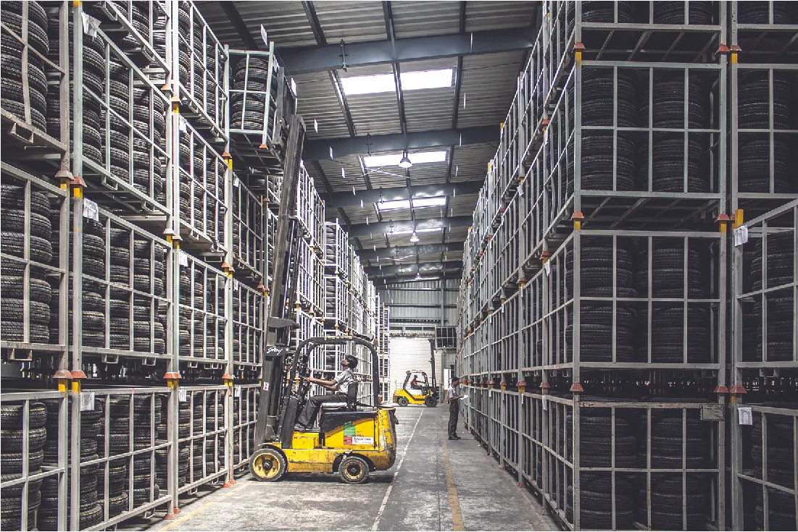
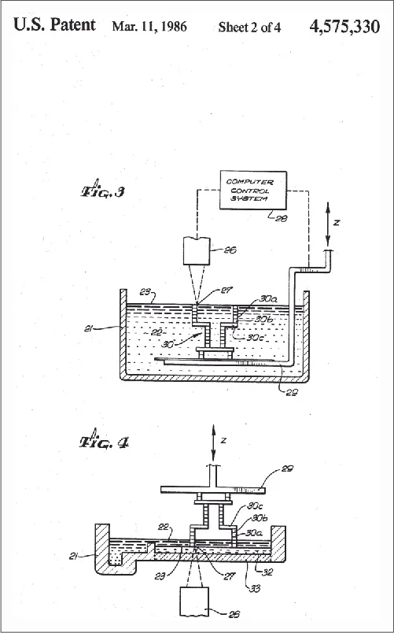
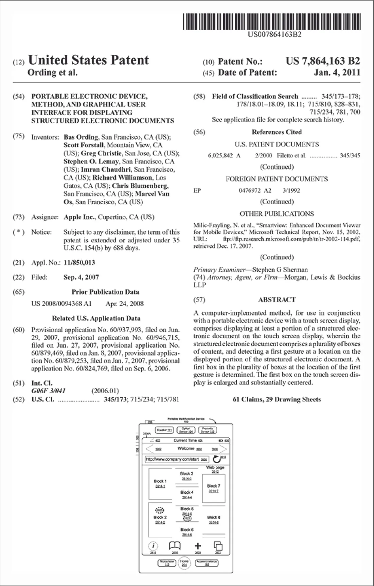

## 14.1   Types of Resources

> **🎯 Mục tiêu học tập**
>
> Khi kết thúc phần này, Bạn sẽ có thể:
>
> - Phân biệt giữa nguồn lực hữu hình và vô hình
> - Xác định nhu cầu nguồn lực hữu hình và vô hình của doanh nghiệp
> - Mô tả các nguồn tài trợ khác nhau dành cho doanh nhân

Trong chương này, chúng ta sẽ thảo luận về việc xác định và quản lý các nguồn lực cần thiết để khởi nghiệp thành công. Nguồn lực bao gồm tất cả tài sản có sẵn cho doanh nhân sử dụng trong quá trình vận hành kinh doanh.

### Nguồn Lực Hữu hình

Như bạn có thể hình dung, các nguồn lực cần thiết cho doanh nghiệp rất đa dạng và có thể có những thuộc tính khác nhau. Những tài sản này đóng vai trò thiết yếu trong hoạt động của doanh nghiệp kinh doanh. **Tài sản** (xem [Tài chính và Kế toán Khởi nghiệp](9-introduction)) là tài sản hoặc nguồn lực tạo ra lợi ích cho người (hoặc công ty) sở hữu chúng. Chúng có thể là hữu hình hoặc vô hình. **Nguồn lực hữu hình** là tài sản có dạng vật chất. Chúng có thể được nhìn thấy, chạm vào và cảm nhận. Nguồn lực hữu hình khác nhau giữa các doanh nghiệp dựa trên sản phẩm và dựa trên dịch vụ. Một **doanh nghiệp dựa trên sản phẩm** sử dụng nguồn lực hữu hình trong việc sản xuất hàng hóa bán cho khách hàng, chẳng hạn như nguyên liệu thô, đất đai, cơ sở vật chất, tòa nhà, máy móc, máy tính, vật tư và phương tiện giao thông. Nhà kho được hiển thị trong ([Hình 14.2](14-1-types-of-resources#OSX_Eship_14_01_PhysicalR)) sẽ được coi là nguồn lực hữu hình cho một công ty lốp xe (dựa trên sản phẩm).

*Hình 14.2: Cơ sở vật chất, máy móc và các thiết bị khác là các nguồn lực hữu hình cần thiết cho một công ty dựa trên sản phẩm. (nguồn: “forklift warehouse machine worker” bởi “pashminu”/Pixabay, CC0)*

**Nguồn lực hữu hình** là các tài sản có hình thức vật chất — có thể nhìn thấy, chạm vào và cảm nhận được. Chúng bao gồm nguyên liệu thô, đất đai, cơ sở vật chất, tòa nhà, máy móc, máy tính, vật tư, nội thất, công nghệ thông tin và phương tiện giao thông.

*Hình 14.3: Các nguồn lực cần thiết cho một phòng khám bác sĩ bao gồm (a) nội thất, trang trí và các tiện nghi cho phòng chờ cùng khu vực làm thủ tục, cũng như (b) các phòng có thiết bị và vật tư y tế để khám và điều trị cho bệnh nhân. (nguồn (a): chỉnh sửa tác phẩm của “icethim”/Flickr, CC BY 2.0; nguồn (b): chỉnh sửa tác phẩm của “osseous”/Flickr, CC BY 2.0)*

#### Place of Operation

Ví dụ, nếu Bạn muốn mở một công ty lắp đặt tấm pin năng lượng mặt trời tên là Helios, Bạn sẽ cần các nguồn lực hữu hình như tấm pin mặt trời, xe tải, thang, dụng cụ, và một văn phòng hoặc kho bãi.

#### Machinery/Equipment

**Nguồn lực vô hình** là tài sản không có hình thức vật chất — không thể nhìn thấy, chạm vào hay cảm nhận. Chúng bao gồm tài sản trí tuệ như thiết kế, công thức, tác phẩm nghệ thuật, tác phẩm viết, thương hiệu và phát minh, có thể được bảo hộ bằng bằng sáng chế, nhãn hiệu và bản quyền.

Doanh nhân thường có những ý tưởng mới mẻ về cách cung cấp dịch vụ hoặc tạo ra sản phẩm tốt hơn. Việc bảo vệ những ý tưởng này rất quan trọng để đối thủ không sao chép chúng. Bạn có thể bảo vệ quyền sở hữu trí tuệ thông qua bằng sáng chế, **nhãn hiệu**, **nhãn hiệu dịch vụ**, và **bản quyền**.

#### Vehicles

**Nhãn hiệu** là đăng ký cung cấp cho chủ sở hữu quyền sử dụng tên, biểu tượng, giai điệu hoặc nhân vật kết hợp với một sản phẩm hoặc dịch vụ cụ thể, và ngăn người khác sử dụng những biểu tượng đó để bán sản phẩm của họ.

**Nhãn hiệu dịch vụ** là từ, cụm từ, biểu tượng hoặc hình ảnh xác định nguồn gốc hoặc xuất xứ của một dịch vụ.

**Bản quyền** cấp cho người sáng tạo tác phẩm quyền độc quyền sao chép tác phẩm đó, thường trong một khoảng thời gian nhất định.

> **🔗 Liên kết học tập**
>
> Luôn có lợi khi kiểm tra trước khi nộp đơn xin một trong các hình thức bảo hộ và đảm bảo rằng phát minh chưa từng được tạo ra trước đó. Tìm kiếm trên trang web **USPTO** và thuê luật sư sẽ giúp Bạn là người đầu tiên đăng ký ý tưởng.

#### Technology

Xem [video về căn bản nhãn hiệu](https://openstax.org/l/52USPTObasics) để tìm hiểu thêm về nhãn hiệu và cách đăng ký.

- Máy tính: Laptop, máy để bàn và máy tính bảng là nhu cầu rõ ràng cho nhiều loại doanh nghiệp. Chúng giúp Bạn quản lý hoạt động kinh doanh, tạo tài liệu và giao tiếp.
- Internet: Mọi doanh nghiệp đều cần kết nối Internet mạnh và đáng tin cậy để giao tiếp, nghiên cứu và vận hành hệ thống trực tuyến.
- Bộ định tuyến: Nếu Bạn sử dụng nhiều máy tính, laptop và máy in, Bạn sẽ cần bộ định tuyến để kết nối chúng vào mạng.
- Máy in: Hầu hết doanh nghiệp cần máy in chất lượng tốt để in tài liệu, hóa đơn và tài liệu marketing.
- Máy chủ: Nếu Bạn cần lưu trữ và truy xuất dữ liệu — như thông tin khách hàng, tài liệu, hoặc dữ liệu tài chính — Bạn có thể cần một máy chủ.
- Điện toán đám mây: Dịch vụ đám mây đã nổi lên như một cách tiết kiệm chi phí để xử lý, lưu trữ và truy xuất dữ liệu. Các nhà cung cấp đám mây phổ biến bao gồm Amazon Web Services, Google Cloud và Microsoft Azure.
- Phần mềm: Có nhiều ứng dụng và công cụ phần mềm cần thiết cho hoạt động kinh doanh, bao gồm phần mềm kế toán, quản lý quan hệ khách hàng (CRM), quản lý dự án và marketing.

#### Supplies

Hãy tưởng tượng Bạn đang cân nhắc xây dựng tài sản trí tuệ cho doanh nghiệp pin mặt trời Helios. Bạn có thể cần bảo vệ tên thương hiệu, logo và bất kỳ thiết kế độc đáo nào.

#### Licenses and Permits

**Cây quyết định** là sơ đồ lưu đồ được sử dụng để khám phá kết quả của các quyết định khác nhau. Công cụ này giúp doanh nhân trực quan hóa các lựa chọn và hậu quả tiềm năng.

Cây quyết định cho phép doanh nhân xem xét nhiều kịch bản khác nhau và đưa ra quyết định dựa trên phân tích có hệ thống.

Nguồn lực thứ ba mà doanh nhân cần xem xét là **nguồn tài trợ**. Nguồn tài trợ là các nguồn lực tiền tệ được doanh nhân sử dụng trong hoạt động khởi nghiệp và kinh doanh ban đầu.

> **💼 Doanh nhân thực chiến: Nguồn Lực Dựa trên Dịch vụ so với Sản phẩm**
>
> Doanh nhân có nhiều lựa chọn tài trợ, bao gồm tiết kiệm cá nhân, vay ngân hàng, nhà đầu tư mạo hiểm, nhà đầu tư thiên thần, gọi vốn cộng đồng, và bạn bè cùng gia đình.

### Nguồn Lực Vô hình

**Nguồn lực vô hình** là các tài sản không thể nhìn thấy, chạm vào hoặc cảm nhận được. **Tài sản trí tuệ**—bao gồm các ý tưởng sáng tạo như công thức, thiết kế, thương hiệu và phát minh—là một nguồn lực vô hình, và các bằng sáng chế, nhãn hiệu và bản quyền bảo vệ tài sản trí tuệ cũng vậy. Ví dụ, nếu bạn là một chủ doanh nghiệp nhỏ, bạn có thể muốn bảo vệ logo, tên công ty, trang web, khẩu hiệu, nguyên mẫu sản phẩm mới của mình, hoặc có thể là một quy trình sản xuất mới được phát triển cho phép bạn rút ngắn thời gian sản xuất.

Vay ngân hàng là một lựa chọn khác, nhưng thường đòi hỏi tài sản thế chấp và kế hoạch kinh doanh vững chắc. **Hạn mức tín dụng** là hình thức cho vay vốn đổi lấy cam kết hoàn trả.

#### Patents

Nhà đầu tư mạo hiểm cung cấp vốn cho các công ty có tiềm năng tăng trưởng cao để đổi lấy cổ phần sở hữu. Họ thường đầu tư số tiền lớn và tham gia vào quản lý doanh nghiệp.

Nhà đầu tư thiên thần là cá nhân giàu có đầu tư tiền cá nhân vào doanh nghiệp khởi nghiệp ở giai đoạn sớm, thường với số tiền nhỏ hơn nhà đầu tư mạo hiểm nhưng với điều kiện linh hoạt hơn.

Gọi vốn cộng đồng cho phép doanh nhân huy động vốn từ nhiều người thông qua các nền tảng trực tuyến. Có nhiều loại gọi vốn cộng đồng bao gồm dựa trên phần thưởng, dựa trên vốn chủ sở hữu, và cho vay ngang hàng.

Hãy xem [video về gọi vốn cộng đồng](https://openstax.org/l/52CrowdFund) này để tìm hiểu thêm. Gọi vốn cộng đồng hoạt động như thế nào và có những lợi ích và rủi ro gì?

*Hình 14.4: Dưới đây là một ví dụ về bản sơ đồ từ bằng sáng chế máy in 3-D của Chuck Hull do Văn phòng Sáng chế và Nhãn hiệu Hoa Kỳ cấp. (nguồn: chỉnh sửa từ “Bằng sáng chế Hoa Kỳ US4575330A” của Charles W. Hull/Google Patents, Miền công cộng)*

Bạn bè và gia đình cũng có thể là nguồn tài trợ cho doanh nghiệp khởi nghiệp. Tuy nhiên, cần lưu ý rằng vay mượn từ người thân có thể ảnh hưởng đến mối quan hệ cá nhân nếu doanh nghiệp không thành công.

Điều quan trọng là cân nhắc ưu và nhược điểm của từng lựa chọn tài trợ trong mối liên hệ với nhu cầu nguồn lực để lập kế hoạch cho nhu cầu ngắn hạn và dài hạn.

*Hình 14.5: Dưới đây là một ví dụ về bằng sáng chế Hoa Kỳ được cấp cho Apple. (nguồn: chỉnh sửa từ “Bằng sáng chế mẫu để minh họa các số ‘INID’” bởi USPTO/Wikimedia Commons, Miền công cộng)*

Hãy xem xét doanh nghiệp pin mặt trời Helios. Bạn sẽ sử dụng nguồn tài trợ nào để khởi nghiệp? Cân nhắc ưu nhược điểm của từng lựa chọn.

> **🔗 Liên kết học tập**
>
> Khi đánh giá nguồn lực cần thiết cho doanh nghiệp, doanh nhân cần phân tích toàn diện bao gồm nguồn lực hữu hình, vô hình và tài chính.

#### Trademarks

Một **nhãn hiệu** cung cấp cho chủ sở hữu khả năng sử dụng tên, biểu tượng, giai điệu, hoặc nhân vật kết hợp với một hàng hóa cụ thể. **Nhãn hiệu dịch vụ**, theo **USPTO**, là một từ, cụm từ, biểu tượng, hoặc đồ họa xác định nguồn gốc hoặc xuất xứ của một dịch vụ.[^8] Cả hai nhãn hiệu đều ngăn cản người khác sử dụng những tài sản tương tự để bán sản phẩm của họ. Nhãn hiệu có thể là tài sản quý giá nhất mà công ty sở hữu. Khách hàng thường sẽ trả nhiều tiền hơn cho sản phẩm hoặc dịch vụ nếu nó đến từ một thương hiệu cụ thể có danh tiếng tốt. Khách hàng xem thương hiệu như một lời hứa về trải nghiệm mà họ sẽ có: Thương hiệu thúc đẩy sự tự tin vào sản phẩm và những lợi ích mà người tiêu dùng có thể được hưởng. Các doanh nghiệp thành công tạo ra lòng trung thành với thương hiệu thông qua những nỗ lực này, tạo ra mối quan hệ với khách hàng. Khi người dùng nhìn thấy bản thân họ trong thương hiệu, họ sẽ chọn thương hiệu đó để tạo ra bản sắc riêng của họ.

Khi lập kế hoạch nguồn lực, doanh nhân cần phân biệt giữa nhu cầu tức thời và nhu cầu dài hạn, giữa chi phí cố định và chi phí biến đổi.

Việc hiểu rõ tất cả các nguồn lực cần thiết và chi phí liên quan sẽ giúp doanh nhân tạo ra kế hoạch kinh doanh thuyết phục cho các nhà đầu tư và ngân hàng.

Bảng sau đây tóm tắt các loại nguồn lực khác nhau và ví dụ cho từng loại.

Hãy xem xét tình huống một doanh nhân muốn mở một nhà hàng nhỏ. Cần những nguồn lực hữu hình nào? Nguồn lực vô hình nào? Và cần bao nhiêu vốn?

> **🔗 Liên kết học tập**
>
> Tóm lại, việc xác định và quản lý nguồn lực hiệu quả là nền tảng cho sự thành công của bất kỳ doanh nghiệp khởi nghiệp nào.

#### Copyrights

**Bản quyền** được cung cấp cho tác giả của một tác phẩm gốc, bao gồm các tác phẩm nghệ thuật, kịch, kiến trúc, âm nhạc, văn học, và phần mềm. Bản quyền được cấp bởi Văn phòng Bản quyền, một phần của **Thư viện Quốc hội**.[^9] [Bảng 14.1](14-1-types-of-resources#fs-idm355224928) tóm tắt các loại hình bảo hộ tài sản trí tuệ tại Hoa Kỳ.

**Bảng 14.1: Types of Intellectual Property Protection**

| Bảo hộ Tài sản Trí tuệ | Protected Items | Cơ quan Cung cấp Bảo hộ |
| --- | --- | --- |
| Bằng sáng chế | Máy móc, quy trình, cải tiến, thực vật, thiết kế và thành phần chất liệu | Cơ quan Bằng sáng chế và Nhãn hiệu Hoa Kỳ |
| Nhãn hiệu | Tên, biểu tượng, giai điệu, nhân vật và logo | Cơ quan Bằng sáng chế và Nhãn hiệu Hoa Kỳ |
| Bản quyền | Tác phẩm nghệ thuật, kịch, kiến trúc, âm nhạc, văn học và phần mềm | US Copyright Office |

Hãy xem xét các yếu tố như lãi suất, yêu cầu tài sản thế chấp, thời hạn hoàn trả, và mức độ can thiệp của nhà đầu tư khi chọn nguồn tài trợ.

Một khía cạnh quan trọng khác của nguồn lực là nguồn nhân lực. Nhân viên, nhà thầu và cố vấn đều là nguồn lực quý giá cho doanh nghiệp.

Các loại tài trợ khác nhau có mức độ rủi ro và phần thưởng khác nhau. Doanh nhân cần hiểu rõ từng lựa chọn trước khi cam kết.

### Xác định Nhu cầu Nguồn Lực và Cách Đạt được Chúng

Gọi vốn cộng đồng dựa trên phần thưởng cho phép doanh nhân huy động vốn bằng cách đề xuất phần thưởng cho người ủng hộ, thường là sản phẩm hoặc dịch vụ tương lai.

**Bảng 14.2 This table can help you determine your tangible resource needs.: Tangible Resource Needs**

| Resource | Considerations | My Needs |
| --- | --- | --- |
| Location/facility | Có tương tác với khách hàng không, và nếu có, địa điểm có không gian cho việc đó không? Cần bao nhiêu diện tích? Địa điểm đáp ứng nhu cầu nhân viên tốt đến đâu? Có cần lưu trữ hàng tồn kho không? |  |
| Machinery/equipment | Cần thiết bị gì để tạo sản phẩm hoặc cung cấp dịch vụ? Cần số lượng thiết bị bao nhiêu để đáp ứng nhu cầu khách hàng? Có yêu cầu đặc biệt nào cho máy móc không, chẳng hạn như mặt bằng phẳng, cách rung, hoặc nguồn điện đặc biệt? |  |
| Technology | Cần phần cứng gì (máy tính, máy tính bảng, máy in, hoặc bộ định tuyến)? Cần phần mềm gì? Cần loại dịch vụ Internet nào? Cần kiến trúc công nghệ nào khác (máy chủ, mạng, hoặc điện toán đám mây)? |  |
| Vehicles | Có cần phương tiện không, và nếu có, để làm gì (vận chuyển hàng hóa hay gặp khách hàng)? |  |
| Vật tư tổng hợp | Cần những vật tư cơ bản gì (bàn, ghế, thùng rác, hoặc bảng trắng)? Cần những vật tư văn phòng gì cho hoạt động? |  |
| Licenses/permits | Doanh nghiệp đã được cấp phép như một pháp nhân kinh doanh hợp pháp chưa? Địa điểm/cơ sở có cần giấy phép nào để hoạt động không? Tất cả các bên tham gia cung cấp sản phẩm/dịch vụ có đủ giấy phép hoặc chứng nhận cần thiết để tuân thủ |  |

**Bảng 14.3 This table can help you determine your intangible resource needs.: Intangible Resource Needs**

| Resource | Considerations | My Needs |
| --- | --- | --- |
| Patents | Doanh nghiệp có xứng đáng nộp đơn xin bằng sáng chế (tiện ích, thiết kế, hoặc thực vật) không? |  |
| Trademarks | Kế hoạch trước mắt hoặc tầm nhìn dài hạn có bao gồm các yếu tố cần được đăng ký nhãn hiệu (tên, biểu tượng, logo, giai điệu, hoặc nhân vật) không? |  |
| Copyrights | Do the company’s offerings include intellectual property such as artistic, literary, architectural, or software works that need to be protected? |  |

Các chủ doanh nghiệp liên tục phải đối mặt với những quyết định khó khăn về nguồn lực. **Cây quyết định** là một công cụ hữu ích mà *Business News Daily* mô tả là một "biểu đồ hoặc sơ đồ dạng lưu đồ giúp khám phá tất cả các lựa chọn thay thế cho quyết định và các kết quả có thể xảy ra của chúng."[^11] Nói cách khác, nó sử dụng một khuôn khổ hợp lý để giúp chúng ta đưa ra quyết định. Đầu tiên, bạn xác định các lựa chọn khác nhau cho việc sử dụng nguồn lực, và sau đó bạn có thể tính toán lợi tức cho từng lựa chọn, sử dụng các mô hình toán học giúp ước tính xác suất của các kết quả thành công.

Cho vay ngang hàng kết nối người vay với nhà đầu tư cá nhân thông qua nền tảng trực tuyến, thường với lãi suất cạnh tranh hơn so với ngân hàng truyền thống.

*Hình 14.6: Cây quyết định có thể giúp ước tính xác suất thành công khi đưa ra quyết định liên quan đến cách phân bổ nguồn lực, đôi khi bao gồm cả việc xem xét đánh đổi chi phí. (ghi công: Bản quyền thuộc Đại học Rice, OpenStax, theo giấy phép CC BY NC-SA 4.0)*

Mỗi hình thức gọi vốn cộng đồng có quy định riêng và doanh nhân cần tuân thủ luật pháp liên quan, đặc biệt là các quy định của SEC đối với gọi vốn cổ phần.

*Hình 14.7: Danh sách kiểm tra mẫu để xác định xem vị trí và các nguồn lực vật chất khác có phù hợp với Helios hay không. (ghi công: Bản quyền thuộc Đại học Rice, OpenStax, theo giấy phép CC BY NC-SA 4.0)*

> **❓ Bạn đã sẵn sàng chưa?: Get Organized**
>
> - Tạo danh sách kiểm tra các nguồn lực khác nhau Bạn có thể cần cho ý tưởng kinh doanh. Phân loại chúng thành hữu hình và vô hình.
> - Sắp xếp chúng theo thứ tự quan trọng đối với doanh nghiệp đang phát triển và các yếu tố chi phí cần cân nhắc cho từng mục.
> - Xây dựng cây quyết định cho thấy những lựa chọn Bạn phải đưa ra khi lập danh sách kiểm tra.
>
>
> Khi xem xét vay từ bạn bè và gia đình, doanh nhân nên lập hợp đồng chính thức để bảo vệ cả hai bên và giữ gìn mối quan hệ.

### Nguồn Tài trợ

**Nguồn tài trợ** là các nguồn lực tiền tệ cần thiết để bắt đầu và vận hành một doanh nghiệp và thường là thách thức lớn nhất mà các doanh nhân phải đối mặt. Nếu bạn không có tài trợ, bạn sẽ không thể đảm bảo các nguồn lực cơ bản của mình—nghĩa là, để mua nguyên liệu thô để sản xuất sản phẩm, thuê nhân viên, mua hàng tồn kho, hoặc đảm bảo không gian cơ sở vật chất, đồ nội thất, hoặc thiết bị. [Tài chính và Kế toán Khởi nghiệp](9-introduction) bao hàm chi tiết về những nguồn tài trợ này. Tại đây, chúng ta xem xét cách các nguồn này có thể được tận dụng tốt nhất để có được các nguồn lực khác cần thiết cho doanh nghiệp của bạn.

#### Personal Savings

Doanh nhân cũng có thể xem xét các khoản tài trợ từ chính phủ, tổ chức phi lợi nhuận, hoặc các cuộc thi khởi nghiệp như một nguồn tài trợ bổ sung.

#### Bootstrapping

Việc lựa chọn nguồn tài trợ phù hợp phụ thuộc vào nhiều yếu tố bao gồm giai đoạn phát triển của doanh nghiệp, ngành nghề, và mục tiêu dài hạn của doanh nhân.

Hãy tìm hiểu thêm về các lựa chọn tài trợ cho doanh nghiệp nhỏ tại trang web của SBA.

Bootstrapping — tức tự khởi nghiệp bằng nguồn lực tối thiểu — là chiến lược phổ biến cho các doanh nhân giai đoạn đầu. Điều này đòi hỏi sự sáng tạo và tiết kiệm tối đa.

*Hình 14.8: Johnny Earle khởi nghiệp công ty của mình, Johnny Cupcakes, bằng cách sử dụng thẻ tín dụng của mẹ để tài trợ cho hoạt động sản xuất áo thun. Chiếc xe hơi của anh là cửa hàng đầu tiên. (nguồn: hình ảnh được cung cấp bởi Johnny Cupcakes, tác phẩm của Dave Green, @JOHNNYCUPCAKES, [https://johnnycupcakes.com/](https://johnnycupcakes.com/))*

#### Bank Loans

Doanh nhân bootstrap thường bắt đầu từ nhà, sử dụng thiết bị cá nhân, và tận dụng mạng lưới quan hệ để giảm chi phí.

Các khoản vay ngân hàng hữu ích nhất khi doanh nghiệp không có đủ tiền để tài trợ cho một phần cụ thể của hoạt động, chẳng hạn như mở rộng sản xuất bằng cách mua thiết bị mới. Mặc dù các khoản vay có thể khó đạt được, nhưng có các ngân hàng địa phương và ngân hàng lớn cung cấp trợ giúp cho các doanh nghiệp nhỏ và công ty khởi nghiệp. Lãi suất có thể dao động từ 5 đến 8 phần trăm, và các khoản vay có thể được sử dụng để mua thiết bị vốn hoặc tài sản cần thiết để doanh nghiệp cất cánh, chẳng hạn như đất đai/cơ sở vật chất, vốn lưu động, hoặc tiếp thị. Khi một doanh nghiệp đã thiết lập việc thanh toán khoản vay, nó cũng thiết lập được tín dụng tốt. Sau đó, nó có thể đủ điều kiện cho các khoản vay lớn hơn hoặc một **hạn mức tín dụng**, là một số tiền mà ngân hàng cho phép một doanh nghiệp vay theo nhu cầu để mở rộng kinh doanh hoặc để có dòng tiền cho các chi phí cần thiết. Thường sẽ có một mức lãi suất gắn liền với hạn mức tín dụng sẽ phải được trả lại trong các điều khoản đã thỏa thuận, và thường có một khoản phí hàng năm cho một hạn mức tín dụng mở. Doanh nhân có xếp hạng tín dụng tốt có thể tiếp cận các khoản tiền khoảng 25.000–50.000 đô-la mà không cần thực hiện một khoản vay có kỳ hạn.

#### Bạn bè và Gia đình

Xem [bài viết về bootstrapping](https://openstax.org/l/52Bootstrap) này. Những chiến lược bootstrapping nào Bạn có thể áp dụng cho doanh nghiệp của mình?

Một số chiến lược bootstrapping phổ biến bao gồm: làm việc tại nhà, trao đổi dịch vụ, sử dụng phần mềm miễn phí, và tận dụng mạng xã hội cho marketing.

Bảng sau đây so sánh các nguồn tài trợ khác nhau và đặc điểm của chúng.

#### Angel Investors

Khi doanh nghiệp phát triển, nhu cầu tài trợ cũng thay đổi. Ở giai đoạn đầu, tiết kiệm cá nhân và vốn từ gia đình có thể đủ. Nhưng khi mở rộng, cần nguồn vốn lớn hơn từ ngân hàng hoặc nhà đầu tư.

Biểu đồ sau minh họa cách các nguồn tài trợ thay đổi theo từng giai đoạn phát triển của doanh nghiệp.

*Hình 14.9: Natalia Oberti Noguera là người sáng lập và CEO của Pipeline Angels. Mục tiêu của cô là thay đổi diện mạo của các nhà đầu tư và hỗ trợ phụ nữ cùng những nhà khởi nghiệp xã hội phi nhị nguyên giới. (nguồn: chỉnh sửa từ “TechCrunch Disrupt NY 2017 - Day 2” bởi TechCrunch/Flickr, CC BY 2.0)*

#### Venture Capitalists

Doanh nhân nên phát triển chiến lược tài trợ đa dạng, không phụ thuộc vào một nguồn duy nhất, để giảm rủi ro tài chính.

Hãy tạo danh sách các nguồn lực Bạn cần cho doanh nghiệp Helios, phân loại chúng thành hữu hình, vô hình và tài chính.

#### Crowdfunding

Hãy ước tính chi phí cho từng nguồn lực và xác định nguồn tài trợ phù hợp nhất cho từng giai đoạn phát triển.

> **🔗 Liên kết học tập**
>
> Việc lập kế hoạch nguồn lực kỹ lưỡng không chỉ giúp doanh nghiệp hoạt động hiệu quả mà còn tạo niềm tin cho nhà đầu tư và đối tác.

#### Grants

Doanh nhân thành công biết cách tận dụng tối đa nguồn lực có sẵn và sáng tạo trong việc tìm kiếm nguồn lực mới.

Kết luận, ba loại nguồn lực chính — hữu hình, vô hình và tài trợ — đều quan trọng và cần được quản lý cẩn thận.

#### Cân nhắc Tài trợ Nguồn Lực

Doanh nhân cần đánh giá liên tục nhu cầu nguồn lực khi doanh nghiệp phát triển qua các giai đoạn khác nhau.

- Làm thế nào để có tiền cần thiết cho hoạt động kinh doanh hàng ngày?
- Khi nào tôi cần thuê nhân viên, và lương và phúc lợi của họ chi phí bao nhiêu?
- Các nguồn tiền mà tôi có thể khai thác cho nhu cầu trước mắt và dài hạn ở đâu?
- Hạn mức tín dụng có phải là lựa chọn tốt hơn cho doanh nghiệp hay tôi nên theo đuổi khoản vay có kỳ hạn?
- Vay từ bạn bè và gia đình có phải là lựa chọn thực tế không?
- Có nhà đầu tư thiên thần nào trong khu vực của Bạn không?
- Tôi cần gì về tài sản và dự trữ tài chính để mở doanh nghiệp và duy trì hoạt động ít nhất sáu tháng?

Hãy xem xét cách Bạn có thể sử dụng cây quyết định để phân tích từng lựa chọn tài trợ cho doanh nghiệp khởi nghiệp của mình.

**Bảng 14.4: Pros and Cons of Funding Types**

| Types of funding | Pros | Cons |
| --- | --- | --- |
| Tiết kiệm cá nhân | Chỉ mạo hiểm vốn của bạn Sử dụng vốn theo ý muốn Có thể dành thời gian tiết kiệm vốn Có thể vận hành doanh nghiệp thông minh hơn bằng cách ra quyết định tốt hơn với ngân sách eo hẹp | Rủi ro mất hết tiết kiệm/tài khoản hưu trí Khó tiết kiệm đủ tiền để tài trợ doanh nghiệp, nên số tiền bị hạn chế Có thể gây thách thức về dòng tiền |
| Bootstrapping | Yêu cầu số tiền đầu tư ít nhất Sử dụng thẻ tín dụng có thể mang lại phần thưởng | Có thể không được trả lương cho đến khi doanh nghiệp có lãi Yêu cầu “đóng góp bằng công sức” sử dụng nguồn lực tối thiểu Có thể cần sử dụng thẻ tín dụng rủi ro |
| Vay ngân hàng | Khả năng nhận được số vốn lớn hơn tiết kiệm cá nhân và bootstrapping Có thể nhanh hơn so với chờ tiết kiệm Xây dựng lịch sử tín dụng Lãi suất thanh toán cố định Không mất vốn chủ sở hữu trong doanh nghiệp | Phải đủ điều kiện vay dựa trên uy tín tín dụng doanh nghiệp Phải đủ điều kiện vay dựa trên uy tín tín dụng cá nhân của tất cả vợ/chồng, đối tác, thành viên, hoặc cổ đông Phải trả lãi suất Có thể vỡ nợ Dòng tiền ra cho thanh toán lãi và gốc Có thể ảnh hưởng đến tiền mặt cần cho mục đích sản xuất khác Nguy cơ mất tài sản thế chấp Nguy cơ giảm xếp hạng tín dụng |
| Nhà đầu tư mạo hiểm | Có thể là khoản tiền lớn Khả năng phát triển nhanh Không phải khoản vay, nên không có kế hoạch hoàn trả định kỳ Tiếp cận mạng lưới và kinh nghiệm hữu ích trong ngành | Từ bỏ quyền sở hữu/vốn chủ sở hữu Have to take others’ direction Kỳ vọng về lợi nhuận Có thể khiến công ty phát triển quá nhanh Có thể nhường quyền quản lý hoặc ra quyết định cho người không quen Có thể bị loại khỏi chính công ty của mình |
| Nhà đầu tư thiên thần | Mạng lưới đầu tư và kinh nghiệm hữu ích trong ngành Khả năng hướng dẫn Bạn đến thành công Đầu tư vốn để đổi lấy cổ phần và tham gia vào thành công của doanh nghiệp Không phải khoản vay | Từ bỏ quyền sở hữu Have to take others’ direction Kỳ vọng về lợi nhuận Có thể nhường quyền quản lý hoặc ra quyết định cho người không quen Có thể bị loại khỏi chính công ty của mình |
| Bạn bè và gia đình | Có thể dễ và nhanh hơn để huy động Mọi người tin vào ý tưởng/kỹ năng của Bạn Khả năng huy động từ nhiều hoặc ít người Không kiểm tra tín dụng Linh hoạt trong hoàn trả | Kỳ vọng cần được đáp ứng Rủi ro mất tiền của họ Thường huy động được ít vốn hơn Có thể làm phức tạp mối quan hệ Có thể gây khó xử Có tác động thuế nếu được cung cấp dưới dạng quà tặng |
| Gọi vốn cộng đồng | Khả năng huy động tiền từ nhiều người Nhanh Tổng số tiền lớn hơn | Đòi hỏi lập kế hoạch/công sức đáng kể Đòi hỏi một loại phần thưởng nào đó Có thể là phương pháp gây căng thẳng Yêu cầu minh bạch và có thể cần lập hồ sơ |
| Grants | Từ nhỏ đến lớn Có thể ít cạnh tranh Có thể cung cấp đào tạo Đơn đăng ký miễn phí | Có thể chỉ tập trung vào một số ngành nhất định Khó để có được Quy trình dài Có thể yêu cầu báo cáo Có thể yêu cầu hoàn trả nếu không đáp ứng điều kiện cụ thể Một số điều kiện của khoản tài trợ nằm ngoài tầm kiểm soát của người thụ hưởng |

> **📝 Thực hành: Phỏng vấn Thông tin**
>
> Cân nhắc ưu nhược điểm của từng nguồn tài trợ dựa trên hoàn cảnh cụ thể và mục tiêu kinh doanh của Bạn.
>
>
>
> Nguồn tài trợ nào sẽ phù hợp nhất với doanh nghiệp Helios ở giai đoạn khởi nghiệp? Giải thích lý do của Bạn.
>
>
> - Bạn có kinh nghiệm gì trong ngành trước khi bắt đầu doanh nghiệp riêng?
> - Điều gì khiến Bạn cân nhắc mở doanh nghiệp?
> - Một số khía cạnh tích cực Bạn thấy về ngành này là gì? Một số khía cạnh tiêu cực?
> - Những rào cản gia nhập ngành này là gì?
> - Bạn cần bao nhiêu vốn để bắt đầu? Bao nhiêu để tiếp tục hoạt động?
> - Bạn đã khai thác mạng lưới chủ doanh nghiệp, cố vấn và hướng dẫn viên nào trước khi bắt đầu kinh doanh?
> - Bạn đã tham gia tổ chức nào để được hỗ trợ kinh doanh?
> - Bạn dành bao nhiêu thời gian cho doanh nghiệp mỗi tuần?
> - Bạn đã từ bỏ điều gì trong cuộc sống cá nhân khi bắt đầu kinh doanh?
> - Nếu có thể bắt đầu lại, Bạn sẽ làm gì khác? Bạn có vẫn mở doanh nghiệp riêng không?
> - Bạn có lời khuyên gì cho người mới bắt đầu?
