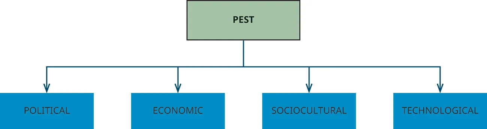
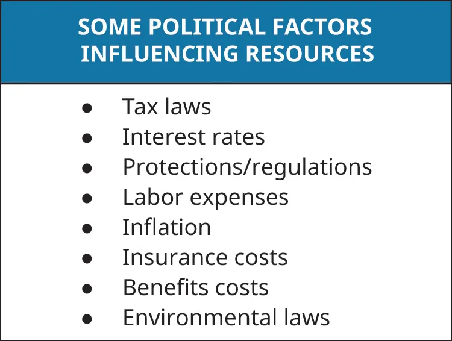

## 14.2   Using the PEST Framework to Assess Resource Needs

> **🎯 Mục tiêu học tập**
>
> Khi kết thúc phần này, Bạn sẽ có thể:
>
> - Mô tả các thành phần của mô hình PEST (các yếu tố chính trị, kinh tế, xã hội–văn hóa và công nghệ)
> - Áp dụng mô hình PEST để đánh giá nhu cầu nguồn lực
> - Hiểu cách đánh giá chi phí nguồn lực điển hình khi khởi nghiệp

Khi bắt đầu lập kế hoạch phân bổ nguồn lực cho doanh nghiệp, Bạn sẽ thấy có nhiều công cụ có thể hỗ trợ. Điều quan trọng trước khi ra mắt là xác định nguồn lực tối thiểu cần thiết để khởi nghiệp. Một số doanh nghiệp sẽ cần nhiều thiết bị vốn hơn (như máy móc sản xuất); một số cần nhiều nguồn lực công nghệ hơn, như phần mềm (hoặc nhà thiết kế phần mềm); một số công ty có thể cần nhiều vốn ngay từ đầu, trong khi một số chỉ cần một khoản đầu tư nhỏ. Mức độ nguồn lực cần thiết cho doanh nghiệp cũng thay đổi theo thời gian.

Khi doanh nhân trải qua quá trình động não để xác định tính khả thi của ý tưởng, họ có thể đồng thời bắt đầu suy nghĩ thực tế về những gì cần thiết để vận hành doanh nghiệp: Cần những nguyên liệu thô nào để sản xuất sản phẩm? Cần bao nhiêu nhân viên ở mỗi giai đoạn? Có cần địa điểm vật lý không, và nếu có, sẽ đặt ở đâu?

Thu hẹp nhu cầu nguồn lực tối thiểu của doanh nghiệp để đáp ứng một số hoặc tất cả câu hỏi này là điều thiết yếu cho việc ra mắt thành công. Doanh nhân có thể thu thập thông tin và đưa ra quyết định sáng suốt về những nhu cầu cần được đáp ứng ngay từ đầu. Thông tin này có thể được tóm gọn vào kế hoạch kinh doanh, kế hoạch marketing, hoặc bài thuyết trình có thể chia sẻ với các bên liên quan. Thông tin thu được từ phản hồi của các bên liên quan không chỉ hữu ích cho doanh nhân và các bên nội bộ, mà còn cho các bên liên quan bên ngoài như ngân hàng, nhà đầu tư, nhà cung cấp, đại lý và đối tác. Thông tin này rất quan trọng cho quá trình ra quyết định. Một công cụ có thể giúp đảm bảo việc lập kế hoạch toàn diện và được cân nhắc kỹ lưỡng là mô hình PEST.

### Mô hình PEST

**Mô hình PEST** là một công cụ đánh giá chiến lược mà doanh nhân có thể sử dụng để xác định các yếu tố có thể ảnh hưởng đến việc tiếp cận các nguồn lực thiết yếu. PEST là viết tắt của các yếu tố chính trị (political), kinh tế (economic), xã hội–văn hóa (sociocultural) và công nghệ (technological) ([Hình 14.10](14-2-using-the-pest-framework-to-assess-resource-needs#OSX_Eship_14_02_PEST)).

*Hình 14.10: Việc hiểu rõ bốn yếu tố này có thể giúp các doanh nhân đánh giá khả năng tiếp cận các nguồn lực quan trọng. (ghi công: Bản quyền thuộc Đại học Rice, OpenStax, theo giấy phép CC BY NC-SA 4.0)*

> **🔗 Liên kết học tập**
>
> Xem [video về PEST](https://openstax.org/l/52PEST) để tìm hiểu thêm. Tại sao việc xem xét môi trường bên ngoài lại quan trọng? Phân tích PEST hoạt động như thế nào?

#### Các Yếu tố Chính trị

Mặc dù Bạn có thể hy vọng làm chủ chính mình, tự lên lịch trình và tuân theo quy tắc riêng, Bạn vẫn phải hoạt động trong thực tế của các yếu tố bên ngoài ảnh hưởng đến doanh nghiệp. **Các yếu tố chính trị** bắt nguồn từ những thay đổi trong chính trị, chẳng hạn như chính sách của một chính quyền tổng thống mới hoặc luật pháp quốc hội. Các chính sách như vậy có thể ảnh hưởng đến khả năng tiếp cận vốn, luật lao động và các quy định về môi trường. Hơn nữa, những thay đổi chính trị này có thể diễn ra ở cấp liên bang, tiểu bang và địa phương. [Hình 14.11](14-2-using-the-pest-framework-to-assess-resource-needs#OSX_Eship_14_02_Political) liệt kê một số yếu tố chính trị có thể ảnh hưởng đến doanh nghiệp. Luật cải cách thuế, chẳng hạn, có thể ảnh hưởng đến số thuế mà doanh nghiệp phải nộp, trong khi các hành động của chủ tịch mới được bổ nhiệm của Cục Dự trữ Liên bang có thể ảnh hưởng đến chi phí vốn của chủ doanh nghiệp nhỏ do thay đổi lãi suất.

*Hình 14.11: Doanh nghiệp phải tuân thủ tất cả luật pháp và quy định, nhưng các yếu tố chính trị như danh sách ở đây có thể ảnh hưởng đến khả năng sinh lời của tổ chức. (ghi công: Bản quyền thuộc Đại học Rice, OpenStax, theo giấy phép CC BY NC-SA 4.0)*

Gần đây, Đạo luật **Cắt giảm Thuế và Việc làm** năm 2017 đã thay đổi thuế suất doanh nghiệp, cũng như các khoản thanh toán hàng quý mà doanh nghiệp nộp cho **Sở Thuế Vụ (IRS)**. Các thay đổi khác bao gồm mở rộng một số khoản khấu trừ và tín dụng thuế (bao gồm các chi phí kinh doanh cụ thể nào có thể được khấu trừ), và phương pháp khấu hao tài sản mới, cũng như các quy tắc khác liên quan đến nhân viên giúp doanh nghiệp nhận được tín dụng và giảm thiểu thuế.[^19]

Doanh nghiệp cũng phải tuân thủ các luật môi trường, chẳng hạn như từ **Hiệp hội An toàn và Rủi ro Nghề nghiệp**[^20] và **Cơ quan Bảo vệ Môi trường (EPA)**.[^21] Ví dụ, các cơ quan chính phủ này yêu cầu doanh nghiệp đào tạo nhân viên về các vật liệu có thể gây nguy hiểm cho con người và cung cấp thông báo và báo cáo về các vấn đề này. **EPA** cũng có các quy định về phát thải khí và nước mà doanh nghiệp phải tuân thủ, vì việc xả thải không đúng cách có thể gây hại cho môi trường. Các doanh nghiệp nhỏ hơn có thể được miễn một số quy định trong một số trường hợp nhất định.

Sản phẩm nhập khẩu được chính phủ liên bang quản lý thông qua hạn ngạch và thuế quan. Luật thuế quan đã được sử dụng như công cụ chính trị để quản lý dòng chảy hàng hóa giữa các quốc gia. **Thuế quan** là các loại thuế hoặc phí được cộng thêm vào hàng hóa nhập khẩu từ quốc gia khác. **Hạn ngạch**, giới hạn về số lượng mặt hàng nhập vào một quốc gia, cũng được sử dụng để hạn chế khối lượng hàng hóa vào nước. Ví dụ, chính phủ Hoa Kỳ năm 2019 đã áp thuế quan lên 550 tỷ đô-la sản phẩm Trung Quốc, trong khi Trung Quốc áp thuế quan lên 185 tỷ đô-la sản phẩm Hoa Kỳ. Mặc dù tranh chấp thương mại đang diễn ra này có thể sẽ được giải quyết, thương mại tự do vẫn là nguồn cạnh tranh kinh tế quốc tế liên tục.[^22]

Ví dụ, chủ doanh nghiệp Daniel **Emerson**, CEO của nhà sản xuất đèn **Light and Motion**, đã mô tả trong một cuộc phỏng vấn trên National Public Radio (NPR) rằng đợt thuế quan mới nhất đối với nguyên liệu từ Trung Quốc có thể buộc ông mở nhà máy sản xuất ở nước ngoài. Light and Motion sản xuất đèn cho xe đạp, đèn đội đầu, drone và sản xuất truyền thông. Theo Emerson, để lấy linh kiện từ Trung Quốc, ông phải trả thuế cho chính phủ Hoa Kỳ khi nhập khẩu. Ông cho biết những khoản thuế quan này có thể phá hủy công ty của ông, vì các đối thủ cạnh tranh chính ở Trung Quốc và các nước khác không phải chịu thuế quan đó; do đó, giá của ông bị đẩy lên cao hơn. Emerson có thể phải chuyển công ty sang Philippines, nơi không có thuế quan. Ông sẽ phải sản xuất ở đó và vận chuyển đèn thành phẩm về Hoa Kỳ.[^23] Với tư cách là doanh nhân, Bạn nên luôn nắm bắt các vấn đề chính trị có thể ảnh hưởng đến hoạt động và kế hoạch của mình.

#### Các Yếu tố Kinh tế

Khởi nghiệp có tác động trực tiếp đến nền kinh tế bằng cách tạo cơ hội việc làm cho nhiều người. Tuy nhiên, các yếu tố kinh tế cũng có thể ảnh hưởng đến sự thành công của doanh nghiệp. Ví dụ, chúng có thể ngăn cản khách hàng mua hàng hóa và dịch vụ do suy thoái kinh tế. Mặt khác, khi nền kinh tế mở rộng và tăng trưởng, mọi người có xu hướng tự tin hơn về công việc và thu nhập, và họ có thể chi tiêu nhiều hơn bình thường. **Các yếu tố kinh tế** — bao gồm tỷ lệ lạm phát, lãi suất, tỷ giá hối đoái (nếu doanh nghiệp hoạt động toàn cầu), tình trạng nền kinh tế (tăng trưởng hay suy giảm), tỷ lệ việc làm và thu nhập khả dụng — có thể ảnh hưởng đến việc định giá hàng hóa hoặc dịch vụ, nhu cầu đối với các dịch vụ đó, và chi phí sản xuất.

Lấy ví dụ về tình trạng nền kinh tế, khi kinh tế suy thoái, nhà hàng sẽ thấy lượng khách giảm vì nhiều người nấu ăn tại nhà để tiết kiệm, hoặc chuyển từ nhà hàng cao cấp sang nhà hàng bình dân hoặc đồ ăn nhanh. Trong nền kinh tế yếu, người tiêu dùng có xu hướng mua thương hiệu cửa hàng (thường gọi là "**nhãn hiệu riêng**") thường xuyên hơn thương hiệu quốc gia để giảm hóa đơn mua sắm. Khi kinh tế khỏe mạnh, người tiêu dùng chi tiêu nhiều hơn cho giải trí và nhà hàng, có thể coi là hàng xa xỉ. Nhà hàng sẽ cần điều chỉnh nguồn lực để đáp ứng nhu cầu biến động theo kinh tế. Khi nhu cầu cao, nhà hàng có thể cần thêm vật tư và nhân viên. Các nhu cầu này đòi hỏi thêm nguồn lực tài chính. Khi nhu cầu thấp, điều ngược lại xảy ra.

#### Các Yếu tố Xã hội–Văn hóa

Hiểu biết về khách hàng là chìa khóa để cung cấp những gì họ thực sự muốn. Các yếu tố bổ sung cần xem xét bao gồm những thay đổi trong cách xã hội vận động và hướng đi của sự vận động đó liên quan đến cơ sở khách hàng và các thị trường mới tiềm năng. Những **các yếu tố xã hội–văn hóa** này bao gồm tỷ lệ tăng trưởng dân số, thay đổi nơi ở, xu hướng xã hội như ăn uống lành mạnh và tập thể dục, trình độ học vấn, xu hướng thế hệ (millennial, baby boomer, hoặc Gen X và Y), và văn hóa tôn giáo. Các yếu tố này có thể ảnh hưởng không chỉ đến bảy chữ P mà Bạn đã học trong chương [Marketing và Bán hàng Khởi nghiệp](8-introduction), mà còn đến việc đánh giá nguồn lực cụ thể hơn. Cần xem xét kỹ các yếu tố này để phân bổ nguồn lực marketing tối ưu.

Một yếu tố xã hội–văn hóa có tầm ảnh hưởng sâu rộng là tác động của mua sắm trực tuyến đối với các nhà bán lẻ truyền thống. Xu hướng mua sắm trực tuyến này đã buộc các công ty lâu đời như **JCPenney**, **Payless**, **Gap**, **Victoria's Secret**, **Radio Shack**, **Macy's**, và **Sears** phải đóng hàng nghìn cửa hàng, nộp đơn phá sản, hoặc ngừng hoạt động hoàn toàn. Các công ty này đã đối mặt với sự cạnh tranh khốc liệt từ **Amazon** và các doanh nghiệp nhỏ hơn như **ModCloth** và **Birchbox** tương tác với khách hàng trực tuyến và theo kịp xu hướng xã hội. Các thế hệ trẻ như thế hệ Y và Z đã kích hoạt những thay đổi xã hội này, vì họ am hiểu công nghệ hơn và mong muốn tìm thấy chính xác những gì họ muốn, ở đâu và khi nào họ muốn.

#### Các Yếu tố Công nghệ

Về **các yếu tố công nghệ**, doanh nghiệp cần đảm bảo có thiết bị cho phép hoạt động hiệu quả. Có nhiều loại công nghệ khác nhau hỗ trợ marketing, tài chính, năng suất, cộng tác, thiết kế và sản xuất.

Khả năng sử dụng công nghệ để đáp ứng nhu cầu khách hàng, như có một trang web thông tin hoặc thương mại điện tử (để khách hàng có thể mua sắm tại nhà) là "điều bắt buộc" ngày nay đối với hầu hết các doanh nghiệp. Marketing kỹ thuật số đã cho phép doanh nhân quảng bá doanh nghiệp theo nhiều cách khác nhau, thông qua email marketing, quảng cáo kỹ thuật số trên các công cụ tìm kiếm như **Google** hoặc **Bing**, trang web, nhóm mạng xã hội, video **YouTube** và blog. Các công cụ này dễ sử dụng, sẵn có và có thể phải chăng, ngay cả với ngân sách eo hẹp.

> **📝 Thực hành: Mạng Xã hội như một Nguồn Lực**
>
> Tận dụng công nghệ mạng xã hội là điều thiết yếu để xây dựng thương hiệu và nhận diện trong xã hội kỹ thuật số ngày nay. Hãy tạo một bảng ý tưởng cho trang **Facebook** của doanh nghiệp tấm pin mặt trời Helios đã được đề cập trước đó trong chương. Bạn muốn bao gồm những loại thông tin nào? Bạn muốn trang hoạt động hay chỉ mang tính thông tin? Công cụ mạng xã hội này sẽ được sử dụng như nguồn chính để khách hàng tìm hiểu về doanh nghiệp hay là công cụ bổ sung để tạo mối quan hệ sâu hơn?

Các công nghệ khác cũng hữu ích trong việc quản lý thanh toán từ khách hàng, lập hóa đơn, chi trả nhân sự và sổ sách kế toán. **QuickBooks** là phần mềm phổ biến mà doanh nhân mới có thể mua và sử dụng để quản lý tài chính công ty. Các sản phẩm khác cũng có sẵn — **ZOHO Books**, **FRESH Books**, **GoDaddy Bookkeeping**, và **Kashoo** — mỗi sản phẩm có ưu và nhược điểm riêng.

Các loại phần mềm khác như **UAttend** giúp doanh nghiệp nhỏ theo dõi thời gian và năng suất nhân viên, và **Basecamp** giúp doanh nhân theo dõi các dự án mà mọi người đang thực hiện, đồng thời cho phép họ cộng tác với nhau. Các công cụ này giúp doanh nhân dễ dàng quản lý dự án với nhà thầu hoặc nhân viên.

Công nghệ khác cần xem xét nếu Bạn sản xuất sản phẩm bao gồm các công cụ và thiết bị tạo ra hàng hóa và dịch vụ. Một số ví dụ là **CAD** (**thiết kế có hỗ trợ máy tính**), in 3-D để phát triển mẫu thử nhanh ([Hình 14.12](14-2-using-the-pest-framework-to-assess-resource-needs#OSX_Eship_14_02_3DPrinting)), **CAM** (**sản xuất có hỗ trợ máy tính**), robot và vật liệu mới cho phép sản xuất nhanh hơn và rẻ hơn. **In 3-D** là quy trình sản xuất sử dụng kỹ thuật thêm từng lớp vật liệu để tạo mẫu thử nhanh. Nó có thể được sử dụng để tạo mẫu thử sản phẩm, đồ chơi, mô hình kiến trúc, bộ phận giả, công cụ, thời trang, phụ tùng ô tô, và thậm chí sản phẩm hoàn chỉnh như nhà ở, như trong trường hợp **New Story**.[^24] Việc sử dụng **tạo mẫu thử** cho phép sáng tạo, và các công nghệ mới hơn cho phép người dùng tạo nhiều mẫu thử. **Nike** sử dụng in 3-D để tạo mẫu thử vì nhanh hơn so với chờ một mẫu thử hoàn chỉnh đi qua quy trình sản xuất. Sử dụng công nghệ này cũng tránh được chi phí xây dựng sản phẩm thực tế, cho phép tinh chỉnh sản phẩm cuối nhanh chóng, và giảm lỗi sản xuất.

Nhược điểm là một số công nghệ này có thể đắt để mua, và có thể mất nhiều thời gian để thu hồi chi phí. (Tuy nhiên, khi lương và chi phí phúc lợi tăng nhanh, chúng có thể tự hoàn vốn khá nhanh.) Doanh nhân phải chắc chắn chỉ mua những công cụ và vật liệu giúp họ bắt đầu. Sau đó, khi doanh nghiệp phát triển, sẽ có thêm vốn cho thiết bị và phần mềm đắt tiền hơn. Doanh nhân cần có kỹ năng và kiến thức để vận hành phần mềm cụ thể và xem xét chi phí nâng cấp và thay thế.

*Hình 14.12: In 3D cho phép các công ty phát triển mẫu thử nhanh chóng trước khi đầu tư nguồn lực đáng kể. (a) Một hình cầu 3D, ví dụ, có thể được tạo ra bằng cách sử dụng (b) một máy in 3D. (nguồn (a): chỉnh sửa từ “ball 3d printing design” bởi “metalurgiamontemar0”/Pixabay, CC0; nguồn (b): chỉnh sửa từ “3d printer printing technology” bởi “kaboompics”/Pixabay, CC0)*

### Đánh giá Chi phí Nguồn Lực cho Khởi nghiệp

Khởi nghiệp có thể là một sự kiện thú vị, và đòi hỏi lập kế hoạch chu đáo. Lập kế hoạch nguồn lực có thể giúp xác định chi phí khởi nghiệp, từ đó giúp ước tính doanh thu hòa vốn, lợi nhuận, loại tài trợ nào nên sử dụng và cách lập kế hoạch cho các chi phí tương lai như thuế. Theo hướng dẫn kinh doanh của SBA,[^25] có một số bước Bạn nên thực hiện để xác định chi phí khởi nghiệp cho các loại doanh nghiệp khác nhau.

Đầu tiên, xác định loại hình doanh nghiệp Bạn muốn mở: cửa hàng truyền thống, trực tuyến, hoặc dịch vụ. Doanh nghiệp truyền thống có địa điểm vật lý nơi khách hàng có thể mua sản phẩm. Doanh nghiệp trực tuyến hoạt động qua trang web thương mại điện tử. Doanh nghiệp dịch vụ cung cấp dịch vụ thay vì sản phẩm hữu hình. Ngoài ra, hãy xem xét loại hình cơ cấu doanh nghiệp Bạn sẽ có (xem [Các Lựa chọn Cơ cấu Doanh nghiệp: Vấn đề Pháp lý, Thuế và Rủi ro](13-introduction)).

Tiếp theo, lập danh sách chi phí như trong [Bảng 14.5](14-2-using-the-pest-framework-to-assess-resource-needs#fs-idm213938288). Có thể có thêm chi phí dựa trên thảo luận xác định nhu cầu nguồn lực ở [Các Loại Nguồn Lực](14-1-types-of-resources). Nhiều chi phí sẽ dễ xác định, nhưng một số — như lương, bảo hiểm, và cải tạo — có thể khó ước tính hơn. Bạn có thể tham khảo các trang nghiên cứu, nguồn lực doanh nghiệp địa phương (như **phòng thương mại**), hoặc nói chuyện với cố vấn hoặc tư vấn viên (như **SCORE**) để được hướng dẫn thêm.

**Bảng 14.5: Examples of Common Costs Related to Starting a Business**

| Loại Chi phí | Ví dụ cho một Công ty Tư vấn Marketing Giả định |
| --- | --- |
| Không gian vật lý cho văn phòng, tòa nhà, nhà máy | Văn phòng 10' × 15' tòa nhà trung tâm |
| Bất động sản, đất đai | Không có |
| Nội thất và thiết bị cố định | Hai bàn nhỏ, sáu ghế |
| Hàng tồn kho | Không có |
| Thiết bị và vật tư | Máy tính, máy in/copy/scan màu, giấy, mực, văn phòng phẩm |
| Phương tiện | Xe cá nhân |
| Tiện ích | Điện, sưởi/điều hòa, nước, điện thoại/Internet |
| Tiền đặt cọc thuê/tiện ích | Tiền đặt cọc thuê, tiện ích |
| Giấy phép và chứng nhận | Giấy phép kinh doanh LLC |
| Bảo hiểm doanh nghiệp và phương tiện | Sở hữu cá nhân |
| Phí kế toán và luật sư | Kế toán và luật sư |
| Lương và thù lao nhân viên | Một trợ lý bán thời gian, một lập trình viên web |
| Quảng cáo và khuyến mãi | Một quảng cáo radio |
| Nghiên cứu thị trường | Cơ sở dữ liệu khách hàng |
| Tài liệu marketing in ấn | Giấy tiêu đề, tờ rơi, danh thiếp |
| Marketing kỹ thuật số | Trang web, mạng xã hội, email marketing |
| Hội viên | Phòng thương mại/nhóm kết nối |

Xác định chi phí ước tính cho từng mục. Khi danh sách đã được lập, việc tìm hiểu chi phí cho từng mục sẽ cho phép Bạn ước tính nhu cầu cơ bản. Một nguồn thông tin tốt là **Cục Lao động Hoa Kỳ**, nơi công bố danh sách nghề nghiệp cùng mức lương và phúc lợi theo địa điểm và ngành nghề.

Sau khi xác định tất cả chi phí, hãy phân loại chi phí nào là chi phí một lần (chi phí trước khi ra mắt) và chi phí nào là chi phí định kỳ (thường theo tháng, quý hoặc năm). **Chi phí trước khi ra mắt** bao gồm mọi thứ Bạn phải có trước khi mở cửa doanh nghiệp cho công chúng. Bao gồm giấy phép và chứng nhận kinh doanh, tài liệu marketing, thiết bị và hàng tồn kho. Chi phí định kỳ bao gồm tiền thuê, tiện ích, một số chi phí marketing liên tục như quảng cáo kỹ thuật số, và lương. Nên dự trữ ít nhất một đến hai năm chi phí hàng tháng để đảm bảo doanh nghiệp có thời gian xây dựng thương hiệu và cơ sở khách hàng.

Bạn nên đưa thông tin này vào phần tài chính của kế hoạch kinh doanh. Dữ liệu này có thể cung cấp bức tranh rõ ràng về chi phí và doanh thu tương lai mà ngân hàng và nhà đầu tư mạo hiểm có thể thấy hữu ích khi đưa ra quyết định đầu tư.

*Hình 14.13: Mẫu này từ Cơ quan Quản lý Doanh nghiệp Nhỏ (SBA) được thiết kế để giúp Bạn ghi lại các chi phí một lần và chi phí định kỳ cho nhu cầu nguồn lực của mình. Việc cộng tổng chi phí một lần vào tổng chi phí hàng tháng sẽ giúp Bạn tính toán chi phí khởi nghiệp của mình (nhìn chung Bạn nên lập kế hoạch trước cho một vài năm chi phí hàng tháng). (ghi công: Bản quyền thuộc Đại học Rice, OpenStax, theo giấy phép CC BY NC-SA 4.0)*

> **❓ Bạn đã sẵn sàng chưa?: Chi phí Tiệm Pizza Đặc biệt**
>
> Hãy tưởng tượng Bạn muốn mở một tiệm pizza ở thị trấn. Ý tưởng của Bạn là cung cấp các lựa chọn ăn kiêng đặc biệt như pizza thuần chay và không chứa gluten, bên cạnh pizza thông thường. Bạn muốn mở ở một khu mua sắm mới, sầm uất để tiếp cận thị trường mục tiêu.
>
>
>
> Tải bảng tính kinh doanh của **SBA** để tính chi phí một lần và hàng tháng cho doanh nghiệp: [https://www.sba.gov/sites/default/files/2017-07/Startup%20Costs%20Worksheet.pdf](https://www.sba.gov/sites/default/files/2017-07/Startup%20Costs%20Worksheet.pdf).
