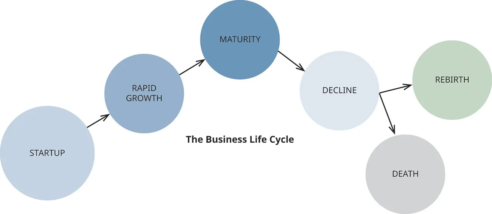

## 14.3   Managing Resources over the Venture Life Cycle

> **🎯 Mục tiêu học tập**
>
> Khi kết thúc phần này, Bạn sẽ có thể:
>
> - Giải thích cách mô hình lý thuyết phụ thuộc nguồn lực giúp doanh nghiệp phát triển
> - Hiểu các nhu cầu nguồn lực điển hình qua vòng đời
> - Mô tả các bước cơ bản trong việc đảm bảo nguồn nhân lực
> - Hiểu tầm quan trọng của nguồn lực giáo dục và cá nhân đối với doanh nhân

Việc đánh giá nguồn lực cần thiết không kết thúc ở giai đoạn khởi nghiệp. Đây là quá trình liên tục mà doanh nhân phải lặp lại qua các giai đoạn khác nhau của vòng đời doanh nghiệp. Giai đoạn nào của vòng đời phụ thuộc vào loại nguồn lực cần thiết, số lượng và tần suất.

Khi **Birchbox** bắt đầu vào năm 2010, đội ngũ sáng lập bao gồm hai người và họ có tầm nhìn rằng sản phẩm mẫu sẽ là một công cụ marketing tuyệt vời cho các thương hiệu mỹ phẩm nhỏ. Khi công ty phát triển, họ huy động vốn đầu tư mạo hiểm và mở rộng cả số lượng nhân viên và sản phẩm. Tuy nhiên, khi công ty trưởng thành, họ cần đánh giá lại nguồn lực. Năm 2018, họ giảm nhân sự từ khoảng 300 xuống dưới 100 để duy trì lợi nhuận.

*Hình 14.14: Katia Beauchamp, chủ sở hữu của Birchbox, sẽ tiếp tục chèo lái công ty với sự trợ giúp của một nhà đầu tư quỹ phòng hộ. (nguồn: ảnh do Birchbox cung cấp)*

Như chúng ta có thể thấy từ ví dụ Birchbox, hoạt động kinh doanh bị ảnh hưởng bởi nhiều yếu tố khác nhau, cả bên trong và bên ngoài. Các yếu tố bên ngoài bao gồm thay đổi quy định, suy thoái kinh tế và cạnh tranh. Các yếu tố bên trong bao gồm năng lực đội ngũ, mô hình kinh doanh và chiến lược. Khi các yếu tố này thay đổi, doanh nhân phải điều chỉnh chiến lược nguồn lực phù hợp.

Để đối phó với một số vấn đề này, các mối quan hệ phụ thuộc có thể được hình thành với các bên khác trong một mạng lưới các doanh nghiệp. Điều này có thể giúp né tránh tác động của các yếu tố bên ngoài như sự gia tăng cạnh tranh trong thị trường tương ứng của họ, khả năng hạn chế trong việc tiếp cận tín dụng cho các nguồn vốn, thiếu hụt nguyên liệu thô cần thiết để sản xuất hàng hóa của họ, hoặc nguồn nhân lực để đáp ứng mức độ dịch vụ và sản xuất được yêu cầu.

Ví dụ, nhiều doanh nghiệp trong cùng một ngành cụ thể phụ thuộc vào cùng người mua, nhà cung cấp, nguyên liệu thô, hoặc các nguồn lực môi trường khác. **Mô hình lý thuyết phụ thuộc nguồn lực (RDT)** cho rằng việc hình thành các mạng lưới như sáp nhập, tích hợp dọc, và liên doanh, hoặc tham gia vào các hoạt động chính trị chung, có thể giúp giảm nhẹ sự phụ thuộc giữa các nhóm thành viên.[^27] Mô hình cổ điển này vẫn còn phù hợp cho đến ngày nay.

Như [Ra mắt để Tăng trưởng và Thành công](10-introduction) đã thảo luận, **sáp nhập** xảy ra khi hai công ty kết hợp thành một. Sáp nhập cho phép các công ty chia sẻ nguồn lực, giảm chi phí và tăng sức mạnh thị trường.

Trong **tích hợp dọc**, một công ty kiểm soát nhiều giai đoạn của chuỗi cung ứng. Ví dụ, một nhà sản xuất có thể mua lại nhà cung cấp nguyên liệu (tích hợp ngược) hoặc nhà phân phối (tích hợp xuôi) để giảm chi phí và kiểm soát chất lượng tốt hơn.

**Liên doanh** là sự hợp tác giữa hai hoặc nhiều công ty để chia sẻ nguồn lực, rủi ro và lợi nhuận trong một dự án cụ thể. Liên doanh cho phép các công ty tiếp cận thị trường mới và công nghệ mới mà họ không thể tự mình đạt được.

Trong trường hợp Birchbox, có thể đến lúc một thương hiệu mỹ phẩm và Birchbox quyết định liên doanh để tạo ra một dòng sản phẩm độc quyền. Hoặc Birchbox có thể sáp nhập với một công ty mỹ phẩm khác để mở rộng thị phần.

Trong một ví dụ khác, nông dân đã chuyển sang sử dụng drone thương mại để giúp đánh giá mùa màng, tưới tiêu và theo dõi vật nuôi. Công nghệ này đã trở thành nguồn lực quan trọng cho nông nghiệp hiện đại.

> **📝 Thực hành: Auntie Anne’s Pretzels and Strategic Partnership**
>
> Truy cập [trang web của Auntie Anne's](https://openstax.org/l/52AuntieAnne) để tìm hiểu thêm về mô hình nhượng quyền. Nhượng quyền cung cấp những nguồn lực gì cho doanh nhân?
>
>
> - Viết bản tóm tắt về cách Anne Beiler đã xây dựng và phát triển doanh nghiệp của mình.
> - Beiler đã sử dụng những chiến lược nào để xác định đối tác chiến lược, nguồn lực và quy trình để bảo vệ doanh nghiệp?

### Nguồn Lực Cần thiết Based on Life Cycle

Doanh nhân cần xác định và lập kế hoạch cho nhu cầu nguồn lực của mình ([Hình 14.14](14-3-managing-resources-over-the-venture-life-cycle#OSX_Eship_14_03_BusPhases)). Mỗi giai đoạn của vòng đời doanh nghiệp đòi hỏi sự điều chỉnh nguồn lực khác nhau.

*Hình 14.15: Các doanh nhân và chủ doanh nghiệp nên lập kế hoạch cho nhu cầu nguồn lực và nguồn tài trợ liên quan qua tất cả các giai đoạn của vòng đời doanh nghiệp. (ghi công: Bản quyền thuộc Đại học Rice, OpenStax, theo giấy phép CC BY NC-SA 4.0)*

#### Giai đoạn Khởi nghiệp

**Giai đoạn khởi nghiệp** là giai đoạn đầu tiên trong vòng đời doanh nghiệp. Trong giai đoạn này, doanh nhân tập trung vào việc phát triển sản phẩm hoặc dịch vụ, xây dựng cơ sở khách hàng và thiết lập hoạt động kinh doanh.

Mọi doanh thu bán hàng được tái đầu tư ngay vào doanh nghiệp với mục tiêu phát triển cơ sở khách hàng và tạo lập chỗ đứng trên thị trường. Trong giai đoạn này, chi phí thường vượt quá doanh thu.

**Hội đồng cố vấn** rất quan trọng trong giai đoạn này, vì họ mang đến thông tin và kinh nghiệm hiện tại có thể đưa ra góc nhìn mới về các vấn đề mà không có quyền biểu quyết hay quản trị thực tế.

Trong trường hợp Christina's Confections, cô bắt đầu làm bánh tại nhà với các nguồn lực cá nhân. Khi doanh thu tăng, cô thuê một nhân viên bán thời gian và bắt đầu nghĩ đến việc mở rộng sang cửa hàng bán lẻ.

#### Giai đoạn Tăng trưởng

Trong **giai đoạn tăng trưởng**, doanh nghiệp bắt đầu tạo ra lợi nhuận ổn định và mở rộng thị phần. Doanh nhân cần thêm nguồn lực để đáp ứng nhu cầu tăng trưởng, bao gồm thêm nhân viên, thiết bị và có thể mở rộng cơ sở vật chất.

> **🔗 Liên kết học tập**
>
> Hãy xem [danh sách kiểm tra doanh nghiệp nhỏ](https://openstax.org/l/52SmallBusCheck) này để tìm hiểu thêm. Những yếu tố nào là quan trọng nhất khi mở rộng doanh nghiệp?

Trong giai đoạn tăng trưởng, doanh nhân có thể cần thay đổi chiến lược marketing, tăng sản xuất, thuê thêm nhân viên, hoặc mở thêm địa điểm. Mỗi quyết định này đều ảnh hưởng đến nhu cầu nguồn lực.

Hãy xem lại tiệm bánh Christina's Confections. Sau hai năm hoạt động, cô cần đánh giá lại nhu cầu nguồn lực dựa trên sự tăng trưởng của doanh nghiệp.

#### **Giai đoạn Trưởng thành**

Trong giai đoạn trưởng thành, khi sản phẩm có thể đã bão hòa thị trường và có thể có ít không gian hơn cho sự tăng trưởng, doanh nhân cần tập trung vào hiệu quả và duy trì thị phần. Chiến lược có thể bao gồm đổi mới sản phẩm, mở rộng thị trường mới, hoặc cải thiện quy trình.

Khi nhu cầu thay đổi theo sự tăng trưởng này, doanh nhân phải xem xét lại các nguồn lực, vận hành cách chúng được sử dụng, và xác định xem có thể đạt được hiệu quả gì bằng cách giữ lại các nguồn lực nhất định và thuê ngoài các nguồn lực khác. **Thuê ngoài** là hoạt động thuê một công ty hoặc bên thứ ba bên ngoài để thực hiện một nhiệm vụ, công việc, hoặc quy trình cụ thể, hoặc để sản xuất hàng hóa. Điều này phổ biến trong nguồn nhân lực, nơi nhiều công ty thuê ngoài lực lượng lao động của họ để giảm chi phí và tập trung vào việc giữ lại các nhiệm vụ mà họ xuất sắc.

Ví dụ, nếu bạn là một công ty tiếp thị kỹ thuật số và có một số dự án thiết kế web mà bạn đang thực hiện, việc thuê ngoài có thể giúp bạn chuyển một số nhiệm vụ thách thức nhất trong quy trình thiết kế hoặc lập trình cho một công ty khác, trong khi doanh nghiệp của bạn tập trung vào các bước trong quy trình là thế mạnh của công ty bạn. Tương tự, một công ty khác có thể tìm cách sử dụng các nguồn lực của công ty bạn nếu họ tin rằng công ty bạn có sự thành thạo lớn hơn đối với các nhiệm vụ cụ thể.

#### **Giai đoạn Suy thoái/Tái sinh**

Trong giai đoạn suy thoái của doanh nghiệp, nếu muốn tái sinh, nguồn lực phải được tái phân bổ hoặc tìm kiếm nguồn lực mới. Doanh nhân phải đánh giá tình hình thị trường và quyết định liệu có nên đổi hướng, tái cơ cấu, hoặc chuyển sang mô hình kinh doanh mới.

**Bảng 14.6: Summary of Resources for Each Phase of Business**

| Giai đoạn Kinh doanh | Nguồn Lực Cần thiết |
| --- | --- |
| Startup | Vốn ban đầu, thiết bị cơ bản, hàng tồn kho, ít nhân viên, cơ sở (nhà hoặc địa điểm), giá vốn hàng bán, marketing materials, mentorship |
| Growth | Thêm vốn, thêm nhân viên/phòng ban, marketing, thêm thiết bị, hàng tồn kho |
| Maturity | Xây dựng thương hiệu, thuê ngoài |
| Decline/Rebirth | Thiết bị/công nghệ mới, sản phẩm mới, bằng sáng chế mới, tài trợ vốn chủ sở hữu cho sáp nhập tiềm năng |

### Nguồn Nhân lực

Khi bắt đầu hành trình khởi nghiệp, Bạn sẽ nhận ra rằng không thể tự làm mọi thứ. **Nguồn nhân lực** là yếu tố quan trọng cho sự thành công của doanh nghiệp. Tuyển dụng đúng người cho đúng vị trí là một trong những quyết định quan trọng nhất mà doanh nhân phải đưa ra.

Đầu tiên, tìm hiểu tại sao Bạn cần sự giúp đỡ là bước quan trọng trong việc đánh giá nguồn nhân lực. Bạn cần xác định những nhiệm vụ nào không thể tự thực hiện và cần người có chuyên môn.

Khi xác định rằng tuyển nhân viên mới là nhu cầu thực sự và là lựa chọn tài chính thông minh, Bạn có thể bắt đầu quy trình tuyển dụng bằng cách tạo mô tả công việc rõ ràng.

Để chuẩn bị cho việc xác định nhu cầu tuyển dụng và tạo mô tả công việc, hãy nghĩ về những kỹ năng, kinh nghiệm và phẩm chất mà Bạn cần ở nhân viên.

#### Bước 1: Xác định Nhu cầu Nguồn Lực

Hiểu nhu cầu doanh nghiệp về các chức năng công việc là bước đầu tiên trong việc xây dựng đội ngũ hiệu quả.

Bạn cũng cần xác định liệu cần nhân viên toàn thời gian hay bán thời gian, hoặc **nhà thầu độc lập** (còn gọi là freelancer). Mỗi loại hình có ưu nhược điểm riêng về chi phí, kiểm soát và cam kết.

Hãy nhớ rằng nhu cầu có thể thay đổi, vì vậy ngay cả khi Bạn đã lập kế hoạch, việc thực hiện có thể cần điều chỉnh theo tình hình thực tế.

Xác định những kỹ năng và kinh nghiệm mà đội ngũ cần có là điểm khởi đầu tốt. Hãy tạo mô tả công việc chi tiết bao gồm trách nhiệm, yêu cầu và kỳ vọng.

#### Step 2: Hire a Team

Tuyển dụng đội ngũ nhân viên có thể là nhiệm vụ khó khăn, nhưng nếu Bạn tập trung trước vào việc hiểu nhu cầu, quy trình sẽ trở nên dễ quản lý hơn.

*Hình 14.16: Tuyển dụng đúng nhân viên cho doanh nghiệp của Bạn sẽ đảm bảo rằng họ sẽ giúp Bạn bắt đầu và phát triển công ty. (nguồn: “job interview hiring hand shake” bởi “Tumisu”/Pixabay, CC0)*

Sau khi đăng tuyển, Bạn cần quyết định thời gian quảng cáo vị trí. Cũng cần xem xét chi phí quảng cáo tuyển dụng và kênh phù hợp nhất để tiếp cận ứng viên chất lượng.

> **🔗 Liên kết học tập**
>
> Trước khi tiến hành phỏng vấn, Bạn cần nắm rõ [luật lao động](https://openstax.org/l/52LaborLaws) liên quan để đảm bảo tuân thủ trong quá trình tuyển dụng.

#### Bước 3: Tạo Sổ tay Nhân viên

Nếu Bạn bắt đầu doanh nghiệp từ đầu mà chưa có doanh thu, có thể Bạn chưa đủ khả năng tài chính để thuê nhân viên toàn thời gian. Trong trường hợp đó, nhà thầu độc lập hoặc nhân viên bán thời gian có thể là giải pháp phù hợp.

> **🔗 Liên kết học tập**
>
> Một số công ty đã bắt đầu tạo [sổ tay nhân viên](https://openstax.org/l/52Handbook) để hướng dẫn nhân viên mới về chính sách, quy trình và văn hóa công ty.

#### Bước 4: Tìm Nhà thầu Độc lập, nếu Cần

Như đã đề cập trong [Xây dựng Mạng lưới và Nền tảng](12-introduction), có nhiều nguồn lực hỗ trợ doanh nhân trong quá trình tuyển dụng và quản lý nhân sự.

> **🔗 Liên kết học tập**
>
> Hãy xem [danh sách kiểm tra nhà thầu](https://openstax.org/l/52ContractCheck) này. Những yếu tố nào là quan trọng nhất khi thuê nhà thầu độc lập?

#### Bước 5: Thiết lập Phúc lợi

Khi thiết kế một vị trí và tuyển dụng người, một sự cân nhắc quan trọng khác là kế hoạch phúc lợi mà bạn sẽ cung cấp. Các phúc lợi phổ biến bao gồm đóng góp vào hoặc cung cấp chi phí bảo hiểm y tế, thời gian nghỉ phép được trả lương và số ngày nghỉ ốm, cung cấp quyền truy cập vào các tài khoản hưu trí 401K và đóng góp vào đó thay mặt cho nhân viên, và bảo hiểm—bao gồm bảo hiểm nhân thọ, khuyết tật dài hạn và ngắn hạn, và bảo hiểm tai nạn. Ngoài ra, bạn có thể muốn cung cấp các quyền chọn cổ phiếu để cung cấp cho nhân viên một phần của doanh nghiệp bạn và lôi kéo họ làm việc cho một công ty mà họ làm chủ. Mỗi phúc lợi này đều chịu sự điều chỉnh của các quy định của tiểu bang hoặc liên bang, hoặc cả hai. Tìm kiếm lời khuyên từ các chuyên gia về những vấn đề này sẽ là một sự sử dụng thời gian và tiền bạc có giá trị của doanh nhân. Làm sai các phúc lợi cho nhân viên này có thể làm tiêu tan một công ty một cách nhanh chóng.

> **🔗 Liên kết học tập**
>
> Truy cập trang web Hiệp hội Quản lý Nguồn Nhân lực để tìm [nguồn lực về lương thưởng và phúc lợi](https://openstax.org/l/52CompBen). Tại sao việc cung cấp phúc lợi cạnh tranh lại quan trọng?

Khi nhân viên đã gia nhập, có một quy trình liên tục gồm đào tạo, thăng tiến, và phát triển nghề nghiệp để giữ chân và phát triển nhân tài.

- Các kỹ năng tôi cần có sẵn trong khu vực tôi dự định hoạt động không?
- Mức lương phổ biến cho nguồn nhân lực tôi cần là bao nhiêu?
- Tôi có thể trả bao nhiêu cho nhân viên ở giai đoạn này của doanh nghiệp?
- Nhà thầu độc lập là lựa chọn tốt nhất hay nhân viên phù hợp hơn?
- Tôi có cần cung cấp đào tạo chính quy liên tục hoặc duy trì chứng chỉ hoặc giấy phép cho nhân viên không?
- Làm thế nào để cạnh tranh với doanh nghiệp khác nhằm thu hút nhân tài tôi cần?
- Tôi có cần cung cấp phúc lợi như nghỉ phép, kế hoạch hưu trí, bảo hiểm y tế, hoặc bảo hiểm nhân thọ không?

### Nguồn Lực Giáo dục, Hỗ trợ và Cố vấn

Doanh nhân không chỉ cần lưu ý đến các nguồn lực cần thiết để vận hành doanh nghiệp mà còn cần đầu tư vào bản thân. Kiến thức, kỹ năng và sức khỏe tinh thần của doanh nhân là nền tảng cho sự thành công.

Mặc dù một số doanh nhân có bằng kinh doanh và một số có bằng cao học, nhưng học tập suốt đời là điều cần thiết. Tham gia các khóa học, hội thảo và sự kiện ngành giúp doanh nhân cập nhật kiến thức và mở rộng mạng lưới.

Như chúng ta đã thấy trong suốt cuốn sách, làm doanh nhân không phải là nhiệm vụ dễ dàng. Nó đòi hỏi sự cam kết, kiên trì và khả năng thích ứng liên tục.

Có bạn bè và gia đình ủng hộ doanh nghiệp là điều quan trọng cho sức khỏe tinh thần và sự kiên trì của doanh nhân.

Có cố vấn đã trải qua các vấn đề tương tự và có thể lắng nghe và tư vấn là nguồn lực vô giá. Cố vấn có thể đến từ mạng lưới cá nhân, tổ chức nghề nghiệp, hoặc các chương trình hỗ trợ doanh nghiệp.

> **🛠️ Bạn có thể làm gì?: Take a SCORE Course**
>
> Truy cập **SCORE** để tìm kiếm cố vấn phù hợp. SCORE cung cấp dịch vụ cố vấn miễn phí cho doanh nhân.
>
>
> - Cố vấn: Cung cấp dịch vụ cố vấn kinh doanh bảo mật, trực tiếp hoặc trực tuyến
> - Chuyên gia lĩnh vực: Cung cấp kiến thức chuyên sâu dựa trên kỹ năng chuyên môn hoặc ngành nghề
> - Người dẫn hội thảo: Dẫn dắt các hội thảo, seminar và sự kiện địa phương giúp doanh nhân đạt mục tiêu and achieve success
> - Vai trò hỗ trợ chi nhánh: Chia sẻ kỹ năng marketing, công nghệ, tài chính, gây quỹ và nhiều hơn để giúp mở rộng mạng lưới SCORE
>
>
> Bạn thấy mình phù hợp với vai trò nào trong số này trong tương lai và tại sao?
