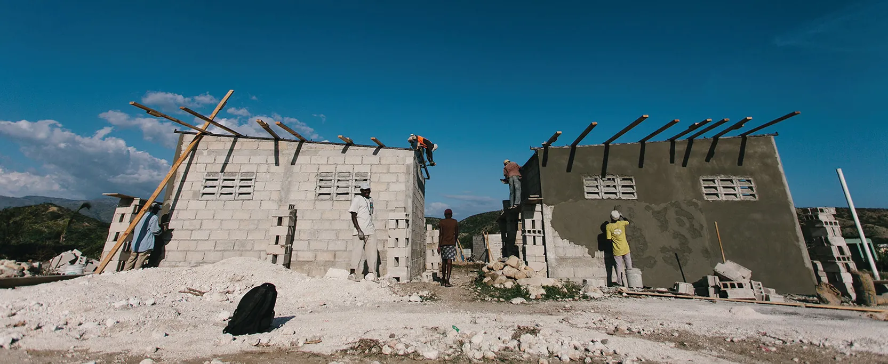

*Hình 14.1: New Story đang thay đổi cách các doanh nghiệp xã hội quản lý nguồn lực thông qua một mô hình kinh doanh đổi mới sáng tạo sử dụng nguồn lực cộng đồng để tài trợ cho việc xây dựng. (nguồn: chỉnh sửa ảnh do New Story cung cấp)*

## Dàn ý chương

- [14.1   Các Loại Nguồn Lực](14-1-types-of-resources)
- [14.2   Sử dụng Mô hình PEST để Đánh giá Nhu cầu Nguồn Lực](14-2-using-the-pest-framework-to-assess-resource-needs)
- [14.3   Quản lý Nguồn Lực qua Các Giai đoạn của Vòng đời Doanh nghiệp](14-3-managing-resources-over-the-venture-life-cycle)

## Giới thiệu

**New Story**, một doanh nghiệp xã hội có tầm nhìn tiến bộ, đã đặt mục tiêu giải quyết một vấn đề toàn cầu ảnh hưởng đến hơn một tỷ người[^1] trên khắp thế giới: tình trạng vô gia cư và thiếu nơi trú ẩn phù hợp. Tổ chức này đã gây ấn tượng với nhiều nhà đầu tư nhờ cách mạng hóa kỹ thuật xây dựng nhà ở. Các nhà sáng lập — Brett **Hagler**, Alexandria **Lafci**, Mike **Arrieta** và Matthew **Marshall** — cùng chia sẻ niềm đam mê "cải thiện cuộc sống thông qua những ngôi nhà an toàn và tầm nhìn chung nhằm thay đổi mô hình từ thiện truyền thống."[^2] Khi nhận ra nhu cầu cấp thiết về nhà ở trên toàn cầu, với rất nhiều người bị mất chỗ ở do thiên tai, họ quyết định tận dụng một mô hình từ thiện thay thế bằng cách kết nối với các tổ chức xây dựng khác và sử dụng gọi vốn cộng đồng. Bốn nhà đổi mới này đã kết hợp kỹ năng của mình để tạo ra một tổ chức chú trọng vào việc xây dựng những ngôi nhà bền vững với tốc độ nhanh và chi phí hợp lý. Mô hình kinh doanh của New Story bao gồm một cách tiếp cận sáng tạo trong xây dựng và thiết kế nhà ở bằng cách kết hợp nhu cầu của từng gia đình, các đối tác và công nhân địa phương, cùng các chiến dịch gọi vốn cộng đồng để tài trợ cho việc xây dựng.

Ngay từ khi bắt đầu, New Story biết rằng họ cần sự hỗ trợ từ những người cố vấn giỏi và một chương trình tăng tốc để gây quỹ cho chi phí vận hành, vì vậy họ đã nộp đơn vào một trong những chương trình tăng tốc nổi tiếng nhất Hoa Kỳ — **Y Combinator**, một cộng đồng các nhà sáng lập chuyên tài trợ cho các startup trong quy trình phát triển tăng tốc kéo dài ba tháng. Tận dụng cơ hội này, New Story đã xây dựng 113 ngôi nhà thông qua chiến dịch "100 Homes in 100 Days" (100 Ngôi nhà trong 100 Ngày) tại Haiti, một thách thức mà Y Combinator đặt ra cho họ. Trải nghiệm này đã giúp đội ngũ New Story xác định được các đối tác toàn cầu, mở rộng phạm vi hoạt động đến các cộng đồng đang phát triển ở Bolivia, Mexico và El Salvador.

Một trong những tiến bộ công nghệ tốt nhất mà New Story đã tận dụng trong quá trình hợp tác với các công ty là máy in 3-D của **ICON**, cho phép in một ngôi nhà chỉ trong vòng mười hai tiếng với chi phí chỉ 6.000 đô-la. Máy in 3-D sử dụng ba thành phần chính để xây dựng một ngôi nhà: hệ thống robot, một hỗn hợp vật liệu đặc biệt khô nhanh, và một máy tính bảng chạy phần mềm cần thiết để thiết kế ngôi nhà.

Bằng cách đảm bảo nguồn tài trợ và tìm kiếm các đối tác cộng đồng địa phương, New Story đã xây dựng mười sáu cộng đồng, với hơn 2.200 ngôi nhà tại bốn quốc gia.[^3][^4]
