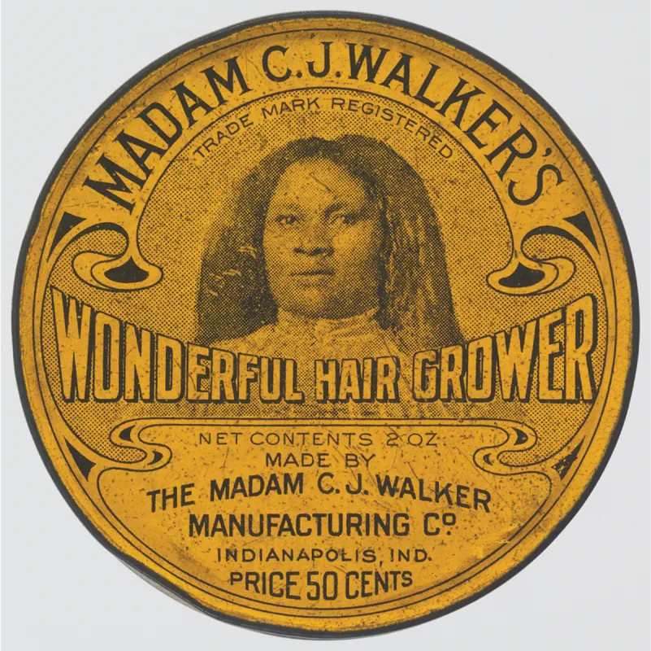
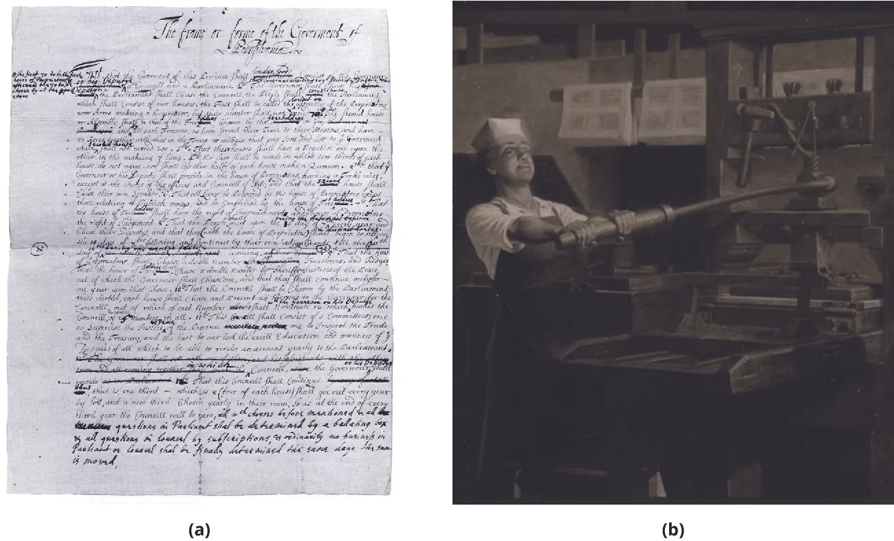
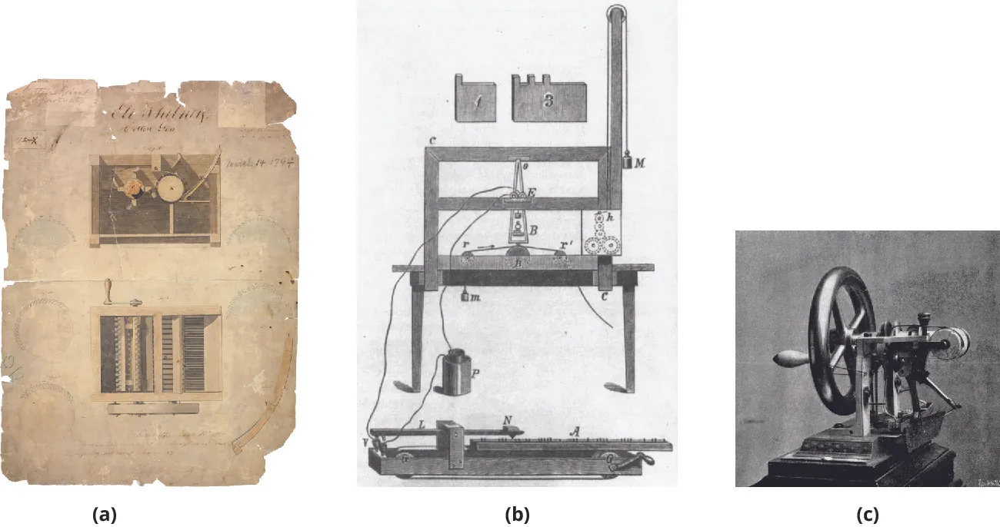
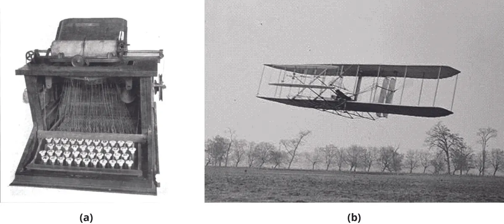
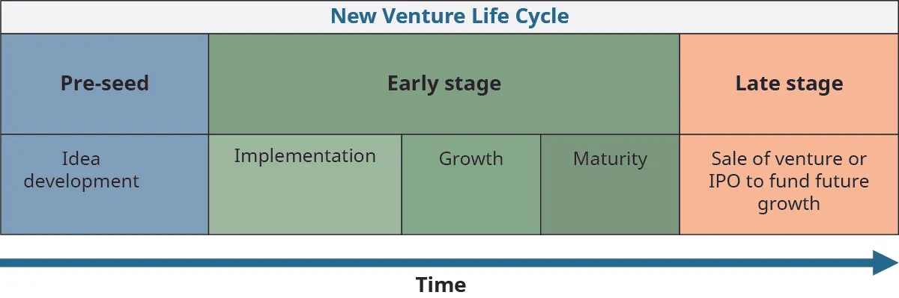
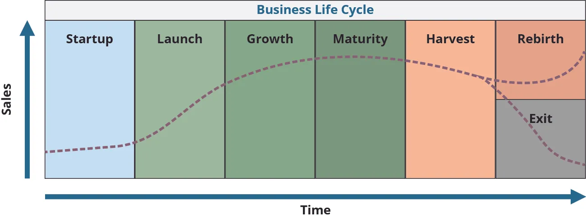

## 2.2   Quá trình trở thành doanh nhân

> **🎯 Mục tiêu học tập**
>
> Đến cuối phần này, bạn sẽ có thể:
>
> - Mô tả sự tiến hóa của khởi nghiệp qua các giai đoạn lịch sử Hoa Kỳ
> - Hiểu chín giai đoạn của vòng đời khởi nghiệp

Các học giả trong lĩnh vực kinh doanh và khởi nghiệp từ lâu đã tranh luận về cách con người trở thành doanh nhân. Doanh nhân là do bẩm sinh hay do rèn luyện mà thành? Nói cách khác, có phải một số người sinh ra đã có sẵn kỹ năng, tài năng và khí chất tự nhiên để theo đuổi con đường khởi nghiệp? Hay bạn có thể phát triển kỹ năng khởi nghiệp thông qua đào tạo, giáo dục và kinh nghiệm? Những câu hỏi này phản ánh các cuộc tranh luận kinh điển được gọi là “bẩm sinh so với nuôi dưỡng” hoặc “sinh ra đã là hay được tạo nên”, nhằm giải thích các yếu tố quyết định tính cách và phẩm chất của một con người.

Cuộc tranh luận này đã tồn tại hàng thế kỷ. Ở Hy Lạp cổ đại, **Plato** ủng hộ lập luận về yếu tố bẩm sinh, trong khi **Aristotle** tin vào quan điểm nuôi dưỡng. Trong thời kỳ Khai sáng thế kỷ mười tám, Immanuel **Kant** (1724–1824; ủng hộ tính tối thượng của lý trí con người) và John **Locke** (1632–1704; phản đối chủ nghĩa độc đoán) đã tranh luận quan điểm của mình. Kant tin chắc rằng sự vâng lời là hành vi được mong đợi và được mong muốn, trong khi Locke tin vào việc cho phép một mức độ tự do và sáng tạo nhất định. Trọng tâm của các khía cạnh trong cuộc tranh luận này thay đổi khi các nhà tâm lý học cuối thế kỷ mười chín tìm cách hiểu cách cá nhân tiếp nhận tri thức, và khi các nhà tâm lý học hiện đại tập trung vào những yếu tố bổ sung như trí thông minh, tính cách và bệnh tâm thần.

Scott **Shane**, giáo sư nghiên cứu khởi nghiệp tại Case Western Reserve University, đã đồng chỉ đạo một nghiên cứu sử dụng các cặp song sinh cùng trứng và khác trứng làm đối tượng nghiên cứu. Shane xác định rằng doanh nhân khoảng 40 phần trăm là do bẩm sinh và 60 phần trăm là do rèn luyện, nghĩa là tự nhiên, tức DNA của một cá nhân, chịu trách nhiệm cho 40 phần trăm hành vi khởi nghiệp, trong khi nuôi dưỡng chịu trách nhiệm cho khoảng 60 phần trăm hành vi khởi nghiệp.[^14] Mặc dù “**bẩm sinh so với nuôi dưỡng**” và “**sinh ra đã là hay được tạo nên**” là những lập luận song song, các nhà nghiên cứu và doanh nhân giàu kinh nghiệm gợi ý một quan điểm kết hợp. Bạn có thể kết hợp tài năng và năng lực tự nhiên của mình với đào tạo và phát triển để đạt được trải nghiệm và kết quả khởi nghiệp toàn diện. Khi bạn xác định rằng khởi nghiệp nằm trong tương lai của mình, hành động tiếp theo là thiết lập một quy trình để làm theo, chẳng hạn như xác định tài liệu đọc hữu ích, tham gia các lớp học hoặc hội thảo, tìm người cố vấn, hoặc học bằng cách thực hành thông qua mô phỏng hoặc trải nghiệm trực tiếp. Trải nghiệm trực tiếp diễn ra xuyên suốt các ngày và cuộc sống của chúng ta khi ta tích lũy kinh nghiệm liên quan và phát triển tư duy tìm kiếm các hành vi nhận diện cơ hội. Hoàn thành các khóa học, chẳng hạn như đọc giáo trình này, và xem lại các nguồn tài liệu được gợi ý trong giáo trình là những hành động có thể hỗ trợ kiến thức và nhận thức của bạn về khởi nghiệp như một lựa chọn hợp lệ cho tương lai.

> **❓ Bạn đã sẵn sàng chưa?: Bài kiểm tra tính cách doanh nhân**
>
> Hãy đọc bài viết của Bill Wagner “What’s Your Entrepreneurial Personality Type?” trên *Entrepreneur* tại liên kết này: [https://www.entrepreneur.com/article/84134](https://www.entrepreneur.com/article/84134). Sau đó, truy cập **The Entrepreneur Next Door** tại [http://www.theentrepreneurnextdoor.com/](http://www.theentrepreneurnextdoor.com/) để làm Bài kiểm tra tính cách doanh nhân và tìm ra kiểu tính cách của bạn.
>
>
> - Hãy suy nghĩ về kết quả của bạn. Bạn là người đa năng hay chuyên sâu?
> - Khi biết thông tin này, bạn còn phù hợp với những kiểu tính cách doanh nhân nào khác?
> - Bạn có thể dùng thông tin này như thế nào trong hành trình trở thành doanh nhân?
> - Thông tin này cho bạn biết điều gì về việc lựa chọn thành viên cho đội ngũ khởi nghiệp của mình?

### Góc nhìn lịch sử

Sự phát triển của tinh thần khởi nghiệp ở Hoa Kỳ đã kéo dài qua nhiều thế kỷ. Các doanh nhân đã phản ứng trước và đổi mới trong các điều kiện chính trị và kinh tế của thời đại mình. Tinh thần kinh tế và công nghiệp của Hoa Kỳ đã truyền cảm hứng cho nhiều thế hệ người Mỹ khởi nghiệp. Hiểu về lịch sử này có thể giúp bạn trân trọng tầm quan trọng của khởi nghiệp khi cân nhắc hành trình khởi nghiệp của chính mình.

Vào cuối những năm 1700, nhóm Pembina của người Chippewa sống dọc theo Red River of the North, con sông chảy qua North Dakota và Minnesota rồi sang Canada. Các nhà thám hiểm châu Âu đã lập các trạm giao dịch trong khu vực này và trao đổi với người Pembina cùng các nhóm khác để lấy pemmican, một loại thịt bò rừng hoặc cá sấy khô do các bộ tộc làm ra để sinh tồn trong những mùa đông khắc nghiệt khi thức ăn khan hiếm. Pemmican của người Pembina được xuất khẩu ra quốc tế thông qua giao thương với các nhà thám hiểm Pháp, Canada, Anh và những nơi khác.[^15] Người Pembina đã giải quyết vấn đề khan hiếm lương thực, rồi tận dụng sản phẩm đó để trao đổi lấy những sản phẩm khác mà họ cần từ các trạm giao dịch.

Vào cuối những năm 1880, Madam C. J. **Walker**, một nữ doanh nhân chăm sóc tóc người Mỹ gốc Phi, đã phát triển và tiếp thị các sản phẩm của bà trên khắp Hoa Kỳ ([Hình 2.12](2-2-the-process-of-becoming-an-entrepreneur#OSX_Eship_02_02_Walker)), thuê các đại lý bán hàng và thành lập **Madam C. J. Walker Hair Culturists Union of America** cùng **National Negro Cosmetics Manufacturers Association** vào năm 1917.[^16] Bà khởi đầu công ty của mình với triết lý “văn hóa chăm sóc tóc”, điều nhanh chóng trở nên phổ biến và cuối cùng tạo ra việc làm ổn định cho phụ nữ Mỹ gốc Phi. Một người Mỹ gốc Phi khác, Charles **Drew**, đã thiết lập ngân hàng máu quốc gia vào cuối những năm 1930, ngay trước khi Thế chiến II làm phát sinh nhu cầu tiếp cận máu nhanh chóng.[^17] Ông nghiên cứu y học truyền máu và nhìn thấy một nhu cầu mà ông muốn đáp ứng. Drew đã áp dụng các ý tưởng từ luận án tiến sĩ của mình để tạo ra ngân hàng máu và tiếp tục đổi mới bằng cách phát triển các trạm hiến máu lưu động.

*Hình 2.12: Madam C. J. Walker đã phát triển dòng sản phẩm chăm sóc tóc của riêng mình, hiện vẫn còn được bán đến ngày nay. (ghi công: Bộ sưu tập của Bảo tàng Lịch sử và Văn hóa Người Mỹ gốc Phi Quốc gia Smithsonian, quà tặng từ Dawn Simon Spears và Alvin Spears, Sr.)*

#### Thời kỳ thuộc địa và nước Mỹ buổi đầu: 1607–1776

Khái niệm sớm nhất về “doanh nhân” có thể được truy nguyên về thời kỳ này, từ tiếng Pháp *entreprendre*, có nghĩa là “làm một việc gì đó” hoặc “đảm nhận”.[^18] Jean-Baptiste **Say** (1767–1832), một triết gia, nhà kinh tế học và doanh nhân người Pháp, ủng hộ việc gỡ bỏ các ràng buộc để khuyến khích tăng trưởng kinh doanh, một quan điểm rất tự do vào cuối những năm 1700. “Doanh nhân chuyển các nguồn lực kinh tế từ khu vực năng suất thấp sang khu vực năng suất và lợi suất cao hơn” là một khái niệm được gán cho Say, cũng như chính từ *entrepreneur*.[^19]

Những người có tư duy doanh nhân bao gồm thương nhân, địa chủ, nhà sản xuất trong các ngành liên quan đến dệt may, thợ đóng tàu, nhà thám hiểm, lái buôn và thương nhân thị trường toàn cầu.[^20] Những người nhập cư đầu tiên đến các thuộc địa của Anh đã tận dụng một số phát minh then chốt được phát triển trước thời kỳ này, chẳng hạn như in ấn, kế toán kép, cùng những cải tiến trong thiết kế tàu và dụng cụ hàng hải. Bằng sáng chế đầu tiên ở Bắc Mỹ được Massachusetts General Court cấp vào năm 1641 cho Samuel **Winslow** cho một quy trình mới làm muối. Tinh thần doanh nhân của những người khai phá thuộc địa thời kỳ đầu đã giúp định hình một bức tranh kinh tế kéo dài qua nhiều thế hệ. Một số nhà phát minh và doanh nhân tiên phong đáng chú ý được trình bày trong [Bảng 2.2](2-2-the-process-of-becoming-an-entrepreneur#fs-idm228074256) và [Hình 2.13](2-2-the-process-of-becoming-an-entrepreneur#OSX_Eship_02_02_PennFrank).

**Bảng 2.2: Những nhà phát minh và doanh nhân tiêu biểu đầu kỳ của Hoa Kỳ**

| Nhà phát minh hoặc doanh nhân | Đóng góp | Ý nghĩa |
| --- | --- | --- |
| Pierre-Esprit **Radisson** (1640–1710), nhà thám hiểm người Pháp | Thành lập công ty thương mại Hudson’s Bay | Thực hiện trao đổi lông thú lấy vải vóc và súng |
| William **Penn** (1644–1718), người khai phá thuộc địa | Thành lập Khối thịnh vượng chung Pennsylvania như nơi trú ẩn cho người Quaker | Doanh nhân xã hội thời kỳ đầu |
| Sybilla **Masters** (1676–1720), nhà phát minh | Phát minh phương pháp làm sạch và tinh chế ngô do những người định cư đầu tiên trồng | Bằng sáng chế cho quy trình làm sạch và xay ngô (1715) |
| Thomas **Hancock** (1703–1764), thương nhân | Thành lập nhà buôn cung cấp nhiều loại hàng hóa | Tìm kiếm các nguồn vốn thay thế để tài trợ cho lợi ích kinh doanh |
| Benjamin **Franklin** (1706–1790), nhà phát minh, nhà xuất bản, chính khách | Thiết lập các cơ sở nhượng quyền in ấn và hạ tầng để học việc của ông khởi nghiệp ở các thuộc địa khác | Hình mẫu tiêu biểu của một nhà phát minh và doanh nhân khởi nghiệp liên tiếp |

*Hình 2.13: (a) William Penn đã thành lập Khối thịnh vượng chung Pennsylvania như một nơi trú ẩn cho những người Quaker bị đàn áp. Thuộc địa này có thể được xem là một hình thức khởi nghiệp xã hội thời kỳ đầu. Hình minh họa cho thấy bản thảo đầu tiên của ông về *The Frame of Government in Pennsylvania*. (b) Là một trong những người lập quốc, Benjamin Franklin đã đóng góp vào Tuyên ngôn Độc lập. Những thành tựu của ông với vai trò thợ in, nhà văn, tổng quản bưu điện, nhà ngoại giao và nhà khoa học (ông góp phần vào sự hiểu biết về điện) là hình mẫu tiêu biểu của doanh nhân khởi nghiệp liên tiếp. Trong bức tranh này của Charles Mills, Ben Franklin thời trẻ được vẽ khi đang vận hành một máy in. (credit (a): modification of “William Penn - The First Draft of the Frame of Government - c1681” by University of Pennsylvania/Wikimedia Commons, Public Domain; credit (b): modification of “Franklin the printer” by Library of Congress/Wikimedia Commons, Public Domain)*

Khi tinh thần khởi nghiệp phát triển mạnh tại các thuộc địa Mỹ, cấu trúc kinh tế cũng bắt đầu hình thành. Quan điểm kinh tế thịnh hành khi đó gắn với việc tích trữ vàng và bạc. Người dân thuộc địa xem nhập khẩu là sự suy giảm của cải kim loại, tức tiền vàng và bạc, và cho rằng xuất khẩu sẽ đưa các kim loại này quay trở lại thuộc địa. Để khái quát tư duy kinh tế của thời đó, nhà triết học và kinh tế học người Scotland Adam **Smith** (1723–1790) đã viết *An Inquiry into the Nature and Causes of the Wealth of Nations* (1776). Chuyên luận có ảnh hưởng này trình bày các khái niệm về thương mại tự do và mở rộng kinh tế thông qua **chủ nghĩa tư bản**, một hệ thống trong đó cá nhân, con người và doanh nghiệp có quyền tự do ra quyết định, sở hữu tài sản và hưởng lợi từ nỗ lực của chính mình, còn chính phủ đóng vai trò thứ yếu trong giám sát. Cuốn sách này xác lập Smith là “cha đẻ của kinh tế học” và thương mại tự do hiện đại. Trong số những khái niệm quan trọng nhất mà Smith đề xuất có lý thuyết “**bàn tay vô hình**” về cung và cầu trên thị trường; việc dùng GDP để đo mức sản xuất và thương mại của một quốc gia; và khái niệm lợi ích cá nhân, theo đó các cá nhân vô tình giúp đỡ người khác khi theo đuổi mục tiêu của chính mình.[^21] Khả năng thu được lợi ích cá nhân từ các hoạt động khởi nghiệp là một yếu tố then chốt hỗ trợ hành vi doanh nhân. Các khái niệm của Smith tiếp tục ảnh hưởng đến kinh tế học hiện đại và hoạt động khởi nghiệp.

#### Cuộc Cách mạng Công nghiệp lần thứ nhất: 1776–1865

Khi các thuộc địa mở rộng, các cơ hội và mối quan tâm đến quyền sở hữu tài sản, sản xuất, phát minh và đổi mới cũng tăng theo. **Đổi mới** là bất kỳ ý tưởng, quy trình hoặc sản phẩm mới nào, hoặc một sự thay đổi đối với sản phẩm hay quy trình hiện có. Sự hiểu biết và chấp nhận đổi mới phát triển vào khoảng năm 1730, khi nhà kinh tế học Richard **Cantillon** xác định ý nghĩa học thuật đầu tiên và các đặc điểm của “**khởi nghiệp**” là “sự sẵn lòng gánh chịu rủi ro tài chính cá nhân của một dự án kinh doanh.”[^22] **Cuộc Cách mạng Công nghiệp lần thứ nhất** nổi bật bởi sự bùng nổ của các hoạt động sáng chế do những “nhà phát minh vĩ đại” thực hiện, những người theo đuổi cơ hội khởi nghiệp để đáp ứng nhu cầu thị trường, yêu cầu và động lực kinh tế.[^23]

Một điều quan trọng cần ghi nhớ là niên đại của các phát minh không nhất thiết phản ánh ngày ra mắt cụ thể. Việc phát triển những phát minh này có thể đã diễn ra trong nhiều năm hoặc nhiều thập kỷ trước khi chúng được xem là sản phẩm khả thi trên thị trường.

Vô số nhà phát minh và các phát minh của họ đã biến đổi nhiều ngành công nghiệp và tầng lớp kinh tế trên khắp quốc gia đang phát triển. Trong thời kỳ này, đất nước được hưởng lợi từ những phát minh tạo ra, mở rộng hoặc cách mạng hóa ngành công nghiệp, đồng thời gia tăng của cải và sự mở rộng. Những nhà phát minh mang tính cách mạng này bao gồm Eli Whitney (máy tách hạt bông, 1794), Elias **Howe** (máy may, 1845), và Samuel **Morse** (điện báo, thập niên 1830–1840) ([Hình 2.14](2-2-the-process-of-becoming-an-entrepreneur#OSX_Eship_02_02_Invent01)). Nhiều người khác cũng đã đóng góp cho các phát minh này và những phát minh khác.

*Hình 2.14: Các phát minh xuất hiện dày đặc trong Cuộc Cách mạng Công nghiệp lần thứ nhất. (a) Năm 1794, Eli Whitney được cấp bằng sáng chế tại Hoa Kỳ cho máy tách hạt bông. (b) Bản phác thảo này cho thấy máy điện báo của Samuel Morse. (c) Elias Howe đã phát minh ra máy may. (credit (a): modification of “Patent for Cotton Gin (1794)” by “Gamaliel”/Wikimedia Commons, Public Domain; credit (b): modification of “Morse telegraph” by Unknown/Wikimedia Commons, Public Domain; credit (c): modification of “Elias Howe Sewing Machine 1846” by Unknown/Wikimedia Commons, Public Domain)*

Mặc dù ông không phải là nhà phát minh mà là một nhà công nghiệp, Andrew **Carnegie** vẫn là một ví dụ thú vị. Là một nhà sản xuất tập trung vào giá trị của đổi mới và cách triển khai chúng, Carnegie đã áp dụng các kỹ thuật mới được phát triển để cải thiện sản xuất thép. Ông cũng là một trong những người đầu tiên triển khai **tích hợp dọc**, chiến lược giành quyền kiểm soát các nhà cung cấp nguyên liệu thô và nhà phân phối thành phẩm nhằm mở rộng hoặc kiểm soát chuỗi cung ứng liên quan. Ông phát triển một mạng lưới nhà cung cấp và nhà phân phối đáng tin cậy để hỗ trợ các nhà máy thép của mình. Carnegie cũng là một trong những nhà tài phiệt đầu tiên thực hành hoạt động từ thiện. Ông đã cho đi phần lớn khối tài sản khổng lồ của mình để hỗ trợ cộng đồng, hệ thống thư viện công cộng, phòng hòa nhạc, bảo tàng và nghiên cứu khoa học.[^24]

Những người tiên phong khởi nghiệp này, cùng nhiều người khác giống họ, đã tìm cách thu lợi nhuận từ khoản đầu tư vào một phát minh và tự bảo vệ mình về mặt pháp lý thông qua quy trình bằng sáng chế. **Bằng sáng chế** là sự bảo hộ pháp lý dành cho nhà phát minh đối với quyền sở hữu, sử dụng và thương mại hóa một phát minh trong một khoảng thời gian nhất định.[^25] Một bằng sáng chế sớm của Hoa Kỳ được cấp năm 1790 cho Samuel **Hopkins** cho quy trình sản xuất potash dùng làm thành phần phân bón.[^26]

Những đổi mới của phụ nữ, người Mỹ gốc Phi (dù bị nô lệ hay là người tự do), và các nhóm bị gạt ra bên lề khác có vai trò thiết yếu trong thời kỳ này. Như chúng ta đã thấy trước đó, Sybilla **Masters** đã phát minh ra một phương pháp nghiền ngô. Bà nhận được bằng sáng chế từ vua Anh vào năm 1715. Nhưng vì phụ nữ thời đó không được phép nộp đơn xin bằng sáng chế hoặc thậm chí sở hữu tài sản, nên bằng sáng chế được nộp dưới tên chồng bà.[^27] Mặc dù phát minh máy tách hạt bông thường được gán cho Eli **Whitney**, như chúng ta đã thấy, nó có thể dựa trên một thiết kế của những người Mỹ gốc Phi bị nô lệ. Sự phân biệt đối xử về xã hội và pháp lý có thể hạn chế hoặc che giấu danh tính của những nhà phát minh thực sự, đặc biệt nếu họ là phụ nữ hoặc nô lệ.[^28] Phần lớn người nộp đơn và người được cấp bằng sáng chế là đàn ông da trắng. Một ngoại lệ là Mary Dixon **Kies**, người vào năm 1809 trở thành phụ nữ đầu tiên được cấp bằng sáng chế cho quy trình dệt rơm với lụa hoặc chỉ của bà. Đây là một đổi mới quan trọng cho ngành mũ, do lệnh cấm vận hàng hóa châu Âu.[^29] Tương tự, nhiều người bị nô lệ cực kỳ sáng tạo, nhưng luật pháp và định kiến đã ngăn họ được công nhận hoặc hưởng lợi từ các phát minh của mình.

#### Cuộc Cách mạng Công nghiệp lần thứ hai: 1865–1920

Mặc dù Cuộc Cách mạng Công nghiệp lần thứ nhất có phạm vi rộng và tác động biến đổi sâu sắc, **Cuộc Cách mạng Công nghiệp lần thứ hai** đã góp phần định hình nhu cầu của người tiêu dùng đối với các phát minh và đổi mới mới nhất do các doanh nghiệp nhỏ và lớn phát triển. Những đột phá của thời kỳ này mang lại các đổi mới có thể ứng dụng trong nhiều lĩnh vực, từ hóa học đến kỹ thuật rồi đến y học.[^32]

Các nhà kinh tế học thế kỷ mười chín Jean-Baptiste Say và John Stuart Mill (1806–1873) đã tinh chỉnh và phổ biến định nghĩa của Cantillion về doanh nhân để nắm bắt tinh thần thời đại của họ. Định nghĩa “**doanh nhân**” của họ mô tả một người tạo ra giá trị bằng cách quản lý hiệu quả các nguồn lực để đạt năng suất tốt hơn, đồng thời là người dám chấp nhận rủi ro tài chính.[^33]

Sau Nội chiến Hoa Kỳ và bước sang thập niên 1870, nhiều ngành công nghiệp phát triển mạnh nhờ những cải tiến trong tổ chức sản xuất (lưu trữ tại nhà máy lọc dầu, sản xuất hàng loạt) và các hệ thống công nghệ (điện và điện thoại). Các phát minh bổ sung bao gồm cải tiến trong sản xuất thép, thuốc nhuộm hóa học, giao thông vận tải (động cơ diesel và xăng, máy bay), sản xuất theo dây chuyền lắp ráp, cải tiến nông nghiệp và chế biến thực phẩm (làm lạnh), dệt may và máy đánh chữ ([Hình 2.15](2-2-the-process-of-becoming-an-entrepreneur#OSX_Eship_02_02_Invent02)).[^34] Khi hoạt động khởi nghiệp, sự thịnh vượng kinh tế và nhu cầu năng suất gia tăng, các doanh nhân cùng các phát minh của họ được đánh giá cao và săn đón, góp phần củng cố niềm tin rằng Hoa Kỳ là miền đất của cơ hội.

*Hình 2.15: (a) Chiếc máy đánh chữ thành công đầu tiên về mặt thương mại được Christopher Latham Sholes và Carlos S. Glidden chế tạo; đây là mẫu nguyên mẫu năm 1873 của họ. (b) Anh em nhà Wright nằm trong số những người tiên phong nổi tiếng nhất của ngành hàng không thời kỳ đầu. Trong bức ảnh này, Orville đang bay qua bãi thử của họ vào năm 1904. (credit (a): modification of “Sholes typewriter” by George Iles/Wikimedia Commons, Public Domain; credit (b): modification of “1904WrightFlyer” by “DonFB”/Wikimedia Commons, Public Domain)*

#### Nước Mỹ giữa hai cuộc chiến và thời hậu chiến: 1920–1975

Khi Chiến tranh thế giới thứ nhất bắt đầu, nền kinh tế Hoa Kỳ đang suy thoái, trong khi người châu Âu mua nguyên vật liệu của Hoa Kỳ cho chiến tranh. Khi Hoa Kỳ tham gia **Chiến tranh thế giới thứ nhất** vào năm 1917, một đợt bùng nổ kinh tế đã diễn ra. Tỷ lệ thất nghiệp giảm từ 7,9 phần trăm năm 1914 xuống 1,4 phần trăm năm 1918 khi Hoa Kỳ sản xuất hàng hóa và thiết bị cần thiết để hỗ trợ nỗ lực chiến tranh của quốc gia và các đồng minh.[^35] Từ góc độ khởi nghiệp, Chiến tranh thế giới thứ nhất đã đóng góp vào các tiến bộ liên quan đến quân sự, thiết bị liên lạc và cải tiến trong quy trình sản xuất. Bối cảnh kinh tế Mỹ bắt đầu chuyển dịch trong thời kỳ này từ các công ty nhỏ độc lập sang các tập đoàn lớn. Các doanh nghiệp nhỏ ở thời kỳ trước hoặc tan rã hoặc bị các tập đoàn lớn hấp thụ. Khi cú sụp đổ thị trường chứng khoán tháng 10 năm 1929 và **Đại Suy thoái** của thập niên 1930 lan rộng khắp thế giới, đổi mới chậm lại. Niềm tin của người tiêu dùng suy yếu khi niềm tin kinh tế và sản xuất suy giảm, còn thất nghiệp gia tăng.

> **🔗 Liên kết học tập**
>
> Hãy truy cập [trang History về Đại Suy thoái](https://openstax.org/l/52HistGrtDepres) hoặc [bài viết của PBS’s American Experience về Đại Suy thoái](https://openstax.org/l/52PBSGrtDepres) để hiểu bối cảnh và các hoàn cảnh dẫn đến cú sụp đổ thị trường chứng khoán năm 1929, Đại Suy thoái và cách Hoa Kỳ phục hồi trong giai đoạn này.

Sau khi **Chiến tranh thế giới thứ hai** kết thúc vào năm 1945, xã hội Mỹ chuyển từ việc dựa vào doanh nhân truyền thống như một nguồn lực sang dựa vào các tổ chức lớn cung cấp sự ổn định và an toàn việc làm. Các tập đoàn tiếp tục mua lại các công ty nhỏ để chuẩn hóa việc sản xuất hàng loạt quy mô lớn các hàng hóa, dịch vụ và việc làm mang tính đổi mới. Ý tưởng trở thành doanh nhân dần nhường chỗ cho hình ảnh “con người công ty” với sự ổn định việc làm và phúc lợi y tế do các nhà tuyển dụng lớn cung cấp. Mặc dù khởi nghiệp không hoàn toàn biến mất, tốc độ tăng trưởng của nó chậm lại đáng kể so với những năm trước và chuyển sang **khởi nghiệp trong doanh nghiệp**, theo đó các tập đoàn lớn tài trợ cho việc phát triển các ý tưởng, cơ hội hoặc dự án mới thông qua các quy trình nghiên cứu và phát triển chính thức tập trung vào chiến lược và mục tiêu riêng của tập đoàn. [Hình 2.16](2-2-the-process-of-becoming-an-entrepreneur#OSX_Eship_02_02_Timeline) liệt kê một số tập đoàn xuất hiện trong giai đoạn này.

*Hình 2.16: Nhiều tập đoàn quan trọng đã phát triển trong những thập kỷ sau Chiến tranh thế giới thứ nhất. (ghi nguồn: Bản quyền thuộc Rice University, OpenStax, theo giấy phép CC BY NC-SA 4.0)*

Khi quan điểm kinh tế và niềm tin vào cách Hoa Kỳ có thể lấy lại thịnh vượng kinh tế thay đổi, ý nghĩa học thuật của khởi nghiệp cũng thay đổi theo. Một học giả và nhà kinh tế học, Joseph **Schumpeter** (1883–1950), đã đưa ra các lý thuyết và thuật ngữ tiếp tục ảnh hưởng đến các khái niệm và thực hành khởi nghiệp hiện đại. Ông tạo ra hai cụm từ quan trọng: **tinh thần khởi nghiệp**, gắn với những cá nhân chủ động, năng suất và biến mọi việc thành hiện thực, và **sự hủy diệt sáng tạo**, được ông định nghĩa là “quá trình biến đổi công nghiệp liên tục cách mạng hóa cấu trúc kinh tế từ bên trong, không ngừng phá hủy cái cũ và không ngừng tạo ra cái mới.”[^36] Lý thuyết của Schumpeter cho rằng đổi mới sẽ phá hủy các tập đoàn đã thành danh để tạo ra những tập đoàn mới, nhưng đó không phải là quan điểm phổ biến vào thời điểm ấy. Các nhà tư tưởng dẫn dắt thời kỳ này có những cách tiếp cận khác nhau để lý giải sự trỗi dậy của các tập đoàn như một phần trong cấu trúc khởi nghiệp của Hoa Kỳ. Schumpeter cho rằng các tập đoàn có vị thế tốt hơn cá nhân trong việc hỗ trợ các loại hình nghiên cứu và phát triển có thể tạo ra đổi mới và tác động kinh tế.[^37] Để bổ sung cho quan điểm này, ông cũng đề xuất rằng việc các tập đoàn hỗ trợ tầm nhìn của doanh nhân sẽ tạo ra các đổi mới lớn hơn.

Cuối cùng, điều quan trọng cần lưu ý là sự tăng trưởng của các tập đoàn và cơ hội đã mở rộng ra ngoài biên giới Hoa Kỳ. Các tập đoàn đối mặt với những trải nghiệm toàn cầu mới mẻ, qua đó củng cố lý thuyết hủy diệt sáng tạo của Schumpeter khi các quốc gia khác đặt ra những động lực mới cần xử lý. Báo cáo **Global Entrepreneurship Monitor (GEM)** được xây dựng hằng năm là một khảo cứu học thuật xem xét cách một nhóm mười chín quốc gia hưởng lợi từ đầu tư vốn mạo hiểm và các yếu tố ảnh hưởng đến những khoản đầu tư đó đối với hoạt động khởi nghiệp. Nghiên cứu này giải quyết câu hỏi về cơ hội khởi nghiệp, năng lực khởi nghiệp và động lực khởi nghiệp như những phần của sự tham gia trong mọi ngành, cũng như mối tương quan trực tiếp giữa đầu tư vốn mạo hiểm và các công ty khởi nghiệp tăng trưởng cao.[^40] Báo cáo GEM được tạo ra hằng năm với thông tin kịp thời và phù hợp liên quan đến khởi nghiệp và có tại trang web này: [https://www.gemconsortium.org/](https://www.gemconsortium.org/). Sự chuyển dịch văn hóa này trong tinh thần doanh nhân của người Mỹ đã tạo ra mối quan tâm mới đối với đào tạo và giáo dục người lao động, mở đường cho nền kinh tế tri thức.

#### Nền kinh tế tri thức: 1975 đến nay

Vào giữa thập niên 1970, những hứa hẹn của đời sống tập đoàn bắt đầu mất dần sức hấp dẫn đối với những người có tư duy doanh nhân. Một thay đổi là các tập đoàn lâu đời chuyển trọng tâm đổi mới từ bộ phận nghiên cứu và phát triển sang các hoạt động khởi nghiệp nội bộ do **nhà khởi nghiệp nội bộ** thực hiện. Nhà khởi nghiệp nội bộ là nhân viên hành động như một doanh nhân trong một tổ chức, thay vì tự hoạt động độc lập. Họ đóng góp ý tưởng, sản phẩm và dịch vụ mang tính doanh nhân bằng cách sử dụng thời gian làm việc và nguồn lực của doanh nghiệp, nhưng trên cơ sở ít chính thức hơn nhiều so với những đóng góp đổi mới của doanh nghiệp trong quá khứ. Những tiến bộ công nghệ phát triển nhanh chóng đã tác động đến mọi ngành, và những người có hiểu biết công nghệ trở thành những người dẫn đầu. Các công ty thống trị bối cảnh công nghệ gồm **Apple**, **Microsoft**, **3M**, **Alphabet** (công ty mẹ của **Google**), **IBM** và **Oracle**. Trong văn hóa David đối đầu Goliath ngày nay, những công ty này từng là các công ty khởi nghiệp nhỏ nhưng nay sở hữu nguồn lực dường như vô tận. Những cơ hội mới đã xuất hiện trong thế giới công nghệ cho những ai sẵn sàng và có khả năng cạnh tranh với các gã khổng lồ này. Mọi công ty, dù lớn hay nhỏ, đều quan tâm đến một lực lượng lao động hiểu biết và được đào tạo tốt hơn, có bằng cấp chuyên môn hoặc nâng cao về khởi nghiệp và quản trị kinh doanh. Những doanh nhân mới được chuẩn bị để phát triển và lãnh đạo các công ty có thể trở thành những câu chuyện thành công lớn tiếp theo.

### Quy trình khởi nghiệp

Cách tiếp cận của bạn đối với **quy trình khởi nghiệp**, hay tập hợp các quyết định và hành động mà bạn có thể làm theo (như trong [Hình 2.17](2-2-the-process-of-becoming-an-entrepreneur#OSX_Eship_02_02_Fork)) như một hướng dẫn để phát triển hoặc điều chỉnh **doanh nghiệp** của mình, là linh hoạt chứ không tĩnh. Điều này là do sở thích cá nhân, nền tảng, kinh nghiệm, nguồn lực và các mối quan hệ của bạn là duy nhất đối với bạn, nhưng những yếu tố đó có thể thay đổi theo thời gian. Chẳng hạn, bạn và một người bạn có thể cùng tham gia một lớp mỹ thuật cho vui và cả hai cùng khám phá ra tài năng tiềm ẩn cũng như con mắt thẩm mỹ để tạo ra đồ trang sức thủ công được mọi người yêu thích. Một ngày nọ trong bữa trưa, bạn chia sẻ với người bạn của mình một số băn khoăn về việc có hứng thú bán những sáng tạo độc đáo của mình cho một phòng tranh địa phương. Dù đã nghiên cứu, bạn vẫn gần như không biết nên bắt đầu từ đâu hay làm thế nào để tác phẩm được trưng bày trong phòng tranh. Trong cuộc trò chuyện, bạn ngạc nhiên khi biết rằng bạn của bạn đã bán được vài món đồ nhờ làm theo lời khuyên của một người cố vấn. Qua một số lời giới thiệu, cô ấy nhận ra lựa chọn tốt nhất là tạo hiện diện trên **Etsy**, một trang web tập trung vào nghệ nhân dành cho **thương mại điện tử**, tức các giao dịch điện tử, đặc biệt là qua Internet, để trao đổi hàng hóa và dịch vụ. Dù cả hai cùng bắt đầu từ một điểm với những mục tiêu tương tự, kết quả của hai bạn lại khác nhau vì đã đi theo những con đường khởi nghiệp khác nhau. Trong trường hợp này, người bạn của bạn quyết định tham gia vào quy trình khởi nghiệp ở một giai đoạn khác với bạn. Kiểu tình huống này xảy ra mỗi ngày và làm rõ vì sao các doanh nghiệp khác nhau: các quyết định của doanh nhân hoặc đội ngũ khởi nghiệp sẽ định hình kết quả.

*Hình 2.17: Quy trình khởi nghiệp của bạn có thể đòi hỏi phải đổi hướng nhiều lần. (ghi công: chỉnh sửa từ “this way or that” của Robert Couse-Baker/Flickr, CC BY 2.0)*

Nếu bạn quyết định dấn thân vào khởi nghiệp, bạn nên theo một quy trình nhất định trước khi ra mắt doanh nghiệp của mình. Quy trình đó là gì? Như chúng ta đã thảo luận trước đó về các bước của hành trình khởi nghiệp, bạn cần suy nghĩ kỹ về mục tiêu của mình, chuẩn bị và thực hiện một kế hoạch hành động, đưa ra các quyết định và điều chỉnh hợp lý trên đường đi, đồng thời kiên trì vượt qua thách thức và khủng hoảng để bảo đảm một hành trình thành công. Nếu điều đó nghe có vẻ như bạn còn nhiều việc phải làm, thì đúng là như vậy. Tuy nhiên, nếu bạn theo dõi hoặc nhận ra các giai đoạn trong hành trình và để ý những yếu tố liên quan, đó có thể là công việc thỏa mãn nhất trong sự nghiệp của bạn. Nhiều người thấy hành trình khởi nghiệp mang lại cảm giác trọn vẹn, một phần vì họ được tự định hình con đường của mình. Kế hoạch tốt nghiệp rồi tìm một nghề nghiệp, làm việc chăm chỉ để giúp một công ty hay tổ chức đạt mục tiêu, sẽ còn thỏa mãn hơn khi bạn có thể làm việc cho chính mình để tạo ra con đường và mục đích riêng trong thế giới.

Trước khi bạn tạo ra con đường của mình, một hành động then chốt trong quy trình khởi nghiệp là phát triển tư duy doanh nhân của bạn. Hãy nhớ rằng **tư duy doanh nhân** là việc cởi mở, tự phản tỉnh và trung thực về những gì bạn sẵn sàng làm và có khả năng làm để đạt được thành công. Chẳng hạn, bạn có thoải mái với những hy sinh như dành một buổi tối để nghiên cứu thay vì đi chơi với bạn bè hoặc gia đình không?

### Quy trình khởi nghiệp: **Vòng đời doanh nghiệp** và **vòng đời sản phẩm**

Nói chung, quy trình khởi nghiệp bao gồm một số giai đoạn then chốt hoặc một vài biến thể của các giai đoạn đó. Hãy nhớ rằng các giai đoạn này không phải lúc nào cũng diễn ra theo trình tự, vì hoàn cảnh và cơ hội luôn thay đổi. Một phương pháp phổ biến để hiểu và kết nối với quy trình khởi nghiệp này là hình dung doanh nghiệp mới của bạn tương tự như vòng đời con người, tức những giai đoạn lớn mà con người trải qua trong quá trình phát triển cuộc đời, cùng những quá trình tăng trưởng khác nhau ở giữa.

Như chúng ta có thể thấy trong [Hình 2.18](2-2-the-process-of-becoming-an-entrepreneur#OSX_Eship_02_02_NVLifeCycle) và [Hình 2.19](2-2-the-process-of-becoming-an-entrepreneur#OSX_Eship_02_02_BLifeCycle), giai đoạn khởi sự tương tự như sự ra đời của một em bé. Trong giai đoạn khởi sự, hay giai đoạn khai sinh ý tưởng, doanh nghiệp cần nguồn lực để hỗ trợ quá trình khởi sự khi doanh nhân phát triển ý tưởng, tạo nguyên mẫu và xây dựng hạ tầng hỗ trợ sản xuất. Trong giai đoạn khởi sự, tiền mặt phục vụ cho việc xây dựng doanh nghiệp. Trong khi đó, doanh nghiệp khởi sự hiếm khi sẵn sàng tạo ra doanh số. Lập kế hoạch cho tình huống này, biết rằng cần tiền mặt nhưng chưa được bù đắp bằng doanh số, là một cân nhắc quan trọng.

*Hình 2.18: Hình ảnh này hiển thị các giai đoạn mà một doanh nghiệp mới trải qua khi ý tưởng được phát triển rồi tạo thành nguyên mẫu. Sau đó, nguyên mẫu được hoàn thiện để chuẩn bị cho giai đoạn 4, khi doanh số được tạo ra. Giai đoạn 4 dẫn đến sự khởi đầu của giai đoạn tăng trưởng, được thể hiện trong [Hình 2.19](2-2-the-process-of-becoming-an-entrepreneur#OSX_Eship_02_02_BLifeCycle). Tăng trưởng diễn ra thông qua việc doanh số sản phẩm tăng lên. Ở thời điểm này trong vòng đời sản phẩm, việc bổ sung tính năng hoặc cải tiến cho sản phẩm sẽ thúc đẩy doanh số tăng. (ghi nguồn: Bản quyền thuộc Rice University, OpenStax, theo giấy phép CC BY NC-SA 4.0)*

*Hình 2.19: Hình ảnh này minh họa các giai đoạn mà một doanh nghiệp trải qua từ lúc hình thành cho đến khi kết thúc. Đường nét đứt màu tím biểu thị doanh số, hay mức độ thành công của các sản phẩm của doanh nghiệp. Chúng ta thấy doanh số cao nhất ở các giai đoạn tăng trưởng và trưởng thành. Tại thời điểm này, chủ doanh nghiệp hoặc nhóm khởi nghiệp phải đưa ra các quyết định cho sự tái sinh của doanh nghiệp, khi đó doanh nghiệp quay trở lại giai đoạn tăng trưởng. (ghi nguồn: Bản quyền thuộc Rice University, OpenStax, theo giấy phép CC BY NC-SA 4.0)*

Cũng như một đứa trẻ phát triển nhanh trong những năm đầu đời, một doanh nghiệp thường trải qua tăng trưởng nhanh khi sản phẩm hoặc dịch vụ được thương mại hóa và gặp nhu cầu mạnh, thể hiện qua doanh số tăng lên cùng sự hiểu biết và khả năng tiếp cận thị trường mục tiêu tốt hơn. Một lần nữa, giai đoạn này đòi hỏi nguồn lực để hỗ trợ tăng trưởng. Điểm khác biệt giữa giai đoạn này và giai đoạn khởi sự là tiền mặt được tạo ra thông qua hoạt động bán hàng. Tuy nhiên, trong một số dự án khởi nghiệp, giai đoạn tăng trưởng là xây dựng doanh nghiệp hơn là tạo ra doanh số. Với những doanh nghiệp như **YouTube**, giai đoạn tăng trưởng bao gồm việc tăng số lượng video cũng như gia tăng số người truy cập xem video.

Cũng như con người đạt đến độ trưởng thành trong vòng đời của mình, doanh nghiệp có thể đạt tới điểm mà tăng trưởng chậm lại và có thể chuyển sang giai đoạn suy giảm. Trong trải nghiệm của con người, chúng ta có thể hành động để cải thiện hoặc kéo dài giai đoạn trưởng thành của cuộc đời bằng những lựa chọn sống tốt hơn, như thói quen ăn uống lành mạnh và tập thể dục, nhằm tăng tuổi thọ và trì hoãn suy giảm. Chúng ta cũng có thể kéo dài sự trưởng thành của doanh nghiệp, thậm chí chuyển sang tái sinh và một giai đoạn tăng trưởng mới thông qua những quyết định sáng suốt, như thêm tính năng mới cho sản phẩm hoặc dịch vụ, hoặc cung cấp sản phẩm hay dịch vụ đó cho một thị trường mục tiêu mới. Mục tiêu trong cuộc sống, và trong phép so sánh này, là tăng trưởng và thành công liên tục. Sản phẩm có thể được thay đổi hoặc cải tiến để kéo dài vòng đời sản phẩm, từ đó cũng kéo dài vòng đời của doanh nghiệp.

Các ví dụ về việc tránh sự suy giảm và cái chết của một doanh nghiệp rất phù hợp với khái niệm vòng đời sản phẩm và phổ biến trong các sản phẩm liên quan đến công nghệ như tivi, máy tính cá nhân và điện thoại di động. Chẳng hạn, tivi đen trắng đã trải qua giai đoạn tăng trưởng sau Thế chiến II. Tivi màu được giới thiệu vào thập niên 1950. Khi công nghệ được cải thiện, các nhà sản xuất tivi đã nhiều lần đi qua vòng đời sản phẩm và tránh sự sụt giảm doanh số bằng các tính năng và điều chỉnh mới như plasma, LED và công nghệ thông minh. Một ví dụ về sản phẩm bắt đầu rồi nhanh chóng suy giảm vào giai đoạn chết của doanh nghiệp là máy phát băng tám rãnh, một thiết bị nghe nhạc xuất hiện từ giữa thập niên 1960 đến đầu thập niên 1980. Máy phát băng tám rãnh thay thế máy ghi băng cuộn như một sản phẩm dễ tiếp cận hơn để lắp trong các phương tiện di chuyển, từ ô tô đến Lear jet, nhằm phát nhạc do chủ phương tiện mua để nghe khi di chuyển. Ngay cả khi máy phát băng tám rãnh đang trở nên phổ biến, chuyển từ giai đoạn giới thiệu sang giai đoạn tăng trưởng của vòng đời sản phẩm, băng cassette nhỏ gọn đã được phát triển. Đầu thập niên 1980, định dạng cassette nhỏ gọn thay thế máy phát băng tám rãnh, đột ngột chấm dứt vòng đời sản phẩm của máy phát băng tám rãnh.

Một số sản phẩm dễ quản lý vòng đời hơn những sản phẩm khác. Mục tiêu là quản lý sản phẩm để tăng trưởng liên tục, trong khi những sản phẩm khác, như máy phát băng tám rãnh, dựa trên công nghệ nhanh chóng lỗi thời khi có lựa chọn tốt hơn xuất hiện. Những ví dụ khác về sản phẩm có vòng đời ngắn được xếp vào loại mốt nhất thời, như vòng lắc hula hoop và đá thú cưng, những trào lưu trong quá khứ được giới thiệu lại cho thế hệ người tiêu dùng mới và nhanh chóng đi qua vòng đời sản phẩm vào giai đoạn cuối cùng, tức cái chết của sản phẩm, khi doanh số hoặc không còn hoặc quá ít khiến sản phẩm trở thành một món đồ lạ mắt.

Vòng đời của doanh nghiệp và vòng đời của sản phẩm là hai khái niệm khác nhau nhưng có liên hệ chặt chẽ. Doanh nghiệp sẽ cần những nguồn lực khác nhau ở mỗi giai đoạn của vòng đời để hỗ trợ tăng trưởng và thành công. Biết sản phẩm đang ở giai đoạn nào của vòng đời giúp ích cho việc ra quyết định. Ví dụ, doanh số giảm sẽ kích hoạt nhu cầu nâng cao giá trị của sản phẩm để kéo dài và duy trì mức tăng trưởng mạnh. Từ góc nhìn của doanh nghiệp, quản lý vòng đời sản phẩm cũng hỗ trợ sự thành công bền vững của doanh nghiệp.

Một doanh nghiệp thành công sẽ tránh suy giảm hoặc chấm dứt và có thể chuẩn bị cho việc bán doanh nghiệp hoặc chào bán cổ phiếu ra công chúng, được gọi là **phát hành cổ phiếu lần đầu ra công chúng (IPO)**, giúp công ty tiếp cận nguồn vốn đáng kể cho tăng trưởng trong tương lai. Hai đợt IPO của các doanh nghiệp khởi nghiệp vào tháng 5 năm 2019 là Zoom và Uber. **Zoom** là công ty cung cấp hội nghị truyền hình, hội nghị trực tuyến, hội thảo trực tuyến và truy cập đa nền tảng. **Uber** là công ty chia sẻ chuyến đi. Cả hai doanh nghiệp khởi nghiệp này đều sử dụng IPO để hỗ trợ các kế hoạch tăng trưởng trong tương lai.

Hãy nghĩ về một số người bạn mà bạn quen từ thời thơ ấu so với những người bạn mới gặp trong vài năm gần đây. Giả sử bạn định cùng họ thực hiện một dự án và muốn tìm ra ai nên đảm nhiệm phần việc nào. Bạn có thể tìm hiểu một số thông tin về trải nghiệm trước đây của một người bạn mới hơn thông qua trò chuyện, quan sát hoặc những lần hợp tác khác. Dù vậy, sẽ không thể, và cũng không cần thiết, biết mọi thứ về tuổi thơ của họ và cách họ học được một bộ kỹ năng cụ thể hay xây dựng được một số mối quan hệ nhất định. Bạn chỉ cần bắt đầu tương tác và làm việc với người bạn đó từ thời điểm hiện tại. Doanh nghiệp cũng vậy. Bạn có thể bắt đầu một doanh nghiệp từ giai đoạn tạo ý tưởng hoặc từ thời kỳ sơ sinh như một phần của giai đoạn tiền ra mắt. Hoặc bạn có thể tham gia quy trình sau khi người khác đã hoàn thành các giai đoạn đầu của doanh nghiệp, ví dụ bằng cách mua lại một doanh nghiệp hiện có hoặc tham gia quan hệ đối tác. Có thể bạn không có mặt khi doanh nghiệp được khởi động, nhưng bạn vẫn có thể tiếp tục phát triển doanh nghiệp từ hiện tại. Cũng như mỗi giai đoạn của trải nghiệm con người đi kèm những mối quan tâm và cột mốc khác nhau, điều tương tự cũng đúng với doanh nghiệp của bạn. Doanh nghiệp là trách nhiệm của bạn trong việc quản lý qua từng giai đoạn của quá trình phát triển.

[Hình 2.20](2-2-the-process-of-becoming-an-entrepreneur#OSX_Eship_02_02_Lifecycle) cung cấp cái nhìn tổng quan về từng giai đoạn và các quyết định liên quan mà bạn có thể cân nhắc hoặc gặp phải trong quy trình khởi nghiệp.

![The Business Life Cycle moves from startup (pre-launch: discovery, research, and define opportunity; conception: solidify idea and opportunity, and build and test business model; and resourcing: build support system, team, and plan, and gather resources) to launch (small market entry and manage, test, and monitor progress) to growth (build market and scale to fit, and manage, test, and monitor progress) to maturity (strengthen market position and reap return on investment) to harvest (plan for future and reap return on investment) and then can either enter rebirth (redesign or create new venture) or exit (transition to next generation or close) over time.](../assets/img-2-2-9.webp)

*Hình 2.20: Vòng đời của một dự án gần tương ứng với vòng đời của một con người qua các giai đoạn khác nhau, từ trước khi sinh ra đến thời thơ ấu, tuổi trẻ, trưởng thành, nghỉ hưu, rồi kết thúc hoặc bắt đầu lại. Tuy nhiên, không giống như vòng đời con người, các giai đoạn của dự án không nhất thiết phải cố định hoặc tuần tự. (ghi nguồn: Bản quyền thuộc Rice University, OpenStax, theo giấy phép CC BY NC-SA 4.0)*

#### Giai đoạn 1: Khởi sự

Trong giai đoạn 1, các hoạt động khởi sự liên quan đến nhận thức của bạn về một ý tưởng tiềm năng, cách bạn phát triển ý tưởng đó và cách bạn có thể nhận ra các cơ hội phù hợp. Ở giai đoạn này, hoạt động quan trọng nhất là xác định cơ hội để phát triển khái niệm của bạn thành một doanh nghiệp khả thi với tiềm năng thành công cao. Trong giai đoạn này, bạn làm việc để phát triển ý tưởng sâu hơn nhằm xác định xem nó có phù hợp với hoàn cảnh và mục tiêu hiện tại cũng như tương lai của bạn hay không. Bạn cũng sẽ thực hiện các bài tập để phân biệt ý tưởng với cơ hội khả thi. Mỗi hành động này sẽ được trình bày chi tiết hơn trong các chương sau. Mục tiêu của phần này là giới thiệu các khái niệm nhằm hiểu rõ hơn về những giai đoạn này. Những hành động hoặc bài tập then chốt trong giai đoạn này bao gồm:

- Phát triển ý tưởng
- Nhận diện cơ hội
- Xác định cơ hội thị trường
- Nghiên cứu và  **thẩm định kỹ lưỡng**, tức tiến hành nghiên cứu và khảo sát cần thiết để đưa ra quyết định sáng suốt nhằm giảm thiểu rủi ro, chẳng hạn bảo đảm rằng bạn không sao chép một ý tưởng đã tồn tại

#### Giai đoạn 2: Phát triển

Bây giờ khi bạn đã có niềm tin vào ý tưởng của mình, đã đến lúc phát triển một cấu trúc để xác định loại hình doanh nghiệp nào sẽ phù hợp nhất với ý tưởng đó. Ở Giai đoạn 2, bạn có thể chọn một mô hình kinh doanh (được bàn thêm trong [Business Model and Plan](11-introduction)) và tập hợp một đội ngũ (được bàn trong [Building Networks and Foundations](12-introduction)) để biến doanh nghiệp mơ ước của bạn thành hiện thực. **Mô hình kinh doanh** xác định cách doanh nghiệp tạo doanh thu, mang lại giá trị và nhận đền bù cho giá trị đó. Một số ví dụ về mô hình kinh doanh gồm thuê bao hằng tháng, đặt hàng trước, bán hàng tại quầy và các lựa chọn khác. Các quyết định khởi nghiệp trong giai đoạn phát triển bao gồm nhiều phương án cần cân nhắc, trong đó có **tự lực tài chính**, tức bắt đầu với nguồn vốn hạn chế, nhận vốn đầu tư mạo hiểm từ nguồn bên ngoài, cấp phép để nhận tiền bản quyền theo từng sản phẩm, mua lại doanh nghiệp khác, thừa kế doanh nghiệp, nhượng quyền thông qua mua nhượng quyền hoặc xây dựng công ty với mục tiêu sau này tạo ra nhượng quyền riêng, tạo công ty ảo dựa trên nền tảng web, sử dụng ứng dụng di động hỗ trợ doanh nghiệp hoặc kết nối với doanh nghiệp khác, sáng lập doanh nghiệp xã hội để ủng hộ một mục tiêu, tư vấn hoặc làm việc tự do. Việc lựa chọn giữa các phương án này hoặc tạo ra cách tiếp cận độc đáo của riêng bạn để hỗ trợ thành công cho doanh nghiệp sẽ làm thay đổi kết quả và mức độ thành công của bạn.

Các hoạt động then chốt trong giai đoạn này bao gồm:

- Hình thành hoặc tinh chỉnh ý tưởng của bạn
- Thiết kế mô hình kinh doanh, kế hoạch, mục tiêu, đội ngũ khởi động và cơ cấu vận hành
- Tạo sản phẩm  **nguyên mẫu**  phù hợp với thị trường (mẫu thử hoặc mô hình để lấy phản hồi khách hàng)
- Nghiên cứu và thẩm định kỹ lưỡng thêm khi cần

#### Giai đoạn 3: Huy động nguồn lực

Sử dụng kiến thức bạn đã tích lũy trong hai giai đoạn đầu, ở giai đoạn nguồn lực, bạn sẽ đánh giá những nguồn lực cần thiết để hỗ trợ doanh nghiệp mới của mình. Nguồn lực bao gồm hỗ trợ tài chính; hỗ trợ và lựa chọn địa điểm hoặc cơ sở sản xuất (nếu bạn sản xuất sản phẩm vật lý); tài năng, kiến thức và kỹ năng của nhân sự; sự ủng hộ tiềm năng về chính trị và cộng đồng; và sự ủng hộ từ gia đình, vì doanh nghiệp mới sẽ đòi hỏi cam kết thời gian làm giảm thời gian bạn dành cho gia đình. [Fundamentals of Resource Planning](14-introduction) thảo luận chi tiết hơn về việc thu nhận nguồn lực.

Các hoạt động then chốt trong giai đoạn này bao gồm:

- Tập hợp các nguồn lực cần thiết như vốn con người, vốn tài chính, nhà đầu tư, cơ sở vật chất, thiết bị và phương tiện vận chuyển
- Thiết lập các mối liên hệ, mạng lưới và hậu cần
- Nghiên cứu và thẩm định kỹ lưỡng thêm khi cần

#### Giai đoạn 4: Thâm nhập thị trường

Việc thâm nhập thị trường, tức ra mắt doanh nghiệp của bạn, thường được thực hiện dưới dạng **ra mắt mềm**, hoặc **mở cửa mềm**, trong một thị trường giới hạn để giảm thiểu mức độ phơi bày trước những thách thức không lường trước. Với tư cách doanh nhân, bạn đang giới thiệu doanh nghiệp mới của mình với một thị trường cụ thể để xem nó được đón nhận và ủng hộ đến đâu. Bạn có thể thực hiện những điều chỉnh phút chót ở giai đoạn này, nhưng phần quan trọng là xem thị trường phản ứng thế nào với doanh nghiệp của bạn. Đây là thời điểm rất tốt để xem xét kỹ mọi khía cạnh của doanh nghiệp nhằm tìm giải pháp cho các vấn đề bất ngờ và cải thiện hiệu quả, đồng thời theo dõi phản ứng của khách hàng với doanh nghiệp của bạn.

Một trong những trách nhiệm quan trọng nhất của bạn tại thời điểm này là quản lý **dòng tiền**, hay lượng tiền đi vào và đi ra khỏi doanh nghiệp, vì tiền mặt là yếu tố thiết yếu cho sự thành công của doanh nghiệp. Trong những giai đoạn đầu của doanh nghiệp, bạn sẽ cần lượng tiền mặt lớn để tài trợ cho các hoạt động vận hành, vì doanh số của bạn chưa được đảm bảo. Chi phí sản xuất, bảng lương, vật tư, hàng tồn kho, tiền thuê và tiếp thị: tất cả các khoản chi này đều liên quan đến dòng tiền chảy ra từ doanh nghiệp như một phần của chi phí khởi nghiệp. Một doanh nghiệp thành công cần có tiền mặt sẵn có cũng như khách hàng cho sản phẩm và dịch vụ của mình, nếu không nó sẽ không thể tồn tại. Những hoạt động then chốt ở giai đoạn này bao gồm:

- Đánh giá cơ cấu quản lý và nhu cầu, điều chỉnh khi cần
- Quản lý dòng tiền
- Ra mắt doanh nghiệp
- Theo dõi tiến độ
- Nghiên cứu và thẩm định kỹ lưỡng thêm khi cần

#### Giai đoạn 5: Tăng trưởng

Giai đoạn tăng trưởng bao gồm việc đưa ra các quyết định hỗ trợ sự tăng trưởng trong tương lai của doanh nghiệp. Trong giai đoạn này, các quyết định của bạn phản ánh khả năng mở rộng quy mô của doanh nghiệp. Có sự khác biệt lớn giữa một doanh nghiệp quy mô nhỏ và một doanh nghiệp phải xử lý mức doanh số đáng kể. Tại thời điểm này, cơ cấu tổ chức của bạn cần được cập nhật. Bạn có thể cần các cấp chức năng mới, chẳng hạn như phòng tài chính, phòng nhân sự hoặc có thể là một trợ lý quản lý. Những cân nhắc khác bao gồm quy mô cơ sở vật chất của bạn. Quy mô hoặc công suất hiện tại có phù hợp với sự tăng trưởng của doanh nghiệp không? Những câu hỏi khác liên quan đến mức độ phù hợp của nhà cung cấp hoặc đơn vị cung ứng hàng tồn kho. Chất lượng và thời gian giao hàng có đáp ứng nhu cầu của bạn không? Hệ thống thanh toán có phù hợp với doanh nghiệp của bạn không? Trong giai đoạn này, bạn cũng nên theo dõi sự tăng trưởng của doanh nghiệp và thực hiện các điều chỉnh thích hợp. Ví dụ, nếu doanh nghiệp của bạn không tăng trưởng như mong đợi, bạn có thể quay lại kế hoạch kinh doanh và xem cần điều chỉnh gì. Những hành động then chốt trong giai đoạn này bao gồm:

- Quản lý doanh nghiệp
- Thực hiện các điều chỉnh then chốt khi cần
- Nghiên cứu và thẩm định kỹ lưỡng thêm khi cần

#### Giai đoạn 6: Trưởng thành

Trong giai đoạn trưởng thành, doanh nghiệp của bạn đã bước vào pha duy trì của vòng đời kinh doanh. Doanh nhân theo dõi cách doanh nghiệp tăng trưởng và phát triển theo kế hoạch kinh doanh, cùng các dự báo và kỳ vọng của nó. Doanh nghiệp của bạn đang tăng trưởng nhanh hơn hay chậm hơn bạn kỳ vọng? Nó đã đạt được những cột mốc nào? Cần những thay đổi gì để tiếp tục thành công? Bạn có thể giải quyết những thay đổi đó như thế nào? Bạn còn có thể duy trì hoặc đáp ứng các nhu cầu của doanh nghiệp không?

Tùy vào tình huống của bạn, bạn vẫn sẽ cần hành động để hỗ trợ doanh nghiệp. Ngay cả khi doanh nghiệp đang vận hành hiệu quả và theo cách có thể dự đoán, những thay đổi bên ngoài vẫn có thể buộc bạn thay đổi doanh nghiệp, chẳng hạn bằng cách cải tiến sản phẩm hoặc dịch vụ, tìm thị trường mục tiêu mới, áp dụng công nghệ mới hoặc đóng gói thêm tính năng hay gói cung cấp để gia tăng giá trị cho sản phẩm.

Một trong những điểm then chốt cần hiểu ở giai đoạn này là doanh nghiệp có thể, và thường là, thất bại. Khởi nghiệp là việc chấp nhận những rủi ro đã được tính toán để đạt phần thưởng. Đôi khi doanh nghiệp của bạn có thể không diễn ra như kế hoạch. Giữ tư duy cởi mở và học hỏi từ trải nghiệm sẽ mở ra những cơ hội mới cho việc thay đổi doanh nghiệp hiện có hoặc thậm chí bắt đầu một doanh nghiệp mới. Hãy xem những ví dụ về các thất bại khởi nghiệp ban đầu của những người sau này đạt được thành công lớn:

- Công ty  **Traf-O-Data**  thời kỳ đầu của Bill  **Gates**  thất bại vì sản phẩm không hoạt động
- Walt  **Disney**  từng bị nói là thiếu sáng tạo và bị sa thải khỏi công việc tại một tờ báo
- Steve  **Jobs**  từng bị chính công ty của mình,  **Apple**, sa thải
- Milton  **Hershey**  đã lập ba công ty kẹo trước khi sáng lập  **Hersey Company**  thành công

Những hành động then chốt của giai đoạn này bao gồm:

- Củng cố vị thế thị trường
- Nhận thức và sẵn sàng thay đổi
- Thu về  **tỷ suất hoàn vốn (ROI)**

#### Giai đoạn 7: Thu hoạch

Đến một thời điểm nào đó, công ty của bạn có thể phát triển vượt quá những giấc mơ, tham vọng hoặc mối quan tâm của bạn. Ở giai đoạn này, bạn đang thu hoạch, tức thu về mức lợi nhuận lớn nhất từ khoản đầu tư của mình trong khi lên kế hoạch nghỉ hưu hoặc chuyển đổi khỏi doanh nghiệp này. Nhiều doanh nhân thích sự phấn khích của việc khởi sự và xây dựng doanh nghiệp nhưng lại ít hứng thú hơn với các khía cạnh thường nhật của việc quản lý công ty. Trong lĩnh vực khởi nghiệp, đội ngũ khởi nghiệp tạo ra một doanh nghiệp với mục tiêu thu hoạch doanh nghiệp đó. Thu hoạch là giai đoạn khi toàn bộ công sức và sự khéo léo của bạn được đền đáp bằng khoản lợi nhuận đáng kể trên số tiền, thời gian và tài năng mà đội ngũ khởi nghiệp đã đầu tư, bao gồm cả các nhà đầu tư. Trong giai đoạn này, đội ngũ khởi nghiệp tìm kiếm người mua tốt nhất cho doanh nghiệp để vừa đạt được lợi nhuận đầu tư vừa bảo đảm sự phù hợp cho thành công tiếp tục của doanh nghiệp. Những hành động then chốt trong giai đoạn này bao gồm:

- Xác định điều đội ngũ khởi nghiệp và nhà đầu tư mong muốn từ doanh nghiệp, tức ROI của họ
- Lập kế hoạch cho tương lai của bạn: Điều gì tiếp theo trong hành trình khởi nghiệp của bạn?

#### Giai đoạn 8: Thoái lui

Giai đoạn thoái lui là thời điểm doanh nghiệp của bạn hoặc đã hoàn thành mục đích như một thành công được thu hoạch và được chuyển giao cho thế hệ chủ sở hữu doanh nghiệp tiếp theo, hoặc đã không đáp ứng được nhu cầu và mục tiêu của bạn. Hai tình huống này dẫn đến những kịch bản rất khác nhau. Trong trường hợp thu hoạch doanh nghiệp, bạn có thể nhận được một khoản thanh toán tiền mặt lớn, hoặc kết hợp giữa tiền mặt và một phần cổ phiếu thiểu số trong thương vụ mua lại doanh nghiệp. Trong một cuộc thoái lui phản ánh việc đóng cửa doanh nghiệp, lựa chọn của bạn nhiều khả năng là thanh lý tài sản để bán và trả cho các chủ nợ và nhà đầu tư còn lại. Trong cả thu hoạch lẫn thanh lý, thách thức đối với bạn với tư cách doanh nhân có thể là chấp nhận sự rút lui về mặt cảm xúc khỏi một doanh nghiệp đã chiếm trọn suy nghĩ, thời gian và năng lượng của bạn. Đã đến lúc bạn bước ra khỏi bức tranh và để một người chủ mới tiếp quản doanh nghiệp, hoặc đóng cửa doanh nghiệp hoàn toàn. Những hành động then chốt trong giai đoạn này bao gồm:

- Chiến lược và kế hoạch thoái lui
- Chuyển giao cho thế hệ chủ sở hữu tiếp theo

#### Giai đoạn 9: Tái sinh

Đối với một số doanh nhân, sự hào hứng của việc tạo ra một doanh nghiệp mới vượt lên trên khoản lợi tài chính từ việc thu hoạch một doanh nghiệp thành công. Cảm giác phấn khích khi biến một ý tưởng thành cơ hội khả thi rồi tạo ra một doanh nghiệp phát triển mạnh là điều khó tìm thấy ở nơi khác. Trong giai đoạn tái sinh, doanh nhân quyết định tìm kiếm một doanh nghiệp mới khác để bắt đầu lại toàn bộ quy trình. Là một doanh nhân giàu kinh nghiệm, bạn có thể tạo ra một loại hình doanh nghiệp mới hoặc phát triển một nhánh tách ra mới từ ý tưởng doanh nghiệp ban đầu của mình. Tại thời điểm này, bạn đã trở thành **doanh nhân khởi nghiệp liên tiếp**, tức doanh nhân tham gia khởi tạo nhiều doanh nghiệp khác nhau. Những hành động then chốt trong giai đoạn này bao gồm:

- Thiết kế lại hoặc tạo ra một doanh nghiệp mới
- Đưa vào một đội ngũ khởi nghiệp mới hoặc đội ngũ từ doanh nghiệp trước đó

> **🔗 Liên kết học tập**
>
> Hãy “ghé vào” **Man Crates** để tìm hiểu về doanh nghiệp khởi nghiệp này. Khách hàng của họ là ai? Công ty này bán một trải nghiệm, một sản phẩm hay cả hai? Doanh nghiệp này hiện đang ở giai đoạn nào của vòng đời? Dựa trên đánh giá của bạn về giai đoạn vòng đời của công ty, hãy giả sử bạn là CEO của công ty. Bạn có những khuyến nghị gì cho sự thành công và tăng trưởng liên tục của công ty?
>
>
>
> Hãy truy cập [trang Man Crates](https://openstax.org/l/52ManCrates) để tìm hiểu thêm.
