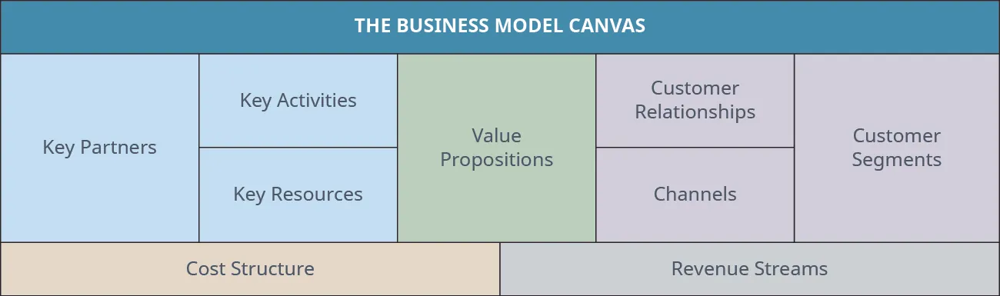
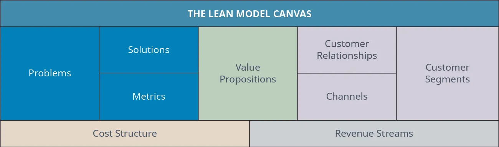
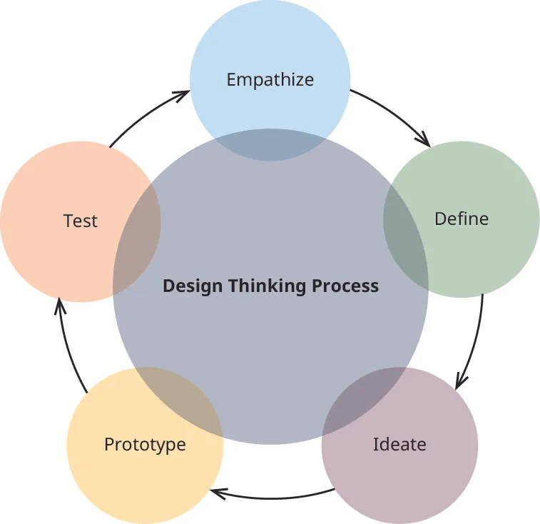
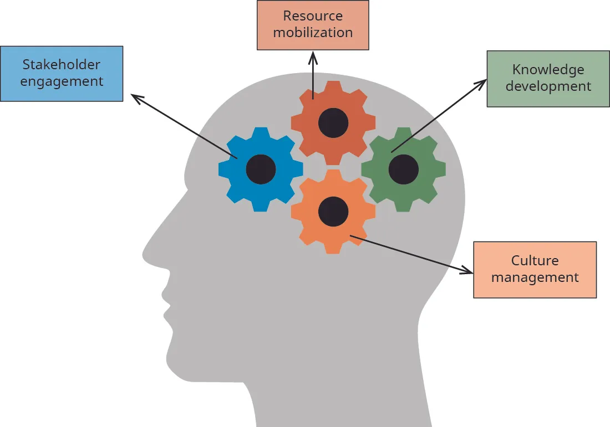

## 2.4   Các khung định hướng con đường khởi nghiệp của bạn

> **🎯 Mục tiêu học tập**
>
> Đến cuối phần này, bạn sẽ có thể:
>
> - Xác định các khung phổ biến được dùng để định hình một dự án khởi nghiệp
> - So sánh cách một số khung phù hợp hơn với những loại dự án nhất định
> - Xác định kế hoạch hành động và các công cụ sẵn có để xây dựng kế hoạch hành động
> - Mô tả một số kiểu doanh nhân phổ biến

Khi thiết kế một dự án có tính bền vững hoặc có khả năng tự tài trợ, việc sử dụng các công cụ cụ thể để quản lý thông tin là rất hữu ích. Một công cụ như vậy là **khuôn khổ** - một cấu trúc hoặc quy trình phác thảo có thể được dùng để đạt được các mục tiêu khởi nghiệp thông qua giải quyết vấn đề, hình thành và kiểm chứng ý tưởng, cũng như động não.

### Chọn một khung

Bạn có thể chọn một trong nhiều khung phổ biến để hỗ trợ việc thiết kế và tích hợp kinh nghiệm kinh doanh với tư duy khởi nghiệp của mình. Những khung được sử dụng rộng rãi nhất, được phát triển như các công cụ tích hợp nhằm hỗ trợ tư duy khởi nghiệp, bao gồm:

- **Business Model Canvas (BMC)**  cung cấp một công cụ đơn giản gói gọn trong một trang, được dùng để thiết kế một mô hình kinh doanh đổi mới có thể trình bày cho các bên liên quan chủ chốt ([Hình 2.22](2-4-frameworks-to-inform-your-entrepreneurial-path#OSX_Eship_02_04_BModCanvas)). Nội dung về business model canvas được trình bày đầy đủ hơn trong  [Mô hình và kế hoạch kinh doanh](11-introduction).

*Hình 2.22: Đây là một ví dụ về Business Model Canvas với một khung giúp xác định các thành phần chủ chốt của dự án. (ghi nguồn: Bản quyền thuộc Rice University, OpenStax, theo giấy phép CC BY NC-SA 4.0)*

- **Lean Strategy Canvas**  là một biến thể phát triển từ BMC, bổ sung vòng phản hồi tiềm năng từ khách hàng để cải thiện liên tục sản phẩm hoặc ý tưởng nhằm đáp ứng nhu cầu thị trường ([Hình 2.23](2-4-frameworks-to-inform-your-entrepreneurial-path#OSX_Eship_02_04_LeanCanvas)). Khung Lean Strategy Canvas được trình bày chi tiết hơn trong  [Ra mắt để tăng trưởng và thành công](10-introduction).

*Hình 2.23: Đây là một ví dụ về Lean Strategy Canvas, một khung hỗ trợ phát triển mô hình kinh doanh, lợi thế cạnh tranh và các lĩnh vực liên quan nhằm gắn kết sản phẩm với thị trường của dự án. (ghi nguồn: Bản quyền thuộc Rice University, OpenStax, theo giấy phép CC BY NC-SA 4.0)*

- **Design Thinking Process**  hỗ trợ một cách tiếp cận có hệ thống và logic để xử lý và giải quyết các vấn đề có nhiều lời giải ([Hình 2.24](2-4-frameworks-to-inform-your-entrepreneurial-path#OSX_Eship_02_04_DThinkProc)). Tư duy thiết kế ban đầu được áp dụng trong các lĩnh vực STEM - khoa học, công nghệ, kỹ thuật và toán học. Nhờ thành công của quy trình này, tư duy thiết kế đã trở nên phổ biến trong nhiều lĩnh vực khác.

*Hình 2.24: Quy trình tư duy thiết kế là một cách tiếp cận có hệ thống để giải quyết vấn đề. (ghi nguồn: Bản quyền thuộc Rice University, OpenStax, theo giấy phép CC BY NC-SA 4.0)*

Tư duy thiết kế tiếp cận việc giải quyết vấn đề hoặc tạo lập một dự án mới từ góc nhìn của khách hàng. Ví dụ, **Amazon** đã cung cấp các gói hàng dễ mở sau khi quan sát những khó khăn mà khách hàng gặp phải khi mở các sản phẩm được giao đến. Tư duy thiết kế được trình bày chi tiết hơn trong [Kỹ thuật giải quyết vấn đề và nhận diện nhu cầu](6-introduction), cùng các ứng dụng trong việc khởi động dự án khởi nghiệp, thiết kế sản phẩm và cải tiến các sản phẩm hiện có.

- **Four Lenses Strategic Framework**  được sử dụng để phát triển các doanh nghiệp xã hội; nó đánh giá bốn lĩnh vực chiến lược (gắn kết các bên liên quan, huy động nguồn lực, phát triển tri thức và quản trị văn hóa) nhằm giải quyết một vấn đề xã hội và tạo ra tác động xã hội bền vững ([Hình 2.25](2-4-frameworks-to-inform-your-entrepreneurial-path#OSX_Eship_02_04_FourLenses)).

*Hình 2.25: Four Lenses Strategic Framework bao gồm gắn kết các bên liên quan, quản trị văn hóa, huy động/ứng dụng nguồn lực và phát triển tri thức, đồng thời có thể tạo ra sự cộng hưởng và hiểu biết sâu sắc trong việc xây dựng các hành động tương thích và đồng bộ. (ghi nguồn: Bản quyền thuộc Rice University, OpenStax, theo giấy phép CC BY NC-SA 4.0)*

Ứng dụng điển hình của từng khung được trình bày trong [Bảng 2.3](2-4-frameworks-to-inform-your-entrepreneurial-path#fs-idm364252864). Quá trình lựa chọn khung phù hợp nhất với mối quan tâm khởi nghiệp của bạn có thể giúp bạn hiểu cách phát triển ý tưởng của mình. Chúng tôi khuyến nghị bạn thử cả bốn khung trước khi chọn một. Mặc dù mỗi khung được gắn với một nhóm dự án nói chung, mỗi khung lại mang đến một góc nhìn khác nhau cho việc phát triển dự án của bạn.

**Bảng 2.3: Các khung**

| Khung | Mô tả | Ứng dụng điển hình |
| --- | --- | --- |
| Business Model Canvas | Công cụ một trang phác họa chín khối cấu thành cơ bản cần thiết cho một mô hình kinh doanh thành công | Giúp xây dựng một mô hình kinh doanh bền vững |
| Lean Startup | Phác thảo một vòng phản hồi nhanh thông qua ý kiến khách hàng | Dùng cho các ngành thay đổi nhanh và việc kiểm chứng ý tưởng nhanh |
| Design Thinking Process | Phác thảo một quy trình có hệ thống, định hướng kết quả để xử lý và giải quyết vấn đề | Được dùng trong phát triển các lĩnh vực STEM và mở rộng sang dự án khởi nghiệp, sản phẩm và quy trình; có thể áp dụng cho mọi lĩnh vực |
| Four Lenses Strategic Framework | Mô hình định hướng thực hành xem xét bốn góc nhìn để hỗ trợ và phát triển một hệ sinh thái lấy khách hàng làm trung tâm | Được dùng để phát triển các dự án xã hội |

### Áp dụng khung thông qua kế hoạch hành động

Tại một thời điểm nào đó trong quá trình phát triển dự án, việc ghi lại các suy nghĩ và ý định của bạn theo cách có ý nghĩa và hiệu quả trở nên hết sức quan trọng. Việc sớm xây dựng một **kế hoạch hành động** được tùy chỉnh - một dàn ý hoặc cẩm nang từng bước, có tổ chức, tập hợp các ý tưởng, suy nghĩ và bước then chốt cần thiết để tạo nền tảng cho thành công khởi nghiệp - sẽ khiến quy trình khởi nghiệp diễn ra trôi chảy hơn và có khả năng thành công hơn trong dài hạn. Việc áp dụng một khung phù hợp sẽ mang lại cho bạn một nền tảng rõ ràng, hữu hình và vững chắc cho dự án tương lai. Khi hoàn thiện khung, bạn nên xác định các khoảng trống cũng như những ý tưởng cần phát triển thêm, rồi bổ sung cả hai vào kế hoạch hành động của mình. Cũng như bạn có thể chọn từ nhiều loại khung khác nhau, bạn cũng có thể áp dụng nhiều dạng kế hoạch hành động. Phần này giới thiệu một số công cụ lập kế hoạch hành động được dùng rộng rãi, nhưng không nhằm bao quát toàn bộ. Những kế hoạch hành động được chọn ở đây được trình bày như một cách khởi động tư duy của bạn cho quá trình tạo lập dự án.

### Kế hoạch hành động

Có lẽ bạn đã nghe những câu chuyện về các doanh nhân tiềm năng ngần ngại khởi sự một dự án, chủ yếu vì sợ phải lập **kế hoạch kinh doanh**. Trong lịch sử, việc xây dựng kế hoạch kinh doanh đòi hỏi lượng lớn thời gian, nguồn lực và nghiên cứu. Mặc dù kế hoạch kinh doanh vẫn cực kỳ có giá trị (và được thảo luận sâu trong [Mô hình và kế hoạch kinh doanh](11-introduction)), một số công cụ hữu ích tương tự kế hoạch kinh doanh đã xuất hiện: về cơ bản, đó là những biến thể về cách phát triển, nội dung và cấu trúc của kế hoạch kinh doanh truyền thống hoặc một thành phần của nó. Một mối băn khoăn khác về kế hoạch kinh doanh là cách doanh nhân sử dụng nó sau khi hoàn thành. Trong nhiều trường hợp, khi dự án được khởi động, nhóm khởi nghiệp phát hiện rằng kế hoạch kinh doanh không phản ánh đúng thực tế họ đang đối mặt. Nhiều biến số có thể làm giảm giá trị của kế hoạch kinh doanh. Lợi ích thực sự của việc hoàn thành kế hoạch kinh doanh là nó buộc nhóm khởi nghiệp phải suy nghĩ thấu đáo về các quyết định của mình như được phản ánh trong bản kế hoạch. Ngay cả khi dự án và kế hoạch kinh doanh thay đổi, quá trình lập kế hoạch kinh doanh vẫn khuyến khích tư duy phản biện và cải thiện quyết định. Trong thực tế vận hành, bạn sẽ cần điều chỉnh kế hoạch kinh doanh và cả dự án của mình. Trong suốt vòng đời của dự án, bạn nên tiếp tục nghiên cứu nền tảng và cập nhật các dự báo để thích ứng kế hoạch kinh doanh.

Khác với kế hoạch kinh doanh, mục đích của kế hoạch hành động là tập hợp các ý tưởng, suy nghĩ và hành động cần thiết để giúp bạn tạo tiền đề cho thành công khởi nghiệp. Hãy hình dung bạn cần loại kế hoạch hành động nào để chuẩn bị một bữa ăn ngày lễ. Chúng ta có hình dung về kết quả cuối cùng - bạn bè và gia đình quây quần bên nhau để cùng thưởng thức một bữa ăn ngon và đậm không khí lễ hội. Chúng ta cần chọn địa điểm phù hợp cho bữa ăn, xác định khách mời và lập ngân sách tài chính cho các chi phí liên quan. Sau đó, chúng ta cần tạo kế hoạch hành động của mình, tương tự như kế hoạch kinh doanh, để xác định những hành động nào là cần thiết cho sự kiện đó. Trong kế hoạch hành động, chúng ta sẽ bao gồm việc mời khách, lập thực đơn và danh sách mua sắm, thiết kế tiến độ để bảo đảm tất cả các món ăn của bữa tiệc được hoàn thành theo đúng trình tự: chúng ta muốn toàn bộ thức ăn sẵn sàng đúng lúc. Kế hoạch hành động cũng sẽ bao gồm quy trình dọn dẹp và các hoạt động sau bữa tối mà chúng ta muốn có trong sự kiện. Như bạn thấy, cả kế hoạch kinh doanh và kế hoạch hành động đều cần thiết cho thành công.

Khi bạn đã chọn được một khung và một kế hoạch hành động, bạn sẽ có những công cụ và thông tin cơ bản cần thiết để phác thảo con đường của **dự án** của mình. Khung mang lại bức tranh tổng thể về điều bạn muốn tạo ra và các nguồn lực cần cho mục tiêu đó, trong khi kế hoạch hành động cung cấp cho bạn các bước cụ thể để bắt đầu trên con đường khởi nghiệp và sau này hỗ trợ cho kế hoạch kinh doanh.

Kế hoạch hành động cũng có thể được hình thành từ việc sử dụng các công cụ được liệt kê trong [Bảng 2.4](2-4-frameworks-to-inform-your-entrepreneurial-path#fs-idm348673744). Những công cụ này có thể giúp bạn hình dung quy trình cần thiết để đạt mục tiêu cuối cùng bằng cách làm rõ các hành động cần thực hiện. Chúng cũng là những chỉ dẫn hữu hình cho việc đổi mới, khám phá và tạo ra giải pháp cho các vấn đề hoặc cơ hội khởi nghiệp. Bạn cũng có thể dùng kế hoạch hành động để thoát khỏi trạng thái “mắc kẹt” trong bất kỳ giai đoạn thử thách nào của quá trình khởi nghiệp. Có một lưu ý về những công cụ này: bạn cần thực sự sử dụng chúng thì mới có kết quả. Vì vậy, khi lập kế hoạch, hãy bảo đảm bạn thực tế về sở thích, năng lực và quỹ thời gian của mình. Ví dụ, **tạo khung dây** là một kỹ thuật thiết kế trang web được dùng ở giai đoạn đầu của quá trình phát triển, trong đó nội dung, bố cục và chức năng được xác định trước khi trang web thực sự được tạo ra. Trùng hợp là đây cũng là một ứng dụng khác của tư duy thiết kế thông qua việc tập trung vào tương tác của người dùng cuối với trang web. Như bạn có thể thấy từ ví dụ này, việc tìm kiếm các công cụ phổ biến được dùng trong những ngành cụ thể sẽ hỗ trợ bạn xây dựng khung của mình. [Bảng 2.4](2-4-frameworks-to-inform-your-entrepreneurial-path#fs-idm348673744) cung cấp một vài ví dụ về công cụ lập kế hoạch hành động được dùng để đi sâu vào chủ đề cụ thể.

**Bảng 2.4: Công cụ hỗ trợ kế hoạch hành động**

| Công cụ | Mô tả | Cách dùng |
| --- | --- | --- |
| Bảng tầm nhìn hoặc bảng ước mơ | Công cụ trực quan để trình bày trạng thái lý tưởng mà bạn đang hướng tới | Tạo khung dây |
| Bảng phân cảnh | Hình dung trực quan theo từng cảnh của quy trình hoạt động từ đầu đến cuối | Phương pháp thu nhận ý tưởng (IDEO) |
| Sơ đồ tư duy | Công cụ trực quan hỗ trợ phân loại các nhóm ý tưởng động não | Động não |
| Giả thuyết | Một mệnh đề hoặc phát biểu làm cơ sở cho việc kiểm tra hoặc nghiên cứu sâu hơn | Phỏng vấn |
| Sơ đồ logic | Biểu diễn trực quan các mối quan hệ giữa các thành phần hoặc biến số khác nhau | Bảng câu hỏi |

Các công cụ hỗ trợ kế hoạch hành động được trình bày trong [Bảng 2.4](2-4-frameworks-to-inform-your-entrepreneurial-path#fs-idm348673744) là một danh sách mẫu gồm các công cụ tiêu biểu hữu ích trong việc tạo động lực, truyền cảm hứng, xác định và làm rõ những hành động cần thiết. Danh sách này không bao quát hết; nếu bạn có công cụ nào phù hợp với mình thì hãy sử dụng nó. Một số ứng dụng cũng có thể giúp bạn ghi lại ý tưởng để tạo kế hoạch hành động, như được nêu trong phần [Tài nguyên gợi ý](2-suggested-resources). Mục tiêu là tìm và sử dụng một công cụ trực quan hoặc hữu hình truyền cảm hứng cho bạn tập trung, có tổ chức và cam kết thực hiện các hành động cần thiết để biến giấc mơ khởi nghiệp thành hiện thực. Giả sử bạn biết rằng mình muốn khởi động một dự án giúp mọi người phục hồi sau một dạng thiên tai nào đó. Bạn có thể sử dụng một trong các công cụ hỗ trợ kế hoạch hành động này, chẳng hạn như **sơ đồ tư duy**, để giúp mình động não về các nhu cầu có thể phát sinh từ thiên tai trong một thành phố ([Hình 2.26](2-4-frameworks-to-inform-your-entrepreneurial-path#OSX_Eship_02_04_DisMindMap)). Bạn có thể phân loại ý tưởng theo hướng giúp con người, giúp động vật hoặc sửa chữa cơ sở hạ tầng của thành phố. Sau khi hoàn thành sơ đồ tư duy, bạn sẽ cân nhắc những lĩnh vực nào phù hợp với sở thích, đam mê và kỹ năng của mình. Từ đó, bạn có thể xác định loại dự án mình muốn tạo ra và các hành động cần thiết để tiếp tục phát triển ý tưởng. Việc sử dụng các loại công cụ này hỗ trợ nhận diện những hành động cần được đưa vào kế hoạch hành động của bạn.

*Hình 2.26: Từ sơ đồ tư duy về các thiên tai xảy ra và các hành động cần thực hiện này, chúng ta có thể tập trung vào một lĩnh vực hành động phù hợp với sở thích, đam mê và kỹ năng của mình. Sau khi chọn một lĩnh vực quan tâm, chúng ta có thể tạo thêm một sơ đồ tư duy khác tập trung vào lĩnh vực đó để xác định các nhóm giải pháp. Tiếp theo, chúng ta có thể áp dụng một trong các khung được liệt kê trong [Bảng 2.3](2-4-frameworks-to-inform-your-entrepreneurial-path#fs-idm364252864). Từ đó, chúng ta có thể tạo một kế hoạch hành động về những bước cần làm để hiểu rõ hơn về ý tưởng hoặc các giải pháp. Như bạn có thể thấy, kế hoạch hành động phù hợp với nhiều lĩnh vực khác nhau. (ghi nguồn: Bản quyền thuộc Rice University, OpenStax, theo giấy phép CC BY NC-SA 4.0)*

### Các kiểu doanh nhân

Hãy nhớ từ [Góc nhìn khởi nghiệp](1-introduction) rằng với một số người, con đường khởi nghiệp là rõ ràng và logic. Ví dụ, sự nghiệp trong một phòng thí nghiệm y sinh có thể bao gồm nghiên cứu và thử nghiệm lâm sàng dẫn đến việc nộp đơn xin cấp bằng sáng chế cho một sản phẩm để bán ra thị trường, từ đó dẫn đến một dự án mới. Những người khác trải nghiệm con đường khởi nghiệp thông qua các phương thức phi truyền thống, chẳng hạn khi một cơ hội bất ngờ xuất hiện. Khi thị trường toàn cầu tiếp tục phát triển, các cơ hội khởi nghiệp mới sẽ mở ra cho những cá nhân sẵn sàng đón nhận các cơ hội dựa trên sự sáng tạo và đổi mới.

Doanh nhân theo quan niệm truyền thống thường được xem là những cá nhân không phù hợp với cấu trúc tổ chức điển hình hoặc là những người có trí tuệ, sáng tạo, trí tưởng tượng và tiền bạc để tự mình khởi sự. Tuy nhiên, nhận thức này đang thay đổi khi ngày càng có nhiều hỗ trợ nhằm giảm các rào cản và mở rộng khả năng tiếp cận khởi nghiệp cho mọi nhóm nhân khẩu học. Theo một cuộc thảo luận tại Capitol Hill năm 2018 về phụ nữ, người thiểu số và khởi nghiệp, bức tranh nhân khẩu học hiện nay cho thấy chỉ 12 phần trăm nhà đổi mới ở Mỹ là phụ nữ, còn các nhóm thiểu số sinh ra tại Mỹ chiếm 8 phần trăm, trong đó người Mỹ gốc Phi chỉ chiếm một phần hai của 1 phần trăm trong nhóm này.[^44] Theo một báo cáo của National Academies of Sciences được dẫn lại trong cùng cuộc thảo luận đó, các doanh nghiệp nhỏ do phụ nữ và người thiểu số sở hữu nhận được chưa tới 16 phần trăm tổng số giải thưởng của chương trình Small Business Innovation Research (SBIT). Mặc dù phụ nữ chiếm 51 phần trăm dân số Mỹ và sở hữu 29 phần trăm doanh nghiệp, họ chỉ nhận được 6 phần trăm giải thưởng SBIT.

Cũng được nêu trong buổi thông tin tại Capitol Hill, một báo cáo năm 2015 của Bộ Thương mại Hoa Kỳ cho thấy các doanh nghiệp nhỏ do phụ nữ sở hữu có tỷ lệ giành được hợp đồng liên bang thấp hơn 21 phần trăm. Một kết quả của buổi thông tin này là việc thông qua đạo luật **Promoting Women in Entrepreneurship Act**, yêu cầu National Science Foundation khuyến khích các chương trình khởi nghiệp tuyển chọn và hỗ trợ phụ nữ trong các hoạt động thương mại thay vì chỉ trong các hoạt động thuần phòng thí nghiệm. Một số thách thức được xác định trong cuộc thảo luận này đối với các nhóm ngoài hình mẫu doanh nhân truyền thống bao gồm những lựa chọn cuộc sống như sinh con, khả năng tiếp cận nguồn vốn, và sự thiếu hụt hỗ trợ cũng như theo sát để hỗ trợ phụ nữ và người thiểu số trong các mối quan tâm liên quan đến hoạt động khởi nghiệp tiềm năng.

Những phát hiện khác rút ra từ dữ liệu của Census Bureau và được Kauffman Foundation công bố cho thấy hơn 70 phần trăm doanh nhân gốc Á, gốc Tây Ban Nha và gốc Phi dựa vào tiền tiết kiệm cá nhân và gia đình như nguồn vốn khởi nghiệp chính. Phụ nữ cũng đối mặt với thách thức về tài trợ, khi chỉ nhận được 2,2 phần trăm nguồn vốn mạo hiểm trong năm 2018.[^45] Một dự luật mang tên **Support Startup Businesses Act**, được tái trình lên Thượng viện Hoa Kỳ vào năm 2019, nhằm giải quyết những thách thức này bằng cách tăng tổng mức tài trợ để hỗ trợ doanh nghiệp khởi nghiệp, tạo thêm tính linh hoạt trong cấp vốn và mở rộng các dịch vụ cho doanh nghiệp khởi nghiệp.[^46] Các diễn giả kết thúc cuộc thảo luận tại Capitol Hill bằng nhận định rằng “văn hóa anh em” đã lan rộng với cái giá phải trả là những ý tưởng khởi nghiệp do phụ nữ và người thiểu số dẫn dắt. Các rào cản văn hóa, bao gồm cả tình trạng bị tước quyền trong lịch sử của phụ nữ, người thiểu số và người nhập cư, phát sinh từ định kiến; một diễn giả lưu ý rằng nhà đầu tư thường đặt những câu hỏi khó và dò xét hơn với doanh nhân nam, nhưng lại đặt những câu hỏi hoài nghi hơn với phụ nữ.

Ngày nay, cơ hội đã mở rộng cho các doanh nghiệp và tổ chức biết phản ứng trước những thách thức hiện tại, có thể là tìm cách cải thiện một tình huống tiêu cực hoặc nhận ra một nhu cầu trong một bối cảnh tích cực, cùng với nhận thức ngày càng tăng về những lợi ích mà hoạt động khởi nghiệp mang lại. Khi ngày càng nhiều vấn đề và cơ hội toàn cầu, văn hóa và kinh tế xuất hiện, sẽ có thêm nhiều cá nhân khám phá khởi nghiệp như một phản ứng trước các thách thức đó. Ví dụ, khi nhận thấy những khó khăn mà phụ nữ và người thiểu số gặp phải khi khởi sự một dự án mới, Alan **Donegan** và nhóm của ông đào tạo mọi người cách biến tầm nhìn khởi nghiệp của họ thành hiện thực thông qua **PopUp Business School**. Điểm cốt lõi là cơ hội nên mở ra cho tất cả mọi người, miễn là chúng ta giữ một tư duy cởi mở khi xem xét cách sự thay đổi góp phần tạo ra những dự án mới.

> **🛠️ Bạn có thể làm gì?: Rào cản đối với tài trợ vốn**
>
> Trước danh sách các yếu tố văn hóa và kinh tế này, bạn có thể làm gì để góp phần giải quyết những thách thức liên quan đến định kiến? Hãy xem cách Alan Donegan phản ứng trước nhu cầu giáo dục mọi người về cách tự khởi sự doanh nghiệp của mình. Ông đã tạo ra một công ty để đáp ứng nhu cầu đó. Bạn cũng có thể cân nhắc đọc các thông tin thống kê như dữ liệu điều tra dân số và các bản tin để xác định những thị trường mục tiêu độc đáo và các nhu cầu tiềm năng có thể dẫn tới một dự án mới.
>
>
>
> Kauffman Foundation báo cáo những vấn đề này, được tóm tắt trong [Bảng 2.5](2-4-frameworks-to-inform-your-entrepreneurial-path#fs-idm345136768).
>
>
>
> **Bảng 2.5: Các rào cản tiềm tàng đối với tài trợ khởi nghiệp 47**
>
> | Rào cản tiềm tàng | Thách thức |
> | --- | --- |
> | Rào cản địa lý | Gần 80 phần trăm trong khoảng 21,1 tỷ USD vốn đầu tư mạo hiểm của quý I năm 2018 được phân bổ vào năm cụm khu vực - San Francisco (North Bay Area), Silicon Valley (South Bay Area), New England, vùng đô thị New York City và LA/Orange County - trong đó riêng North và South Bay Area chiếm hơn 44 phần trăm. |
> | Định kiến giới | Phụ nữ có khả năng khởi sự doanh nghiệp thấp hơn đáng kể so với nam giới. Năm 1996, tỷ lệ doanh nhân mới ở phụ nữ là 260 trên 100.000 người, so với 380 trên 100.000 ở nam giới. Năm 2017, tỷ lệ này ở phụ nữ là 270 trên 100.000, so với 400 trên 100.000 ở nam giới. Con số này phản ánh các doanh nhân mới, bất kể tình trạng đăng ký pháp nhân hay có lao động thuê hay không. |
> | Định kiến chủng tộc và sắc tộc | Bức tranh khởi nghiệp tại Hoa Kỳ được đánh dấu bởi những khác biệt đáng kể giữa các nhóm chủng tộc và sắc tộc. Các doanh nghiệp do người thiểu số sở hữu được ghi nhận là phải đối mặt với những rào cản lớn về vốn. Ví dụ, các doanh nghiệp này bị từ chối tín dụng bổ sung với tỷ lệ cao hơn khi họ cần và nộp đơn xin vay. Một nghiên cứu so sánh các nguồn tài chính cho thấy những doanh nghiệp mới do người da đen sở hữu bắt đầu với tổng vốn ít hơn gần ba lần so với doanh nghiệp mới do người da trắng sở hữu, và khoảng cách này không thu hẹp khi doanh nghiệp trưởng thành. |
> | Thiếu tài sản ban đầu | Những cá nhân thu nhập thấp không có tài sản ban đầu sẵn có cũng phải đối mặt với các rào cản lớn về vốn. Nghiên cứu về hạn chế thanh khoản cho thấy nhóm 5 phần trăm giàu nhất tại Hoa Kỳ có khả năng khởi sự doanh nghiệp cao hơn các nhóm thu nhập khác, và tài sản cá nhân cũng như tài sản hộ gia đình là những động lực quan trọng thúc đẩy việc gia nhập kinh doanh. Nghiên cứu ở cấp khu dân cư cho thấy tại New York City, một phần ba khu vực giàu hơn có tỷ lệ tự doanh cao hơn hơn gấp đôi so với một phần ba khu vực nghèo nhất. Giá trị tài sản ròng hộ gia đình cao hơn của người sáng lập có liên hệ với lượng vốn bên ngoài nhận được lớn hơn, ngay cả khi đã tính đến vốn con người, đặc điểm dự án và nhu cầu về vốn. |
> | Sự dịch chuyển trong ngành ngân hàng | Các ngân hàng lớn ngày càng lớn hơn, trong khi số lượng ngân hàng nhỏ và vừa giảm đi. Các ngân hàng lớn vượt qua thời kỳ Great Recession với bảng cân đối được phục hồi, còn các ngân hàng nhỏ - những đơn vị có nhiều khả năng cho doanh nhân vay hơn - lại bị hạn chế bởi cả điều kiện kinh tế lẫn các rào cản pháp lý mới. |
> | Bất cân xứng thông tin | Sự tồn tại dai dẳng của bất cân xứng thông tin trên thị trường vốn giữa bên cung vốn (nhà đầu tư) và bên cầu vốn (doanh nhân) tạo ra những rào cản mà doanh nhân phải đối mặt. Doanh nhân gặp khó khăn lớn hơn doanh nghiệp đã thành lập trong việc tiếp cận vốn vì các doanh nghiệp đang hoạt động có thể tận dụng lịch sử hoạt động dài hơn và những mối quan hệ sẵn có. |
>
>
> - Bạn đang đối mặt với những thách thức nào trong các lĩnh vực này?
> - Bạn có thể thực hiện những bước nào để giúp giảm bớt các thách thức đó?

Khi cách nhìn truyền thống về khởi nghiệp thay đổi, nhiều kiểu khởi nghiệp khác nhau đang xuất hiện và đáng để lưu ý khi bạn suy ngẫm về hành trình khởi nghiệp của mình. Những kiểu được trình bày ở đây là một số loại phổ biến nhất hiện nay, mỗi loại đều có những cơ hội và thách thức riêng.

- Doanh nhân sinh viên: Khi chi phí giáo dục đại học tiếp tục tăng, ngày càng nhiều sinh viên tìm cách giảm phụ thuộc vào các khoản vay học phí bằng cách khởi sự một dự án. Doanh nhân sinh viên có thể khởi động một doanh nghiệp trong khi còn học hoặc sau khi tốt nghiệp. Các học phần về khởi nghiệp có thể yêu cầu sinh viên tạo ra và ra mắt một dự án như một phần của chương trình học, và điều này có thể biến thành cơ hội tạo thu nhập thực sự.
- Nhà khởi nghiệp nội bộ trong doanh nghiệp: Nếu bạn làm việc cho một công ty cấp tiến luôn tìm kiếm giải pháp đổi mới cho tăng trưởng và cơ hội, bạn có thể trở thành nhà khởi nghiệp nội bộ bằng cách tổ chức các nguồn lực cần thiết để theo đuổi một dự án phục vụ lợi ích của tổ chức.
- Doanh nhân nhượng quyền: Vì hình thức nhượng quyền cấp cho doanh nhân giấy phép kinh doanh dưới tên của hệ thống nhượng quyền, doanh nhân nhượng quyền có được một lợi thế khởi đầu trong ngành bằng cách khai trương cơ sở nhượng quyền đó.
- Doanh nhân nhập cư: Khi bất ổn toàn cầu gia tăng, ngày càng có nhiều người nhập cư đến các quốc gia mới. Tại Hoa Kỳ, các cộng đồng sắc tộc của người nhập cư chào đón đồng hương và giúp họ trở nên độc lập thông qua khởi nghiệp. Các cộng đồng này cùng góp các nguồn lực cần thiết để hỗ trợ người nhập cư mới cho đến khi doanh nghiệp có thể tự duy trì.
- Doanh nhân trực tuyến: Khi khả năng tiếp cận công nghệ và các nền tảng liên quan tăng lên, cơ hội cho các doanh nghiệp trực tuyến cũng tăng theo. Doanh nhân trực tuyến sử dụng các nền tảng mạng xã hội, điện thoại thông minh và máy tính bảng, ứng dụng, và mọi dạng công nghệ dễ tiếp cận khác như sản phẩm hoặc nền tảng của dự án. Cấu trúc then chốt của các dự án này là phải bao gồm khả năng thương mại điện tử hoặc xử lý thanh toán trực tuyến.
- Doanh nhân là phụ nữ hoặc người thiểu số: Phụ nữ có góc nhìn riêng và tiềm năng khai thác những thị trường ngách mới hoặc đã tồn tại trong nhiều lĩnh vực khởi nghiệp. Nhiều nhóm văn hóa, chẳng hạn như người Haiti, Cuba hoặc Jamaica, cũng có những kỹ năng và nhu cầu thị trường đặc thù.
- Doanh nhân bán thời gian: Để ứng phó với suy thoái kinh tế, tình trạng thiếu việc làm và thất nghiệp, ngày càng nhiều người bổ sung thu nhập thông qua các hoạt động bán thời gian, thường được gọi là “việc tay trái”. Những người này có thể khởi sự kinh doanh thông qua các công ty tiếp thị đa cấp như  **Avon**,  **Mary Kay**,  **Stella & Dot**  và các công ty khác. Nhóm này cũng có thể bao gồm những người làm việc tự do. Ví dụ gồm có người viết, nhà thiết kế đồ họa, nghệ sĩ, lập trình viên web và chuyên viên massage.
- Doanh nhân xã hội: Một số doanh nhân được thôi thúc bởi mong muốn cung cấp các giải pháp đổi mới cho những vấn đề xã hội hiện hữu và mới nổi như nghèo đói, nạn đói, buôn người và suy thoái môi trường. Phần lớn doanh nghiệp xã hội được tổ chức dưới dạng phi lợi nhuận. Tuy nhiên, sự quan tâm ngày càng tăng đối với các thực thể vì lợi nhuận kết hợp mục tiêu kinh doanh với mục tiêu xã hội đã làm xuất hiện một tiểu nhóm gọi là  **B-corp**  (xem  [Các lựa chọn cấu trúc doanh nghiệp: vấn đề pháp lý, thuế và rủi ro](13-introduction)), hay công ty lợi ích. Danh hiệu B-corp là một chứng nhận tự nguyện do tổ chức phi lợi nhuận B Lab quản lý nhằm bảo đảm các công ty tuân thủ những hướng dẫn, quy tắc và chuẩn mực trách nhiệm giải trình cụ thể.
