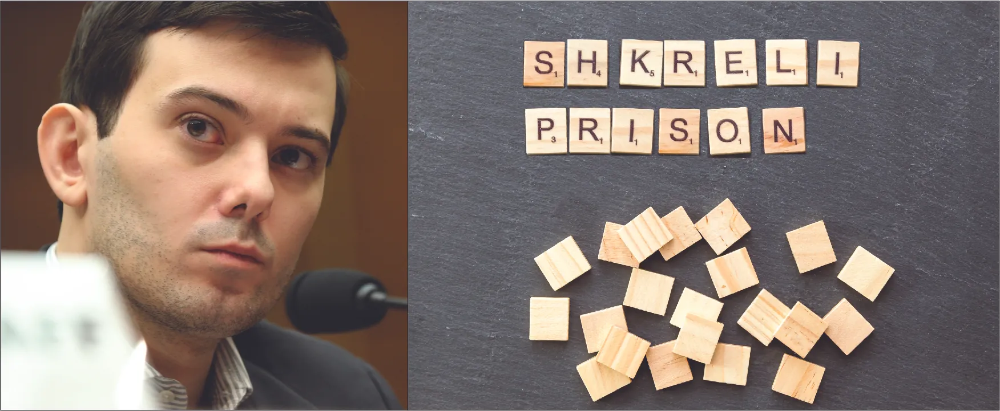

*Hình 3.1: Ảnh chụp Martin Shkreli (bên trái). Các mảnh xếp chữ Scrabble ghép thành chữ SHKRELI PRISON (bên phải). (ghi công (bên trái): chỉnh sửa từ tác phẩm “Martin Shkreli 2016” của Ủy ban Giám sát và Cải cách Chính phủ Hạ viện Hoa Kỳ/Wikimedia Commons, Miền công cộng; ghi công (bên phải): chỉnh sửa từ tác phẩm “Martin Shkreli sentenced to seven years in prison for defrauding investors” của Marco Verch/Flickr, CC BY 2.0)*

## Dàn ý chương

- [3.1   Các vấn đề pháp lý và đạo đức trong khởi nghiệp](3-1-ethical-and-legal-issues-in-entrepreneurship)
- [3.2   Trách nhiệm xã hội của doanh nghiệp và Khởi nghiệp xã hội](3-2-corporate-social-responsibility-and-social-entrepreneurship)
- [3.3   Xây dựng văn hóa nơi làm việc có tính chuẩn mực đạo đức xuất sắc và trách nhiệm giải trình](3-3-developing-a-workplace-culture-of-ethical-excellence-and-accountability)

## Giới thiệu

Martin **Shkreli**, một nhà khởi nghiệp ngành dược đầy tham vọng kiêm cựu quản lý quỹ đầu cơ, đã trở thành tâm điểm của báo giới vào năm 2015 khi tận dụng một cơ hội kinh doanh đầy tranh cãi nhưng mang lại lợi nhuận cao. Với tư cách là người sáng lập kiêm CEO của **Turing Pharmaceuticals**, Shkreli đã mua lại bằng sáng chế đã hết hạn của một loại thuốc cứu mạng dùng để điều trị HIV. Ông đã tăng giá bán trên thị trường Hoa Kỳ chỉ sau một đêm từ 13,50 USD lên 750 USD một viên thuốc — tăng 5.000 phần trăm. Khi những lời chỉ trích từ cộng đồng y tế, công chúng và các chính trị gia dẫn đến yêu cầu quay trở lại mức giá ban đầu, Shkreli đã bảo vệ quyết định của mình như một thực tiễn kinh doanh thông minh góp phần vào lợi nhuận ròng của công ty ông. Cuối cùng, ông đồng ý rút lại quyết định tăng giá nhưng sau đó lại nuốt lời hứa, thay vào đó đề xuất cung cấp mức giá chiết khấu cho các bệnh viện.

Tuy nhiên, thiệt hại đối với danh tiếng của Shkreli đã không thể cứu vãn. BBC mô tả ông là CEO "bị ghét nhất" nước Mỹ vì các quyết định kinh doanh, hành vi đáng ghét và những lời lẽ tiêu cực trên mạng xã hội.[^1] Các chuyên gia về bệnh truyền nhiễm và những người ủng hộ người bệnh đã bác bỏ lập luận của Shkreli rằng "chiến lược điều chỉnh giá" của ông là có ích cho bệnh nhân, vì những người được điều trị sẽ cần dùng thuốc trong một thời gian dài sau khi xuất viện. Mặc dù chiến lược định giá này không bất hợp pháp, Shkreli cuối cùng vẫn bị điều tra và bị tuyên phạm tội gian lận chứng khoán liên quan đến việc huy động vốn giả tạo từ các nhà đầu tư quỹ đầu cơ và biển thủ tiền từ công ty dược phẩm của mình để hoàn trả cho nhà đầu tư.[^2]
