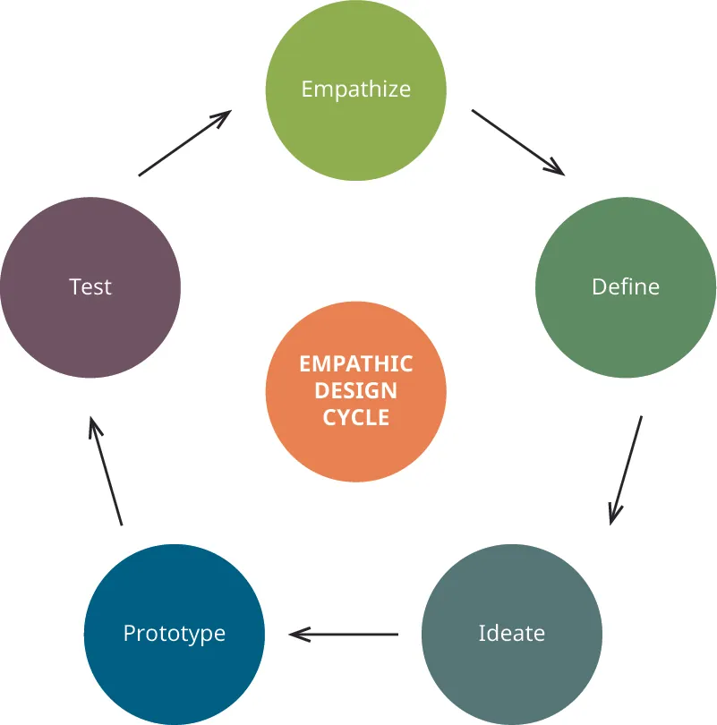
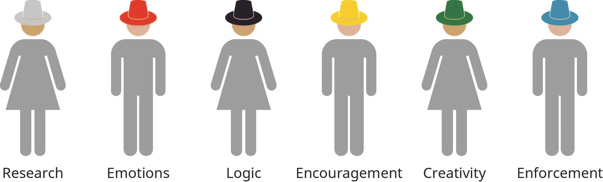

## 4.1   Công cụ cho sáng tạo và đổi mới

> **🎯 Mục tiêu học tập**
>
> Đến cuối phần này, bạn sẽ có thể:
>
> - Mô tả các phương pháp giải quyết vấn đề sáng tạo phổ biến, có cơ sở hỗ trợ vững chắc
> - Hiểu phương pháp đổi mới hoặc giải quyết vấn đề nào phù hợp nhất trong những bối cảnh khác nhau
> - Biết tìm kiếm ở đâu các thực hành, nghiên cứu và công cụ đổi mới mới nổi

Sáng tạo, đổi mới và phát minh là những khái niệm then chốt trên hành trình khởi nghiệp của bạn. Nuôi dưỡng sáng tạo và đổi mới sẽ bổ sung những công cụ thiết yếu cho bộ công cụ khởi nghiệp của bạn. Trong chương này, trước hết bạn sẽ tìm hiểu một số công cụ thực tiễn có thể hỗ trợ nỗ lực sáng tạo và đổi mới của mình. Sau đó, chúng ta sẽ định nghĩa và phân biệt sáng tạo, đổi mới và phát minh, đồng thời chỉ ra sự khác nhau giữa đổi mới tiên phong và đổi mới gia tăng. Cuối cùng, chúng ta sẽ xem xét các mô hình và quy trình để phát triển sáng tạo, đổi mới và năng lực phát minh. Khoa học, nghiên cứu và thực hành về sáng tạo cũng như tư duy thiết kế luôn không ngừng phát triển. Theo kịp những cách tiếp cận đã được kiểm chứng và ghi nhận thành công có thể mang lại cho bạn lợi thế cạnh tranh, đồng thời nhắc bạn rằng khởi nghiệp có thể rất thú vị, hào hứng và mới mẻ, miễn là bạn giữ cho tinh thần sáng tạo luôn sống động và không ngừng chuyển động.

### Các phương pháp giải quyết vấn đề sáng tạo

Tư duy sáng tạo có thể biểu hiện dưới nhiều hình thức ([Hình 4.2](4-1-tools-for-creativity-and-innovation#OSX_Eship_04_01_Walking)). Phần này tập trung vào một số bài tập tư duy sáng tạo đã chứng tỏ hữu ích đối với doanh nhân. Sau khi thảo luận về những thực hành kiến tạo ý tưởng mà bạn có thể thử, chúng ta sẽ kết thúc bằng việc xem xét một bài tập đổi mới chuyên sâu có thể giúp bạn hình thành thói quen biến ý tưởng sáng tạo thành sản phẩm và dịch vụ đổi mới. Trong phần này, kết quả đầu ra là yếu tố then chốt.

*Hình 4.2: Khi quy trình của bạn bị khựng lại ở một điểm nghẽn, một cuộc đi bộ, hoặc vừa đi vừa trò chuyện, có thể giúp tăng cường khả năng sáng tạo khi bạn suy nghĩ giải pháp. (ghi công: “beard business city colleague” của “rawpixel”/Pixabay, CC0)*

Ở đây, chúng ta bàn về ba thực hành **ideation**. Một số thực hành khác được cung cấp qua các liên kết ở cuối phần này. Thực hành kiến tạo ý tưởng đầu tiên đến từ Stanford’s Design School.[^2] Mục tiêu là tạo ra càng nhiều ý tưởng càng tốt và bắt đầu phát triển một số ý tưởng trong đó. Đây là thực hành **design thinking** điển hình, hay bài tập tư duy **human-centric design** lấy con người làm trung tâm, gồm năm phần: tiếp cận và thể hiện sự đồng cảm, xác định vấn đề, hình thành ý tưởng giải pháp (brainstorming), tạo mẫu và kiểm thử ([Figure 4.3](4-1-tools-for-creativity-and-innovation#OSX_Eship_04_03_Empathic)). **Sự thấu cảm** là khả năng của con người trong việc cảm nhận những gì người khác đang cảm nhận; trong bối cảnh sáng tạo, đổi mới và phát minh, đây là nền tảng để khởi đầu một quy trình thiết kế lấy con người làm trung tâm. Thực hành sự đồng cảm giúp chúng ta kết nối với con người và nhìn vấn đề qua con mắt cũng như cảm xúc của người trực tiếp trải nghiệm nó. Khi thể hiện sự đồng cảm, bạn bắt đầu hiểu nhiều khía cạnh của vấn đề và suy nghĩ về mọi lực tác động cần huy động để giải quyết nó. Từ sự đồng cảm, bạn có thể chuyển sang bước thứ hai là xác định vấn đề. Để thiết kế lấy con người làm trung tâm phát huy hiệu quả, việc xác định vấn đề phải dựa trên sự quan sát trung thực, lý trí, *and* cảm xúc. Bước thứ ba là brainstorming giải pháp. Hai bài tập hoặc thực hành kiến tạo ý tưởng còn lại trong phần này đi sâu hơn vào brainstorming, vào ý nghĩa của nó và cách bạn có thể brainstorm một cách sáng tạo vượt ra ngoài việc viết nguệch ngoạc trên bảng trắng vốn rất quen thuộc ở hầu hết các tổ chức. Thiết kế cho người khác có nghĩa là xây dựng nguyên mẫu, tức bước thứ tư, rồi đem đi kiểm thử. Khi áp dụng quy trình này vào việc phát triển sản phẩm hoặc dịch vụ, bạn cần quay lại tư duy đồng cảm để xem liệu mình đã đạt tới một giải pháp khả thi và từ đó là một cơ hội hay chưa.

*Hình 4.3: Chu trình thiết kế đồng cảm lấy con người làm trung tâm. (ghi công: Bản quyền Đại học Rice, OpenStax, theo giấy phép CC BY NC-SA 4.0)*

> **🔗 Liên kết học tập**
>
> Hãy xem [video về thiết kế lấy con người làm trung tâm](https://openstax.org/l/52HumnCntDesign) để biết thêm thông tin, bao gồm phần giải thích về các giai đoạn trong quy trình.

Để đi sâu hơn vào thực hành kiến tạo ý tưởng, ở đây chúng ta giới thiệu phương pháp **Sáu chiếc mũ tư duy** ([Hình 4.4](4-1-tools-for-creativity-and-innovation#OSX_Eship_04_03_SixHats)).[^3] Trò chơi tạo ý tưởng này có nhiều phiên bản khác nhau, nhưng tất cả đều rất hữu ích trong việc thúc đẩy suy nghĩ bằng cách giới hạn kiểu tư duy của những người tham gia. Khi được khuyến khích nhập vai vào một lối tư duy duy nhất, bạn sẽ được giải phóng khỏi việc phải đồng thời cân nhắc những khía cạnh khác của vấn đề, vốn có thể hạn chế tính sáng tạo khi bạn tìm lời giải. Sáu chiếc mũ đó là:

- Mũ Trắng: đóng vai trò thu thập thông tin thông qua nghiên cứu và đưa phân tích định lượng vào thảo luận; bám sát sự kiện
- Mũ Đỏ: đưa cảm xúc trực diện vào cuộc trao đổi và nêu ra cảm nhận mà không cần biện minh
- Mũ Đen: sử dụng logic và sự thận trọng; cảnh báo người tham gia về các giới hạn mang tính thể chế; còn được gọi là “người phản biện”
- Mũ Vàng: mang tinh thần lạc quan “tích cực hợp lý” đến cho nhóm; khuyến khích giải quyết cả vấn đề nhỏ lẫn lớn
- Mũ Xanh lá: suy nghĩ sáng tạo; đưa ra thay đổi và kích thích các thành viên khác khi cần; những ý tưởng mới là phạm vi của Mũ Xanh lá
- Mũ Xanh dương: duy trì cấu trúc tổng thể của cuộc thảo luận và có thể đặt ra tiêu chí đánh giá tiến độ; bảo đảm các mũ khác tuân thủ quy tắc, hay nói cách khác là ở đúng vai của mình

*Hình 4.4: Bài tập Sáu chiếc mũ tư duy được thiết kế để mỗi người tham gia tập trung vào một cách tiếp cận cụ thể đối với vấn đề hoặc cuộc thảo luận. (ghi công: Bản quyền Đại học Rice, OpenStax, theo giấy phép CC BY NC-SA 4.0)*

Bạn có thể áp dụng bài tập Sáu chiếc mũ tư duy để tạo cấu trúc cho một cuộc thảo luận mà nếu không có nó, một số thành viên trong nhóm có thể cùng lúc cố gắng đội nhiều chiếc mũ. Trò chơi này không phải lúc nào cũng dễ triển khai. Nếu các thành viên không thể tuân thủ quy tắc, quy trình sẽ đổ vỡ. Khi vận hành tốt nhất, Mũ Xanh dương giữ quyền điều phối và giúp bài tập diễn ra nhanh gọn. Điều mà bạn và nhóm của mình nên trải nghiệm là một dạng tự do khá đặc biệt nảy sinh từ chính sự áp đặt giới hạn. Khi chỉ chịu trách nhiệm cho một lối tư duy, mỗi người tham gia có thể hoàn toàn bảo vệ quan điểm đó và suy nghĩ sâu về khía cạnh tương ứng của lời giải. Nhờ vậy, cả nhóm có thể cùng lúc rất sáng tạo, rất logic, rất lạc quan và rất phản biện. Thực hành này nhằm giúp cả nhóm vượt qua những giải pháp hời hợt. Nếu bạn luyện tập tốt bài tập này, thì những khó khăn khi triển khai hoàn toàn xứng đáng với công sức bỏ ra. Nó cho bạn cơ hội thẩm định ý tưởng kỹ lưỡng, đồng thời hạn chế nhiều xung đột cá tính. Nếu người tham gia giữ đúng vai, họ chỉ có thể bị quy là đang hành động vì lợi ích tốt nhất của chiếc mũ mình đội.

Giảng viên của bạn có thể yêu cầu các thành viên trong nhóm thử những chiếc mũ khác nhau trong các bài tập kiến tạo ý tưởng khác nhau để mọi người phát triển đầy đủ hơn từng kiểu tư duy.[^4] Bài tập này buộc bạn bước ra khỏi những lối suy nghĩ quen thuộc và thoải mái nhất của mình. Bạn và các bạn cùng lớp cũng có thể nhận ra ở nhau những năng lực mà trước đó chưa từng nghĩ mình sở hữu.

Thực hành kiến tạo ý tưởng thứ ba khá đơn giản. Nếu tư duy trì trệ bắt đầu chi phối một cuộc thảo luận đang diễn ra, việc đưa vào một khung kiến tạo ý tưởng có thể rất hữu ích. Đó là phương pháp “**statement starters**”.[^5] Hãy đặt câu hỏi “How might we ________?” hoặc “What if we ________?” để mở ra những khả năng mới khi bạn có cảm giác mình đã chạm tới giới hạn của sự sáng tạo. Phương pháp này không chỉ đơn thuần là hỏi “Tại sao không?” vì nó tìm cách khám phá *how* một vấn đề có thể được giải quyết như thế nào. Với doanh nhân, cách đơn giản nhất là đóng khung vấn đề dưới dạng một câu hỏi, và điều đó có thể mở mang tầm nhìn. Cách này giả định rằng luôn có những khả năng mở, mời gọi sự tham gia và đòi hỏi sự tập trung. Các câu mở đầu giả định ít nhất rằng mọi vấn đề *might* có thể có lời giải. Kiến tạo ý tưởng là bắt đầu bước xuống những lối đi mới. Kiểu tư duy này áp dụng được cho cả các vấn đề xã hội lẫn pain point của người tiêu dùng. Việc lập một danh sách các câu mở đầu có thể giúp doanh nhân khảo sát các khả năng khác nhau chỉ bằng cách đổi góc nhìn khi đặt câu hỏi. Chẳng hạn, câu hỏi “How might we keep rivers clean?” khá giống với “How might we prevent animal waste runoff from entering our city’s waterways?”, nhưng hàm ý của mỗi câu lại khác nhau đối với các bên liên quan khác nhau. Hãy nhớ rằng stakeholder là những cá nhân có lợi ích thiết yếu gắn với doanh nghiệp hoặc tổ chức. Các câu mở đầu gần như luôn dẫn tới thảo luận về stakeholder và cách họ có thể tham gia tìm giải pháp, đưa ra hỗ trợ, và có lẽ một ngày nào đó mua hoặc đóng góp cho những phát minh năng động, mang tính đột phá hoặc những thay đổi trong thực hành xã hội.

> **🔗 Liên kết học tập**
>
> Bạn có muốn cải thiện khả năng tư duy sáng tạo của mình không? Hãy thử một số [bài tập tư duy sáng tạo](https://openstax.org/l/52CreateThinkEx) được cung cấp tại trang này.

### Lựa chọn phương pháp đổi mới phù hợp với hoàn cảnh

Khi tìm kiếm các phương pháp đổi mới, bạn thường sẽ gặp lại nhiều bài tập sáng tạo giống hoặc gần giống những gì chúng ta vừa thảo luận. Để đi xa hơn các bài tập kiến tạo ý tưởng, chúng ta sẽ kết thúc bằng một nền tảng tư duy có thể hữu ích khi bạn xử lý đủ loại vấn đề đổi mới. Nói ngắn gọn, **đổi mới mở** là việc tìm kiếm và tìm ra giải pháp từ bên ngoài cấu trúc tổ chức. Đổi mới mở khá khó định nghĩa thật gọn. Nhà giáo dục và tác giả Henry **Chesbrough** là một trong những người đầu tiên định nghĩa khái niệm này: “Đổi mới mở là ‘việc sử dụng có chủ đích các luồng tri thức đi vào và đi ra để đẩy nhanh đổi mới nội bộ, đồng thời mở rộng thị trường cho việc sử dụng đổi mới từ bên ngoài.’”[^6] Nói cách khác, các doanh nghiệp được xây dựng trên cấu trúc đổi mới mở nhìn ra ngoài năng lực nghiên cứu và phát triển của chính họ để giải quyết vấn đề. Cách nhìn này có thể định hướng nhiều quá trình phát triển sản phẩm và dịch vụ khác nhau. Các mô hình đổi mới mở cũng cho phép đổi mới được chia sẻ rộng rãi để chúng có thể gieo mầm cho các đổi mới khác bên ngoài doanh nghiệp hoặc tổ chức ban đầu.

Đổi mới mở nhìn việc chia sẻ thông tin và ý tưởng qua một xã hội được kết nối bằng các mạng lưới truyền thông tức thời theo hướng lạc quan. Đây cũng là một sự dịch chuyển khỏi mô hình nghiên cứu và phát triển cổ điển. Theo một nghĩa nào đó, bạn cho phép người khác giúp giải quyết các vấn đề trong doanh nghiệp, doanh nghiệp khởi nghiệp hoặc dự án khởi nghiệp xã hội của mình. Trong thế giới có tính tương hỗ này, bạn chấp nhận thực tế rằng thông tin rất khó giữ kín hoàn toàn. Bạn có thể tìm kiếm bằng sáng chế cho tài sản trí tuệ của mình, đặc biệt khi nó đã ở dạng sản phẩm hay dịch vụ tương đối cố định, nhưng bạn cũng nên kỳ vọng, thậm chí khuyến khích, việc những yếu tố then chốt trong giải pháp của bạn được lưu hành rộng rãi. Điều đó hợp lý: nếu với tư cách doanh nhân hoặc một doanh nghiệp đổi mới, bạn định tìm lời giải vượt ra ngoài năng lực kiến tạo ý tưởng, nghiên cứu và phát triển của chính mình, thì bạn cũng phải chấp nhận rằng người khác sẽ nhìn vào giải pháp của bạn để vay mượn ý tưởng.

Mô hình đổi mới mở dễ được mô tả bằng những thuật ngữ lý tưởng hơn là được triển khai trên thực tế mà không kéo theo hệ quả đạo đức. Đáng tiếc, gián điệp công nghiệp, gián điệp doanh nghiệp, hành vi đánh cắp tài sản trí tuệ và các vụ kiện là chuyện khá phổ biến. Dù vậy, cảm hứng đổi mới vẫn có thể đến từ vô số nguồn khi các dòng thông tin liên tục sẵn sàng với bất kỳ ai có kết nối dữ liệu tốc độ cao. Đổi mới mở là một khung tiếp cận đơn giản nhưng thiết yếu cho đổi mới trong tương lai và cho việc quản lý, thậm chí có thể định hướng, sự gián đoạn trong một ngành như đã đề cập trước đó. [Bảng 4.1](4-1-tools-for-creativity-and-innovation#fs-idm352609680) nêu một số ví dụ về các công ty sử dụng công nghệ đột phá.

**Bảng 4.1: Ví dụ về công nghệ đột phá**

| Công ty | Công nghệ đột phá |
| --- | --- |
| Amazon | Giao hàng dựa trên tốc độNhiều quy trình giao hàng, từ thiết bị bay không người lái đến các trung tâm hoàn tất đơn hàng được bố trí chiến lượcCông nghệ đột phá bao gồm cả việc xử lý đơn hàng của khách trước khi khách hoàn tất giao dịch, để sản phẩm đã bắt đầu được luân chuyển tới khâu giao nhận |
| Uber và Lyft | Dịch vụ đi chung xe so với taxi truyền thốngỨng dụng cùng hệ thống cảnh báo liên lạc mã màu Beacon và Amp đã làm gián đoạn hệ thống taxi |
| Bitcoin | Tiền tệ kỹ thuật số không gắn với một quốc gia hay chuẩn tiền tệ cụ thểGiá trị dựa trên các lực lượng thị trường |
| Toyota E-Palette | Xe điện tự lái điều khiển từ xa dạng xe trung chuyển đưa dịch vụ đến với khách hàng thay vì buộc khách hàng phải đi đến nơi cung cấp dịch vụ |

Một yếu tố khác của mô hình đổi mới mở là mối liên hệ giữa nghiên cứu học thuật và các giải pháp thực tiễn. Ảnh hưởng qua lại giữa giới học thuật, vốn thường di chuyển chậm, với các lực lượng doanh nghiệp và khởi nghiệp tiên phong, vốn thường tập trung quá hẹp vào lợi ích ngắn hạn, có thể tạo ra sự cân bằng mà thế giới biến đổi nhanh chóng này cần đến. Nếu bạn có thể kết nối vào dòng trao đổi ý tưởng giữa các thiết chế lâu đời và những nhà đổi mới công nghệ mang tính đột phá, bạn có thể ở vị thế tạo ra thay đổi tích cực cho xã hội và phát triển những sản phẩm vừa được đón nhận như hữu ích, tinh tế, vừa mới mẻ và sáng tạo mạnh mẽ, đồng thời cũng thiết yếu đối với trải nghiệm của con người.

### Theo kịp các thực hành mới nổi

Hãy thử tìm kiếm các liên kết về thực hành kiến tạo ý tưởng và đổi mới bằng trình duyệt web, rồi so sánh những kết quả đó với những gì bạn tìm thấy trong tài liệu học thuật qua Google Scholar hoặc các cơ sở dữ liệu học thuật khác. Để thực sự tiếp nhận tư duy đổi mới mở, điều cốt yếu là bạn phải mở mình ra trước nhiều dạng ảnh hưởng khác nhau, ngay cả khi điều đó đòi hỏi thời gian và rất nhiều năng lượng nhận thức. Phần thưởng về tài chính, xã hội và cá nhân có thể rất lớn.
