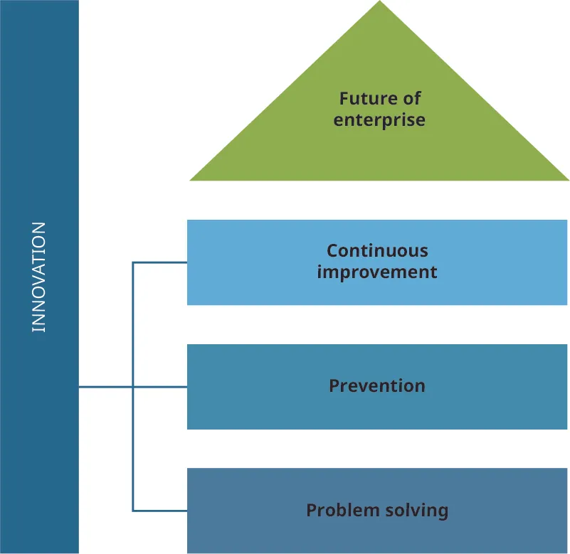
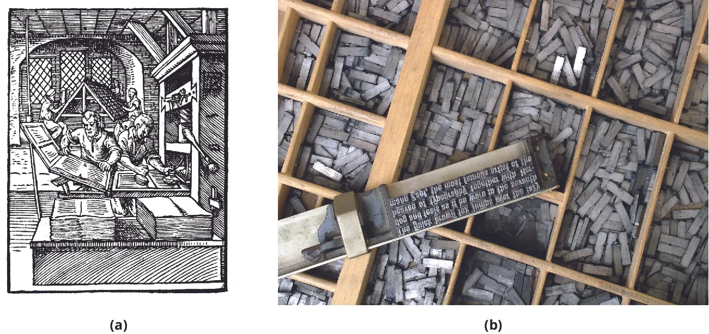
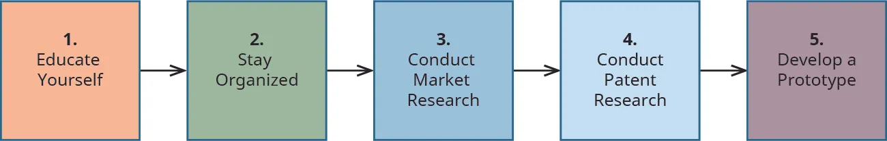

## 4.3 Phát triển Ý tưởng, Đổi mới và Phát minh

> **🎯 Mục tiêu học tập**
>
> Đến cuối phần này, bạn sẽ có thể:
>
> - Mô tả và áp dụng năm giai đoạn của sự sáng tạo
> - Thảo luận về đổi mới như một hệ thống để giải quyết vấn đề và nhiều hơn thế nữa
> - Phác thảo chuỗi các bước trong việc phát triển một phát minh

Phần trước đã định nghĩa sự sáng tạo, đổi mới và phát minh, đồng thời cung cấp các ví dụ. Bạn có thể nghĩ về sự sáng tạo như một dạng nguyên bản; đổi mới là sự chuyển hóa sức sáng tạo thành một mục đích chức năng, thường nhằm mục tiêu loại bỏ một điểm đau (vấn đề của khách hàng) hoặc đáp ứng một nhu cầu; và phát minh là một sự sáng tạo để lại tác động lâu dài. Trong phần này, bạn sẽ tìm hiểu về các quy trình được thiết kế để giúp bạn áp dụng kiến thức từ phần trước.

### Quy trình Sáng tạo: Năm giai đoạn của sự sáng tạo

Sự sáng tạo nguyên bản và khả năng tư duy phi tuyến có thể là bẩm sinh, nhưng những người sáng tạo phải rèn giũa các kỹ năng này để trở thành bậc thầy trong các lĩnh vực tương ứng của họ. Họ thực hành nhằm áp dụng các kỹ năng của mình một cách sẵn sàng và nhất quán, đồng thời tích hợp chúng với các quá trình tư duy và cảm xúc khác. Bất kỳ ai cũng có thể cải thiện nỗ lực sáng tạo thông qua thực hành. Đối với các mục tiêu của chúng ta, thực hành là một mô hình cho sự sáng tạo ứng dụng được rút ra từ cách tiếp cận khởi nghiệp ([Hình 4.11](4-3-developing-ideas-innovations-and-inventions#OSX_Eship_04_02_FiveStages)).[^34] Điều này đòi hỏi:

1. Sự chuẩn bị
2. Sự ấp ủ
3. Sự thông suốt
4. Sự đánh giá
5. Sự chi tiết hóa

*Hình 4.11: Đây là năm giai đoạn của sự sáng tạo, theo Graham Wallas trong tác phẩm *Nghệ thuật Tư duy* (The Art of Thought).[^35] (Nguồn: Bản quyền thuộc Đại học Rice, OpenStax, theo giấy phép CC BY NC-SA 4.0)*

#### Sự chuẩn bị

***Sự chuẩn bị*** bao gồm việc nghiên cứu một lĩnh vực quan tâm đã chọn, mở rộng tâm trí và đắm mình vào các tài liệu, tư duy và ý nghĩa. Nếu bạn đã từng cố gắng tạo ra thứ gì đó sáng tạo mà không tiếp thu thông tin liên quan trước đó và quan sát các chuyên gia lành nghề làm việc, bạn sẽ hiểu điều đó khó khăn như thế nào. Nền tảng kiến thức và kinh nghiệm này, khi được kết hợp với khả năng tích hợp các suy nghĩ và thực hành mới, có thể giúp bạn sàng lọc các ý tưởng nhanh hơn. Tuy nhiên, việc phụ thuộc quá nhiều vào kiến thức đã có từ trước có thể hạn chế quy trình sáng tạo. Khi đắm mình vào một hoạt động sáng tạo, bạn đang sử dụng các sản phẩm hoặc tài liệu từ sự sáng tạo của người khác. Ví dụ, một nhà thiết kế trò chơi điện tử chơi nhiều loại trò chơi khác nhau trên các hệ máy chơi game, máy tính và mạng trực tuyến khác nhau. Họ có thể chơi một mình, cộng tác với bạn bè hoặc cạnh tranh. Việc trải nghiệm các sản phẩm trong một lĩnh vực giúp bạn hiểu được những gì khả thi và chỉ ra các ranh giới mà bạn có thể cố gắng vượt qua bằng tác phẩm sáng tạo của riêng mình. Sự chuẩn bị giúp mở rộng tâm trí của bạn và cho phép bạn nghiên cứu các sản phẩm, thực hành và văn hóa trong một lĩnh vực. Đây cũng là thời điểm để thiết lập mục tiêu. Cho dù lĩnh vực bạn chọn có liên quan trực tiếp đến nghệ thuật và thiết kế, chẳng hạn như xuất bản, hay liên quan đến thiết kế lấy con người làm trung tâm (bao gồm tất cả các nỗ lực thiết kế phần mềm và sản phẩm), bạn vẫn cần một giai đoạn tiếp thu ý tưởng với tâm thế cởi mở. Thực hành lặp đi lặp lại cũng là một phần của giai đoạn chuẩn bị, để bạn có thể hiểu rõ lĩnh vực sản xuất hiện tại và nhận thức được các thực hành tốt nhất, cho dù bạn có khả năng đáp ứng chúng vào lúc này hay không. Trong giai đoạn chuẩn bị, bạn có thể bắt đầu thấy cách những người sáng tạo khác truyền tải ý nghĩa vào sản phẩm của họ và bạn có thể thiết lập các mốc đối sánh chuẩn để đo lường tác phẩm sáng tạo của riêng mình.

#### Sự ấp ủ

***Sự ấp ủ*** đề cập đến việc dành cho bản thân, và đặc biệt là tâm trí tiềm thức của bạn, thời gian để tích hợp những gì bạn đã học và thực hành trong giai đoạn chuẩn bị. Sự ấp ủ liên quan đến việc tạm ngưng thực hành. Đối với một người bên ngoài, có vẻ như bạn đang nghỉ ngơi, nhưng tâm trí bạn thực chất đang hoạt động. Thay đổi môi trường là chìa khóa để ấp ủ các ý tưởng.[^36] Môi trường mới cho phép bạn tiếp nhận các kích thích khác ngoài những kích thích liên quan trực tiếp đến vấn đề sáng tạo mà bạn đang giải quyết. Nó có thể đơn giản như việc đi dạo hoặc đến một quán cà phê mới để tâm trí bạn lang thang và tiếp nhận thông tin bạn đã thu thập được ở giai đoạn trước. **Mozart** từng chia sẻ: “Khi tôi, có thể nói là, hoàn toàn là chính mình, hoàn toàn cô độc và có tâm trạng vui vẻ—chẳng hạn như khi đang đi trên một chiếc xe ngựa, hoặc đi bộ sau một bữa ăn ngon, hoặc trong đêm khi tôi không thể ngủ; chính vào những dịp như vậy, các ý tưởng của tôi tuôn trào tốt nhất và dồi dào nhất.”[^37] Sự ấp ủ cho phép tâm trí bạn tích hợp vấn đề sáng tạo với những ký ức được lưu trữ và các suy nghĩ hoặc cảm xúc khác mà bạn có thể có. Điều này đơn giản là không thể thực hiện được khi bạn đang tập trung một cách có ý thức vào vấn đề sáng tạo cùng các nhiệm vụ và thực hành liên quan.

Sự ấp ủ có thể mất một khoảng thời gian ngắn hoặc dài, và bạn có thể thực hiện các hoạt động khác trong khi để quy trình này diễn ra. Một lý thuyết về sự ấp ủ là nó loại bỏ ngôn ngữ ra khỏi quá trình tư duy. Nếu bạn không cố gắng dùng từ ngữ để diễn tả các vấn đề và mối quan tâm sáng tạo của mình, bạn có thể giải phóng tâm trí để tạo ra các mối liên kết sâu sắc hơn cả ngôn ngữ.[^38] Việc kiên nhẫn chờ đợi sự ấp ủ mang lại kết quả là điều khá khó khăn. Nhiều người sáng tạo và đổi mới phát triển các sở thích liên quan đến hoạt động thể chất để giữ cho tâm trí bận rộn trong khi cho phép các ý tưởng được ấp ủ.

#### Sự thông suốt

***Sự thông suốt*** hay “sự khai sáng” là thuật ngữ chỉ khoảnh khắc “aha!”—khi giải pháp cho một vấn đề sáng tạo đột nhiên trở nên dễ dàng tiếp cận đối với tâm trí có ý thức của bạn. Khoảnh khắc “aha!” đã được quan sát thấy trong văn học, lịch sử và các nghiên cứu nhận thức về sự sáng tạo.[^39] Sự thông suốt có thể đến cùng một lúc hoặc theo từng bước gia tăng. Chúng không dễ hiểu bởi vì, do chính bản chất của mình, chúng rất khó bị tách biệt trong các môi trường nghiên cứu và thử nghiệm. Tuy nhiên, đối với nhà khởi nghiệp sáng tạo, sự thông suốt là một niềm vui sướng. Sự thông suốt là khoảng thời gian thoáng qua khi sự chuẩn bị, thực hành và giai đoạn ấp ủ của bạn kết hợp lại thành một khoảnh khắc thiên tài. Cho dù sự khai sáng đó là giải pháp cho một vấn đề dường như bất khả thi hay việc tạo ra một giai điệu hoặc cách diễn đạt đặc biệt thông minh, những người sáng tạo thường coi đó là một điểm nhấn trong cuộc đời họ. Đối với một nhà khởi nghiệp, một sự thông suốt mang lại lời hứa về thành công và tiềm năng giúp số lượng lớn người vượt qua một điểm đau hoặc vấn đề. Không phải mọi sự thông suốt đều có tác động toàn cầu, nhưng việc tìm ra giải pháp mà tâm trí tiềm thức của bạn đã nỗ lực làm việc trong một thời gian dài là một niềm vui thực sự.

#### Sự đánh giá

***Sự đánh giá*** là việc xem xét các ý tưởng một cách có mục đích. Bạn sẽ muốn so sánh các sự thông suốt của mình với các sản phẩm và ý tưởng mà bạn đã gặp trong quá trình chuẩn bị. Bạn cũng sẽ muốn so sánh các ý tưởng và nguyên mẫu sản phẩm của mình với các mục tiêu bạn đã đề ra cho bản thân trong giai đoạn chuẩn bị. Các chuyên gia sáng tạo thường sẽ mời những người khác đánh giá tác phẩm của họ ở giai đoạn này. Bởi vì sự đánh giá mang tính đặc thù đối với các kỳ vọng, thực hành tốt nhất và các sản phẩm dẫn đầu hiện có trong từng lĩnh vực, nên sự đánh giá có thể có nhiều hình thức. Bạn đang tìm kiếm sự đảm bảo rằng các tiêu chuẩn đánh giá của mình là phù hợp. Hãy đánh giá bản thân một cách công bằng, ngay cả khi bạn áp dụng các tiêu chí nghiêm ngặt và khiếu thẩm mỹ phát triển tốt mà bạn đã tích lũy được trong giai đoạn chuẩn bị. Ví dụ, bạn có thể chọn phỏng vấn một vài khách hàng trong nhóm nhân khẩu học mục tiêu cho sản phẩm hoặc dịch vụ của mình. Mục tiêu chính là hiểu được quan điểm của khách hàng và mức độ liên kết giữa ý tưởng của bạn với vị thế của họ.

#### Sự chi tiết hóa

Giai đoạn cuối cùng trong quy trình sáng tạo là sự chi tiết hóa, tức là sản xuất thực tế. Sự chi tiết hóa có thể liên quan đến việc ra mắt một **sản phẩm khả thi tối thiểu (MVP)**. Phiên bản phát minh này của bạn có thể chưa được chau chuốt hoặc hoàn thiện theo cách bạn hình dung, nhưng nó phải hoạt động đủ tốt để bạn có thể bắt đầu tiếp thị trong khi vẫn tiếp tục hoàn thiện nó trong quy trình phát triển lặp. Sự chi tiết hóa cũng có thể bao gồm việc phát triển và ra mắt một nguyên mẫu, phát hành phiên bản phần mềm beta hoặc sản xuất một tác phẩm nghệ thuật nào đó để bán. Nhiều công ty sản phẩm tiêu dùng, chẳng hạn như **Johnson & Johnson** hoặc **Procter & Gamble**, sẽ thiết lập một thị trường thử nghiệm nhỏ để thu thập phản hồi và đánh giá về các sản phẩm mới từ khách hàng thực tế. Những phản hồi này có thể cung cấp cho công ty thông tin giá trị giúp sản phẩm hoặc dịch vụ đạt thành công lớn nhất có thể.

Ở giai đoạn này, điều quan trọng nhất trong quy trình sáng tạo khởi nghiệp là tác phẩm phải được đưa ra công chúng để họ có cơ hội đón nhận nó.

> **🔗 Liên kết học tập**
>
> Thử nghiệm thị trường có thể tiết lộ nhiều thông tin về người dùng tiềm năng của sản phẩm. Hãy truy cập [trang web Drive Research về thử nghiệm thị trường](https://openstax.org/l/52TestMarkets) để biết thêm thông tin.

### Đổi mới không chỉ dừng lại ở việc giải quyết vấn đề

Các nhà khởi nghiệp đổi mới sáng tạo về cơ bản là những người giải quyết vấn đề, nhưng cấp độ đổi mới này—xác định một điểm đau (vấn đề của khách hàng) và nỗ lực khắc phục nó—chỉ là một trong một chuỗi các bước đổi mới. Trong ấn phẩm kinh doanh có tầm ảnh hưởng lớn *Forbes*, nhà khởi nghiệp Larry **Myler** lưu ý rằng việc giải quyết vấn đề vốn mang tính chất phản ứng.[^40] Nghĩa là, bạn phải đợi một vấn đề xảy ra mới nhận ra nhu cầu giải quyết vấn đề đó. Giải quyết vấn đề là một phần quan trọng trong thực hành đổi mới, nhưng để nâng cao năng lực thực hành và lĩnh vực này, các nhà đổi mới nên dự báo trước các vấn đề và nỗ lực ngăn chặn them. Trong nhiều trường hợp, họ tạo ra các hệ thống để cải tiến liên tục, điều mà Myler lưu ý có thể liên quan đến việc “phá vỡ” các hệ thống cũ vốn dường như đang hoạt động hoàn toàn tốt. Nỗ lực cải tiến liên tục giúp các nhà đổi mới đi trước những thay đổi của thị trường. Nhờ đó, họ có sẵn sản phẩm cho các thị trường mới nổi, thay vị phát triển các dự án đuổi theo sự thay đổi, điều vốn xảy ra liên tục trong một số lĩnh vực định hướng công nghệ. Một vấn đề đối với việc xây dựng hệ thống cải tiến liên tục là về bản chất bạn đang tạo ra vấn đề để giải quyết chúng, điều vốn đi ngược lại văn hóa đã được thiết lập ở nhiều công ty. Các nhà đổi mới tìm kiếm các tổ chức có thể xử lý việc đổi mới có chủ đích, hoặc họ cố gắng tự thành lập chúng. Một số nhà đổi mới thậm chí có mục tiêu đổi mới đi xa hơn vào tương lai, vượt qua các năng lực hiện tại. Để làm được điều này, Myler đề xuất tập hợp những người có nền tảng trải nghiệm khác nhau với chuyên môn khác nhau lại với nhau. Những mối quan hệ này không đảm bảo cho sự đổi mới thành công, nhưng những nhóm như vậy có thể tạo ra các ý tưởng độc lập với quán tính của tổ chức. Do đó, các nhà đổi mới là những người giải quyết vấn đề nhưng cũng có thể làm việc với các hình thức tạo ra vấn đề và tưởng tượng vấn đề. Họ giải quyết những vấn đề chưa từng tồn tại để giải quyết chúng trước thời hạn.

Hãy cùng xem xét một cách tiếp cận đa cấp độ đối với đổi mới ([Hình 4.12](4-3-developing-ideas-innovations-and-inventions#OSX_Eship_04_02_InnovPyr)). Phần đế của kim tự tháp là giải quyết vấn đề. Cấp độ tiếp theo phía trên, có thể nói, là sự ngăn ngừa. Cấp độ tiếp theo là hướng tới cải tiến liên tục, và ở đỉnh cao của những nỗ lực đó là tạo ra năng lực dẫn dắt tương lai của ngành công nghiệp của bạn hoặc nhiều ngành công nghiệp khác để bạn có thể vượt qua sự đột phá trong sự nghiệp hoặc thậm chí tự mình tạo ra sự đột phá đó.

*Hình 4.12: Kim tự tháp đổi mới là một cách tiếp cận đa cấp độ đối với sự đổi mới. (Nguồn: Bản quyền thuộc Đại học Rice, OpenStax, theo giấy phép CC BY NC-SA 4.0)*

Ngay cả khi bạn không quan tâm đến việc định hình tương lai của toàn bộ các ngành công nghiệp, phát triển các hoạt động đổi mới tập trung vào tương lai vẫn là một ý tưởng hay. Nó sẽ giúp bạn chuẩn bị cho sự đột phá. Tốc độ thay đổi công nghệ nhanh chóng đến mức người lao động ở mọi cấp độ đều cần chuẩn bị sẵn sàng để đổi mới. Các nhà lãnh đạo đổi mới, chẳng hạn như chuyên gia tiếp thị Guy **Kawasaki**, đã dựa trên các nguyên lý tâm lý học để đề xuất những cách tiếp cận đổi mới mới. Theo Kawasaki, các sản phẩm đổi mới bao gồm năm phẩm chất chính: sâu sắc (deep), trải nghiệm phong phú (indulgent), hoàn thiện (complete), tinh tế (elegant) và khơi gợi cảm xúc (emotive)—**DICEE** ([Hình 4.13](4-3-developing-ideas-innovations-and-inventions#OSX_Eship_04_03_DICEE)).[^41] Bạn có thể nỗ lực truyền tải những phẩm chất này vào từng hoạt động đổi mới cụ thể theo những cách thiết thực.

*Hình 4.13: Sản phẩm đổi mới mang tính sâu sắc, trải nghiệm phong phú, hoàn thiện, tinh tế và khơi gợi cảm xúc. (Nguồn: Bản quyền thuộc Đại học Rice, OpenStax, theo giấy phép CC BY NC-SA 4.0)*

#### Sâu sắc (Deep)

Các sản phẩm *sâu sắc* dựa trên tư duy đổi mới mà chúng ta vừa thiết lập và dự đoán trước nhu cầu của người dùng trước khi họ nhận ra chúng. Những loại hình đổi mới này thường có thiết kế bậc thầy, mang tính trực quan cho người dùng mới nhưng vẫn có khả năng hoàn thành các tác vụ phức tạp. **Adobe** là một tập đoàn đổi mới hoạt động trong nhiều lĩnh vực như phần mềm, tiếp thị và trí tuệ nhân tạo. Adobe thường tạo ra các ứng dụng phần mềm với các chức năng cơ bản dễ dàng tiếp cận cho người dùng mới, nhưng cũng cho phép những người dùng có kinh nghiệm tự đổi mới sáng tạo.[^42] Tạo ra một nền tảng cho sự đổi mới là dấu ấn của sự đổi mới sâu sắc, hướng tới tương lai.

#### Trải nghiệm phong phú (Indulgent)

Những đổi mới có sức sống bền bỉ thu hút người dùng theo những cách khiến họ cảm thấy đặc biệt khi mua sản phẩm hoặc khi tìm thấy dịch vụ đó. *Trải nghiệm phong phú* đề cập đến chiều sâu chất lượng vốn không chỉ đến từ việc là giải pháp nhanh nhất cho một vấn đề. Khái niệm này nghe có vẻ mang hàm ý không tốt. Ở con người, nó chắc chắn có thể như vậy, nhưng đối với một người đang sử dụng sản phẩm đổi mới, cảm giác tận hưởng trải nghiệm phong phú có thể liên quan đến sự phong phú trong trải nghiệm với **giao diện người dùng** (UI). UI của một sản phẩm, đặc biệt là sản phẩm phần mềm, là những gì người dùng nhìn thấy và tương tác. Cảm giác tận hưởng này truyền tải vào sản phẩm của bạn một cảm nhận về giá trị và độ bền, giúp trấn an người dùng và khuyến khích họ sử dụng sản phẩm của bạn một cách tự tin.

#### Hoàn thiện (Complete)

Tầm nhìn của Kawasaki về một sản phẩm *hoàn thiện* bao gồm các dịch vụ xung quanh và bên dưới nó, sao cho người dùng hiểu rõ sản phẩm để thoải mái sử dụng. Thông tin về cách thức hoạt động và cách vận hành dự kiến của sản phẩm luôn có sẵn. Do đó, đổi mới sản phẩm phải bao gồm cả các nỗ lực tiếp thị và truyền thông khác. Đối với Kawasaki, điều này xây dựng nên “**trải nghiệm toàn diện cho người dùng**.”[^43] Nếu bạn thực sự đã giải quyết được một vấn đề trên thị trường, người dùng sẽ hiểu vấn đề đó là gì và sản phẩm cùng dịch vụ liên quan của bạn đáp ứng điều đó ra sao.

#### Tinh tế (Elegant)

Tính *tinh tế* cũng là một phần trong UI của sản phẩm. Nó đề cập đến thiết kế trực quan ngay lập tức mang lại ý nghĩa cho người tiêu dùng. Sự tinh tế truyền tải nhiều thông tin hơn với ít từ ngữ hơn. Thiết kế tinh tế không e ngại các khoảng trống (negative space) hay những điểm tạm dừng đôi lúc. Những đổi mới tinh tế giải quyết vấn đề mà không tạo ra các vấn đề mới. Đối với Kawasaki, sự tinh tế là sự khác biệt giữa một đổi mới thực tế, tốt và một sản phẩm thực sự tuyệt vời.

#### Khơi gợi cảm xúc (Emotive)

Các đổi mới *khơi gợi cảm xúc* gợi lên cảm xúc mong muốn và đòi hỏi được ngưỡng mộ cũng như chia sẻ. Nói cách khác, những đổi mới thực sự tuyệt vời tạo ra các cộng đồng người hâm mộ trung thành (fandoms), chứ không chỉ là tệp khách hàng tiêu dùng. Bạn không thể ép buộc mọi người yêu thích sản phẩm của mình, nhưng bạn có thể mang lại cho họ những trải nghiệm tạo ra cảm giác hào hứng và mong đợi những gì bạn có thể sáng tạo ra tiếp theo.

### Phát triển một phát minh

Quy trình phát minh nói chung bao gồm các bước thực tế và có hệ thống, có thể kết hợp cả tư duy tuyến tính và phi tuyến tính. Bạn có thể nghĩ rằng chỉ những người có năng khiếu nghệ thuật bẩm sinh mới có khả năng sáng tạo và chỉ những thiên tài mới trở thành nhà đổi mới và nhà phát minh, nhưng phần lớn sự sáng tạo được thúc đẩy bởi việc đắm mình vào thực tế công việc. Bạn có thể xây dựng và nuôi dưỡng năng lực sáng tạo của riêng mình. Hình ảnh của bạn về một nhà phát minh có thể là một người như Johannes **Gutenberg**, người đã phát triển máy in. Sự lan rộng của ngành in cuối cùng đã vẽ lại bản đồ châu Âu và dẫn đến sự thành lập của các trung tâm học thuật mới. Tia sáng phát kiến được cho là của Gutenberg trên thực tế là cả một quá trình âm ỉ lâu dài. Ông có tính sáng tạo và đổi mới—một trong những nhà phát minh nổi tiếng nhất lịch sử—nhưng máy in của ông, giống như tất cả các phát minh khác, là sự tổng hợp từ các công nghệ sẵn có. Đổi mới quan trọng nhất của Gutenberg là việc sử dụng các con chữ bằng kim loại có thể di chuyển và thay đổi được thay vì toàn bộ các khối văn bản bằng gỗ được khắc thủ công ([Hình 4.14](4-3-developing-ideas-innovations-and-inventions#OSX_Eship_04_04_Gutenberg)). Việc hoàn thiện quy trình in ấn của ông đã mất nhiều thập kỷ và khiến ông gần như phá sản hoàn toàn.[^44] Quan niệm về một khoảnh khắc thiên tài duy nhất của nhà phát minh hầu như chỉ là huyền thoại. Những người được lịch sử ghi nhớ thường đã làm việc cực kỳ chăm chỉ để phát triển năng lực sáng tạo của mình, làm quen với các quy trình và công cụ đã chín muồi cho sự đổi mới trong thời đại của họ, và cuối cùng tạo ra thứ gì đó độc đáo đến mức xã hội công nhận nó là một phát minh.

*Hình 4.14: Phát minh ra hệ thống chữ di động của Gutenberg là một đổi mới quan trọng trong ngành in ấn. (Nguồn ảnh (a): sửa đổi từ tác phẩm “Printer in 1568-ce” của “Parhamr”/Wikimedia Commons, Miền công cộng; nguồn ảnh (b): sửa đổi từ tác phẩm “Metal movable type” của Willi Heidelbach/Wikimedia Commons, giấy phép CC BY 2.5)*

Câu ngạn ngữ cổ tuyên bố rằng “cái khó ló cái khôn” (necessity is the mother of invention), nhưng một nhà đổi mới cần có kinh nghiệm trong lĩnh vực, nỗ lực sáng tạo và kiến thức để trở thành một nhà phát minh thành công. Khởi nghiệp có nghĩa là tận dụng những nỗ lực và kiến thức của bạn, đồng thời tìm kiếm một thị trường nơi phát minh của bạn trước tiên có thể tồn tại, sau đó là phát triển mạnh mẽ.

Một mô hình để phát triển một phát minh là năm bước đầu tiên của kế hoạch được phỏng theo **Sourcify.com**, một đơn vị chuyên kết nối các nhà phát triển sản phẩm với các nhà sản xuất.[^45] Quy trình này rất ngắn gọn và bao gồm các gợi ý để xây dựng một đội ngũ trong suốt quá trình ([Hình 4.15](4-3-developing-ideas-innovations-and-inventions#OSX_Eship_04_05_Sourcify)).

*Hình 4.15: Đây là năm bước để phát triển một phát minh, theo Sourcify. (Nguồn: Bản quyền thuộc Đại học Rice, OpenStax, theo giấy phép CC BY NC-SA 4.0)*

#### Bước 1: Tự giáo dục bản thân

Trước khi sản phẩm phát minh của bạn có thể cạnh tranh với các phát minh khác, bạn sẽ cần phải tự trang bị kiến thức cho mình. Để chuẩn bị bản thân trước sự cạnh tranh, bạn cần tìm hiểu càng nhiều càng tốt về môi trường đầu tư hiện tại, các cơ hội phát triển sản phẩm hiện tại và các phương pháp tiếp cận lãnh đạo hiện nay. Ngay cả khi bạn không mấy hứng thú với các học thuyết lãnh đạo, việc nắm rõ các xu hướng hiện tại trong quản trị lãnh đạo và phát triển sản phẩm vẫn rất hữu ích. Để thành công với tư cách là một nhà phát minh trong một thị trường rộng lớn, bạn cần hiểu các quy tắc, cả thành văn và bất thành văn, của ngành và bối cảnh cạnh tranh. Quy trình phát triển sản phẩm có thể khá phức tạp và có sự khác nhau tùy theo ngành công nghiệp và sự sẵn có của các nguồn lực.

Một phần của việc tự giáo dục bản thân là hiểu rõ những điểm mạnh và điểm yếu của chính bạn, và cách chúng liên quan đến phong cách lãnh đạo của bạn. Một bài trắc nghiệm đánh giá phong cách lãnh đạo (leadership style inventory) có thể giúp bạn hiểu rõ hơn cách tiếp cận của mình trong việc dẫn dắt người khác. Đây chỉ là một ví dụ trong số nhiều công cụ sẵn có giúp bạn có một điểm khởi đầu. Với tư cách là nhà phát minh ra sản phẩm hoặc dịch vụ của mình, bạn sẽ quản lý/lãnh đạo người khác khi bạn cố gắng biến ý tưởng của mình thành hiện thực. Ngoài ra, môi trường có thể thay đổi liên tục. Vì lý do này, việc hiểu rõ các nguyên tắc cơ bản của lãnh đạo và quản lý trong một bầu không khí làm việc năng động là rất quan trọng. Rất nhiều nguồn tài nguyên sẽ cung cấp cho bạn cái nhìn sâu sắc về những thách thức trong quản lý.

> **🔗 Liên kết học tập**
>
> Một bài trắc nghiệm đánh giá phong cách lãnh đạo có thể giúp bạn hiểu phong cách lãnh đạo của mình và cách điều chỉnh phong cách của riêng bạn cho phù hợp với các tình huống và con người khác nhau.

Một bước then chốt khác trong việc tự trang bị kiến thức là tìm ra loại hình cộng sự nào bạn sẽ cần để xây dựng một đội ngũ khởi nghiệp thành công. Xây dựng đội ngũ là điều cần thiết để biến phát minh của bạn thành hiện thực. Ngay cả những người phát minh độc lập—vốn rất hiếm gặp—cũng phải có một nhóm phát triển, nhóm sản xuất và/hoặc dịch vụ, nhóm tiếp thị và các thành viên khác có bộ kỹ năng chuyên biệt như lập trình viên, nhà thiết kế đồ họa, người thử nghiệm thị trường, v.v.

#### Bước 2: Giữ ngăn nắp và có tổ chức

Hầu hết các tài liệu hướng dẫn dành cho nhà phát minh đều khuyên bạn nên tìm một phương pháp để tổ chức sự sáng tạo của mình để không lãng phí thời gian cố gắng nhớ lại các ý tưởng, kế hoạch và quyết định trước đó. Bạn phải sắp xếp thông tin liên quan đến ý tưởng kinh doanh, kế hoạch kinh doanh và các đồng đội tiềm năng của mình trong suốt quá trình đó.

Phần mềm quản lý danh bạ đã phổ biến trong nhiều thập kỷ qua. Ngày nay, bạn có thể tìm hiểu thêm nhiều công cụ hỗ trợ năng suất và trò chuyện nhóm khác. Hãy nghiên cứu các phương pháp tổ chức thông tin về những người bạn dự định làm việc cùng và hy vọng sẽ phục vụ. Chương trình trò chuyện nhóm **Slack** (www.slack.com) cho phép bạn tạo các chủ đề cụ thể để các thành viên trong nhóm thảo luận và cộng tác. Slack cung cấp một số tính năng giúp duy trì sự kết nối giữa các nhân viên. **Insightly** (www.insightly.com) là một công cụ quản lý mối quan hệ khách hàng (CRM) để duy trì kết nối tốt hơn với khách hàng của bạn. **Ryver** và **Glip** tích hợp thêm tính năng quản lý công việc. **Flock** và **Microsoft Teams** cung cấp nhiều tính năng hữu ích, trong đó **Microsoft** tận dụng vị thế tập đoàn của mình để triển khai ứng dụng tại hơn 200.000 tổ chức. Hãy chọn bộ công cụ phù hợp nhất với bạn và cân nhắc trả phí cho phần mềm cung cấp chính xác các tính năng truyền thông nhóm và tiện ích bạn cần.[^46]

#### Bước 3: Tiến hành nghiên cứu thị trường

Nghiên cứu thị trường là điều bắt buộc rõ ràng, nhưng nhiều nhà khởi nghiệp đã thất bại trong việc nghiên cứu sâu sắc về đối thủ cạnh tranh của họ. Bạn phải nhận thức được các đối thủ cạnh tranh hiện tại và tương lai để sẵn sàng cạnh tranh trên thị trường khi bạn thực sự chuẩn bị xong. Việc trở nên xuất sắc nhất trên giấy tờ lúc này sẽ không có nhiều tác dụng khi bạn gia nhập thị trường với một MVP sau sáu đến tám tháng nữa và phải cạnh tranh với các sản phẩm mới cũng như các bản cập nhật của đối thủ cạnh tranh.

Bạn nên cân nhắc điều gì liên quan đến việc phát triển đội ngũ khi xem xét đối thủ cạnh tranh? Trong giới hạn pháp lý của bất kỳ điều khoản không cạnh tranh nào, bạn nên tìm kiếm các thành viên tiềm năng cho đội ngũ của mình từ chính đối thủ cạnh tranh. Những nhà lãnh đạo giỏi nhất luôn tìm kiếm những người tài năng. Nếu bạn cảm thấy ai đó sẽ là một mảnh ghép phù hợp cho đội ngũ của mình—người không chỉ có bộ kỹ năng mà còn có tính khí giúp đưa phát minh của bạn ra thị trường—đừng ngần ngại tiếp cận họ. Cách bạn tiếp cận là điều bạn phải nghiên cứu kỹ đối với từng ngành công nghiệp. Trong một số lĩnh vực, bạn sẽ phải cực kỳ bảo mật. Một phần của nghiên cứu thị trường là hiểu rõ thị trường để nhận diện các kỹ năng mềm cần thiết nhằm tìm kiếm những cộng sự đang làm việc trong ngành hoặc trong một ngành lân cận.

#### Bước 4: Tiến hành nghiên cứu bằng sáng chế

Nếu bạn dự định nộp đơn xin cấp **bằng sáng chế**, hãy dành thời gian đọc kỹ các chính sách và quy trình. Các quan chức tại Văn phòng Sáng chế Hoa Kỳ, hoặc tại các văn phòng tương tự ở các quốc gia khác, sẽ quyết định xem một phát minh có xứng đáng được cấp bằng sáng chế hay không. Một phát minh có thể được cấp bằng sáng chế phải đáp ứng các tiêu chí là mới (novel), hữu ích (useful) và không hiển nhiên (nonobvious); nó phải được chứng minh là có khả năng hoạt động.[^47] Ba tiêu chuẩn đó—mới, hữu ích và không hiển nhiên—mang tính chủ quan. Khái niệm về phát minh cũng vậy, nhưng việc khái niệm hóa phát minh theo cách này đặt ra một tiêu chuẩn cao cho các nhà khởi nghiệp thực sự mong muốn tạo ra tác động xã hội. Phát triển một phát minh có thể được cấp bằng sáng chế cũng tạo ra một rào cản chống lại sự cạnh tranh, điều có thể tạo nên sự khác biệt giữa thành công và thất bại trong kinh doanh. Có hai loại bằng sáng chế. Bằng sáng chế **tiện ích** có hiệu lực trong hai mươi năm, và bằng sáng chế **kiểu dáng** thường có hiệu lực trong mười bốn năm. Nếu bằng sáng chế được cấp, nhà phát minh sẽ có một khoảng thời gian để đảm bảo nguồn vốn tiếp theo, nỗ lực sản xuất sản phẩm và cố gắng đạt được sự chấp nhận của thị trường đại chúng.[^48] Sau tất cả, bạn có thể áp dụng sự sáng tạo của mình vào các đổi mới xã hội, đổi mới sản phẩm hoặc đổi mới dịch vụ. Nếu bạn có thể kết hợp đủ các đổi mới, thêm vào sự sáng tạo độc đáo của riêng mình và tạo ra thứ gì đó vượt qua **khoảng cách khuếch tán**, bạn thực sự có thể phát minh ra một điều gì đó mới mẻ.

Trang thông tin cơ bản về bằng sáng chế trên trang web của Văn phòng Sáng chế và Nhãn hiệu Hoa Kỳ dài khoảng bốn mươi trang.[^49] Quy trình cấp bằng sáng chế tiện ích bao gồm một sơ đồ quy trình mười ba bước[^50] phác thảo toàn bộ tiến trình. Văn phòng bằng sáng chế khuyến khích bạn sử dụng một luật sư hoặc đại diện bằng sáng chế đã đăng ký hành nghề. Nếu bạn có đủ kỹ năng và sự siêng năng để giành được bằng sáng chế, bạn nên chuẩn bị tinh thần trả các khoản phí và nộp giấy tờ để duy trì nó trong nhiều năm sau khi được cấp. Chúng ta đã thảo luận về các chìa khóa để đảm bảo có được bằng sáng chế, nhưng để nhắc lại, đây là cách một phát minh được định nghĩa trong luật bằng sáng chế Hoa Kỳ: “Theo ngôn ngữ của đạo luật, bất kỳ ai ‘phát minh hoặc khám phá ra bất kỳ quy trình, máy móc, sản phẩm sản xuất hoặc hợp phần vật chất nào mới và hữu ích, hoặc bất kỳ cải tiến mới và hữu ích nào của chúng, đều có thể được cấp bằng sáng chế,’ tùy thuộc vào các điều kiện và yêu cầu của luật pháp.”[^51]

Khi xây dựng một đội ngũ để biến phát minh của bạn thành hiện thực, việc tìm kiếm một luật sư hoặc đại diện bằng sáng chế là chìa khóa then chốt. Ngay cả những người trước đây từng ủng hộ việc thuê luật sư bằng sáng chế thì nay cũng gợi ý rằng việc thuê một đại diện bằng sáng chế có thể mang lại hiệu quả. Sự khác biệt là gì? Các luật sư bằng sáng chế thường tính phí theo giờ, nhưng họ cung cấp một gói tư vấn pháp lý đầy đủ. Như tác giả Stephen **Key** chỉ ra, các đại diện bằng sáng chế chỉ tập trung hẹp vào việc giúp bạn có được và bảo vệ bằng sáng chế của mình.[^52] Hạn chế khác mà Key đề cập là các đại diện bằng sáng chế có thể viết một đơn xin cấp bằng sáng chế theo cách khiến bạn ít được chuẩn bị hơn để bảo vệ phát minh của mình trước các thách thức pháp lý trong tương lai. Key trích dẫn lời của Gene **Quinn**, một luật sư hàng đầu về tài sản trí tuệ và luật bằng sáng chế: “Vào thời điểm bạn nhận ra rằng mình đang nắm giữ một phát minh trị giá hàng triệu đô la, thì đã quá muộn để làm bất cứ điều gì về nó... Các đại diện bằng sáng chế theo quy tắc chung thường rất giỏi trong việc mô tả những gì bạn giới thiệu với tư cách là một nhà phát minh.” Điều họ thường kém hơn nhiều là mô tả những gì phát minh của bạn có thể trở thành. Họ cũng thường sử dụng các thuật ngữ mang tính cụ thể và giới hạn hơn so với một luật sư bằng sáng chế. Các luật sư được đào tạo nghệ thuật cực kỳ cụ thể (hyper-specific) khi cần thiết, nhưng cũng được đào tạo nghệ thuật diễn đạt bao quát và linh hoạt.”[^53] Bằng sáng chế không thể mơ hồ, nhưng chúng có thể được viết với mức độ cụ thể vừa đủ để bảo vệ chống lại các sản phẩm tương tự có thể xuất hiện và đe dọa thị phần của bạn.

#### Bước 5: Phát triển một nguyên mẫu

Phát triển một nguyên mẫu có thể là phần thú vị nhất hoặc tẻ nhạt nhất của việc phát minh. Phần lớn thái độ của bạn đối với việc phát triển một nguyên mẫu phụ thuộc vào các nguồn lực, công nghệ và chuyên môn sẵn có. Trong giáo trình này, chúng ta đôi khi sẽ tham khảo khái niệm về khởi nghiệp tinh gọn (lean startup). Trong mô hình khởi nghiệp tinh gọn, ***nguyên mẫu*** thường là một MVP. Như chúng ta đã thấy trước đây, một MVP là một phiên bản phát minh của bạn có thể chưa được chau chuốt hoặc hoàn thiện theo cách bạn hình dung, nhưng nó hoạt động đủ tốt và trông đủ đẹp để bạn có thể bắt đầu tiếp thị nó với hy vọng hợp lý rằng nó sẽ được chấp nhận. Đối với các phát minh khác, bạn có thể cần phải xây dựng một nguyên mẫu tiên tiến hơn. Điều này đòi hỏi nguồn vốn đầu tư đáng kể, nhưng bù lại người dùng sẽ được tương tác với một phiên bản sản phẩm có diện mạo và chức năng giống hơn với những gì bạn đã hình dung trong giai đoạn hình thành ý tưởng (ideation). Với tư cách là nhà phát minh, bạn có trách nhiệm thiết lập các tiêu chuẩn tối thiểu về kiểm soát chất lượng cho sản phẩm của mình. Bạn có thể phải thỏa hiệp về tầm nhìn của mình, nhưng bạn không nên thỏa hiệp về chức năng cơ bản hoặc các mức độ chất lượng cơ bản của vật liệu.

Bạn có nhiều lựa chọn ở giai đoạn phát triển nguyên mẫu. Bạn có thể tự xây dựng nguyên mẫu hoặc cùng với một đội ngũ nhỏ. Bạn có thể hợp tác với các công ty thiết kế/phát minh chuyên hỗ trợ các nhà phát minh sáng chế, nhưng bạn phải rất cẩn thận và có sự tham gia của đại diện pháp lý khi làm việc với các công ty đó để đảm bảo rằng bạn vẫn duy trì bằng sáng chế và các quyền khác đối với phát minh của mình. Nhiều nhà phát minh đã hợp tác với các công ty như vậy để rồi chứng kiến tài sản trí tuệ của mình bị đánh cắp. Một lựa chọn khác là nhận tài trợ cho phát minh của bạn trên **Kickstarter** hoặc một số trang web gọi vốn cộng đồng khác, nhưng một lần nữa bạn phải cẩn thận rằng việc thiết lập một chiến dịch như vậy sẽ đưa ý tưởng của bạn ra công chúng. “Những kẻ sao chép đang theo dõi các nền tảng gọi vốn cộng đồng như Kickstarter và chờ đợi các sản phẩm hợp xu hướng lan truyền mạnh mẽ,” theo Amedeo **Ferraro**, một luật sư về tài sản trí tuệ.[^54] Các công ty đối thủ, đặc biệt là ở thị trường nước ngoài, tích cực tìm kiếm trên Kickstarter và các nền tảng tương tự để tìm các ý tưởng mới mà họ có thể sản xuất và đưa ra thị trường trước khi dự án gọi vốn cộng đồng của bạn kết thúc hành trình. Có lẽ điều đáng lo ngại nhất là nhận xét này liên quan đến các biện pháp bảo vệ pháp lý không hoạt động, ngay cả khi các nhà phát minh thực hiện các biện pháp phòng ngừa để bảo vệ tài sản trí tuệ của họ khi làm việc với một số công ty Trung Quốc: “Nhưng ngay cả với những biện pháp bảo vệ này, không có gì đảm bảo rằng bạn có thể ngăn cản ai đó sao chép sản phẩm của mình. [Một luật sư về tài sản trí tuệ của Hoa Kỳ] cho biết vấn đề không nằm ở các tòa án của Trung Quốc mà là việc thực thi các phán quyết. Chiến thắng trong một vụ kiện chống lại một nhà máy là tương đối dễ dàng. Nhưng kiện mọi nhà máy và giành chiến thắng là một việc tốn kém và mất thời gian.”[^55] Vì lý do này, một số nhà phát minh thích bắt đầu từ quy mô nhỏ và tại địa phương nếu có thể. Đối với họ, bắt đầu với một đội ngũ đáng tin cậy hướng tới một khoản lợi nhuận nhỏ và vị thế thị trường tốt sẽ tốt hơn là nhìn thấy thị trường tràn ngập các sản phẩm sao chép.
