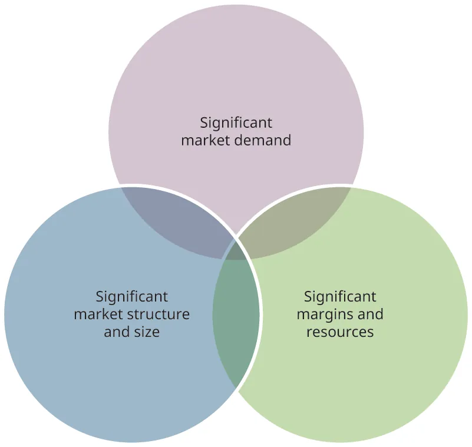
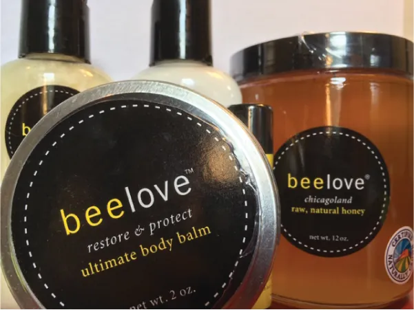

## 5.2   Nghiên cứu các cơ hội kinh doanh tiềm năng

> **🎯 Mục tiêu học tập**
>
> Đến cuối phần này, bạn sẽ có thể:
>
> - Mô tả việc sàng lọc cơ hội
> - Xác định các nguồn dữ liệu nghiên cứu phổ biến
> - Giải thích cách nghiên cứu và xác minh các cơ hội kinh doanh
> - Xác định các nguồn cơ hội từ ngành và từ người tiêu dùng

Để khám phá xem ý tưởng kinh doanh của bạn hợp lý đến mức nào, bạn cần nghiên cứu nhiều khía cạnh của khái niệm đó. **Sàng lọc cơ hội** là quá trình mà qua đó doanh nhân đánh giá các ý tưởng sản phẩm đổi mới, chiến lược và xu hướng tiếp thị. Bằng cách tập trung vào tính khả thi của nguồn lực tài chính, kỹ năng của đội ngũ khởi nghiệp và mức độ cạnh tranh, hoạt động sàng lọc này giúp xác định khả năng thành công khi theo đuổi ý tưởng và có thể giúp hoàn thiện quá trình lập kế hoạch.

### Các nguồn dữ liệu nghiên cứu phổ biến

Khi bắt đầu nghiên cứu xem ý tưởng của bạn có khả thi hay không, một điểm khởi đầu tốt là các nguồn do **Cơ quan Quản lý Doanh nghiệp Nhỏ Hoa Kỳ (US Small Business Administration)** khuyến nghị. Các nguồn này bao gồm dữ liệu **Cục Thống kê Dân số Hoa Kỳ (US Census)** ([https://www.census.gov/academy](https://www.census.gov/academy)), cung cấp thông tin chi tiết về dân số trong khu vực thị trường của bạn, chẳng hạn như dữ liệu khu vực thống kê đô thị, cũng như các số liệu về kinh tế và thương mại. Đối với hầu hết doanh nhân, nghiên cứu cũng sẽ bao gồm việc hỏi khách hàng tiềm năng, cụ thể là khách hàng mục tiêu của bạn, về những sản phẩm họ thích và không thích, cách một sản phẩm hoặc dịch vụ có thể được cải thiện, cách trải nghiệm mua hàng của khách hàng có thể được nâng cao, và thậm chí khách hàng có thể đến đâu để mua sản phẩm và dịch vụ thay vì đến doanh nghiệp của bạn.

Các nhà tiếp thị doanh nghiệp nhỏ có thể sử dụng nhiều phương pháp miễn phí hoặc chi phí thấp, bao gồm khảo sát, bảng câu hỏi, nhóm tập trung và phỏng vấn chuyên sâu. Tất nhiên, bạn không cần phải là chuyên gia trong các lĩnh vực này. Bạn có thể nhận được hỗ trợ kinh doanh từ Small Business Administration, **Lực lượng Chuyên gia hưu trí tình nguyện (SCORE)**, và trung tâm phát triển doanh nghiệp nhỏ tại địa phương. Bạn cũng có thể có một khoa kinh doanh của trường cao đẳng hoặc đại học tại địa phương cung cấp hỗ trợ cho các doanh nghiệp trong khu vực.

> **🔗 Liên kết học tập**
>
> [Trang web của Small Business Administration](https://openstax.org/l/52SBA2) và [trang web của SCORE](https://openstax.org/l/52SCORE2) là những nguồn thông tin phong phú dành cho doanh nhân.

Bạn rất có thể sẽ bắt đầu với **nghiên cứu thứ cấp**, tức là dữ liệu đã có sẵn thông qua một nguồn đã được công bố. Có thể có các bài báo, báo cáo nghiên cứu hoặc các nguồn Internet đáng tin cậy mà từ đó bạn có thể tìm hiểu thông tin về ngành, sản phẩm và khách hàng của mình. Nếu có kinh phí, bạn cũng có thể mua các báo cáo nghiên cứu từ những công ty chuyên thu thập nghiên cứu về những chủ đề hoặc sản phẩm nhất định. Ưu điểm của nghiên cứu thứ cấp là có thể tiếp cận nhanh chóng. Tuy nhiên, nghiên cứu thứ cấp thường không đủ cụ thể để cung cấp toàn bộ chi tiết bạn cần biết về ý tưởng của mình. Chẳng hạn, nghiên cứu thứ cấp (tức nghiên cứu được phát triển từ các nguồn sơ cấp và gần như hữu ích như nghiên cứu trực tiếp sơ cấp) có thể cho biết người tiêu dùng mua dầu gội thường xuyên như thế nào, họ mua ở đâu và họ mua nhãn hiệu nào. Nhưng nếu bạn muốn hiểu chi tiết về cách mọi người gội đầu, ví dụ họ gội rồi gội lại, dùng dầu xả riêng hay dùng sản phẩm kết hợp dầu gội/dầu xả, thì bạn sẽ cần tiến hành nghiên cứu sơ cấp. Nghiên cứu sơ cấp là cần thiết khi nghiên cứu thứ cấp không trả lời được những câu hỏi mà bạn muốn khám phá trong quá trình xem xét ý tưởng kinh doanh của mình.

**Nghiên cứu sơ cấp** thu thập dữ liệu chưa tồn tại trước đó. Thông tin thu được mang tính đặc thù đối với doanh nghiệp, sản phẩm hoặc người tiêu dùng. Việc có được dữ liệu sơ cấp đòi hỏi thời gian và tiền bạc. Một số phương pháp dùng để thu thập dữ liệu nghiên cứu sơ cấp bao gồm xây dựng bảng khảo sát, sử dụng khách hàng bí mật, hoặc tổ chức nhóm tập trung. Bảng khảo sát có thể đơn giản như một phiếu nhận xét của khách hàng kèm theo hóa đơn, hoặc rất chi tiết với hàng chục câu hỏi cụ thể. Khách hàng bí mật có thể được triển khai bằng cách thuê dịch vụ mua sắm bí mật hoặc nhờ bạn bè, thành viên gia đình và thậm chí cả khách hàng của bạn. Một chủ doanh nghiệp nhỏ tại địa phương đã tặng bạn mình phiếu quà tặng dùng tại cửa hàng kem của ông để đổi lấy việc người bạn đó phản hồi về chất lượng sản phẩm, dịch vụ và các vấn đề then chốt khác.

### Nghiên cứu và xác minh cơ hội khởi nghiệp

Dù bạn tự khởi sự doanh nghiệp, mua lại một doanh nghiệp hiện có hay mua một mô hình nhượng quyền, thì việc nghiên cứu ngành, thị trường mục tiêu và xem xét các lựa chọn kinh tế cũng như tài trợ đều là một phần của quá trình thẩm định chuyên sâu. **Thẩm định chuyên sâu (Due diligence)** là quá trình thực hiện các bước hợp lý để xác minh rằng các quyết định của bạn dựa trên thông tin đã được nghiên cứu kỹ lưỡng và chính xác. Điều đó có nghĩa là nghiên cứu sâu các hướng đi tiềm năng, đặt những câu hỏi chi tiết và kiểm chứng thông tin.

Các ngành khác nhau có cách hiểu khác nhau về thẩm định chuyên sâu. Ví dụ, trong lĩnh vực pháp lý, thẩm định chuyên sâu liên quan đến việc hiểu các điều khoản của giao dịch và hợp đồng. Trong tài chính doanh nghiệp, thẩm định chuyên sâu đề cập đến việc huy động vốn hoặc công việc liên quan đến các giao dịch sáp nhập và mua lại. Trong lĩnh vực khởi nghiệp, nghiên cứu là cần thiết để xác minh liệu ý tưởng đó có thực sự là một cơ hội hay không, xét trên toàn bộ quá trình khởi động và tài trợ cho dự án.

Một trong những câu hỏi phổ biến nhất mà doanh nhân phải đặt ra là liệu *bây giờ* có phải là thời điểm tốt để bắt đầu kinh doanh hay không. Câu hỏi về thời điểm này được xem xét trong quá trình điều tra nhằm xác định liệu ý tưởng chỉ đơn thuần là thú vị hay thực sự phù hợp với tiêu chí của một **cơ hội khởi nghiệp**.

Một ý tưởng có thể chuyển thành một cơ hội được công nhận khi đáp ứng các tiêu chí sau. [Hình 5.4](5-2-researching-potential-business-opportunities#OSX_Eship_05_02_Significant) thể hiện ba yếu tố này:

- Nhu cầu thị trường đáng kể
- Cơ cấu và quy mô thị trường đáng kể
- Biên lợi nhuận và nguồn lực đáng kể để hỗ trợ thành công của dự án

Nhu cầu thị trường đáng kể có nghĩa là ý tưởng mang lại giá trị bằng cách đưa ra một giải pháp cho vấn đề mà thị trường mục tiêu sẵn sàng trả tiền để giải quyết. Giá trị này có thể đến từ một sản phẩm hoặc dịch vụ mới lấp đầy nhu cầu chưa được đáp ứng, một mức giá thấp hơn, lợi ích tốt hơn, hoặc giá trị tài chính hay cảm xúc lớn hơn. Giá trị đó cũng có thể đến từ việc khai thác “không tiêu dùng”. Chẳng hạn, vào những năm 1980, **Disney Corporation** nhận ra rằng họ đang bỏ lỡ cơ hội thu hút khách đến công viên chủ đề trong khoảng thời gian từ 9 giờ tối đến 9 giờ sáng khi công viên đóng cửa. Vì vậy, công ty bắt đầu tổ chức các “đêm dành cho trường học”, khi trường học và học sinh có thể sử dụng công viên với mức giá ưu đãi.

Cơ cấu và quy mô thị trường đáng kể liên quan đến tiềm năng tăng trưởng và các động lực thúc đẩy nhu cầu đối với sản phẩm hoặc dịch vụ. Các rào cản gia nhập phải ở mức có thể xử lý được, nghĩa là việc gia nhập ngành hoặc tạo ra một ngành mới không quá khó khăn. Nếu ngành đã tồn tại, phải có chỗ trong ngành để dự án của bạn giành được thị phần bằng cách cung cấp một giá trị tạo ra lợi thế cạnh tranh.

Biên lợi nhuận và nguồn lực đáng kể liên quan đến khả năng đạt được mức lợi nhuận đủ cao để công sức khởi động dự án, bao gồm cả thời gian và năng lượng của doanh nhân, xứng đáng với những rủi ro phải chấp nhận. Nếu chi phí vận hành quá cao và biên lợi nhuận quá thấp, điều quan trọng là phải phân tích xem ý tưởng đó có thực sự khả thi hay không. Biên lợi nhuận đáng kể cũng bao gồm nhu cầu vốn, tức cần bao nhiêu tiền để khởi động dự án, cũng như các yêu cầu kỹ thuật, độ phức tạp của hệ thống phân phối và các nguồn lực tương tự.

*Hình 5.4: Khi các tiêu chí này được đáp ứng, một ý tưởng sẽ được công nhận là một cơ hội. (ghi công: Bản quyền thuộc Rice University, OpenStax, theo giấy phép CC BY NC-SA 4.0)*

Việc xác định liệu một ý tưởng có nhu cầu thị trường đáng kể, cơ cấu và quy mô thị trường đáng kể, cũng như biên lợi nhuận và nguồn lực đáng kể để hỗ trợ thành công của dự án hay không chính là những mối quan tâm cơ bản nhất khi sàng lọc một ý tưởng kinh doanh như một cơ hội khởi nghiệp.

Hãy nhớ rằng ba tiêu chí này phần nào dựa trên việc tạo ra một dự án vì lợi nhuận. Nếu dự án khởi nghiệp của bạn tập trung vào việc giải quyết một vấn đề xã hội, bạn cần biết rằng vấn đề đã xác định là thực tế và thực sự cần được giải quyết. Trong một dự án vì lợi nhuận, cơ cấu thị trường đáng kể và biên lợi nhuận đáng kể liên quan đến kỳ vọng rằng dự án sẽ có doanh số đủ lớn cùng biên lợi nhuận đủ cao để duy trì và phát triển. Cũng có những ví dụ về các dự án khởi nghiệp sinh lợi như **YouTube**, dù không có doanh số bán hàng, nhưng vẫn có kỳ vọng rằng việc thoái vốn hoặc bán YouTube sẽ mang lại khoản lợi nhuận đáng kể cho đội ngũ khởi nghiệp. Bạn có thể đọc thêm về việc **Google** mua lại YouTube tại [https://www.theringer.com/2016/10/10/16042354/google-youtube-acquisition-10-years-tech-deals-69fdbe1c8a06](https://www.theringer.com/2016/10/10/16042354/google-youtube-acquisition-10-years-tech-deals-69fdbe1c8a06).

Sau khi xác nhận rằng một ý tưởng kinh doanh là một cơ hội khởi nghiệp, doanh nhân nên đặt ra những câu hỏi chi tiết hơn trong giai đoạn sàng lọc tiếp theo. Dưới đây là một số ví dụ:

- Người khác có coi trọng sản phẩm hoặc dịch vụ của bạn không?
- Sản phẩm hoặc dịch vụ của bạn có giải quyết một vấn đề quan trọng không?
- Thị trường cho sản phẩm có thể xác định rõ/cụ thể không?
- Thị trường có những nhu cầu hoặc kỳ vọng riêng phù hợp với cơ hội khởi nghiệp của bạn không?
- Thời điểm để khởi động dự án đã phù hợp chưa?
- Có hạ tầng hoặc nguồn lực hỗ trợ nào cần được thương mại hóa hoặc tạo lập trước khi bạn khởi động dự án không?
- Cần những nguồn lực nào để bắt đầu dự án?
- Dự án của bạn mang lại lợi thế cạnh tranh gì trong ngành và lợi thế đó có bền vững không?
- Khoảng thời gian từ lúc bắt đầu dự án đến lần bán hàng đầu tiên là bao lâu?
- Mất bao lâu để dự án có lãi và bạn có đủ nguồn lực để duy trì trong khoảng thời gian đó không?

Một điểm khởi đầu tốt trong nghiên cứu sàng lọc cơ hội của bạn là bắt đầu tìm hiểu về nhân khẩu học của thị trường mà bạn đang nhắm tới (thị trường mục tiêu). **Nhân khẩu học** là các yếu tố thống kê của một dân số, chẳng hạn như chủng tộc, độ tuổi và giới tính.

Chính phủ thu thập dữ liệu nhân khẩu học điều tra dân số,[^14] qua đó có thể cung cấp một bức ảnh chụp nhanh về dân số trong thành phố hoặc thị trấn của bạn. **Dữ liệu điều tra dân số** bao gồm tổng dân số, phân tách dân số theo độ tuổi, giới tính, chủng tộc và thu nhập, cùng một số dữ liệu hữu ích khác.

> **🔗 Liên kết học tập**
>
> [Trang web US Census](https://openstax.org/l/52USCensus) và [phòng thương mại địa phương](https://openstax.org/l/52ChamberComm) có thể giúp bạn tìm hiểu thêm về nhân khẩu học của thị trường mục tiêu hoặc khu vực của mình.

Ví dụ, nếu bạn đang cân nhắc mở một cửa hàng kem mới với những hương vị độc đáo được trẻ em ưa thích, dữ liệu điều tra dân số có thể cho bạn biết số lượng trẻ em sống trong khu vực, tỷ lệ bé trai so với bé gái, độ tuổi của các em và mức thu nhập chung của các gia đình trong thị trấn. Dữ liệu điều tra dân số sẽ giúp bạn xác định quy mô thị trường và thị trường mục tiêu tiềm năng, mức tăng trưởng của thị trường địa phương, mức thu nhập và các đặc điểm nhân khẩu học then chốt phù hợp với hồ sơ khách hàng tiềm năng. Tất nhiên, còn có những thông tin khác mà bạn có thể muốn thu thập, chẳng hạn như tỷ lệ dân số không dung nạp lactose. Nếu bạn phát hiện một phần đáng kể của thị trường không dung nạp lactose, đây có thể là cơ hội mà bạn đã nhận diện: bạn có thể tạo ra một cửa hàng kem không lactose hoặc mở rộng với nhiều hương vị không lactose. Dữ liệu điều tra dân số cũng giúp xác định vị trí đặt dự án khởi nghiệp. Ví dụ, nếu kem không lactose của bạn có giá cao do các thành phần cần thiết, bạn sẽ không muốn mở cửa hàng ở khu vực thu nhập thấp.

Có một lượng dữ liệu và thông tin khổng lồ sẵn có trên Internet có thể hỗ trợ bạn đưa ra các quyết định sáng suốt khi khám phá tính khả thi của việc mở một dự án thành công. Hoặc bạn có thể mua dữ liệu người tiêu dùng chi tiết hơn từ các nhà cung cấp như **Claritas Research**, đơn vị thu thập thông tin về nhân khẩu học, lối sống, thái độ và hành vi của người tiêu dùng ([https://claritas360.claritas.com/mybestsegments/?ID=70](https://claritas360.claritas.com/mybestsegments/?ID=70)). Đối với nhiều startup doanh nghiệp nhỏ không đủ khả năng chi trả cho dữ liệu nghiên cứu tinh vi, doanh nhân có lẽ sẽ phải dựa vào dữ liệu điều tra dân số cùng với những thông tin mà hội đồng phát triển kinh tế địa phương có thể cung cấp.

> **📝 Thực hành: Startup áo thun**
>
> Hãy tạo ra dòng áo thun của riêng bạn để nhắm đến các bạn cùng lớp.
>
>
> - Chủ đề sẽ là gì?
> - Bạn sẽ tính giá bao nhiêu?
> - Bạn sẽ bán áo ở đâu?
> - Doanh số kỳ vọng của doanh nghiệp là bao nhiêu?
> - Cần những nguồn lực nào để bắt đầu?

Sau khi phân tích dữ liệu nhân khẩu học, doanh nhân có thể xây dựng và tiến hành một số nghiên cứu cơ bản, từ việc quan sát khách hàng đến mua sắm tại các đối thủ tiềm năng. Doanh nhân cũng có thể phát hiện cơ hội kinh doanh bằng cách đặt câu hỏi và lắng nghe khách hàng của mình, nếu họ đang hoạt động trong ngành hoặc đang tìm kiếm các cơ hội khởi nghiệp mới với thị trường mục tiêu tương tự. Đôi khi một khảo sát khách hàng đơn giản và ít tốn kém có thể làm lộ ra những vấn đề và cơ hội. Doanh nhân cũng có thể thu thập thông tin bằng các tài khoản mạng xã hội và hồ sơ doanh số bán hàng của mình.

Ví dụ, hãy hình dung một cửa hàng quần áo nam ở Denver duy trì một cơ sở dữ liệu khách hàng chi tiết, chủ yếu được dùng để đặt các màu sắc và kích cỡ mà khách hàng của họ có khả năng mua cao nhất. Một chuyên gia tư vấn tiếp thị bắt đầu nghiên cứu dữ liệu khách hàng và phát hiện ra một số khách hàng cũ đã không mua sắm tại cửa hàng trong một năm hoặc lâu hơn. Chuyên gia tư vấn phát hiện ra một số thiếu sót trong dịch vụ khiến cửa hàng mất hàng nghìn đô la doanh số. Ban quản lý cửa hàng, làm việc dựa trên thông tin từ chuyên gia tư vấn, đã xây dựng một chiến dịch tiếp thị trực tiếp giúp đưa khách hàng cũ quay trở lại và thu hút thêm khách hàng mới, từ đó làm doanh số tăng đáng kể.

Bài học ở đây là nghiên cứu có ý nghĩa quan trọng ở mọi giai đoạn của doanh nghiệp, trước khi bạn khởi sự kinh doanh và liên tục về sau. Thị trường thay đổi khi có người mới chuyển đến hoặc rời đi, phong cách và sở thích thay đổi theo thời gian, và công nghệ mới có thể tác động mạnh mẽ đến những gì khách hàng muốn mua. Tất cả chúng ta đều biết những doanh nghiệp như **Blockbuster** hoặc **Xerox** đã phớt lờ sự tiến hóa của công nghệ và phải trả giá bằng thành công của mình. Việc liên tục theo dõi những thay đổi trong môi trường bên ngoài và đấu trường cạnh tranh là một hoạt động đang diễn ra nhằm hỗ trợ thành công lâu dài của dự án.

Một công cụ phân tích thị trường phổ biến là sản phẩm của Claritas Research có tên **Potential Rating Index for Zip Markets (PRIZM)**, công cụ phân loại dữ liệu điều tra dân số theo những đặc điểm lối sống nhất định, thậm chí đến cấp độ khu dân cư. Ví dụ, hãy xem PRIZM có thể giúp chúng ta hiểu rõ hơn thị trường tiêu dùng của một thị trấn nhỏ ở Massachusetts như thế nào. Oxford, Massachusetts (mã ZIP 01540), có dân số 11.653 người, trong đó hơn một nửa là nữ; thu nhập trung vị là 70.444 đô la; và độ tuổi trung vị là 42,3. Dữ liệu PRIZM giúp chúng ta hiểu người tiêu dùng ở Oxford rõ hơn so với dữ liệu điều tra dân số bằng cách xem xét năm phân khúc lối sống chi phối nhất trong tổng số sáu mươi sáu phân khúc của PRIZM. Các phân khúc PRIZM dựa trên thứ hạng kinh tế-xã hội được xác định bởi những đặc điểm như thu nhập, học vấn, nghề nghiệp và giá trị nhà ở. Phân tích kỹ lưỡng dữ liệu sẵn có có thể gợi ý những sản phẩm và nguồn mua sắm có khả năng cao nhất mà người tiêu dùng trong thị trường mã ZIP này sẽ lựa chọn.

Doanh nhân cũng có thể thu thập dữ liệu từ các cơ quan phát triển kinh tế, phòng thương mại địa phương, trung tâm phát triển doanh nghiệp nhỏ cấp bang hoặc các hiệp hội ngành nghề. Tất nhiên, bạn cũng có thể tìm thấy rất nhiều dữ liệu thông qua một cuộc tìm kiếm hiệu quả trên máy tính. Thủ thư phụ trách tài liệu tham khảo của trường đại học có thể cho bạn biết họ có những nguồn nào và nguồn nào phù hợp nhất với câu hỏi nghiên cứu cũng như trọng tâm ý tưởng của bạn.

> **💼 Doanh nhân thực chiến: SpaceX của Elon Musk**
>
> Đã có nhiều trường hợp sản phẩm được hứa hẹn rất nhiều nhưng thất bại trong quá trình triển khai. Du hành không gian, hãy nghĩ đến dự án **SpaceX** của Elon **Musk** ([Hình 5.5](5-2-researching-potential-business-opportunities#OSX_Eship_05_04_SpaceX)), là một ví dụ về một khái niệm táo bạo hiện vẫn đang ở giai đoạn khả thi. Liệu việc đưa con người lên sao Hỏa có thực sự khả thi không? Đây là một ví dụ cực đoan nhưng thú vị khi xem xét tính khả thi của sản phẩm.
>
>
>
> Một ứng dụng khác của công nghệ SpaceX là phát triển truy cập Internet dựa trên vệ tinh có thể cung cấp dịch vụ cho hàng tỷ người hiện chưa có Internet.[^15] Tuy nhiên, dự án này sẽ đòi hỏi các mạng vệ tinh mới và có thể mất hai mươi năm để phát triển hoàn chỉnh.
>
>
> - Những cân nhắc ngắn hạn và dài hạn nào là cần thiết trong dự án này?
> - Vì khái niệm này sẽ mất hai mươi năm phát triển vệ tinh, các thay đổi công nghệ có thể được tích hợp vào quá trình phát triển ý tưởng như thế nào?
> - Dựa trên mô tả về cơ hội khởi nghiệp, ý tưởng này có phù hợp với định nghĩa đó không?
>
>
> 
>
> *Hình 5.5: Hoạt động của SpaceX tập trung tại trụ sở này. (nguồn: “Iridium-4 Mission (25557986177)” của Official SpaceX Photos/Wikimedia Commons, CC0 1.0)*

Bạn nên làm gì nếu ý tưởng của mình không phù hợp với các tiêu chí này, tức nhu cầu thị trường đáng kể, cơ cấu và quy mô thị trường, cũng như biên lợi nhuận và nguồn lực, nhưng niềm đam mê biến ý tưởng đó thành một cơ hội và một dự án mới của bạn vẫn rất mạnh mẽ? Đây cũng là một phần của quá trình khởi nghiệp. Với tư cách là doanh nhân dẫn dắt, bạn có trách nhiệm xác định những trở ngại đang cản trở việc biến ý tưởng thành cơ hội và những hành động cần thiết để vượt qua chúng. Điều đó có thể đồng nghĩa với việc điều chỉnh ý tưởng, bổ sung tính năng mới, hoặc thậm chí loại bỏ một số tính năng. Việc thêm tính năng mới cần tập trung vào tăng giá trị hoặc lợi ích do sản phẩm hay dịch vụ mang lại, hoặc tạo ra sự phù hợp chặt chẽ hơn với nhu cầu của thị trường mục tiêu. Việc loại bỏ tính năng có thể làm giảm chi phí sản xuất hoặc thậm chí giảm độ phức tạp khi sử dụng sản phẩm.

Là một phần của nghiên cứu nhằm xác minh liệu ý tưởng của bạn có thực sự là một cơ hội khởi nghiệp hay không, việc nghiên cứu luật lệ và quy định của bang là điều cần thiết. Hãy tìm kiếm trên Internet các quy định kinh doanh của bang áp dụng cho doanh nghiệp của bạn. Bạn sẽ cần tuân thủ các luật này, cũng như xin các giấy phép và giấy chứng nhận cần thiết cho doanh nghiệp. Bạn cũng nên kiểm tra với chính quyền địa phương hoặc cấp hạt về những quy định bổ sung tại địa phương, bao gồm luật phân vùng và luật về biển hiệu. Hãy nhớ rằng luật lệ khác nhau giữa các bang, vì vậy điều hợp pháp ở bang này có thể không hợp pháp ở bang khác, hoặc có thể tồn tại những quy định nghiêm ngặt hơn. Đối với các ngành mới nổi, quy định và luật pháp có thể thay đổi khi ngành phát triển. Điều này đặc biệt đúng với những ngành mới nổi như việc bán và phân phối cần sa y tế.

> **❓ Bạn đã sẵn sàng chưa?: Xin giấy phép hoặc giấy chứng nhận để khởi sự kinh doanh**
>
> Khi bắt đầu kinh doanh, hãy chắc chắn rằng bạn có đầy đủ các giấy phép và giấy chứng nhận bắt buộc, đồng thời lưu ý rằng bạn có thể cần giấy phép từ các cơ quan chính quyền liên bang, bang, hạt và địa phương. Bạn có thể bắt đầu với trang web của **SBA** tại [https://www.sba.gov/business-guide/launch-your-business/apply-licenses-permits#section-header-0](https://www.sba.gov/business-guide/launch-your-business/apply-licenses-permits#section-header-0). Một nguồn hữu ích khác là **Fundera**, một nguồn tài chính trực tuyến cung cấp thông tin về việc xin giấy phép kinh doanh ở cả năm mươi bang và liên kết đến các tổ chức chính phủ thiết yếu của từng bang: [https://www.fundera.com/blog/business-license](https://www.fundera.com/blog/business-license). Bạn cũng có thể thử **nav.com**: [https://www.nav.com/blog/266-business-licensing-by-state-5008/](https://www.nav.com/blog/266-business-licensing-by-state-5008/).
>
>
>
> Các bang quản lý số lượng hoạt động kinh doanh nhiều hơn so với chính phủ liên bang. Những hoạt động kinh doanh được quản lý ở cấp địa phương bao gồm đấu giá, xây dựng, giặt khô, nông nghiệp, sửa ống nước, nhà hàng, bán lẻ và bán hàng lưu động.
>
>
> - Hãy chọn một doanh nghiệp trong ngành được quản lý và nghiên cứu xem cần những gì để bắt đầu dự án ở một địa điểm cụ thể.

Nhiều ước tính cho thấy một nửa số doanh nghiệp mới sẽ không còn tồn tại trong vòng năm năm đầu tiên, nhưng nghiên cứu tốt có thể giúp bạn tránh để doanh nghiệp của mình trở thành một con số thống kê.[^16] Thoạt nhìn, thực tế này có thể khiến người ta nản lòng. Tuy nhiên, có nhiều lý do khiến một doanh nghiệp không còn tồn tại mà vẫn phản ánh một kết quả tích cực, chẳng hạn như việc doanh nghiệp được bán đi hoặc sáp nhập với một doanh nghiệp khác. Một ví dụ khác là khi doanh nhân cố ý khởi động một dự án với nhận thức rằng thời gian thành công chỉ là ngắn hạn, vì họ kỳ vọng công nghệ mới sẽ thay thế khoảng trống mà dự án ban đầu lấp đầy. Phần lớn doanh nhân không phải là những người thích mạo hiểm lớn, nhưng họ hiểu rằng không có gì được bảo đảm khi khởi động một dự án kinh doanh mới. Thay vào đó, doanh nhân có xu hướng chấp nhận những rủi ro kinh doanh có tính toán dựa trên nghiên cứu tốt nhất mà họ có thể thu thập. Tuy vậy, đến một thời điểm nào đó, doanh nhân sẽ nhận ra rằng dù đã có trong tay rất nhiều nghiên cứu tốt, họ vẫn cần có một bước nhảy niềm tin khi bắt đầu dự án mới của mình.

> **🛠️ Bạn có thể làm gì?: Vì sao doanh nghiệp nhỏ thất bại**
>
> Vì sao một nửa hoặc hơn số doanh nghiệp nhỏ mới không còn tồn tại sau năm năm đầu tiên? Trong nhiều trường hợp, nguyên nhân là do doanh nghiệp thất bại. Small Business Institute tại Thomas College ở Maine đã nêu các yếu tố trong [Bảng 5.1](5-2-researching-potential-business-opportunities#fs-idm241495616) là những lý do phổ biến nhất dẫn đến thất bại của doanh nghiệp nhỏ. Nhiều cơ quan phát triển doanh nghiệp cũng đã tổng hợp những danh sách tương tự.
>
>
>
> **Bảng 5.1 Hiểu một số yếu tố dẫn đến thất bại trong kinh doanh có thể giúp bạn nhận thức rõ chúng khi nghiên cứu ý tưởng và cơ hội của mình.: Mười lý do doanh nghiệp nhỏ thất bại**
>
> | Lý do | Mô tả |
> | --- | --- |
> | Doanh số thấp | Doanh nhân có thể đã đánh giá quá cao doanh số, cho rằng họ có thể lấy bớt doanh số từ các đối thủ đã hiện diện trên thị trường. |
> | Thiếu kinh nghiệm | Điều hành doanh nghiệp là việc khó, và một doanh nghiệp mới có thể đặc biệt thách thức vì rất khó chuẩn bị đầy đủ cho những tình huống bất ngờ. |
> | Thiếu vốn | Khi tính toán số tiền cần để bắt đầu dự án kinh doanh mới, hãy chắc chắn bạn tính cả khoảng thời gian trước khi doanh nghiệp hòa vốn và dành một khoản quỹ dự phòng cho những tình huống bất ngờ. |
> | Địa điểm kém | Đối với một số loại hình kinh doanh, địa điểm là yếu tố sống còn. Dĩ nhiên, địa điểm có thể ít quan trọng hơn đối với doanh nghiệp tại nhà và hoàn toàn không quan trọng đối với doanh nghiệp Internet. |
> | Quản lý tồn kho kém | Tồn kho quá nhiều khiến doanh nghiệp thiếu tiền mặt và không thể chi cho quảng cáo hoặc các hàng hóa, dịch vụ quan trọng khác. |
> | Đầu tư quá mức vào tài sản cố định | Đặc biệt khi mới bắt đầu kinh doanh, thuê hoặc mua thiết bị đã qua sử dụng thường ít tốn kém hơn, từ đó giữ lại tiền mặt để đáp ứng chi phí vận hành. |
> | Quản lý thỏa thuận tín dụng kém | Hãy bắt đầu dự án ở quy mô nhỏ và hạn chế số tiền bạn cần vay. Làm việc với ngân hàng ngay từ đầu bằng cách chia sẻ kế hoạch kinh doanh và tầm nhìn doanh nghiệp của bạn, và quan trọng nhất là cho thấy bạn chủ động lập kế hoạch cho thời điểm cần vay vốn. |
> | Sử dụng tiền doanh nghiệp cho mục đích cá nhân | Chủ doanh nghiệp nên trả cho bản thân mức lương tối thiểu và không rút tiền từ quỹ doanh nghiệp. Nếu doanh nghiệp hoạt động tốt, chủ doanh nghiệp sẽ nhận thêm thu nhập vào cuối năm. |
> | Tăng trưởng ngoài dự kiến | Thật bất ngờ, một số doanh nghiệp thất bại vì chủ doanh nghiệp không thể quản lý được tăng trưởng. Việc phát triển một dự án mới, nhất là khi tốc độ tăng trưởng cao hơn dự kiến, có thể tạo ra những thách thức bất ngờ. Ví dụ, nếu bạn tạo ra một sản phẩm, bạn cần xem xét công suất của nhà máy nơi sản phẩm được sản xuất. Nếu bạn đang vận hành ở 100 phần trăm công suất mà đơn đặt hàng tăng lên, bạn sẽ phải nghĩ đến những hành động nào có thể hỗ trợ mức cầu tăng này. Nếu bạn không đáp ứng được nhu cầu, bạn sẽ có những khách hàng không hài lòng và dư luận tiêu cực ảnh hưởng xấu đến năng lực lãnh đạo và quản lý của bạn. Việc thiếu kế hoạch cho đợt tăng doanh số này có thể mở ra cơ hội cho người khác bắt đầu một doanh nghiệp cạnh tranh. |
> | Cạnh tranh | Nhiều chủ doanh nghiệp nhỏ đánh giá thấp mức độ cạnh tranh. Hãy nhớ rằng nếu có tiền để kiếm, sẽ có cạnh tranh. Những đối thủ lớn hơn có thể đánh bại bạn mỗi ngày trong tuần về giá, vì vậy hãy tìm một cách khác để thách thức họ. |
>
>
> - Xét các lý do thất bại của doanh nghiệp nhỏ nêu trên, có thể làm gì để ngăn chặn những thất bại đó?
> - Vì sao cần tập hợp một đội ngũ cố vấn chuyên nghiệp để xử lý các vấn đề tài chính, nhân sự, pháp lý, kế toán và những vấn đề kinh doanh khác?
> - Vì sao việc xác định nhà cung cấp và nhân sự để có thể cung cấp sản phẩm hoặc dịch vụ lại có ý nghĩa sống còn?
> - Những yếu tố nào là quan trọng khi cân nhắc liệu một sản phẩm nên được sản xuất nội bộ hay thuê ngoài cho bên thứ ba?

Hãy phân tích, như một ví dụ, khả năng nhận diện cơ hội được thể hiện bởi một công ty có tên **Sweet Beginnings**. Eddie **Griffin**, Kevin **Greenwood** và Tiffany **Chen** đều là cư dân Chicago đang tìm việc và tìm kiếm một khởi đầu mới sau thời gian ngồi tù. Họ mong muốn có cơ hội xây dựng lại cuộc sống và khả năng tự hỗ trợ bản thân về tài chính. Không may, tỷ lệ thành công rất thấp trong cộng đồng North Lawndale của họ: tỷ lệ thất nghiệp ở đó là 40 phần trăm, 57 phần trăm cư dân có tiền án, thu nhập bình quân năm chỉ là 25.000 đô la, và khu vực này nổi tiếng với ma túy, mại dâm và các băng nhóm. Về mặt thống kê, họ gần như được định sẵn sẽ quay trở lại hệ thống tư pháp hình sự.

Nhưng số phận đã can thiệp dưới hình thức Brenda **Palms Barber**, người hiểu rõ tất cả những con số thống kê này. Palms Barber là Giám đốc điều hành của North Lawndale Employment Network (LEN). Khi các nhà tuyển dụng từ chối thuê Griffin, Greenwood và Chen, những người mà bà đã cố vấn, bà bắt đầu nghiên cứu xem cần gì để mở nhiều loại hình doanh nghiệp khác nhau, bao gồm công ty lao động tạm thời, công ty làm cảnh quan và dịch vụ giao hàng, với mục đích tạo việc làm cho các khách hàng của LEN. Một gợi ý từ mối liên hệ của một thành viên hội đồng quản trị đã khiến bà cân nhắc, trong tất cả mọi thứ, đến việc nuôi ong. Chỉ đến khi bà biết rằng các kiến thức và kỹ năng của nghề nuôi ong chủ yếu được truyền miệng thì bà mới cảm thấy đây là một công việc lý tưởng cho các khách hàng của mình, những người thường gặp khó khăn trong học tập do nền tảng học thuật hạn chế.

Năm 2005, Palms Barber thành lập Sweet Beginnings, một doanh nghiệp xã hội tuyển dụng các cựu tù nhân và dạy họ kỹ năng nghề nghiệp thông qua việc vận hành một doanh nghiệp nuôi ong ngay tại trung tâm North Lawndale. Thương hiệu của Sweet Beginnings, **Bee Love** (thể hiện trong [Hình 5.6](5-2-researching-potential-business-opportunities#OSX_Eship_05_02_BeeLove)), bán mật ong và các sản phẩm chăm sóc da có thành phần mật ong tại sân bay, khách sạn và siêu thị, bao gồm cả **Whole Foods**. Palms Barber nhận ra rằng những kỹ năng mà nhân viên tiềm năng của bà học được ngoài đường phố có thể chuyển hóa để phục vụ việc vận hành và quản lý doanh nghiệp.[^17][^,][^18][^,][^19]

*Hình 5.6: Các sản phẩm Bee Love là một phần của một dự án khởi nghiệp xã hội. Nhà sáng lập Palms Barber đã nghiên cứu cơ hội này một cách kỹ lưỡng và đã đạt được thành công. (nguồn: “Bee Love” của Alisha McCarthy/Flickr, CC BY 4.0)*

Palms Barber cũng nhận ra rằng tồn tại một khoảng trống sản phẩm giữa nhu cầu của khách hàng và những sản phẩm đang được cung cấp. Bà xác định được thị trường ngách gồm những khách hàng muốn dùng sản phẩm chăm sóc da hoàn toàn tự nhiên và thích ý tưởng mua chúng từ một doanh nghiệp xã hội. Bee Love đã định vị mình để thành công như một sản phẩm tự nhiên cao cấp, hấp dẫn đối với những người tiêu dùng quan tâm đến môi trường và sẵn sàng trả mức giá cao hơn cho nó.

Palms Barber nhận ra một cơ hội khi bà xác định được vấn đề xã hội về việc làm đối với những người từng phải ngồi tù. Trong quá trình tìm giải pháp cho vấn đề này, bà gặp trở ngại từ sự miễn cưỡng của nhà tuyển dụng trong việc thuê cựu tù nhân. Sau đó, bà nghiên cứu các giải pháp khả thi khác, bao gồm cả khởi nghiệp kinh doanh. Ban đầu, ý tưởng nuôi ong dường như là một giải pháp khá lạ cho vấn đề việc làm của nhóm khách hàng đặc biệt này. Trong quá trình thẩm định chuyên sâu, bà nhận ra khoảng cách giữa sở thích của khách hàng đối với các sản phẩm chăm sóc da hoàn toàn tự nhiên và những sản phẩm đang có trên thị trường. Việc kết hợp các ý tưởng này đã dẫn tới sự ra đời của Bee Love. Sự phù hợp giữa nhóm khách hàng là cựu tù nhân, nghề nuôi ong và sản phẩm chăm sóc da đã hỗ trợ cho việc mở ra dự án độc đáo này. Việc khám phá các khoảng trống là một phần của quá trình tìm ra giải pháp đúng đắn và nhận ra rằng ý tưởng khởi sự một doanh nghiệp để hỗ trợ cựu tù nhân thực sự là một cơ hội đáng để phát triển thành một dự án mới.

### Nguồn cơ hội từ ngành

Quá trình nghiên cứu của bạn nên bao gồm việc tìm hiểu mọi thứ có thể về ngành mà bạn dự định gia nhập. Điều này sẽ giúp bạn nhận diện cơ hội. Một nguồn thông tin ngành rất tốt là phần tài liệu tham khảo kinh doanh trong thư viện trường cao đẳng hoặc đại học của bạn. Các số liệu bình quân ngành có trong các sách tham khảo và cũng có thể được tìm thấy tại Dun & Bradstreet/Hoovers ([http://www.hoovers.com/industry-analysis.html](http://www.hoovers.com/industry-analysis.html)). Phân tích ngành chứa đựng thông tin quan trọng, bao gồm mô tả ngắn gọn về ngành và các đặc điểm của nó, bối cảnh cạnh tranh, cũng như sản phẩm, hoạt động và công nghệ.

Nguồn thông tin từ ngành cho thấy hiểu biết về một ngành cụ thể dưới góc độ nhận diện những nhu cầu chưa được đáp ứng hoặc những lĩnh vực còn có thể cải thiện trong ngành đó. Ví dụ, **Airbnb** đã tái định hình ngành khách sạn bằng cách kết nối du khách với chủ sở hữu bất động sản, để du khách có thể thuê tài sản khi chủ sở hữu không sử dụng nó. Khi Airbnb phát triển, công ty đã cải thiện các giá trị chào bán của mình để đáp ứng nhu cầu của du khách dựa trên vị trí bất động sản, đồng thời phân loại nguồn cung (tài sản của chủ nhà) để nâng cao hiệu quả, qua đó đáp ứng nhu cầu của cả chủ nhà và du khách. Nghiên cứu các ngành cụ thể từ góc nhìn cung-cầu, và nhận thấy nguồn cung chưa được sử dụng, như trong ví dụ Airbnb, cũng áp dụng cho các ngành khác, chẳng hạn như cửa hàng sandwich. Điều gì xảy ra với số bánh mì không bán hết vào cuối ngày khi có dư cung? Với Stacy **Madison** và xe bán sandwich pita của cô, số bánh mì không bán hết đã tạo ra cơ hội làm ra pita chips bằng cách biến lượng dư cung thành những lát bánh mì pita được cắt và tẩm gia vị.[^20]

Hầu như ngành nào cũng đáng được xem xét dưới góc độ nhận diện những nguồn lực chưa được sử dụng hoặc nguồn lực dư thừa có thể được tái cấu trúc cho cái gọi là *nền kinh tế chia sẻ* hoặc *nền kinh tế gig*. **Nền kinh tế chia sẻ** thừa nhận rằng có những thời điểm một tài sản không được sử dụng. Khoảng thời gian nhàn rỗi đó tạo ra cơ hội để người khác sử dụng tài sản đó, như trong trường hợp Airbnb. Những công ty khác như **Uber**, **Lyft**, **DoorDash** và **Postmates** hỗ trợ nền kinh tế gig bằng cách gắn thời điểm một người muốn làm việc với dòng nhu cầu công việc. **Nền kinh tế gig** là một hệ thống thị trường mở hoặc linh hoạt với các vị trí tạm thời do những người lao động độc lập ngắn hạn đảm nhiệm. Trong các ví dụ này, chúng ta có thể thấy sự phù hợp giữa cung và cầu. Cơ hội khởi nghiệp nảy sinh ở việc cung cấp một nền tảng giúp kết nối cung và cầu.

Lĩnh vực công nghệ, chẳng hạn, liên tục thích ứng với sự thay đổi. Những sản phẩm như máy in 3D và thiết bị di động đang làm cho bức tranh công nghệ mở rộng hơn. Khi các sản phẩm mới ra thị trường, nhu cầu về ứng dụng và hiệu quả cao hơn cũng xuất hiện dày đặc. Một số ngành khác cũng đang tăng trưởng, bao gồm chăm sóc sức khỏe và dinh dưỡng. Theo Global Market Insights (2019), thị trường dinh dưỡng lâm sàng sẽ vượt quá 87.530,7 triệu đô la vào năm 2025.[^21] Cùng nguồn này cho biết ngành đó được định giá hơn 10.562,7 triệu đô la vào năm 2018, tăng đáng kể so với bảy năm trước đó. Những động lực trong ngành này bao gồm lối sống ít vận động và các vấn đề sức khỏe liên quan, chẳng hạn như béo phì. Kết quả của những thay đổi xã hội này là sự gia tăng của các sản phẩm dinh dưỡng lâm sàng và dịch vụ chăm sóc sức khỏe tại nhà. Theo tác giả, giáo sư và chuyên gia tư vấn quản trị doanh nghiệp Peter **Drucker**, doanh nhân đặc biệt giỏi trong việc tìm ra và phát triển những cơ hội kinh doanh tiềm năng được tạo ra bởi các thay đổi xã hội, công nghệ và văn hóa.

### Nguồn cơ hội từ người tiêu dùng

Các nguồn cơ hội từ người tiêu dùng liên quan đến những thay đổi trong xã hội của chúng ta, chẳng hạn như những thói quen hoặc hành vi mới do việc tiếp xúc với thông tin mới tạo ra. Ví dụ, phần lớn mọi người cảm thấy áp lực vì có ít thời gian rảnh hoặc thời gian tự do hơn. [Hình 5.7](5-2-researching-potential-business-opportunities#OSX_Eship_05_02_WorkTime) theo dõi số giờ làm việc trung bình mỗi năm của mỗi lao động theo từng quốc gia.

*Hình 5.7: Biểu đồ này so sánh số giờ làm việc trung bình hằng năm theo quốc gia. Biểu đồ không phân biệt giữa lao động toàn thời gian và bán thời gian. (ghi công: Bản quyền thuộc Rice University, OpenStax, theo giấy phép CC BY NC-SA 4.0)*

Tổ chức Lao động Quốc tế và Bureau of Labor Statistics báo cáo rằng phần lớn người dân Hoa Kỳ làm việc hơn bốn mươi giờ mỗi tuần, làm việc nhiều giờ hơn đáng kể mỗi năm so với lao động ở nhiều quốc gia khác, và có năng suất cao hơn rất nhiều so với nửa thế kỷ trước.[^22]

Một khía cạnh khác cần xem xét là theo dõi thời gian của chúng ta bị tiêu tốn như thế nào cho việc đi lại. Thời gian đi làm trung bình ở các thành phố lớn của Hoa Kỳ là hai mươi sáu phút, dao động từ ba mươi tám phút ở Thành phố New York đến thời gian ngắn nhất là hai mươi phút ở Buffalo, New York.[^23] Khi cộng thêm thời gian đi lại, giờ làm việc và các hoạt động bắt buộc khác như ngủ và ăn uống, chúng ta thấy rằng con người gặp khó khăn trong việc tìm thời gian cho thư giãn và hoạt động cá nhân. Xu hướng lớn này dẫn tới nhận thức rằng lực lượng lao động ở Hoa Kỳ và các quốc gia khác sẽ coi trọng những cách tiếp cận mới giúp hoàn thành công việc và đơn giản hóa cuộc sống. Chẳng hạn, một số doanh nghiệp đã hướng đến việc làm cuộc sống dễ dàng hơn và tiết kiệm thời gian cho người tiêu dùng, như One-Click-Checkout của **Amazon**, dịch vụ giao hàng tạp hóa và gợi ý sản phẩm. Những ví dụ khác bao gồm các doanh nghiệp di động như dịch vụ làm đẹp thú cưng đến tận nhà, hoặc dịch vụ giao tã vải nhận tã bẩn, giặt sạch, sấy khô và giao trả tã sạch đến nhà bạn. Hiểu rõ nhu cầu và vấn đề của người tiêu dùng sẽ mở ra khả năng tạo dựng một doanh nghiệp giải quyết những nhu cầu hoặc vấn đề đó.

Một xu hướng tiêu dùng khác là nhu cầu về nhà ở giá phải chăng. Một giải pháp là cung cấp những “ngôi nhà tí hon” có giá dễ tiếp cận hơn, giúp việc sở hữu nhà trở nên khả thi hơn ([Hình 5.8](5-2-researching-potential-business-opportunities#OSX_Eship_05_03_TinyHome)).[^24] Khi một cơ hội khởi nghiệp vật chất hóa thành một sản phẩm mới, các ý tưởng phái sinh cũng có thể xuất hiện. Khái niệm nhà tí hon đã thu hút sự chú ý của những nhóm hỗ trợ cựu chiến binh vô gia cư. **Veterans Community Project** ở Kansas City đã phát triển một cộng đồng gồm bốn mươi chín ngôi nhà tí hon cho các cựu chiến binh vô gia cư, và dự án này thành công đến mức hơn 500 thành phố trên khắp đất nước đang xây dựng các dự án nhà ở tí hon cho cựu chiến binh tại đó.[^25]

*Hình 5.8: Những ngôi nhà tí hon này có thể chỉ tốn khoảng 10.000 đô la để xây dựng và được trang bị đầy đủ với một hoặc hai phòng ngủ, một bếp nhỏ và phòng tắm. (nguồn: ảnh do Veterans Community Project cung cấp)*

> **💼 Doanh nhân thực chiến: Vestergaard**
>
> **Vestergaard** có sứ mệnh ngăn ngừa bệnh tật, đặc biệt cho những nhóm dân cư dễ bị tổn thương trên toàn thế giới, và góp phần tạo nên một hành tinh khỏe mạnh hơn, bền vững hơn thông qua những hành động tích cực.
>
>
>
> **LifeStraw** là sản phẩm được Vestergaard ra mắt vào năm 2005, giúp nước trở nên an toàn để uống ở những khu vực không dễ tiếp cận nước sạch, đồng thời định nghĩa lại quan niệm về nước uống an toàn. LifeStraw sử dụng sự kết hợp giữa màng sợi rỗng, một quy trình lọc, và ở một số sản phẩm là quy trình lọc thứ hai để loại bỏ các hóa chất như clo, chì và thuốc trừ sâu.
>
>
> - Hãy áp dụng các khái niệm cung và cầu để mô tả LifeStraw dưới góc nhìn của một cơ hội khởi nghiệp.
> - Ba động lực nào đã hỗ trợ cho sự ra đời của LifeStraw?
