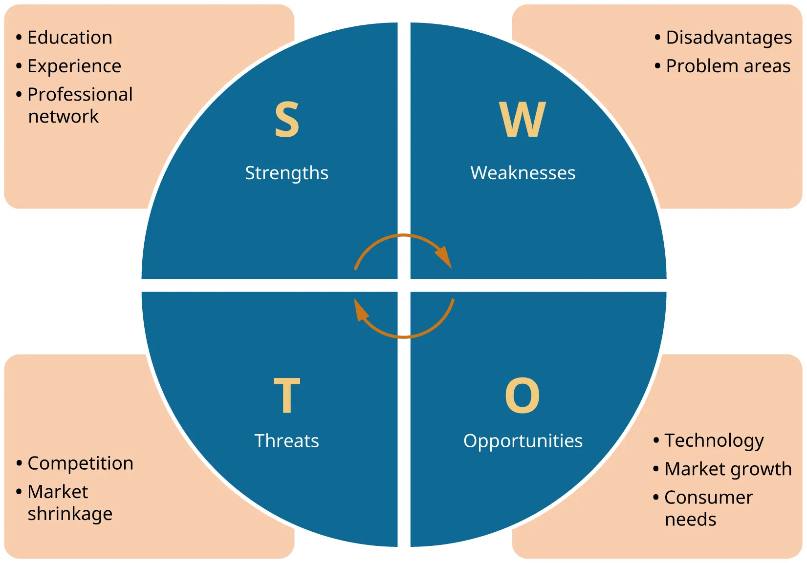
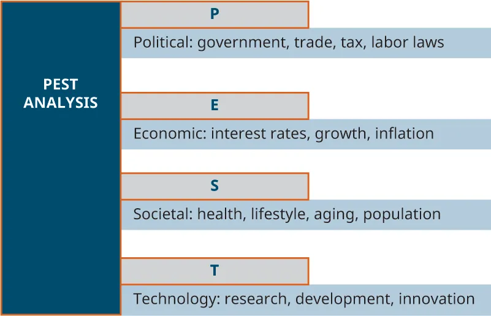
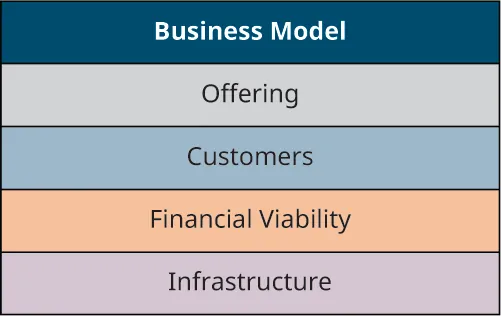

## 5.3   Phân tích cạnh tranh

> **🎯 Mục tiêu học tập**
>
> Đến cuối phần này, bạn sẽ có thể:
>
> - Hiểu các thành phần của phân tích cạnh tranh
> - Mô tả các công cụ bạn có thể dùng để hoàn thiện và tập trung hóa việc lập kế hoạch (ba vòng tròn, SWOT, PEST)
> - Nhận ra vai trò của mạng xã hội trong việc tiết kiệm thời gian và chi phí nghiên cứu
> - Hiểu cách mô hình kinh doanh giúp xác định tính khả thi của một cơ hội

Thực hiện phân tích cạnh tranh giúp bạn tập trung hóa ý tưởng của mình và xác định điểm bán hàng độc nhất cũng như lợi thế cạnh tranh của bạn.

### Phân tích cạnh tranh

Một **phân tích cạnh tranh** cần cung cấp cho doanh nhân thông tin về cách đối thủ tiếp thị doanh nghiệp của họ và cách thâm nhập thị trường thông qua những khoảng trống về sản phẩm hoặc dịch vụ ở các lĩnh vực mà đối thủ của bạn chưa phục vụ hoặc phục vụ chưa tốt. Quan trọng hơn, phân tích cạnh tranh giúp doanh nhân phát triển lợi thế cạnh tranh có thể tạo ra dòng doanh thu bền vững. Ví dụ, một công ty lớn như **Walmart** chủ yếu cạnh tranh bằng giá. Các công ty nhỏ thường không thể cạnh tranh về giá vì họ không có được hiệu quả nội bộ và doanh số khối lượng lớn như các tập đoàn lớn như Walmart, nhưng họ có thể cạnh tranh thành công với Walmart ở những biến số quan trọng khác như dịch vụ tốt hơn, sản phẩm chất lượng cao hơn hoặc trải nghiệm mua sắm độc đáo hơn.

Khi chuẩn bị phân tích cạnh tranh, hãy chắc chắn rằng bạn xác định được các đối thủ theo dòng sản phẩm hoặc phân khúc dịch vụ. Đối với doanh nhân, hoạt động này có thể khó khăn khi ngành đó còn chưa tồn tại. Trong trường hợp của **Bee Love**, **Palms Barber** không có đối thủ trực tiếp, nhưng bà có những đối thủ liên quan trong lĩnh vực sản phẩm chăm sóc da truyền thống. Ý tưởng độc đáo về các sản phẩm chăm sóc da hoàn toàn tự nhiên từ mật ong của bà đã tạo ra một thị trường mới. Vì vậy, phân tích cạnh tranh có thể cần tập trung vào các sản phẩm thay thế hơn là đối thủ trực tiếp. Có hai công cụ chính được dùng để phân tích đối thủ: bảng phân tích cạnh tranh và phương pháp “ba vòng tròn”.

#### Bảng phân tích cạnh tranh

**Bảng phân tích cạnh tranh** cần xác định các đối thủ của bạn và bao gồm đánh giá về những đặc điểm chủ chốt của bối cảnh cạnh tranh trong ngành, bao gồm điểm mạnh, điểm yếu cạnh tranh và các nhân tố thành công then chốt.

[Bảng 5.2](5-3-competitive-analysis#fs-idm365138800) đưa ra một ví dụ về hình thức của phân tích cạnh tranh đối với một cửa hàng xe đạp tại khu vực du lịch.

**Bảng 5.2 Bảng phân tích cạnh tranh này ghi lại một số khía cạnh chính của các đối thủ trong một thị trường nhất định.: Bảng phân tích cạnh tranh cho cửa hàng xe đạp Sid's Cycle tại Branson, Missouri**

| Đặc điểm chính | Sid’s Cycle | City Cycle | SpokeMasters | Target |
| --- | --- | --- | --- | --- |
| Điểm mạnh | Kiến thức sản phẩm, dịch vụ sửa chữa | Dịch vụ sửa chữa | Chất lượng cao, thương hiệu hàng đầu | Giá, thời gian mở cửa (7 ngày/tuần và trực tuyến) |
| Điểm yếu | Lựa chọn hạn chế | Dịch vụ khách hàng kém | Mức giá cao, không có sản phẩm cho người mới bắt đầu | Chất lượng thấp, không có cơ sở sửa chữa |
| Mức chất lượng sản phẩm | Thấp-trung bình | Trung bình-cao | Cao cấp | Cấp độ nhập môn |
| Mức giá | Trung bình | Trung bình-cao | Giá cao | Giá thấp nhất |
| Vị trí doanh nghiệp | Trung tâm mua sắm dải vùng ven trên trục đường đông đúc | Rìa thị trấn trên tuyến 280 | Đường nhánh khu trung tâm | Branson Mall |
| Xúc tiến | Quảng cáo hằng tuần trên báo địa phương, một phần trên radio và Internet/mạng xã hội | Quảng cáo trên báo địa phương theo mùa, Internet/mạng xã hội | Tài trợ giải đua xe đạp lớn trong khu vực, Internet, mạng xã hội | Quảng cáo trực tuyến và trên báo Chủ nhật (theo mùa) |

Khi hoàn thành phân tích về các đối thủ của dự án mình, hãy xác định điều gì góp phần tạo nên thành công của đối thủ. Nói cách khác, vì sao mọi người mua hàng từ công ty đó? Một số lý do có thể bao gồm không có đối thủ gần đó, giá thấp hơn đối thủ, danh mục sản phẩm phong phú hơn, cung cấp những dịch vụ không nơi nào khác có, hoặc hoạt động xây dựng thương hiệu và tiếp thị hấp dẫn thị trường mục tiêu. Phân tích của bạn cần cho thấy sự kết hợp giữa các nhân tố thành công then chốt trong ngành (những gì cần có để thành công trong ngành) và những giá trị mà đối thủ của bạn chưa cung cấp nhưng lại được thị trường mục tiêu coi trọng.

Một công cụ khác thường được sử dụng là **phân tích SWOT** (điểm mạnh, điểm yếu, cơ hội và thách thức), tập trung vào việc phân tích tiềm năng của dự án và phát triển trên nền tảng hiểu biết thu được từ bảng phân tích cạnh tranh và mô hình ba vòng tròn. Bạn cần xác định những điểm mạnh mà dự án của mình phải có để hỗ trợ lợi thế cạnh tranh đã được nhận diện thông qua các công cụ phân tích cạnh tranh. Các điểm yếu có thể được xác định dựa trên tình hình hiện tại và những kỳ vọng có thể dự báo. Với một dự án mới, phần cơ hội và thách thức dựa trên các yếu tố hiện tại trong môi trường bên ngoài mà bạn thu thập được qua nghiên cứu. Trong bối cảnh này, cơ hội là những dữ kiện, thay đổi hoặc tình huống trong môi trường bên ngoài có thể được tận dụng theo hướng có lợi cho thành công của dự án.

> **📝 Thực hành: Sử dụng phân tích SWOT để đánh giá cơ hội khởi nghiệp**
>
> 
>
> *Hình 5.9: Phân tích SWOT có thể được dùng để nhận diện điểm mạnh, điểm yếu, cơ hội và thách thức của một cơ hội khởi nghiệp tiềm năng. (ghi công: Bản quyền thuộc Rice University, OpenStax, theo giấy phép CC BY NC-SA 4.0)*
>
>
>
> Một cách để đánh giá một ý tưởng kinh doanh là chuẩn bị phân tích SWOT ([Hình 5.9](5-3-competitive-analysis#OSX_Eship_05_02_SWOT)). Lưu ý rằng điểm mạnh và điểm yếu là các yếu tố nội tại của doanh nhân, trong khi cơ hội và thách thức là các yếu tố bên ngoài. Điểm mạnh là năng lực và lợi thế của doanh nhân, bao gồm học vấn, kinh nghiệm, và các mối quan hệ cá nhân hoặc nghề nghiệp. Điểm yếu là những bất lợi của doanh nhân, chẳng hạn như thiếu kiến thức hoặc kinh nghiệm. Cơ hội là những diễn biến tích cực mà doanh nhân có thể phát triển theo hướng có lợi cho mình. Điều này có thể bao gồm sự phát triển của công nghệ mới, thay đổi trong thị hiếu và sở thích người tiêu dùng, tăng trưởng thị trường, và các luật lệ, quy định mới. Thách thức có thể là bất cứ điều gì có khả năng gây hại cho doanh nghiệp hoặc ngăn doanh nghiệp thành công, chẳng hạn như cạnh tranh, những biến động bất lợi của điều kiện kinh tế, và các luật lệ hoặc quy định mới.
>
>
> - Nếu bạn đang bắt đầu một dự án kinh doanh mới, bạn có thể tận dụng những điểm mạnh nào để giúp doanh nghiệp thành công?
> - Hãy nêu một số ví dụ về những điểm yếu cá nhân hoặc nghề nghiệp mà doanh nhân có thể gặp phải khi khởi sự doanh nghiệp mới.
> - Thảo luận ba diễn biến, chẳng hạn như luật lệ và quy định mới, thay đổi trong thị hiếu và sở thích tiêu dùng, hoặc sự phát triển của công nghệ mới, có thể tạo ra cơ hội kinh doanh cho một dự án mới.

Một công cụ khác có thể được dùng để phân tích phần cơ hội và thách thức là **phân tích PEST** (chính trị, kinh tế, xã hội, công nghệ). Trong phân tích này, chúng ta xác định các vấn đề thuộc từng nhóm yếu tố. [Hình 5.10](5-3-competitive-analysis#OSX_Eship_05_03_PEST) cho thấy ví dụ về các chủ đề có thể được đưa vào phân tích PEST. Chương [Nền tảng của hoạch định nguồn lực](14-introduction) thảo luận về công cụ này trong mối liên hệ với việc mua sắm nguồn lực.

*Hình 5.10: Phân tích PEST có thể giúp nhận diện những cơ hội và thách thức có thể được sử dụng trong phân tích SWOT. (ghi công: Bản quyền thuộc Rice University, OpenStax, theo giấy phép CC BY NC-SA 4.0)*

Mỗi nhóm yếu tố này cần được hoàn thiện bằng những dữ kiện có liên quan đến cơ hội khởi nghiệp của bạn. Sau khi hoàn thành phân tích này, bạn sẽ xác định xem các dữ kiện hoặc yếu tố đó nên được xếp vào phần cơ hội hay phần thách thức của SWOT.

#### Công cụ ba vòng tròn

Một công cụ khác có thể được sử dụng trong phân tích cạnh tranh là **công cụ ba vòng tròn** ([Hình 5.11](5-3-competitive-analysis#OSX_Eship_05_03_3Circles)). Mục tiêu là xác định điểm mạnh và lợi thế cạnh tranh của các đối thủ, cùng với những phần giao thoa giữa họ. Sau đó, bạn sẽ xác định những giá trị hoặc đặc điểm mà đối thủ chưa cung cấp. Khoảng trống về giá trị hoặc dịch vụ được cung cấp này giúp xác định **đề xuất bán hàng độc nhất (USP)** của bạn và từ đó xác định lợi thế cạnh tranh của bạn.

*Hình 5.11: Phân tích cạnh tranh bằng mô hình ba vòng tròn giúp xác định nơi có sự chồng lấn và nơi có thể tồn tại khoảng trống thị trường mà một dự án mới có thể lấp đầy. Các phần chồng lấn cho thấy những điểm tương đồng về giá trị, những khu vực mà đối thủ cung cấp cùng một giá trị, đồng thời giúp nhận diện các nhu cầu chưa được đáp ứng của khách hàng và mức độ độc đáo của lợi thế cạnh tranh của bạn trong ngành. (ghi công: Bản quyền thuộc Rice University, OpenStax, theo giấy phép CC BY NC-SA 4.0)*

Điểm bán hàng độc nhất là yếu tố quan trọng đối với kế hoạch tiếp thị và thường được dùng như một khẩu hiệu. Nó cũng cần phù hợp với giá trị được truyền tải bởi sản phẩm hoặc thương hiệu công ty. Những khái niệm này khác với **lợi thế cạnh tranh** của dự án; lợi thế cạnh tranh mô tả lợi ích độc đáo của dự án, thứ hỗ trợ sự tăng trưởng của dự án, trong khi điểm bán hàng độc nhất mô tả chính sản phẩm hoặc dịch vụ chứ không phải bản thân dự án. Dù các khái niệm này khác nhau, chúng vẫn cần có sự nhất quán với nhau.

Ví dụ, **Amazon** có lợi thế cạnh tranh ở sự hiện diện trực tuyến, hiểu biết về thị trường, hiểu biết và khả năng ứng dụng công nghệ, cũng như hiểu biết về ngành. Thông qua những lợi thế cạnh tranh đó, Amazon mang đến những tổ hợp lợi ích độc đáo cho khách hàng, chẳng hạn như thanh toán một cú nhấp chuột và các đề xuất dựa trên thuật toán sử dụng khai phá dữ liệu để theo dõi sở thích của từng khách hàng. Điểm bán hàng độc nhất của Amazon trở thành việc làm cho quá trình mua sắm dễ dàng và chính xác nhất có thể, trong khi lợi thế cạnh tranh của họ nằm ở khả năng dự đoán các bước tiến tương lai và hành động dựa trên những dự đoán đó, thậm chí đến mức định hình cả ngành.

Lợi thế cạnh tranh là kết quả của việc phân tích điểm mạnh và các khía cạnh độc đáo của dự án, phân tích ngành, bao gồm lợi thế của đối thủ, nhu cầu của khách hàng, và những gì dự án cung cấp trong bối cảnh cạnh tranh đó. Điểm bán hàng độc nhất phải hỗ trợ lợi thế cạnh tranh, cũng như lợi thế cạnh tranh cần hỗ trợ điểm bán hàng độc nhất.

#### Vai trò của mạng xã hội trong nghiên cứu

Đối với gần như mọi dự án kinh doanh mới, hai vấn đề then chốt liên quan đến nghiên cứu là thời gian và tiền bạc. Các dự án nghiên cứu quy mô lớn có thể mất hàng tháng hoặc lâu hơn và tốn một khoản chi phí đáng kể. Mạng xã hội có thể mang lại một số cơ hội để vượt qua những trở ngại này. Ray **Nelson**, viết cho *Social Media Today*, đã nêu ra một số cách mà mạng xã hội có thể cung cấp nghiên cứu thị trường nhanh chóng với chi phí thấp: theo dõi xu hướng theo thời gian thực, giúp doanh nhân “học ngôn ngữ” của khách hàng tiềm năng, phát hiện những xu hướng bị bỏ sót thông qua tương tác với người tiêu dùng, và thực hiện nghiên cứu thị trường bằng phương thức rất tiết kiệm chi phí.[^26] Nếu doanh nhân có thể tự tiến hành nghiên cứu qua mạng xã hội, chi phí chủ yếu sẽ là thời gian. Nhưng khoảng thời gian cần bỏ ra để nghiên cứu trên các nền tảng như **Facebook** hoặc **Twitter** thường là khoảng thời gian đáng giá. Nghiên cứu này nên bao gồm việc tìm hiểu điểm bán hàng độc nhất của đối thủ, hiểu lợi thế cạnh tranh của họ và xác định điều mà khách hàng coi trọng, vốn có thể khá khó khăn. Ví dụ, trước khi Amazon nhận ra rằng con người rất bận rộn, liệu chúng ta đã ý thức rằng mình muốn quy trình thanh toán nhanh hơn khi mua hàng chưa? Hoặc liệu chúng ta đã nhận ra rằng mình muốn gói hàng giao đến nhà dễ bóc mở hơn chưa? Thế nhưng, nếu hỏi những người mua sắm trên Amazon xem họ coi trọng điều gì khi mua hàng ở đó, chúng ta sẽ nhận được những câu trả lời ủng hộ một quy trình dễ dàng và nhanh chóng hơn.

Một kỹ thuật khác là đọc các đánh giá của khách hàng trên Amazon (hoặc một công ty khác có liên quan đến dự án khởi nghiệp của bạn) để tìm hiểu khách hàng thích và không thích điều gì ở các sản phẩm và thương hiệu hiện có. Bạn cũng có thể tự xây dựng khảo sát của mình trên một ứng dụng như **SurveyMonkey** và gửi cho khách hàng cũng như khách hàng tiềm năng. Cách này thường hiệu quả khi gửi tới những người thực sự quan tâm đến sản phẩm hoặc vấn đề, thay vì phát khảo sát một cách ngẫu nhiên.

### Mô hình kinh doanh và tính khả thi

Một phần của quá trình phân tích để xác định liệu ý tưởng của bạn có phải là một cơ hội khởi nghiệp thực sự hay không là nhận diện một mô hình kinh doanh khả thi. **Mô hình kinh doanh** là kế hoạch về cách dự án sẽ được tài trợ; cách dự án tạo ra giá trị cho các bên liên quan, bao gồm khách hàng; cách các giá trị chào bán của dự án được tạo ra và phân phối đến người dùng cuối; và cách doanh thu sẽ được tạo ra trong suốt quá trình đó. Về cơ bản, mô hình kinh doanh mô tả cách một dự án sẽ tạo ra lợi nhuận bằng việc mô tả từng hành động này. Ở giai đoạn này, mô hình kinh doanh gồm bốn thành phần: giá trị chào bán, khách hàng, hạ tầng và tính khả thi tài chính ([Hình 5.12](5-3-competitive-analysis#OSX_Eship_05_02_Model)). Một phiên bản đầy đủ hơn của mô hình kinh doanh được trình bày trong chương [Mô hình và kế hoạch kinh doanh](11-introduction).

*Hình 5.12: Một mô hình kinh doanh có bốn thành phần: giá trị chào bán, khách hàng, hạ tầng và tính khả thi tài chính. (ghi công: Bản quyền thuộc Rice University, OpenStax, theo giấy phép CC BY NC-SA 4.0)*

**Giá trị chào bán** đề cập đến sản phẩm hoặc dịch vụ mà bạn sẽ bán, đề xuất giá trị, và cách bạn sẽ tiếp cận cũng như giao tiếp với khách hàng mục tiêu. **Đề xuất giá trị cho khách hàng** bao gồm mô tả chi tiết về các sản phẩm và dịch vụ bạn sẽ cung cấp cho khách hàng, cũng như những lợi ích (giá trị) mà khách hàng nhận được khi sử dụng sản phẩm hoặc dịch vụ đó. Lợi ích cho khách hàng có thể là khả năng làm điều gì đó dễ hơn, nhanh hơn hoặc với chi phí thấp hơn trước đây. Lợi ích đó cũng có thể giải quyết một vấn đề mà chưa ai khác giải quyết được.

> **❓ Bạn đã sẵn sàng chưa?: Viết đề xuất giá trị cho khách hàng**
>
> Việc viết ra đề xuất giá trị cho khách hàng là rất hữu ích. Khi đó bạn sẽ có một bản nháp để xem xét và điều chỉnh khi ý tưởng của mình phát triển. Dưới đây là một cấu trúc chung mà bạn có thể làm theo:[^27]
>
>
> - Bắt đầu bằng một câu theo phong cách tiêu đề mô tả cách giá trị chào bán của bạn mang lại lợi ích cho khách hàng.
> - Viết vài câu hoặc một đoạn ngắn giải thích chi tiết hơn về giá trị chào bán. Hãy bảo đảm làm rõ đó là gì, khách hàng là ai và vì sao bạn đưa ra giá trị đó.
> - Cân nhắc đưa vào một danh sách gạch đầu dòng hoặc danh sách kiểm tra làm nổi bật 3-5 đặc điểm của sản phẩm hoặc lợi ích mà khách hàng sẽ nhận được.
> - Nếu có thể, hãy thêm một hình ảnh minh họa giúp tạo hứng thú hoặc củng cố ý tưởng.

**Khách hàng** là những người mà bạn sẽ phục vụ, bao gồm khách hàng tiềm năng từ một hoặc nhiều phân khúc thị trường, tức các tiểu phần của thị trường được phân loại theo những mối quan tâm hoặc nhu cầu tương tự nhau. Sản phẩm hiếm khi hấp dẫn tất cả mọi người, vì vậy doanh nhân cần xác định, thông qua phân tích phân khúc và nhắm mục tiêu ở cấp độ cao, những phân khúc nào của thị trường là phù hợp nhất cho doanh nghiệp, cũng như môi trường và động lực của thị trường. Một số sản phẩm có thể hấp dẫn các phân khúc dựa trên độ tuổi hoặc thu nhập, trong khi các sản phẩm khác có thể hấp dẫn khách hàng dựa trên lối sống. Một dấu hiệu của cơ hội thị trường tiềm năng là khi một thị trường nào đó đang tăng trưởng nhanh. Đó có thể là một thành phố có dân số tăng mạnh, hoặc cũng có thể là một phong cách hay xu hướng tiêu dùng đang bùng nổ. Chương [Tiếp thị và bán hàng khởi nghiệp](8-introduction) sẽ đi sâu hơn vào các chủ đề này.

**cơ sở hạ tầng** đề cập đến toàn bộ các nguồn lực mà doanh nhân cần để khởi động và duy trì dự án kinh doanh. Những nguồn lực này bao gồm con người, sản phẩm, cơ sở vật chất, công nghệ, nhà cung cấp, đối tác và tài chính, tất cả đều là những yếu tố mà doanh nhân phải có để thực hiện đề xuất giá trị dành cho khách hàng.

**Tính khả thi tài chính** liên quan đến khả năng bền vững tài chính dài hạn của một tổ chức để thực hiện sứ mệnh của mình. Điều này quay trở lại định nghĩa của chúng ta về cơ hội khởi nghiệp. Biết rằng dự án giải quyết một vấn đề đủ lớn và đủ quan trọng mà thị trường mục tiêu sẵn sàng trả tiền để giải quyết là một yếu tố then chốt trong việc xác định tính khả thi tài chính. Hạng mục này cũng đề cập đến cách dự án sẽ tạo ra lợi nhuận.

Ví dụ, liệu một mô hình kinh doanh dựa trên thuê bao có phù hợp với thị trường mục tiêu và thành công của dự án hay không? Hiện nay, chúng ta đang chứng kiến sự tăng trưởng đáng kể của các startup cung cấp dịch vụ thuê bao. Phương thức bán hàng này mang lại lợi ích gì? Đối với dự án, mô hình này làm tăng lượng tiền mặt thu trước để hỗ trợ tăng trưởng, đặc biệt khi khách hàng thanh toán trước một năm cho những sản phẩm sẽ được giao trong mười hai tháng tiếp theo. Việc nhận tiền trước khi hoàn tất bán hàng giúp dự án có tiền vận hành để hỗ trợ tăng trưởng hiện tại và tương lai. Lợi ích đối với khách hàng trong tình huống này là số lượng giao dịch ít hơn. Khách hàng biết rằng khoản thanh toán đó bao gồm toàn bộ lợi ích (sản phẩm hoặc dịch vụ nhận được) trong mười hai tháng tiếp theo mà không cần mua thêm cho đến khi gói thuê bao hết hạn.

Một lựa chọn khác là quyết định xem nên có địa điểm vật lý, địa điểm trực tuyến hay cả hai. Tính khả thi tài chính đòi hỏi phải xem xét những lợi ích và hạn chế của các phương thức khác nhau khi xây dựng mô hình kinh doanh của bạn.

> **📝 Thực hành: Nghiên cứu thị trường mục tiêu bằng dữ liệu điều tra dân số**
>
> Hãy thực hành nghiên cứu bằng cách truy cập [www.census.gov](https://www.census.gov) và thêm hai nguồn khác để xác định một thị trường mục tiêu cụ thể cho sản phẩm mà bạn quan tâm. Hãy bao gồm các yếu tố sau của thị trường mục tiêu:
>
>
> - Thu nhập khả dụng. Bạn có thể đặt câu hỏi liệu thị trường mục tiêu có đủ thu nhập khả dụng để mua sản phẩm này hay không.
> - Nhân khẩu học
> - Tâm lý học người tiêu dùng (sự kết hợp giữa hành vi mua sắm, đặc điểm tính cách và nhân khẩu học)
> - Cách bạn, với tư cách doanh nhân, có thể tiếp cận thị trường mục tiêu này.

Khi bạn có một ý tưởng kinh doanh đã được nghiên cứu và nhận thấy rằng có một thị trường đủ lớn với nhu cầu mà ý tưởng của bạn đáp ứng được, rằng thị trường mục tiêu đó có cả mong muốn lẫn khả năng thỏa mãn nhu cầu thông qua việc mua giải pháp được cung cấp, rằng bạn có quyền tiếp cận các nguồn lực cần thiết để xây dựng hạ tầng cho doanh nghiệp, rằng bạn có sự kết hợp phù hợp giữa sản phẩm và dịch vụ với một đề xuất giá trị vững chắc, và rằng bạn có thể bảo đảm được nguồn vốn, thì bạn đang có một cơ hội thực sự. Chương này đã giới thiệu cho bạn tất cả những khái niệm đó. Các chương tiếp theo sẽ đi sâu hơn vào từng nội dung.
