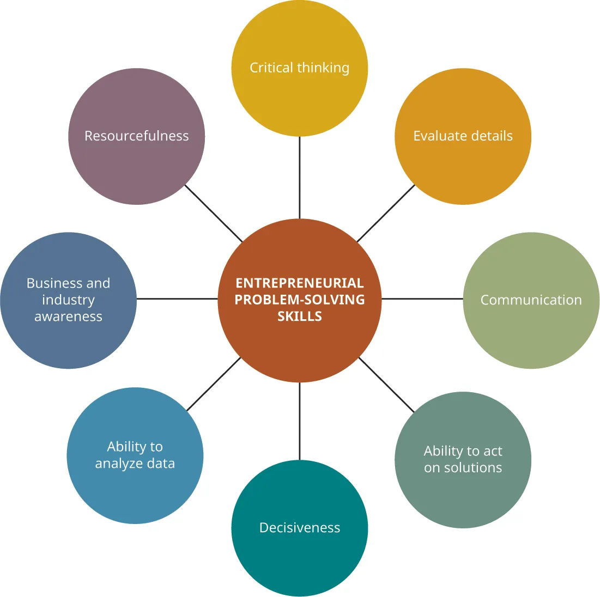
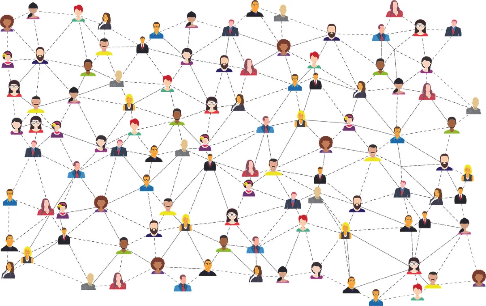
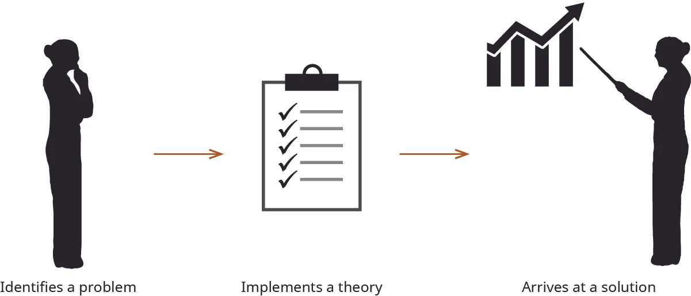
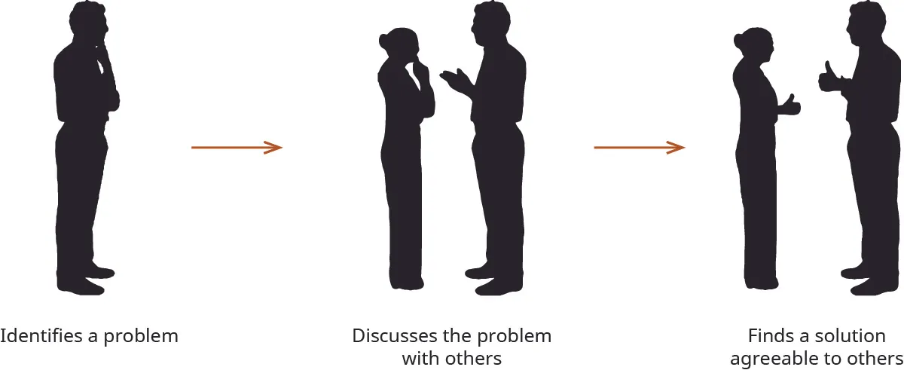

## 6.1   Giải quyết vấn đề để tìm ra các giải pháp khởi nghiệp

Một phần nội dung trong mục này dựa trên công trình gốc của Geoffrey Graybeal và được thực hiện với sự hỗ trợ của Rebus Community. Bản gốc được cung cấp miễn phí theo giấy phép CC BY 4.0 tại [https://press.rebus.community/media-innovation-and-entrepreneurship/](https://press.rebus.community/media-innovation-and-entrepreneurship/).

> **🎯 Mục tiêu học tập**
>
> Khi học xong mục này, bạn sẽ có thể:
>
> - Định nghĩa giải quyết vấn đề trong bối cảnh khởi nghiệp
> - Mô tả và so sánh mô hình thích ứng với mô hình đổi mới trong giải quyết vấn đề
> - Xác định các kỹ năng doanh nhân cần có để giải quyết vấn đề hiệu quả
> - Xác định các kiểu người giải quyết vấn đề

Như bạn đã biết, doanh nhân thường hình dung ra một khoảng cách cơ hội, tức khoảng cách giữa điều đang tồn tại và điều có thể tồn tại, giống như Hirabayashi và Lidey đã làm với Shine. **Giải quyết vấn đề khởi nghiệp** là quá trình sử dụng đổi mới và các giải pháp sáng tạo để thu hẹp khoảng cách đó bằng cách xử lý các vấn đề xã hội, kinh doanh hoặc công nghệ. Đôi khi, những vấn đề cá nhân cũng có thể dẫn tới cơ hội khởi nghiệp nếu được kiểm chứng trên thị trường. Doanh nhân hình dung khả năng lấp đầy khoảng cách bằng một giải pháp đổi mới, có thể là điều chỉnh một sản phẩm hiện có hoặc tạo ra một sản phẩm hoàn toàn mới. Trong mọi trường hợp, doanh nhân tiếp cận quá trình giải quyết vấn đề theo nhiều cách khác nhau. Chương này tập trung nhiều hơn vào giải quyết vấn đề dưới góc độ quá trình tư duy và cách tiếp cận của doanh nhân, hơn là giải quyết vấn đề theo nghĩa nhận diện cơ hội và lấp đầy những khoảng trống đó bằng sản phẩm mới.

Ví dụ, như chúng ta đã đọc trong chương [Identifying Entrepreneurial Opportunity](5-introduction), Sara **Blakely** (như thể hiện trong [Hình 6.2](6-1-problem-solving-to-find-entrepreneurial-solutions#OSX_Eship_06_01_SBlakely)) đã nhìn thấy nhu cầu về đồ lót tạo dáng và làm mượt cơ thể vào một ngày cuối thập niên 1990 khi bà chuẩn bị đi dự tiệc và không tìm được món đồ mình cần để có được dáng vẻ ưng ý khi mặc quần tây. Bà nhìn thấy một vấn đề: nhu cầu của thị trường. Nhưng chính những *nỗ lực giải quyết vấn đề* đã thúc đẩy bà biến lời giải của mình (đồ lót Spanx) thành một sản phẩm khả thi. Những nỗ lực đó xuất phát từ thái độ “có thể làm được” mà chính bà thừa nhận: “Điều thực sự quan trọng là phải tháo vát và lì lợm - một tư duy luôn thấy ly nước đầy một nửa.”[^1] Nỗ lực tạo ra một loại đồ lót mới của bà đã vấp phải sự phản đối từ các lãnh đạo ngành đồ dệt kim, phần lớn là nam giới và khá xa rời người tiêu dùng nữ của họ. Chủ doanh nghiệp đồ dệt kim quyết định giúp Blakely ban đầu đã bỏ qua ý tưởng này, cho đến khi ông hỏi ý kiến các con gái của mình và nhận ra bà thực sự đã nhìn ra điều gì đó. Điều đó sau này trở thành **Spanx**, và ngày nay Blakely là một doanh nhân thành công.[^2]

*Hình 6.2: Sara Blakely (bên phải) tham gia một cuộc thảo luận tại Fast Company Innovation Festival năm 2018. (credit: “Ed Bastian and Sara Blakely at the Fast Company Innovation Festival” by “Nan Palmero”/Flickr, CC BY 2.0)*

Trước khi đi vào trọng tâm của chương này, chúng ta cần phân biệt một điều: *ra quyết định khác với giải quyết vấn đề*. Một quyết định là điều cần thiết để tiếp tục hoặc làm trơn tru một quy trình ảnh hưởng đến hoạt động của doanh nghiệp. Nó có thể mang tính trực giác hoặc có thể đòi hỏi nghiên cứu và một khoảng thời gian cân nhắc dài. **Giải quyết vấn đề**, ngược lại, trực tiếp hơn. Nó bao hàm việc tìm lời giải cho một vấn đề khi tồn tại khoảng cách giữa trạng thái hiện tại và trạng thái mong muốn. Doanh nhân là những người giải quyết vấn đề, đưa ra lời giải bằng sự sáng tạo hoặc các dự án đổi mới khai thác cơ hội. Chương này tập trung vào các cách tiếp cận khác nhau đối với giải quyết vấn đề và nhận diện nhu cầu, những yếu tố giúp các doanh nhân tiềm năng hình thành ý tưởng và tinh chỉnh các ý tưởng đó.

### Hai mô hình giải quyết vấn đề: thích ứng và đổi mới

Có hai mô hình giải quyết vấn đề nổi bật đã được xác lập: *thích ứng* và *đổi mới*. Nhà tâm lý học người Anh nổi tiếng Michael **Kirton** đã phát triển **Bảng kiểm kê Kirton Adaption-Innovation (KAI)** để đo lường phong cách giải quyết vấn đề của một cá nhân.[^3] Theo Kirton, sở thích giải quyết vấn đề phụ thuộc vào các đặc điểm tính cách như tính độc đáo, sự tuân thủ và hiệu quả. Bảng KAI xác định cách tiếp cận giải quyết vấn đề của một cá nhân bằng cách đo mức độ đồng ý với các phát biểu phù hợp với những đặc điểm như khả năng tạo ra nhiều ý tưởng mới lạ, khả năng tuân theo quy tắc và hòa hợp trong nhóm, cũng như xu hướng tổ chức hành vi hằng ngày một cách có hệ thống. Kết quả sẽ phân loại một người là innovator hay adaptor. Innovator rất độc đáo, không thích tuân theo khuôn mẫu và coi trọng hiệu quả ít hơn so với adaptor.

Cách tiếp cận đầu tiên và thận trọng hơn mà doanh nhân có thể dùng để giải quyết vấn đề là mô hình thích ứng. **Mô hình thích ứng** tìm kiếm lời giải cho vấn đề theo những cách đã được kiểm nghiệm và được biết là có hiệu quả. Mô hình thích ứng chấp nhận cách vấn đề được định nghĩa và quan tâm đến việc xử lý vấn đề hơn là đi tìm vấn đề. Cách tiếp cận này hướng tới hiệu quả cao hơn đồng thời nhằm duy trì tính liên tục và ổn định. Cách tiếp cận thứ hai và sáng tạo hơn là **mô hình đổi mới** trong giải quyết vấn đề khởi nghiệp, sử dụng những kỹ thuật còn xa lạ với thị trường và mang lại lợi thế cho tổ chức. Phong cách giải quyết vấn đề mang tính đổi mới thách thức cách định nghĩa vấn đề, phát hiện vấn đề và các hướng giải quyết của chúng, đồng thời chất vấn các giả định hiện có - nói ngắn gọn, nó làm mọi thứ theo cách khác. Nó sử dụng lối suy nghĩ vượt khuôn và tìm kiếm những lời giải mới lạ. Tính mới là một đặc điểm được chia sẻ của khởi nghiệp sáng tạo, và đó là lý do doanh nhân thường nghiêng về phương pháp giải quyết vấn đề này. Theo Tiến sĩ Shaun M. **Powell**, giảng viên cao cấp tại University of Wollongong, Australia: “Các doanh nhân sáng tạo nổi bật nhờ một phong cách quản lý riêng biệt dựa trên trực giác, tính phi chính thức và việc ra quyết định nhanh chóng, trong khi những phong cách tư duy thông thường hơn lại không phù hợp với các đặc tính độc đáo của doanh nhân sáng tạo.”[^4] Cách giải quyết vấn đề này không chỉ chỉnh sửa một sản phẩm hiện có. Nó tạo ra một thứ hoàn toàn mới.

Ví dụ, các cơ sở y tế từ lâu đã được biết đến là nguồn phát sinh vi khuẩn *Staphylococcus aureus* kháng methicillin (MRSA), một loại nhiễm trùng chết người có thể để lại ảnh hưởng lâu dài cho bệnh nhân. **Vital Vio**, do Colleen **Costello** dẫn dắt, đã phát triển công nghệ ánh sáng trắng có thể khử trùng hiệu quả các cơ sở y tế bằng cách nhắm vào một phân tử đặc thù của vi khuẩn. Loại ánh sáng này an toàn với con người và có thể bật liên tục để tiêu diệt vi khuẩn tái sinh. Một mô hình giải quyết vấn đề thích ứng sẽ tìm cách giảm thiểu tác hại của MRSA trong bệnh viện - tức phản ứng với nó - trong khi Vital Vio là một kỹ thuật hoàn toàn mới nhằm loại bỏ nó. Các giải pháp thích ứng đối với MRSA bao gồm những quy trình và quy định phòng ngừa đã được thiết lập, như yêu cầu bác sĩ, y tá và các nhân viên y tế khác rửa tay bằng xà phòng và nước hoặc dung dịch sát khuẩn có cồn trước và sau khi chăm sóc bệnh nhân, xét nghiệm để xem bệnh nhân có MRSA trên da hay không, làm sạch phòng bệnh và thiết bị y tế của bệnh viện, cũng như giặt và sấy quần áo cùng ga giường ở mức nhiệt khuyến nghị cao nhất.[^5]

> **🔗 Liên kết học tập**
>
> Hãy truy cập *Inc. Magazine* để tìm hiểu thêm về [sự hỗ trợ và lời khuyên dành cho các startup đang lên](https://openstax.org/l/52AdviceStartup). Ở đó có chia sẻ những ví dụ về cách các doanh nhân “Dorm Room” nhận ra và theo đuổi cơ hội, cùng với các mẹo và lời khuyên giúp startup của bạn thành công.

### Kỹ năng giải quyết vấn đề

Mặc dù nhận diện vấn đề là một phần cần thiết của sự khởi đầu trong quá trình khởi nghiệp, quản lý vấn đề lại là một khía cạnh hoàn toàn khác khi một dự án đã được vận hành. Doanh nhân không có đặc quyền né tránh vấn đề và thường chịu trách nhiệm cho toàn bộ việc giải quyết vấn đề trong một startup hoặc hình thức kinh doanh khác. Có những kỹ năng nhất định mà doanh nhân sở hữu khiến họ đặc biệt giỏi trong việc giải quyết vấn đề. Hãy xem xét từng kỹ năng (thể hiện trong [Hình 6.3](6-1-problem-solving-to-find-entrepreneurial-solutions#OSX_Eship_06_01_Skills)).

*Hình 6.3: Đây là một vài kỹ năng mà doanh nhân sở hữu để hỗ trợ giải quyết vấn đề. (attribution: Copyright Rice University, OpenStax, under CC BY NC-SA 4.0 license)*

#### Tư duy phản biện

**Tư duy phản biện** là sự phân tích phức hợp một vấn đề hoặc một sự việc với mục tiêu giải quyết vấn đề hoặc đưa ra quyết định. Doanh nhân phân tích và bóc tách các lớp của vấn đề để tìm ra cốt lõi của một sự việc mà doanh nghiệp đang đối mặt. Doanh nhân tập trung vào trung tâm của vấn đề và phản ứng một cách hợp lý, cởi mở trước các gợi ý nhằm giải quyết nó. Tư duy phản biện không chỉ quan trọng trong việc phát triển ý tưởng khởi nghiệp; đó còn là một năng lực được săn đón trong giáo dục và việc làm. Doanh nhân Rebecca **Kantar** đã bỏ Harvard năm 2015 để sáng lập startup công nghệ **Imbellus**, công ty hướng tới thay thế các bài kiểm tra đầu vào đại học chuẩn hóa như SAT bằng những tình huống tương tác nhằm kiểm tra kỹ năng tư duy phản biện. Nhiều bài kiểm tra chuẩn hóa có thể bao gồm câu hỏi trắc nghiệm yêu cầu câu trả lời cho một câu hỏi kiến thức hoặc bài toán khá trực diện. Kantar muốn tạo ra các bài kiểm tra quan tâm nhiều hơn đến khả năng phân tích và suy luận diễn ra trong quá trình giải quyết vấn đề. Imbellus cho biết họ muốn kiểm tra “cách con người suy nghĩ”, chứ không chỉ những gì họ biết. Nền tảng này, dù chưa ra mắt, sẽ sử dụng các mô phỏng cho việc đánh giá người dùng.[^6]

> **🔗 Liên kết học tập**
>
> Hãy đọc thêm về [giải quyết vấn đề và câu chuyện của EnterpriseWorks/Vita](https://openstax.org/l/52ProbSolve) trên *Harvard Business Review*.

#### Giao tiếp

**Kỹ năng giao tiếp**, tức khả năng truyền đạt thông điệp một cách hiệu quả tới đúng đối tượng tiếp nhận, là những kỹ năng doanh nhân dùng để huy động nguồn lực nhằm tìm hiểu các giải pháp dẫn đến giải quyết vấn đề mang tính đổi mới và tạo lợi thế cạnh tranh. Giao tiếp tốt cho phép các ý tưởng được liên tưởng tự do giữa doanh nhân và doanh nghiệp. Nó có thể làm nổi bật một khu vực vấn đề hoặc một tầm nhìn chung, đồng thời tìm kiếm sự ủng hộ từ các bên liên quan khác nhau. Việc kết nối mạng lưới và giao tiếp trong một ngành giúp doanh nhân nhận ra vị thế của doanh nghiệp trên thị trường và hướng tới việc diễn đạt thành lời những giải pháp đưa tổ chức vượt ra ngoài trạng thái hiện tại. Bằng “diễn đạt thành lời”, chúng tôi muốn nói đến sự giao tiếp từ phía công ty và với công ty/thực thể đó. **Truyền thông nội bộ** bao gồm email công ty, bản tin, thuyết trình và báo cáo có thể đặt ra mục tiêu, chỉ tiêu chiến lược, cũng như báo cáo những gì đã hoàn thành và những mục tiêu, chỉ tiêu nào vẫn còn, để nhân viên trong tổ chức có đầy đủ thông tin và có thể cùng giải quyết những vấn đề còn tồn tại trong tổ chức. **Truyền thông bên ngoài** có thể bao gồm thông cáo báo chí, blog và website, mạng xã hội, diễn thuyết trước công chúng và thuyết trình giải thích các giải pháp của công ty đối với vấn đề. Chúng cũng có thể là các bài thuyết trình gọi vốn hoàn chỉnh với kế hoạch kinh doanh và dự báo tài chính.

Các bài tập hình thành ý tưởng, như các buổi **brainstorming** (được thảo luận trong [Creativity, Innovation, and Invention](4-introduction)), là những công cụ giao tiếp tốt mà doanh nhân có thể dùng để tạo ra các giải pháp cho vấn đề. Một công cụ khác như vậy là **hackathon** - một sự kiện, thường do một công ty hoặc tổ chức công nghệ tổ chức, quy tụ lập trình viên và những người có chuyên môn khác trong công ty, cộng đồng hoặc tổ chức để cùng hợp tác trong một dự án trong thời gian ngắn. Các sự kiện này có thể kéo dài từ hai mươi bốn giờ đến vài ngày trong một cuối tuần. Hackathon có thể là một sáng kiến nội bộ trong toàn công ty hoặc một sự kiện bên ngoài tập hợp những người tham gia từ cộng đồng. **Canvas mô hình kinh doanh**, được đề cập trong [Business Model and Plan](11-introduction) và các hoạt động khác ở những chương khác, có thể được dùng trong nội bộ hoặc bên ngoài để nhận diện vấn đề và hướng tới việc tạo ra một giải pháp khả thi.

**Networking** là một biểu hiện quan trọng của giao tiếp hữu ích. Còn cách nào tốt hơn để trình bày ý tưởng của một người, giành lấy nguồn vốn và sự ủng hộ, cũng như marketing cho startup hơn là xây dựng một mạng lưới những cá nhân sẵn sàng hỗ trợ dự án của bạn? Một **mạng lưới** có thể bao gồm nhân viên tiềm năng, khách hàng, thành viên hội đồng quản trị, cố vấn bên ngoài, nhà đầu tư hoặc những người ủng hộ nhiệt thành (những người đơn giản là rất yêu thích sản phẩm của bạn) nhưng không có lợi ích trực tiếp gắn với nó. Mạng xã hội bao gồm các liên kết yếu và liên kết mạnh. Nhà xã hội học Mark **Granovetter** đã nghiên cứu những mạng lưới như vậy từ thập niên 1970, và phát hiện của ông vẫn còn đúng tới hôm nay, ngay cả khi chúng ta đưa cả mạng xã hội trực tuyến vào định nghĩa. Theo ông, **liên kết yếu** tạo điều kiện cho luồng thông tin và tổ chức cộng đồng, trong khi các liên kết mạnh đại diện cho những mối kết nối chặt chẽ giữa bạn thân, người thân trong gia đình và đồng nghiệp hỗ trợ nhau.[^7] **Liên kết mạnh** đòi hỏi nhiều công sức duy trì hơn liên kết yếu (như minh họa bằng các đường liền và đường chấm trong [Hình 6.4](6-1-problem-solving-to-find-entrepreneurial-solutions#OSX_Eship_06_01_Network)) và trong bối cảnh kinh doanh, chúng không tạo ra nhiều cơ hội mới. Trái lại, liên kết yếu lại mở ra cánh cửa vì chúng đóng vai trò cầu nối đến các liên kết yếu khác trong những khu vực chức năng hoặc bộ phận mà bạn có thể không tiếp cận được trực tiếp hoặc thông qua các liên kết mạnh.[^8]

*Hình 6.4: Networking giúp kết nối những cá nhân vốn có thể chưa từng gặp nhau và có khả năng hỗ trợ nhau giải quyết vấn đề. (credit: “social media connections networking” by “GDJ”/Pixabay, CC0)*

Trên thực tế, nhiều doanh nhân trẻ, bao gồm doanh nhân công nghệ Oliver **Isaacs**, nhận ra rằng đại học là một nơi tuyệt vời để bắt đầu xây dựng đội ngũ. Isaacs là nhà sáng lập mạng ý kiến lan truyền **Amirite.com**, vốn được ghi nhận rộng rãi là nơi các meme Internet khởi phát và tiếng lóng trực tuyến bắt đầu bén rễ.[^9] Amirite.com bao gồm một mạng lưới lớn các trang và quan hệ hợp tác trên Facebook và Instagram, tiếp cận 15 triệu người dùng mỗi tháng. Isaacs khuyến nghị sử dụng mạng lưới cựu sinh viên để xây dựng đội ngũ và cơ sở khách hàng cho dự án của riêng bạn, vì bạn không bao giờ biết liệu người mình đang trò chuyện có thể trở thành nhân viên hoặc đối tác tương lai hay không.

Việc chia sẻ ý tưởng và nguồn lực được đánh giá rất cao trong quá trình khởi nghiệp. Giao tiếp là một kỹ năng sống còn trong giải quyết vấn đề vì khả năng xác định và diễn đạt rõ vấn đề (định nghĩa không gian vấn đề) là điều cần thiết để xử lý vấn đề một cách thỏa đáng. Một vấn đề có thể quá mơ hồ, quá rộng hoặc quá hẹp. Vì vậy, việc truyền đạt vấn đề là quan trọng, cũng như việc truyền đạt giải pháp.

#### Tính quyết đoán

**Tính quyết đoán** đúng như tên gọi: khả năng đưa ra một quyết định nhanh chóng và hiệu quả, không để quá nhiều thời gian trôi qua trong quá trình đó. Doanh nhân phải duy trì năng suất ngay cả khi đối diện với rủi ro. Họ thường dựa vào trực giác cũng như các dữ kiện cứng để lựa chọn. Họ tự hỏi vấn đề nào cần được giải quyết, suy nghĩ về các giải pháp, rồi cân nhắc những phương tiện cần thiết để hiện thực hóa ý tưởng. Và các quyết định đó phải được soi sáng bằng nghiên cứu.

Ví dụ, như Adam Grant giải thích trong cuốn *The Originals*, các đồng sáng lập của Warby Parker, một startup được đầu tư tập trung vào ngành kính mắt, đã bắt đầu công ty của mình khi còn là nghiên cứu sinh. Vào thời điểm đó họ biết rất ít về ngành này, nhưng sau khi tiến hành nghiên cứu chi tiết, họ phát hiện ngành đang bị chi phối bởi một người chơi lớn là Luxottica. Họ sử dụng thông tin đó và các dữ liệu khác để tinh chỉnh chiến lược và mô hình kinh doanh của mình (chủ yếu tập trung vào giá trị, chất lượng và sự tiện lợi thông qua kênh trực tuyến). Khi quyết định ra mắt doanh nghiệp, họ đã suy nghĩ kỹ các chi tiết then chốt và đạt được thành công sớm rất nhanh. Ngày nay, Warby Parker có hơn 100 cửa hàng bán lẻ tại Mỹ, có lợi nhuận và được định giá gần 2 tỷ USD.

Tính quyết đoán là bệ phóng của tiến bộ. Nhà sáng lập **Amazon** Jeff **Bezos** luôn nhấn mạnh tầm quan trọng của tính quyết đoán trong toàn bộ tổ chức của mình. Bezos tin rằng tính quyết đoán thậm chí còn có thể dẫn tới đổi mới. Ông ủng hộ việc đưa ra quyết định sau khi đã có khoảng 70 phần trăm lượng thông tin bạn cần: “Sai có thể ít tốn kém hơn bạn nghĩ, trong khi chậm chạp chắc chắn sẽ rất tốn kém,” Bezos viết trong thư thường niên gửi cổ đông năm 2017.[^10]

> **🔗 Liên kết học tập**
>
> Hãy đọc [bài đăng blog trên LinkedIn về tính quyết đoán](https://openstax.org/l/52decisiveness) để tìm hiểu thêm.

#### Khả năng phân tích dữ liệu

**Phân tích dữ liệu** là quá trình phân tích dữ liệu và mô hình hóa nó thành một cấu trúc dẫn tới các kết luận mang tính đổi mới. Chương [Identifying Entrepreneurial Opportunity](5-introduction) đã đề cập đến nhiều nguồn dữ liệu mà doanh nhân có thể tìm kiếm. Nhưng một chuyện là tích lũy thông tin và số liệu thống kê; chuyện khác là hiểu được dữ liệu đó, dùng nó để lấp đầy nhu cầu thị trường hoặc dự báo một xu hướng sắp tới. Những nhà sáng lập thành công biết cách đặt câu hỏi về thông tin và rút ra ý nghĩa từ nó. Và nếu bản thân họ không làm được điều đó, họ biết cách đưa những chuyên gia có thể làm được vào cuộc.

Ngoài các nguồn dữ liệu công cộng có phạm vi rộng, doanh nghiệp có thể thu thập dữ liệu về khách hàng khi họ tương tác với công ty trên mạng xã hội hoặc khi họ truy cập website của công ty, đặc biệt nếu họ hoàn tất một giao dịch bằng thẻ tín dụng. Doanh nghiệp có thể thu thập dữ liệu riêng cụ thể về chính khách hàng của mình, bao gồm vị trí, tên, hoạt động và cách họ đến được website. Việc phân tích những dữ liệu này sẽ giúp doanh nhân hiểu rõ hơn về đặc điểm nhân khẩu học của nhóm đối tượng quan tâm.

Trong khởi nghiệp, việc phân tích dữ liệu có thể hỗ trợ nhận diện, tạo lập và đánh giá cơ hội bằng nhiều cách phân tích khác nhau. Doanh nhân có thể khám phá và khai thác các nguồn dữ liệu khác nhau để nhận diện và so sánh những cơ hội “hấp dẫn”, vì các phân tích đó có thể mô tả điều gì đã xảy ra, vì sao nó xảy ra và khả năng nó sẽ lặp lại trong tương lai là bao nhiêu. Trong kinh doanh nói chung, analytics được dùng để giúp nhà quản lý/doanh nhân có cái nhìn sâu hơn về hoạt động kinh doanh hay dự án mới nổi của họ và đưa ra những quyết định tốt hơn dựa trên dữ kiện.

Analytics có thể là mô tả, dự báo hoặc khuyến nghị. **Descriptive analytics** liên quan đến việc hiểu điều gì đã xảy ra và đang xảy ra; **predictive analytics** sử dụng dữ liệu từ hiệu quả hoạt động trong quá khứ để ước lượng hiệu quả trong tương lai; còn prescriptive analytics sử dụng kết quả của descriptive và predictive analytics để ra quyết định. Phân tích dữ liệu có thể được áp dụng để quản lý quan hệ khách hàng, hỗ trợ các hoạt động tài chính và marketing, đưa ra quyết định định giá, quản lý chuỗi cung ứng và lập kế hoạch nhu cầu nhân sự, cùng nhiều chức năng khác của một dự án. Bên cạnh phân tích thống kê, các phương pháp định lượng và mô hình máy tính hỗ trợ ra quyết định, doanh nghiệp ngày nay cũng ngày càng sử dụng các thuật toán trí tuệ nhân tạo để phân tích dữ liệu và ra quyết định nhanh chóng.

#### Hiểu biết về doanh nghiệp và ngành

Doanh nhân cần có hiểu biết vững chắc về thị trường và ngành. Nhiều khi, họ đã làm việc trong một tổ chức lớn khi nhận ra cơ hội tăng trưởng hoặc sự kém hiệu quả trong một thị trường. Người nhân viên nhờ đó có được hiểu biết sâu sắc về ngành đang xét. Nếu người đó nghĩ ra một giải pháp khả dĩ cho một vấn đề, giải pháp ấy có thể trở thành nền tảng cho một doanh nghiệp mới.

Ví dụ, hãy xem xét một công ty marketing đã sử dụng marketing truyền thống suốt ba mươi năm. Công ty này có một tệp khách hàng ổn định. Một quản lý trong tổ chức bắt đầu nghiên cứu social media analytics và mạng xã hội. Người này đề nghị chủ doanh nghiệp thay đổi quy trình và bắt đầu phục vụ khách hàng thông qua mạng xã hội, nhưng chủ doanh nghiệp từ chối. Các khách hàng của công ty bắt đầu kêu gọi sự hiện diện trên mạng xã hội. Nữ giám đốc marketing đã khảo sát khả năng xây dựng một agency tại địa phương của mình để phục vụ các khách hàng muốn sử dụng mạng xã hội. Cô rời tổ chức và khởi nghiệp agency của riêng mình (tất nhiên với điều kiện điều này không vi phạm bất kỳ điều khoản không cạnh tranh nào trong hợp đồng của cô). Lợi thế cạnh tranh của cô là sự am hiểu cả các kênh truyền thống lẫn mạng xã hội. Về sau, agency ban đầu bắt đầu lao đao vì không cung cấp dịch vụ quảng cáo trên mạng xã hội. Vị nữ quản lý quả cảm của chúng ta sau đó đã mua lại agency này để giành lấy tệp khách hàng và phục vụ những người muốn chuyển dịch khỏi marketing truyền thống.

Một trải nghiệm tương tự đã đến với doanh nhân Katie **Witkin**. Sau khi làm việc trong các vai trò marketing truyền thống, cựu sinh viên University of Wisconsin-Madison, xuất hiện trong [Hình 6.5](6-1-problem-solving-to-find-entrepreneurial-solutions#OSX_Eship_06_01_KWitkin), đã rời bỏ đời sống agency bốn năm sau khi ra trường để đồng sáng lập công ty của riêng mình, **AGW Group**. Năm 2009, Witkin thực tập tại một agency marketing âm nhạc không có bộ phận mạng xã hội. Từ thời còn học đại học và qua việc quan sát xu hướng ngành, cô biết rằng mạng xã hội đang thay đổi cách các công ty kết nối với khách hàng. Với dự án của riêng mình, cô mở rộng trọng tâm sang tất cả các thương hiệu hỗ trợ để quản lý mọi thứ liên quan đến kỹ thuật số. Ngày nay, agency truyền thông văn hóa và marketing này có mười lăm nhân viên và những khách hàng tên tuổi lớn từ HBO đến Red Bull.[^11]

*Hình 6.5: Trong ảnh là Katie Witkin, đồng sáng lập AGW Group. (credit: photo provided by AGW Group)*

#### tính tháo vát

**Tính tháo vát** là khả năng tìm ra những giải pháp khéo léo trước trở ngại. Sherrie **Campbell**, một nhà tâm lý học, tác giả và cộng tác viên thường xuyên của tạp chí *Entrepreneur* về các chủ đề kinh doanh, diễn đạt điều này như sau:

“Không có phẩm chất nào hữu ích hay quan trọng hơn sự tháo vát trong hành trình theo đuổi thành công. Tính tháo vát là một tư duy, và đặc biệt phù hợp khi những mục tiêu bạn đặt ra khó đạt được hoặc khi bạn không thể hình dung ra một con đường rõ ràng để đến nơi mình muốn tới. Với tư duy tháo vát, bạn sẽ bị thôi thúc phải tìm ra một lối đi. Thái độ tháo vát khơi gợi lối suy nghĩ vượt khuôn, việc tạo ra những ý tưởng mới và khả năng hình dung mọi cách có thể để đạt được điều bạn mong muốn. Tính tháo vát biến bạn thành một doanh nhân lì lợm, sáng tạo và giàu tinh thần doanh chủ. Nó đặt bạn ở một đẳng cấp cao hơn phần còn lại.”[^12]

Doanh nhân bắt đầu nghĩ về một dự án kinh doanh hoặc startup bằng cách trò chuyện với mọi người và tìm đến các chuyên gia để hỗ trợ tạo lập, cấp vốn và khởi động doanh nghiệp. Doanh nhân là những người dám chấp nhận rủi ro, say mê những nỗ lực mới. Nếu họ không có bằng đại học hoặc không có nhiều kinh nghiệm kinh doanh, họ hiểu rằng vẫn có nhiều nguồn lực sẵn có để hỗ trợ mình trong hành trình ấy, chẳng hạn như **Service Corps of Retired Executives (SCORE - Tổ chức Cố vấn Doanh nghiệp từ các Cựu điều hành)** và **Small Business Administration (SBA - Cục Quản lý Doanh nghiệp Nhỏ Hoa Kỳ)**. Có nhiều nguồn lực sẵn có để cấp vốn cho doanh nghiệp với ít hoặc không có nợ, cùng nhiều lựa chọn khác như bạn sẽ thấy trong chương [Entrepreneurial Finance and Accounting](9-introduction). Doanh nhân theo đuổi một tầm nhìn và nghiên cứu các cơ hội để tiến gần hơn tới giấc mơ.

Ví dụ, vào cuối thập niên 1990, Bill **McBean** và cộng sự kinh doanh của ông, Billy **Sterett**, có cơ hội mua lại một đại lý ô tô hoạt động kém hiệu quả, thương vụ có thể giúp công ty của họ trở thành đơn vị thống trị thị trường. Không muốn rút tiền mặt từ các dự án khác và cũng không muốn vay thêm rồi gắn mình với nhiều nợ hơn, hai doanh nhân đã thể hiện sự tháo vát bằng cách tìm một con đường khác để có được số tiền cần thiết cho thương vụ thâu tóm mà cả hai đều khao khát. Họ đổi ngân hàng và đàm phán lại các điều kiện hoàn trả, giảm lãi suất, giảm phí và giảm khoản thanh toán hằng tháng, cuối cùng giải phóng được một lượng tiền mặt đáng kể giúp họ mua được công ty mới.[^13]

### Các kiểu người giải quyết vấn đề

Doanh nhân có một sự thôi thúc gần như vô hạn đối với việc giải quyết vấn đề. Động lực này thúc đẩy họ đi tìm cách tháo gỡ khi xuất hiện khoảng trống trong một sản phẩm hoặc dịch vụ. Họ nhận ra cơ hội và tận dụng chúng. Có một số kiểu người giải quyết vấn đề trong khởi nghiệp, bao gồm kiểu tự điều chỉnh, kiểu lý thuyết và kiểu thỉnh ý.

#### người giải quyết vấn đề tự chủ

**Người giải quyết vấn đề tự chủ** có tính tự chủ và làm việc độc lập mà không chịu ảnh hưởng từ bên ngoài. Họ có khả năng nhìn ra vấn đề, hình dung một giải pháp khả dĩ cho vấn đề và tìm cách xây dựng lời giải, như [Hình 6.6](6-1-problem-solving-to-find-entrepreneurial-solutions#OSX_Eship_06_01_SelfReg) minh họa. Giải pháp đó có thể mang rủi ro, nhưng người giải quyết vấn đề kiểu tự điều chỉnh sẽ nhận ra, đánh giá và giảm thiểu rủi ro ấy. Ví dụ, một doanh nhân đã lập trình một quy trình máy tính hóa cho khách hàng, nhưng khi kiểm thử lại phát hiện chương trình liên tục rơi vào một vòng lặp, nghĩa là nó mắc kẹt trong một chu kỳ và không tiến triển. Thay vì chờ khách hàng phát hiện ra vấn đề, doanh nhân tìm trong mã nguồn lỗi gây ra vòng lặp, chỉnh sửa ngay lập tức rồi gửi phiên bản đã sửa cho khách hàng. Ở đây có phân tích tức thời, chỉnh sửa tức thời và triển khai tức thời. Lợi thế cạnh tranh lớn nhất của kiểu người này là tốc độ nhận ra và cung cấp giải pháp cho vấn đề.

*Hình 6.6: Người giải quyết vấn đề tự chủ nhận diện vấn đề, nghĩ ra giải pháp rồi triển khai giải pháp đó. (attribution: Copyright Rice University, OpenStax, under CC BY NC-SA 4.0 license)*

#### người giải quyết vấn đề theo lý thuyết

**Người giải quyết vấn đề theo lý thuyết** nhìn thấy một vấn đề và bắt đầu cân nhắc con đường giải quyết nó bằng một lý thuyết. Họ có định hướng quy trình và tính hệ thống. Trong khi nhà quản lý có thể bắt đầu với một vấn đề và tập trung vào kết quả mà ít cân nhắc đến phương tiện để đi tới đích, doanh nhân có thể nhìn thấy một vấn đề rồi bắt đầu xây dựng con đường đi tới kết quả bằng những gì đã biết, tức một lý thuyết. Nói cách khác, doanh nhân đi qua các bước để giải quyết vấn đề rồi phát huy những thành công, loại bỏ những thất bại và hướng tới kết quả bằng cách thử nghiệm và xây dựng trên các kết quả đã biết. Ở thời điểm này, người giải quyết vấn đề có thể chưa biết kết quả cuối cùng, nhưng lời giải sẽ xuất hiện trong quá trình thử nghiệm đi tới lời giải đó. [Hình 6.7](6-1-problem-solving-to-find-entrepreneurial-solutions#OSX_Eship_06_01_Theory) cho thấy quy trình này.

Ví dụ, nếu xem Marie **Curie** như một doanh nhân, Curie đã làm việc để cô lập một nguyên tố. Khi các cách tiếp cận khác nhau nhằm cô lập nguyên tố đó thất bại, Curie ghi lại những thất bại và thử những lời giải khả dĩ khác. Những lý thuyết thất bại của Curie cuối cùng đã hé lộ kết quả cho việc cô lập radium. Giống Curie, những người theo kiểu lý thuyết sử dụng phân tích có cân nhắc, hành động khắc phục có cân nhắc và một quy trình triển khai có cân nhắc. Khi thời gian là yếu tố sống còn, doanh nhân cần hiểu rằng việc thử nghiệm liên tục sẽ làm chậm quá trình giải quyết vấn đề.

*Hình 6.7: Người giải quyết vấn đề theo lý thuyết nhận diện vấn đề; triển khai một lý thuyết, đôi khi lặp đi lặp lại; và cuối cùng đi tới lời giải. (attribution: Copyright Rice University, OpenStax, under CC BY NC-SA 4.0 license)*

#### người tìm kiếm giải pháp từ người khác

**Người tìm kiếm giải pháp từ người khác** ([Hình 6.8](6-1-problem-solving-to-find-entrepreneurial-solutions#OSX_Eship_06_01_Petition)) nhìn thấy một vấn đề và hỏi người khác về ý tưởng giải pháp. Kiểu doanh nhân này thích tham khảo ý kiến một người đã “từng trải và đã làm điều đó”. Người thỉnh ý cũng có thể thích giải quyết vấn đề trong môi trường làm việc nhóm. Việc xin ý kiến từ đội ngũ khởi nghiệp bảo đảm rằng doanh nhân đang đi trên một con đường dựa trên đồng thuận. Đây là kiểu giải quyết vấn đề mất nhiều thời gian nhất vì doanh nhân phải tham gia vào một quá trình dân chủ cho phép mọi thành viên trong nhóm đều có ý kiến đóng góp. Quá trình này bao gồm việc khám phá các phương án thay thế để đi đến lời giải cuối cùng. Chẳng hạn, trong việc ra quyết định của tổ chức, tính toàn diện là thước đo mức độ doanh nghiệp cố gắng bao quát hoặc bao trùm trong việc ra quyết định. Tính toàn diện có thể được đo bằng số lượng cuộc họp theo lịch, cách thức tìm kiếm thông tin, cách thức lấy ý kiến từ các nguồn bên ngoài, số lượng nhân viên tham gia, việc sử dụng chuyên gia tư vấn chuyên biệt và năng lực chức năng của những người tham gia, số năm dữ liệu lịch sử được xem xét, cũng như việc phân công trách nhiệm chính, cùng nhiều yếu tố khác. Ra quyết định toàn diện sẽ là một ví dụ của phong cách giải quyết vấn đề kiểu thỉnh ý, vì nó tìm kiếm ý kiến từ một số lượng lớn thành viên trong nhóm.

Một ***charette*** - một cuộc họp nhằm giải quyết xung đột và xác định giải pháp - là một ví dụ khác sử dụng cách tiếp cận giải quyết vấn đề kiểu thỉnh ý. Nhiều khi, nhà phát triển của một dự án mới có thể tổ chức một community charette để hỗ trợ thiết kế dự án, với hy vọng giành được sự chấp thuận của các quan chức dân cử. Trong ví dụ về xây dựng, điều này có thể bao gồm nhà phát triển và đội ngũ kiến trúc sư, nhà thiết kế dự án cùng những người có chuyên môn liên quan làm việc song song với các thành viên cộng đồng, lãnh đạo doanh nghiệp, quan chức dân cử hoặc những đại diện như nhân viên và các hội đồng do công dân bổ nhiệm như planning board. Hoạt động như vậy thể hiện cho cách tiếp cận giải quyết vấn đề kiểu thỉnh ý, trái ngược với việc một đại diện của nhà phát triển tự thiết kế dự án mà không có ý kiến đầu vào từ bất kỳ ai khác.

*Hình 6.8: Người tìm kiếm giải pháp từ người khác nhận diện vấn đề, thảo luận với người khác và đi đến một giải pháp được người khác chấp nhận. (attribution: Copyright Rice University, OpenStax, under CC BY NC-SA 4.0 license)*

Tóm lại, không có phong cách giải quyết vấn đề nào là đúng tuyệt đối hay sai tuyệt đối; mỗi người giải quyết vấn đề phải dựa vào bản năng thúc đẩy đổi mới tốt nhất ở mình. Đồng thời, họ cũng phải nhớ rằng không phải mọi phương pháp giải quyết vấn đề đều có tác dụng trong mọi tình huống. Họ phải sẵn sàng điều chỉnh sở thích của bản thân theo tình huống để tối đa hóa hiệu quả và bảo đảm tìm được một giải pháp hữu hiệu. Việc cố ép dùng một phong cách giải quyết vấn đề nào đó có thể khiến tổ chức không tìm ra được lời giải tốt nhất. Trong khi các kỹ năng giải quyết vấn đề khởi nghiệp mang tính tổng quát như tư duy phản biện, tính quyết đoán, giao tiếp và khả năng phân tích dữ liệu có lẽ sẽ được dùng thường xuyên trong cuộc sống và hành trình khởi nghiệp của bạn, các kỹ năng giải quyết vấn đề khác cũng như cách tiếp cận bạn sử dụng sẽ phụ thuộc vào vấn đề khi nó phát sinh.

Có một số tài nguyên trực tuyến có thể giúp phân tích năng lực giải quyết vấn đề của bạn. Mindtools.com là một trong số đó. Chúng hữu ích để bạn hiểu xu hướng giải quyết vấn đề chung của mình trước khi được yêu cầu áp dụng chúng vào bối cảnh thực tế. Một trong những kỹ thuật giải quyết vấn đề có trên mindtools.com cho rằng vấn đề có thể được tiếp cận từ sáu góc nhìn khác nhau. Được gọi là **CATWOE**, cách tiếp cận này là từ viết tắt của Customers, Actors (những người trong tổ chức), Transformative, Worldwide, Owner và Environment (môi trường tổ chức).

> **🔗 Liên kết học tập**
>
> Tìm hiểu thêm về [kỹ thuật CATWOE](https://openstax.org/l/52CATWOE) trong giải quyết vấn đề.
