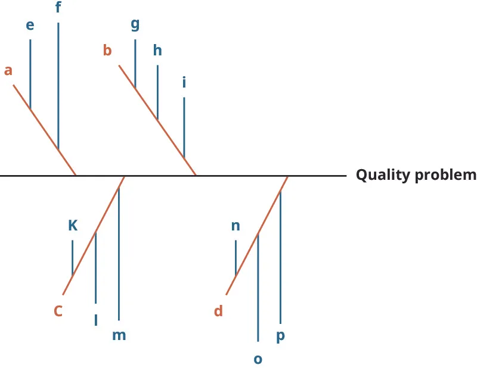
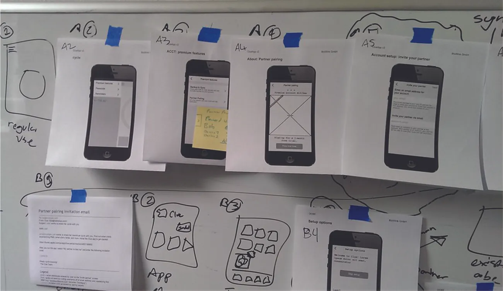
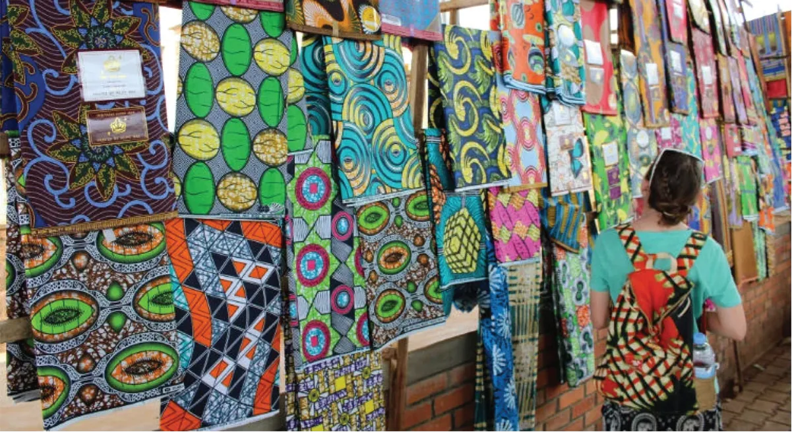

## 6.2   Quy trình giải quyết vấn đề sáng tạo

Một phần nội dung trong mục này dựa trên công trình gốc của Geoffrey Graybeal và được thực hiện với sự hỗ trợ của Rebus Community. Bản gốc được cung cấp miễn phí theo giấy phép CC BY 4.0 tại [https://press.rebus.community/media-innovation-and-entrepreneurship/](https://press.rebus.community/media-innovation-and-entrepreneurship/).

> **🎯 Mục tiêu học tập**
>
> Khi học xong mục này, bạn sẽ có thể:
>
> - Mô tả năm bước trong quy trình giải quyết vấn đề sáng tạo
> - Xác định và mô tả các công cụ giải quyết vấn đề sáng tạo phổ biến

Sự sáng tạo có thể là một đặc điểm quan trọng của doanh nhân, như chương [Creativity, Innovation, and Invention](4-introduction) đã thảo luận. Trong phần đó, chúng ta đã tìm hiểu vai trò của sáng tạo trong *đổi mới*. Tại đây, chúng ta sẽ xem xét sâu hơn vai trò của sáng tạo trong *giải quyết vấn đề*. Trước hết, hãy chính thức định nghĩa **sự sáng tạo** là việc phát triển các ý tưởng nguyên gốc để giải quyết một vấn đề. Mục tiêu của việc trở thành doanh nhân là thoát khỏi các chuẩn mực thực dụng và sử dụng trí tưởng tượng để đón nhận những giải pháp nhanh chóng và hiệu quả cho một vấn đề đang tồn tại, thường là bên ngoài môi trường doanh nghiệp.

### Các bước của quy trình giải quyết vấn đề sáng tạo

Rèn luyện bản thân để tư duy như một doanh nhân có nghĩa là học các bước để đánh giá một thách thức: làm rõ, hình thành ý tưởng, phát triển, triển khai và đánh giá ([Hình 6.9](6-2-creative-problem-solving-process#OSX_Eship_06_02_CPSolve)).

*Hình 6.9: Quá trình sáng tạo không phải là ngẫu nhiên; đó là một quy trình cụ thể và có logic, bao gồm cả đánh giá. Doanh nhân lặp lại quy trình sáng tạo cho đến khi đạt được một giải pháp thành công. (attribution: Copyright Rice University, OpenStax, under CC BY NC-SA 4.0 license)*

#### Bước 1: Làm rõ

**Làm rõ** là bước then chốt trong việc nhận diện sự tồn tại của khoảng cách giữa trạng thái hiện tại và trạng thái mong muốn. Điều này cũng có thể được hiểu là có **nhận thức nhu cầu**, tức khi doanh nhân nhận ra khoảng cách giữa nhu cầu của xã hội hoặc khách hàng với hoàn cảnh thực tế. Làm rõ vấn đề bằng cách trao đổi với khách hàng và xây dựng một mô tả chi tiết về vấn đề sẽ đưa các đặc điểm cụ thể của vấn đề ra ánh sáng. Không xác định được những chi tiết đó sẽ khiến doanh nhân rơi vào nhiệm vụ bất khả thi là giải quyết một vấn đề mơ hồ, tức một vấn đề hoàn toàn chưa được biết đến hoặc chưa được nhìn thấy. Để tạo lập và duy trì uy tín, doanh nhân phải làm rõ vấn đề bằng cách tập trung vào giải quyết chính vấn đề đó, chứ không phải chỉ xử lý một triệu chứng của vấn đề.

Ví dụ, một nông trại có thể bị ô nhiễm nguồn nước, nhưng chỉ giải quyết vấn đề trên riêng nông trại đó là chưa đủ. Việc làm rõ sẽ đòi hỏi xác định được nguồn gốc ô nhiễm để có thể xử lý vấn đề một cách đầy đủ. Sau khi hiểu được vấn đề, doanh nhân nên bắt đầu xây dựng kế hoạch nhằm loại bỏ khoảng cách đó. **Sơ đồ xương cá**, như thể hiện trong [Hình 6.10](6-2-creative-problem-solving-process#OSX_Eship_06_02_Fishbone), là một công cụ có thể được dùng để xác định nguyên nhân của loại vấn đề này.

*Hình 6.10: Một vấn đề về chất lượng có các nguyên nhân chính, ở đây được ký hiệu là a, b, c và d. Trong mỗi nguyên nhân chính đó lại có một số nguyên nhân khác có thể cần được xử lý để giải quyết vấn đề chất lượng. Mục tiêu của sơ đồ xương cá là tìm ra các nguyên nhân gốc rễ của vấn đề chất lượng. (attribution: Copyright Rice University, OpenStax, under CC BY NC-SA 4.0 license)*

Trong ví dụ ô nhiễm nước của chúng ta, một sơ đồ xương cá dùng để khám phá vấn đề có thể cho thấy các hạng mục được trình bày trong [Hình 6.11](6-2-creative-problem-solving-process#OSX_Eship_06_02_Fishbone2).

![Fishbone diagram showing farm water pollution as the main horizontal line. Causes include livestock (with secondary causes of overgrazing, and manure and animal waste), pesticides and fertilizer (with secondary causes of irrigation carried to river streams and algal blooms that deplete oxygen and harm aquatic life), soil erosion (with secondary causes of inefficient farming practices, soil buildup in streams, and wind and water erosion), and other chemicals (with a secondary cause of industrial and agricultural waste).](../assets/img-6-2-3.webp)

*Hình 6.11: Ô nhiễm nước tại nông trại có thể có bốn nguyên nhân chính, như chăn nuôi, thuốc trừ sâu và phân bón, xói mòn đất và các hóa chất khác. Với mỗi nguyên nhân chính đó lại có thêm những nguyên nhân liên quan khác. (attribution: Copyright Rice University, OpenStax, under CC BY NC-SA 4.0 license)*

#### Bước 2: Hình thành ý tưởng

**Hình thành ý tưởng** là bước của quy trình giải quyết vấn đề sáng tạo liên quan đến việc doanh nhân tạo ra và triển khai chi tiết các ý tưởng. Sau khi thu thập tất cả thông tin liên quan đến vấn đề, doanh nhân liệt kê càng nhiều nguyên nhân của vấn đề càng tốt. Đây là bước tạo ra sự đa dạng lớn nhất về ý tưởng. Mỗi ý tưởng phải được đánh giá về tính khả thi và chi phí với tư cách là một giải pháp cho vấn đề. Chẳng hạn, nếu một nông trại không có nước sạch, doanh nhân phải liệt kê các nguyên nhân gây ra nguồn nước độc hại và loại bỏ càng nhiều nguyên nhân trong số đó càng tốt. Sau đó doanh nhân phải tiếp tục nghiên cứu các giải pháp để đưa nguồn nước trở lại trạng thái an toàn. Ví dụ, nếu gia súc ở gần đang làm ô nhiễm nước, thì cần tách đàn gia súc ra khỏi nguồn nước.

#### Bước 3: Phát triển

**Phát triển** là bước trong đó doanh nhân lấy danh sách ý tưởng đã tạo ra và kiểm tra tính khả thi của từng giải pháp. Doanh nhân phải cân nhắc chi phí của từng ý tưởng cũng như những trở ngại trong quá trình triển khai. Trong ví dụ trước, việc thêm hóa chất vào nước có thể không phải là giải pháp khả thi đối với người nông dân. Không phải người nông dân nào cũng muốn thêm chloride hoặc fluoride vào nước vì ảnh hưởng của chúng đến cả con người lẫn vật nuôi. Những đánh đổi này cần được xử lý trong quá trình đánh giá tính khả thi. Người nông dân có thể thích một hệ thống lọc hơn, nhưng chi phí của giải pháp đó có thể không thực tế. Doanh nhân nên xác định và đánh giá các giải pháp thay thế để tìm ra phương án vừa hiệu quả về chi phí vừa khả thi nhất đối với khách hàng.

#### Bước 4: Triển khai

**Triển khai** là bước trong đó giải pháp cho vấn đề được kiểm thử và đánh giá. Doanh nhân cùng khách hàng đi qua kế hoạch triển khai đã định và kiểm tra từng phần của giải pháp, nếu đó là một dịch vụ, hoặc kiểm tra kỹ lưỡng một hàng hóa đã phát triển. Doanh nhân triển khai giải pháp và thực hiện một hệ thống theo dõi có cấu trúc để bảo đảm giải pháp vẫn hiệu quả và khả thi. Trong ví dụ về nước, giải pháp sẽ là giảm dòng chảy tràn từ thuốc trừ sâu độc hại bằng cách bổ sung các dải cỏ đồng cỏ, vùng đệm cỏ và thảm thực vật dọc theo bờ suối.

#### Bước 5: Đánh giá

**Đánh giá (evaluate)** là bước trong đó giải pháp cuối cùng được xem xét. Đây là một bước rất quan trọng mà doanh nhân thường bỏ qua. Bất kỳ sai sót nào trong quá trình triển khai sản phẩm hoặc dịch vụ đều được đánh giá lại, và các giải pháp mới sẽ được đưa vào thực hiện. Có thể cần một quá trình kiểm thử liên tục để tìm ra giải pháp cuối cùng. Trong ví dụ về nước ở nông trại, các dải cỏ đồng cỏ, vùng đệm cỏ và thảm thực vật dọc bờ suối được lựa chọn sau đó cần được phân tích và kiểm thử để bảo đảm rằng giải pháp đã thực sự làm thay đổi thành phần của nguồn nước.

> **❓ Bạn đã sẵn sàng chưa?: Triển khai giải quyết vấn đề sáng tạo**
>
> Loại bỏ chất thải là một vấn đề, nhưng nó cũng có thể tạo ra một cơ hội khởi nghiệp. Hãy thử xem xét những cách mà các loại chất thải bạn thường phải trả tiền để đem đi nay có thể tạo ra doanh thu. Dù đó là tái chế lon nhôm hay bìa carton, hay rác thải có thể dùng làm thức ăn cho vật nuôi, nhiệm vụ của bạn là nghĩ ra các giải pháp cho vấn đề mang định hướng khởi nghiệp này.
>
>
> - Hãy bắt đầu bằng việc làm theo bước đầu tiên của quy trình giải quyết vấn đề sáng tạo và xác định vấn đề thật rõ ràng.
> - Tiếp theo, thu thập dữ liệu và định hình thách thức.
> - Sau đó, khám phá ý tưởng và nghĩ ra các giải pháp.
> - Xây dựng kế hoạch hành động.
> - Cuối cùng, hãy nêu rõ bạn sẽ đánh giá hiệu quả của giải pháp như thế nào.

### Sử dụng sáng tạo để giải quyết vấn đề

Doanh nhân phải đối mặt với việc giải quyết rất nhiều vấn đề khi phát triển các ý tưởng nhằm lấp đầy những khoảng trống, dù các cơ hội đó là thành lập một công ty mới hay khởi động một dự án mới trong một công ty hiện hữu. Một số vấn đề bao gồm nhân sự, tuyển dụng và quản lý nhân viên, xử lý tuân thủ pháp lý, huy động vốn, marketing và nộp thuế. Vượt ra ngoài các hoạt động thường nhật vừa nêu, doanh nhân, hoặc đội ngũ do doanh nhân xây dựng, là yếu tố không thể thiếu để duy trì sức sáng tạo liên tục đứng sau dòng sản phẩm hay dịch vụ được cung cấp. Đổi mới và sáng tạo trong doanh nghiệp là cần thiết để mở rộng dòng sản phẩm hoặc phát triển một dịch vụ mang tính đột phá.

Doanh nhân không nhất thiết phải cảm thấy cô lập khi đi tìm các giải pháp sáng tạo cho một vấn đề. Có nhiều cộng đồng, công cụ và phương pháp mới sẵn có để khơi dậy sức sáng tạo của doanh nhân, từ đó hỗ trợ thêm cho sự thành công và mở rộng của một dự án mới.[^14] Việc học và sử dụng các phương pháp khởi nghiệp để giải quyết vấn đề giúp giảm bớt căng thẳng mà nhiều chủ startup cảm nhận. Sự sáng tạo của doanh nhân sẽ tăng lên khi sử dụng **các phương pháp hợp tác**. Một số phương pháp hợp tác trong khởi nghiệp bao gồm crowdsourcing, brainstorming, storyboarding, tiến hành các khảo sát nhanh trực tuyến để kiểm tra ý tưởng và khái niệm, cùng các hoạt động sáng tạo theo nhóm.

#### Huy động trí tuệ đám đông

Giáo sư Daren **Brabham** tại Đại học Nam California đã viết sách về crowdsourcing và nhấn mạnh tiềm năng của nó trong cả khu vực kinh doanh vì lợi nhuận lẫn phi lợi nhuận. Ông định nghĩa một cách đơn giản đây là “một mô hình trực tuyến, phân tán, dùng để giải quyết vấn đề và sản xuất.”[^15] **Huy động trí tuệ đám đông** liên quan đến các nhóm người không chuyên và không phải chuyên gia cùng làm việc để hình thành một giải pháp cho vấn đề.[^16] Như Jennifer **Alsever** của cbsnews.com đã diễn đạt, ý tưởng ở đây là “khai thác trí tuệ tập thể của công chúng nói chung để hoàn thành các công việc liên quan đến kinh doanh mà thông thường công ty tự thực hiện hoặc thuê một bên thứ ba. Tuy nhiên, lao động miễn phí chỉ là một phần nhỏ trong sức hấp dẫn của crowdsourcing. Quan trọng hơn, nó cho phép các nhà quản lý mở rộng quy mô nguồn nhân lực tài năng đồng thời hiểu sâu hơn điều khách hàng thực sự mong muốn. Thách thức là phải tiếp cận một cách thận trọng với ‘trí tuệ đám đông’, vì nó có thể dẫn đến tâm lý ‘bầy đàn’."[^17]

> **🔗 Liên kết học tập**
>
> Hãy đọc [bài viết này về crowdsourcing, cách sử dụng và lợi ích của nó](https://openstax.org/l/52CrowdSource) để biết thêm thông tin.

Mẫu hình kinh doanh mới này, tương tự outsourcing, cho phép một doanh nghiệp đăng một vấn đề lên mạng và mời các tình nguyện viên xem xét vấn đề đó rồi đề xuất giải pháp. Tình nguyện viên nhận được phần thưởng, chẳng hạn tiền thưởng, vật phẩm quảng bá như áo thun, tiền bản quyền từ các sản phẩm sáng tạo như ảnh hoặc thiết kế, và trong một số trường hợp là thù lao cho công sức lao động của họ. Trước khi đề xuất giải pháp, tình nguyện viên được biết rằng các giải pháp đó sẽ trở thành tài sản trí tuệ của startup đăng vấn đề. Giải pháp sau đó được startup đăng vấn đề sản xuất hàng loạt để kiếm lợi nhuận.[^18] Quy trình này phát triển thành quy trình crowdsourcing sau khi doanh nghiệp sản xuất hàng loạt và thu lợi từ lao động của các tình nguyện viên và của nhóm. Doanh nhân nên nhận ra rằng những đám đông chưa được khai thác này có lời giải cho nhiều vấn đề mà các chương trình hành động hiện tại còn chưa chạm tới. Huy động trí tuệ đám đông có thể khai thác những hướng đi đó và bổ sung vào bộ công cụ dùng để kích thích sức sáng tạo cá nhân. Đây là một kiểu đổi mới được hoạch định và triển khai có chủ đích để tạo lợi nhuận.

Ví dụ, **Bombardier** đã tổ chức một cuộc thi đổi mới bằng crowdsourcing để thu thập ý tưởng về tương lai của nội thất tàu hỏa, bao gồm thiết kế ghế và khoang hành khách hạng phổ thông. Một hội đồng giám khảo của doanh nghiệp đã chấm các bài dự thi, trong đó mười bài tốt nhất nhận được máy tính hoặc tiền thưởng. Tuy nhiên, các công ty thường bị ràng buộc bởi những quy định nội bộ hạn chế nguồn ý tưởng mã nguồn mở hoặc nguồn ý tưởng bên ngoài, vì họ có thể bị cáo buộc là “đánh cắp” ý tưởng. Dù crowdsourcing bên ngoài lĩnh vực phần mềm có thể gặp khó khăn, một số sản phẩm như máy in 3D của **MakerBot**, máy bay không người lái của **3DR’** và Social Robot của **Jibo** đã sử dụng các bộ công cụ cho nhà phát triển và cộng đồng “maker” để giúp xây dựng cộng đồng và kích thích đổi mới từ bên ngoài.

> **📝 Thực hành: Một loại khoai tây chiên do crowdsourcing tạo ra**
>
> Nhằm tăng doanh số trong nhóm khách hàng millennials, **PepsiCo** đã sử dụng crowdsourcing để lấy ý tưởng hương vị mới cho khoai tây chiên Lay’s của họ (ở Anh gọi là Walker’s). Chiến dịch năm 2012 của họ, “Do Us a Flavor,” thành công đến mức nhận được hơn 14 triệu bài gửi về. Hương vị chiến thắng là Cheesy Garlic Bread, giúp doanh số khoai tây chiên của họ tăng 8 phần trăm trong ba tháng đầu sau khi ra mắt.
>
>
> - Những sản phẩm nào khác sẽ phù hợp với một cuộc thi chiến dịch crowdsourcing?
> - Những loại sản phẩm nào sẽ không phù hợp?

**Amazon**’s **Mechanical Turk** là một nền tảng crowdsourcing trực tuyến cho phép cá nhân đăng các nhiệm vụ để người lao động hoàn thành. Trong nhiều trường hợp, những nhiệm vụ này được trả công, nhưng mức trả có thể dưới một đô la cho mỗi mục hoàn thành. Mechanical Turk là một trong những nền tảng crowdsourcing lớn nhất và nổi tiếng nhất, nhưng cũng có một số nền tảng ngách khác phù hợp với các thị trường nhỏ hơn. Trong trường hợp các cuộc thi đổi mới và các nhiệm vụ thuê ngoài từ doanh nghiệp, những nhiệm vụ đó cũng có thể được tổ chức nội bộ trong chính doanh nghiệp.

#### Động não

**Động não** là việc tạo ra ý tưởng trong một môi trường không phán xét hoặc bất đồng với mục tiêu tạo ra giải pháp. Hãy xem lại [Creativity, Innovation, and Invention](4-introduction) để ôn lại kỹ thuật này. Động não nhằm kích thích người tham gia suy nghĩ về giải quyết vấn đề theo một cách mới. Việc sử dụng một nhóm đa chức năng, tức những người tham gia đến từ các bộ phận khác nhau và có các bộ kỹ năng khác nhau, tạo cho doanh nhân và nhóm hỗ trợ một cơ hội thực sự để đề xuất rồi hiện thực hóa ý tưởng. Nhóm cùng nhau tinh chỉnh và tạo mẫu thử cho những giải pháp khả dĩ của vấn đề.

> **🔗 Liên kết học tập**
>
> Động não là một kỹ thuật được nghiên cứu kỹ lưỡng và thường xuyên được thực hành để phát triển các giải pháp đổi mới. Một trong những đơn vị sử dụng brainstorming thành công nhất là **United Nations Children’s Fund (UNICEF)**. UNICEF phải đối mặt với những vấn đề đặc thù trong việc giải quyết tình trạng thiếu hụt nguồn lực cho bà mẹ và trẻ em tại các quốc gia kém phát triển. Hãy xem [UNICEF thực hành brainstorming để giải quyết các vấn đề](https://openstax.org/l/52UNICEFbrain) như sự sống còn của trẻ em, hòa nhập giới, khủng hoảng người tị nạn, giáo dục và nhiều vấn đề khác.

Bối cảnh của một buổi brainstorming nên được giữ càng không chính thức và thư giãn càng tốt. Nhóm cần tránh những giải pháp theo lối mòn. Mọi ý tưởng đều được chào đón, được liệt kê và xem xét mà không kiểm duyệt, cũng không bị ràng buộc bởi các giới hạn hành chính. Mọi thành viên trong nhóm đều có tiếng nói ngang nhau. Trọng tâm của brainstorming là số lượng ý tưởng hơn là lời giải lý tưởng trong từng đề xuất. Một hoạt động brainstorming kinh điển trong khởi nghiệp, được phổ biến bởi nhà phát triển phần mềm kinh doanh **Strategyzer**, được gọi là bài tập “con bò ngớ ngẩn”. Các nhóm đưa ra ý tưởng cho những mô hình kinh doanh mới liên quan đến một con bò, với kết quả thường rất kỳ quặc, từ bò có tài trợ đến vuốt ve bò để trị liệu tinh thần. Người tham gia được yêu cầu xác định một khía cạnh nào đó của con bò rồi phát triển ba mô hình kinh doanh xoay quanh khái niệm đó trong một khoảng thời gian ngắn, thường là hai phút hoặc ít hơn. Hoạt động này được thiết kế để khơi dòng chảy sáng tạo.

> **🔗 Liên kết học tập**
>
> Hãy xem [video của ABC’s Nightline cho thấy cách IDEO thiết kế một xe đẩy hàng mới](https://openstax.org/l/52IDEOshopcart) như một ví dụ về quy trình thiết kế có sử dụng brainstorming.

#### Xây dựng bảng phân cảnh

**Xây dựng bảng phân cảnh** là quá trình trình bày một ý tưởng dưới dạng đồ họa theo từng bước, như [Hình 6.12](6-2-creative-problem-solving-process#OSX_Eship_06_02_Storyboard) cho thấy. Công cụ này hữu ích khi doanh nhân đang cố gắng hình dung một giải pháp cho vấn đề. Các bước đi tới lời giải của một vấn đề được phác thảo và treo lên dưới định dạng đồ họa. Khi đồ họa ban đầu đã được đặt ra, hình ảnh của các bước hướng tới lời giải sẽ liên tục được thêm vào, bớt đi và sắp xếp lại cho đến khi giải pháp cuối cùng xuất hiện trong định dạng đồ họa cuối cùng. Trong nhiều năm, doanh nhân đã sử dụng quy trình này để tạo ra bản tiền hình dung cho nhiều chuỗi phương tiện truyền thông khác nhau.

*Hình 6.12: Xây dựng bảng phân cảnh giúp doanh nhân và các thành viên trong nhóm thể hiện trực quan các bước trong việc tạo ra sản phẩm và giải quyết vấn đề. (credit: “Clue storyboarding” by Adam Wiggins/Flickr, CC BY 2.0)*

#### Sáng tạo nhóm

**Sáng tạo nhóm** là quá trình trong đó doanh nhân làm việc với một nhóm để tạo ra một giải pháp bất ngờ cho một vấn đề hoặc thách thức. Nhóm đi qua cùng một quy trình giải quyết vấn đề sáng tạo như đã mô tả: làm rõ, hình thành ý tưởng, phát triển, triển khai và đánh giá. Lợi thế chính của sáng tạo theo nhóm là sự hợp tác và hỗ trợ mà các thành viên dành cho nhau. Những nhóm xuất sắc tin tưởng lẫn nhau, có thành viên đa dạng với các quan điểm đa dạng, có tính gắn kết và có sự ăn ý.

Các thành viên trong nhóm nên làm việc trong một môi trường không căng thẳng và thư giãn. Việc củng cố và mở rộng ý tưởng trong môi trường nhóm sẽ thúc đẩy cả nhóm liên tục mở rộng chân trời hướng tới lời giải cho vấn đề. Một ý tưởng nhỏ trong nhóm có thể châm ngòi trí tưởng tượng của một thành viên để tạo ra một ý tưởng nguyên gốc. Mark **Zuckerberg**, đồng sáng lập **Facebook**, từng nói: “Điều quan trọng nhất đối với bạn, với tư cách một doanh nhân đang cố gắng xây dựng điều gì đó, là bạn cần xây dựng một đội ngũ thật tốt. Và đó là điều tôi dành toàn bộ thời gian của mình cho nó.”[^19]

> **💼 Doanh nhân thực chiến: Taaluma Totes20**
>
> Hai doanh nhân trẻ Jack **DuFour** và Alley **Heffern** bắt đầu chú ý đến những loại vải đẹp đến từ các quốc gia khác nhau mà họ ghé thăm. Họ suy nghĩ xem có thể làm gì với những loại vải đó để tạo ra cơ hội việc làm cả ở quốc gia nơi vải có nguồn gốc lẫn tại căn cứ quê nhà của họ ở Virginia. Họ quyết định thử làm túi tote từ các loại vải mình tìm được và thành lập **Taaluma Totes** ([Hình 6.13](6-2-creative-problem-solving-process#OSX_Eship_06_02_Totes)). DuFour và Heffern cũng muốn thúc đẩy việc sản xuất các loại vải này và giúp những cộng đồng chưa được phục vụ đầy đủ ở các quốc gia nơi vải xuất xứ có thể duy trì cuộc sống hoặc theo đuổi ước mơ.
>
>
>
> 
>
> *Hình 6.13: Bức ảnh này được chụp bởi một du khách, Kelsey Friedman, người từng du học tại Rwanda thông qua chương trình International Business in Lugano: Combining Theory and Practice của Virginia Tech. (credit: photo provided by Taaluma Totes)*
>
>
>
> Nhóm tiếp tục thử nghiệm quy trình và thu thập những loại vải nguyên bản, rồi gửi chúng đến Virginia để làm túi tote. Họ đào tạo những người khuyết tật ở Virginia sản xuất các túi tote này, qua đó phục vụ cộng đồng tại Hoa Kỳ. Sau đó, các doanh nhân quyết định trích 20 phần trăm lợi nhuận để cho nông dân và chủ doanh nghiệp nhỏ ở các quốc gia nơi vải có nguồn gốc vay vi mô nhằm tạo việc làm tại đó. **Microloans** là các khoản vay nhỏ, dưới 50.000 USD, do một số bên cho vay cung cấp cho những startup năng động. Vì nhiều lý do khác nhau (chẳng hạn ở quốc gia nghèo hoặc ở mức nghèo), các startup này không thể tiếp cận khoản vay truyền thống từ ngân hàng lớn. Các bên cho vay hỗ trợ kinh doanh cho người vay, từ đó giúp họ có khả năng hoàn trả khoản vay vi mô. Các khoản vay vi mô từ Taaluma được hoàn trả khi người vay có thể. Khoản hoàn trả này được dùng để mua thêm vải, hoàn tất mong muốn phục vụ đồng thời hai nhóm dân cư của Taaluma. Nếu quy trình tỏ ra không thành công, hai đồng sáng lập sẽ điều chỉnh nó để đáp ứng các yêu cầu của kế hoạch.
>
>
>
> Hiện nay, DuFour và Heffern có các loại vải đến từ hàng chục quốc gia, từ Thái Lan đến Ecuador. Các túi tote được chuyên biệt hóa với những đặc điểm phù hợp nhu cầu cá nhân. Dòng sản phẩm được đổi mới thường xuyên, và Taaluma Totes phục vụ hai mục đích song song: tạo việc làm cho người khuyết tật ở Virginia và tạo cơ hội việc làm cho các cộng đồng chưa được phục vụ đầy đủ ở những quốc gia khác.
