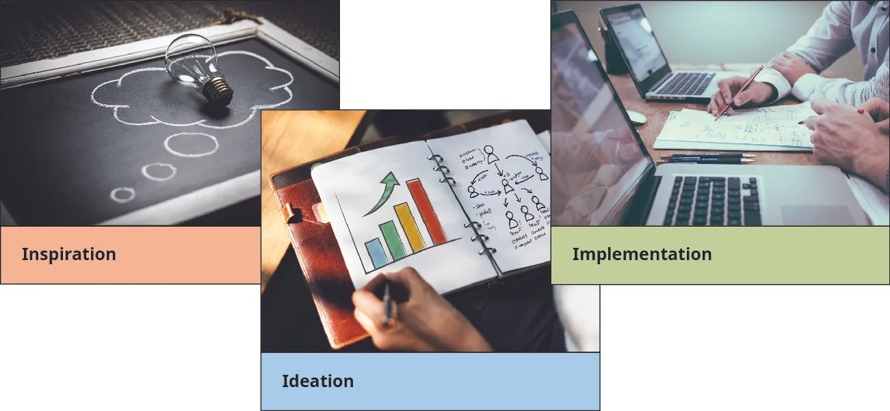

## 6.3   Tư duy thiết kế

Một phần nội dung trong mục này dựa trên công trình gốc của Geoffrey Graybeal và được thực hiện với sự hỗ trợ của Rebus Community. Bản gốc được cung cấp miễn phí theo giấy phép CC BY 4.0 tại [https://press.rebus.community/media-innovation-and-entrepreneurship/](https://press.rebus.community/media-innovation-and-entrepreneurship/).

> **🎯 Mục tiêu học tập**
>
> Khi học xong mục này, bạn sẽ có thể:
>
> - Giải thích quy trình tư duy thiết kế
> - Thảo luận về một số công cụ tư duy thiết kế

David **Kelley**, nhà sáng lập Trường Thiết kế của Đại học Stanford và đồng sáng lập công ty thiết kế **IDEO**, thường được xem là người khởi xướng tư duy thiết kế, ít nhất trong bối cảnh kinh doanh và khởi nghiệp. Bạn đã được giới thiệu sơ lược về tư duy thiết kế trong chương [Creativity, Innovation, and Invention](4-introduction), nhưng ở đây chúng ta sẽ tìm hiểu sâu hơn. IDEO hình thành từ sự sáp nhập giữa công ty của người tạo ra chuột đầu tiên cho **Apple** và công ty của nhà thiết kế máy tính xách tay đầu tiên, lần lượt là **David Kelley Design** và **ID Two**. Gần một thập kỷ sau các sáng tạo của Apple năm 1982, công ty hợp nhất năm 1991 này chủ yếu tập trung vào thiết kế sản phẩm truyền thống, từ bàn chải đánh răng đến ghế ngồi. Nhưng thêm một thập kỷ nữa, công ty ngày càng thiết kế trải nghiệm người tiêu dùng nhiều hơn là chỉ thiết kế sản phẩm tiêu dùng. Kelley bắt đầu dùng từ “thinking” để mô tả quy trình thiết kế gắn với việc tạo ra trải nghiệm khách hàng thay vì tạo ra các sản phẩm vật lý. Từ đó, thuật ngữ *design thinking* ra đời.

CEO hiện tại của IDEO, Tim **Brown**, định nghĩa tư duy thiết kế là “một cách tiếp cận lấy con người làm trung tâm và có tính hợp tác trong giải quyết vấn đề, sử dụng một tư duy được thiết kế để giải quyết các vấn đề phức tạp.”[^21] **Tư duy thiết kế** là một phương pháp tập trung các quyết định thiết kế và phát triển sản phẩm vào nhu cầu của khách hàng, thường thông qua một quy trình dựa trên sự thấu cảm nhằm xác định các vấn đề phức tạp và tạo ra các giải pháp giải quyết những vấn đề đó.

Một đặc điểm cốt lõi của tư duy thiết kế là khả năng áp dụng vượt ra ngoài studio thiết kế, vì các phương pháp và công cụ của nó đã được trình bày theo cách mà những người ngoài lĩnh vực, đặc biệt là các nhà quản lý kinh doanh, cũng có thể sử dụng. Ngày nay, thực hành thiết kế đã được mở rộng vượt khỏi phạm vi sản phẩm và đồ họa để bao gồm thiết kế tương tác số, dịch vụ, chiến lược kinh doanh và chính sách xã hội.

> **🔗 Liên kết học tập**
>
> Hãy xem [bài nói TEDGlobal năm 2009, trong đó Tim Brown mô tả tư duy thiết kế](https://openstax.org/l/52TEDTimBrown) từ góc nhìn lịch sử đến hiện đại.

### Quy trình tư duy thiết kế

Các trường kinh doanh thường giảng dạy một cách tư duy duy lý và phân tích. Cách tiếp cận này tập trung vào các mục tiêu và ràng buộc được xác định rõ, trong đó suy nghĩ đi trước hành động theo một quy trình lập kế hoạch và phân tích tuần tự. Quy trình tư duy thiết kế tiếp cận việc giải quyết vấn đề theo cách khác. Suy nghĩ và hành động thường đan xen trong một quá trình khám phá lặp đi lặp lại của “không gian” thiết kế, và chính quá trình đó mới dần bộc lộ các mục tiêu và ràng buộc, thay vì xác định chúng ngay từ đầu.

Một cách tiếp cận tư duy thiết kế được giảng dạy tại những nơi như Stanford’s Design School và các tổ chức như **LUMA Institute** (một công ty toàn cầu dạy con người cách đổi mới) là **thiết kế lấy con người làm trung tâm (HCD)**. Đúng như tên gọi, HCD tập trung vào con người trong suốt quá trình thiết kế và phát triển. Điều này phù hợp với định nghĩa tư duy thiết kế của Tim Brown. Nguồn cảm hứng cho ý tưởng đến từ việc khám phá con người thực tế, nhu cầu của họ và những vấn đề họ đang gặp phải.

*Hình 6.14: Quy trình tư duy thiết kế tập trung vào các không gian cảm hứng, hình thành ý tưởng và triển khai. (credit (left): modification of “thought idea innovation imagination” by “TeroVesalainen”/Pixabay, CC0; credit (center): modification of “document paper business chart” by “rawpixel”/Pixabay, CC0; credit (right): modification of “office business colleagues meeting” by “Free-Photos”/Pixabay, CC0)*

Ba không gian - cảm hứng, hình thành ý tưởng và triển khai - cấu thành **quy trình tư duy thiết kế** ([Hình 6.14](6-3-design-thinking#OSX_Eship_06_03_DTProcess)). Quy trình này dùng khái niệm “không gian” chứ không phải “giai đoạn” vì nhiều không gian có thể diễn ra đồng thời.

Tuy vậy, cảm hứng thường xuất hiện trước tiên. Đây là bước nhận diện một vấn đề hoặc cơ hội khiến ai đó muốn tìm kiếm giải pháp. **Hình thành ý tưởng** là quá trình tạo ra ý tưởng và giải pháp thông qua nhiều kỹ thuật khác nhau như brainstorming và phác thảo. Có hàng trăm kỹ thuật hình thành ý tưởng khác nhau. Một vài ví dụ bao gồm Top Five, How Might We, Mash-up và Co-Creation Session. Với Top Five, mỗi thành viên trong nhóm viết ra năm ý tưởng hàng đầu của mình, chia sẻ chúng và gom các ý tưởng tương đồng lại với nhau. Với How Might We, nhóm xem xét các nhận định thu được và diễn đạt lại chúng thành các câu hỏi “How Might We” bằng cách thêm cụm đó vào đầu câu. Mục tiêu là tìm ra các cơ hội thiết kế đồng thời vẫn mở ra nhiều hướng giải pháp. Mash-up là việc kết hợp các thương hiệu hoặc khái niệm có sẵn để tạo ra điều mới. Nhóm xác định những thương hiệu hoặc khái niệm thể hiện phẩm chất mà họ mong muốn trong giải pháp của mình, rồi “pha trộn” các ý tưởng đó để tạo thành một ý tưởng mới. Co-creation session đưa chính thị trường mục tiêu vào quá trình sáng tạo bằng cách mời một nhóm người thuộc thị trường đó cùng làm việc với nhóm thiết kế. Mục tiêu là nắm bắt phản hồi của họ bằng cách xem họ như những nhà thiết kế, chứ không chỉ là đối tượng phỏng vấn. Các giải pháp được triển khai phát triển từ tương tác với người dùng và từ quá trình liên tục tạo ra rồi tinh chỉnh những giải pháp khả dĩ. Tư duy thiết kế tích hợp những hiểu biết, phán đoán và trực giác dựa trên trải nghiệm từ góc nhìn của người dùng cuối, trong khi ở cách tiếp cận duy lý - phân tích, quá trình tìm lời giải thường bị chính thức hóa thành một tập hợp quy tắc.

**Nesta** là một quỹ đổi mới có trụ sở tại Vương quốc Anh, cung cấp nhiều công cụ và tài nguyên tư duy thiết kế tương tự IDEO. Tên gọi này xuất phát từ từ viết tắt NESTA của National Endowment for Science, Technology and the Arts. Tổ chức được thành lập năm 1998 bằng nguồn quỹ từ Xổ số Quốc gia Anh và trở thành tổ chức từ thiện độc lập vào năm 2012. Chiến lược của Nesta tập trung vào y tế, đổi mới trong chính phủ, giáo dục, nghệ thuật, kinh tế sáng tạo và chính sách đổi mới. Nesta đưa ra năm tiêu chí để xác định một nghề nghiệp có tính sáng tạo:[^22]

1. Quy trình mới lạ
2. Khó bị cơ giới hóa thay thế
3. Chức năng không lặp lại hoặc không đồng nhất
4. Đóng góp sáng tạo cho chuỗi giá trị
5. Bao hàm sự diễn giải chứ không chỉ đơn thuần là biến đổi dịch vụ hay hiện vật

Đúng như tên gọi, tư duy thiết kế bắt nguồn từ thiết kế. Vì thiết kế là một trong những ngành công nghiệp sáng tạo đã được xác định, nên có một mối liên hệ rõ ràng giữa các ngành công nghiệp sáng tạo và tư duy thiết kế. Trên thực tế, Nesta cung cấp các bài tập về cảm hứng và hình thành ý tưởng miễn phí cho những người muốn áp dụng thực hành tư duy thiết kế.

### Các không gian của tư duy thiết kế lấy con người làm trung tâm

**Stanford Design School** sử dụng tư duy thiết kế lấy con người làm trung tâm (HCD) làm cách tiếp cận tư duy thiết kế của mình. HCD nhấn mạnh các không gian sau của quy trình tư duy thiết kế:

- Thấu cảm: Đúng như cách tiếp cận lấy con người làm trung tâm cho thấy, việc có sự thấu cảm với vấn đề bạn đang cố giải quyết là rất quan trọng. Như chương  [Creativity, Innovation, and Invention](4-introduction)  đã định nghĩa, thấu cảm là quan sát và hòa mình vào môi trường xung quanh để tương tác với con người và hiểu trải nghiệm cũng như động lực của họ.
- Xác định vấn đề: Khía cạnh này bao gồm việc mô tả (các) vấn đề cốt lõi mà bạn và nhóm của bạn đã nhận diện. Việc đặt các câu hỏi “làm thế nào chúng ta có thể...?” giúp thu hẹp trọng tâm, bởi mục tiêu cuối cùng ở đây là xác định một phát biểu vấn đề thể hiện rõ vấn đề bạn muốn giải quyết. “Frame Your Design” là một thử thách trong bộ công cụ của  **IDEO**  rất phù hợp ở giai đoạn này. Frame Your Design yêu cầu bạn viết ra vấn đề của mình rồi tinh chỉnh nó theo các bước cụ thể để cuối cùng có được một câu hỏi thiết kế đóng vai trò điểm khởi đầu nhưng vẫn chừa chỗ cho sự sáng tạo.[^23]
- Hình thành ý tưởng: Đây là lúc bạn bắt đầu đưa ra các ý tưởng để xử lý “không gian” vấn đề mà bạn đã xác định. Có hàng trăm bài tập phục vụ quá trình hình thành ý tưởng, từ brainstorming đến “Five whys?” trong bộ công cụ của IDEO. “Five whys” là một phương pháp đặt câu hỏi trong đó nhà nghiên cứu, khi tìm thông tin để giải quyết vấn đề, đặt cho người trả lời một câu hỏi rộng rồi tiếp tục hỏi “tại sao” để đi sâu hơn vào cách nghĩ của họ. IDEO diễn giải như sau: “Bạn sẽ dùng phương pháp này khi tiến hành phỏng vấn và bắt đầu bằng những câu hỏi rất rộng như ‘Bạn có tiết kiệm được nhiều tiền không?’ hoặc ‘Mùa vụ năm nay của bạn thế nào?’ Sau đó, bằng cách hỏi tại sao năm lần, bạn sẽ nhận được những câu trả lời cốt yếu cho các vấn đề phức tạp. Đây có thể là một phương pháp rất tốt nếu bạn đang cố chạm tới gốc rễ con người và cảm xúc của một vấn đề.”[^24]
- Tạo mẫu thử: Trong không gian này, doanh nhân tạo ra và kiểm thử những phiên bản sản phẩm thu nhỏ, chi phí thấp với các tính năng hoặc lợi ích đóng vai trò giải pháp cho các vấn đề đã được xác định trước đó. Việc này có thể được thử nghiệm nội bộ giữa các nhân viên, một quá trình gọi là  *dogfooding*, hoặc thử nghiệm bên ngoài với khách hàng tiềm năng. Đây là một giai đoạn mang tính thực nghiệm.
- Kiểm thử: Nhà thiết kế tiến hành các phép thử nghiêm ngặt đối với sản phẩm hoàn chỉnh bằng những giải pháp tốt nhất đã được xác định ở không gian tạo mẫu thử.

> **🛠️ Bạn có thể làm gì?: Mỗi ngày tiến gần thêm một chút**
>
> Một số ví dụ về đồ dùng hằng ngày có thể được cải thiện nhờ tư duy thiết kế là bồn rửa đặt trên két nước bồn cầu để tái sử dụng nước rửa tay vào việc xả nước, chuông cửa có video và bóng đèn thông minh. Hãy thử nghĩ ra một cải tiến cho một vật dụng hằng ngày của bạn.

### Công cụ tư duy thiết kế

Có rất nhiều **công cụ tư duy thiết kế** nhằm hỗ trợ hoặc kích thích các hoạt động tư duy thiết kế của bạn. Chúng đến từ những tổ chức chuyên về tư duy thiết kế như IDEO và **Google Ventures**. Trong khi các phương pháp luận bao gồm quy trình và kỹ thuật, thì công cụ là những nguồn lực giúp hiện thực hóa các cách tiếp cận đó. Chúng có thể là các hoạt động hoặc các mẫu biểu hỗ trợ quá trình triển khai.

- Lưu đồ đổi mới: Một  **lưu đồ đổi mới**  mẫu có thể phác họa chi tiết của quy trình. Cái nhìn tổng quan có cấu trúc này đóng vai trò như một công cụ tổ chức trong quá trình phát triển.

- Thang câu hỏi: Một công cụ giúp bạn đặt những câu hỏi “đúng” bằng cách tinh chỉnh câu hỏi của mình ([Hình 6.15](6-3-design-thinking#OSX_Eship_06_03_QLadder)). Đặt những câu hỏi “sai” có thể dẫn tới các kết quả vô nghĩa hoặc không đầy đủ.

*Hình 6.15: Thang câu hỏi có thể giúp tinh chỉnh câu hỏi. (attribution: Copyright Rice University, OpenStax, under CC BY NC-SA 4.0 license)*

- Bộ công cụ tư duy thiết kế: Có nhiều bộ công cụ khác nhau dành cho những nhóm đối tượng cụ thể. Chẳng hạn, bộ công cụ “design thinking for educators” cung cấp các tài nguyên tư duy thiết kế liên quan đến giáo dục. Một bộ công cụ điển hình bao gồm nhiều loại tài nguyên khác nhau với các phương pháp và hướng dẫn giúp bạn đưa tư duy thiết kế vào thực tế.
- IDEO Design Kit:  **IDEO**  cung cấp miễn phí một tệp PDF dài khoảng 200 trang, “The Field Guide to Human Centered Design”, bao gồm các hoạt động về tư duy, hình thành ý tưởng, cảm hứng, triển khai và một số nghiên cứu tình huống:  [http://www.designkit.org/resources/1](http://www.designkit.org/resources/1).
- **Google Ventures**  Design Sprint: Một bài tập tư duy thiết kế kéo dài năm ngày giúp giải quyết câu hỏi thông qua thiết kế, tạo mẫu thử và kiểm thử:  [https://www.gv.com/sprint/](https://www.gv.com/sprint/).
- Bộ hướng dẫn Design Thinking Mix Tapes: Trường Thiết kế Stanford cung cấp ba “mixtape” đóng vai trò hướng dẫn cho nửa ngày làm việc với tư duy thiết kế trong các lĩnh vực thấu hiểu, thử nghiệm và hình thành ý tưởng:  [https://dschool.stanford.edu/resources/chart-a-new-course-put-design-thinking-to-work](https://dschool.stanford.edu/resources/chart-a-new-course-put-design-thinking-to-work).
- WE THINQ: Phần mềm được thiết kế để hỗ trợ cộng tác trong quản trị đổi mới:  [https://www.ideaconnection.com/software/we-thinq-258.html](https://www.ideaconnection.com/software/we-thinq-258.html).

> **💼 Doanh nhân thực chiến: BitGiving và tư duy thiết kế**
>
> Khi hai mươi hai tuổi, Ishita **Anand** đã tạo ra nền tảng **crowdfunding** xã hội trực tiếp đầu tiên của Ấn Độ, cho phép nghệ sĩ, kỹ sư và nhà sáng tạo hợp tác và gây quỹ cho các mục đích đặc biệt bằng cách xác minh các chiến dịch và cách nguồn tiền sẽ được sử dụng, đồng thời thu một tỷ lệ nhỏ trên số tiền huy động được như một khoản phí. Trong vòng năm năm kể từ khi ra đời, doanh nghiệp xã hội của cô, mang tên **BitGiving**, đã dẫn dắt nhiều nỗ lực giải quyết vấn đề thông qua thay đổi xã hội. Công ty đóng góp cho nhiều chiến dịch xã hội liên quan đến trẻ em, phụ nữ, giáo dục, sức khỏe và thiên tai, cùng nhiều lĩnh vực khác. Công ty cũng hợp tác với các tổ chức từ thiện và tổ chức khác để gây quỹ cho đội tuyển khúc côn cầu trên băng quốc gia Ấn Độ tham dự World Cup tại Kuwait và cho các nạn nhân trận động đất Nepal năm 2015 thông qua nền tảng crowdfunding cũng như các nền tảng mạng xã hội khác như **Twitter**.[^25]
>
>
>
> Là nền tảng crowdfunding xã hội đầu tiên của Ấn Độ, BitGiving thực sự hướng tới việc giải quyết các vấn đề thông qua thay đổi xã hội. Hãy mô tả một số hoạt động tư duy thiết kế có thể đã hữu ích cho Anand vào thời điểm BitGiving mới ra đời.
>
>
>
> Tính đến tháng 9 năm 2018, công ty đột ngột đóng cửa website và được cho là đã ngừng hoạt động. Mặc dù lý do thất bại chính xác không được biết rõ, một số nguyên nhân có thể là thiếu vốn, rào cản pháp lý, vấn đề quản trị hoặc lệch hướng chiến lược, thậm chí là thời điểm không phù hợp. Thất bại là điều phổ biến trong khởi nghiệp, và trên khắp thế giới thậm chí còn có những hội thảo chuyên nói về thất bại (FailCon gần giống như TED Talk của chủ đề thất bại).
>
>
> - Quy trình tư duy thiết kế có thể đã giúp BitGiving ngay từ đầu như thế nào?
