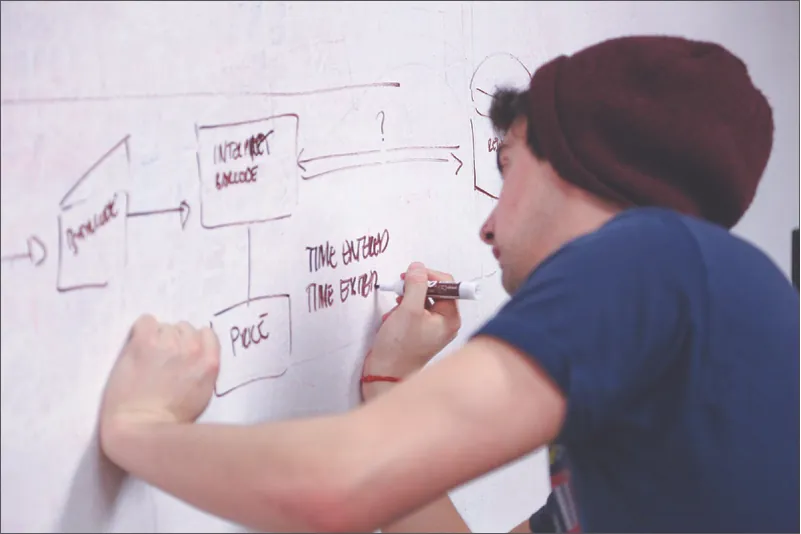
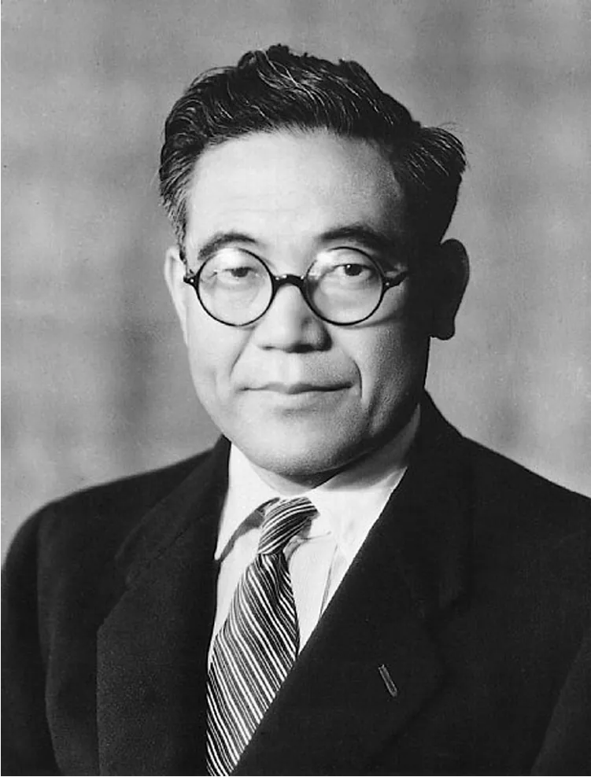

## 6.4   Quy trình tinh gọn

Một phần nội dung trong mục này dựa trên công trình gốc của Geoffrey Graybeal và được thực hiện với sự hỗ trợ của Rebus Community. Bản gốc được cung cấp miễn phí theo giấy phép CC BY 4.0 tại [https://press.rebus.community/media-innovation-and-entrepreneurship/](https://press.rebus.community/media-innovation-and-entrepreneurship/).

> **🎯 Mục tiêu học tập**
>
> Khi học xong mục này, bạn sẽ có thể:
>
> - Thảo luận về phương pháp luận của quy trình tinh gọn
> - Hiểu các giai đoạn của quy trình giải quyết vấn đề tinh gọn.

Bạn đã tìm hiểu về những cách tiếp cận giải quyết vấn đề khác nhau mà doanh nhân sử dụng để dẫn dắt startup của mình và làm việc với người khác. Phần lớn các cách tiếp cận đó liên quan đến tư duy nhận thức hoặc sáng tạo của doanh nhân. Bây giờ, chúng ta sẽ tìm hiểu một cách tiếp cận đặt nền tảng nhiều hơn vào quy trình, gọi là *quy trình tinh gọn*. Giải quyết vấn đề tinh gọn đã được sử dụng như một phương pháp luận khởi nghiệp trong các dự án mới và đang nổi, và điều đáng chú ý là nó lại bắt nguồn từ bối cảnh sản xuất quy mô lớn trong doanh nghiệp, nơi tập trung vào hiệu quả. Phương pháp **Six Sigma**, được khởi xướng tại **Motorola** vào những năm 1970 và 1980 rồi được nhiều công ty tiếp nhận, là một cách tiếp cận có kỷ luật và dựa trên dữ liệu, cung cấp cho doanh nghiệp các công cụ để nâng cao năng lực của các quy trình kinh doanh. Theo American Society for Quality, “Six Sigma xem mọi công việc như các quy trình có thể được xác định, đo lường, phân tích, cải thiện và kiểm soát. Một tập hợp công cụ định tính và định lượng được sử dụng để thúc đẩy cải tiến quy trình. Sự gia tăng hiệu suất và giảm biến thiên trong quy trình này giúp giảm lỗi và cải thiện lợi nhuận, tinh thần nhân viên cũng như chất lượng sản phẩm hoặc dịch vụ.”[^26] **GE** sao chép phương pháp này và tạo ra các chương trình “**Process Excellence**”, nơi hàng triệu nhà quản lý và người khác đã tham gia để được chứng nhận ở nhiều “đai” khác nhau. Dù Six Sigma và Process Excellence không hoàn toàn phù hợp với khởi nghiệp vì chúng chủ yếu được dùng trong các công ty lớn, trưởng thành, nhiều phương pháp trong đó vẫn phù hợp với mô hình tinh gọn.

**Toyota** là đơn vị tiên phong của quy trình tinh gọn vào thập niên 1980. Thuật ngữ “**lean manufacturing**” là cách gọi phổ biến nhất, nhưng tinh gọn còn nhiều hơn thế chứ không chỉ là sản xuất. **Quy trình tinh gọn** là một phương pháp có hệ thống nhằm tối đa hóa cải tiến liên tục và tối thiểu hóa phần vật liệu dư thừa hoặc không sử dụng trong quá trình sản xuất. Doanh nhân khởi động startup với cảm nhận rằng sản phẩm ban đầu sẽ là thứ đưa tổ chức tới thành công lâu dài. Trong đa số trường hợp, hàng hóa hay dịch vụ đó sẽ cần được điều chỉnh để duy trì một quy trình, công nghệ hoặc một đề xuất sản phẩm luôn cập nhật. Giải quyết vấn đề tinh gọn có nghĩa là toàn bộ đội ngũ của doanh nhân cùng rà soát cả môi trường bên trong lẫn bên ngoài doanh nghiệp để tìm kiếm cải tiến liên tục và các cách mang thêm doanh thu cho startup thông qua những quy trình cải thiện chi phí tạo ra giá trị bền vững. **Môi trường bên ngoài** bao gồm khách hàng, xu hướng ngành và đối thủ cạnh tranh. **Môi trường bên trong** bao gồm các yếu tố bên trong doanh nghiệp, như nhân viên, cùng các thực hành và quy trình nội bộ. Chẳng hạn trong sản xuất tinh gọn, việc cải thiện hiệu quả ở môi trường bên trong sẽ dẫn đến lợi thế ở môi trường bên ngoài (dù đó là tiết kiệm chi phí cho khách hàng, lợi thế cạnh tranh nhờ sản lượng cao hơn hay sản phẩm tốt hơn, v.v.).

Ví dụ, theo Juan Perez, giám đốc thông tin và kỹ thuật của công ty, cứ mỗi dặm được tiết kiệm mỗi ngày trên mỗi tài xế xe tải của **UPS** sẽ mang lại khoảng 50 triệu USD tiết kiệm mỗi năm. Dựa trên dữ liệu khách hàng và trí tuệ nhân tạo, công ty đã tạo ra một hệ thống có tên ORION, viết tắt của On-Road Integrated Optimization and Navigation.[^27] Đến nay, hệ thống này đã giúp UPS tiết kiệm 400 triệu USD. Khi áp dụng quy trình tinh gọn, mọi khoản UPS tiết kiệm được ở đầu vào (nhờ giảm quãng đường di chuyển) sẽ tạo ra tiết kiệm ở đầu ra, từ đó dẫn tới giao hàng nhanh hơn, chi phí thấp hơn cho người tiêu dùng và lợi nhuận cao hơn cho UPS.

### Quy trình giải quyết vấn đề tinh gọn

**Quy trình giải quyết vấn đề tinh gọn** là một chu trình gồm quan sát, giai đoạn đánh giá (assessment) và đánh giá liên tục. Như thể hiện trong [Bảng 6.1](6-4-lean-processes#fs-idm288966640), chu trình này thường bao gồm tám bước cụ thể.

**Bảng 6.1 Quy trình giải quyết vấn đề tinh gọn theo từng bước cho phép doanh nghiệp quan sát, giai đoạn đánh giá (assessment) và đánh giá liên tục.: Các bước trong quy trình giải quyết vấn đề tinh gọn của Toyota**

| Bước | Hành động |
| --- | --- |
| Bước 1 | Làm rõ vấn đề. |
| Bước 2 | Phân tích vấn đề (genchi genbutsu là thực hành của Toyota nhằm hiểu thấu đáo một tình huống bằng cách xác nhận thông tin hoặc dữ liệu thông qua quan sát trực tiếp tại nơi diễn ra tình huống đó; cụm tiếng Nhật này về cơ bản có nghĩa là “đi và xem”).[28](6-4-lean-processes#fs-idm295172800) |
| Bước 3 | Đặt mục tiêu. |
| Bước 4 | Xác định nguyên nhân gốc rễ. Việc lặp đi lặp lại câu hỏi “Tại sao?” có thể thu hẹp các yếu tố để đi tới một nguyên nhân gốc rễ. |
| Bước 5 | Xây dựng biện pháp đối phó bằng cách hỏi: “Chúng ta muốn thực hiện thay đổi cụ thể nào?” và lôi cuốn người khác tham gia vào quá trình giải quyết vấn đề. |
| Bước 6 | Triển khai các biện pháp đối phó và theo đuổi chúng đến cùng. |
| Bước 7 | Theo dõi kết quả. |
| Bước 8 | Chuẩn hóa những quy trình thành công. Giải quyết vấn đề tinh gọn là quá trình hiểu sâu hơn chính vấn đề đó và các nguyên nhân sâu xa của nó trong bối cảnh cụ thể. |

> **❓ Bạn đã sẵn sàng chưa?: Quá nhiều, quá muộn?**
>
> Nhiều doanh nhân tạo ra một startup từ một ý tưởng mà họ phát triển mà không nhận bất kỳ phản hồi nào từ khách hàng tiềm năng, chỉ dựa vào kiến thức hay giả định của chính mình về thị trường. Hãy xem câu chuyện của Rapid SOS: [https://hbr.org/2018/05/do-entrepreneurs-need-a-strategy](https://hbr.org/2018/05/do-entrepreneurs-need-a-strategy). Điều gì nhiều khả năng sẽ xảy ra khi họ quyết định tiếp tục triển khai sản phẩm của mình? Liệu nó có phù hợp với nhu cầu khách hàng hay giải quyết được vấn đề của họ không? Quy trình tinh gọn khác với cách làm này như thế nào?

### Các giai đoạn của giải quyết vấn đề tinh gọn

**Quan sát** là giai đoạn trong đó doanh nhân nghiên cứu thách thức và ghi nhận mọi khía cạnh của thách thức cần được giải quyết. Ở giai đoạn này, doanh nhân đặt câu hỏi và tiến hành nghiên cứu về sự thay đổi cần thiết để tạo ra một sản phẩm, kết quả hoặc dịch vụ thành công. Doanh nhân phải xác định vì sao sự thay đổi đó là cần thiết. Mục đích của nỗ lực này là gì? Phản hồi đặc biệt quan trọng ở giai đoạn này.

Ví dụ, một cộng đồng đã nhờ một nhóm doanh nhân giúp giải quyết vấn đề béo phì ở thanh thiếu niên tại một trường trung học cơ sở. Các doanh nhân bắt đầu nghiên cứu lượng thực phẩm mà trẻ em nạp vào và xác định rằng cả nội dung thực đơn bữa trưa ở trường lẫn lối sống của phần lớn trẻ em đều ảnh hưởng đến tỷ lệ béo phì trong cộng đồng. Sau đó, họ xác định mục tiêu của dự án là tìm ra một cách ít tốn kém và ít rủi ro để thay đổi thực đơn bữa trưa, đồng thời thống nhất rằng kết quả chính sẽ là giảm 30 phần trăm tỷ lệ béo phì của trẻ. Họ bắt đầu giai đoạn đánh giá (assessment) chi phí của việc thay đổi thực đơn bữa trưa và quan sát xem bọn trẻ còn ăn gì khác. Họ phát hiện rằng việc thay đổi thực đơn đủ để giảm tỷ lệ béo phì vượt quá khả năng tài chính của học khu. Nghiên cứu cũng cho thấy nhiều em, là con của các gia đình đơn thân, thường ăn bữa tối gồm đồ ăn mang đi nhiều calo và nhiều chất béo. Quan sát sâu hơn còn cho thấy trẻ không tham gia hoạt động thể chất sau giờ học vì khu vực xung quanh không an toàn. Cộng đồng cần một quy trình để chuyển biến sức khỏe của trẻ em, và các doanh nhân đã khuyến nghị sử dụng cách tiếp cận quy trình tinh gọn để giúp các em nhanh nhất có thể.

Sau giai đoạn quan sát vấn đề là **giai đoạn đánh giá (assessment)**, giai đoạn mà doanh nhân thử nghiệm và phân tích quy trình tiềm năng cùng năng lực của nó. Doanh nhân tận dụng các công cụ và nguồn lực sáng tạo để đi đến giải pháp, đồng thời đánh giá từng bước của một giải pháp khả dĩ. Mỗi bước phải tạo ra giá trị cho giải pháp; nếu không thì bước đó là không cần thiết. Ngoài ra, bước đó phải có khả năng giải quyết vấn đề và tăng tính linh hoạt cho giải pháp. Quy trình hoặc sản phẩm đang được cải thiện như thế nào? Trong giai đoạn này, một nguyên mẫu của sản phẩm được phát triển và đưa ra. Doanh nhân phải hỏi khách hàng xem nguyên mẫu đó đã đáp ứng đầy đủ các nhu cầu và mong muốn hay chưa. Nếu nguyên mẫu đang được phát triển để sản xuất hàng loạt, việc khảo sát khách hàng về khả năng tiêu thụ là rất thiết yếu. Trong ví dụ về bữa trưa học đường, hệ thống trường học sẽ là khách hàng của thực đơn thức ăn mới (nguyên mẫu) ở giai đoạn đánh giá (assessment).

**Giai đoạn đánh giá (evaluation)** là giai đoạn trong đó các hành vi được phân tích để đánh giá mức độ thành công. Doanh nhân liên tục nghiên cứu từng giai đoạn của giải pháp để quan sát mức độ hiệu quả của các kết quả mà khách hàng mong muốn. Doanh nhân bảo đảm rằng sự chuyển đổi được xây dựng thành các thói quen của nhà trường nhằm đạt được, duy trì và phát triển các kết quả mong muốn.

Trong một ví dụ thực tế về doanh nghiệp áp dụng quy trình tinh gọn, **New Balance Company**, đơn vị thiết kế và sản xuất cả giày thể thao lẫn giày thường ngày, vào đầu những năm 2000 đã sử dụng phương pháp sản xuất theo lô, tổ chức sản xuất theo từng bộ phận, nghĩa là toàn bộ khâu cắt diễn ra ở một bộ phận, toàn bộ khâu may diễn ra ở bộ phận khác, v.v. Mặc dù việc gom tác vụ theo lô có vẻ như sẽ cải thiện hiệu quả, nhưng tại New Balance, điều đó khiến thời gian sản xuất một đôi giày kéo dài tới chín ngày. Các lãnh đạo quan sát thấy những đống hàng tồn nằm giữa các tầng và các bộ phận, đồng thời nhận ra nhân viên phải chờ đợi do sự chậm trễ trong dây chuyền sản xuất. Họ cũng nhận thấy cơ cấu trả lương góp phần tạo ra những đống bán thành phẩm vì nhân viên được trả công theo sản phẩm, điều này khuyến khích họ làm ra càng nhiều càng tốt.

Công ty đã áp dụng các nguyên tắc tinh gọn để bố trí lại mặt bằng sản xuất theo dòng giá trị, tức cách tạo ra sản phẩm bằng cách chia sẻ các bước xử lý tương tự. Một phía là các sản phẩm “cut and stitch” sử dụng nguyên liệu da và lưới từ Mỹ, trong khi phía còn lại dùng các bộ phận làm sẵn từ nước ngoài cho đế, miếng lót và bộ kit. Sự thay đổi này rút ngắn thời gian làm ra một đôi giày xuống còn bốn giờ, nghĩa là các nhà máy trong nước có thể giao một số đơn hàng trong vòng hai mươi bốn giờ, trong khi đối thủ có thể cần tới 121 ngày để giao hàng khi họ thuê ngoài sản xuất sang châu Á.

Một công cụ thường dùng trong giải quyết vấn đề tinh gọn là whiteboarding ([Hình 6.16](6-4-lean-processes#OSX_Eship_06_04_Whiteboard)). **Phác thảo trên bảng trắng** là một dạng biểu diễn trực quan cho phép doanh nhân phác họa từng bước trong một quy trình để hiểu và chi tiết hóa quy trình đó. Doanh nhân vẽ từng bước trên bảng trắng bằng một sơ đồ dạng liên kết, rồi vẽ các mũi tên để chỉ ra quy trình này ảnh hưởng đến quy trình khác như thế nào. Khi nhìn thấy dòng chảy của quy trình, doanh nhân có thể nhận ra những chỗ chức năng bị lặp hoặc không nhất quán.

*Hình 6.16: Phác thảo trên bảng trắng là một kỹ thuật có thể giúp doanh nhân hình dung và phân tích các quy trình. (credit: “whiteboard man presentation write” by “StartupStockPhotos”/Pixabay, CC0)*

Ví dụ, trong một khu vườn cộng đồng, việc cất dụng cụ như cuốc và bay làm cỏ ở các nhà kho khác nhau gây lãng phí thời gian khi chuẩn bị bắt đầu quá trình làm cỏ. Những dụng cụ này nên được cất tập trung để loại bỏ những chuyến đi lại nhiều lần và thời gian bị lãng phí. Việc nhìn thấy quy trình trên bảng trắng hoặc một phương tiện khác giúp nâng cao nhận thức về cách cải thiện quy trình. Sau khi quy trình được thay đổi, nó lại được vẽ lại để tiếp tục xem xét kỹ hơn.

> **💼 Doanh nhân thực chiến: Nguồn gốc của tinh gọn**
>
> Bạn có ngạc nhiên không khi biết rằng, trong thời hiện đại, nguồn gốc của tư duy tinh gọn thường được xem là dây chuyền sản xuất của Henry Ford? Dù ngày nay chúng ta không nhất thiết coi việc chế tạo ô tô là một dự án khởi nghiệp, nhưng Henry **Ford** thực sự là một doanh nhân của thời đại ông khi ngành chế tạo ô tô mới bắt đầu. Ông không chỉ nhận ra cơ hội vốn có trong việc bán ô tô, mà còn nhận ra nhu cầu tạo ra một quy trình sản xuất ô tô hiệu quả có thể giảm chi phí và do đó giảm giá bán xe. Là doanh nhân đầu tiên kết hợp việc dùng các bộ phận thay thế lẫn nhau với hệ thống chuyển động để phát triển quy trình chế tạo, Ford có thể quay vòng hàng tồn kho rất nhanh; tuy nhiên, quy trình của Ford không thể tạo ra sự đa dạng. Thực tế, Ford từng nói về màu của mẫu Model T: “Bạn có thể chọn bất kỳ màu nào miễn là nó là màu đen.”[^29] Đó là loại sơn khô nhanh nhất; vì vậy trong nhiều năm, đó là màu duy nhất ông sử dụng.
>
>
>
> Hệ thống của Ford được xây dựng xoay quanh một sản phẩm tĩnh duy nhất. Đến thập niên 1930, khi thị trường đòi hỏi sự đa dạng về sản phẩm, công ty không được tổ chức để đáp ứng thách thức này. Kiichiro **Toyoda** ([Hình 6.17](6-4-lean-processes#OSX_Eship_06_05_Toyoda)), chủ tịch thứ hai của **Toyota Motor Corporation**, đã đến thăm nhà máy Ford ở Michigan để tìm hiểu thêm về cách họ áp dụng khái niệm dây chuyền lắp ráp. Sau khi quan sát, ông đề xuất một hệ thống sản xuất mới nhằm điều chỉnh quy mô thiết bị cho phù hợp hơn với nhiệm vụ và khối lượng công việc, đồng thời đưa vào các bước bảo đảm chất lượng ở từng công đoạn của quy trình làm việc. Cách tiếp cận của Toyoda đã chuyển trọng tâm từ máy móc sang quy trình, tối ưu hiệu quả trong khi vẫn duy trì chất lượng.
>
>
>
> 
>
> *Hình 6.17: Kiichiro Toyoda đã giới thiệu những cách mới để cải thiện quy trình. (credit: “Kiichiro Toyoda” by “Scanyaro”/Wikimedia Commons, Public Domain)*
