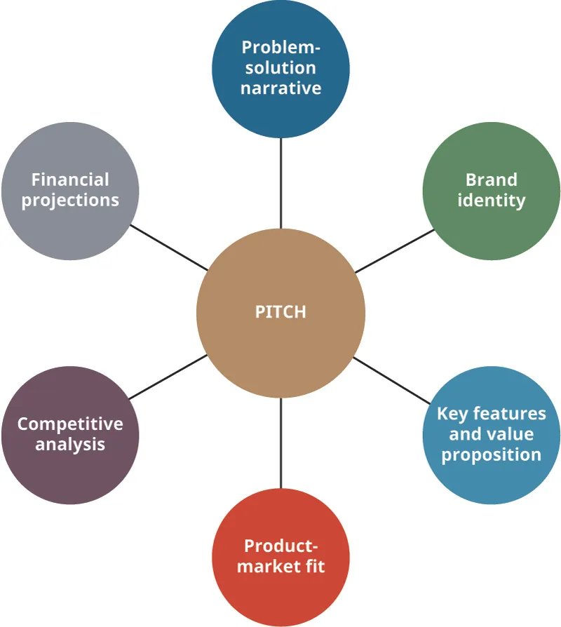

## 7.3   Phát triển các bài thuyết trình gọi vốn cho nhiều đối tượng và mục tiêu khác nhau

Một phần tài liệu trong phần này dựa trên công trình gốc của Mark Poepsel và được sản xuất với sự hỗ trợ từ Rebus Community. Bản gốc được cung cấp miễn phí theo các điều khoản của giấy phép CC BY 4.0 tại [https://press.rebus.community/media-innovation-and-entrepreneurship/](https://press.rebus.community/media-innovation-and-entrepreneurship/).

> **🎯 Mục tiêu học tập**
>
> Đến cuối phần này, bạn sẽ có thể:
>
> - Hiểu rõ các đối tượng khán giả khác nhau mà một doanh nhân có thể thuyết trình và mục tiêu pitch thay đổi ra sao đối với từng đối tượng
> - Định nghĩa và phát triển các yếu tố chính của một bài thuyết trình gọi vốn (pitch)
> - Mô tả một bộ slide pitch và những cạm bẫy cần tránh
> - Tạo ra một bài pitch ngắn (elevator pitch)

Hãy cùng xem xét kỹ hơn cách phát triển các bài pitch. Hãy nhớ rằng chúng ta đã định nghĩa **bài thuyết trình gọi vốn (pitch)** là một bài trình bày chính thức nhưng ngắn gọn được gửi đến (thường là) các nhà đầu tư tiềm năng của một startup. Vì vậy, một bài pitch được thiết kế để rõ ràng, súc tích và hấp dẫn xoay quanh các lĩnh vực chính, thường là vấn đề cốt lõi hoặc nhu cầu chưa được đáp ứng, cơ hội thị trường, giải pháp đổi mới, kế hoạch quản lý, nhu cầu tài chính và bất kỳ rủi ro nào.

Bạn sẽ thường xuyên cần xây dựng các loại bài pitch khác nhau cho những đối tượng khán giả khác nhau. Các đối tượng chính bao gồm nhà đầu tư tiềm năng, người kết nối xã hội, đối tác tiềm năng, ứng viên nhân viên quan trọng, và cộng đồng rộng lớn hơn, đặc biệt nếu người ta cần xin giấy phép hoặc các nhượng bộ từ cơ quan quản lý. Một quan niệm sai lầm về pitching là nó luôn được thực hiện trước các nhà đầu tư sẵn sàng chi vài trăm nghìn đô la cho đội ngũ trình bày ý tưởng tốt nhất trong ngày. Mặc dù đây ít nhiều là tiền đề của *Shark Tank*, nhưng đó không phải là cách pitching hoạt động đối với hầu hết các doanh nhân.[^14] Các doanh nhân có thể pitch với bạn bè và gia đình khi họ phát triển một ý tưởng, và vào một thời điểm khác, họ có thể pitch với những doanh nhân và nhà đầu tư có mối quan hệ rộng, những người ít quan tâm đến lĩnh vực thị trường đang được đề cập nhưng lại có thể tạo ra những lời giới thiệu đúng đắn hoặc các kết nối hữu ích. Doanh nhân cũng có thể thực hiện pitch trong một cái gọi là **cuộc thi pitch**, hy vọng có cơ hội nhận được tài trợ và sự cố vấn.

Các bài pitch xuất hiện dưới nhiều hình thức, nhưng điểm chung của chúng là pitch tức là *đưa ra yêu cầu một điều gì đó*. [Bảng 7.3](7-3-developing-pitches-for-various-audiences-and-goals#fs-idm524481632) cung cấp cái nhìn tổng quan về các đối tượng khán giả khác nhau mà bạn có thể pitch, nêu rõ cách tiếp cận và bài thuyết trình có thể thay đổi như thế nào đối với từng đối tượng.

**Bảng 7.3: Summary of Pitch Scenarios**

| Đối tượng khán giả | Thời lượng Pitch | Cách tiếp cận Pitch | Nội dung chính | Ghi chú |
| --- | --- | --- | --- | --- |
| Bạn bè và gia đình | Mười lăm phút | Thường là thuyết trình miệng kèm theo một bản tóm tắt một trang đơn giản giải thích ý tưởng, tuyên bố giá trị và số vốn cần thiết để khởi động doanh nghiệp | Nên bao gồm các yếu tố cơ bản của mô hình kinh doanh và ý tưởng, nhu cầu chưa được đáp ứng và giải pháp (bao gồm cả khả năng cấp bằng sáng chế), tiềm năng thị trường và bán hàng, cũng như các rủi ro ở mức độ cao | Bài pitch phổ biến này có thể mang tính cảm xúc vì các nhà sáng lập đang kêu gọi những người họ biết rõ và đang dựa vào danh tiếng cũng như sự tín nhiệm cá nhân thay vì dữ liệu chi tiết để bán ý tưởng |
| Các cuộc thi pitch ngắn | Hai đến năm phút | Thường là một bài pitch miệng hoặc một slide duy nhất tóm tắt nhu cầu, giải pháp, thị trường, cơ hội | Nên bao gồm sự đổi mới ở mức độ cao, tuyên bố giá trị và "lời kêu gọi hành động" để chốt lại với khán giả | Rất phổ biến tại các sự kiện của chương trình tăng tốc (accelerator) hoặc vườn ươm (incubator), các sự kiện khởi nghiệp của trường đại học, v.v. Giải thưởng từ các dịch vụ miễn phí đến $1,000–$2,000 |
| Giám khảo cuộc thi pitch | Năm đến mười lăm phút tùy theo địa điểm/quy tắc | Thay đổi từ thuyết trình miệng cơ bản đến bộ slide từ một đến tám slide, kết thúc bằng một "lời kêu gọi hành động"; có thể yêu cầu nêu nhu cầu vốn | Bài trình bày có thể bao gồm các slide và/hoặc video như được quy định trong quy tắc cuộc thi | Những bài này rất phổ biến và giúp doanh nhân trau chuốt bài pitch |
| Nhà đầu tư giai đoạn đầu | Mười đến hai mươi phút, tùy theo địa điểm/quy tắc | Trình bày đứng với slide và video hoặc bản demo của sản phẩm/dịch vụ | Bài trình bày có thể bao gồm slide và/hoặc video; mang tính trang trọng hơn các cuộc thi pitch với một "khoản yêu cầu (ask)" cụ thể về nhu cầu và việc sử dụng vốn | Rất phổ biến với các nhà đầu tư thiên thần; thường bộ slide được yêu cầu phải gửi trước sự kiện |
| Nhân viên | Mười đến hai mươi phút | Trình bày đứng với slide và video hoặc bản demo của sản phẩm/dịch vụ | Kết quả chính là cung cấp thông tin và truyền cảm hứng; đây có thể là một sự kiện định kỳ và nên được tổ chức thân mật | Rất phổ biến ở các startup; thường là hàng tháng cho đến khi công ty có lợi nhuận |
| Các nhóm/hiệp hội thương mại | Mười đến hai mươi phút | Trình bày đứng với slide và video hoặc bản demo của sản phẩm/dịch vụ; có thể được điều chỉnh cho phù hợp với nhóm cụ thể | Kết quả chính là cung cấp thông tin và kết nối với các nhóm quan trọng khác (nhà đầu tư, khách hàng, v.v.) | Rất phổ biến tại các hội nghị thương mại; một số có các cuộc thi pitch riêng |
| Các cơ quan cấp vốn tài trợ (như NIH, NSF) | Mười đến hai mươi phút nếu trình bày trực tiếp nhưng thường được lồng ghép trong đơn xin tài trợ | Thường dưới dạng văn bản nhưng có thể dẫn đến cuộc gặp mặt trực tiếp, tùy thuộc vào quy tắc của cơ quan | Kết quả là được "chấm điểm" để giành được nguồn vốn tài trợ; nếu không được trao thưởng, công ty có thể nộp lại đơn trong chu kỳ tài trợ tiếp theo | Các khoản tài trợ thường mang tính kỹ thuật và thường được trao cho mục đích nghiên cứu và không được sử dụng cho bất kỳ hoạt động thương mại nào |

### Đối tượng khán giả nghe Pitch

Bất kể bạn đang thuyết trình cho ai, bạn thường cần bao gồm các thông tin đề cập đến tuyên bố về vấn đề - giải pháp, tuyên bố giá trị và các tính năng chính, và cách bạn ưu tiên thông tin đó sẽ thay đổi đối với các đối tượng khán giả khác nhau. Như được hiển thị trong [Bảng 7.3](7-3-developing-pitches-for-various-audiences-and-goals#fs-idm524481632), sau khi các phần cốt lõi đó được trình bày, các bài thuyết trình khác nhau của bạn nên được điều chỉnh cho phù hợp với các "khoản yêu cầu (ask)" cuối cùng khác nhau. **khoản yêu cầu (ask)** trong một bài pitch là số tiền cụ thể, loại hỗ trợ bạn yêu cầu hoặc kết quả bạn đang tìm kiếm.

#### Nhà đầu tư

Bạn đã được giới thiệu về các loại nhà đầu tư khác nhau và sẽ tìm hiểu sâu hơn về họ trong chương [Tài chính và Kế toán Khởi nghiệp](9-introduction). Hiện tại, bạn chỉ cần biết các loại hình khác nhau để có thể bắt đầu suy nghĩ về cách các doanh nhân cấu trúc bài pitch của họ gửi đến những đối tượng này. **Nhà đầu tư cá nhân** muốn biết về đội ngũ, sản phẩm, tuyên bố giá trị và lợi tức đầu tư tiềm năng. **Nhà đầu tư thiên thần** là những cá nhân sử dụng tiền riêng của mình để đầu tư vào các công ty mà họ quan tâm. **Nhà đầu tư mạo hiểm** là những nhà đầu tư gom tiền từ những người khác và sử dụng số tiền đó để đầu tư vào các công ty.

Việc thuyết trình gọi vốn với nhiều nhà đầu tư tiềm năng mà không thành công có thể tốn thời gian và gây chán nản, nhưng trong hầu hết các trường hợp, thời gian của nhà đầu tư đáng giá hơn thời gian của những người thực hiện bài pitch. Nếu một nhà đầu tư đưa ra phản hồi, nó phải được xem xét. Bạn có thể sẽ không nhận được tất cả các câu trả lời mình cần về cách làm cho dự án của mình thành công ngay lập tức sau khi trình bày một vài bài pitch với các nhà đầu tư cá nhân và giám khảo cuộc thi pitch, nhưng nếu họ dành thời gian đưa ra lời phê bình mang tính xây dựng, hãy coi phản hồi về việc phát triển bài pitch và phong thái trình bày là một trải nghiệm có giá trị.

> **🔗 Liên kết học tập**
>
> David S. **Rose** là tác giả của cuốn Angel Investing. Hãy xem [bài thuyết trình TED Talk của David Rose](https://openstax.org/l/52TEDRose) nơi ông đưa ra lời khuyên về cách pitch với các nhà đầu tư mạo hiểm.

#### Bạn bè và Gia đình

Hãy tưởng tượng việc yêu cầu bạn bè và gia đình cấp vốn để duy trì hoạt động startup của bạn sau khi bạn đã sử dụng tối đa hạn mức thẻ tín dụng và vay một khoản vay doanh nghiệp nhỏ chỉ để chế tạo một nguyên mẫu và nhận ra rằng bạn không có đủ tiền để đưa nó ra thị trường. Một hành trình khởi nghiệp phổ biến thường bắt đầu bằng nỗ lực tự cấp vốn như thế này. Khoảng từ 50 phần trăm đến 70 phần trăm các công ty startup ở Hoa Kỳ tự huy động vốn (tiết kiệm, thẻ tín dụng, hoặc bạn bè và gia đình) cho các nhu cầu vốn ban đầu của họ.[^15][^,][^16] Ở một khía cạnh nào đó, bạn có thể được đánh giá là đáng tin cậy hơn khi có quá nhiều thứ phụ thuộc vào nỗ lực này. Tuy nhiên, bạn vẫn sẽ định hình bài pitch của mình theo cách khác khi tiếp cận bạn bè và gia đình so với khi chuẩn bị cho một nhà đầu tư. Bạn có thể sẽ làm cho giọng điệu bớt trang trọng hơn. Bạn sẽ tập trung vào tuyên bố giá trị và kết quả trước mắt của khoản vay. Bạn sẽ chỉ ra các sản phẩm chuyển giao (deliverables) hữu hình hoặc các cột mốc mà số tiền này sẽ giúp bạn đạt được, và bạn sẽ cần vẽ ra một lộ trình từ sự đóng góp này đến các khoản doanh thu có khả năng xảy ra chứ không chỉ là hy vọng nếu bạn muốn tạo cho mình cơ hội gọi vốn tốt nhất. Xin bạn bè và gia đình, ví dụ, 10.000 đô la có thể gây căng thẳng cho một cá nhân hơn là yêu cầu một nhà đầu tư cấp số tiền gấp mười lần con số đó. Bạn bè và gia đình của bạn có thể muốn đầu tư vào bạn, nhưng họ cũng sẽ muốn đưa ra quyết định với một câu chuyện hữu hình trong đầu. Bạn muốn xây dựng câu chuyện này để họ có thể nói: “Tôi đã đưa cho thành viên gia đình mình X, để họ có thể hoàn thành việc xây dựng Y, kiếm được doanh thu Z và tiếp tục tiến lên với sự đổi mới của họ.”

#### Nhân viên tiềm năng

Các doanh nhân cũng pitch với các nhân viên tiềm năng bằng cách tập trung vào lý do tại sao họ lại cần thiết để giúp đội ngũ tạo ra một thứ gì đó đổi mới và có giá trị. Sau khi một sản phẩm đang được phát triển, bạn phải pitch với các nhà cung cấp. Hãy chuẩn bị để giải thích chi tiết về tuyên bố giá trị và các tính năng chính, đồng thời giải thích cách nhà cung cấp chia sẻ doanh thu, chẳng hạn như các lựa chọn về việc nhận một phần vốn chủ sở hữu hoặc thay thế cho các khoản thanh toán bằng tiền mặt cho các dịch vụ.

Các doanh nhân cũng có thể pitch lẫn nhau với hy vọng xây dựng đội ngũ. Vì hầu hết các doanh nhân đều quen thuộc với cấu trúc của bài pitch, bạn có thể hợp lý hóa các đề xuất và đơn giản nêu rõ tuyên bố giá trị và khoản yêu cầu (ask). Bạn sẽ muốn đề cập đến đội ngũ của mình. Mức độ chi tiết bạn chia sẻ về những người sẽ làm việc cùng bạn và những đóng góp của họ sẽ là gì phụ thuộc vào mức độ quan tâm của cộng tác viên hoặc nhà đầu tư tiềm năng. Những nhân viên trong tương lai có thể sẽ muốn biết họ sẽ làm việc với ai. Gia đình và bạn bè có thể không cần biết lịch sử làm việc của các thành viên trong nhóm, nhưng họ, giống như các nhà đầu tư khác, sẽ mong đợi biết rằng có một đội ngũ đủ khả năng tiếp tục phát triển sản phẩm.

#### Các Đối tượng Khán giả Khác

Các loại đối tượng khán giả khác, mà bạn có thể đọc thêm trong chương [Xây dựng Mạng lưới và Nền tảng](12-introduction), bao gồm các cơ quan bán chính phủ, nhà đầu tư cá nhân, vườn ươm, nhóm thương mại và giám khảo các cuộc thi. (Các cuộc thi pitch được thảo luận chi tiết trong phần [Kiểm chứng Thực tế: Các Cuộc thi và Sự kiện Cạnh tranh](7-introduction).) Hãy hiểu rằng các chính phủ thường quan tâm nhiều nhất đến việc tạo ra việc làm hoặc giữ lại việc làm trong cộng đồng của họ. Các cuộc thi nâng cao và các công ty đầu tư lớn hơn sẽ muốn xem các con số cụ thể chứng minh tính khả thi của sản phẩm, mức độ phù hợp với thị trường và sự tăng trưởng trước đó. Nói cách khác, họ sẽ kỳ vọng được thấy nhiều chi tiết hơn, và họ thường sẽ trao đổi trước về các mối quan tâm cụ thể của họ. Do đó, bạn phải xây dựng mạng lưới quan hệ và tìm hiểu xem nên ưu tiên các yếu tố nào trong bài pitch của mình dựa trên sở thích của cá nhân nhà đầu tư hoặc công ty đầu tư.

### Mục tiêu của Pitch

Việc lập kế hoạch cho một bài pitch đòi hỏi phải nghiên cứu khu vực, các nhà đầu tư tiềm năng và các đối thủ cạnh tranh hiện tại đang hoạt động trong cùng thị trường hoặc thị trường tương tự. Một bài pitch tốt không chỉ giải thích điều gì làm cho sản phẩm hoặc dịch vụ trở nên tốt mà còn là điều gì tạo nên một thị trường tốt. Hãy nghiên cứu thị trường ngoài việc nghiên cứu các nhà đầu tư cá nhân mà bạn muốn hướng đến. Các nhà đầu tư thiên thần rất khó tìm, nhưng thị trường thì có thể được phân tích một cách thấu đáo. Marc **Andreessen**, người đồng sáng lập **Andreessen Horowitz**, một trong những công ty đầu tư mạo hiểm thành công nhất ở Thung lũng Silicon, từng viết, “Trong một thị trường tuyệt vời — một thị trường với rất nhiều khách hàng tiềm năng thực sự — thị trường sẽ *kéo* sản phẩm ra khỏi startup.”[^17] Điều này được đưa ra như một câu trả lời cho câu hỏi mà Andreessen tự đặt ra: “Điều gì tương quan nhiều nhất đến thành công — *đội ngũ*, *sản phẩm*, hay *thị trường*?” Ông đặt ra câu hỏi này như một công cụ tu từ để dạy các doanh nhân rằng nếu không có thị trường, bạn sẽ không có sản phẩm cho dù bạn làm việc chăm chỉ đến đâu hay đội ngũ của bạn thiên tài đến mức nào. Các nhà đầu tư thường chuyên môn hóa: Hãy tìm các nhà đầu tư ở đúng vị trí địa lý và tìm những nhà đầu tư am hiểu lĩnh vực thị trường. Mục tiêu của bạn nên là tìm những người cố vấn có thể giải thích thị trường cho bạn theo những cách quan trọng và chính xác. Nếu bạn tìm thấy một thị trường màu mỡ, bạn có thể thực hành phát triển khách hàng, đồng thời học hỏi và lặp lại con đường đi đến thành công của mình.

### Các Yếu tố Chính của Bài Pitch

Một bài pitch thường được trình bày thông qua cái gọi là **bộ slide pitch**, hay còn được gọi là *slide deck*. Đây là một bài thuyết trình dạng slide mà bạn tạo ra bằng cách sử dụng một chương trình như PowerPoint, Prezi, Keynote hoặc Google Slides nhằm cung cấp một cái nhìn tổng quan nhanh chóng về sản phẩm của bạn và những gì bạn đang yêu cầu. Vì vậy, một bài pitch được thiết kế để rõ ràng, súc tích và hấp dẫn, đồng thời nên bao gồm các lĩnh vực chính được thể hiện trong [Hình 7.6](7-3-developing-pitches-for-various-audiences-and-goals#OSX_Eship_07_03_Pitch).

*Hình 7.6: Các yếu tố chính của bài pitch bao gồm việc xác định nhu cầu, cơ hội thị trường, giải pháp đổi mới, cách thức quản lý dự án, nguồn vốn cần thiết, và các biện pháp giảm thiểu rủi ro. (ghi công: Bản quyền thuộc Đại học Rice, OpenStax, theo giấy phép CC BY NC-SA 4.0)*

Dưới đây là sáu yếu tố chính của một bài pitch khởi nghiệp từ cuốn *Media Innovation and Entrepreneurship*.[^18]

- Yếu tố 1: Hình ảnh nhận diện thương hiệu và khẩu hiệu (tagline). Bộ slide trình bày của bạn nên bắt đầu bằng một  **hình ảnh thương hiệu**  đáng nhớ. Nó có thể là một logo đại diện cho sản phẩm của bạn theo cách cách điệu, hoặc có thể là ảnh chụp màn hình wireframe sản phẩm của bạn (một bản dựng trên máy tính nếu đó là sản phẩm, và một sơ đồ khối hoặc lưu đồ nếu đó là mô hình kinh doanh phần mềm/dịch vụ). Chương  [Tiếp thị và Bán hàng Khởi nghiệp](8-introduction)  bao gồm chi tiết các khái niệm này.
- Yếu tố 2: Tuyên bố vấn đề - giải pháp. Một số ý tưởng khởi nghiệp giải quyết các vấn đề phổ biến. Một số lại giải quyết những vấn đề mà người dùng thậm chí chưa nhận ra là mình gặp phải. Hãy truyền đạt tuyên bố vấn đề - giải pháp một cách ngắn gọn. Kết hợp các hình ảnh trực quan và một "điểm nhấn" (vở kịch ngắn, lời kể chân thực đầy cảm xúc, một câu hỏi sâu sắc, v.v.) để kết nối trực tiếp với khán giả. Một kỹ thuật hiệu quả khi đề cập đến một vấn đề phổ biến là đặt câu hỏi đồng thời giơ tay lên để gợi ý cho khán giả: "Bao nhiêu người trong số các bạn đã từng trải qua vấn đề/vướng mắc/thách thức này gần đây?"
- Yếu tố 3: Các tính năng chính và tuyên bố giá trị của bạn. Bài pitch của bạn có thể đồng thời giới thiệu cho các nhà đầu tư tiềm năng, đối tác, nhân viên và những người khác về các tính năng chính, tuyên bố giá trị và giao diện người dùng của bạn. Hãy cân nhắc sử dụng một bản mockup của sản phẩm hoặc hình ảnh của nguyên mẫu (prototype) để thể hiện khả năng thiết kế của bạn, đồng thời chỉ ra các tính năng chính góp phần xây dựng nên tuyên bố giá trị. Hoặc nếu bạn là một dự án dịch vụ hoặc tổ chức phi lợi nhuận, hãy giải thích những gì bạn dự định cung cấp cho các cá nhân hoặc cộng đồng.
- Yếu tố 4: Mô tả sự phù hợp giữa sản phẩm và thị trường (Product-market fit). Xác định ngách thị trường một cách rõ ràng và giải thích chính xác sự đổi mới của bạn phục vụ mục đích thị trường đó như thế nào. Không phải mọi vấn đề đều là vấn đề mà mọi người sẵn sàng trả tiền để giải quyết. Hãy giải thích tại sao lại có một thị trường để khắc phục vấn đề này, thị trường đó có quy mô lớn ra sao, và tại sao tuyên bố giá trị của bạn là tốt nhất. Chương về  [Xác định Cơ hội Khởi nghiệp](5-introduction)  có thể giúp bạn làm rõ phần này và diễn đạt ý tưởng của mình thành lời.
- Yếu tố 5: Phân tích đối thủ cạnh tranh. Chứng minh rằng sản phẩm của bạn là độc nhất bằng cách định nghĩa các đối thủ cạnh tranh và minh họa cách sản phẩm sẽ nổi bật trên thị trường. Các nhà đầu tư sẽ chú ý rất kỹ đến bất kỳ đối thủ cạnh tranh nào bị bỏ sót. Họ sẽ muốn thấy rằng bạn có thể thiết lập các rào cản gia nhập, phòng trường hợp một kẻ bắt chước ngay lập tức nhảy vào thâu tóm thị phần. Chương  [Tiếp thị và Bán hàng Khởi nghiệp](8-introduction)  cũng đề cập đến các khái niệm này.
- Yếu tố 6: Dự phóng tài chính. Mô hình  **business model canvas (BMC)**  có thể giúp bạn hiểu và hình dung được cách tuyên bố giá trị của bạn nằm ở vị trí trung tâm của hai yếu tố động: chu trình đầu vào và chu trình đầu ra. Điều này được đề cập trong chương  [Mô hình và Kế hoạch Kinh doanh](11-introduction), nhưng bạn chỉ cần biết rằng bạn phải chi trả cho các khoản đầu vào và chi phí cố định (overhead), và doanh thu từ các đầu ra sớm muộn cũng sẽ bắt kịp chi phí ban đầu. Hãy trình bày giá trị của toàn bộ thị trường: Miếng bánh này lớn đến mức nào? Sau đó, hãy cho thấy miếng bánh của bạn và miếng bánh của nhà đầu tư sẽ lớn ra sao. Chương  [Tài chính và Kế toán Khởi nghiệp](9-introduction)  sẽ đi sâu hơn vào các vấn đề này. Trong nhiều trường hợp, bạn sẽ muốn kết thúc bằng việc mô tả về đội ngũ của mình, nhanh chóng chứng minh lý do tại sao bạn có đủ năng lực để phát triển sự đổi mới này. Theo như sơ đồ ở đây, đây có thể là khung cơ bản cho bộ slide pitch của bạn trong một cuộc thi ngắn hạn. Một số yếu tố có thể được truyền đạt trong một slide duy nhất. Một số yếu tố khác sẽ cần nhiều hơn một slide. Hãy làm phong phú thêm bộ slide pitch cốt lõi của bạn bằng các thông tin cụ thể hơn hoặc bằng dữ liệu do ban tổ chức cuộc thi yêu cầu cho các cuộc thi dài hơi hơn. Lời khuyên là bạn nên giữ bộ slide cốt lõi của mình không vượt quá mười slide và bạn nên thực hành một phiên bản dài hai phút bao gồm toàn bộ sáu khái niệm này, phòng trường hợp bạn vô tình gặp một nhà đầu tư thiên thần trên đường phố.

Nếu bạn đã theo dõi cuộc thảo luận này, bạn đã thiết lập một tầm nhìn cho sự đổi mới của mình và công ty mà bạn muốn xây dựng xung quanh nó. Bạn đã thiết lập một sứ mệnh và xác định một mục đích rõ ràng cho nó. Bạn nên có ý thức sâu sắc về câu chuyện khởi nghiệp của mình, nhưng nếu bạn không thể diễn đạt những điều này theo cách khiến người khác nhìn thấy giá trị, thì sự đổi mới của bạn có thể sẽ không tồn tại được. Bạn không xây dựng bộ slide pitch chỉ với mục đích yêu cầu tiền bạc hoặc hỗ trợ. Đó có thể là mục tiêu chính, nhưng khi bạn trau chuốt bài pitch của mình, bạn liên tục xây dựng các câu chuyện lý giải tại sao ý tưởng của bạn lại có giá trị và tại sao người khác nên tin tưởng và đầu tư vào tầm nhìn của bạn.

### Bộ Slide Pitch

Như bạn có thể thấy, phương tiện chính mà các doanh nhân có để chia sẻ tầm nhìn của họ là bộ slide pitch. Thông thường, từ mười đến hai mươi slide có thể giải thích về công ty, mục tiêu của công ty và những thông tin chính để thuyết phục khán giả hành động (thường là để các nhà đầu tư cân nhắc việc rót vốn vào doanh nghiệp). Các bài thuyết trình pitch nên trực quan và hấp dẫn. Chúng nên dễ chỉnh sửa, sắp xếp lại và nên thu hút người xem bằng nghệ thuật, phong cách cuốn hút cùng những lời kêu gọi hợp lý. Nhìn chung, chúng truyền đạt nguồn cảm hứng đằng sau sự đổi mới, khả năng trong tương lai của nó và điểm mạnh của đội ngũ. Hãy kết hợp nhiều hình ảnh trực quan nhất có thể và đảm bảo hình ảnh minh họa khớp với kịch bản lời thoại.

Là một doanh nhân, bạn sẽ bị đánh giá dựa trên khả năng xây dựng và truyền đạt một bài pitch. Khả năng này có thể được xem là thước đo rút gọn cho năng lực của bạn trong việc nghiên cứu thị trường, dẫn dắt đội ngũ và quản lý sản phẩm. Việc chia sẻ tầm nhìn của bạn bằng cách sử dụng phần mềm trình chiếu không hề dễ dàng. Khán giả không bị ấn tượng bởi những bài thuyết trình theo lối mòn cũ kỹ, nhưng những khán giả khó tính cũng sẽ nhanh chóng nhận ra khi một bài pitch chỉ mang tính hào nhoáng bề ngoài mà thiếu đi một tuyên bố giá trị tốt. Một bài pitch mạnh mẽ, xét về mặt nội dung, có thể được chú ý ngay cả khi thiết kế slide không thực sự xuất sắc. Nói cách khác, việc phát triển một bộ slide pitch có diện mạo tuyệt vời là quan trọng, nhưng bắt buộc phải có nội dung cốt lõi vững chắc.

> **🔗 Liên kết học tập**
>
> Khám phá [nhiều loại slide pitch nền tảng](https://openstax.org/l/52PitchDeck) và tìm hiểu xem điều gì hoạt động hiệu quả và điều gì không đối với từng loại.

Hãy lấy bộ slide pitch của **Airbnb** làm ví dụ. Bộ slide này được trình bày sau khi công ty đã phát triển từ giai đoạn tài trợ hạt giống ban đầu (seed funding) thành một doanh nghiệp có khả năng vận hành với kỳ vọng cao về tăng trưởng doanh thu trong tương lai. Nghĩa là, họ đã được thành lập và đang kiếm ra tiền vào thời điểm sử dụng bộ slide này. Nó được trình bày sau giai đoạn đầu tư ban đầu, khi công ty đã thực hiện rất nhiều hoạt động phát triển khách hàng.

Hồ sơ năng lực (track record) luôn bị đặt dấu hỏi khi các công ty nhỏ đi kêu gọi số tiền lớn, vì vậy hãy lưu ý cách Airbnb mô tả thành công trước đây và tiềm năng tăng trưởng trong tương lai của họ. Sau khi được cấp vốn, AirBed&Breakfast sẽ đổi tên và phát triển thành một thương hiệu toàn cầu. Bộ slide tương đối dễ hiểu từ giai đoạn 2008–2009 này là một ví dụ phổ biến vì tính đơn giản và tuyên bố giá trị mạnh mẽ của nó, mặc dù một số chuyên gia lưu ý rằng thiết kế có thể tốt hơn.[^19] Tuy nhiên, đây vẫn là một **bộ slide pitch** thành công.

Truy cập [https://press.rebus.community/media-innovation-and-entrepreneurship/chapter/pitching-ideas/](https://press.rebus.community/media-innovation-and-entrepreneurship/chapter/pitching-ideas/) để xem trang SlideShare có chứa mười slide sau đây và hai tiện ích bổ sung khác từ SlideShare. Đoạn mô tả về bộ slide pitch này được trích từ *Media Innovation and Entrepreneurship*.[^20]

- Slide 1: Airbnb khởi đầu là “AirBed&Breakfast.” Bản sắc thương hiệu được thiết lập với kiểu chữ không chân (sans-serif), việc sử dụng màu sắc và một câu khẩu hiệu rõ ràng: “Đặt phòng với người dân địa phương, thay vì ở khách sạn.”
- Slide 2: Tuyên bố vấn đề rất thẳng thắn: Khách du lịch cần một giải pháp thay thế giá cả phải chăng cho các khách sạn.
- Slide 3: Tuyên bố giải pháp tập trung vào bản chất của sản phẩm, tức là một nền tảng web, đồng thời tập trung vào các tính năng chính và cách chúng tạo ra giá trị, cả về tài chính lẫn vốn văn hóa. Lưu ý rằng các tính năng chính và tuyên bố giá trị đã được giải quyết chỉ thông qua ba slide đơn giản.
- Slide 4: Để thiết lập sự phù hợp giữa sản phẩm và thị trường (product-market fit), trước tiên bạn phải có một thị trường. Bộ slide pitch của Airbnb lưu ý rằng vào thời điểm đó có 630.000 người dùng trên trang web  **couchsurfing.com**  và có 17.000 tin đăng cho thuê chỗ ở tạm thời trên mạng lưới  **Craigslist**  ở San Francisco và New York gộp lại chỉ trong vòng một tuần. Do đó, tồn tại một lượng lớn người đi du lịch tiềm năng và một lượng lớn những người có phòng cho thuê, nhưng các nhóm này đang cần một nền tảng thống nhất.
- Slide 5: Slide thứ năm nêu chi tiết quy mô của thị trường và thị phần của Airbnb, cho thấy tiềm năng tăng trưởng.
- Slide 6: Hoàn thiện luận điểm chứng minh mức độ phù hợp của sản phẩm với thị trường, slide này hiển thị giao diện người dùng hấp dẫn và cung cấp một câu chuyện nhỏ về cách thức hoạt động của sản phẩm.
- Slide 7: Slide này hiển thị tổng doanh thu của bốn năm dưới dạng phép toán đơn giản: Hơn 10 triệu chuyến đi × 20 đô la phí trung bình = khoảng 200 triệu đô la doanh thu. Đây là bằng chứng về sự phù hợp của sản phẩm với thị trường và kích thích sự thèm muốn của nhà đầu tư đối với tiềm năng thu nhập trong tương lai.
- Slide 8: Slide này cho thấy cách Airbnb đã đánh bại đối thủ cạnh tranh như thế nào để thâu tóm thị trường cho một số sự kiện nhất định và tạo quan hệ đối tác.
- Slide 9: Tại đây, các nhà đầu tư có được bức tranh toàn cảnh về cạnh tranh.
- Slide 10: Các kỳ vọng tài chính đã được thiết lập khá tốt vào thời điểm này và đã được giải thích bằng lời. Những gì được trình bày ở đây là các rào cản cạnh tranh dự kiến sẽ giúp bảo vệ vị thế của Airbnb, thu nhập trong tương lai và kỳ vọng tăng trưởng.

Hãy xem xét những gì liên quan đến việc tạo ra bộ slide trình bày này của Airbnb. Bộ slide không đặc biệt phức tạp. AirBed&Breakfast, như tên gọi vào thời điểm đó, là công ty dẫn đầu thị trường trong một phân khúc ngách mà các công ty khác trước đây đã cố gắng khai thác. Sự phát triển nhanh chóng của công ty không phải là một sự đảm bảo, nhưng lời đề nghị này quá hấp dẫn để các nhà đầu tư có thể bỏ qua, mặc dù ở giai đoạn đầu tư hạt giống, một số nhà đầu tư không nhận thấy tiềm năng ở một dịch vụ giúp mọi người ngủ tại nhà riêng của người khác.[^21] Đến lúc bộ slide này được đưa vào sử dụng, công ty đã vượt qua được những lo ngại ban đầu về sự an toàn cũng như tính khả thi và đã sẵn sàng phát triển khá nhanh chóng. Một đánh giá năm 2018 cho thấy Airbnb đã đảm bảo được nguồn tài trợ qua sáu vòng gọi vốn từ nhiều nhà đầu tư lớn khác nhau.[^22]

Như chúng ta đã thấy, các bài pitch và bộ slide pitch được phát triển và trình bày vì nhiều lý do khác nhau, dành cho các đối tượng khán giả khác nhau, với nội dung khác nhau. Ví dụ, bạn có thể chuẩn bị các bài pitch để theo đuổi các tầm nhìn dài hạn khác nhau cho sản phẩm của mình. Hoặc, nếu không đảm bảo được nguồn tài trợ hạt giống, bạn có thể thu hẹp ý tưởng của mình lại, điều chỉnh tầm nhìn và xây dựng lại bài pitch. Điều không thay đổi là nhu cầu truyền đạt cách bạn sẽ mang lại giá trị cho người dùng hoặc khách hàng, đồng thời thể hiện các yếu tố cốt lõi của bài pitch, được điều chỉnh cho từng thay đổi trong viễn cảnh đó.

### Bài Pitch Ngắn (Elevator Pitch)

Sau khi xem xét bộ slide pitch điển hình do một công ty dẫn đầu thị trường ngách điều chỉnh giữa giai đoạn đầu tư hạt giống và quá trình tìm kiếm vốn mạo hiểm, việc truyền cảm hứng cho các nhà đầu tư thông qua một bài phát biểu elevator speech dài từ một đến hai phút cho một dự án đang phát triển có vẻ là điều khó khăn. Tuy nhiên, việc chuẩn bị cho loại hình trình bày này là điều cần thiết. Một **bài pitch ngắn (elevator pitch)** là một bài thuyết trình rút gọn, một bài phát biểu được học thuộc lòng có thể giúp bạn mở ra cánh cửa cơ hội để trình diễn toàn bộ bộ slide pitch của mình. Bài pitch ngắn này nên đề cập đến các yếu tố then chốt như vấn đề-giải pháp, tuyên bố giá trị, sự phù hợp giữa sản phẩm với thị trường và đội ngũ, và không nên chứa đựng thêm quá nhiều điều khác.

Trình bày một bài pitch ngắn là một nghệ thuật. Bài pitch ngắn có thể được học thuộc lòng và nên như vậy. Nó có thể được trình bày một cách không chính thức tại các sự kiện giao lưu mạng lưới quan hệ hoặc tại các bữa tiệc tối và các cuộc hẹn xã giao khác. Bạn không bao giờ biết khi nào mình có thể cần phải trình bày một bài elevator speech. Bạn có thể thấy mình đang nói chuyện với một người có hứng thú với dự án kinh doanh của bạn, và đó có thể là ở một buổi đi chơi gôn, trên sườn núi trượt tuyết, trên đường phố, trong cửa hàng, hay đúng vậy, trong sảnh của một công ty đầu tư khổng lồ như một phép lịch sự, giống như trong phim *The Big Short*. Và tất nhiên, là trong thang máy. Đó là lý do tại sao nó nên được học thuộc lòng và luôn được cập nhật.

Một ví dụ kinh điển về bài elevator pitch tốt là bài thuyết trình của các ứng viên đi xin việc để có được công việc khởi điểm trong một công ty mà họ luôn mơ ước được làm việc. Phỏng theo một bài báo trên tạp chí *Forbes*,[^23] có sáu yếu tố tạo nên một bài elevator pitch tìm việc tốt. Đầu tiên, bài pitch phải có mục tiêu rõ ràng. Nó không thể có vẻ như bất kỳ công việc nào cũng phù hợp. Bạn cần tự thuyết trình (pitch) bản thân cho vai trò cụ thể mà nhà tuyển dụng đang cố gắng tìm người lấp đầy. Yếu tố thứ hai giúp ích là hãy viết ra bài pitch của bạn để chỉnh sửa và hoàn thiện nó. Thứ ba, nó nên được định dạng chính xác và thứ tư, hãy tập trung vào *công ty* nơi bạn hy vọng được làm việc hơn là vào *bản thân* bạn. Hãy giải thích cách bạn hiểu được những gì họ đang tuyển dụng và biến điều đó thành phần thiết lập cho một câu chuyện kết thúc bằng việc bạn là người phù hợp nhất để đáp ứng nhu cầu của họ. Thứ năm, hãy loại bỏ các từ thông dụng sáo rỗng (buzzword) cùng với ngôn ngữ mang nặng tính doanh nghiệp, và cuối cùng, hãy thực hành trình bày bài pitch của bạn thật to. Rốt cuộc thì các bài elevator speech đều được thực hiện trực tiếp.

> **🔗 Liên kết học tập**
>
> Chương trình podcast *How I Built This* của đài NPR là một bộ sưu tập hấp dẫn các lời kể ở ngôi thứ nhất của các doanh nhân về mọi vấn đề liên quan đến quá trình khởi nghiệp của họ. [Tập phim này của “How I Built This” kể về Sara Blakely và bài elevator pitch của cô ấy dành cho hãng đồ lót định hình Spanx](https://openstax.org/l/52NPRBlakely) đã biến thành bài pitch trong phòng tắm như thế nào, và cách cô ấy nắm bắt khoảnh khắc để thành công.

Tuy nhiên, một bài pitch cá nhân là một nhiệm vụ tương đối đơn giản và dễ hiểu. Nếu bạn được yêu cầu viết một bài elevator pitch cho dự án đề xuất của mình, hãy bắt đầu với khoảng ba câu hoặc một bài đăng Tweet gồm 280 ký tự. Trước tiên, hãy viết nó dưới dạng một tập hợp các điểm cần nói (talking point) để bạn không bị vướng mắc vào việc cố gắng trình bày chính xác từng từ theo đúng trình tự. Hãy làm cho bài elevator speech của bạn đủ bao quát để bất kỳ thành viên nào trong đội ngũ của bạn cũng có thể trình bày nó và bất kỳ nhà đầu tư tiềm năng nào cũng có thể hiểu được khi tình cờ nghe lướt qua. Việc trình bày một bài elevator speech là một quá trình tuyến tính, nghĩa là không thể kỳ vọng ai đó sẽ đọc lại hoặc thăm dò thêm thông tin theo cách họ có thể làm với một văn bản thuyết trình hoặc trong một buổi trình bày thuyết trình chính thức có thời gian cho các câu hỏi tiếp theo. Hãy chắc chắn mang theo danh thiếp, giữ cho điện thoại thông minh của bạn luôn được sạc pin và sẵn sàng cho việc trao đổi thông tin liên lạc, một dấu hiệu cho thấy bạn đã thành công ở bước đầu tiên này.

> **📝 Thực hành: Phát triển và Thực hành một Bài Pitch ngắn (Elevator Pitch)**
>
> Một phần ý tưởng của một bài elevator pitch là bạn không bao giờ biết khi nào cơ hội sẽ đến: khi nào bạn có thể có ba mươi giây trong thang máy với một người quan tâm đến việc hỗ trợ ý tưởng kinh doanh của bạn? Đó là lý do tại sao việc suy nghĩ thông suốt về bài pitch — bao gồm việc thực hành nó và nhận phản hồi — có thể rất đáng giá.
>
>
> - Tập hợp một nhóm gồm 2–3 bạn cùng lớp hoặc những người bạn có tư duy khởi nghiệp.
> - Yêu cầu mỗi người dành vài phút lên kế hoạch cho một bài pitch ngắn kéo dài 30 giây.
> - Lần lượt thuyết trình các ý tưởng của bạn. Ghi chép lại về phần trình bày của người khác.
> - Lần lượt đưa ra phản hồi về các bài pitch. Phản hồi nên ít tập trung vào ý tưởng kinh doanh mà tập trung nhiều hơn vào phần  *trình bày*  ý tưởng đó.
