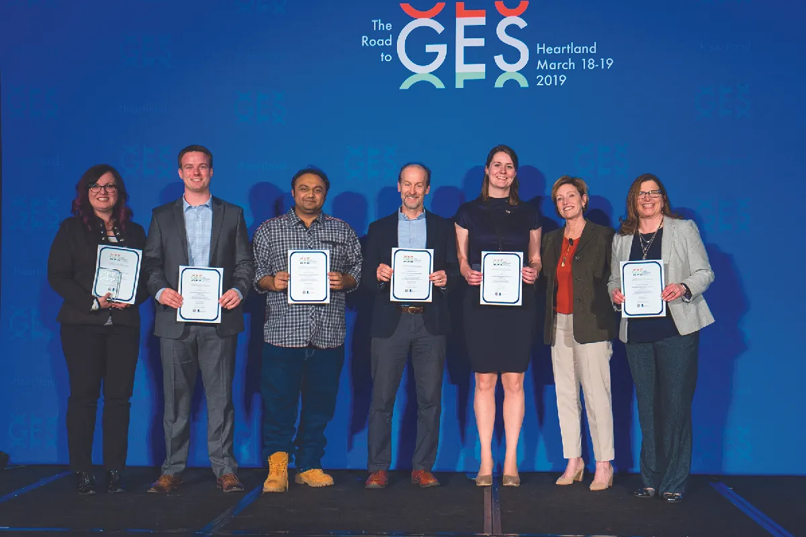

## 7.5   Góc nhìn thực tế: Các cuộc thi và cuộc tranh tài

Một phần nội dung trong mục này dựa trên công trình gốc của Mark Poepsel và được biên soạn với sự hỗ trợ của Rebus Community. Bản gốc được cung cấp miễn phí theo giấy phép CC BY 4.0 tại [https://press.rebus.community/media-innovation-and-entrepreneurship/](https://press.rebus.community/media-innovation-and-entrepreneurship/).

> **🎯 Mục tiêu học tập**
>
> Kết thúc phần này, bạn sẽ có thể:
>
> - Xác định các nguồn lực để tìm kiếm những cuộc thi và cuộc tranh tài
> - Hiểu những cơ hội và thực tế của các cuộc thi và cuộc tranh tài

Đến lúc này, bạn đã có ý niệm về cách truyền đạt mục đích của đổi mới của mình thông qua các tuyên bố tầm nhìn và sứ mệnh rõ ràng, đồng thời đặt ra các mục tiêu SMART cụ thể cho startup. Bạn cũng nên đã có hiểu biết nền tảng về cách pitch đổi mới của mình trước các nhóm đối tượng khác nhau bằng các kiểu pitch khác nhau nhằm thu hút hỗ trợ tài chính, thu hút nhân sự có năng lực và/hoặc huy động đóng góp nếu bạn là một doanh nhân xã hội. Bạn đã có một số chiến lược để bảo vệ ý tưởng, và đã xem xét cách tích hợp phản hồi vào một quá trình lặp để cải thiện và hoàn thiện khái niệm hoặc nguyên mẫu. Bây giờ là lúc cần có một cái nhìn thực tế. Với tư cách một sinh viên khởi nghiệp, bạn thực sự có thể làm gì để bước vào thị trường trong trạng thái sẵn sàng đổi mới và thực hiện những bài pitch đầu tiên của mình?

Điều đầu tiên cần làm là sử dụng nền tảng học vấn và nghề nghiệp của bạn để nghiên cứu nhằm xác định môi trường khởi nghiệp nào phù hợp với mình. Bạn muốn làm việc cho một startup và dùng năng lực sáng tạo của mình để giúp một đội ngũ hiện có phát triển tiếp ý tưởng của họ? Bạn muốn tham gia từ giai đoạn ban đầu để cùng xây dựng một startup từ con số không, đồng thời đóng góp hiểu biết của mình về pitching? Hay bạn muốn trở thành doanh nhân và tự xây dựng đội ngũ quanh những ý tưởng đổi mới của chính mình? Bạn có trách nhiệm với chính mình trong việc khám phá những lựa chọn này thông qua nghiên cứu cẩn thận.

### Nguồn lực tại địa phương

Cũng như cộng đồng đầu tư vào trường học để giáo dục sinh viên nhằm nâng cao vị thế của cả cộng đồng, một số cộng đồng đang bắt đầu nhìn thấy giá trị dài hạn của việc đầu tư vào các doanh nhân. Dưới đây là một số nguồn lực bạn nên tìm kiếm:

- Các không gian làm việc chung nơi doanh nhân tụ họp để làm các dự án độc lập của mình cũng như xây dựng đội ngũ.  **HQ Raleigh**  ở North Carolina là một không gian như vậy, cung cấp nhiều lựa chọn thành viên, cơ sở văn phòng và bếp cùng các phúc lợi khác.  **WeWork**  là một không gian khác, đặt tại New York City, cũng như  **Spark**  ở Baltimore, Maryland ([Hình 7.7](7-5-reality-check-contests-and-competitions#OSX_Eship_07_05_Perks)).
- Các lò ươm hoặc chương trình tăng tốc kinh doanh làm được nhiều hơn việc chỉ cung cấp không gian văn phòng. Chúng cung cấp sự cố vấn chứ không chỉ là một quầy cà phê đẹp.
- Các cuộc thi pitch để bạn bắt đầu thu thập phản hồi cần thiết nhằm tinh chỉnh đề xuất giá trị và phát triển một kế hoạch kinh doanh toàn diện.

*Hình 7.7: Nơi làm việc hay câu lạc bộ? Một số công ty cung cấp những phúc lợi vui nhộn trong các không gian làm việc chung nhằm thu hút nhân viên giỏi nhất và nâng cao sự hài lòng của người lao động. (nguồn: tác phẩm của Jason Putsche Photography/Spark Baltimore, CC BY 4.0)*

Tùy thuộc vào quy mô của cộng đồng nơi bạn chọn sinh sống, có thể sẽ có những ngách khởi nghiệp khác nhau để bạn nhắm tới, hoặc có thể chỉ có một không gian khởi nghiệp mang tính tổng quát hơn. Bất kể quy mô cộng đồng ra sao, chính con người trong đó và năng lực xây dựng mạng lưới của bạn mới là những yếu tố ảnh hưởng mạnh nhất đến tiềm năng của bạn. Một lựa chọn đáng theo đuổi là tham gia vào một bài pitch sản phẩm trong vòng sáu tháng sau khi bạn đặt chân đến một thành phố mới. Có thể bạn đang pitch ý tưởng tập trung của riêng mình, hoặc cũng có thể bạn mang năng lực của mình đến với một đội ngũ đã có sẵn bài pitch đang được triển khai. Dù trong trường hợp nào, với tư cách một cá nhân quan tâm đến con đường doanh nhân, nếu bạn không hợp tác và cạnh tranh, bạn sẽ không phát triển được doanh nghiệp hay dự án xã hội của mình.

### Các cuộc thi

Theo **Entrepreneur.com**,[^31] điều cốt yếu là phải “đo nhiệt độ” các cuộc thi hiện có trong một khu vực địa lý nhất định trước khi lao vào tham gia. Một **cuộc thi khởi nghiệp** là bất kỳ cuộc tranh tài khởi nghiệp nào không phải là cuộc thi pitch. Chúng thường do các tổ chức phi lợi nhuận và các trường đại học tổ chức, nhưng ngày càng nhiều công ty cũng đứng ra tổ chức để mở cửa đón nhận đổi mới từ bên ngoài, thu hút các doanh nhân đa dạng và tiếp cận những nguồn ý tưởng mới có tiềm năng thương mại theo cách phi truyền thống. Các cuộc thi này thường đòi hỏi nộp tài liệu về doanh nghiệp của bạn, chẳng hạn như mô hình kinh doanh, nội dung được trình bày trong [Business Model and Plan](11-introduction), các bản thuyết minh và những biểu mẫu được thiết kế riêng theo yêu cầu của cuộc thi.

Có nhiều lý do để tham gia một cuộc thi. Tìm được một người cố vấn đứng đầu danh sách ấy. Những cuộc thi và cuộc thi pitch đầu tiên của bạn mang lại trải nghiệm học hỏi cho chính bạn, đồng thời cũng là cơ hội để xây dựng mạng lưới và tìm kiếm người cố vấn cũng như cộng tác viên tiềm năng. Để chuẩn bị cho một cuộc thi, hãy tìm hiểu thật chính xác những gì được kỳ vọng ở bạn và nghiên cứu nhiều nhất có thể để khi viết, bạn vận dụng được **nguyên tắc tảng băng trôi**. Theo nguyên tắc viết này, mỗi từ hay mỗi câu trong hồ sơ dự thi của bạn đều phải được nâng đỡ bởi một lượng lớn thông tin và chi tiết hậu thuẫn. Ngay cả khi giám khảo không bao giờ đọc một bản thuyết minh dài, một bản tóm tắt chi tiết về doanh nghiệp, khoản đầu tư mà công ty đang tìm kiếm hay các rủi ro chủ chốt mà công ty đối mặt, thì việc bạn có sẵn dữ liệu cứng để chứng minh cho những điểm đó trong phần tóm tắt điều hành hoặc phần mở đầu vẫn sẽ làm tăng cơ hội thành công trong cuộc thi.

Tham gia một cuộc thi cũng giống như việc bạn phân tích (deconstruct) pitch deck của mình ra, hỗ trợ (back up) cho từng luận điểm bằng nghiên cứu cẩn thận rồi viết và trình bày thông tin dưới nhiều định dạng được yêu cầu. Các cuộc thi có thể đòi hỏi bài viết, poster, video, chiến dịch mạng xã hội và nhiều loại tài liệu khác. Dù cuộc thi yêu cầu loại sản phẩm truyền thông nào, bạn cũng phải hoàn thành chúng một cách chuyên nghiệp. Nếu thực sự muốn chiến thắng một cuộc thi đòi hỏi yếu tố đa phương tiện hoặc mạng xã hội, bạn có thể nên thuê một chuyên gia truyền thông hỗ trợ, vì về bản chất đó là một nỗ lực marketing.

Nếu và khi bạn chiến thắng một cuộc thi, hãy kết nối với ban tổ chức và tìm kiếm sự cố vấn. Về lâu dài, một người cố vấn xuất sắc còn giá trị hơn một giải thưởng tiền mặt đi kèm nhiều điều kiện ràng buộc. Một người cố vấn tốt và một thị trường ngách tốt thường là những dấu hiệu dự báo thành công khởi nghiệp đáng tin cậy hơn khả năng làm ra một bộ hồ sơ dự thi hấp dẫn hay một bài pitch giàu cảm xúc. Để trở thành doanh nhân, bạn cần hiểu một lĩnh vực kinh doanh vận hành như thế nào trong một bối cảnh địa lý cụ thể về mặt xã hội, văn hóa và pháp lý. Chừng nào việc tham gia một cuộc thi còn giúp bạn học được những điều đó, đó vẫn là một nỗ lực có giá trị; nhưng trong hầu hết trường hợp, khoản giải thưởng 5.000, 10.000 hay thậm chí 20.000 đô la cũng không bảo đảm cho startup của bạn một lợi thế khởi đầu đáng kể.

Những cuộc thi trong khuôn viên trường đại học có thể đáng giá hơn các cuộc thi khác vì số lượng người cố vấn được mời đến làm giám khảo. Những người cố vấn hiểu thị trường khu vực và các cơ hội xây dựng mạng lưới có thể rất có giá trị, và các cuộc thi đôi khi là một trong số ít dịp mà đông đảo chuyên gia tham gia vào một môn học hoặc hoạt động ngoại khóa ở trường. Ngoài ra, các cuộc tranh tài cũng có thể do các nhóm kinh doanh hoặc nhóm khởi nghiệp xã hội trong trường tổ chức và mang lại cơ hội kết nối tuyệt vời. Một số cuộc thi đóng vai trò giai đoạn sơ tuyển trước cuộc thi pitch diễn ra sau đó. Trong trường hợp ấy, bạn sẽ chuẩn bị pitch deck đồng thời với việc chuẩn bị hồ sơ dự thi để bảo đảm rằng bài pitch của bạn khớp với những gì mình tuyên bố. Nghe thì có vẻ khá đơn giản, nhưng khi có sự sai lệch giữa những gì bạn nộp và những gì bạn cuối cùng trình bày, giám khảo sẽ nhận ra ngay. Dù vậy, một cuộc thi trong trường đại học hoặc trong thị trường ngách của bạn đều cho bạn cơ hội nghiên cứu thị trường, soi xét chính ý tưởng của mình và xây dựng đội ngũ.

Xây dựng một đội ngũ cho một cuộc thi với mục tiêu cuối cùng là tạo ra một dự án thành công là một trong những khía cạnh vừa hào hứng nhất vừa thử thách nhất của khởi nghiệp. Nhiều doanh nhân miễn cưỡng buông bỏ quyền kiểm soát và chỉ tìm những người sẵn sàng làm việc theo đúng cách mà họ muốn. Điều đó thường không khả thi và cũng không nên làm. Bạn cần xây dựng một đội ngũ gồm những người có thể nhìn một vấn đề từ các góc độ khác nhau và có thể đưa ra những ý kiến trung thực, mang tính xây dựng. Hy vọng tốt nhất của bạn là hình thành một đạo đức giao tiếp rõ ràng và đối thoại qua lại đầy tôn trọng khi đối diện với phê bình, bởi chắc chắn sẽ có khác biệt về quan điểm và cách tiếp cận. Nếu một cuộc thi không đem lại gì hơn ngoài động lực để xây dựng một đội ngũ tốt, thì đó vẫn là một nỗ lực đáng giá. Có rất nhiều nguồn sẵn có để tìm hiểu về những cuộc thi này; hãy xem các chương trình khởi nghiệp ở các trường đại học lớn, một số chỉ mở cho sinh viên và/hoặc cựu sinh viên, nhưng một số khác có thể mở rộng cho người ngoài. Đồng thời hãy kiểm tra các nguồn startup lớn như **TechStars** hoặc **Y Combinator**, cũng như các cơ quan phát triển kinh tế tại địa phương. Cuối cùng, bạn cũng có thể tìm thấy các cuộc thi tập trung vào những nhóm cụ thể mà bạn có thể đủ điều kiện tham gia, chẳng hạn như phụ nữ khởi nghiệp hoặc các nhóm khác vốn từng bị đại diện chưa đầy đủ trong lịch sử.

### Các cuộc tranh tài

Giống như contests, **các cuộc thi pitch** ([Hình 7.8](7-5-reality-check-contests-and-competitions#OSX_Eship_07_05_PitchComp)) có thể trao giải thưởng tiền mặt hoặc cơ hội cố vấn cho người chiến thắng. Một số cuộc thi pitch lớn hơn có kèm theo điều khoản thỏa thuận seed funding mà người thắng phải ký trước khi được nhận giải tiền mặt. Điểm khác biệt then chốt giữa contest và pitch competition là ở loại thứ hai, bạn được kỳ vọng sẽ trình bày ý tưởng kinh doanh của mình dưới dạng một bài thuyết trình, thường đi kèm pitch deck, trong khi ở loại thứ nhất, bạn được kỳ vọng cung cấp một bản tóm tắt ý tưởng mang tính phi chính thức hơn, dù giải thưởng của contests thường nhỏ hơn, chẳng hạn 1.000 đô la dưới dạng dịch vụ pháp lý miễn phí hoặc các dịch vụ kinh doanh khác, so với một giải tiền mặt lớn hơn nhiều.

*Hình 7.8: Các trường đại học, cộng đồng, nhà tài trợ và những nhóm lợi ích khác tổ chức các cuộc thi pitch để hỗ trợ các dự án khởi nghiệp. Trong hình là những người tham gia cuộc thi pitch Road to GES (Global Entrepreneurship Summit) Heartland tại Overland Park, Kansas. (nguồn: “Pitch Competition at Road to GES Heartland” của “Global Entrepreneurship Summit Follow”/Flickr, Public Domain)*

Hãy tìm các cuộc tranh tài trong thành phố của bạn và ở những địa điểm cách chỗ bạn chỉ khoảng nửa ngày lái xe, để bạn có thể tham gia các cuộc thi pitch mà không phải tiêu tốn quá nhiều thời gian hoặc nguồn lực cho việc di chuyển. Hãy tìm những cuộc tranh tài tập trung vào lĩnh vực thị trường mà bạn quan tâm nhất. Hãy phát huy năng lực và thế mạnh của mình. Một số cuộc thi pitch được tài trợ bởi các văn phòng phát triển kinh tế khu vực. Những văn phòng này thường gắn với các trung tâm phát triển doanh nghiệp nhỏ, vốn thường đặt tại hoặc liên kết với các trường đại học lớn, văn phòng địa phương của **SCORE** và các văn phòng của **SBA**. Họ thường trao giải thưởng tiền mặt với hy vọng thu hút các startup mới hình thành đến khu vực của mình. Một số nơi khác kết nối doanh nhân với những nhà đầu tư đang chờ sẵn với khoản tiền seed và một hợp đồng quy định họ sẽ sở hữu bao nhiêu phần trăm doanh nghiệp. Một số cuộc thi khác cung cấp tiền hỗ trợ cho dịch vụ pháp lý, kế toán, cố vấn và nhiều dịch vụ khác. Đó là cách seed funding vận hành, nhưng những người thắng cuộc nên tìm kiếm tư vấn pháp lý trước khi ký một hợp đồng ràng buộc một phần doanh nghiệp của mình như điều kiện để nhận giải thưởng hoặc một mức vốn seed mà họ hoàn toàn có thể huy động được qua những kênh khác.

Điều này giải thích vì sao một số doanh nhân dường như cố ý làm hỏng (tank) thương vụ của chính họ trên *Shark Tank*. Trong một số trường hợp, có lẽ họ thật sự dại dột khi bỏ qua một thương vụ, nhưng ở những trường hợp khác, họ đã có trong đầu những kênh seed funding khác có thể đem lại cho họ nhiều quyền kiểm soát hơn đối với tương lai công ty. Điều cuối cùng bạn muốn làm là thắng một cuộc tranh tài rồi ký vào một hợp đồng đầu tư vào doanh nghiệp mà lại không dẫn tới hoặc không bảo vệ được mục tiêu cuối cùng của bạn. Dù chương trình *American Idol* từng là một ví dụ mang tính cảnh báo[^32], bởi người chiến thắng của *American Idol* thường phải ký hợp đồng thu âm độc quyền mang tính ràng buộc với nghệ sĩ và hạn chế họ ký với hãng thu âm lớn trong nhiều năm, thì phần lớn nhà đầu tư gần như luôn muốn sở hữu một phần trong tương lai dài hạn của bất kỳ nỗ lực khởi nghiệp nào mà họ giúp tài trợ. Trước khi bước vào một cuộc tranh tài, hãy tìm hiểu xem bản chất giải thưởng có đòi hỏi loại thỏa thuận seed funding này hay không. Hãy đưa ra quyết định dựa trên mức độ thoải mái của chính bạn với kiểu sắp xếp đó, đồng thời nghiên cứu xem những người chiến thắng trước đây đã được đối xử ra sao và họ đã có những thành công cũng như thất bại gì.

Để giành chiến thắng trong một cuộc thi pitch, hãy xác định chính xác bạn đang pitch với ai và họ sẽ dùng tiêu chí nào để đánh giá. Hãy chắc chắn đọc kỹ hướng dẫn cuộc thi và tìm hiểu nhiều nhất có thể về từng giám khảo cụ thể cũng như bối cảnh của họ. Hãy điều chỉnh bài pitch sao cho phù hợp với mục tiêu của contest nhiều nhất có thể mà không làm thay đổi đề xuất giá trị của bạn hoặc hứa hẹn những tính năng hay đầu ra mà bạn không thể thực hiện được. Hãy làm cho **ask** khớp với những gì cuộc thi cung cấp. Không có gì khiến giám khảo khó chịu hơn việc giải thưởng và các gói hỗ trợ đã được nêu rất rõ trong thể lệ cuộc thi, nhưng người pitch vẫn đòi hỏi nhiều tiền hơn hoặc yêu cầu một thứ hoàn toàn khác với những gì ban tổ chức thực sự đang đưa ra.

Bạn nên phát triển một mô hình kinh doanh cốt lõi, nội dung sẽ được trình bày trong chương [Launch for Growth to Success](10-introduction), rồi pitch nhiều lần với các cá nhân, nhóm doanh nhân, nhà đầu tư và giám khảo các cuộc tranh tài, trừ khi đó chính là công việc thường ngày của bạn. Điều này sẽ giúp bạn phát triển bài pitch phù hợp với thị trường ngách của mình. Theo thời gian, bạn sẽ học được điều gì cần nhấn mạnh và điều gì cần giảm nhẹ hoặc cắt bỏ, và điều đó có thể giúp bạn chiến thắng trong các cuộc tranh tài.

Là sinh viên đại học, bạn có thể tham gia các cuộc thi pitch trong trường để luyện tập việc tìm hiểu một thị trường ngách. Có thể thị trường ngách mà bạn khám phá khi còn học đại học sẽ tương tự với thị trường mà bạn làm việc sau khi tốt nghiệp. Nếu bạn ở trong một thành phố đại học, đó có thể là một thị trường khá đặc thù, nhưng thường sẽ có rất nhiều cơ hội cố vấn bù đắp cho những gì nó có thể còn thiếu về hạ tầng kinh doanh. Hãy làm pitch deck của bạn thật chuyên nghiệp và luyện tập phần trình bày cho đến khi chúng đạt mức hoàn hảo. Bạn cũng phải là một khán giả chăm chú và chịu khó quan sát trong những cuộc tranh tài như vậy. Không hiếm trường hợp một doanh nhân làm chủ được cách tiếp cận của riêng mình sau khi xem người khác trình bày trong một hoặc hai năm.

**Collegiate Entrepreneurs’ Organization**, với chữ viết tắt CEO khá đắt, có các phân hội tại hơn 300 trường đại học trên khắp Hoa Kỳ. Tổ chức này đề cao khởi nghiệp như một lĩnh vực độc lập, thay vì xem nó chỉ là sản phẩm phụ của chương trình MBA hay một nhánh hạn hẹp trong trường kinh doanh như cách nhiều trường đại học vẫn làm. Bất kể hạ tầng thể chế tại từng nơi ra sao, nhiều trường đại học đều có các phân hội của tổ chức này.

> **❓ Bạn đã sẵn sàng chưa?: Tổ chức Doanh nhân Sinh viên**
>
> Hãy tìm hiểu về CEO và xem trong khuôn viên trường bạn có phân hội nào không. [Bảng 7.4](7-5-reality-check-contests-and-competitions#fs-idm255073296) cho thấy thông tin từ trang web của tổ chức cấp quốc gia.
>
>
>
> **Bảng 7.4: Collegiate Entrepreneurs’ Organization Vision and Mission33**
>
> | Tuyên bố tầm nhìn | Tuyên bố sứ mệnh |
> | --- | --- |
> | Phục vụ hơn 400 trường cao đẳng và đại học, hỗ trợ sinh viên đạt được ước mơ và mục tiêu khởi nghiệp của mình; CEO cung cấp cho các sinh viên khởi nghiệp những cơ hội, sự kiện, hoạt động cấp phân hội và hội nghị để giúp họ khởi sự doanh nghiệp. | Thông tin, hỗ trợ và truyền cảm hứng cho sinh viên đại học trở nên giàu tinh thần khởi nghiệp và tìm kiếm cơ hội thông qua việc tạo lập doanh nghiệp. Với một cộng đồng khởi nghiệp đa dạng và mạng lưới toàn cầu, CEO mang đến cho các sinh viên khởi nghiệp những cơ hội, sự kiện, hoạt động phân hội và hội nghị để giúp họ bắt đầu kinh doanh. Điểm nhấn của năm là Hội nghị Toàn cầu thường niên được tổ chức vào mỗi mùa thu. |
>
>
>
> Nếu trường bạn có một phân hội, hãy liên hệ ban lãnh đạo và tìm hiểu cách tham gia. Nếu bạn đã là thành viên, hãy xem bạn có thể trở thành lãnh đạo sinh viên trong tổ chức như thế nào. Nếu bạn đang ở trong CEO và là lãnh đạo sinh viên, hãy lập kế hoạch để để lại tác động tích cực và bền vững cho phân hội địa phương của mình. Nếu trường bạn chưa có phân hội địa phương, hãy kiểm tra với Văn phòng Hoạt động Sinh viên/Đời sống Sinh viên để xem bạn có thể thành lập một phân hội ở đó như thế nào. Cũng có thể đã tồn tại một nhóm tương tự với trọng tâm này nhưng dưới một tên câu lạc bộ hoặc tổ chức khác.
>
>
> - Một số doanh nghiệp thành công do các phân hội CEO hoặc các nhóm bên trong phân hội khởi xướng là gì?
> - Một hoặc hai thay đổi then chốt nào có thể được thực hiện để làm phân hội địa phương của bạn mạnh hơn?
> - Bạn có thể liên hệ và làm việc với ai để biến điều đó thành hiện thực?
> - Mục tiêu khởi nghiệp chủ yếu của bạn với tư cách một thành viên CEO sẽ là gì? Bạn có thể dùng nhóm này như bàn phóng cho startup của riêng mình không? Bằng cách nào?

Nguồn tài nguyên khởi nghiệp **AlphaGamma.com** liệt kê nhiều cuộc thi kế hoạch kinh doanh lớn nhất dành cho các doanh nhân mới ra trường và doanh nhân sinh viên. Dưới đây là danh sách các cuộc tranh tài hàng đầu đã diễn ra trong năm 2019. Hãy kiểm tra trang web của họ để xem danh sách những cuộc tranh tài trong tương lai.[^34] Trong hầu hết trường hợp, tổng giá trị giải thưởng hằng năm được liệt kê cùng với những thông tin cụ thể khác của từng cuộc tranh tài:

- Harvard Business School New Venture Plan Competition – 300.000 đô la
- Rice Business Plan Competition – 1,5 triệu đô la
- Milken-Penn GSE Education Business Plan Competition – 1.000.000 đô la
- Utah Entrepreneur Challenge – 100.000 đô la
- Next Founders – 30.000 đô la
- Technovation world Challenge – 42.000 đô la
- CodeLaunch – 67.000 đô la
- Burton D Morgan – 100.000 đô la
- Edward L. Kaplan Business Model Competition – 100.000 đô la
- UPitch Competition – 10.000 đô la
- The Hult Prize Student Competition – 1.000.000 đô la
- Thiel Fellowship – 100.000 đô la

Danh sách này chưa bao gồm một số cuộc tranh tài giá trị khác. Cuộc thi kế hoạch kinh doanh của George Washington University, có tên **GW New Venture Competition**, vào năm 2017 đã trao tổng cộng hơn 300.000 đô la tiền mặt và dịch vụ hiện vật.[^35] **Baylor University New Venture Competition** mở cửa cho các trường cao đẳng và đại học trên toàn quốc và đã trao tổng cộng hơn 85.000 đô la cho các đội sinh viên đến từ Arkansas, Iowa và Pennsylvania, với các đội vào chung kết còn đến từ California và Illinois.[^36] Singapore tổ chức một cuộc thi kế hoạch kinh doanh toàn cầu với tổng giải thưởng lên tới 1 triệu đô la.[^37] **Draper Competition for Collegiate Women Entrepreneurs** của Smith College trao tổng giải thưởng hơn 60.000 đô la, bao gồm giải tiền mặt cao nhất 10.000 đô la cùng một học bổng.[^38] Arizona State, Indiana và nhiều trường đại học khác cũng tổ chức những cuộc tranh tài như vậy. Hạn chót được rải đều trong năm, và một số cuộc tranh tài yêu cầu người tham gia phải là sinh viên hoặc mới tốt nghiệp, trong khi một số cuộc khác mở cho tất cả mọi người.

Khởi nghiệp thành công xảy ra khi những con người đổi mới tìm được mảnh đất màu mỡ, phát triển ý tưởng và khái niệm, rồi kiên trì học hỏi để đưa sản phẩm mới vào đúng thị trường phù hợp. Những doanh nhân mới tốt nghiệp đại học cần tự có trách nhiệm nghiên cứu cộng đồng khởi nghiệp mà họ muốn nhắm tới. Các văn phòng phát triển kinh tế trên khắp thế giới khuyến khích doanh nhân đến với thành phố của họ vì họ cần những con người đổi mới, giàu năng lượng và sẵn sàng chấp nhận rủi ro để tạo ra các động cơ kinh tế của tương lai.

Một trong những cách mà các khu vực khuyến khích khởi nghiệp là thông qua contests, tức mọi hình thức cạnh tranh để giành vốn cho startup mà không phải là cuộc thi pitch. Nếu bạn có thể xây dựng một đội ngũ cho một contest thiên về hồ sơ tĩnh, thì bạn đã tiến khá xa trên con đường xây dựng một đội ngũ để pitch các đổi mới mới.
