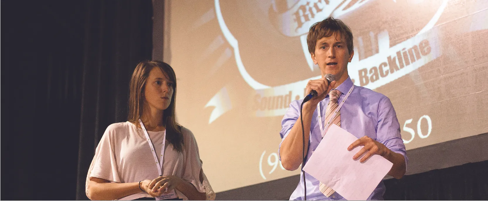

*Hình 7.1: Một cặp doanh nhân đang thuyết trình dự án của mình tại sự kiện “Risk City” trong Tuần lễ Khởi nghiệp Toàn cầu ở Memphis, Tennessee. (nguồn: chỉnh sửa từ “Risk City. Global Entrepreneur Week.” của Brad Montgomery/Flickr, CC BY 2.0)*

## Dàn ý chương

- [7.1   Làm rõ tầm nhìn, sứ mệnh và mục tiêu của bạn](7-1-clarifying-your-vision-mission-and-goals)
- [7.2   Chia sẻ câu chuyện khởi nghiệp của bạn](7-2-sharing-your-entrepreneurial-story)
- [7.3   Xây dựng bài pitch cho nhiều đối tượng và mục tiêu khác nhau](7-3-developing-pitches-for-various-audiences-and-goals)
- [7.4   Bảo vệ ý tưởng của bạn và hoàn thiện bài pitch thông qua phản hồi](7-4-protecting-your-idea-and-polishing-the-pitch-through-feedback)
- [7.5   Góc nhìn thực tế: Các cuộc thi và cuộc tranh tài](7-5-reality-check-contests-and-competitions)

## Giới thiệu

Sara **Minkara**, một người Mỹ theo đạo Hồi gốc Lebanon, đã mất thị lực từ năm bảy tuổi do một rối loạn di truyền. Cô lớn lên trong trải nghiệm bị phân biệt đối xử về sắc tộc và bị đối xử bất công vì khuyết tật của mình. Khi là sinh viên đại học tại Hoa Kỳ, Minkara nhận ra rằng cô được hưởng những đặc quyền mà nhiều trẻ em khác ở quê hương Lebanon của cô không có. Mong muốn làm cho cuộc sống tốt đẹp hơn cho những người trẻ giống mình đã phát triển thành niềm đam mê trao quyền cho trẻ em mù tham gia vào cộng đồng của các em. Vấn đề đặt ra là: nhiều xã hội gạt người khiếm thị ra bên lề và thậm chí xem họ như gánh nặng. Định kiến này một phần bắt nguồn từ những ràng buộc và tập quán vật chất lẫn văn hóa, tạo ra các giới hạn trên thực tế đối với khả năng sống và hoạt động tự do, hiệu quả của họ trong các xã hội ấy. Giải pháp là: các chương trình giáo dục và chiến dịch nâng cao nhận thức cộng đồng giúp người khiếm thị được trao quyền từ khi còn nhỏ và được rèn luyện sự tự tin, quyết đoán.

Ở tuổi 27, Minkara thành lập **Empowerment Through Integration (ETI)**, một doanh nghiệp xã hội giúp trao quyền cho thanh thiếu niên khiếm thị ở khu vực Trung Đông - Bắc Phi và tại Hoa Kỳ. Tổ chức này đã phát triển từ một trại hè thành một phong trào nhỏ hỗ trợ hơn 3.000 cá nhân trên khắp Lebanon và Hoa Kỳ. Sứ mệnh và tầm nhìn của ETI là xây dựng một xã hội hòa nhập nhằm thay đổi sự kỳ thị của xã hội toàn cầu đối với người khuyết tật và trao quyền cho thanh thiếu niên khiếm thị.[^1] Một trong những sự kiện mang tính biểu tượng của Minkara là “Dining in the Dark” (Ăn tối trong bóng tối), được thiết kế để giúp những người tham gia trải nghiệm cuộc sống của một người khiếm thị và giáo dục họ về tiềm năng của mọi người, đặc biệt là những người khuyết tật, bao gồm cả người khiếm thị.
