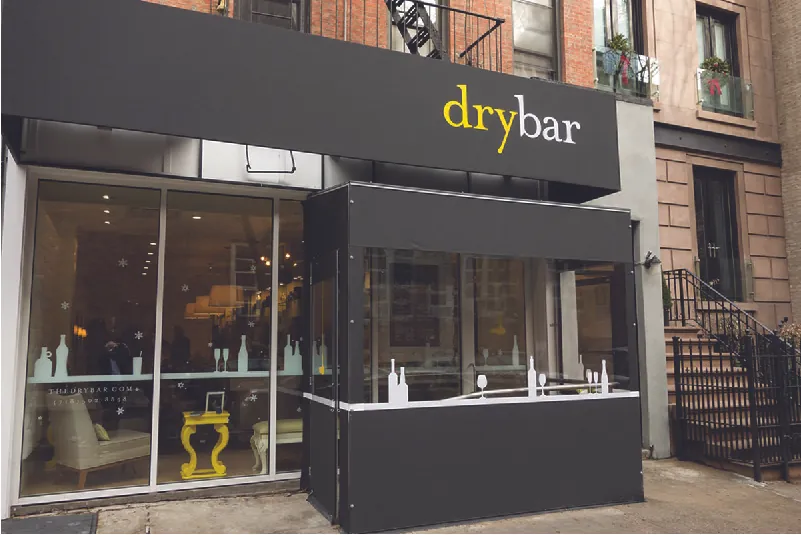

## 8.1   Tiếp thị khởi nghiệp và marketing mix

> **🎯 Mục tiêu học tập**
>
> Đến cuối phần này, bạn sẽ có thể:
>
> - Phân biệt tiếp thị truyền thống với tiếp thị khởi nghiệp
> - Mô tả bảy yếu tố của marketing mix

Để trở thành một doanh nhân thành công, bạn thường phải biết cách cân bằng nhiều khía cạnh khác nhau của doanh nghiệp như tài chính, kế toán và quản trị. Một trong những khía cạnh quan trọng nhất là tiếp thị. Suy cho cùng, nếu không ai nghe về sản phẩm mới thì làm sao nó có thể thành công? Theo công ty nghiên cứu tiếp thị CB Insights, trong một khảo sát về 101 công ty thất bại, 14 phần trăm trong số đó thất bại do tiếp thị kém.[^2] **Tiếp thị** là thuật ngữ bao quát chỉ những hoạt động mà doanh nghiệp sử dụng để nhận diện người tiêu dùng và chuyển họ thành người mua nhằm đạt được lợi nhuận. Bất kể quy mô doanh nghiệp lớn hay nhỏ, tiếp thị đặt nền tảng cho cách công ty tiếp cận và phục vụ khách hàng mục tiêu. Dù là một thương hiệu toàn cầu như **PepsiCo** hay **Apple**, một công ty quy mô nhỏ đến vừa như Birchbox, hay một nhà hàng nhỏ hoặc phòng gym địa phương, tiếp thị đều chỉ những chiến lược cốt lõi mà doanh nghiệp sử dụng để tiếp cận và bán hàng cho khách hàng. Như bạn có thể đoán, cách doanh nhân tiếp thị cho một sản phẩm mới có phần khác với cách một công ty lớn tiếp thị cho một thương hiệu đã được thiết lập.

### Tiếp thị truyền thống

Tiếp thị truyền thống đối với các doanh nghiệp lớn như **Coca-Cola**, **Disney** và **Dell** thường tập trung vào việc quản lý và mở rộng các chương trình cũng như thương hiệu hiện có. Những công ty như vậy có lợi thế về nguồn lực lớn hơn, chẳng hạn sự hỗ trợ tài chính dồi dào và số lượng lớn chuyên gia tiếp thị để dẫn dắt nỗ lực của họ. Tuy nhiên, tiếp thị đối với các doanh nghiệp nhỏ và vừa (những doanh nghiệp có 500 nhân viên trở xuống và doanh thu hằng năm dưới 7,5 triệu đô la, theo định nghĩa của **Small Business Administration**)[^3] lại khác vì nguồn lực tài chính có hạn, và thường chính doanh nhân là người phụ trách hoạt động tiếp thị. Nếu họ có ngân sách cho chi phí tiếp thị, họ có thể thuê một agency nhỏ theo hình thức tính phí theo dự án.

Như bạn đã học trong các chương trước, các startup nhỏ thường rất hạn chế về nguồn lực, vì vậy họ cần bù đắp bằng sự sáng tạo và làm việc chăm chỉ. Mặc dù nguồn lực hạn chế tạo ra những thách thức rõ ràng, quy mô nhỏ cũng có những lợi thế riêng. Chẳng hạn, điều đó cho phép các công ty mới linh hoạt, nhanh nhạy và sáng tạo hơn so với các đối thủ đã ổn định trên thị trường. Những phẩm chất này có thể giúp doanh nghiệp mới tạo ra đột phá trong ngành và vươn lên thành những người chơi lớn trên toàn cầu bằng cách áp dụng các thực hành tiếp thị khởi nghiệp.

### Tiếp thị khởi nghiệp

Ở mức cơ bản, **tiếp thị khởi nghiệp** là tập hợp các thực hành phi truyền thống có thể giúp startup và các doanh nghiệp còn non trẻ vươn lên và tạo lợi thế trong những thị trường cạnh tranh. Khác biệt chính giữa cách tiếp cận này với tiếp thị truyền thống là tiếp thị khởi nghiệp có xu hướng tập trung vào việc thỏa mãn khách hàng và xây dựng niềm tin bằng cách cung cấp các sản phẩm và dịch vụ đổi mới, tạo ra đột phá hoặc hấp dẫn đối với một thị trường cụ thể. Bảng 8.1 cung cấp cái nhìn tổng quan về sự khác biệt giữa tiếp thị truyền thống và tiếp thị khởi nghiệp.

**Bảng 8.1: Tiếp thị truyền thống so với tiếp thị khởi nghiệp**

| Tiếp thị truyền thống | Tiếp thị khởi nghiệp |
| --- | --- |
| Nguồn lực dồi dào hơn | Ít hoặc hầu như không có nguồn lực; nhà sáng lập tự mình dẫn dắt nỗ lực (công sức cá nhân) |
| Quản lý một thương hiệu đã được thiết lập, quảng cáo gợi nhớ | Phải sáng tạo, tràn đầy năng lượng và kiên trì để phát triển câu chuyện và thương hiệu; từ đó tạo ra niềm tin |
| Mục tiêu tài chính và thị phần | Mục tiêu về sự hài lòng và mức độ nhận biết |
| Quản lý khách hàng hiện có | Thu hút những khách hàng đầu tiên; phát triển tệp khách hàng và quan hệ dài hạn |
| Quản lý sản phẩm, xúc tiến, giá, phân phối (place), con người, môi trường vật lý và quy trình hiện có (“7P”) | Phát triển sản phẩm mới, mức giá mới, kênh mới (phân phối (place)), truyền thông, quy trình, đào tạo và thiết kế |
| Tiếp tục làm những gì đang hiệu quả | Thử và sai; thử nghiệm thị trường |
| Giao tiếp với khách hàng mang tính chuẩn hóa, một chiều; khó tạo quan hệ một-một hơn | Giao tiếp với khách hàng linh hoạt và tự phát hơn; quan hệ hai chiều |

Như bảng cho thấy, tiếp thị khởi nghiệp nhấn mạnh tính linh hoạt và đổi mới như một cách để tạo chỗ đứng trong các thị trường cạnh tranh. Ví dụ, hãy xem cách nhà sáng lập Drybar là Alli Webb dùng sự thấu hiểu nhu cầu thị trường để tạo ra một ngách trong ngành tạo kiểu tóc truyền thống. Là một nhà tạo mẫu tóc chuyên nghiệp, Webb đã dành năm năm làm mẹ toàn thời gian và sấy tóc cho bạn bè, người thân tại nhà họ để kiếm thêm thu nhập. Trong thời gian đó, cô nhận ra thị trường có nhu cầu đối với dịch vụ chỉ sấy và tạo kiểu tóc chuyên nghiệp.

Nhận thấy nhu cầu này, Webb đã phát triển một mô hình kinh doanh cung cấp cho phụ nữ cách để được sấy tạo kiểu mà không cần đồng thời cắt hoặc nhuộm tóc. Webb không phát minh ra dịch vụ blowout; cô chỉ tái tạo không gian để thực hiện nó, tập trung vào đúng khía cạnh đó của tạo kiểu tóc và cung cấp dịch vụ trong những không gian hợp thời ([Hình 8.2](8-1-entrepreneurial-tiếp thị-and-the-tiếp thị-mix#OSX_Eship_08_01_DryBar)). Nhờ linh hoạt và đổi mới thông qua một không gian mới để cung cấp dịch vụ này, Drybar đã tạo được một ngách trong ngành làm tóc. Hoạt động từ năm 2008, Drybar vẫn đang tiếp tục mở rộng. Webb dự kiến sẽ mở ít nhất 20 địa điểm mới trong năm 2019.[^4]

*Hình 8.2: Những ý tưởng đổi mới đơn giản như Drybar có thể tạo ra các thị trường ngách mới mà trước đó chưa được phục vụ. Hiện nay Drybar đã phát triển lên hơn 100 địa điểm trên khắp Hoa Kỳ.[^5] (ghi công: tác phẩm của ralph and jenny/Flickr, CC BY 2.0)*

### Marketing mix

Một trong những ngộ nhận lớn nhất về tiếp thị là cho rằng nó chỉ xoay quanh xúc tiến, tức là cách doanh nghiệp bán hoặc quảng cáo một thứ gì đó. Nhưng thực tế, xúc tiến chỉ là một khía cạnh của **marketing mix (4P)**, khái niệm mô tả tập hợp cơ bản các chiến lược và cách tiếp cận mà marketer sử dụng để nhận diện và tiếp cận **thị trường mục tiêu**. Thị trường mục tiêu là nhóm người tiêu dùng cụ thể mà doanh nghiệp muốn cung cấp hàng hóa hoặc dịch vụ.

Một cách phổ biến để hiểu và ghi nhớ các thành phần của marketing mix đối với hàng hóa và dịch vụ là nghĩ theo “7P”. Mặc dù cả bảy yếu tố này đều có thể là một phần trong marketing mix của doanh nghiệp, bốn yếu tố đầu liên quan nhiều hơn đến hàng hóa: sản phẩm, giá, xúc tiến và phân phối (place) (theo truyền thống được gọi là “4P của tiếp thị”). Ba yếu tố còn lại liên quan nhiều hơn đến dịch vụ: môi trường vật lý, quy trình và con người. Dù 7P về mặt khái niệm là giống nhau đối với mọi doanh nghiệp, cách một công ty xử lý từng “P” sẽ phụ thuộc vào nhu cầu và mục tiêu riêng của công ty đó.

Để hiểu rõ hơn về marketing mix, hãy xem Hình 8.3 phân tách 7P thành các hoạt động liên quan như thế nào.

![Illustration of the 7 Ps with Marketing Mix in the center connected to each of the 7 Ps: product, promotion, price, place, people, physical environment, and process. Above product is “define value of the good and/or service,” above promotion is “communicate benefits to consumers,” above price is “maximize profits and competitiveness,” above place is “reach target market at effective cost,” above people is “link company to customers,” above physical environment is “convey value through atmospherics,” and above process is “build trust through efficient procedures.”](../assets/img-8-1-2.webp)

*Hình 8.3: Mỗi chữ P trong marketing mix cần phối hợp với các chữ P còn lại để tạo ra giá trị cho doanh nghiệp và khách hàng của mình. *Sản phẩm*, *xúc tiến*, *giá* và *phân phối (place)* liên quan nhiều hơn đến hàng hóa, còn *con người*, *môi trường vật lý* và *quy trình* liên quan nhiều hơn đến dịch vụ. (ghi công: Bản quyền Đại học Rice, OpenStax, theo giấy phép CC BY NC-SA 4.0)*

#### Sản phẩm

Trong marketing mix, sản phẩm là hàng hóa hoặc dịch vụ tạo ra giá trị bằng cách thỏa mãn nhu cầu hay mong muốn của khách hàng. Hàng hóa là những sản phẩm hữu hình có thể chạm, ngửi, nghe và nhìn thấy, chẳng hạn như một đôi giày tennis, một thanh granola hoặc một chai dầu gội. Ngược lại, dịch vụ là những sản phẩm vô hình. Chúng thường bao gồm việc trả tiền cho một chuyên gia thực hiện điều gì đó cho bạn, như sửa xe hoặc dọn dẹp nhà cửa.

Doanh nghiệp có thể kết hợp cả hàng hóa và dịch vụ để tạo thêm giá trị cho khách hàng. **Birchbox**, chẳng hạn, cung cấp hàng hóa (mẫu thử sản phẩm) và dịch vụ (gợi ý sản phẩm được cá nhân hóa) để đáp ứng mong muốn mua sắm sản phẩm làm đẹp một cách thuận tiện của khách hàng. Giá trị mà Birchbox mang lại dựa trên khả năng thực hiện tốt cả hai điều đó. Tại Hoa Kỳ, các doanh nghiệp định hướng dịch vụ ngày càng đóng vai trò lớn hơn trong nền kinh tế địa phương và quốc gia.

Đối với startup, việc xác định giá trị của các sản phẩm mà họ sẽ cung cấp là một bước quan trọng để nhận diện lợi thế cạnh tranh của mình trên thị trường. Ở mức cơ bản, nếu bạn không biết sản phẩm của mình mang lại lợi ích gì hoặc đáp ứng nhu cầu nào, thì khách hàng của bạn cũng sẽ không biết. Kevin **Plank**, nhà sáng lập **Under Armour**, hiểu rằng giá trị sản phẩm của mình sẽ mang lại lợi ích cho nhiều vận động viên đã quá mệt mỏi vì phải thường xuyên thay đồ thể thao ướt sũng. Là một cựu cầu thủ bóng bầu dục, ông đã dành nhiều giờ luyện tập và chịu đựng những buổi tập đẫm mồ hôi, đồng thời tự hỏi làm thế nào có thể giảm bớt vấn đề mà các công ty chưa giải quyết tốt bằng đồ thể thao cotton. Sau khi tốt nghiệp đại học, ông quyết định nâng ý tưởng của mình lên một tầm cao mới và khởi sự một công ty sản xuất trang phục thể thao có các sợi microfiber đặc biệt giúp vận động viên luôn khô ráo trong suốt buổi tập và thi đấu. Sau đó, ông bắt đầu một chuyến đi để thử bán đề xuất giá trị của mình cho các đội bóng bầu dục đại học ở bờ Đông. Vào cuối năm 1996, ông có được đơn hàng áo đầu tiên cho Georgia Tech với tổng trị giá 17.000 đô la, và phần còn lại đã trở thành lịch sử. Under Armour đã trở thành một đối thủ mạnh của **Nike** và **Adidas** bằng cách cung cấp một loại trang phục thể thao mới giúp cách mạng hóa hiệu suất nhờ giữ cho vận động viên luôn khô ráo.[^6]

Ngược lại, **Jawbone**, công ty sản xuất loa Bluetooth và phần cứng khác, đã ngừng hoạt động vì chuyển trọng tâm từ âm thanh sang các thiết bị sức khỏe, khiến công ty trực tiếp cạnh tranh với **FitBit** và các công ty phần cứng tương tự. Những thất bại về sản phẩm, cùng nhiều vấn đề khác, đã khiến công ty công nghệ này lao dốc.[^7] Hiện nay, công ty đang nỗ lực tái tạo chính mình và sẽ sử dụng trí tuệ nhân tạo cùng phần cứng cảm biến để cung cấp cho khách hàng thông tin về sức khỏe của họ thông qua hình thức đăng ký thuê bao. Các cảm biến đeo được sẽ ghi lại thông tin sức khỏe quan trọng của khách hàng, theo dõi chúng trên một nền tảng trực tuyến và sau đó đưa ra các gợi ý về hành động y tế cần thiết.[^8] Quá trình tái thiết kế của công ty vẫn chưa hoàn tất, vì vậy về mặt chính thức, công ty vẫn chưa quay lại kinh doanh.

#### Xúc tiến

Truyền đạt lợi ích của sản phẩm đến khách hàng là một khía cạnh quan trọng của mọi marketing mix. Dù sản phẩm có tốt nhất trong phân khúc, doanh nghiệp vẫn phải truyền đạt giá trị đó đến khách hàng, nếu không sản phẩm sẽ thất bại. Đó chính là vai trò của xúc tiến: quá trình truyền đạt giá trị đến khách hàng theo cách khuyến khích họ mua hàng hóa hoặc dịch vụ. Hoạt động xúc tiến phải có mục tiêu, ngân sách, chiến lược và kết quả để đo lường. Doanh nghiệp phải sử dụng ngân sách xúc tiến một cách khôn ngoan để tạo ra kết quả tốt nhất, có thể bao gồm doanh số, lợi nhuận và mức độ nhận biết thông qua một thông điệp nhất quán xuyên suốt chiến dịch.

Một số hình thức xúc tiến điển hình là quảng cáo, mạng xã hội, quan hệ công chúng, thư trực tiếp, xúc tiến bán và bán hàng cá nhân.

Quảng cáo là một hình thức truyền thông đại chúng cho phép doanh nghiệp tiếp cận số đông qua TV, radio, báo, Internet, tạp chí và quảng cáo ngoài trời. Nhiều phương tiện trong số này khá đắt đỏ với doanh nghiệp nhỏ, buộc họ chỉ chọn một chiến lược hoặc chuyển sang những cách ít tốn kém hơn như tiếp thị du kích hoặc tiếp thị lan truyền (sẽ được đề cập trong phần Kỹ thuật và công cụ tiếp thị dành cho doanh nhân). Như Bảng 8.2 cho thấy, ưu điểm của quảng cáo là tiếp cận đại chúng và tăng doanh số, nhưng nhược điểm là chi phí có thể quá cao và doanh nghiệp có thể gặp khó khăn trong việc tiếp cận đúng đối tượng mục tiêu. Khi chuyển từ quảng cáo sang mạng xã hội, ta thấy mạng xã hội cho phép lựa chọn thị trường mục tiêu chính xác hơn và có hệ đo lường kết quả tốt hơn.

Mạng xã hội là công cụ không thể thiếu đối với doanh nhân để kết nối với người tiêu dùng, đặc biệt là nhóm khách hàng trẻ. Nhiều khách hàng hiện diện trên nền tảng mạng xã hội này hoặc nền tảng khác. Mục tiêu là tìm ra những khách hàng phù hợp với thị trường mục tiêu của bạn. Lợi ích của mạng xã hội bao gồm khả năng lựa chọn thị trường mục tiêu chính xác hơn dựa trên nền tảng họ lựa chọn và khả năng giao tiếp trực tiếp với họ. Những nền tảng này bao gồm các trang mạng như **Facebook**, **Twitter** và **LinkedIn**; các trang ảnh và video như **Snapchat**, **Instagram** và **Pinterest**; blog; và các trang tin tức. Doanh nghiệp phải dành thời gian để kết nối với khách hàng ở bất cứ nơi đâu họ hiện diện. Là một doanh nhân mới bắt đầu, cách tốt nhất để kết nối là xác định khách hàng mục tiêu và tìm hiểu loại mạng xã hội họ thường sử dụng. Bạn có thể hỏi khách hàng hiện tại về thói quen mạng xã hội của họ; tra cứu các báo cáo về những loại mạng xã hội khách hàng của bạn hay dùng; hoặc dùng phần mềm chuyên dụng theo dõi các cuộc trò chuyện trên mạng xã hội liên quan đến doanh nghiệp và ngành của bạn.

Ví dụ, bạn có thể nhận ra rằng khách hàng trẻ của mình chủ yếu hoạt động trên Twitter và Instagram chứ không nhiều trên Facebook. Bạn sẽ có lợi nếu tập trung vào hai nền tảng đó và tìm hiểu các cuộc trò chuyện của họ. Bạn có thể tìm kiếm hashtag và story liên quan đến loại hình kinh doanh của mình để tham gia vào cuộc trò chuyện. Sau đó, bạn có thể thiết lập hồ sơ, viết nội dung và hashtag phù hợp với khách hàng, và đề nghị theo dõi các influencer có thể giúp nâng cao nhận biết cho doanh nghiệp và sản phẩm của bạn. Khi đã có hồ sơ, có nhiều cách để tạo chiến dịch: tổ chức cuộc thi, giảm giá, hoặc đơn giản là cung cấp nội dung hữu ích mà khách hàng trân trọng. Mục tiêu là trở thành một phần của cuộc trò chuyện chứ không tạo cảm giác như bạn chỉ đang bán hàng.

Ngoài việc đăng nội dung tốt và kết nối với influencer, bạn cũng có thể hưởng lợi từ việc mua quảng cáo có thể lựa chọn thị trường mục tiêu theo khu vực địa lý và vừa phải hơn về chi phí, đồng thời hiệu quả hơn vì bạn đang trực tiếp nhắm đến người thực sự quan tâm đến sản phẩm. Nhược điểm của việc lựa chọn thị trường mục tiêu trên mạng xã hội là cần thời gian và kỹ năng để tương tác với khách hàng, đồng thời phải duy trì nội dung luôn mới. Nhiều startup cho rằng chỉ cần có một trang Facebook là đủ để tiếp cận khách hàng, nhưng khách hàng của họ có thể dành nhiều thời gian hơn trên nền tảng khác. Thời gian và công sức để tìm đúng nền tảng, phát triển nội dung tốt và kết nối với khách hàng hằng ngày là hoàn toàn xứng đáng.

Quan hệ công chúng là những nỗ lực và công cụ mà doanh nghiệp sử dụng để kết nối và xây dựng thiện cảm với các bên liên quan. Các bên liên quan có thể bao gồm khách hàng, nhà đầu tư, nhân viên, đối tác kinh doanh, cơ quan chính phủ và cộng đồng nói chung. Mục tiêu là làm nổi bật doanh nghiệp dưới góc nhìn tích cực bằng cách đóng góp với tư cách một thành viên của cộng đồng. Công cụ có thể bao gồm bản tin, họp báo, hoạt động phục vụ cộng đồng, sự kiện, tài trợ, thông cáo báo chí, bài viết và câu chuyện giúp doanh nhân tạo dựng hình ảnh tích cực về doanh nghiệp và đưa tên tuổi của mình đến công chúng. Ví dụ, khi tham gia một sự kiện, nhà tài trợ sẽ hiển thị logo và tên công ty ở nơi mọi người đều có thể thấy. Điều này cho thấy công ty là người ủng hộ cộng đồng và là bên cung cấp không chỉ sản phẩm, dịch vụ mà cả những đóng góp vô hình như ủng hộ ước mơ của người tham gia sự kiện. Mục tiêu ở thời điểm đó không phải là bán hàng mà là tạo tác động tích cực và xây dựng quan hệ tích cực nói chung vì đó là điều nên làm, và điều đó có thể ảnh hưởng tích cực đến người tiêu dùng khi họ mua hàng trong tương lai.

**Direct mail**, tức là cách kết nối với người tiêu dùng qua email hoặc các ấn phẩm in gửi qua bưu điện, cũng là công cụ cần thiết để giữ liên lạc với khách hàng, đặc biệt khi xây dựng quan hệ dài hạn. Ưu điểm của chiến lược này nằm ở việc kết nối với khách hàng đã quan tâm đến sản phẩm và muốn nhận tin tức, khuyến mãi từ bạn; tuy nhiên, nhược điểm là thường mất thời gian để xây dựng danh sách vì phải thu thập thông tin khách hàng tại sự kiện, qua yêu cầu trực tuyến hoặc tại quầy thanh toán. Việc gửi thư trực tiếp cũng có thể tốn kém và dễ bị vứt bỏ.

Xúc tiến bán là những ưu đãi nhằm thu hút sự chú ý và thúc đẩy khách hàng hành động. Các ưu đãi này gồm giảm giá, mẫu dùng thử, hoàn tiền, chương trình thưởng, quà tặng và quà kèm. Xúc tiến bán có thể thu hút khách hàng mới, nhưng cũng có thể làm giảm lợi nhuận vì doanh nghiệp phải đưa ra phiếu giảm giá hoặc chiết khấu để khuyến khích dùng thử sản phẩm.

Bán hàng cá nhân là công cụ sử dụng tương tác trực tiếp mặt đối mặt để giao tiếp và tác động đến khách hàng nhằm khiến họ mua hàng. Công cụ này đặc biệt phù hợp với hàng hóa xa xỉ. Thông thường, sản phẩm có giá cao sẽ cần một quy trình bán hàng dài hơn, và nhân viên bán hàng phải được đào tạo kỹ hơn về sản phẩm để hiểu những đặc tính độc đáo của nó. Đây là một trong những cách tốn kém nhất để tiếp cận và giữ chân khách hàng, nhưng khoản đầu tư này có thể rất đáng giá.

Nhìn chung, một doanh nhân giỏi phải tìm ra sự kết hợp phù hợp giữa các công cụ truyền thông tiếp thị để tiếp cận khách hàng. Sự kết hợp này sẽ khác nhau tùy theo ngân sách, mục tiêu và chiến lược của startup. Bảng 8.2 xác định ưu điểm và nhược điểm của từng công cụ trong mối liên hệ với doanh nghiệp nhỏ và mới.

**Bảng 8.2: Ưu điểm và nhược điểm của các loại xúc tiến**

| Loại xúc tiến | Ví dụ | Ưu điểm | Nhược điểm |
| --- | --- | --- | --- |
| Quảng cáo | Quảng cáo TV Quảng cáo radio Quảng cáo trên báo và tạp chí Quảng cáo Internet Biển quảng cáo | Có thể tiếp cận số đông Rất tốt để xây dựng nhận diện thương hiệu Tăng doanh số | Có thể tốn kém Khả năng tiếp cận có thể bị hạn chế Có thể lựa chọn thị trường mục tiêu ở mức độ nhất định, nhưng không thể kiểm soát hoàn toàn ai nhìn thấy quảng cáo |
| Quan hệ công chúng | Tài trợ sự kiện cộng đồng Tham gia hoạt động từ thiện và dân sự Học bổng và khoản hỗ trợ Họp báo | Phát triển nhận diện thương hiệu tích cực Tạo thiện cảm đối với công ty và thương hiệu trong cộng đồng | Các sự kiện lớn và chiến dịch quan hệ công chúng có thể tiêu tốn nhiều nguồn lực Không tập trung trực tiếp vào tạo doanh số |
| Mạng xã hội | Các mạng xã hội như SnapChat, Twitter và Facebook Blog và vlog Influencer (chuyên gia trong ngành đóng vai trò người ủng hộ) | Tiếp cận rộng khắp tới lượng lớn công chúng với chi phí thấp Có thể tùy chỉnh thị trường mục tiêu rất linh hoạt dựa trên dữ liệu sẵn có Dễ tiếp cận người trẻ Có thể dùng để tạo thiện cảm và cộng đồng người hâm mộ trung thành | Nhiều công ty đều dùng mạng xã hội nên khó nổi bật giữa đám đông Có thể tốn thời gian Thành công đòi hỏi nhân sự chuyên trách có chuyên môn đặc biệt Thường khó theo dõi chuyển đổi (khách hàng thực hiện hành động mong muốn như mua hàng) và số liệu bán hàng Đòi hỏi phải tạo nội dung độc đáo và hấp dẫn |
| Direct Mail | Thư gửi bưu điện, tờ rơi tiếp thị, bưu thiếp và phiếu giảm giá Bản tin email | Người đăng ký đã quan tâm đến sản phẩm của bạn nên có khả năng chuyển đổi thành khách hàng trả tiền cao hơn Giúp những người tiêu dùng đã quan tâm luôn được cập nhật về tin tức sản phẩm, khuyến mãi và đợt ra mắt Có thể lựa chọn thị trường mục tiêu dựa trên địa điểm, thu nhập trung bình và thông tin khác từ dữ liệu điều tra dân số | Việc xây dựng danh sách email của khách hàng quan tâm có thể mất thời gian Chiến dịch thư trực tiếp có thể tốn kém Kết quả không thể được theo dõi chính xác Người tiêu dùng thường bỏ thư rác vật lý và kỹ thuật số mà không xem |
| Sales Promotions | Sales Limited-time offers Coupons Free samples Rewards programs | Tạo động lực mua hàng và khuyến khích người tiêu dùng hành động Đánh vào mong muốn “mua được hời” của người tiêu dùng Một cách tốt để thu hút người mua mới và những người còn do dự | Làm giảm lợi nhuận để đổi lấy tác dụng xúc tiến Lời hứa về các đợt giảm giá trong tương lai có thể làm khách hàng trì hoãn việc mua thông thường |
| Personal Selling | Các cuộc gặp bán hàng giữa nhân viên bán hàng và khách hàng tiềm năng | Cá nhân hóa mối quan hệ giữa doanh nghiệp và khách hàng Nhân viên bán hàng hiệu quả có thể biến người còn do dự thành khách hàng trả tiền Nhân viên bán hàng có thể tùy chỉnh phương án mua cho từng người mua | Có thể tiêu tốn nhiều nguồn lực Đòi hỏi nhân viên bán hàng được đào tạo tốt và làm việc hiệu quả Người tiêu dùng dễ khó chịu với chiến thuật bán hàng mà họ cho là quá ép buộc Đòi hỏi phải liên tục tạo khách hàng tiềm năng |

#### Giá

Một trong những yếu tố quan trọng và cũng thách thức nhất của marketing mix là định giá. Giá là giá trị mà khách hàng phải trao đổi để nhận được sản phẩm hoặc dịch vụ. Giá thường được biểu thị bằng tiền và có tác động trực tiếp đến doanh số. Nhiều doanh nhân cảm thấy e ngại trước các vấn đề tài chính và viễn cảnh phải dùng báo cáo cùng những thông tin khác để lập dự báo (bạn sẽ học thêm trong chương Tài chính và kế toán khởi nghiệp). Định giá đúng cho sản phẩm giúp doanh nghiệp cạnh tranh trong khi tối đa hóa tiềm năng lợi nhuận của sản phẩm.

Dưới đây là một số phương pháp mà doanh nhân có thể sử dụng để định giá sản phẩm hiệu quả:

Định giá dựa trên chi phí là cách dễ nhất để định giá sản phẩm. Cách này bao gồm việc tính chi phí tạo ra sản phẩm và cộng thêm **biên lợi nhuận**, tức là mức lợi nhuận doanh nghiệp kỳ vọng thu được sau khi trừ chi phí. Ví dụ, nếu bạn cộng chi phí trực tiếp cho nguyên vật liệu và lao động với chi phí gián tiếp như lương, tiếp thị, tiền thuê mặt bằng và điện nước, rồi xác định sản phẩm tốn 5 đô la để sản xuất, thì cộng thêm biên lợi nhuận 30 phần trăm sẽ cho giá bán là 6,50 đô la. Tỷ lệ cộng thêm phụ thuộc vào mục tiêu của doanh nghiệp. Kiểu định giá này hữu ích khi startup chưa có nhiều thông tin về thị trường mục tiêu và cần thêm thời gian để xác định đề xuất giá trị và bản sắc kinh doanh của mình.

Một cách khác để định giá sản phẩm hoặc dịch vụ là xem đối thủ đang tính bao nhiêu và quyết định định giá cao hơn, thấp hơn hay ngang bằng. Nếu định giá cao hơn, hay sử dụng **định giá cao cấp** (còn gọi là **định giá theo giá trị cảm nhận**), bạn cần có lý do rõ ràng vì sao khách hàng sẵn sàng trả nhiều hơn cho sản phẩm của bạn. Dù dùng **định giá thâm nhập**, tức là định giá thấp hơn đối thủ, có thể tạo lợi thế cạnh tranh, nó cũng có thể dẫn đến “**chiến tranh giá**”, khi các đối thủ liên tục hạ giá để vượt nhau. Rõ ràng, nhược điểm là lợi nhuận của tất cả các bên đều giảm. Còn định giá ngang bằng đối thủ nghe có vẻ hợp lý, nhưng nếu sản phẩm của bạn không đem lại giá trị bổ sung, chiến lược này khó có thể khiến khách hàng chuyển sang thương hiệu của bạn.

> **🔗 Liên kết học tập**
>
> **Warby Parker** là ví dụ về một công ty định giá kính mắt thấp hơn đối thủ cạnh tranh. Dave **Gilboa** và Neil **Blumenthal** thành lập công ty trực tuyến này vào năm 2008 với mục tiêu cung cấp kính mắt đẹp, hợp xu hướng với mức giá 95 đô la cho mọi người. Đây là bước đi khác biệt so với đối thủ, vốn thường bán kính với giá hàng trăm đô la. Hãy nghe cuộc phỏng vấn với hai nhà sáng lập Warby Parker là Dave Gilboa và Neil Blumenthal để tìm hiểu thêm về dự án khởi nghiệp và chiến lược định giá của họ.

**Định giá theo khách hàng** đúng như tên gọi: mức giá do khách hàng dẫn dắt. Bạn hỏi người tiêu dùng sẵn sàng trả bao nhiêu và định giá theo mức đó. Bạn có thể tìm ra điều này bằng nghiên cứu và hỏi khách hàng xem họ sẵn sàng trả bao nhiêu cho sản phẩm. Nhiều sản phẩm công nghệ được định giá theo cách này. Các công ty khảo sát khách hàng về mức họ sẵn sàng chi trả rồi tạo ra sản phẩm mang lại giá trị ở mức giá mà thị trường chấp nhận.

**Định giá mồi nhử** sử dụng mức giá thấp hơn chuẩn để thu hút khách hàng với hy vọng họ sẽ ở lại và mua thêm các sản phẩm, dịch vụ có lợi nhuận cao hơn. Nó được gọi là “mồi nhử lỗ” vì doanh nghiệp chấp nhận lỗ ở sản phẩm giá thấp đó. Quảng cáo của siêu thị thường có một số mặt hàng mồi nhử nhằm kéo bạn vào cửa hàng với hy vọng bạn sẽ mua nốt phần còn lại của nhu cầu thực phẩm tại đó.

**Ưu đãi giới thiệu** sử dụng mức giá ban đầu thấp hơn để thu hút khách hàng mới và xây dựng cơ sở khách hàng trước khi giá quay về mức “bình thường”. Phương pháp này là một dạng của định giá thâm nhập, vì mục tiêu của nó là giúp sản phẩm mới thâm nhập thị trường đã có đối thủ và thương hiệu hiện hữu. Nhiều sản phẩm dựa trên thuê bao như phòng gym được giới thiệu theo cách này để giành thị phần và doanh thu.

Ngược lại, **định giá hớt váng** là chiến lược định giá tận dụng tính mới của sản phẩm để biện minh cho mức giá cao nhất có thể nhằm “hớt” phần lợi nhuận lớn nhất ở giai đoạn đầu bán hàng. Theo thời gian, giá sẽ được hạ xuống để phù hợp với những khách hàng nhạy cảm hơn về giá. **Apple** thường giới thiệu sản phẩm theo phương pháp này, định giá cao nhất cho đến khi khai thác hết nhóm thị trường sẵn sàng mua ở mức giá đó và khi các sản phẩm mới hơn, tiên tiến hơn được tung ra. Sau đó, Apple từ từ hạ giá.

Trong **bán gộp sản phẩm**, doanh nghiệp đặt một mức giá chiết khấu cho gói sản phẩm nhằm khuyến khích khách hàng mua số lượng lớn. Dù họ trả nhiều hơn so với việc chỉ mua một hàng hóa hoặc dịch vụ, họ vẫn chấp nhận vì tổng giá của gói làm giảm giá đơn vị của từng sản phẩm, đem lại cho họ một thỏa thuận tốt hơn so với mua lẻ. Ví dụ về chiến lược này là **DirectTV**, công ty gộp dịch vụ điện thoại, Internet và truyền hình vệ tinh trong một khoản phí hàng tháng. Nếu khách hàng mua riêng từng dịch vụ, chi phí sẽ cao hơn. Lợi ích của bán gộp sản phẩm gồm tăng doanh thu trên mỗi khách hàng và làm đơn giản hóa việc nhận đơn hàng. Hãy lấy chuỗi thức ăn nhanh làm ví dụ. Thay vì yêu cầu khách gọi từng món riêng lẻ từ thực đơn, họ chỉ đưa tên hoặc số của gói combo. Doanh nghiệp kiếm thêm lợi nhuận bằng cách thêm đồ uống và món phụ vào món chính, còn khách hàng tiết kiệm được tiền và thời gian khi gọi món.

**Chiến lược giá số lẻ** là một chiến lược định giá tâm lý thường được dùng cùng các phương pháp định giá khác để khiến mức giá của sản phẩm hấp dẫn hơn trong mắt người tiêu dùng. Việc dùng số lẻ khai thác ý tưởng rằng những con số như vậy tạo ra tác động tâm lý tích cực đối với khách hàng. Chẳng hạn, thay vì đặt giá 20 đô la, doanh nghiệp đặt giá 19,99 đô la, vì người tiêu dùng cảm nhận mức này gần 19 hơn là 20.

> **🔗 Liên kết học tập**
>
> Hãy khám phá [năm chiến lược định giá tâm lý](https://openstax.org/l/52PsycPrice) trong một bài viết đăng trên tạp chí *Entrepreneur*.

Mặc dù giá phải được thiết lập khi bắt đầu một doanh nghiệp mới, các chiến lược định giá cần được rà soát thường xuyên. Đặc biệt nên cân nhắc trong những trường hợp sau:

- Khi bổ sung sản phẩm hoặc dịch vụ mới vào danh mục cung cấp
- Khi nhu cầu thay đổi (do thị trường, người tiêu dùng hoặc yếu tố khác)
- Khi thâm nhập một thị trường mới
- Khi đối thủ đang thay đổi
- Khi chi phí của bạn thay đổi
- Khi điều chỉnh sản phẩm, dịch vụ hoặc chiến lược

#### Phân phối (Place)

**Phân phối (Place)** đề cập đến các kênh hoặc địa điểm, vật lý hoặc kỹ thuật số, nơi khách hàng có thể mua sản phẩm của bạn; yếu tố này đôi khi được gọi là ***phân phối***. Với doanh nhân, việc lựa chọn phân phối (place) nằm ở chỗ xác định kênh nào tạo ra lợi nhuận cao nhất. Nói cách khác, kênh nào tiếp cận được phần lớn thị trường mục tiêu với chi phí hiệu quả nhất. Chọn đúng kênh phân phối là một cách để tạo lợi thế cạnh tranh và giúp doanh nghiệp thành công hơn. Một số kênh có năng lực riêng như tiếp cận nhiều khách hàng hơn, hỗ trợ xúc tiến và hỗ trợ tín dụng.

Như [Hình 8.4](8-1-entrepreneurial-tiếp thị-and-the-tiếp thị-mix#OSX_Eship_08_01_Channels) cho thấy, kênh phân phối chia thành hai nhóm chính: trực tiếp và gián tiếp. **Kênh trực tiếp**, như cửa hàng vật lý hoặc cửa hàng trực tuyến, không cần trung gian và cho phép bạn bán trực tiếp cho người tiêu dùng. Ví dụ, nếu bạn sở hữu một tiệm bánh, nhiều khả năng bạn sẽ có một cửa hàng bán lẻ bán trực tiếp cho khách hàng.

**Kênh gián tiếp** đòi hỏi các bên trung gian như nhà phân phối hoặc đại lý bán hàng để bán sản phẩm của bạn cho khách hàng cuối cùng hoặc cho các điểm bán lẻ vật lý hay trực tuyến khác. Kênh gián tiếp thường có nhiều hơn một trung gian. Ví dụ, để tiếp cận nhiều khách hàng hơn so với khả năng tự thân, tiệm bánh của bạn có thể dùng các kênh gián tiếp như nhà bán sỉ hoặc đại lý để đưa sản phẩm vào chợ địa phương và các cửa hàng tạp hóa trên toàn quốc. Những doanh nghiệp này cũng hỗ trợ logistics, bao gồm vận chuyển, lưu kho và xử lý sản phẩm.

*Hình 8.4: Chữ "P" của "Phân phối (Place)" có thể bao gồm phân phối qua các kênh trực tiếp hoặc gián tiếp. (ghi công: Bản quyền Đại học Rice, OpenStax, theo giấy phép CC BY NC-SA 4.0)*

Tận dụng nhiều kênh phân phối là một chiến lược mà doanh nghiệp sử dụng để mở rộng thương hiệu và gia tăng lợi nhuận. Điều này có thể bao gồm có cửa hàng vật lý, phát triển website thương mại điện tử để bán hàng trực tuyến và phân phối hàng hóa qua nhà bán sỉ và nhà bán lẻ. Việc tạo nhiều điểm chạm với khách hàng có thể làm tăng khả năng họ lựa chọn sản phẩm của bạn.

Kênh phân phối của bạn càng dài thì sản phẩm càng mất nhiều thời gian hơn để đến tay người tiêu dùng cuối cùng, và bạn càng ít kiểm soát đối với sản phẩm cũng như mức giá. Với vai trò doanh nhân, bạn phải quyết định kênh nào phù hợp nhất với sản phẩm và yêu cầu định giá của mình.

#### Các chữ P bổ sung cho dịch vụ

Như bạn đã học, sản phẩm cũng bao gồm dịch vụ. Những dịch vụ này có thể là pháp lý, kế toán, tư vấn, y tế, giải trí, quảng cáo, ngân hàng và các dịch vụ chuyên môn khác. Khi cung cấp dịch vụ, cần cân nhắc thêm ba chữ P bổ sung trong marketing mix.

##### Con người

**con người (nguồn nhân lực)**, tức nguồn nhân lực của doanh nghiệp, sẽ luôn là yếu tố then chốt trong mọi doanh nghiệp thành công. Trong doanh nghiệp định hướng dịch vụ, những người tương tác với khách hàng đặc biệt quan trọng. Bởi vì dịch vụ *chính là* sản phẩm, họ là bộ mặt của thương hiệu và là mắt xích trực tiếp giữa công ty với khách hàng.

Khi một nhân viên cung cấp dịch vụ ở mức chấp nhận được hoặc xuất sắc, khách hàng sẽ có xu hướng quay lại mua dịch vụ lần nữa và chia sẻ trải nghiệm tích cực đó với người khác. Khi khách bước vào một cửa hàng trang sức và nhận được sự phục vụ tốt từ nhân viên bán hàng, rất có thể họ sẽ kể cho bạn bè và gia đình về trải nghiệm tích cực ấy, thông qua lời giới thiệu cá nhân hoặc trên mạng xã hội.

Khi dịch vụ kém, khách hàng sẽ không quay lại. Nếu khách hàng có trải nghiệm tệ tại một nhà hàng, nhiều khả năng họ sẽ không còn lui tới nơi đó nữa và có lẽ sẽ chia sẻ một đánh giá tiêu cực trực tuyến. Đôi khi dịch vụ kém xuất phát từ những yếu tố ngoài nhân viên, nhưng khi các trang đánh giá trực tuyến như **Yelp** ngày càng phổ biến, những đánh giá tệ về dịch vụ khách hàng có thể gây tác động tàn phá đối với thương hiệu, đặc biệt với các startup đang cố gắng thâm nhập thị trường. Điều quan trọng là tuyển dụng những người có kinh nghiệm và có hệ thống đào tạo tốt cùng các phần thưởng giúp nhân viên cung cấp dịch vụ tốt nhất cho khách hàng. Doanh nghiệp cũng nên nhớ rằng bất kể quy mô lớn hay nhỏ, họ không chỉ phải tiếp thị với khách hàng mà còn với chính nhân viên của mình, vì nhân viên là bộ mặt của công ty và là những người trực tiếp tương tác với khách hàng. Nhân viên có thể làm nên hoặc phá hỏng thương hiệu.

##### Môi trường vật lý

**Môi trường vật lý** nơi dịch vụ được cung cấp là một phần quan trọng của marketing mix. Nó có thể ảnh hưởng đến hình ảnh công ty và truyền tải rất nhiều thông tin về chất lượng của sản phẩm, dịch vụ, doanh nghiệp hoặc thương hiệu. Câu nói quen thuộc rằng bạn “chỉ có một cơ hội để tạo ấn tượng đầu tiên” đặc biệt đúng với doanh nghiệp mới. Những tín hiệu hữu hình như cách bài trí, mùi hương, âm nhạc, nhiệt độ, màu sắc truyền đi ngay lập tức một thông điệp về chất lượng và tính chuyên nghiệp đến khách hàng.

Ví dụ, nếu bạn bước vào hai phòng khám nha khoa (hãy nhớ rằng nha sĩ cũng là doanh nhân), và một nơi trông sạch sẽ, có mùi dễ chịu còn nơi kia thì không, bạn sẽ chọn nơi nào? Điều tương tự cũng đúng với nhà hàng, cửa hàng bán lẻ và bất kỳ môi trường vật lý nào khác. Vì dịch vụ không thể được kiểm tra trước khi sử dụng, những tín hiệu này giúp khách hàng đưa ra quyết định.

##### Quy trình

**Quy trình** là chuỗi thủ tục hoặc hoạt động cần thiết để cung cấp dịch vụ cho khách hàng. Đó là toàn bộ những hoạt động diễn ra giữa nhà cung cấp dịch vụ và khách hàng, từ đầu đến cuối.

Trong trường hợp phòng khám bác sĩ, điều này bao gồm đặt lịch hẹn, điền giấy tờ, chờ được khám, gặp bác sĩ và thanh toán. Vì quy trình có thể dài và phức tạp, chúng cần được thiết kế sao cho vận hành hiệu quả và hợp lý nhất có thể. Với các dịch vụ được cung cấp trực tuyến, quy trình bao gồm thiết kế và chức năng của website, cùng toàn bộ các bước khách hàng thực hiện từ lúc xem thông tin đến khi thanh toán. Một thiết kế website tốt giúp doanh nhân thể hiện công ty làm gì, phục vụ ai và khách hàng có thể thực hiện hành động nào. Hành động có thể từ bấm để biết thêm thông tin, mua sản phẩm, đến kiểm tra tình trạng sẵn có của dịch vụ và đặt chỗ hoặc đặt lịch hẹn. Một ví dụ về website tuyệt vời là trang của Airbnb, với thiết kế tập trung, truyền cảm hứng và đi thẳng vào trọng tâm. Theo bạn, lời kêu gọi hành động chính của website đó là gì?

> **❓ Bạn đã sẵn sàng chưa?: Xác định marketing mix**
>
> Hãy tưởng tượng bạn đang mở một studio yoga mới tại địa phương. Dựa trên nghiên cứu, bạn phát hiện một số phong cách yoga không được các studio địa phương giảng dạy nhưng lại ngày càng được phụ nữ từ hai mươi lăm tuổi trở lên tìm kiếm. Nhiệm vụ của bạn là xây dựng một marketing mix tập trung vào thị trường này và có lợi thế cạnh tranh rõ ràng so với các studio khác. Hãy phát triển một marketing mix bao gồm đủ 7P và định nghĩa chúng trong mối liên hệ với doanh nghiệp của bạn.
