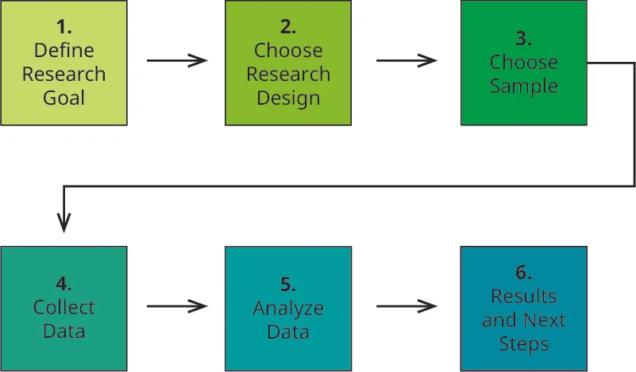
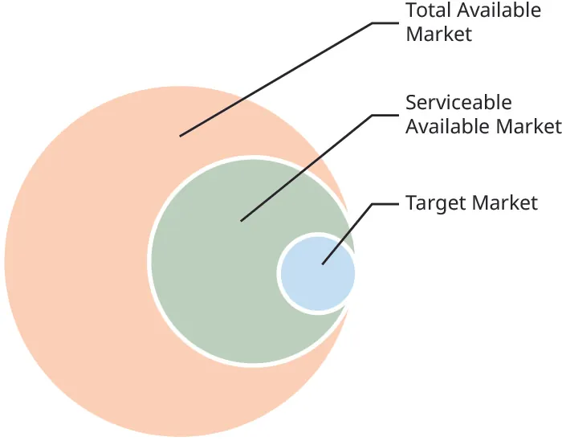

## 8.2   Nghiên cứu thị trường, nhận diện cơ hội thị trường và thị trường mục tiêu

> **🎯 Mục tiêu học tập**
>
> Đến cuối phần này, bạn sẽ có thể:
>
> - Phân biệt nghiên cứu thị trường sơ cấp và thứ cấp
> - Xác định mục tiêu nghiên cứu và tầm quan trọng của thiết kế nghiên cứu
> - Hiểu cách chọn mẫu, thu thập và phân tích dữ liệu
> - Nhận diện các nguồn nghiên cứu thị trường thứ cấp phổ biến
> - Hiểu cách xác định thị trường mục tiêu trong tổng thị trường khả dụng và thị trường khả dụng có thể phục vụ

Bây giờ bạn đã biết các thành phần của marketing mix. Nhưng với vai trò doanh nhân, trước khi có thể đưa ra quyết định về chúng, bạn cần xắn tay áo lên và tiến hành nghiên cứu. Kiểu nghiên cứu này tương tự với các khái niệm được đề cập trong [Nhận diện cơ hội khởi nghiệp](5-introduction); tuy nhiên, nghiên cứu ở đó tập trung vào việc doanh nhân có đủ điều kiện để theo đuổi ý tưởng hay không. Nghiên cứu ở đây thiên về thị trường hơn và được thực hiện sau khi doanh nhân đã quyết định tiến lên, thành lập doanh nghiệp hoặc tung sản phẩm ra thị trường. Về bản chất, nó xoay quanh sản phẩm chứ không phải mức độ sẵn sàng của doanh nhân.

Nghiên cứu thị trường là yếu tố thiết yếu trong giai đoạn lập kế hoạch của bất kỳ startup nào; nếu không, bạn chẳng khác nào đang bước đi trong bóng tối. Ở mức cơ bản, **nghiên cứu thị trường** là quá trình thu thập và phân tích dữ liệu liên quan đến thị trường mục tiêu của doanh nghiệp. Nghiên cứu thị trường có thể bao gồm mọi thứ, từ thông tin về sản phẩm của đối thủ cạnh tranh đến việc diễn giải dữ liệu nhân khẩu học liên quan đến khách hàng tiềm năng.

Mục đích chính của nghiên cứu thị trường là hiểu được nhu cầu và mong muốn của khách hàng nhằm phát hiện ra các cơ hội kinh doanh tiềm năng. Khi bạn có bức tranh rõ ràng về thị trường mục tiêu của mình là ai và họ muốn gì, bạn có thể thiết kế marketing mix hiệu quả hơn để tiếp cận nhóm **nhân khẩu** đó.

Hãy tưởng tượng bạn đang xây dựng một dòng mỹ phẩm hữu cơ, chứa vitamin và khoáng chất, đồng thời dễ sử dụng. Thị trường mục tiêu của bạn là những phụ nữ quan tâm đến sản phẩm làm đẹp chất lượng cao, không gây hại cho bản thân họ hoặc cho môi trường. Nhưng sau khi tiến hành nghiên cứu thị trường sâu rộng, bạn phát hiện rằng phụ nữ từ mười tám đến bốn mươi lăm tuổi thường quan tâm đến những lợi ích mà dòng sản phẩm này mang lại, còn phụ nữ trên năm mươi tuổi thì không. Trước kết quả đó, bạn có thể điều chỉnh lợi ích của dòng sản phẩm để phục vụ thị trường ban đầu mà mình muốn nhắm tới (tất cả phụ nữ), hoặc tập trung vào nhu cầu của một nhóm nhỏ hơn (phụ nữ từ mười tám đến bốn mươi lăm tuổi).

Một bài tập hữu ích để hiểu rõ hơn về **thị trường mục tiêu** là mô tả chi tiết cuộc sống hằng ngày của khách hàng lý tưởng. Bạn có thể làm điều này bằng cách xây dựng chân dung chi tiết của một nhóm khách hàng có khả năng mua sản phẩm của mình. Thông tin có thể bao gồm các yếu tố nhân khẩu học như giới tính, tuổi, thu nhập, học vấn, sắc tộc, tầng lớp xã hội, địa điểm và giai đoạn cuộc sống. Những thông tin khác cũng hữu ích là tâm lý học người tiêu dùng (hoạt động, sở thích, mối quan tâm và lối sống) cũng như hành vi (mức độ thường xuyên họ sử dụng sản phẩm hoặc cảm nhận của họ về sản phẩm). Bạn càng hiểu khách hàng lý tưởng bao nhiêu thì càng dễ tập trung thu hút sự chú ý của họ bằng cách điều chỉnh đề xuất của mình cho phù hợp với sở thích của họ bấy nhiêu.

Nghiên cứu thị trường cũng giúp bạn hiểu đối thủ cạnh tranh là ai và họ đang phục vụ thị trường mục tiêu mà bạn muốn tiếp cận như thế nào. Bạn càng hiểu rõ đối thủ thì càng dễ xác định và khác biệt hóa đề nghị của mình. Hãy cùng tìm hiểu cách marketer thu thập toàn bộ dữ liệu này và giá trị mà dữ liệu mang lại cho doanh nhân.

### Nghiên cứu thị trường sơ cấp

**Nghiên cứu sơ cấp** là việc thu thập dữ liệu mới nhằm trả lời một câu hỏi hoặc một tập hợp câu hỏi cụ thể. Mặc dù tự tiến hành nghiên cứu có thể tiêu tốn nhiều nguồn lực, đây vẫn là cách tốt nhất để có được câu trả lời sát với doanh nghiệp và sản phẩm của bạn, đặc biệt nếu bạn muốn thâm nhập vào những thị trường ngách chưa được nghiên cứu. Nó cũng cho phép bạn đi sâu vào các vấn đề cụ thể. Bằng cách đặt đúng câu hỏi, bạn có thể xác định cảm xúc và thái độ của mọi người đối với thương hiệu, liệu họ có thích thiết kế sản phẩm, có đánh giá cao lợi ích được đề xuất hay có cho rằng mức giá là hợp lý hay không. Hình 8.5 cho thấy các bước phổ biến trong nghiên cứu thị trường sơ cấp.

*Hình 8.5: Có sáu bước trong nghiên cứu thị trường sơ cấp. (ghi công: Bản quyền Đại học Rice, OpenStax, theo giấy phép CC BY NC-SA 4.0)*

#### Xác định mục tiêu nghiên cứu

Bạn nên bắt đầu bằng việc xác định mục tiêu của dự án nghiên cứu. Bạn đang cố gắng tìm hiểu điều gì? Bạn muốn biết thêm về thị trường mục tiêu, sở thích, lựa chọn lối sống và văn hóa của họ, hay muốn biết thêm về đối thủ cạnh tranh và lý do thị trường mục tiêu mua hàng từ họ? Tiêu chí nào sẽ được dùng để xác nhận rằng mục tiêu nghiên cứu đã đạt được?

Bạn càng dành thời gian làm rõ câu hỏi nghiên cứu bao nhiêu thì khả năng đạt được mục tiêu nghiên cứu càng cao bấy nhiêu. Nếu bạn chưa thể xác định chính xác điều mình đang tìm kiếm thì cũng không sao. Nghiên cứu khám phá bằng **nhóm thảo luận** có thể giúp bạn quyết định loại câu hỏi nghiên cứu cần đặt ra. Nhóm thảo luận là một nhóm người, thường từ sáu đến mười hai người tham gia, cùng thảo luận về một chủ đề do người điều phối đưa ra. Người điều phối thường đặt câu hỏi và thu thập dữ liệu định tính để trả lời câu hỏi hoặc xác định hướng nghiên cứu sâu hơn.

Ví dụ, một nhà sản xuất bình nước có thể biết rằng sản phẩm của họ đang gặp vấn đề vì doanh số giảm dần theo thời gian. Công ty không biết chính xác lý do là gì hoặc nên bắt đầu từ đâu, nên họ sẽ dùng nhóm thảo luận để xác định rõ hơn mục tiêu nghiên cứu hoặc vấn đề. Thông qua nhóm thảo luận, họ có thể phát hiện rằng mình đang nhắm sai phân khúc hoặc rằng thị trường cần những thiết kế bình nước tốt hơn. Trao đổi với nhóm thảo luận có thể làm lộ ra những câu hỏi nghiên cứu cần được theo đuổi.

**Merkadoteknia Research and Consulting** là một công ty do người gốc Mỹ Latinh sở hữu, chuyên thực hiện nghiên cứu cho các ngành phục vụ người tiêu dùng gốc Mỹ Latinh. Công ty này giúp các doanh nghiệp thức ăn nhanh, nhà bán lẻ, công ty dược phẩm và nhiều tổ chức khác tiến hành nhóm thảo luận và thu thập hiểu biết về những nhóm người có thể có nền tảng văn hóa khác nhau. Những doanh nghiệp đó có thể không biết chính xác nên bắt đầu nghiên cứu thị trường mục tiêu như thế nào, vì vậy họ sử dụng Merkadoteknia Research and Consulting để tìm hiểu sâu hơn thông qua nhóm thảo luận. Cách tiếp cận này giúp xác định rõ hơn mục tiêu hoặc vấn đề nghiên cứu.

#### Xác định thiết kế nghiên cứu

Bước tiếp theo là xác định những kỹ thuật nghiên cứu nào sẽ giúp bạn trả lời câu hỏi hiệu quả nhất. Việc cân nhắc điều bạn muốn tìm hiểu và ngân sách của mình sẽ giúp bạn quyết định liệu nghiên cứu định tính hay định lượng phù hợp hơn với nhu cầu. Những dự án nghiên cứu được thiết kế tốt thường kết hợp cả hai.

**Nghiên cứu định tính** sử dụng các kỹ thuật mở như quan sát, nhóm thảo luận và phỏng vấn để hiểu các lý do cơ bản, quan điểm và động lực của khách hàng. Chỉ riêng việc quan sát khách hàng tiềm năng, dù trong cửa hàng hay trong hoạt động hằng ngày, và ghi nhận hành vi của họ đã là một dạng **nghiên cứu dân tộc học** đơn giản nhưng hiệu quả, giúp bạn hiểu rõ hơn lối sống và thói quen của khách hàng tiềm năng. Nghiên cứu dân tộc học bao gồm những quan sát trực tiếp đối tượng bằng cách hòa mình vào môi trường của họ. Loại nghiên cứu này giúp công ty thấy được cách mọi người sử dụng sản phẩm trong suốt một ngày.

Ví dụ, nếu bạn sản xuất bình nước và muốn thiết kế một chiếc bình “tốt hơn”, bạn có thể quan sát cách mọi người sử dụng bình nước khi làm việc, tập luyện, di chuyển và trong các bối cảnh khác để hiểu rõ hơn nhu cầu cũng như thói quen của họ. Nghiên cứu “dân tộc học” này thường có thể khám phá ra những nhu cầu tiềm ẩn, hay nhu cầu chưa được nói ra, mà bạn có thể dùng để xây dựng ý tưởng. **Nhu cầu chưa được nói ra** là những nhu cầu được mặc định kỳ vọng ở doanh nghiệp, chẳng hạn một mức chất lượng nhất định hoặc dịch vụ khách hàng tốt. Đây là những kỳ vọng nền mà khách hàng có dựa trên trải nghiệm chung của họ với các sản phẩm.

Thuê một “khách hàng bí mật”, hoặc tự đóng vai một người như vậy, là một cách khác để tìm hiểu khách hàng và nhân viên hành xử như thế nào trong một môi trường bán lẻ cụ thể. **Khách hàng bí mật** là người được công ty hoặc bên thứ ba thuê để đóng giả như một khách mua hàng thật và bí mật kiểm tra một số khía cạnh nhất định của doanh nghiệp. Điều này có thể bao gồm mua sản phẩm, đi dạo xem hàng và hỏi nhân viên, tương tác với khách khác hoặc đơn giản chỉ là quan sát những gì diễn ra trong cửa hàng. Sau trải nghiệm đó, người này sẽ cung cấp phản hồi cho công ty.

Nhóm thảo luận và phỏng vấn một-một rất hữu ích để thu thập những câu trả lời có chiều sâu hơn và khám phá các chủ đề còn gây tranh luận. Cả hai phương pháp đều tốt để đào sâu vào động cơ và mối bận tâm cụ thể của con người, nhất là khi liên quan đến những niềm tin cá nhân và riêng tư. Loại nghiên cứu này hữu ích khi bạn đang cố phát triển một sản phẩm mới lạ hơn, nhưng bạn phải cố gắng loại bỏ “**thiên lệch ủng hộ**”, tức là người tham gia bảng thảo luận có thể tỏ ra tích cực với các khái niệm mới chỉ để làm hài lòng hoặc chiều ý người điều phối. Với phỏng vấn một-một, điều quan trọng là phải xây dựng hướng dẫn phỏng vấn hoặc thảo luận kỹ lưỡng để các thành viên khác trong nhóm cũng có thể tiến hành phỏng vấn. Bằng cách đó, bạn sẽ đảm bảo cách tiếp cận nhất quán trong việc đặt câu hỏi then chốt và ghi nhận phản hồi nhằm dẫn dắt bước tiếp theo của quá trình phát triển sản phẩm.

**Nghiên cứu định lượng** tập trung vào việc tạo ra dữ liệu số có thể chuyển thành thống kê hữu ích. Loại nghiên cứu này thường xuất hiện dưới dạng khảo sát hoặc bảng hỏi với các câu hỏi trắc nghiệm và đáp án định sẵn. Mặc dù những khảo sát này không cho phép người tham gia bộc lộ nhiều ý kiến tự do, tính tập trung của câu trả lời giúp marketer nhận ra các xu hướng, chẳng hạn như nền tảng mạng xã hội nào được khách hàng hoặc khách hàng tiềm năng ưa chuộng. Ví dụ, nhà nghiên cứu có thể phát hiện rằng Instagram là ứng dụng mạng xã hội được sử dụng nhiều nhất nhờ tính dễ dùng và khả năng khơi gợi phản ứng cảm xúc với hình ảnh.

Các câu hỏi khảo sát mẫu có thể là từ “Tuần này bạn đã đến cửa hàng tiện lợi bao nhiêu lần?” đến “Bạn thuộc nhóm độ tuổi nào?” Cách tiếp cận này là phương thức hiệu quả để thu thập nhiều dữ liệu, bởi sau khi khảo sát được viết xong, nó có thể được phân phát trực tiếp hoặc trực tuyến cho bao nhiêu người tham gia tùy ý. Thông thường, số người bạn khảo sát càng lớn thì dữ liệu càng phản ánh chính xác nhóm nhân khẩu mà bạn đang xem xét.

Một cách khác để tạo ra kết quả định lượng là thông qua **nghiên cứu nhân quả** và thử nghiệm thị trường. Trong cả hai trường hợp, bạn đưa ra một nguyên nhân và ghi nhận kết quả. Ví dụ điển hình là buổi thử nếm, trong đó phản ứng và sở thích của mọi người đối với các hương vị nước ép khác nhau được ghi lại. Xét đến nguồn lực hạn chế của nhiều startup, thử nghiệm thị trường là cách rất tốt để chắc chắn sản phẩm của bạn thực sự vận hành hiệu quả trước khi bạn bắt đầu đầu tư cho phân phối.

Một phương pháp còn tinh vi hơn và cũng tốn kém hơn là **phân tích kết hợp**, trong đó người trả lời phải xếp hạng, lựa chọn hoặc đánh giá một số đặc tính hay lợi ích “liên kết” với nhau. Cách tiếp cận mô phỏng tình huống đời thực này sẽ mang lại kết quả rất hữu ích từ người mua tiềm năng, thường cho phép xếp hạng các đặc tính hoặc lợi ích theo giá trị cảm nhận hay mức độ quan trọng.

Ví dụ, giả sử công ty của bạn đang cố tạo ra một bình nước tái sử dụng để cạnh tranh trong một thị trường đông đúc. Nếu dùng phân tích kết hợp, bạn sẽ tạo một khảo sát liệt kê các thuộc tính và mức giá của bình nước nhằm cho người tiêu dùng thấy các lựa chọn khác nhau. Chẳng hạn, khách hàng có thể được cung cấp một nhóm bình nước rất giống nhau, mỗi chiếc mang một tập hợp đặc tính mà công ty muốn kiểm thử. Các đặc tính có thể bao gồm nắp khóa chống rò rỉ, các dáng bình khác nhau để dễ cầm và dễ uống hơn, cùng nhiều màu sắc và kích thước khác nhau. Mỗi lựa chọn có thể có một mức giá riêng và khách hàng sẽ chọn, xếp hạng hoặc chấm điểm từng lựa chọn dựa trên các thuộc tính và mức giá đó. Mỗi lựa chọn có thể được mô tả bằng chữ hoặc hình ảnh trong khảo sát, và khách hàng sẽ được yêu cầu chọn ra phương án yêu thích nhất hoặc xếp hạng toàn bộ các lựa chọn. Sau khi thu thập thông tin và dữ liệu từ nhiều người tiêu dùng, nhà nghiên cứu sẽ sử dụng phân tích thống kê như hồi quy tuyến tính hoặc các kỹ thuật khác để xác định thuộc tính nào của bình nước quan trọng hơn với khách hàng và mức giá họ sẵn sàng trả. Dựa trên hiểu biết này, công ty có thể tạo ra một sản phẩm có khả năng vượt qua đối thủ cạnh tranh.

#### Chọn mẫu

Tiếp theo, nhà nghiên cứu cần xác định phương pháp chọn mẫu. Trong nghiên cứu, **mẫu khảo sát** của bạn là những người bạn sẽ khảo sát và số lượng người được đưa vào nghiên cứu. Trong đa số trường hợp, bạn sẽ muốn có một mẫu phản ánh thị trường mục tiêu, đặc biệt nếu đang cố tìm hiểu sở thích của khách hàng lý tưởng và cách khiến họ mua sản phẩm. Những mẫu không lựa chọn thị trường mục tiêu có thể hữu ích khi bạn đang cố xác định xem thị trường mục tiêu của mình có thể là ai, nhưng đó không phải cách hiệu quả để hiểu khách hàng lý tưởng.

Nói chung, mẫu càng lớn thì dữ liệu càng chính xác, dù nhà nghiên cứu không nhất thiết phải khảo sát tất cả mọi người trong một thị trường. Ví dụ, nếu bạn có danh sách 5.000 liên hệ, bạn có thể chọn tiếp cận 500 người đại diện cho toàn bộ nhóm đó. Khảo sát toàn bộ tổng thể có thể tốn thời gian và chi phí, nên việc chọn đúng một tập con người phù hợp vẫn có thể cho kết quả tốt. Mẫu phải đủ lớn để có ý nghĩa thống kê, tức là mối quan hệ giữa các biến không phải kết quả của sự ngẫu nhiên. Khi đó, mẫu có thể cho nhà nghiên cứu cái nhìn chính xác về một hiện tượng cụ thể.

Ví dụ, bạn có thể kiểm tra xem nam và nữ thực sự có sở thích khác nhau hay tương tự nhau đối với các thuộc tính của bình nước. Trong trường hợp này, yếu tố có ý nghĩa là giới tính của khách hàng tiềm năng. Nếu mẫu của bạn đủ lớn (ví dụ 500 trên 5.000 người) và bạn nhận thấy nam giới tìm kiếm các thuộc tính khác với nữ giới, thì rất khó có khả năng những khác biệt đó chỉ là ngẫu nhiên. Nguyên nhân của sự khác biệt sẽ là giới tính.

Vì vậy, hãy lưu ý rằng sai số về độ tin cậy và độ giá trị có thể phát sinh nếu mẫu không được lựa chọn cẩn thận. Khi đó, ý nghĩa thống kê trở nên quan trọng trong việc đo lường **độ tin cậy** vì nó cho thấy có một khác biệt thực sự trong điều đang được đo. Nếu có sự khác biệt giữa phản hồi của nam và nữ trong ví dụ bình nước của chúng ta, việc kiểm tra ý nghĩa sẽ xác định xem những khác biệt đó có thật sự quan trọng hay chỉ do ngẫu nhiên. Ý nghĩa được đo bằng giá trị xác suất, hay giá trị P. Nếu giá trị này bằng hoặc thấp hơn 5 phần trăm, nó thường được xem là khác biệt có ý nghĩa và không do ngẫu nhiên, từ đó nhà nghiên cứu có thể kết luận rằng câu trả lời của hai giới thực sự khác nhau. Còn độ giá trị nghĩa là yếu tố đang được đo có liên quan đến mục tiêu nghiên cứu. Nói cách khác, các câu hỏi được đặt ra phải thật sự trả lời được mục tiêu nghiên cứu của bạn.

Mặc dù các mẫu ngẫu nhiên có thể hữu ích cho một số loại dự án nghiên cứu, nhiều nhà nghiên cứu chủ động lựa chọn người tham gia mẫu dựa trên các yếu tố kinh tế và dân tộc học để bảo đảm họ phản ánh chính xác bản chất của nhóm nhân khẩu mà mình muốn tìm hiểu.

#### Thu thập dữ liệu

Sau khi đã xác định mục tiêu nghiên cứu, chọn thiết kế và quyết định mẫu, bạn đã sẵn sàng bắt đầu thu thập dữ liệu. Dữ liệu có thể được thu thập thông qua quan sát và ghi chép. Ví dụ, nếu bạn đang cố tìm hiểu bố cục cửa hàng có tạo ra doanh số hiệu quả nhất hay không, bạn có thể quan sát luồng di chuyển và ghi lại mọi người nhìn vào đâu cũng như họ thực sự mua gì. Sau đó, bạn có thể thay đổi cách trưng bày hàng hóa, kích thước lối đi hoặc không gian để xem liệu mọi người có chú ý đến những món hàng khác mà trước đó họ chưa thấy hay không. Dựa trên quan sát và dữ liệu bán hàng, bạn có thể xác định luồng di chuyển tốt nhất cho mặt bằng của mình.

Phỏng vấn cũng có thể giúp thu được những câu trả lời mở. Bạn có thể phỏng vấn khách hàng tiềm năng về cách tốt nhất để giao tiếp với họ và những điều họ thích ở sản phẩm của đối thủ. Điều này có thể giúp bạn thu được thêm những lựa chọn mà trước đó bạn chưa nghĩ tới để đưa vào khảo sát, đây cũng là một cách lấy dữ liệu tổng hợp.

Khảo sát có thể được thực hiện thủ công hoặc thông qua các công cụ trực tuyến như Survey Monkey hoặc Qualtrics. Khảo sát rất hữu ích vì bạn có thể hỏi khách hàng hiện tại hoặc tiềm năng về sản phẩm của mình, sản phẩm của đối thủ, dịch vụ khách hàng và bất kỳ thông tin nào khác mà bạn cần để tạo dựng hoặc cải thiện doanh nghiệp. Đây là cách dễ dàng để thu thập lượng lớn dữ liệu từ nhiều khách hàng và cho phép bạn tính toán phản hồi. Các công cụ trực tuyến đặc biệt hữu ích vì chúng cung cấp kho dữ liệu có thể xuất ra các công cụ phân tích khác như Excel hoặc SPSS.

Dù bạn sử dụng kỹ thuật nghiên cứu nào, hãy luôn cảnh giác với sai sót trong quá trình thu thập dữ liệu. Ghi nhầm câu trả lời, truyền đạt hướng dẫn không đúng cho người tham gia hoặc phải dịch ngay tại chỗ đều có thể tạo ra thiên lệch làm sai lệch câu trả lời và cho bạn kết quả không chính xác.

#### Phân tích dữ liệu

Sau khi thu thập dữ liệu, bước tiếp theo là diễn giải nó. Cách bạn phân tích dữ liệu phụ thuộc phần lớn vào điều bạn muốn rút ra từ đó. Thông thường, bạn sẽ tìm kiếm các mẫu hình và xu hướng trong các câu trả lời. Phân tích dữ liệu là một lĩnh vực riêng, và khi cần đến các phân tích phức tạp, tìm kiếm sự hỗ trợ của chuyên gia thường rất đáng với chi phí bỏ ra. Bạn có thể tìm thấy chuyên gia tại các công ty nghiên cứu tiếp thị chuyên thu thập và phân tích dữ liệu cho doanh nghiệp, chẳng hạn như **Merkadoteknia Research and Consulting**. Những đơn vị này có thể được tìm thấy trực tuyến hoặc thông qua các tổ chức kinh doanh địa phương như phòng thương mại.

#### Kết quả và các bước tiếp theo

Ở giai đoạn này, doanh nhân tìm cách đối chiếu kết quả phân tích với mục tiêu nghiên cứu đã đặt ra. Ví dụ, nếu bạn thực hiện nghiên cứu khám phá về một sản phẩm tiềm năng muốn đưa ra thị trường, thì đây là lúc đặt các câu hỏi như liệu kết quả có cho thấy tiềm năng thị trường hay không. Tương tự, nếu mục tiêu là tìm hiểu khách hàng thích điều gì ở sản phẩm cạnh tranh, thì đây là lúc liệt kê các kết quả đó và xác định xem chúng có đáng để tích hợp vào sản phẩm của bạn hay không. Dù thế nào đi nữa, điều quan trọng là phải cởi mở với những gì dữ liệu nói ra, ngay cả khi kết quả trái với điều bạn hy vọng. Nghiên cứu nên là cơ hội để phát triển và là bản đồ định hướng cho việc tinh chỉnh ý tưởng.

### Nghiên cứu thị trường thứ cấp

**Nghiên cứu thứ cấp** là nghiên cứu sử dụng dữ liệu sẵn có do một tổ chức khác thu thập. Nhiều khi, những dữ liệu này do các cơ quan chính phủ thu thập để trả lời nhiều câu hỏi hoặc vấn đề chung cho nhiều tổ chức và cá nhân. Nghiên cứu thứ cấp thường giải đáp các câu hỏi tổng quát hơn mà doanh nhân có thể có, như thông tin dân số, mức mua hàng trung bình hoặc xu hướng. Nếu có một câu hỏi cụ thể không thể trả lời được, chẳng hạn có bao nhiêu người sẽ quan tâm đến một sản phẩm mới với những thuộc tính nhất định, thì nghiên cứu sơ cấp sẽ phải giải quyết. Mặc dù một số loại nghiên cứu này phải mua, phần lớn là miễn phí cho công chúng và là lựa chọn tốt cho doanh nhân có nguồn lực tài chính hạn chế. Một số nguồn dữ liệu miễn phí thường được sử dụng gồm **US Census Bureau**, **Fact Finder**, **Pew Research Center**, **Current Population Survey**, **Small Business Administration (SBA)** và **Texas State Data Center**.

Những nguồn hữu ích khác là các hiệp hội ngành nghề cung cấp thông tin về từng ngành cụ thể, cũng như báo chí, tạp chí, tạp san học thuật, phòng thương mại và các tổ chức khác thu thập dữ liệu ở cấp địa phương, bang, quốc gia và quốc tế. Những nguồn như vậy có thể cung cấp thông tin từ quy mô dân số đến đặc điểm cộng đồng và thói quen chi tiêu. [Bảng 8.3](8-2-market-research-market-opportunity-recognition-and-target-market#fs-idm227657312) liệt kê một số cơ sở dữ liệu miễn phí giàu thông tin.

**Bảng 8.3: Cơ sở dữ liệu cho nghiên cứu thứ cấp**

| Cơ sở dữ liệu | Thông tin | Địa chỉ URL |
| --- | --- | --- |
| Census Bureau | Dữ liệu kinh tế, nhân khẩu học, địa lý và xã hội | [https://www.census.gov/](https://www.census.gov/) |
| Fact Finder | Dữ liệu kinh tế, dân số và địa lý | [https://factfinder.census.gov/](https://factfinder.census.gov/) |
| American Community Survey | Dữ liệu điều tra dân số được cập nhật | [https://www.census.gov/programs-surveys/acs/](https://www.census.gov/programs-surveys/acs/) |
| Pew Research Center | Kho dữ liệu khảo sát các xu hướng, vấn đề, thái độ và đặc điểm nhân khẩu học | [http://www.pewresearch.org](http://www.pewresearch.org) |
| Pew Hispanic Center | Khảo sát về xu hướng, đặc điểm nhân khẩu học và các vấn đề của cộng đồng gốc Mỹ Latinh | [http://www.pewhispanic.org/](http://www.pewhispanic.org/) |
| Current Population Survey | Khảo sát hằng tháng các hộ gia đình tại Hoa Kỳ về dữ liệu lao động | [http://www.bls.gov/cps/home.htm](http://www.bls.gov/cps/home.htm) |
| Texas State Data Center | Dữ liệu nhân khẩu học cấp bang | [http://txsdc.utsa.edu/](http://txsdc.utsa.edu/) |
| IBISWorld | Xu hướng ngành tại Hoa Kỳ | [http://www.ibisworld.com](http://www.ibisworld.com) |
| Mergent Online | Dữ liệu doanh nghiệp tại Hoa Kỳ | [http://www.mergentonline.com/](http://www.mergentonline.com/) |
| Demographics Now | Dữ liệu nhân khẩu học và doanh nghiệp tại Hoa Kỳ | [http://www.demographicsnow.com/](http://www.demographicsnow.com/) |

Mặc dù các nguồn miễn phí có thể cung cấp rất nhiều thông tin, nghiên cứu của chúng thường kém cụ thể hơn so với những nguồn thu phí. Các công ty như **Nielsen/Arbitron**, **Simmons** và **Geoscape** có thể cung cấp thông tin chi tiết hơn về hành vi sử dụng phương tiện truyền thông, lựa chọn lối sống, mức tiêu dùng sản phẩm cụ thể, dữ liệu phân khúc địa lý và nhiều khía cạnh khác. Bảng 8.4 liệt kê một số nguồn cho loại nghiên cứu này.

**Bảng 8.4: Các nguồn dữ liệu thuê bao cho nghiên cứu thứ cấp**

| Nguồn | Thông tin | Địa chỉ URL |
| --- | --- | --- |
| Nielsen PRIZM | Phân khúc địa lý - nhân khẩu học | [https://segmentationsolutionsdev.nielsen.com/mybestsegments/Default.jsp?ID=20&pageName=ZIP%2BCode%2BLookup](https://segmentationsolutionsdev.nielsen.com/mybestsegments/Default.jsp?ID=20&pageName=ZIP%2BCode%2BLookup) |
| Nielsen TV ratings | Xếp hạng truyền hình, truyền thông và nghiên cứu | [http://www.nielsen.com/us/en/insights.html](http://www.nielsen.com/us/en/insights.html) |
| Nielsen Audio | Xếp hạng âm thanh, truyền thông và nghiên cứu | [http://www.nielsen.com/us/en/solutions/capabilities/audio.html](http://www.nielsen.com/us/en/solutions/capabilities/audio.html) |
| Experian Simmons | Nghiên cứu người tiêu dùng, xu hướng và hiểu biết chuyên sâu | [http://www.experian.com/](http://www.experian.com/) |
| Scarborough | Nghiên cứu người tiêu dùng, xu hướng và hiểu biết chuyên sâu | [http://www.scarborough.com/](http://www.scarborough.com/) |
| Geoscape | Nghiên cứu người tiêu dùng đa văn hóa | [http://geoscape.com/](http://geoscape.com/) |

Cuối cùng, không có cách hoàn hảo duy nhất để tiến hành nghiên cứu. Tất cả phụ thuộc vào điều bạn đang cố tìm hiểu và cách tiếp cận nào phù hợp nhất để làm điều đó. Nếu mới bắt đầu, bạn có thể muốn tận dụng tối đa nghiên cứu thứ cấp vì nó miễn phí. Bạn cũng có thể thử thu thập dữ liệu sơ cấp bằng cách trò chuyện với bạn bè, gia đình và những người bạn gặp trong cộng đồng địa phương hoặc trực tuyến. Nếu bạn đang học hoặc làm việc tại một trường đại học, nhiều khả năng bạn sẽ có quyền truy cập miễn phí vào các báo cáo nghiên cứu thị trường (**marketresearch.com**, **Frost & Sullivan**, v.v.).

> **❓ Bạn đã sẵn sàng chưa?: Nghiên cứu thị trường của bạn**
>
> Hãy giả sử bạn là một doanh nhân muốn tạo ra một món đồ chơi giáo dục mới cho trẻ nhỏ nhằm phát triển kỹ năng vận động, sử dụng hình nhân, hình khối hoặc các khối xếp. Khi còn học đại học, bạn từng làm việc ở khu đồ trẻ em của một nhà bán lẻ nổi tiếng. Từ trải nghiệm này, bạn nhận ra có thể đang tồn tại một nhu cầu đối với đồ chơi giáo dục trên thị trường chưa được đáp ứng, nhưng bạn chưa thực sự chắc chắn nên khai thác điều đó như thế nào.
>
>
> - Sử dụng quy trình nghiên cứu thị trường, hãy xây dựng một kế hoạch nghiên cứu giúp bạn xác định tính khả thi của ý tưởng.

### Nhận diện và xác thực cơ hội thị trường

Một mục tiêu phổ biến của nghiên cứu thị trường, đã được nhắc đến trong các chương trước, đặc biệt là chương [Nhận diện cơ hội khởi nghiệp](5-introduction), là xác định **cơ hội thị trường**, tức một nhu cầu chưa được đáp ứng trong một nhóm nhân khẩu mục tiêu mà một sản phẩm hiện có hoặc sản phẩm mới có thể thỏa mãn. Tìm kiếm những khoảng trống hoặc nhu cầu chưa được đáp ứng trên thị trường là một cách để nhận diện cơ hội thị trường cho cả hàng hóa và dịch vụ. Với sản phẩm mới, điều này có nghĩa là xem xét nhu cầu của một nhóm nhân khẩu, xác định những nhu cầu nào chưa được đáp ứng và xác định loại sản phẩm nào có thể đáp ứng chúng. Dựa trên phần thảo luận trước về nghiên cứu thứ cấp, có rất nhiều nơi có thể tìm dữ liệu trực tuyến hoặc ngoại tuyến để xác định các nhu cầu này.

Tương tự, bạn có thể nhận ra những vấn đề phổ biến ở cấp địa phương, quốc gia hoặc toàn cầu thông qua quan sát và tương tác trực tiếp với khách hàng tiềm năng, rồi cố gắng tạo ra các dịch vụ có thể giải quyết chúng. Những thay đổi về xã hội, kinh tế, công nghệ và quy định đều có khả năng tạo ra cơ hội thị trường.

Khi nhà phát minh David **Dodgen** chứng kiến những đau khổ mà cơn bão Katrina để lại, ông nhận ra một nhu cầu chưa được đáp ứng do sự kiện này tạo ra. Khi quan sát thảm họa, ông thấy rằng khi bão hoặc các sự kiện tai hại khác xảy ra, chúng có thể làm ô nhiễm nguồn nước của một vùng hoặc một thành phố, hoặc khiến người dân không thể tiếp cận nước sạch. Vì vậy, ông đã tạo ra **AquaPodkit**, một túi chứa bằng nhựa có thể tạm thời trữ nước sạch trong nhiều tuần trong trường hợp khẩn cấp. Cơ quan Quản lý Khẩn cấp Liên bang Hoa Kỳ (FEMA) khuyến nghị mọi người nên đổ đầy bồn tắm nếu họ cho rằng nước có thể trở nên khan hiếm. Tuy nhiên, bồn tắm thường bẩn và mọi người có thể không có thời gian để làm sạch. Từ đó, Dodgen phát triển một lớp lót nhựa, hay “túi bọc bồn tắm”, được sản xuất tại Hoa Kỳ và an toàn để lấy nước uống, cùng với một máy bơm giúp đóng kín và mở túi nhựa khi cần dùng nước. Bộ dụng cụ này có thể chứa tới 100 gallon nước sạch trong bồn tắm và đã chứng minh được thành công; nó cũng từng được CNBC, *Entrepreneur* và *New York Times* giới thiệu.

> **🔗 Liên kết học tập**
>
> Hãy xem [video về AquaPodkit](https://openstax.org/l/52AquaPod) để tìm hiểu thêm. Dodgen cũng tạo ra [những túi và máy bơm nhỏ hơn](https://openstax.org/l/52BagsPumps) có thể cất giữ ở bất cứ đâu, không chỉ trong bồn tắm.

> **🛠️ Bạn có thể làm gì?: Biến đổi khí hậu**
>
> Bối cảnh: Biến đổi khí hậu của Trái Đất là một chủ đề có tầm quan trọng lớn hiện nay. Trong hàng trăm nghìn năm, sự thay đổi nhiệt độ của Trái Đất được cho là do độ nghiêng của trục quay làm cho năng lượng đi vào khí quyển nhiều hơn hoặc ít hơn. Gần đây, khí hậu Trái Đất đã trải qua mức tăng nhiệt độ mạnh, và đa số các nhà khoa học trên thế giới đều đồng ý rằng điều này xuất phát từ các hoạt động của con người thải carbon dioxide vào khí quyển.
>
>
>
> Phát thải khí nhà kính đã làm nhiệt độ Trái Đất tăng lên đến mức các sông băng ở Nam Cực và Greenland hiện đang biến mất nhanh gấp mười lần so với tốc độ phục hồi bình thường của một thời kỳ băng hà, chưa kể đến hàng loạt thảm họa thời tiết đang diễn ra trên khắp thế giới.[^9] Những thay đổi về nhiệt độ này đã khiến các dải băng tan chảy, các mũ tuyết rút lui, đại dương ấm lên và trở nên axit hơn, mực nước dâng cao và thời tiết khắc nghiệt gia tăng.
>
>
>
> Dù nghe có vẻ đáng lo ngại, chúng ta vẫn còn thời gian để thay đổi những tác động tiêu cực của hiện tượng nóng lên toàn cầu. Điều này có thể mở ra một số cơ hội cho các doanh nhân xã hội quan tâm đến môi trường Trái Đất và hoạt động kinh doanh.
>
>
>
> Nhiệm vụ của bạn: Với tư cách là một doanh nhân xã hội, hãy xác định một hoặc hai cơ hội kinh doanh mà bạn có thể phát triển và xác thực tính khả thi thị trường.
>
>
> - Có những loại cơ hội nào để tạo ra thay đổi tích cực?
> - Bạn có thể xác thực các giả định của mình như thế nào?
> - Bạn sẽ kiểm tra các nhu cầu chưa được đáp ứng ra sao?
> - Bạn sẽ tiến hành loại nghiên cứu nào? Vì sao?

Đôi khi những nhu cầu chưa được đáp ứng không xuất hiện ngay lập tức. Một cách để hiểu rõ hơn các cơ hội của thị trường là tiến hành **phân tích thị trường**, tức phân tích mức độ quan tâm tổng thể đối với sản phẩm hoặc dịch vụ trong ngành xét theo thị trường mục tiêu nhằm xác định tính khả thi và tiềm năng lợi nhuận. **Xác thực**, không nên nhầm với *độ giá trị*, là hành động xác minh rằng một sản phẩm cụ thể thực sự cần thiết trong thị trường mục tiêu. Điều này có thể được thực hiện bằng các cuộc phỏng vấn hoặc khảo sát chính thức hay không chính thức với khách hàng tiềm năng để thu thập phản hồi của họ. Dropbox là ví dụ về một công ty đã xác thực lặp đi lặp lại cho đến khi tạo ra được một sản phẩm có thể hoạt động với thị trường đại chúng (xem Launching the Imperfect Business: Lean Startup).

Ngoài việc xác định đối thủ cạnh tranh và đánh giá tiềm năng tăng trưởng cũng như lợi nhuận, một phân tích thị trường tốt còn xác định **tổng thị trường khả dụng (TAM)** cho một sản phẩm cụ thể, tức tổng nhu cầu cảm nhận đối với sản phẩm hoặc dịch vụ trong thị trường. Nó cũng xác định **thị trường khả dụng có thể phục vụ (SAM)**, tức phần thị trường mà doanh nghiệp của bạn có thể phục vụ dựa trên sản phẩm, dịch vụ và vị trí của mình ([Hình 8.6](8-2-market-research-market-opportunity-recognition-and-target-market#OSX_Eship_08_01_TAM_SAM)).

*Hình 8.6: Doanh nhân phải tập trung vào thị trường mục tiêu nằm trong TAM và SAM, đồng thời phân bổ nguồn lực để thu hút những khách hàng có thể được thỏa mãn bởi đề xuất giá trị. (ghi công: Bản quyền Đại học Rice, OpenStax, theo giấy phép CC BY NC-SA 4.0)*

Để tính toán điều này, hãy quay lại ví dụ về bình nước. Giả sử bạn đang cố xác định thị trường mục tiêu của mình dựa trên ý tưởng đó. Để tính TAM, bạn sẽ xem xét toàn bộ ngành và xác định tổng số khách hàng khả dụng cho bình nước hoặc tổng doanh thu khả dụng. Để tìm con số này, bạn có thể tra cứu số liệu ngành của danh mục đó trên các cơ sở dữ liệu như **IBISWorld**, đã được nhắc trước đó, hoặc bất kỳ dữ liệu nào khác từ **World Bank** hay **World Factbook** để xem số lượng khách hàng hoặc doanh thu tiềm năng. Cách này được gọi là **phương pháp top-down**, vì bạn đang xem xét các yếu tố kinh tế vĩ mô để xác định tiềm năng của ngành.

Một cách khác để tính TAM là dùng **phương pháp bottom-up**, tức là đếm quy mô các thị trường địa phương và ước tính số khách hàng của đối thủ. Sau khi thu thập thông tin này, tất cả các thị trường địa phương sẽ được cộng lại và nhân với mức chi tiêu trung bình hằng năm cho sản phẩm. Vì công ty của bạn không thể phục vụ toàn bộ các thị trường, bước tiếp theo là xác định SAM. Bạn có thể ước tính số lượng khách hàng mình có thể phục vụ bằng cách tách thị trường thành những nhóm mà bạn có thể phục vụ dựa trên đặc tính sản phẩm cũng như các yếu tố địa lý, nhân khẩu học và văn hóa, cùng các yếu tố khác.

Cuối cùng, xét đến các ràng buộc của doanh nghiệp và sức mạnh của đối thủ cạnh tranh, bạn sẽ xác định thị trường mục tiêu tập trung để tránh lãng phí nguồn lực quý giá cho việc tiếp thị đến những người nhìn chung không quan tâm đến việc mua sản phẩm của bạn.

Với vai trò doanh nhân, bạn muốn phân khúc thị trường và xác định xem có những “túi” khách hàng tiềm năng nào mà mình có thể phục vụ hay không. Phân khúc, lựa chọn thị trường mục tiêu và định vị (STP) sẽ giúp bạn tìm ra đâu là khách hàng tốt nhất của mình và cho phép bạn phân bổ nguồn lực để phục vụ họ hiệu quả hơn. Bây giờ hãy cùng xem các quá trình này.

**phân khúc thị trường** có nghĩa là bạn chia toàn bộ dân số thành những nhóm người đồng nhất có sở thích, nền tảng, lối sống, đặc điểm nhân khẩu học và thậm chí văn hóa tương tự nhau. Bạn có thể phân khúc theo nhóm tuổi, giới tính, sắc tộc, nghề nghiệp, thu nhập hoặc hoạt động. Có rất nhiều cách để chia các nhóm này nhằm chọn ra cách phù hợp nhất cho doanh nghiệp của bạn.

Bước tiếp theo là **lựa chọn thị trường mục tiêu**. Bạn chọn một mục tiêu dựa trên khả năng và mức độ sẵn sàng mua của họ. Như đã nói trước đó, thị trường mục tiêu giúp xác định rõ bạn sẽ phục vụ nhóm nào trong toàn bộ thị trường và bạn sẽ định vị bản thân như thế nào để phân biệt công ty hoặc sản phẩm của mình với đối thủ cạnh tranh.

**Định vị** (**đề xuất giá trị**) là tuyên bố về cách bạn muốn khách hàng cảm nhận công ty, hàng hóa hoặc dịch vụ của mình. Ví dụ, **ModCloth** là một nhà bán lẻ indie trực tuyến bán quần áo phong cách vintage hoặc mang hơi hướng vintage, hợp thời, vui tươi, hấp dẫn người tiêu dùng toàn cầu muốn ăn mặc sành điệu. Một ví dụ khác là **Wag!**, công ty định vị mình là ứng dụng cho phép chủ nuôi thú cưng tìm người dắt chó theo nhu cầu tức thời. Có thể xem như “Uber dành cho chó” muốn đi dạo khi chủ của chúng không thể đưa chúng đi!

> **💼 Doanh nhân thực chiến: Ứng dụng dắt chó đi dạo Wag!**
>
> 
>
> *Hình 8.7: Ứng dụng Wag! cho phép những người bận rộn chọn từ danh sách những người dắt chó đã được sàng lọc trước để những người bạn lông xù của họ được chăm sóc chu đáo trong khi họ đi làm. (ghi công: chỉnh sửa từ “A woman with her dog@Takayama” của JAR/Wikimedia Commons, CC BY 2.0)*
>
>
>
> Là một người nuôi chó, CEO và đồng sáng lập Wag! là Joshua **Viner** từng vất vả trong việc tìm thời gian dắt chú chó yêu quý đi dạo sau một ngày làm việc dài. Anh biết việc để chó bị nhốt trong nhà cả ngày là không công bằng. Anh thậm chí từng cân nhắc tìm cho nó một mái nhà mới. Chính tình huống khó xử này đã thôi thúc anh tạo ra Wag! vào năm 2015 như một cách giúp những người như anh, yêu chó nhưng không phải lúc nào cũng có thời gian bảo đảm chó được vận động đầy đủ.
>
>
>
> Để bắt đầu, Viner hợp tác với Jason **Meltzer**, người giống anh ở chỗ đều có kinh nghiệm xây dựng công ty công nghệ tiêu dùng. Meltzer là nhà sáng lập công ty dịch vụ thú cưng **Surfdog LA**, vốn đã có thành tích thành công được xác thực. Cùng nhau, họ phát triển một ứng dụng và website với mục tiêu giúp việc nuôi chó trở nên dễ dàng và bớt cảm giác áy náy. Wag! cho khách hàng tiếp cận những người dắt chó đáng tin cậy, đã được sàng lọc trước, có thể đưa chó đi dạo trong thời gian ngắn mà chủ không cần có mặt. Khách hàng thậm chí còn có thể theo dõi việc dắt chó qua ứng dụng.
>
>
>
> Kể từ khi ra mắt, Wag! đã tăng trưởng và thâm nhập các thị trường mới với tốc độ ổn định. Sau khi triển khai dịch vụ tại Los Angeles và San Francisco vào năm 2015, công ty tiếp tục mở rộng sang nhiều thành phố trên khắp Hoa Kỳ.
>
>
>
> Vì những người dắt chó trên ứng dụng có quyền vào nhà khách hàng, một trong những thách thức mà Wag! phải đối mặt là bảo đảm khách hàng tin tưởng công ty và đội ngũ dắt chó của họ ([Hình 8.7](8-2-market-research-market-opportunity-recognition-and-target-market#OSX_Eship_08_01_WagApp)). Một thách thức khác là sự an toàn của chính chú chó. Điều gì xảy ra nếu chó bị thương hoặc bị lạc? Chỉ cần vài vấn đề như vậy cũng đủ để biến thành rắc rối lớn.
>
>
> - Hãy mô tả thị trường mục tiêu của dịch vụ này.
> - Có những khách hàng tiềm năng nào khác cũng có thể là đối tượng phù hợp cho dịch vụ này không?
> - Viner có thể định vị doanh nghiệp của mình như thế nào để trấn an chủ nuôi rằng chó của họ sẽ được chăm sóc tốt?
