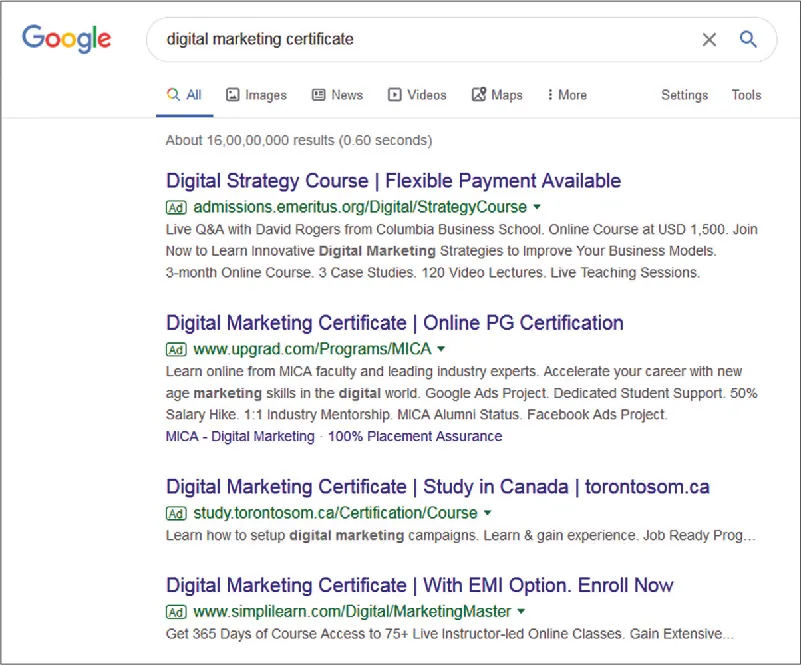

## 8.3   Kỹ thuật và công cụ tiếp thị dành cho doanh nhân

> **🎯 Mục tiêu học tập**
>
> Đến cuối phần này, bạn sẽ có thể:
>
> - Mô tả các kỹ thuật tiếp thị khởi nghiệp hiệu quả (du kích, quan hệ, thám hiểm, thời gian thực, lan truyền, số, truyền miệng)
> - Thảo luận ưu điểm và hạn chế của các kỹ thuật tiếp thị này

Một trong những sự thật khó chấp nhận nhất đối với doanh nhân khi bắt đầu kinh doanh mới là nguồn lực tài chính và nhân sự đều có hạn. May mắn thay, có nhiều kỹ thuật tiếp thị dành cho doanh nhân không đòi hỏi nhiều hơn ngoài một lượng đáng kể “mồ hôi công sức”.

### Tiếp thị du kích

Được nhà văn và chiến lược gia kinh doanh Jay **Conrad Levinson** đặt ra vào năm 1984, **tiếp thị du kích** là những cách tiếp cận sáng tạo trong tiếp thị nhằm đạt được mức độ phơi bày tối đa thông qua các phương tiện phi truyền thống. Tiếp thị du kích thường đồng nghĩa với việc dàn dựng một sự kiện hoặc một tương tác nào đó để thu hút sự chú ý đến thương hiệu hoặc sản phẩm. Mục tiêu là khơi gợi tò mò nơi người tiêu dùng bằng cách nổi bật khỏi những thông điệp bán hàng thông thường và hàng nghìn quảng cáo mà họ tiếp xúc mỗi ngày. Những cách tiếp cận này thường có yếu tố khuyến khích khách hàng tiềm năng tương tác với doanh nghiệp hoặc sản phẩm theo cách vui vẻ.

Dennis **Crowley**, một doanh nhân tình cờ thành công, tự học lập trình và từng bị Google cho nghỉ việc khi đang phát triển mạng xã hội **Dodgeball**, đã có thể tạo ra và phát triển Foursquare nhờ sử dụng các kỹ thuật tiếp thị du kích. **Foursquare**, ứng dụng tìm kiếm và khám phá các doanh nghiệp lân cận, đã dùng kỹ thuật này tại lễ hội phim và âm nhạc **South by Southwest** ở Austin, Texas. Ý tưởng là dựng một trò foursquare thật trước hội trường hội nghị, đồng thời nâng cao nhận biết cho ứng dụng ([Hình 8.8](8-3-tiếp thị-techniques-and-tools-for-entrepreneurs#OSX_Eship_08_03_Foursquare)). Trò chơi thành công tức thì và thu hút hàng nghìn người tham gia chơi suốt cả ngày. Nếu ai đó không biết trò chơi đó là gì, một đội tiếp thị gồm 11 người sẽ giúp họ tìm ứng dụng trên điện thoại. Nỗ lực của họ đã mang lại 100.000 lượt xem cho ứng dụng chỉ trong riêng ngày hôm đó.[^10] Tất cả điều này đạt được chỉ với chi phí của một hộp phấn và hai quả bóng cao su. Mặc dù công ty có khá nhiều khoản đầu tư để duy trì hoạt động, tiếp thị du kích vẫn là một cách khôn khéo và hữu ích để khiến người dùng thử nghiệm rồi yêu thích ứng dụng.

*Hình 8.8: Ý tưởng tiếp thị du kích của Foursquare đã tạo ra 100.000 lượt xem mới cho ứng dụng tại lễ hội phim và âm nhạc South by Southwest ở Austin, Texas. (ghi công: tác phẩm của betsyweber/Flickr, CC BY 2.0)*

Một ví dụ khác về tiếp thị du kích nổi bật trong vài năm gần đây là flash mob. Flash mob là một nhóm người tụ tập ở nơi công cộng để thực hiện một hành động nào đó, có thể là điệu nhảy, màn trình diễn giải trí, tuyên ngôn chính trị hoặc một dạng biểu đạt nghệ thuật truyền tải thông điệp tới công chúng trong thời gian ngắn. Hoạt động này được tổ chức thông qua lời kêu gọi trên mạng xã hội hoặc email để huy động đủ người tham gia. Các công ty đã sử dụng flash mob khá hiệu quả để tạo nhận biết và gợi nhắc về thương hiệu của mình.

> **🔗 Liên kết học tập**
>
> Bạn có thể xem các video về [những flash mob được dàn dựng ấn tượng nhất](https://openstax.org/l/52FlashMob) trong kinh doanh.

### Tiếp thị quan hệ

Một trong những khác biệt chính giữa công ty khởi nghiệp và thương hiệu đã được thiết lập là startup cần nuôi dưỡng và duy trì mối quan hệ với khách hàng mới. Một cách để làm điều này là thông qua **tiếp thị quan hệ**, vốn nhằm tạo ra lòng trung thành của khách hàng thông qua các tương tác cá nhân và chiến lược gắn kết dài hạn. Một doanh nghiệp nhỏ có thể cố gắng xây dựng quan hệ gần gũi hơn với khách hàng bằng cách viết thiệp tay hoặc gửi email cảm ơn vì đã mua hàng, gọi tên riêng hoặc họ của họ khi họ bước vào cửa hàng, mời đồ uống và cung cấp các dịch vụ được cá nhân hóa khác.

Một ví dụ về tiếp thị quan hệ thành công từ một công ty lớn hơn đến từ **MooseJaw**, nhà bán lẻ chuyên về quần áo ngoài trời cho leo núi và trượt ván trên tuyết. Có lần, một khách hàng của MooseJaw trả lại một món quần áo mà anh ta đã mua làm quà cho bạn gái. Trong lời giải thích cho việc trả hàng, anh viết: “Bạn gái bỏ tôi rồi.” Thấy đây là một cơ hội để tương tác với khách hàng, công ty quyết định gửi cho người đàn ông đó một gói quà động viên.

Vài tuần sau, người đàn ông đó nhận được một kiện hàng bất ngờ kèm theo lời nhắn rằng công ty rất tiếc vì bạn gái đã chia tay anh nên quyết định gửi tặng anh một món quà. Trong hộp có áo, sticker và nhiều món quà nhỏ khác. Ngoài ra còn có một tấm thiệp với những lời nhắn từ nhân viên MooseJaw.[^11] Nỗ lực của MooseJaw đã được đền đáp khi câu chuyện này lan truyền trên mạng xã hội, tạo ra thêm mức độ hiện diện và sự ủng hộ cho công ty.

Một cách khác để doanh nghiệp duy trì mối quan hệ với khách hàng là thông qua các bản tin email định kỳ. Bằng cách sử dụng lịch sử bán hàng và các dữ liệu thị trường khác, doanh nghiệp có thể tùy chỉnh nội dung của những bản tin thường miễn phí này sao cho phù hợp với nhu cầu, mối quan tâm và mong muốn của thị trường mục tiêu. Điều này cho phép họ duy trì kết nối với khách hàng đồng thời phát triển mối liên hệ bền chặt và lòng trung thành với thương hiệu. Các startup có thể tận dụng những lựa chọn miễn phí và chi phí phải chăng mà các công ty phần mềm quản lý bản tin như MailChimp, Constant Contact, Mad Mimi, Marketo, Insightly, Slack và Salesforce cung cấp.

### Tiếp thị thăm dò

Một trong những khía cạnh khó khăn nhất của khởi nghiệp là duy trì hoạt động và tăng trưởng trong bối cảnh cạnh tranh gay gắt. Mỗi ngày đều có những doanh nghiệp mới ra đời với mục tiêu khẳng định tên tuổi bằng cách cung cấp hàng hóa và dịch vụ tốt hơn. Một cách để cả công ty lớn lẫn nhỏ duy trì tính phù hợp là thông qua tiếp thị thăm dò.

**Tiếp thị thăm dò** là những chiến lược nhằm đưa các công ty đã thành lập cùng sản phẩm của họ vào các thị trường và vùng lãnh thổ mới. Như chính tên gọi gợi ý, có yếu tố rủi ro và khám phá trong các chiến lược tiếp thị thăm dò khi chúng giúp doanh nghiệp mở rộng sang những khu vực mới. Việc xác định nên thâm nhập các thị trường mới đó ở đâu và như thế nào thường bắt đầu bằng việc phân tích thị trường hiện tại của doanh nghiệp cũng như nguồn lực tài chính và nhân sự của nó. Doanh nhân sẽ chọn thị trường mới dựa trên nơi mà các nguồn lực đó có thể đáp ứng một nhu cầu chưa được thỏa mãn. Nhiều doanh nghiệp nhỏ cần tận dụng các thành quả hiện có khi tiến vào những vùng nước mới và có thể là những bối cảnh cạnh tranh hơn. Nhận thức được các thay đổi sẽ thúc đẩy việc lập kế hoạch và tìm kiếm những cách mới để mở rộng.

Loại tiếp thị này rất giống tiếp thị khởi nghiệp, và hai thuật ngữ thường được dùng thay thế cho nhau, ngoại trừ việc tiếp thị thăm dò liên quan đến các công ty hiện có tiếp tục đổi mới, còn **tiếp thị khởi nghiệp** cũng bao gồm cả công ty mới. Những doanh nghiệp thành công trong việc đưa hoạt động của mình vào thị trường mới và liên tục điều chỉnh để tạo ra sản phẩm mới cho thị trường hiện tại và thị trường mới có thể được xem là doanh nghiệp có tinh thần khởi nghiệp. Các công ty lớn như Apple, Google và Dropbox, như được thảo luận trong Launch for Growth to Success, đã liên tục phát triển sản phẩm và bước vào thị trường mới để theo kịp cạnh tranh. Những công ty từng làm điều này khi còn nhỏ như Birchbox (xem phần Giới thiệu) cũng dùng phương pháp này để tăng trưởng và chống lại đối thủ.

### Tiếp thị thời gian thực

**Tiếp thị thời gian thực** tìm cách biến dữ liệu bán hàng có sẵn ngay lập tức (thường được thu thập từ mạng xã hội, website, hệ thống điểm bán và các nguồn tương tự) thành những chiến lược kịp thời, có thể hành động được, nhằm theo sát bức tranh thay đổi liên tục của thị hiếu và xu hướng tiêu dùng. Một số công cụ doanh nhân có thể dùng để thu thập thông tin gồm dữ liệu phân tích từ **Facebook**, **Twitter** và **Google**, cùng dữ liệu bán hàng nội bộ. Thông tin đó có thể bao gồm mức độ ưa thích thương hiệu này so với thương hiệu khác, lối sống, hành vi, tần suất mua và số tiền chi tiêu. Điều này giúp doanh nhân thiết lập các chiến lược tập trung vào việc cung cấp cho khách hàng điều họ cần trong xã hội đề cao sự thỏa mãn tức thì ngày nay.

Ví dụ, một công ty như Birchbox tạo một bài đăng trên Facebook hoặc Twitter về một chương trình khuyến mãi mới. Sau đó công ty có thể xác nhận số lượng “**click**” mà bài đăng nhận được và xác định mức độ tương tác của từng bài. Click có thể là lượt thích, chia sẻ, bình luận và mua hàng, tất cả đều có thể được theo dõi ngay lập tức theo từng phút, từng giờ hoặc từng ngày, tùy vào thời lượng của chương trình khuyến mãi. Theo dõi thời gian thực cho phép marketer đánh giá ngay hành động mà người theo dõi thực hiện sau đó. Mức độ thành công sẽ phụ thuộc vào mục tiêu mà công ty đã đặt ra. Chẳng hạn, nếu với một chương trình khuyến mãi, Birchbox kỳ vọng 1.000 lượt thích, 100 lượt chia sẻ và 30 lượt chuyển đổi hoặc mua hàng mỗi ngày, thì việc chỉ cần xem kết quả mỗi giờ sẽ giúp công ty rất dễ theo dõi liệu mục tiêu có đang được hoàn thành hay không. Điều này khiến việc đánh giá và điều chỉnh trở nên rất dễ dàng. Nếu một bài đăng không đạt kết quả mong muốn về lượt thích, chia sẻ, bình luận hoặc chuyển đổi trong khung thời gian kỳ vọng, công ty có thể thay đổi thông điệp đã gửi bằng cách đưa ra một động lực khác, chẳng hạn chiết khấu sâu hơn, hoặc dùng ngôn ngữ khác, hình ảnh mới và lời kêu gọi hành động tốt hơn. Ngoài ra, theo dõi thời gian thực còn cho phép công ty phản hồi ngay các tweet và bình luận từ người theo dõi. Điều này tạo ra giao tiếp trực tiếp từ khách hàng đến doanh nghiệp mà không có sự cản trở hay độ trễ thời gian.

### Tiếp thị lan truyền

**Tiếp thị lan truyền** là một kỹ thuật sử dụng nội dung hấp dẫn với hy vọng người xem sẽ chia sẻ nó trên mạng lưới cá nhân và mạng xã hội của họ. Khi nội dung thành công, nó lan truyền như virus, tạo ra mức độ phơi bày theo cấp số nhân cho thông điệp của doanh nghiệp.

Yếu tố quan trọng nhất của bất kỳ chiến dịch tiếp thị lan truyền nào là phát triển nội dung không chỉ hấp dẫn mà còn khiến mọi người cảm thấy nhất định phải chia sẻ. Nói chung, nội dung lan truyền không mang tính “rao bán” lộ liễu; thay vào đó, nó có xu hướng tinh tế trong cách lồng ghép các yếu tố thương hiệu. Theo cách này, sản phẩm hoặc thương hiệu nhận được sự hiện diện gián tiếp khi trở thành một phần của nội dung mà mọi người muốn tiêu thụ. Một [chiến dịch rất thành công có sử dụng tiếp thị lan truyền là Dove Real Beauty Sketches](https://openstax.org/l/52DoveReal), trong đó một họa sĩ pháp y ngoài đời thực phác họa gương mặt phụ nữ dựa trên mô tả của chính họ rồi phác họa lại dựa trên mô tả của người khác về gương mặt họ. Khi những bức phác họa này được hé lộ cho những người phụ nữ tham gia, họ nhận ra người khác đã mô tả mình dịu dàng và đẹp hơn biết bao. Video này hoàn toàn không nhắc đến bất kỳ sản phẩm nào của **Dove**. Kết quả của chiến dịch thật đáng kinh ngạc: hơn 140 triệu lượt xem trên toàn cầu, trở thành video lan truyền hay nhất năm 2013 nhờ kết nối với khách hàng theo cách chân thành, ấm áp và giàu cảm xúc. Chiến dịch này cũng cho phép công ty theo dõi kết quả theo thời gian thực và phản hồi bình luận của người xem kịp thời, đồng thời nâng cao nhận biết thương hiệu.[^12]

Một ví dụ khác về [chiến dịch lan truyền hiệu quả là Dollar Shave Club](https://openstax.org/l/52DollarShave), đã thu hút hơn 26 triệu lượt xem trên **YouTube** nhờ video chi phí thấp nhưng đầy tính giải trí do chủ công ty thực hiện. Được thành lập vào năm 2011 tại California với mục tiêu cung cấp dao cạo giá rẻ cho nam giới hằng tháng thông qua hình thức thành viên, công ty đã thành công đến mức sau đó được Unilever mua lại.

Lợi ích của kiểu tiếp thị này là nó có thể dẫn đến mức độ phơi bày khổng lồ với rất ít công sức hoặc đầu tư sau khi nội dung đã được phát triển. Tuy nhiên, thách thức nằm ở chỗ rất khó dự đoán nội dung nào sẽ lan truyền thành công. Các marketer theo đuổi chiến lược lan truyền thường phải tạo ra rất nhiều nội dung không trở nên viral trước khi tìm được nội dung có thể làm được điều đó.

### Tiếp thị kỹ thuật số

**Tiếp thị kỹ thuật số** là khái niệm bao trùm mọi nỗ lực tiếp thị kỹ thuật số (trực tuyến), có thể bao gồm mạng xã hội, giao tiếp qua email, website, blog và vlog, cũng như **tối ưu hóa công cụ tìm kiếm (SEO)**. Đây là một lĩnh vực quan trọng mà doanh nhân nên khám phá vì học cách tận dụng các kênh số và phân tích trực tuyến là chìa khóa để duy trì năng lực cạnh tranh trong thời đại công nghệ này.

Chi tiêu cho quảng cáo số đã vượt chi tiêu cho quảng cáo truyền hình trong những năm gần đây.[^13] **Quảng cáo số** bao gồm quảng cáo hiển thị, quảng cáo tìm kiếm và quảng cáo trên mạng xã hội. Chúng có thể rất thành công trong việc nhắm đúng những người cụ thể trong thị trường mục tiêu của bạn và thường có chi phí dễ chịu hơn quảng cáo TV. Chúng rẻ hơn cả về khâu sản xuất lẫn triển khai so với quảng cáo truyền hình, vốn có thể tốn hàng triệu đô la cho sản xuất và thời lượng phát sóng để tiếp cận số lượng lớn khán giả. Quảng cáo số quan trọng với doanh nhân vì đây là cách hiệu quả để điều hướng lưu lượng truy cập về website và tạo chuyển đổi trong phạm vi ngân sách. Ngân sách của bạn lớn hay nhỏ không phải là vấn đề. Những quảng cáo này có thể được mua một cách chiến lược để tối ưu chi phí nhất có thể. Chúng có thể dao động từ vài đô la đến hàng triệu đô la, tùy theo nguồn lực của bạn. Quảng cáo hiển thị là loại quảng cáo giống như banner và giới thiệu sản phẩm hoặc công ty trên website theo cách dễ nhận thấy. Chúng có nhiều kích cỡ khác nhau, và doanh nhân có thể mua chúng trên các website bên thứ ba hoặc công cụ tìm kiếm có cung cấp không gian quảng cáo. Loại quảng cáo này thường được thanh toán theo mô hình trả tiền cho mỗi lượt nhấp, nghĩa là bạn chỉ trả tiền khi có người nhấp vào quảng cáo, hoặc bạn có thể trả theo lượt hiển thị, nghĩa là chỉ trả cho số lần quảng cáo xuất hiện trên màn hình của người đọc.

**Quảng cáo tìm kiếm**, ngược lại, là những mẫu quảng cáo văn bản bạn nhìn thấy khi tìm kiếm điều gì đó trên công cụ tìm kiếm, dù là trên laptop, máy tính bảng hay điện thoại di động. **Google**, **Bing** và **Yahoo!** là ba công cụ tìm kiếm lớn nhất tại Hoa Kỳ, cho phép doanh nghiệp tạo quảng cáo lựa chọn thị trường mục tiêu để tiếp cận khách hàng đang tìm kiếm một điều gì đó cụ thể. Những quảng cáo này được tạo dựa trên các từ khóa được lựa chọn chiến lược để nhắm đến người dùng gõ đúng các từ đó trên công cụ tìm kiếm, và được thanh toán theo hệ thống đấu giá cho phép doanh nghiệp quy định mức tiền họ sẵn sàng trả để quảng cáo được hiển thị ở vị trí tốt hơn trên trang kết quả. Google Ads và Google Analytics là các công cụ cho phép marketer số tìm kiếm từ khóa phổ biến và tạo quảng cáo dựa trên những thuật ngữ đó để nhắm đến đúng người tiêu dùng. Các công cụ này được thiết kế rất tốt và khá phức tạp, nên cần thời gian để làm quen với mọi tính năng và khả năng của chúng. Tuy nhiên, những chức năng chính của chúng là tìm đúng từ khóa, tạo chiến dịch quảng cáo và theo dõi thành công của chiến dịch.

Hãy vào công cụ tìm kiếm mà bạn yêu thích và thử tìm một thứ gì đó ([Hình 8.9](8-3-tiếp thị-techniques-and-tools-for-entrepreneurs#OSX_Eship_08_03_GoogleAds2)). Bạn thấy loại quảng cáo nào trên màn hình? Có ai đó ở phía bên kia đã tạo ra những quảng cáo đó để kết nối với bạn. Họ đã làm tốt chưa?

*Hình 8.9: Công cụ Google Ads rất hiệu quả trong việc tiếp cận các nhóm đối tượng mục tiêu đang tìm kiếm trực tuyến những sản phẩm cụ thể.*

Các nền tảng mạng xã hội cũng cho phép người dùng tạo ra những quảng cáo tương tự trên hệ thống của mình để nhắm đến mọi người dựa trên hành vi, lượt thích, hồ sơ cá nhân và các tìm kiếm sản phẩm trực tuyến. Mức độ phổ biến của các quảng cáo này tăng lên khi ngày càng nhiều người tham gia các nền tảng và ngày càng có nhiều thông tin được thu thập từ họ.

> **❓ Bạn đã sẵn sàng chưa?: Pin mặt trời đang rất được quan tâm**
>
> Trong mười năm qua, pin mặt trời ngày càng trở nên phổ biến vì đây là một giải pháp thay thế tuyệt vời cho nhiên liệu hóa thạch. Pin mặt trời cho phép hộ gia đình và tổ chức chuyển từ điện năng tạo ra từ nhiên liệu hóa thạch sang năng lượng sạch. Xét đến tình trạng khí hậu hiện nay và những thay đổi trong ngành năng lượng, pin mặt trời đã trở thành cách tuyệt vời để tiết kiệm chi phí điện về lâu dài, nhận ưu đãi thuế, tăng giá trị cho nhà cửa và công trình, đồng thời hỗ trợ môi trường. Chi phí lắp đặt công nghệ này đã giảm theo thời gian nhờ công nghệ mới, cạnh tranh gia tăng và nhu cầu sản phẩm tăng lên nói chung. Người tiêu dùng có thể lắp các tấm pin trên mái nhà với mức giá phải chăng hơn.
>
>
>
> Trước những xu hướng gần đây và mối quan tâm của bản thân đến việc bảo vệ môi trường, bạn quyết định nhận một công việc bán thời gian tại một công ty pin mặt trời địa phương mới thành lập. Công ty này có thị phần rất nhỏ (dưới 1 phần trăm), tức là tỷ lệ khách hàng so với phần còn lại của các đối thủ cạnh tranh. Mục tiêu của họ là nâng tỷ lệ đó lên 2 phần trăm tổng số khách hàng trước cuối năm. Để đạt được điều đó, họ tuyển bạn làm điều phối viên tiếp thị.
>
>
>
> Trong công việc của mình, bạn quyết định lập kế hoạch cho một chương trình xúc tiến nhằm tiếp cận một số lượng người được lựa chọn thị trường mục tiêu. Chương trình xúc tiến này phải được thực hiện trực tuyến và trong phạm vi ngân sách hạn chế. Trong những ngày đầu làm việc, bạn nghiên cứu nhiều loại quảng cáo khác nhau có thể tiếp cận hiệu quả nhất số đông đang tìm kiếm pin mặt trời. Sau khi nghiên cứu xong, bạn quay lại gặp chủ doanh nghiệp và giúp cô ấy quyết định nên dùng loại quảng cáo nào. Hãy tập trung vào ba lĩnh vực sau và đưa ra lời khuyên của bạn cho chủ doanh nghiệp.
>
>
> - Những loại quảng cáo và nền tảng nào là tốt nhất cho loại hình công ty này?
> - Chi phí trung bình cho mỗi quảng cáo được nhấp hoặc được xem là bao nhiêu?
> - Có thể dùng năm đến mười từ khóa phổ biến nào trong quảng cáo?

Blogging đã trở thành một công cụ quan trọng với chủ doanh nghiệp. Nó cho phép họ chia sẻ thông tin về công ty, sản phẩm và trải nghiệm của mình dưới dạng bài viết hoặc video. **Blogging** giúp doanh nhân xây dựng tên tuổi cho bản thân, đặc biệt khi nội dung hữu ích và mọi người quan tâm đến những gì người viết blog muốn chia sẻ. Các chiến lược hỗ trợ doanh nhân bao gồm dành thời gian cho blog, có một ngách cụ thể, chọn chủ đề thú vị có ý nghĩa với cả người viết và người đọc, đồng thời sử dụng các kỹ thuật xây dựng thương hiệu và SEO khác để blog trở nên dễ nhìn thấy hơn.

**Content tiếp thị** là một chủ đề quan trọng của tiếp thị kỹ thuật số, vì nội dung ngày càng trở nên quan trọng trong những năm gần đây. Nội dung có thể xuất hiện dưới dạng câu chuyện, blog, website, bài đăng mạng xã hội, bản tin, bài viết, video hoặc bất cứ thứ gì có khả năng truyền tải thông điệp đến người tiêu dùng. Đây là công cụ có giá trị để phân phối nội dung hữu ích, giúp thu hút đối tượng mục tiêu và lôi cuốn họ thực hiện một hành động nào đó. Doanh nhân phải dành thời gian tạo ra nội dung hữu ích để kết nối với khách hàng hiện tại và tiềm năng trên môi trường trực tuyến. Doanh nhân cũng có thể khai thác các marketer là influencer để lan tỏa thông tin về thương hiệu của mình. Điều này bao gồm việc tận dụng những người nổi tiếng trên mạng xã hội, những người thường có hàng triệu người theo dõi trên **YouTube**, **Facebook**, **Instagram** hoặc các nền tảng tương tự. Đây đã trở thành một trong những xu hướng lớn nhất gần đây trong tiếp thị.[^14] Khi làm việc với **influencers**, điều quan trọng là họ phải công khai việc nhận thù lao cho bất kỳ sản phẩm hay dịch vụ nào mà họ đang nói đến để tránh rủi ro pháp lý.

**Email tiếp thị** là một hình thức direct mail kết nối với người tiêu dùng theo cách cá nhân. Email có thể chứa nội dung hữu ích cho người tiêu dùng, các chương trình khuyến mãi và mẹo vặt khuyến khích họ dùng thử hoặc nhận biết sản phẩm. Nhiều nền tảng email tiếp thị cung cấp dịch vụ với chi phí hợp lý, bao gồm Constant Contact, Mad Mimi, Mail Chimp và Drip. Tất cả các nền tảng này cho phép doanh nhân tải lên danh sách khách hàng hoặc khách hàng tiềm năng và tạo các chiến dịch email tiếp thị được thiết kế phù hợp với từng thị trường mục tiêu. Chúng cũng cung cấp các chỉ số hữu ích như tỷ lệ mở, tỷ lệ nhấp, thời gian xem thông điệp và tỷ lệ chuyển đổi, những yếu tố có thể đo lường hiệu quả của chiến dịch.

### Tiếp thị truyền miệng

**Tiếp thị truyền miệng (WOM)** xảy ra khi một khách hàng hài lòng kể cho người khác về trải nghiệm tích cực của họ với một hàng hóa hoặc dịch vụ. Mặc dù tương tự tiếp thị lan truyền, WOM không đòi hỏi sự tham gia chủ động từ marketer và gần như chỉ liên quan đến khách hàng, trong khi tiếp thị lan truyền cố gắng xây dựng nhận biết và tạo tiếng vang chủ yếu qua video hoặc email.

Khi người tiêu dùng thực sự hài lòng với khoản mua của mình, họ sẽ cho người khác biết, dù là trực tiếp hay trên mạng xã hội. Công ty có ít quyền kiểm soát hơn đối với loại tiếp thị này vì nó diễn ra một cách tự nhiên. Dù WOM hiệu quả có thể tạo tác động rất lớn đến doanh số và độ nhận biết của thương hiệu, việc tạo ra WOM lại khá khó: mọi người phải thực sự muốn nói về sản phẩm của bạn.

Một cách để khuyến khích WOM là đề nghị những khách hàng hài lòng giúp bạn lan truyền thông tin bằng cách kể cho bạn bè và gia đình, hoặc chia sẻ bình luận trực tuyến trên website, cổng thông tin hoặc mạng xã hội. Doanh nghiệp thường kèm theo các thẻ kêu gọi hành động trong đơn hàng giao tới khách, hướng dẫn họ đăng đánh giá trên website của công ty, trên website nơi họ mua hàng (**Ebay** và **Amazon**), hoặc trên các trang đánh giá công khai như **Yelp**.

Những doanh nhân làm như vậy cần bảo đảm họ theo dõi những gì đang được nói về doanh nghiệp của mình để các đánh giá tiêu cực không làm suy yếu nỗ lực tiếp thị. Nhiều trang trong số này cho phép doanh nghiệp phản hồi và giải quyết các đánh giá xấu, đây là cách tốt để biến một tình huống có nguy cơ gây hại thành cơ hội tạo thiện cảm và sự nhận diện thương hiệu tích cực.

Lululemon là một công ty quần áo yoga và đồ thể thao rất hiểu về đánh giá của khách hàng. Trên website của mình, khách hàng có cơ hội để lại bình luận về từng trang phục liên quan đến kích cỡ, độ vừa vặn, chất lượng và tính dễ sử dụng. Mặc dù chất lượng sản phẩm của Lululemon rất cao, một số khách hàng vẫn có trải nghiệm tiêu cực và không ngần ngại chia sẻ nhận xét trên trang. Công ty phản hồi bằng lời xin lỗi về trải nghiệm tiêu cực đó và chuyển hướng khách hàng không hài lòng sang email để đưa cuộc trao đổi ra khỏi website. Điều này cho phép công ty bù đắp cho khách hàng và hy vọng loại bỏ các bình luận tiêu cực nếu vấn đề có thể được giải quyết.

[Bảng 8.5](8-3-tiếp thị-techniques-and-tools-for-entrepreneurs#fs-idm211575648) tóm tắt các kỹ thuật tiếp thị khởi nghiệp.

**Bảng 8.5: Các kỹ thuật tiếp thị khởi nghiệp**

| Kỹ thuật tiếp thị | Mô tả | Ví dụ |
| --- | --- | --- |
| Tiếp thị du kích | Nhằm đạt được mức độ phơi bày tối đa thông qua các phương tiện phi truyền thống | Các sự kiện như flash mob |
| Tiếp thị quan hệ | Tạo lòng trung thành của khách hàng thông qua tương tác cá nhân | Giao tiếp được cá nhân hóa với từng khách hàng |
| Tiếp thị thăm dò | Nỗ lực đưa các công ty và sản phẩm đã được thiết lập vào những thị trường mới | Điều chỉnh hướng đi để tạo sản phẩm mới hoặc thu hút thị trường mới |
| Tiếp thị thời gian thực | Tìm cách biến dữ liệu bán hàng có sẵn ngay lập tức thành các chiến lược kịp thời, có thể hành động được, nhắm vào bối cảnh thay đổi của thị hiếu và xu hướng tiêu dùng | Phân tích lượt nhấp hoặc “thích” và điều chỉnh bài đăng hoặc đề nghị bán hàng tương ứng |
| Tiếp thị lan truyền | Sử dụng nội dung hấp dẫn với hy vọng người xem sẽ chia sẻ nó trên các mạng lưới cá nhân và mạng xã hội | Lồng ghép thương hiệu tinh tế trong những câu chuyện người dùng muốn chia sẻ |
| Tiếp thị kỹ thuật số | Sử dụng các chiến lược tiếp thị trực tuyến | Quảng cáo trực tuyến và việc sử dụng tối ưu hóa công cụ tìm kiếm (SEO) |
| Tiếp thị truyền miệng (WOM) | Dựa vào việc khách hàng hài lòng kể cho người khác về trải nghiệm tích cực của họ | Đánh giá trực tuyến của khách hàng |
