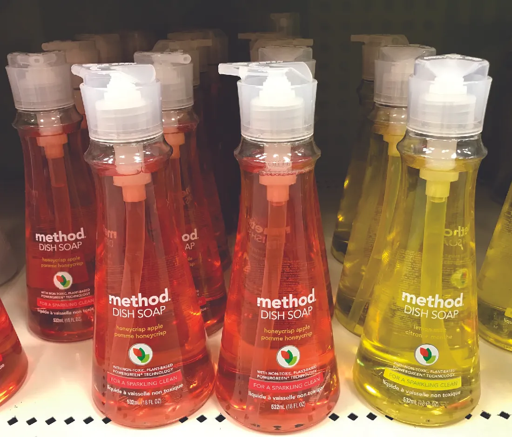
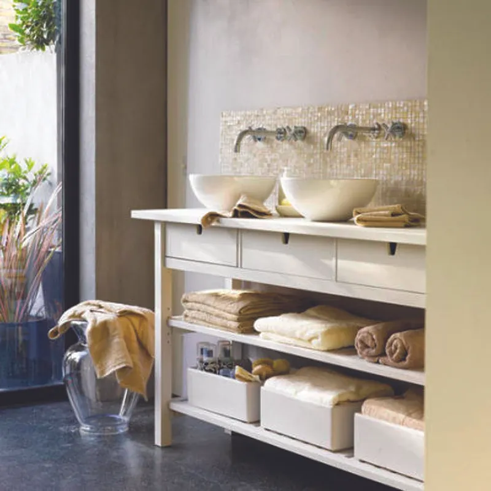

## 8.4   Xây dựng thương hiệu khởi nghiệp

> **🎯 Mục tiêu học tập**
>
> Đến cuối phần này, bạn sẽ có thể:
>
> - Hiểu tầm quan trọng của xây dựng thương hiệu lấy khách hàng làm trung tâm
> - Giải thích các bước trong việc xác định và phát triển thương hiệu
> - Mô tả lợi ích của việc ủng hộ thương hiệu

Trong bối cảnh kinh doanh, từ **thương hiệu** có nhiều nghĩa. Trước hết, *brand name* là tên của một sản phẩm hoặc dịch vụ do doanh nghiệp cung cấp. Ví dụ, Coca-Cola và Goodyear là các tên thương hiệu. Nhưng thương hiệu cũng có nghĩa là hình ảnh mà doanh nghiệp quảng bá và những liên tưởng mà nó nuôi dưỡng về chính mình và sản phẩm của mình. Chẳng hạn, thương hiệu **Coca-Cola** có thể được nhìn nhận là sảng khoái, trẻ trung và đậm chất Mỹ. Thương hiệu lốp Goodyear có thể được xem là thiên về hiệu năng, giá phải chăng và đáng tin cậy. Logo, thông điệp quảng cáo, nhận thức của công chúng, sự chứng thực của người nổi tiếng, chiến lược xúc tiến và nhiều yếu tố khác đều góp phần quảng bá thương hiệu riêng của doanh nghiệp.

Xây dựng thương hiệu thường ít xoay quanh lợi ích hay giá trị thực tế của sản phẩm, mà thiên nhiều hơn về cách nó định vị mình trong thị trường mục tiêu và kết nối với những khách hàng trung thành. Việc xây dựng thương hiệu ngay từ khi doanh nghiệp ra đời khó hơn so với quản lý một thương hiệu đã hiện diện nhiều năm. Trong trường hợp startup, các sáng kiến được triển khai phải lấy khách hàng làm trung tâm và phải chạm trực tiếp đến trái tim người tiêu dùng. Chúng cần có sức hấp dẫn đáng tin cậy và giàu cảm xúc để tạo nên mối gắn kết với khách hàng. Hãy cùng đi sâu hơn vào vấn đề này.

### Xây dựng thương hiệu lấy khách hàng làm trung tâm

Hình ảnh mà doanh nghiệp truyền tải đến khách hàng được quản lý thông qua cái gọi là **chiến lược thương hiệu**, có thể bao gồm quảng cáo, quan hệ công chúng, dịch vụ khách hàng và xúc tiến bán.

Một chiến lược xây dựng thương hiệu phổ biến là sử dụng **tagline**, tức những tuyên bố định vị ngắn gọn, bắt tai, nhanh chóng truyền đạt một khía cạnh cốt lõi nào đó của thương hiệu đến người tiêu dùng. Tagline có thể là công cụ rất mạnh, và trong một số trường hợp còn trở nên nổi tiếng gần như chính tên thương hiệu. Hãy xem danh sách tagline của các startup gần đây trong [Bảng 8.6](8-4-entrepreneurial-branding#fs-idm190523936). Chúng có làm tốt vai trò truyền đạt các thuộc tính hoặc lợi ích chính của tên thương hiệu mà chúng gắn liền hay không?

**Bảng 8.6: Tagline của các công ty mới**

| Các công ty mới | Khẩu hiệu |
| --- | --- |
| Hello Fresh | Những bữa ăn đơn giản mà ngon miệng |
| Airbnb | Thuộc về ở bất cứ đâu |
| Uber | Đến nơi |
| BirchBox | Mở ra vẻ đẹp |
| Snapchat | Cuộc sống vui hơn khi bạn sống trọn trong khoảnh khắc |
| LuminAID | Nhà tạo ra những điều tuyệt vời |
| Uptown Cheapskate | Mua. Bán. Trao đổi. |

Hãy xem các tagline trong [Bảng 8.7](8-4-entrepreneurial-branding#fs-idm200464768). Chúng đã tồn tại từ rất lâu, và hầu hết khách hàng đều quen thuộc với chúng. Theo bạn, vì sao những tagline này có thể tồn tại bền bỉ theo thời gian?

**Bảng 8.7: Tagline của các công ty đã định hình**

| Các công ty đã trưởng thành | Những tagline đã đứng vững theo thời gian |
| --- | --- |
| Nike | Cứ làm đi |
| Apple | Hãy nghĩ khác biệt |
| Subway | Ăn tươi mới |
| Walmart | Tiết kiệm hơn, sống tốt hơn |
| State Farm | Như một người hàng xóm tốt, State Farm luôn ở đó |
| Master Card | Có những thứ tiền không mua được. Với mọi thứ khác, đã có Mastercard. |
| Maybelline | Có thể đó là bẩm sinh, cũng có thể đó là Maybelline. |
| Red Bull | Red Bull tiếp thêm đôi cánh |
| General Electric | Trí tưởng tượng trong hành động |

Cũng hãy lưu ý cách các đoạn nhạc quảng cáo có thể tạo ảnh hưởng mạnh đến khả năng ghi nhớ thông điệp của con người. **Đoạn nhạc quảng cáo** là một đoạn nhạc hoặc âm thanh rất ngắn gắn thương hiệu cho một sản phẩm hoặc doanh nghiệp và giúp quảng bá nó. Những giai điệu này rất dễ nhớ, nổi bật và vui tươi. Đoạn nhạc quảng cáo tương tự tagline ở chỗ chúng có một âm thanh bắt tai và dễ hiểu đối với người tiếp nhận. Bạn nhớ ngay được đoạn nhạc quảng cáo nào không?

> **🔗 Liên kết học tập**
>
> Tagline không chỉ mang tính thị giác. Chúng cũng có thể tận dụng âm thanh. Hãy nghĩ đến đoạn riff “Intel Inside” hoặc ba nốt nhạc trong tiếng chuông nhận diện của **NBC**. Âm thanh đóng vai trò lớn trong nhận diện thương hiệu. Và jingle là những lựa chọn gần như chắc thắng vì vừa giải trí vừa tạo kết nối với thương hiệu. Hãy xem [website này](https://openstax.org/l/52Jingles) để có một bài học lịch sử về những jingle quảng cáo radio và TV nổi tiếng nhất mọi thời đại.

Các thành phần khác của một thương hiệu bao gồm website, mạng xã hội, dịch vụ khách hàng và bao bì. Đây là những thành phần quan trọng của chiến lược thương hiệu sử dụng công nghệ để truyền tải thông điệp. Website cho phép doanh nghiệp tạo ra hình ảnh về các trang thông tin kinh doanh được liên kết với nhau. Những trang này truyền tải thông tin thương hiệu của doanh nghiệp đến người tiêu dùng thông qua logo, màu sắc, câu chữ, tính dễ sử dụng, thông tin sản phẩm và khả năng thương mại điện tử. Website của LuminAID vừa truyền tải hình ảnh vừa có những lời kêu gọi hành động quan trọng và là ví dụ về xây dựng thương hiệu thành công. Website này sử dụng màu sắc, hình ảnh và kiểu chữ tạo nên một hình ảnh cụ thể về chiếu sáng hiện đại, thôi thúc khách hàng mua sản phẩm và các bên liên quan khác cùng mang ánh sáng đến cho những người đang cần nó.

Bên cạnh khả năng website của doanh nghiệp truyền tải câu chuyện của công ty, các nền tảng **social media** còn củng cố mối liên hệ với người tiêu dùng. Các nền tảng mạng xã hội như **Facebook**, **Twitter**, **Instagram** và **YouTube** cho phép doanh nghiệp mời khách hàng tham gia cuộc trò chuyện bằng cách đăng ảnh họ đang sử dụng sản phẩm, đưa ra đề xuất, tham gia cuộc thi và chương trình tặng quà, cũng như nhận coupon và các đặc quyền khác. Doanh nhân có những công cụ này trong tay để tiếp tục xây dựng hình ảnh doanh nghiệp, kể cả khi nó có thể khởi đầu như một cửa hàng vật lý. Ngày nay, các công cụ như **Wix**, một trình tạo website trực tuyến dễ dùng, có thể được sử dụng để phát triển nhận diện thương hiệu này. Những doanh nhân có ngân sách lớn hơn có thể thuê nhà thiết kế website để xây dựng và hỗ trợ quảng bá trang web.

**Dịch vụ khách hàng** là một công cụ khác có thể tạo nên hình ảnh doanh nghiệp mạnh mẽ. Việc đào tạo nhân viên bán hàng và thu ngân trở nên lịch sự, tháo vát và am hiểu sẽ tạo ra trong tâm trí khách hàng một hình ảnh về sản phẩm và doanh nghiệp. Việc mặc đồng phục cũng có thể tạo nên hình ảnh tích cực. Dịch vụ khách hàng đặc biệt hữu ích khi xử lý dịch vụ vì nó đem lại một phần tính hữu hình cho sản phẩm mà khách hàng không thể nhìn thấy. Ví dụ, một nhà tạo mẫu tóc không thể cho khách hàng thấy một cách hữu hình kiểu tóc sau khi cắt sẽ trông như thế nào, nhưng phong thái, trang phục và mái tóc của chính nhà tạo mẫu có thể cho khách hàng những gợi ý về cách phục vụ và kết quả họ có thể mong đợi. Bao bì là một thành phần quan trọng của xây dựng thương hiệu. Thiết kế bao bì, màu sắc, thông tin được truyền tải trên bao bì và tính thực dụng của bao bì đều tạo nên hình ảnh về những gì người ta kỳ vọng ở sản phẩm.

**Method**, một thương hiệu sản phẩm tẩy rửa chú trọng môi trường và lấy khách hàng làm trung tâm, là ví dụ về một doanh nghiệp đã tạo khác biệt so với đối thủ bằng cách áp dụng các chiến lược xây dựng thương hiệu hiệu quả. Bằng việc sử dụng bao bì tái chế, thân thiện với môi trường và quảng bá cam kết dùng các hóa chất có nguồn gốc thực vật, không độc hại, công ty đã thu hút sự chú ý và cuối cùng đưa được sản phẩm của mình vào các cửa hàng Target trên toàn quốc.

Trước hết, Method thuyết phục Target dùng sản phẩm của họ để vệ sinh chính các cửa hàng của Target; sau một lần thử nghiệm thành công, họ thuyết phục công ty này phân phối dòng sản phẩm của mình, bao gồm xà phòng, chất tẩy rửa và chất làm sạch ([Hình 8.10](8-4-entrepreneurial-branding#OSX_Eship_08_04_Method)). Thông điệp thương hiệu có phần khác lạ đã giúp họ giành được hợp đồng, vì Target là một nhà bán lẻ tiến bộ và đổi mới. Thông điệp thương hiệu mà Method truyền tải là mọi thứ bên trong chai đều có nguồn gốc thực vật và không sử dụng hóa chất mạnh trong quá trình tạo sản phẩm. Các sản phẩm của họ hiệu quả ngang bằng hoặc hơn các thương hiệu dẫn đầu. Trong trường hợp này, thông điệp thương hiệu đã truyền tải sứ mệnh của công ty trong toàn bộ sản phẩm bằng cách tích hợp tất cả các khía cạnh lại với nhau theo cách đơn giản, thông qua việc dùng chai trong suốt, phông chữ lạ mắt và chất lỏng có màu nhưng không độc hại.

*Hình 8.10: Bao bì khác lạ, thiết kế độc đáo và các thành phần có nguồn gốc thực vật của Method đều là một phần trong chiến lược thương hiệu thành công của hãng. (ghi công: tác phẩm của Carol Bleistine/Flickr, CC BY 4.0)*

Lợi ích của việc phát triển một thương hiệu tốt là rất nhiều. Thương hiệu là hình ảnh của một sản phẩm hoặc dịch vụ, truyền cho khách hàng cảm nhận rằng khi họ mua từ một thương hiệu cụ thể, họ sẽ nhận được giá trị (chất lượng, giá cả và trải nghiệm) mà họ mong đợi. Lần tiếp theo nhìn thấy thương hiệu đó, họ sẽ lại chọn nó vì kỳ vọng trước đây đã được đáp ứng, từ đó đơn giản hóa quá trình ra quyết định mua hàng của họ. Các sản phẩm mới cũng phải vượt qua những thị trường chật chội và trở nên dễ thấy với những người tiêu dùng vốn đã gắn bó với các thương hiệu khác.

Niềm tin vào thương hiệu có thể giúp người tiêu dùng tiết kiệm thời gian và có thể tạo ra kết nối cảm xúc với doanh nghiệp. Tuy nhiên, không phải mọi lợi ích đều hiệu quả với mọi thương hiệu và mọi quyết định mua hàng. Khi khách hàng mua những sản phẩm và dịch vụ có mức cam kết thấp, như sản phẩm tẩy rửa, quá trình ra quyết định có thể diễn ra nhanh chóng và theo lối kinh nghiệm. Khi mua những mặt hàng đắt tiền hơn như đồ điện tử, phương tiện đi lại hoặc kỳ nghỉ, thương hiệu chỉ là một trong nhiều thuộc tính mà người tiêu dùng sẽ cân nhắc.

### Xác định và phát triển thương hiệu

Một thương hiệu nên có mục đích rõ ràng xuất phát từ sứ mệnh của công ty. Nếu mục đích là cung cấp các chất tẩy rửa có nguồn gốc thực vật không gây hại cho con người, thú cưng hoặc môi trường, như trường hợp của Method, thì thương hiệu phải truyền đạt điều đó trong mọi tương tác với người tiêu dùng. Đề xuất bán hàng độc nhất, như đã mô tả trong [Nhận diện cơ hội khởi nghiệp](5-introduction), cùng với lợi ích, đặc tính và hình ảnh tổng thể cần được truyền tải xuyên suốt marketing mix để kể một câu chuyện. Ngoài ra, thương hiệu nên có logo được thiết kế tốt, tên công ty hoặc sản phẩm, hàng hóa, vật phẩm khuyến mãi, vị trí kinh doanh (cũng góp phần tạo hình ảnh hoặc kể câu chuyện) và bất kỳ công cụ nào khác giao tiếp với người mua.

Hãy nhớ rằng có sự khác biệt trong xây dựng thương hiệu tùy theo quy mô và loại hình doanh nghiệp. Khi bắt đầu kinh doanh, nhiều khả năng bạn sẽ xây dựng thương hiệu cho toàn bộ doanh nghiệp của mình bằng một logo, một tên gọi và bộ vật phẩm khuyến mãi, danh thiếp cũng như bao bì sản phẩm đồng nhất. Khi số lượng sản phẩm tăng lên, bạn có thể sẽ phát triển bao bì khác nhau và hình ảnh khác nhau cho các nhóm sản phẩm khác.

[Hình 8.11](8-4-entrepreneurial-branding#OSX_Eship_08_04_BrandCheck) cung cấp một danh sách kiểm tra các yếu tố giúp phát triển thương hiệu cho dự án khởi nghiệp của bạn.

*Hình 8.11: Khi bắt đầu một dự án kinh doanh, làm theo một vài bước then chốt sẽ giúp xây dựng một thương hiệu mạnh. (ghi công: Bản quyền Đại học Rice, OpenStax, theo giấy phép CC BY NC-SA 4.0)*

### Quảng bá thông qua người ủng hộ thương hiệu

Một cách để quảng bá thương hiệu là xác định những khách hàng trung thành sẵn sàng chia sẻ phản hồi tích cực về thương hiệu đó. **Người ủng hộ thương hiệu** là người yêu thích sản phẩm của bạn và truyền miệng về nó cho người khác. Hoạt động ủng hộ thương hiệu là một phương tiện xây dựng thương hiệu có tiềm năng ít tốn kém và là điều doanh nhân nên khám phá. Một cách đơn giản để thúc đẩy hoạt động này là nhờ những khách hàng tốt nhất và người hâm mộ của bạn giới thiệu thêm khách hàng mới, để lại đánh giá trực tuyến và/hoặc viết blog hoặc bình luận về công ty cùng sản phẩm của bạn trên mạng. Doanh nghiệp thường đưa ra giảm giá và mã khuyến mãi để khuyến khích người ủng hộ thương hiệu lan truyền thông tin.

Chìa khóa của hoạt động ủng hộ thương hiệu hiệu quả là hiểu mục tiêu của chiến dịch, tìm kiếm các đại sứ (có rất nhiều sự kiện trực tuyến và trực tiếp), giao cho họ một nhiệm vụ cụ thể và thưởng cho họ khi hoàn thành nhiệm vụ đó.

Một ví dụ về xây dựng thương hiệu thông qua sự ủng hộ là tạo ra một cuộc thi để gắn kết những người tiêu dùng yêu thích sản phẩm của bạn, từ đó họ có thể chia sẻ hình ảnh trên mạng xã hội. **IKEA** đã làm điều này vào năm 2016 khi phát động cuộc thi thắng một tủ quần áo được cá nhân hóa bằng hashtag #JoyOfStorage nhằm khuyến khích những người hâm mộ trung thành nhất chia sẻ sản phẩm IKEA của họ trực tuyến. Cuộc thi yêu cầu khách hàng đăng ảnh sản phẩm IKEA của mình lên Facebook ([Hình 8.12](8-4-entrepreneurial-branding#OSX_Eship_08_04_Ikea)). Chiến dịch này cho phép IKEA gắn kết và tưởng thưởng cho khách hàng trung thành theo cách vui vẻ, đồng thời tận dụng tiếp thị truyền miệng để mở rộng phạm vi tiếp cận tiếp thị.

*Hình 8.12: Cuộc thi IKEA #JoyofStorage đã gắn kết những người hâm mộ trung thành và tưởng thưởng cho họ vì trở thành người ủng hộ thương hiệu. (ghi công: tác phẩm của this_could_be_my_house/Flickr, CC BY 2.0)*

> **📝 Thực hành: Forever 21**
>
> Sau khi sống ở Los Angeles vài năm, hai người gốc Hàn Quốc là Jin **Sook** và Do Wong **Chang** quyết định mở một cửa hàng quần áo. Họ đặt tên cửa hàng là **Fashion 21**. Cửa hàng trở nên thành công, mang về hơn 700.000 đô la doanh thu vào năm 1984. Sau đó, họ quyết định mở thêm cửa hàng mới hai lần mỗi năm, đồng thời đổi tên cửa hàng từ Fashion 21 thành **Forever 21**, qua đó mở rộng thương hiệu ra toàn cầu. Mặc dù chuỗi cửa hàng này trong lịch sử từng tạo ra hơn 3 tỷ đô la doanh số hằng năm, nhà bán lẻ gần đây đã nộp đơn phá sản với lý do gặp khó khăn trong việc thanh toán cho nhà cung cấp và chủ cho thuê mặt bằng. Hồ sơ này đi kèm với việc đóng cửa 178 cửa hàng hoạt động kém hiệu quả tại Hoa Kỳ và cho phép Forever 21 “đơn giản hóa mọi thứ để chúng tôi có thể quay lại làm điều mình làm tốt nhất.”[^15]
>
>
>
> Bỏ qua câu chuyện phá sản, Sook và Chang vẫn giữ vị trí điều hành công ty và các con của họ cũng tham gia quản lý, một người phụ trách tiếp thị và người kia phụ trách xây dựng thương hiệu. Hoạt động xây dựng thương hiệu giúp công ty duy trì sự phù hợp với phân khúc giới trẻ bằng cách định vị mình là thời thượng, đổi mới và đặc biệt thích ứng với thị hiếu thời trang luôn thay đổi. Công ty sử dụng logo, cửa hàng bán lẻ và website để thể hiện hình ảnh hợp xu hướng đó.
>
>
>
> Forever 21 đã nhiều lần bị kiện vì vi phạm bản quyền, bởi cốt lõi của công ty là cung cấp những phong cách thời trang lấy cảm hứng từ thiết kế trên sàn diễn nhưng được bán ở mức giá thấp hơn. Forever 21 có lịch sử dài giải quyết các vụ kiện bản quyền, bao gồm cả một vụ liên quan đến **H&M**. Công ty cũng đã vướng vào các cuộc chiến pháp lý với **Adidas**, **Puma** và **Gucci**.
>
>
> - Nếu bạn là quản lý thương hiệu, bạn sẽ ngăn những vụ kiện này xảy ra như thế nào?
> - Bạn sẽ phát triển một hình ảnh tốt hơn cho công ty như thế nào?
