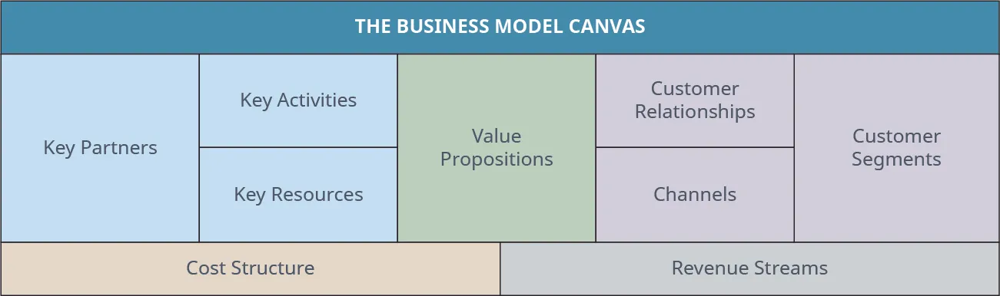

## 8.5   Chiến lược marketing và kế hoạch marketing

> **🎯 Mục tiêu học tập**
>
> Đến cuối phần này, bạn sẽ có thể:
>
> - Phân biệt chiến lược marketing, kế hoạch marketing và bài thuyết trình chào gọi vốn
> - Mô tả các thành phần của một kế hoạch marketing

Bây giờ khi đã hiểu rõ hơn tiếp thị là gì, bạn đã sẵn sàng bắt đầu phát triển chiến lược marketing và kế hoạch marketing. **Chiến lược marketing** mô tả cách doanh nghiệp sẽ tiếp cận người tiêu dùng và chuyển họ thành khách hàng trả tiền. Có một chiến lược marketing vững chắc nhưng linh hoạt là một thực hành kinh doanh tốt, bất kể bạn đang hoạt động trong loại hình kinh doanh nào.

**Kế hoạch marketing** là một tài liệu kinh doanh chính thức được dùng như bản thiết kế hoặc kim chỉ nam về cách doanh nghiệp sẽ đạt được các mục tiêu tiếp thị. Kế hoạch marketing khác với kế hoạch kinh doanh ở chỗ nó tập trung nhiều hơn vào nghiên cứu thị trường, thu hút khách hàng và các chiến lược marketing, trong khi kế hoạch kinh doanh bao quát nhiều nội dung hơn, như bạn sẽ thấy trong [Business Model and Plan](11-introduction).

Kế hoạch marketing là công cụ quan trọng vì chúng đóng vai trò như bản đồ đường đi cho tất cả những người tham gia vào một dự án kinh doanh. Việc viết kế hoạch marketing buộc bạn phải xác định mục tiêu và phát triển chiến lược để đạt được mục tiêu đó, đồng thời khuyến khích bạn nghiên cứu thị trường và đối thủ cạnh tranh. Một kế hoạch marketing tốt sẽ khuyến khích doanh nhân suy nghĩ sâu sắc về doanh nghiệp và tiềm năng lợi nhuận của mình, từ đó đưa ra các quyết định kinh doanh và tiếp thị tốt hơn. Ngoài ra, kế hoạch marketing có thể tạo ra mức độ tham gia và tính gắn kết lớn hơn giữa các nhân viên bằng cách làm rõ mục tiêu và kỳ vọng.

Có nhiều mẫu kế hoạch marketing khác nhau có thể được điều chỉnh để phù hợp với sản phẩm và/hoặc dịch vụ của doanh nghiệp bạn. Một điều cần cân nhắc là vì sao bạn viết kế hoạch này và độc giả của nó là ai. Ngoài việc lên kế hoạch cho dự án khởi nghiệp, nó sẽ được dùng cho nhân viên hay nhà đầu tư tiềm năng? Mỗi đối tượng khác nhau sẽ cần những loại thông tin khác nhau. Nếu đối tượng là nhân viên, bạn phải đưa thêm chi tiết về vận hành doanh nghiệp. Nếu kế hoạch nhằm thu hút nhà đầu tư, hãy chắc chắn làm nổi bật giá trị mà họ sẽ nhận được từ khoản đầu tư đó.

Hãy nhớ rằng các phần khác nhau của kế hoạch không nhất thiết phải được viết theo một trật tự cố định. Kế hoạch cũng nên được xem là những hướng dẫn linh hoạt chứ không phải các quy tắc tuyệt đối. Mọi kế hoạch marketing tốt đều là những tài liệu “sống”, giúp bạn đo lường thành công đồng thời cho phép điều chỉnh hướng đi khi cần. [Bảng 8.8](8-5-tiếp thị-strategy-and-the-tiếp thị-plan#fs-idm355146624) cung cấp các thành phần tiêu chuẩn của một kế hoạch marketing.

**Bảng 8.8: Mẫu kế hoạch tiếp thị**

| Phần của kế hoạch marketing | Mô tả và mục đích |
| --- | --- |
| Tóm tắt điều hành | Cung cấp cái nhìn khái quát về toàn bộ kế hoạch, bao gồm tiềm năng lợi nhuận và các ý tưởng chiến lược chính |
| Phân tích tình huống | Tổng quan môi trường bên trong và bên ngoài liên quan đến doanh nghiệp và sản phẩm; môi trường bên trong bao gồm bối cảnh công ty và sứ mệnh; môi trường bên ngoài có thể bao gồm nhu cầu thị trường, cạnh tranh, nghiên cứu thị trường và phân tích điểm mạnh, điểm yếu, cơ hội và mối đe dọa (SWOT) |
| Cơ hội tiếp thị (Nhu cầu chưa được đáp ứng, Giải pháp đề xuất, Đề xuất giá trị) | Xác thực cơ hội thị trường mà doanh nghiệp đang khai thác và trình bày lợi ích tiềm năng cho các bên liên quan |
| Mô hình kinh doanh | Trình bày khuôn khổ tạo doanh số và lợi thế cạnh tranh của doanh nghiệp |
| Mục tiêu tiếp thị | Xác định mục tiêu về doanh số (theo đơn vị hoặc đô la), tăng trưởng thị phần, nhận biết thương hiệu, các kênh phân phối đã bảo đảm, hàng tồn kho và định giá |
| Chiến lược marketing | Giải thích thị trường mục tiêu, định vị dự kiến và các chiến lược trong mối liên hệ với marketing mix (7P) |
| Chương trình hành động | Xác định ai sẽ làm việc gì và khi nào |
| Tài chính | Trình bày ước tính doanh số, ngân sách dự kiến và dữ liệu tài chính giúp người đọc hiểu tình hình kinh tế hiện tại và tương lai của công ty |
| Thủ tục kiểm soát | Mô tả các quy trình đo lường kết quả, theo dõi mục tiêu và điều chỉnh kế hoạch khi cần thiết |

### Tóm tắt điều hành

**Tóm tắt điều hành** đúng như tên gọi của nó: một bản tóm tắt rõ ràng và súc tích về những điểm chính của kế hoạch marketing. Dù được đặt ở đầu, phần này thường được viết sau cùng vì nó dựa trên thông tin được trình bày ở các phần tiếp theo.

Phần tóm tắt điều hành thường dài một hoặc hai trang và bao gồm những chỉ báo thành công chính cho doanh nghiệp và các bên liên quan, có thể gồm chủ doanh nghiệp, nhà quản lý, tư vấn viên, nhà đầu tư và ngân hàng. Mục tiêu của bạn không chỉ đơn giản là tóm tắt toàn bộ kế hoạch mà còn phải làm nổi bật vì sao mọi người nên quan tâm đến dự án của bạn. Dù người đọc là nhân viên, đối tác tiềm năng hay nhà đầu tư, phần tóm tắt điều hành không chỉ cần cung cấp thông tin mà còn phải khơi gợi hứng thú.

Tập trung vào cơ hội đang có, vào điều khiến mô hình kinh doanh của bạn đặc biệt và vào phần thưởng tài chính tiềm năng là cách tốt để thu hút sự chú ý của người đọc. Ví dụ, nếu điểm mạnh của doanh nghiệp bao gồm một đội ngũ tiếp thị xuất sắc và một lợi thế cạnh tranh đáng kể, bạn nên nêu bật chúng như những lý do dẫn đến thành công. Một số người đọc có thể chỉ đọc phần này, vì vậy hãy chắc chắn nhấn mạnh điều gì khiến công ty của bạn trở nên đặc biệt và cách bạn dự định biến điều đó thành lợi nhuận.

### Phân tích tình huống

Xét trên nhiều khía cạnh, nền tảng của kế hoạch marketing nằm ở **phân tích tình huống**, tức việc xem xét các hoàn cảnh bên trong và bên ngoài liên quan đến doanh nghiệp và sản phẩm của bạn. Một bản phân tích tốt sẽ cung cấp cơ sở logic cho các chiến lược bạn lựa chọn. Ví dụ, nghiên cứu bạn thực hiện ở đây giải thích vì sao bạn sẽ phát triển một sản phẩm nhất định, bạn sẽ định giá nó như thế nào và bạn sẽ làm gì để tiếp cận thị trường mục tiêu.

Các phân tích tình huống tốt thường bao gồm **phân tích SWOT**, xem xét điểm mạnh, điểm yếu, cơ hội và mối đe dọa của doanh nghiệp. Chúng cũng xem xét các đối thủ trong tương lai và hiện tại, đồng thời bao gồm nghiên cứu xác thực thị trường đã khảo sát khách hàng tiềm năng. Thông tin này rất quan trọng vì nó chứng minh rằng bạn đã thực hiện đầy đủ việc thẩm định sản phẩm và thị trường của mình.

### Cơ hội tiếp thị

Giả sử nghiên cứu nền của bạn đã dẫn đến kết luận rằng có một cơ hội kinh doanh, thì đây là nơi bạn giải thích cơ hội đó là gì và nằm ở đâu. Ví dụ, nếu nghiên cứu cho thấy có một khoảng trống trên thị trường đồ chơi giáo dục cho trẻ em, thì đây là nơi bạn trình bày mức độ sâu rộng của cơ hội đó. Ở đây, bạn dùng nghiên cứu như bằng chứng để chứng minh với người đọc rằng khoảng trống thị trường tồn tại và bạn biết cách lấp đầy nó. Nếu mục tiêu là làm nhà đầu tư quan tâm, đây là nơi bạn cho họ biết họ có thể thu được gì và khi nào sẽ thu được điều đó.

> **🔗 Liên kết học tập**
>
> [US Small Business Administration](https://openstax.org/l/52SBAMarketing) nỗ lực hỗ trợ chủ doanh nghiệp khởi sự và thành công trong phát triển doanh nghiệp. Website của họ chứa nhiều thông tin hữu ích, lớp học và mẫu biểu có thể giúp doanh nhân điều hướng những phức tạp của tiếp thị, đồng thời cung cấp các gợi ý hữu ích về phát triển kế hoạch marketing.

### Mô hình kinh doanh

Trong phần này, nhiệm vụ của bạn là ghép nối cơ hội bạn nhìn thấy với giải pháp mà bạn đã tạo ra. Ở đây, bạn trình bày cách lợi thế cạnh tranh và các điểm khác biệt của mình (bản chất của giải pháp cùng các tính năng và lợi ích cốt lõi) sẽ mang lại giá trị cho khách hàng và tạo ra lợi nhuận giúp doanh nghiệp duy trì trong tương lai gần. Bạn sẽ làm gì để tạo ra giá trị thu hút khách hàng? Bạn sẽ tạo doanh số như thế nào? Thị trường mục tiêu của bạn là ai? Nếu bạn đang mở một phòng gym, đây là nơi bạn sẽ trình bày cách thu hút khách hàng, giá trị họ sẽ nhận được, những loại hợp đồng thành viên nào sẽ có sẵn cho họ, v.v.

Một công cụ tuyệt vời để ghi lại thông tin này là **Business Model Canvas** ([Hình 8.13](8-5-tiếp thị-strategy-and-the-tiếp thị-plan#OSX_Eship_08_05_BMC)), được thảo luận trong [Launch for Growth to Success](10-introduction) và [Business Model and Plan](11-introduction). Chín khối cấu phần của mô hình này sẽ giúp bạn xác định phân khúc khách hàng mục tiêu, đề xuất giá trị mà bạn sẽ trình bày cho từng phân khúc, các kênh phân phối của đề xuất giá trị hoặc các điểm chạm, kiểu quan hệ khách hàng mà bạn sẽ xây dựng với đối tượng mục tiêu, các loại cấu trúc chi phí và dòng doanh thu dựa trên phương thức định giá, cùng những nguồn lực, hoạt động và đối tác chủ chốt giúp bạn thành công.

Canvas cũng cho phép doanh nhân đổi mới và thay đổi nếu có điều gì đó không diễn ra như mong muốn. Mục đích của công cụ này là ghép các mảnh của một kế hoạch lại với nhau.[^16]

*Hình 8.13: Business Model Canvas tập hợp các chiến lược then chốt liên quan đến sản phẩm đang được tung ra. (ghi công: Bản quyền Đại học Rice, OpenStax, theo giấy phép CC BY NC-SA 4.0)*

### Mục tiêu tiếp thị

Tại đây, bạn trình bày các mục tiêu cụ thể và kết quả hữu hình của chúng. Chỉ nói rằng bạn sẽ rất thành công là chưa đủ nếu không định nghĩa rõ thành công nghĩa là gì. Mục đích của phần này là lượng hóa mục tiêu của bạn thành số đơn vị bán ra, doanh số/doanh thu, thị phần hoặc một thước đo thực tế khác. Mục tiêu cũng có thể bao gồm việc tạo ra mức độ nhận biết thương hiệu có thể đo lường được và phát triển một số lượng kênh phân phối nhất định.

Ví dụ, những mục tiêu tốt và có thể đo lường có thể là bán được 300 đơn vị mỗi tháng, bán được 600.000 đô la sản phẩm trong một năm hoặc đạt mức nhận biết thương hiệu bằng 10 phần trăm thị trường mục tiêu trong ba tháng. Hãy tránh những mục tiêu không thể đo lường hoặc mơ hồ vì chúng sẽ không giúp ích cho bạn ở hiện tại hay về sau.

Dù mục tiêu của bạn là gì, chúng phải đạt được một cách hợp lý và càng cụ thể càng tốt. Lý do là để về sau bạn có thể xác định mình có thành công hay không. Nếu không, bạn sẽ biết rằng cần phải thay đổi điều gì đó.

### Chiến lược marketing

Như đã đề cập trước đó, có một **marketing mix** tốt sẽ giúp doanh nghiệp của bạn thành công. Với vai trò doanh nhân, bạn muốn phân khúc thị trường và tìm ra liệu có những nhóm người tiềm năng nào mà bạn có thể phục vụ. Quá trình phân khúc, lựa chọn thị trường mục tiêu và định vị (STP) sẽ giúp bạn xác định đâu là khách hàng tốt nhất của mình và cho phép bạn phân bổ nguồn lực một cách hiệu quả để phục vụ thị trường đó.

Sau khi đi qua quá trình này, bạn có thể xem xét marketing mix, và tùy vào việc bạn cung cấp sản phẩm, dịch vụ hay kết hợp cả hai, điều vốn thường là trường hợp phổ biến, bạn sẽ phác thảo cách tiếp cận của mình đối với 7P của marketing mix.

### Kế hoạch hành động

Trong kế hoạch hành động, bạn trình bày chi tiết công việc sẽ được thực hiện như thế nào hằng ngày trong doanh nghiệp, khi nào chúng được thực hiện và ai sẽ là người thực hiện. Nhiều chủ doanh nghiệp mới phát triển chiến lược rất rộng, nhưng họ không có đủ nhân lực để triển khai. Hiển nhiên, việc bảo đảm có đủ nguồn nhân lực cần thiết để thực thi mục tiêu là rất quan trọng. Đây là phần bạn làm rõ rằng mình thật sự có điều đó. Ví dụ, nếu bạn đã có sẵn một đội ngũ tiếp thị, việc nhấn mạnh khả năng thực thi kế hoạch của họ sẽ giúp thuyết phục các nhà đầu tư tiềm năng rằng bạn có thể biến kế hoạch thành hành động.

### Tài chính

Ở đây, bạn đưa vào ngân sách, dự báo và bất kỳ thông tin nào khác có thể cung cấp cho người đọc và nhà đầu tư tiềm năng một bức tranh rõ ràng về tình hình tài chính của doanh nghiệp. Sự minh bạch và trung thực sẽ tạo ra niềm tin và thiện chí giữa công ty của bạn với các nhà đầu tư tiềm năng.

Phần này cũng quan trọng vì nó giúp bạn xác định doanh nghiệp có thể sinh lời đến đâu. Một điểm khởi đầu là xác định chi phí và lợi nhuận tương lai. Vì phần lớn doanh nhân có xu hướng ước lượng quá cao những con số này, tốt nhất là xây dựng dự báo tài chính cho kịch bản tốt nhất, xấu nhất và cả một kịch bản trung bình.

Nhiều doanh nhân xây dựng dự báo một năm, ba năm hoặc năm năm để có cảm nhận về lợi nhuận tương lai và chứng minh rằng mô hình kinh doanh của họ bền vững trong dài hạn. [Hình 8.14](8-5-tiếp thị-strategy-and-the-tiếp thị-plan#OSX_Eship_08_06_FinProj) cung cấp một ví dụ.

![Five-year financial projections for Sammy’s Grocery Store. Sales/Revenue is projected to be $100,000 in 2018, $150,000 in 2019, $170,000 in 2020, $190,000 in 2021, and $198,000 in 2022. Cost of Goods Sold is projected to be $30,000 in 2018, $50,000 in 2019, $55,000 in 2020, $57,000 in 2021, and $60,000 in 2022. Sales and Administrative Expenses are projected to be $40,000 in 2018, $55,000 in 2019, $60,000 in 2020, $60,000 in 2021, and $70,000 in 2022. Depreciation is projected to be $10,000 in 2018, $7,000 in 2019, $8,000 in 2020, $8,000 in 2021, and $10,000 in 2022. Operating Profit is projected to be $20,000 in 2018, $38,000 in 2019, $47,000 in 2020, $65,000 in 2021, and $58,000 in 2022.](../assets/img-8-5-2.webp)

*Hình 8.14: Các dự báo tăng trưởng xuất hiện trong phần tài chính của kế hoạch marketing. (ghi công: Bản quyền Đại học Rice, OpenStax, theo giấy phép CC BY NC-SA 4.0)*

### Chỉ số hiệu suất then chốt

Cuối cùng, bạn cần xác định **các chỉ số hiệu suất then chốt**, tức cách bạn sẽ đánh giá hiệu quả của các chiến lược bằng việc xem xét tiến độ đã đạt được trong một khung thời gian cụ thể. Chúng bao gồm những cột mốc định lượng cho biết bạn có đang đi đúng hướng hay không, giúp bạn phân tích quá trình ra quyết định và tập trung vào các chiến lược cụ thể, cũng như điều chỉnh nếu các chiến lược đó không hiệu quả.

Ví dụ, một trong những cột mốc của bạn có thể là mục tiêu doanh số 50.000 đô la trong sáu tháng đầu tiên. Nếu đến thời điểm đạt cột mốc đó mà bạn vẫn chưa đi đúng tiến độ, đây có thể là dấu hiệu cho thấy hoặc bạn đã ước tính doanh số quá cao, hoặc các chiến lược của bạn không hiệu quả. Trong cả hai trường hợp, bạn sẽ cần thực hiện các bước cụ thể để điều chỉnh dự báo hoặc tìm những chiến lược hiệu quả hơn.
