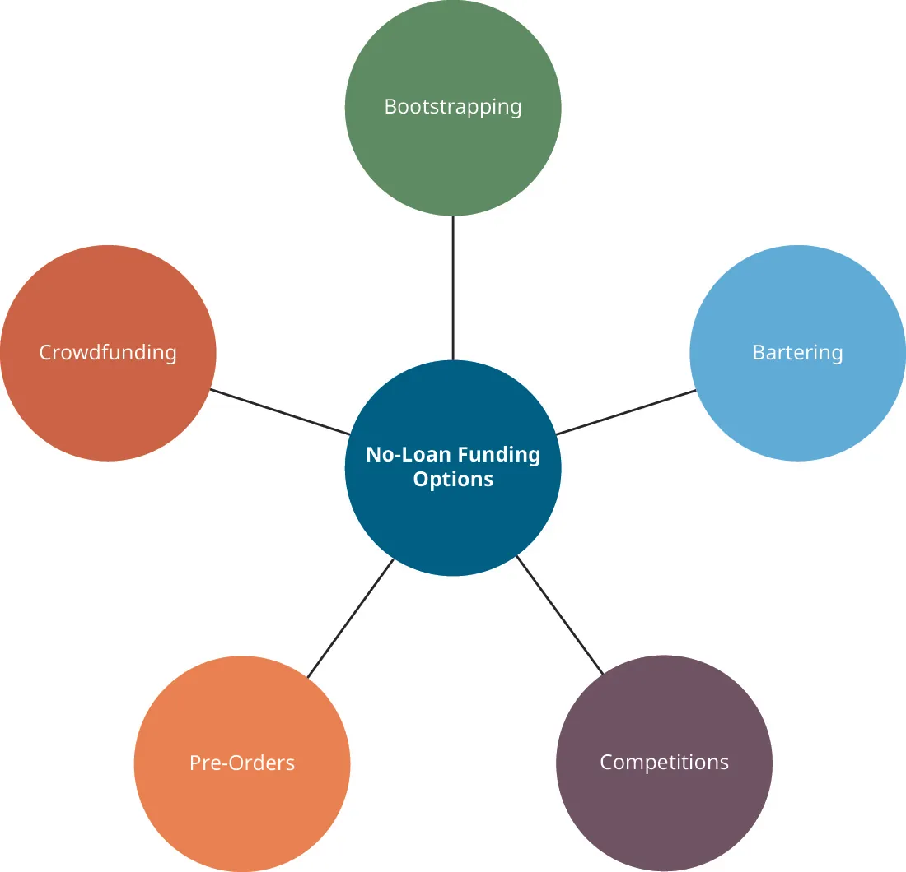

## 9.2   Các chiến lược huy động vốn đặc thù

> **🎯 Mục tiêu học tập**
>
> Sau khi hoàn thành phần này, bạn có thể:
>
> - Xác định các chiến lược huy động vốn được các tổ chức từ thiện sử dụng
> - Mô tả các cơ hội tài trợ dành cho startup
> - Định nghĩa bootstrapping
> - Mô tả ưu điểm và nhược điểm của bootstrapping

Điều quan trọng là phải nhận ra rằng không phải mọi startup đều là công ty công nghệ kiểu Silicon Valley. Những công ty này tạo ra các sản phẩm gây tiếng vang như ứng dụng và website, có thể mất nhiều năm mới có lãi hoặc thậm chí mới tạo ra doanh thu. Phổ biến hơn nhiều là các doanh nghiệp nhỏ được doanh nhân thành lập hằng ngày với mong muốn tạo ra giá trị trong cộng đồng địa phương của họ. Hơn nữa, không phải mọi startup đều được thành lập với động cơ lợi nhuận.

**Tổ chức từ thiện**, hay một số doanh nghiệp phi lợi nhuận nhất định, thường được thành lập vì những mục tiêu vị tha như thúc đẩy nghệ thuật, giáo dục và khoa học; bảo vệ môi trường tự nhiên; cung cấp cứu trợ thiên tai; và bảo vệ quyền con người ([Bảng 9.2](9-2-special-funding-strategies#fs-idm342536192)).

**Bảng 9.2: Sứ mệnh từ thiện và các tổ chức minh họa**

| Sứ mệnh | Ví dụ |
| --- | --- |
| Thúc đẩy giáo dục | Teach for America, Khan Academy |
| Bảo vệ môi trường tự nhiên | Sierra Club, Wildlife Conservation Society |
| Bảo vệ quyền con người | Amnesty International, Human Rights Watch |
| Cung cấp cứu trợ thiên tai | American Red Cross |
| Hỗ trợ nghệ thuật | Metropolitan Museum of Art, Americans for the Arts |

Những mục tiêu này vượt lên trên động cơ lợi nhuận mà một công ty truyền thống thường có. Vì vậy, các chiến lược huy động vốn của các tổ chức này thường rất khác so với doanh nghiệp thông thường vì lợi nhuận. Khi không đặt trọng tâm vào lợi nhuận, việc chi trả cho các chi phí vận hành thường xuyên có thể trở nên khó khăn. Do đó, các tổ chức này phải xây dựng một **chiến lược bền vững** - tức chiến lược có thể duy trì sự ổn định tài chính của tổ chức.

Tại Hoa Kỳ, các tổ chức như vậy có thể đủ điều kiện để được **tình trạng miễn thuế**, nghĩa là nếu có lợi nhuận từ hoạt động thì lợi nhuận đó thường không phải chịu thuế. Các tổ chức muốn được miễn trừ này phải nộp đơn lên **Internal Revenue Service** để xin tình trạng tình trạng miễn thuế và cung cấp thông tin về loại sứ mệnh mà tổ chức theo đuổi - từ thiện, khoa học, giáo dục, v.v.

Hãy nghĩ về một bảo tàng. Mục đích của nó là gì? Các công ty truyền thống cung cấp sản phẩm hoặc dịch vụ cho khách hàng để đổi lấy tiền thanh toán, và thường đáp ứng một nhu cầu nào đó của khách hàng. Một cửa hàng tạp hóa bán thực phẩm vì con người cần ăn để tồn tại. Mặc dù việc ngắm tranh và tượng không phải là nhu cầu vật chất thiết yếu cho sự sống, trải nghiệm đó rõ ràng làm phong phú thêm cuộc sống của chúng ta và giúp giáo dục cũng như định hình xã hội. Đó là lý do bảo tàng được thành lập. Hãy xem tuyên bố sứ mệnh ban đầu của **Metropolitan Museum of Art** (thường được gọi là “Met”) tại thành phố New York ([Hình 9.3](9-2-special-funding-strategies#OSX_Eship_09_02_MetMission)).[^7]

*Hình 9.3: Tuyên bố sứ mệnh của Metropolitan Museum of Art ở New York tóm lược mục đích của tổ chức này. (ghi công: Copyright Rice University, OpenStax, theo giấy phép CC BY NC-SA 4.0)*

Đây là mục tiêu khác với mục tiêu của phần lớn doanh nghiệp nhỏ - cung cấp sản phẩm hoặc dịch vụ để đổi lấy lợi nhuận - và vì thế đòi hỏi các chiến lược tài trợ khác nhau, chẳng hạn sự kết hợp giữa dịch vụ chương trình, quyên góp và tài trợ.

> **🔗 Liên kết học tập**
>
> Hãy truy cập website của Internal Revenue Service và xem [ấn bản Pub 334 Tax Guide for Small Business mới được cập nhật gần đây nhất](https://openstax.org/l/52IRSPub334) để tìm hiểu thêm về các quy định chuẩn bị hồ sơ thuế thu nhập cho doanh nghiệp nhỏ.

### Dịch vụ chương trình

**Dịch vụ chương trình** là những hoạt động cung cấp cơ bản mà một tổ chức phi lợi nhuận triển khai và có tạo ra doanh thu, dù thường không đủ để trang trải toàn bộ chi phí vận hành tổ chức. Những dịch vụ này giống nhất với cách một doanh nghiệp truyền thống tương tác với khách hàng. Tổ chức cung cấp sản phẩm hoặc dịch vụ để đổi lấy tiền của khách hàng.

Trong ví dụ về bảo tàng của chúng ta, dịch vụ chương trình có thể tồn tại dưới một vài hình thức khác nhau. Thứ nhất, bảo tàng có thể thu phí vào cửa để khách tham quan xem các tác phẩm nghệ thuật và hiện vật. Giá vé của mỗi cá nhân nhân với số lượng khách tham quan sẽ bằng doanh thu bán vé của bảo tàng. Một bảo tàng đã hoạt động ổn định sẽ có hiểu biết khá rõ về lượng khách trung bình và có thể dùng dữ liệu này để lập ngân sách.

Một nguồn doanh thu dịch vụ chương trình khác của bảo tàng có thể đến từ các hoạt động giáo dục trải nghiệm thực hành hoặc sự kiện có diễn giả, người trình bày. Bảo tàng thường mời các nghệ sĩ địa phương, hoặc nhân viên của chính bảo tàng có thể tổ chức lớp học nghệ thuật hay các chuyến tham quan chuyên đề. Những sự kiện và hoạt động này thường có thu phí (doanh thu) ngoài chi phí vào cửa thông thường.

Mặc dù có các hoạt động tạo doanh thu như vậy, các tổ chức phi lợi nhuận vẫn đối mặt với nhiều thách thức tài trợ khi phải chi trả toàn bộ chi phí vận hành như một doanh nghiệp bình thường, chẳng hạn tiền lương nhân viên, chi phí cơ sở vật chất và quảng cáo. Vì thế, họ cần nhiều nguồn thu nhập khác nhau. Chẳng hạn, thu nhập từ dịch vụ chương trình của Met trong năm 2018 chỉ chiếm 2,3 phần trăm tổng doanh thu của cả năm.[^8]

### Quyên góp

Một lợi thế của doanh nghiệp có sứ mệnh từ thiện là sự ủng hộ vốn có từ công chúng, điều có thể thúc đẩy sự tham gia của cộng đồng vượt lên trên mức ủng hộ thông thường. Với các tổ chức phi lợi nhuận, điều này có thể chuyển thành sự sẵn lòng quyên góp tiền cho tổ chức. Một **khoản quyên góp** là món quà tài chính không đi kèm kỳ vọng được hoàn trả hay nhận lại thứ gì. Một doanh nghiệp truyền thống phải cung cấp thứ gì đó có giá trị để tạo ra trao đổi với khách hàng: khách hàng của họ đòi hỏi giá trị để đổi lấy số tiền họ khó nhọc mới kiếm được.

Các **mạnh thường quân** của một tổ chức từ thiện muốn giúp thúc đẩy sứ mệnh của tổ chức đó. Loại tổ chức này - dù là bảo tàng, bệnh viện hay **Red Cross** - đều dựa vào thiện chí của những người ủng hộ trong cộng đồng. Với Met, khi tỷ trọng doanh thu đến từ dịch vụ chương trình thấp như vậy, rõ ràng các khoản quyên góp và đóng góp từ thiện có vai trò sống còn đối với **tính khả thi tài chính** của tổ chức.

### Tài trợ

Một nguồn vốn khác dành cho các tổ chức phi lợi nhuận là các khoản tài trợ. Một **khoản tài trợ** là món quà tài chính được cấp cho một mục đích cụ thể bởi cơ quan chính phủ hoặc một tổ chức từ thiện như **Bill and Melinda Gates Foundation**. Giống như quyên góp, tài trợ không cần hoàn trả. Khác với quyên góp, cả tổ chức phi lợi nhuận và vì lợi nhuận đều có thể cạnh tranh để nhận tài trợ. Trong khi quyên góp thường được trao mà không bị ràng buộc nhằm bù đắp chi phí vận hành chung của tổ chức, các khoản tài trợ thường quy định rõ tiền phải được sử dụng như thế nào. Phần lớn các đơn vị cấp tài trợ đều có chương trình nghị sự hoặc mục đích riêng phía sau nguồn tiền của mình. Chẳng hạn, **National Institutes of Health (NIH)** cấp tài trợ “để hỗ trợ thúc đẩy sứ mệnh của NIH là cải thiện sức khỏe, kéo dài cuộc sống khỏe mạnh và giảm gánh nặng bệnh tật cũng như khuyết tật.”[^9] Tổ chức liên bang này đầu tư hơn 32 tỷ USD mỗi năm cho nghiên cứu y khoa.

Các khoản tài trợ có thể có tính cạnh tranh rất cao, đòi hỏi quy trình nộp đơn nghiêm ngặt. Thông thường, nhiều tổ chức cùng nộp đơn cho một khoản tài trợ; tổ chức cấp tài trợ sẽ xem xét nhiều hồ sơ cạnh tranh để đưa ra lựa chọn. Bên nhận tài trợ nhìn chung phải nộp báo cáo tài chính đã được kiểm toán và còn phải cập nhật cho bên cấp tài trợ sau khi được trao để bảo đảm tiền được dùng đúng mục đích. NIH trao gần 50.000 khoản tài trợ mỗi năm và phần lớn trong số đó là cạnh tranh. Dù đây là con số dự án được tài trợ rất lớn, chỉ 20 phần trăm số đơn nộp lên NIH trong năm 2018 thực sự được chấp nhận.[^10] Nói cách khác, NIH từ chối bốn trong mỗi năm hồ sơ. Với doanh nhân, điều này có nghĩa là khi bạn xác định được một khoản tài trợ phù hợp với sứ mệnh tổ chức của mình, bạn nên cân nhắc khả năng được trao tài trợ khi đưa nó vào chiến lược nguồn vốn.

Để hiểu cách tài trợ vận hành trong thực tế, hãy xem xét sâu hơn NIH. Chương trình NIH Small Grant Program cung cấp vốn cho các hoạt động như phát triển công nghệ nghiên cứu mới. Khoản tài trợ cụ thể này có thể được trao cho tối đa hai năm, với nguồn tiền lên đến 50.000 USD chi phí trực tiếp mỗi năm. Một khoản tài trợ như vậy có thể mang lại sự hỗ trợ thiết yếu cho một startup phi lợi nhuận.

Một số dự án kinh doanh nằm ở khoảng giữa các tổ chức hoàn toàn cam kết với công việc từ thiện và các doanh nghiệp nhỏ truyền thống có doanh nhân tập trung vào khởi nghiệp xã hội. Các doanh nhân xã hội phát triển sản phẩm và dịch vụ như giải pháp cho các vấn đề xã hội. Ví dụ, công ty giày **TOMS** đã tạo ra mô hình kinh doanh theo đó cứ mỗi đôi giày khách hàng mua, công ty sẽ tặng một đôi cho trẻ em có nhu cầu ở các quốc gia khác. Thực hành này tiên phong cho điều mà họ gọi là “One for One.”[^11]

Website của công ty mô tả nguồn gốc của cả doanh nghiệp lẫn mô hình này, đều dựa trên trải nghiệm của nhà sáng lập Blake **Mycoskie** ([Hình 9.4](9-2-special-funding-strategies#OSX_Eship_09_02_Toms)).[^12]

*Hình 9.4: Câu chuyện khởi nguồn của TOMS là một ví dụ về khởi nghiệp xã hội. (ghi công: Copyright Rice University, OpenStax, theo giấy phép CC BY NC-SA 4.0)*

**Khởi nghiệp xã hội** mang lại khả năng tạo ra thay đổi tích cực trên thế giới mà không chỉ đơn thuần dựa vào các khoản quyên góp. Nó kết hợp một mô hình kinh doanh có lợi nhuận, bền vững với một mục tiêu tốt đẹp. Sự kết hợp này thường tạo ra truyền miệng tích cực. Nó mang lại cho khách hàng tiềm năng cảm giác tốt về sản phẩm ngoài yếu tố kiểu dáng hay chức năng đơn thuần.

> **🛠️ Bạn có thể làm gì?: Khởi nghiệp xã hội**
>
> Giống như nhà sáng lập TOMS, đôi khi trong đời sống hằng ngày chúng ta được trao cơ hội giúp đỡ người khác. Chúng ta thậm chí có thể nhận ra rằng mình không đơn độc trong mong muốn này. Bạn nhìn thấy những cơ hội giúp đỡ nào - cho cá nhân, xã hội hay môi trường - trong chính cộng đồng của mình? Bạn có thể nâng cao nhận thức về vấn đề đó bằng những cách nào?

### Các chiến lược tài chính không vay nợ

Như bạn đã học, nhiều startup ra đời thông qua việc sử dụng nợ ở mức đáng kể. Mặc dù đi vay là một nguồn tài trợ hợp pháp, nó có thể rủi ro, đặc biệt nếu doanh nhân phải tự chịu trách nhiệm hoàn trả. Trên thực tế, một số doanh nhân dùng cạn hạn mức thẻ tín dụng, vay thế chấp dựa trên phần vốn chủ sở hữu trong căn nhà chính của mình hoặc đi vay cá nhân lãi suất cao theo cách khác. Nếu doanh nhân không trả được nợ, hậu quả có thể là tài sản thiết bị bị thu hồi, nhà bị siết nợ và các hành động pháp lý khác.

Bây giờ chúng ta sẽ xem xét những chiến lược huy động vốn hấp dẫn đối với nhiều startup mà không đòi hỏi phải đi vay hoặc trao đổi quyền sở hữu doanh nghiệp để lấy hỗ trợ tài chính (tức tài trợ bằng nợ và vốn chủ sở hữu). Các phương thức tài trợ được mô tả ở đây mang tính sáng tạo hơn, bao gồm gọi vốn cộng đồng, trao đổi hàng hóa (barter) và những cách khác.

#### Gọi vốn cộng đồng

Hãy nhớ lại câu chuyện về **iBackPack**. Dự án này ban đầu được tài trợ bằng các khoản đóng góp thông qua **Indiegogo** và Kickstarter. Các website này là một hình thức **gọi vốn cộng đồng**, tức thu thập các khoản tiền nhỏ từ một số lượng lớn người tham gia. Những người đóng góp tiền thường được gọi là backers vì họ đang ủng hộ dự án hoặc hỗ trợ ý tưởng kinh doanh.

Khi duyệt các website gọi vốn cộng đồng này, bạn sẽ thấy nhiều loại dự án khác nhau đang tìm kiếm hỗ trợ tài chính - từ tạo trò chơi bàn mới cho đến mở quán donut. Mỗi dự án xác định một mục tiêu huy động vốn tổng thể cụ thể dưới dạng số tiền đô la. Một số website gọi vốn cộng đồng, chẳng hạn **Kickstarter**, áp dụng mô hình “được ăn cả, ngã về không”, trong đó dự án sẽ không nhận được khoản tiền nào trừ khi đạt mục tiêu huy động tổng thể. Số tiền có thể vượt mục tiêu, nhưng nếu không đạt thì dự án sẽ không nhận được gì. Đối với doanh nhân sử dụng nguồn lực này, việc chọn mục tiêu huy động khả thi phải là phần cốt lõi trong chiến lược của họ. Mục tiêu huy động cũng phải phù hợp với quy mô dự án. Ví dụ, đặt mục tiêu 50.000 USD có thể hợp lý để khởi động một xe bán đồ ăn lưu động, có thể là nguyên mẫu cho một nhà hàng hoàn chỉnh, nhưng chỉ là một phần rất nhỏ so với chi phí xây dựng cả một nhà hàng phục vụ tại bàn, vốn có thể gần 750.000 USD. Doanh nhân muốn bước vào lĩnh vực ẩm thực nên cân nhắc mục tiêu nào vừa khả thi nhất vừa hữu ích nhất cho cả mục tiêu ngắn hạn và dài hạn. Đồng thời, hãy nhớ rằng việc đạt mục tiêu huy động vốn không bảo đảm doanh nghiệp sẽ thành công, như trường hợp iBackPack.

Các doanh nhân cạnh tranh trong gọi vốn cộng đồng thường sử dụng một số chiến thuật phổ biến. Thứ nhất, họ thường đăng một video giới thiệu giải thích mục tiêu dự án và đề xuất giá trị cụ thể. Chẳng hạn, một đầu bếp có thể tìm kiếm 75.000 USD để mở xe bán đồ ăn lưu động chuyên về một nền ẩm thực còn ít người biết đến. Thứ hai, doanh nhân cung cấp bản tóm tắt bằng văn bản chi tiết hơn về dự án, thường bao gồm các hạng mục cụ thể mà số tiền huy động sẽ chi trả, chẳng hạn 50.000 USD cho xe, 10.000 USD cho thiết kế đồ họa và tem dán xe, cùng 15.000 USD cho thiết bị bếp trên xe. Cuối cùng là cấu trúc phần thưởng, yếu tố thu hút khách truy cập website rót tiền vào dự án bằng cách mang lại một lợi ích nào đó ngoài niềm yêu thích đơn thuần của họ dành cho dự án. **Cấu trúc phần thưởng** xác lập các cấp độ tài trợ khác nhau và gắn một phần thưởng cụ thể với từng cấp. Ví dụ, với khoản đóng góp 5 USD, đầu bếp có thể cảm ơn người ủng hộ trên mạng xã hội; với 25 USD, người ủng hộ sẽ nhận áo thun và mũ có logo xe bán đồ ăn; với 100 USD, họ sẽ nhận năm bữa ăn miễn phí khi xe đi vào hoạt động. Phí của các nền tảng này dao động từ 5 đến 8 phần trăm. Hiện nay Kickstarter còn yêu cầu một số startup phải có sản phẩm vật lý hoặc nguyên mẫu, cùng một video ngắn để giúp giới thiệu và “bán” sản phẩm.

Mặc dù nguồn tài trợ này đem lại nhiều linh hoạt, các doanh nghiệp sử dụng gọi vốn cộng đồng có thể gặp rắc rối. Một số mức tài trợ và phần thưởng có thể mang theo giới hạn. Ví dụ, cấu trúc phần thưởng có thể tặng cho người ủng hộ đóng góp 1.000 USD một chuyến đi đến lễ khai trương xe bán đồ ăn, bao gồm vé máy bay và khách sạn. Những phần thưởng cao cấp như vậy có thể tạo ra sự phấn khích lớn, nhưng chi phí đưa người đi khắp cả nước và cung cấp chỗ ở có thể trở nên không thể kiểm soát. Một nghiên cứu cho biết 84 phần trăm các dự án hàng đầu của Kickstarter giao phần thưởng muộn.[^13]

Ưu điểm của gọi vốn cộng đồng là doanh nghiệp nhận được tiền mặt trước để khởi động. Mặt trái là phần thưởng đòi hỏi phải có khoản chi trả trong tương lai cho những người ủng hộ. Khoản chi này có thể ở dạng hàng lưu niệm gắn thương hiệu, bữa ăn, thậm chí là sự kiện hoặc chuyến đi, vì vậy điều quan trọng là doanh nhân phải dành riêng một phần tiền đầu tư để tài trợ cho các phần thưởng. Việc chỉ trông chờ vào doanh số tương lai để tạo ra nguồn tiền chi cho phần thưởng là một rủi ro có thể khiến chính những người hâm mộ đã giúp doanh nghiệp hình thành cảm thấy thất vọng. Vì gọi vốn cộng đồng được quản lý trực tuyến, một rủi ro khác là làm mất lòng những người ủng hộ lên tiếng mạnh mẽ cho dự án. Gọi vốn cộng đồng thường chỉ tạo ra cú “khởi động” ban đầu cho startup, nên phần lớn các công ty ở giai đoạn hạt giống sẽ cần thêm nguồn vốn khác để đi đến lần ra mắt thương mại đầu tiên.

Mặc dù mạng xã hội có thể phản tác dụng, doanh nhân cũng có thể tận dụng rất nhiều lợi ích từ đó. Gọi vốn cộng đồng cho phép doanh nhân xây dựng một cộng đồng xung quanh sản phẩm trước cả khi nó được bán. Những người hâm mộ có cùng mối quan tâm với một sản phẩm có thể kết nối với nhau qua internet, qua phần phản hồi trên website hoặc qua các bài đăng mạng xã hội được chia sẻ. Ngoài ra, những người ủng hộ dự án có thể trở thành người cổ vũ cho dự án bằng cách chia sẻ ý tưởng đó - cùng sự nhiệt tình của họ - với bạn bè, gia đình và đồng nghiệp. Marketing truyền miệng có thể dẫn đến nhiều người ủng hộ hơn hoặc nhiều khách hàng hơn sau khi ra mắt.

Hiện có hàng chục cổng gọi vốn cộng đồng, bao gồm **WeFunder**, **SeedInvest**, Kickstarter và **Crowdcube**. Các hướng dẫn hiện hành của SEC[^14] về giới hạn phát hành và đầu tư được cho phép theo Title III Crowdfunding bao gồm:

- Một công ty có thể huy động tổng cộng tối đa 1 triệu USD thông qua các đợt chào gọi vốn cộng đồng trong khoảng thời gian mười hai tháng
- Trong khoảng thời gian mười hai tháng, mỗi nhà đầu tư cá nhân có thể đầu tư tổng cộng trên tất cả các đợt gọi vốn cộng đồng tối đa là:

> **❓ Bạn đã sẵn sàng chưa?: Kickstarter**
>
> Hãy truy cập website Kickstarter tại [https://www.kickstarter.com/](https://www.kickstarter.com/) và xem qua một vài dự án. Họ đã làm tốt điều gì trong phần giới thiệu bằng video? Họ đưa ra những phần thưởng độc đáo nào? Bạn sẽ xây dựng một trang Kickstarter cho ý tưởng kinh doanh của riêng mình như thế nào?

#### Trao đổi hàng hóa (barter)

Các công ty khởi nghiệp thường không có nhiều tài sản tiền mặt sẵn để chi tiêu, nhưng họ lại thường có những thứ có thể tạo ra giá trị cho các doanh nghiệp khác. **Trao đổi hàng hóa (barter)** là hệ thống trao đổi hàng hóa hoặc dịch vụ lấy hàng hóa hoặc dịch vụ khác thay vì lấy tiền. Hãy xem trường hợp của Shanti, một nhà thiết kế website muốn khởi sự doanh nghiệp. Cô ấy có thể muốn chính thức thành lập công ty hoặc cần trợ giúp pháp lý khác, chẳng hạn xem xét các hợp đồng tiêu chuẩn. Thuê luật sư trả tiền trực tiếp cho các dịch vụ này có thể tốn kém, nhưng điều gì xảy ra nếu vị luật sư đó lại cần một thứ mà nhà thiết kế website có thể cung cấp?

Dù luật sư đó vừa mới khởi sự doanh nghiệp riêng hay đã hoạt động nhiều năm, họ có thể cần được tạo website hoặc thiết kế lại, cập nhật một website cũ. Việc đại tu website này có thể tốn kém đối với luật sư. Nhưng nếu có một cách để cả luật sư lẫn nhà thiết kế web đều có được điều mình muốn với chi phí ròng bằng 0 thì sao? Trao đổi hàng hóa (barter) có thể làm được điều đó. Cần lưu ý rằng trao đổi hàng hóa (barter) vẫn có những hệ quả về kế toán và thuế, có thể khiến chi phí không thực sự được bù trừ hoàn toàn.

Trong một tình huống trao đổi hàng hóa (barter), Shanti có thể thiết kế website cho luật sư chỉ với chi phí là thời gian của mình, thứ mà ở giai đoạn startup thường dồi dào hơn tiền mặt thật sự. Đổi lại, luật sư có thể cung cấp dịch vụ thành lập công ty hoặc rà soát hợp đồng mà không đòi hỏi chi tiền mặt. Với nhiều doanh nhân, kiểu trao đổi này rất hấp dẫn và cho phép họ đáp ứng các nhu cầu kinh doanh với mức chi phí cảm nhận thấp hơn. Mặc dù các công ty trưởng thành hơn cũng có thể áp dụng trao đổi hàng hóa (barter), chi phí cơ hội khi đó cao hơn nhiều. Nếu một công ty trưởng thành không thể nhận thêm khách hàng trả tiền vì phải làm quá nhiều công việc miễn phí theo hình thức barter, họ có thể bỏ lỡ doanh thu tương lai và đó có thể là tổn thất lớn. Trái lại, startup thường có công suất dư thừa trong lúc xây dựng tệp khách hàng, nên nhận làm công việc theo hình thức barter thường là chiến lược huy động nguồn lực có rủi ro thấp và hữu ích.

#### Các lựa chọn tài trợ không vay nợ khác

Ngoài gọi vốn cộng đồng và trao đổi hàng hóa (barter), startup còn có những lựa chọn khác để giúp mình khởi động, chẳng hạn như các cuộc thi tài trợ và đơn đặt trước ([Hình 9.5](9-2-special-funding-strategies#OSX_Eship_09_02_Funding)). Nhiều tổ chức tổ chức các cuộc thi tài chính khởi nghiệp và trao giải thưởng tiền mặt cho người chiến thắng. Những khoản tiền thưởng này có thể được dùng làm vốn hạt giống để bắt đầu một dự án kinh doanh mới. Ví dụ, **New York City Public Library** tổ chức cuộc thi kế hoạch kinh doanh thường niên mang tên **New York StartUP! Business Plan Competition**.[^15] Người dự thi phải hoàn thành một buổi định hướng, tham dự các hội thảo phát triển kỹ năng liên quan đến việc xây dựng kế hoạch kinh doanh và nộp một bản kế hoạch kinh doanh hoàn chỉnh. Giải nhất mang lại 15.000 USD tiền thưởng, có thể là một khởi đầu rất tốt để biến một ý tưởng khởi nghiệp thành hiện thực kinh doanh.

Một cách khác để startup tạo được lực đẩy tài chính là kêu gọi đơn đặt trước. Hãy nghĩ đến việc ra mắt một cuốn sách mới hoặc một trò chơi điện tử mới. Các cửa hàng bán lẻ thường kêu gọi đặt trước, tức là khách mua sản phẩm trước khi sản phẩm chính thức có mặt. Khách hàng trả tiền cho món hàng mình muốn ngay cả trước khi họ được tiếp cận nó. Ví dụ, doanh nhân Mitchell **Harper** đã huy động được 248.000 USD trước khi sản phẩm của ông ra mắt.[^16] Cách tiếp cận này không chỉ giới hạn ở các thương hiệu đã tồn tại và nổi tiếng; startup cũng có thể áp dụng. Dù các thương hiệu tiểu thuyết và trò chơi điện tử lâu năm thường có lượng người hâm mộ lớn và ngân sách quảng cáo dồi dào, startup vẫn có thể tìm ra những chiến lược hiệu quả trong lĩnh vực này.

*Hình 9.5: Doanh nhân có thể khám phá nhiều lựa chọn tài trợ không vay nợ khác nhau. (ghi công: Copyright Rice University, OpenStax, theo giấy phép CC BY NC-SA 4.0)*

Các công ty có mô hình nguyên mẫu sản phẩm hoặc đợt sản xuất đầu tiên có thể giới thiệu sản phẩm mới cho khách hàng tiềm năng, những người có thể quan tâm đủ nhiều để đặt hàng. Công ty có thể dùng số tiền nhận được từ các đơn đặt trước này để thanh toán cho hàng tồn kho. Bên cạnh việc có đội ngũ bán hàng thực hiện các cuộc gọi bán hàng, các công ty mới có thể tham gia hội chợ thương mại và triển lãm để thu hút sự quan tâm tới sản phẩm. Nhiều sản phẩm mới được tung ra theo cách này vì nó cho phép tiếp cận nhiều khách hàng tiềm năng tại cùng một nơi.

### Vì sao bootstrapping gây khó khăn lúc đầu nhưng lại có ích về sau

Quá trình tự tài trợ cho một công ty thường được gọi là **tự huy động vốn**, dựa trên câu ngạn ngữ cổ khuyến khích chúng ta “tự kéo mình lên bằng chính quai giày của mình”. Nó mô tả chiến lược tài trợ tìm cách tối ưu hóa việc sử dụng nguồn tiền cá nhân và các chiến lược sáng tạo khác như trao đổi hàng hóa (barter) để giảm thiểu dòng tiền chi ra. Trong những năm gần đây, chiến lược này thường xuất hiện trên các chương trình như ***Shark Tank***. Các chương trình này có thể khiến doanh nhân nghĩ rằng được lên TV là hào nhoáng, hoặc có thể tô hồng việc nhận tài trợ từ các triệu phú và tỷ phú. Chúng ta đã thấy rằng với nhiều doanh nhân, thực tế là việc đưa nhà đầu tư bên ngoài vào để khởi động dự án có những bất lợi rõ ràng. Các bất lợi đó gồm mất đi phần lợi nhuận trong tương lai và có thể mất quyền kiểm soát công ty, cùng nhiều điều khác. Các chủ doanh nghiệp tiềm năng phải cân nhắc cả ưu điểm lẫn nhược điểm, trong ngắn hạn và dài hạn, khi tài trợ cho giấc mơ cụ thể của mình.

Bạn đã tìm hiểu về các chiến lược tài trợ dựa trên việc tìm được nhà đầu tư hoặc bên cho vay sẵn sàng hỗ trợ, nhưng nhiều doanh nghiệp nhỏ đơn giản là không tiếp cận được lượng vốn lớn, hoặc thậm chí bất kỳ khoản vốn nào. Trong những trường hợp như vậy, các chủ doanh nghiệp tương lai cần những chiến lược kinh doanh tinh gọn có thể mang lại lợi ích lớn nhất.

Bootstrapping đòi hỏi doanh nhân phải gạt bỏ những hình dung có sẵn về hình ảnh startup trong văn hóa đại chúng. Phần lớn startup không có văn phòng thời thượng ở trung tâm thành phố, bàn bi lắc hay đầu bếp riêng. Thực tế của bootstrapping giống như những đêm muộn cắt phiếu giảm giá hơn. Nó đòi hỏi phải soi xét kỹ mọi chi phí tiềm năng và tự hỏi liệu từng khoản chi có thực sự xứng đáng với số tiền bỏ ra hay không. Đây có thể là một quá trình khó khăn và đầy thử thách, nhưng nếu không có nhà đầu tư thiên thần hay người thân giàu có đứng sau, bootstrapping thường là lựa chọn duy nhất của doanh nhân. Tin tốt là về lâu dài, cách tiếp cận này có thể mang lại lợi ích đáng kể.

#### Những điều cơ bản về bootstrapping

Khi doanh nhân đem tiền tiết kiệm cả đời của mình ra mạo hiểm, họ phải kéo dài giá trị của từng đô la nhiều nhất có thể. Việc chỉ có một lượng vốn hạn chế để làm việc đòi hỏi phải tối ưu các chiến lược sáng tạo để khởi động doanh nghiệp và giữ cho nó tồn tại. Sự sáng tạo này không chỉ áp dụng cho việc kéo khách hàng và doanh số về, mà còn cả trong quản lý chi phí.

Hiểu rõ các chi phí đang diễn ra của doanh nghiệp là điều then chốt. Trong một cuộc phỏng vấn trên chương trình của NPR ***How I Built This***, Barbara **Corcoran**, một trong những nhà đầu tư của *Shark Tank*, đã chia sẻ về những khởi đầu rất khiêm tốn của bà trong lĩnh vực môi giới bất động sản.[^17] Một trong những điều bà nhấn mạnh là luôn ý thức được tiền của mình sẽ trụ được bao lâu với mức chi phí hằng tháng hiện có. Nếu bà có 10.000 USD trong ngân hàng và tiền thuê mặt bằng cùng lương nhân viên là 2.500 USD mỗi tháng, bà biết số tiền đó sẽ duy trì được bốn tháng. Kiểu thông tin và sự cảnh giác liên tục như vậy là điều cần thiết nếu muốn bootstrapping một doanh nghiệp đến thành công.

Chi phí nhân sự thường là một trong những khoản chi lớn nhất mà doanh nghiệp phải đối mặt. Tuyển nhân viên toàn thời gian theo cách truyền thống có thể rất tốn kém; đưa họ vào quá sớm có thể gây tác động chí tử lên lợi nhuận ròng của doanh nghiệp. Những cách tiếp cận sáng tạo để giảm chi phí lao động có thể cực kỳ hữu ích. Một chiến lược kiểm soát các chi phí này là sử dụng nhà thầu độc lập (freelancer) và các nhân sự bán thời gian khác. Họ không làm việc toàn thời gian cho doanh nghiệp và cũng có thể phục vụ cho các công ty khác. Mức thù lao của họ nhìn chung thấp hơn so với nhân viên hưởng lương toàn thời gian, một phần vì các vị trí này thường không đi kèm phúc lợi như bảo hiểm y tế hay nghỉ phép có lương. Sử dụng những người lao động này để đáp ứng nhu cầu nguồn lực có thể giúp giảm chi phí. Khi hoạt động kinh doanh bắt đầu ổn định hơn, việc chuyển họ sang làm toàn thời gian có thể trở nên khả thi và phù hợp.

Marketing là một lĩnh vực đầu tư quan trọng khác đối với doanh nghiệp mới, nhưng biển quảng cáo, quảng cáo web, quảng cáo TV và spot radio đều có thể rất đắt đỏ. Quảng cáo TV và radio cũng có thể kém hiệu quả nếu được phát vào khung giờ lượng người xem, người nghe thấp, mà đây lại thường là lựa chọn duy nhất startup có ngân sách thấp có thể chi trả. May mắn là có nhiều cơ hội marketing chi phí thấp hoặc không tốn phí, chẳng hạn marketing truyền miệng. Làm tốt cho một khách hàng có thể dễ dàng dẫn tới các lời giới thiệu mang lại thêm công việc. Một số nỗ lực trên mạng xã hội cũng có thể đem lại lợi tức tốt với mức đầu tư tối thiểu, dù thường gần như không thể đo lường trước tác động hoặc thành công tiềm năng của một nỗ lực như vậy.

Một doanh nghiệp mới đang theo đuổi bootstrapping cũng phải quản lý rất cẩn thận các chi phí vận hành. Ở giai đoạn đầu hoạt động, doanh nhân thường có thể cắt giảm các khoản chi không cần thiết, ngay cả khi điều đó có nghĩa là không có một địa điểm kinh doanh thực sự. Làm việc từ văn phòng tại nhà hoặc không gian làm việc chung, chẳng hạn **WeWork** hay **Impact Hub**, có thể mang lại khoản tiết kiệm đáng kể. Việc thuê văn phòng có thể tốn hàng trăm hoặc hàng nghìn đô la mỗi tháng, trong khi văn phòng tại nhà thường không đòi hỏi đầu tư bổ sung. Tùy địa điểm, các không gian làm việc chung có thể cung cấp một chỗ làm việc cá nhân và quyền truy cập công nghệ chỉ với khoảng 50 đến 100 USD mỗi tháng, tiết kiệm đáng kể so với một văn phòng riêng. Ở các thành phố lớn hơn hoặc những nơi có nhiều tiện ích hơn, chi phí hằng tháng có thể dao động từ 100 đến 500 USD mỗi tháng.

**Boston Beer Company**, hiện là đơn vị sản xuất dòng bia Samuel Adams, là ví dụ kinh điển về việc tối thiểu hóa các chi phí này trong những ngày đầu. Khi mới khởi sự, công ty này không sở hữu văn phòng, thậm chí cũng không có nhà máy bia. Họ thuê các nhà máy bia khác làm nhà sản xuất theo hợp đồng để chế tạo bia cho mình. Người sáng lập, Jim **Koch**, dành phần lớn thời gian để bán hàng cho quán bar và nhà hàng, làm việc từ xe hơi và các buồng điện thoại. (Đó là vào thập niên 1980.) Chiến lược tinh gọn của ông là một sự vận dụng thành công tư duy bootstrapping. Từ khởi đầu khiêm tốn ấy, Boston Beer Company đã trở thành một trong những hãng bia thuộc sở hữu Mỹ lớn nhất - xếp thứ hai theo sản lượng bán năm 2018 theo Brewers Association.[^18] Trong khi tư duy truyền thống có thể cho rằng một công ty phải có văn phòng chính thức hoặc trụ sở, tư duy bootstrapping sẽ đánh giá không gian đó được dùng để làm gì và những đánh đổi so với chi phí của nó.

#### Bootstrapping gây khó khăn như thế nào

Quá trình bootstrapping không hề dễ dàng. Nó đi kèm ngân sách chặt chẽ và sự hy sinh, điều có thể bào mòn doanh nhân. Một trong những chiến lược bootstrapping đơn giản nhất là khởi nghiệp bằng cách **làm thêm ngoài giờ**, tức coi dự án kinh doanh của mình như một công việc thứ hai. Khi áp dụng chiến lược này, doanh nhân tiếp tục làm công việc chính, chẳng hạn từ 9 giờ sáng đến 5 giờ chiều, sau đó dành phần còn lại của buổi tối và cuối tuần để làm cho doanh nghiệp. Dù chiến lược này có lợi ích rõ ràng là duy trì được mức thu nhập tương đối ổn định, nó vẫn có một số nhược điểm ([Bảng 9.3](9-2-special-funding-strategies#fs-idm347916400)). Những doanh nhân làm thêm ngoài giờ không thể dành 100 phần trăm thời gian và năng lượng cho doanh nghiệp mới của họ. Thời gian họ có thể dành cho nó cũng có thể kém hiệu quả hơn. Sau khi làm việc cả ngày ở một công việc khác, một người có thể mệt mỏi hoặc kiệt sức, khiến việc chuyển nhịp và tiếp tục làm việc với năng suất cao trở nên khó khăn.

Bên cạnh việc đầu tư thời gian đầy mệt mỏi, làm thêm ngoài giờ cũng có thể gây tổn hại đến các mối quan hệ cá nhân. Chiến lược này dễ áp dụng nhất khi doanh nhân đang ở giai đoạn cuộc sống có ít ràng buộc. Nó có thể ảnh hưởng bất lợi đến tình bạn, nhưng ở các giai đoạn sống khác, tác động này có thể lớn hơn nhiều. Ví dụ, nó có thể làm suy giảm mối quan hệ với bạn đời/người phối ngẫu hoặc con cái, cả do giảm sự tập trung và đầu tư vào các mối quan hệ đó lẫn do các thách thức thường nhật về cân bằng công việc - cuộc sống và quản lý gia đình đối với tất cả những người bị ảnh hưởng. Ngoài ra, đến một thời điểm nào đó, để thu hút các nhà đầu tư nghiêm túc, nhà sáng lập sẽ phải cam kết toàn thời gian cho dự án.

**Bảng 9.3: Ưu điểm và nhược điểm của bootstrapping**

| Ưu điểm | Nhược điểm |
| --- | --- |
|  |  |

Các chiến lược bootstrapping khác bao gồm đàm phán điều khoản thanh toán cho các khoản chi phí. Khi doanh nghiệp bán hàng cho doanh nghiệp khác, nhà cung cấp thường cho phép khách hàng mua theo **tín dụng**. Điều đó có nghĩa là người mua không phải thanh toán ngay tại thời điểm mua. Trong khi khách hàng bán lẻ phải trả tiền tại quầy khi thanh toán, các giao dịch mua giữa doanh nghiệp với doanh nghiệp có thể vận hành theo những điều khoản khác, đôi khi được kéo dài tới ba mươi, sáu mươi hoặc chín mươi ngày. Khoảng thời gian bổ sung này để thanh toán có thể là lợi thế thực sự cho doanh nghiệp. Khi doanh nghiệp mua hàng tồn kho theo tín dụng, họ có cơ hội bắt đầu bán hàng trước cả khi phải trả tiền cho nó. Ví dụ, một nhà bán lẻ quần áo có thể bán sản phẩm tại cửa hàng hoặc trực tuyến và thu được tiền mặt trước khi phải thanh toán cho nhà cung cấp. Đáng tiếc là khi tiền mặt của doanh nghiệp trở nên eo hẹp, một tình huống tiến thoái lưỡng nan về đạo đức có thể xuất hiện. Khi doanh nghiệp có nhiều hóa đơn phải trả hơn số tiền hiện có, chủ doanh nghiệp sẽ phải đưa ra những quyết định khó khăn. Rất dễ quên hoặc lờ đi các khoản phải trả cho nhà cung cấp, nhưng vấn đề này sẽ trầm trọng hơn khi nó xảy ra với ngày càng nhiều nhà cung cấp. Cuối cùng, có thể đi đến mức các nhà cung cấp sẽ không còn bán cho bạn theo tín dụng, hoặc thậm chí không bán nữa. Khi công ty không thể tiếp tục mua hàng tồn kho để bán cho khách hàng, sẽ không lâu trước khi doanh nghiệp ngừng hoạt động. Một doanh nhân có đạo đức sẽ nhận thức rõ mối lo ngại này và giải quyết nó bằng các quyết định kinh doanh minh bạch và đúng đắn.

### Bootstrapping mang lại lợi ích như thế nào

Mặc dù **tự huy động vốn** có thể đau đớn trong những năm đầu của doanh nghiệp, về dài hạn nó mang lại lợi ích đáng kể cho chủ doanh nghiệp. Một trong những lợi ích được đánh giá cao nhất của bootstrapping là nhà sáng lập có thể duy trì quyền kiểm soát công ty và thường giữ được 100 phần trăm quyền sở hữu. Mặc dù có thể rất dễ từ bỏ quyền sở hữu trong một ý tưởng vì ý tưởng đến khá tự do và không đòi hỏi hy sinh tài chính ngay lập tức, những doanh nhân chấp nhận cơ hội tài trợ bằng vốn chủ sở hữu và từ bỏ một phần lớn quyền sở hữu có thể không nhận ra những hệ quả tiêu cực tiềm tàng. Điều có vẻ hào nhoáng trên *Shark Tank* có thể khiến chủ doanh nghiệp mất nhiều quyền kiểm soát hơn mong muốn. Một khi bạn đã từ bỏ bất kỳ phần vốn chủ sở hữu nào trong doanh nghiệp, việc lấy lại nó có thể rất khó hoặc rất tốn kém. Một khi thỏa thuận được chấp nhận, nhà đầu tư có quyền hưởng tỷ lệ lợi nhuận đó mỗi năm khi công ty còn hoạt động, ngay cả khi người đó không hề trực tiếp hỗ trợ doanh nghiệp. Doanh nhân thường ký các thỏa thuận tài trợ như vậy vì lợi ích của số tiền nhận được và khả năng tiếp cận các mối quan hệ của nhà đầu tư. Rất khó có chuyện Mark **Cuban** sẽ xắn tay áo làm cùng bạn trong xe bán đồ ăn khi mọi thứ trở nên khó khăn. Nếu bạn tránh được nguồn vốn bên ngoài, bạn sẽ giữ được toàn quyền kiểm soát và toàn bộ quyền sở hữu doanh nghiệp, và bạn nên cân nhắc lợi ích này trong các quyết định tài trợ của mình.

Một lợi ích khác của bootstrapping là tránh phải gánh thêm nợ. Dù ở dạng thẻ tín dụng hay khoản vay cá nhân, việc trả nợ có thể tạo gánh nặng nghiêm trọng cho bất kỳ doanh nghiệp nào và đặc biệt nặng nề đối với doanh nghiệp mới. Nếu xét tới việc một số nguồn tài trợ bằng nợ dành cho doanh nhân có thể mang mức lãi suất cao hơn trung bình, việc tự mình thoát khỏi gánh nặng tài chính này không hề dễ dàng. Ngoài ra, trì hoãn việc nhận đầu tư bên ngoài còn cho phép doanh nghiệp tăng trưởng không chỉ về doanh thu và lợi nhuận mà cả về giá trị thị trường. Khi các nhà đầu tư tiềm năng xuất hiện, họ sẽ phải cân nhắc đóng góp một khoản lớn hơn để đổi lấy tỷ lệ sở hữu nhỏ hơn trong doanh nghiệp.

> **🔗 Liên kết học tập**
>
> Một trong những hình thức tài trợ bằng nợ phổ biến nhất đơn giản là thẻ tín dụng. Mặc dù có vẻ khôn ngoan khi quẹt thẻ cho nhiều khoản chi ban đầu và chỉ thanh toán mức tối thiểu hằng tháng, đó có thể là con đường rất nguy hiểm. Hãy thử [công cụ tính toán thẻ tín dụng](https://openstax.org/l/52CreditCalc) để xem cần bao lâu mới trả hết một khoản tín dụng nếu chỉ thanh toán mức tối thiểu. Kết quả có thể khiến bạn sửng sốt. Hãy thử với vài mức tiền khác nhau: 1.000 USD, 5.000 USD và 10.000 USD.
