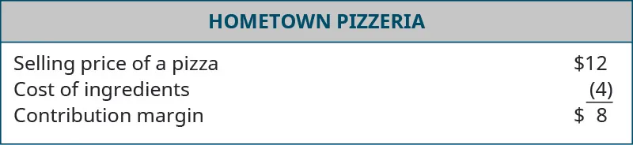
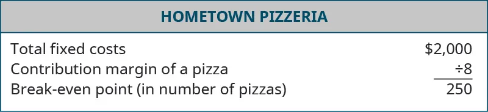

## 9.4   Xây dựng báo cáo tài chính và dự báo cho startup

> **🎯 Mục tiêu học tập**
>
> Sau khi hoàn thành phần này, bạn có thể:
>
> - Hiểu ba báo cáo tài chính chủ yếu: bảng cân đối kế toán, báo cáo kết quả kinh doanh và báo cáo lưu chuyển tiền tệ
> - Hiểu cách lập dự báo tài chính và cách sử dụng tốc độ vận hành (run rate) cùng tốc độ đốt tiền
> - Hiểu cách xây dựng phân tích hòa vốn

Bạn đã học được cách hệ thống kế toán phân loại các giao dịch theo tài sản, nợ phải trả và vốn chủ sở hữu; những giao dịch đó có ý nghĩa gì trong phương trình kế toán; và thông tin đó cho biết điều gì về sức khỏe tài chính tổng thể của một thực thể. Bây giờ, chúng ta sẽ xem xét cách tóm tắt các giao dịch đó thành các báo cáo tài chính có thể chia sẻ với các bên liên quan. Về mặt nội bộ, các báo cáo này được dùng để đưa ra quyết định về quản lý công ty và hoạt động của nó. Về mặt bên ngoài, chúng cung cấp dữ liệu cho các nhà đầu tư hiện tại và tiềm năng để hỗ trợ quyết định tài chính dành cho dự án kinh doanh.

Thông tin được nhập vào hệ thống kế toán được tóm tắt trong **báo cáo tài chính**, là đầu ra của một hệ thống kế toán. Chúng ta sẽ xem xét ba loại báo cáo tài chính cơ bản:

- Bảng cân đối kế toán
- Báo cáo kết quả kinh doanh
- Báo cáo lưu chuyển tiền tệ

Mỗi loại báo cáo truyền đạt một loại thông tin cụ thể tới đối tượng sử dụng của nó. Các nhà đầu tư trên khắp thế giới sử dụng báo cáo tài chính hằng ngày để đưa ra quyết định đầu tư.

> **🔗 Liên kết học tập**
>
> Nếu bạn thích các câu đố, ô chữ, bài điền từ, bài tập ghép cặp hoặc xáo trộn từ, hãy truy cập [My Accounting Course](https://openstax.org/l/52MyAcctCourse) để tìm những cách thú vị giúp củng cố kiến thức kế toán bạn đang học. Website này bao quát nhiều chủ đề kế toán, bao gồm kiến thức kế toán tài chính cơ bản và các báo cáo tài chính.

### Bảng cân đối kế toán

Báo cáo tài chính đầu tiên là bảng cân đối kế toán. **Bảng cân đối kế toán** tóm tắt phương trình kế toán và sắp xếp các tài khoản riêng lẻ thành những nhóm hợp lý. Như bạn đã học trước đó, các thành phần của phương trình kế toán là:

- **tài sản**  - những gì công ty sở hữu hoặc sẽ hưởng lợi từ đó; ví dụ gồm tiền mặt, hàng tồn kho và thiết bị
- **nợ phải trả**  - các khoản nợ hoặc số tiền công ty phải hoàn trả trong tương lai; ví dụ gồm số dư thẻ tín dụng, các khoản vay phải trả, v.v.
- **vốn chủ sở hữu**  - phần tài sản thuộc về chủ sở hữu sau khi nợ được thanh toán

Bản thân **phương trình kế toán** (tài sản = nợ phải trả + vốn chủ sở hữu) được thể hiện đầy đủ trên bảng cân đối kế toán. Nó được trình bày thành hai phần. Một bên liệt kê toàn bộ tài sản và cộng tổng số tiền của chúng. Tổng này được so sánh với tổng của phần thứ hai và thứ ba, là nợ phải trả và vốn chủ sở hữu. Cũng giống như bản thân phương trình kế toán phải cân bằng, bảng cân đối kế toán cũng phải cân bằng.

[Hình 9.11](9-4-developing-startup-financial-statements-and-projections#OSX_Eship_09_04_HPBalance) cho thấy bảng cân đối kế toán năm 2020 của Hometown Pizzeria. Đây chính là loại báo cáo tài chính mà các nhà đầu tư ngoài đời thực sử dụng để tìm hiểu về doanh nghiệp. Bạn có thể nhìn thấy những khía cạnh chính của phương trình kế toán ở mỗi nửa của báo cáo, cùng với nhiều tài khoản chi tiết riêng lẻ. Báo cáo tài chính này cung cấp cho người đọc cái nhìn tóm tắt nhanh về những gì công ty sở hữu và những gì công ty đang nợ. Nhà đầu tư tiềm năng sẽ quan tâm đến cả hai mặt này. Mức nợ phải trả là dấu hiệu cho thấy doanh nghiệp còn phải thanh toán bao nhiêu trước khi nhà đầu tư có thể thấy lợi nhuận từ khoản đầu tư của họ.

Không giống phương trình kế toán được trình bày trong [Kiến thức kế toán cơ bản dành cho doanh nhân](9-3-accounting-basics-for-entrepreneurs), phần lớn bảng cân đối kế toán trình bày dữ liệu theo chiều dọc thay vì chiều ngang. Tuy nhiên, định dạng dọc vẫn thể hiện hai vế của phương trình, chỉ khác là nợ phải trả và vốn chủ sở hữu nằm ở nửa dưới của báo cáo. Lưu ý rằng hai vế này vẫn phải bằng nhau, hay cân bằng, vì vậy mới có tên là “bảng cân đối kế toán”.

*Hình 9.11: Đây là bảng cân đối kế toán của Hometown Pizzeria. (ghi công: Copyright Rice University, OpenStax, theo giấy phép CC BY NC-SA 4.0)*

Việc xem xét bảng cân đối kế toán của Hometown Pizzeria cho phép chúng ta thấy công ty có những loại tài sản nào. Chúng ta thấy tiền mặt, nguyên liệu và thiết bị nhà hàng - tất cả đều là những thứ cần thiết để làm và bán pizza. Chúng ta cũng thấy một số khoản nợ phải trả. **Các khoản phải trả** là tài khoản bao gồm nhiều nhà cung cấp khác nhau mà công ty mua hàng theo tín dụng, nghĩa là các nhà cung cấp cho phép tiệm pizza trả tiền sau khi họ giao hàng. Những nhà cung cấp đó có thể là công ty bán bột mì, nông sản hoặc hộp đựng pizza. “Các khoản phải trả thẻ tín dụng” là số dư phải trả trên thẻ tín dụng, khoản này cũng có thể đã được dùng để tích trữ vật tư hoặc thanh toán các hóa đơn khác.

Một trong những điều đầu tiên mà nhà đầu tư sẽ làm là so sánh tổng tài sản của công ty với tổng nợ phải trả. Trong trường hợp này, tiệm pizza báo cáo tổng tài sản là 27.182 USD và tổng nợ phải trả là 5.649 USD. Điều đó có nghĩa là tiệm pizza sở hữu nhiều hơn số tiền họ đang nợ, đây là một dấu hiệu tốt. Trên thực tế, tài sản của công ty lớn hơn nợ phải trả nhiều lần. Dù hiện tại công ty không có đủ tiền mặt để trả hết toàn bộ nợ, các tài sản khác vẫn có giá trị và có thể được bán để tạo ra tiền mặt.

Tóm lại, bảng cân đối kế toán là bản tóm tắt của phương trình kế toán. Nó cho chủ doanh nghiệp biết công ty có gì và những thứ đó được thanh toán bằng cách nào. Nhà đầu tư cũng muốn hiểu công ty đã chi tiền vào đâu và số tiền đó đến từ nguồn nào. Nếu một công ty đang gánh quá nhiều nợ, bất kỳ khoản đầu tư nào cũng có thể bị dùng ngay để theo kịp các chủ nợ mà không thật sự giúp ích cho hoạt động kinh doanh. Cuối cùng, nhà đầu tư muốn đọc các báo cáo tài chính này để biết tiền của họ sẽ được sử dụng ra sao.

### Báo cáo kết quả kinh doanh

Báo cáo tài chính cơ bản thứ hai là báo cáo kết quả kinh doanh, cho thấy kết quả từ hoạt động của công ty. Ở mức cơ bản nhất, **báo cáo kết quả kinh doanh** - còn gọi là **báo cáo lãi lỗ** - mô tả công ty kiếm được bao nhiêu tiền trong quá trình vận hành và đã phát sinh những chi phí nào để tạo ra doanh thu đó. Nhà đầu tư muốn biết công ty đã thu được bao nhiêu tiền từ khách hàng và đã phải chi bao nhiêu để có được những khách hàng đó. Doanh thu trừ chi phí sẽ tạo ra **lợi nhuận ròng**, hay **lợi nhuận** nếu còn tiền dư lại.

Sau khi xác định tổng doanh thu và chi phí, doanh nghiệp có thể tính biên lợi nhuận của mình. **Biên lợi nhuận** là lợi nhuận chia cho tổng doanh thu, được biểu diễn dưới dạng phần trăm. Ví dụ, nếu chúng ta mở một tiệm pizza và tạo ra 100.000 USD doanh số trong năm đầu tiên đồng thời phát sinh 90.000 USD chi phí, kết quả sẽ là 10.000 USD lợi nhuận ròng. Nếu lấy lợi nhuận ròng đó chia cho 100.000 USD doanh số, biên lợi nhuận là 10 phần trăm. Nghĩa là cứ mỗi đô la doanh số tạo ra, mười xu được giữ lại dưới dạng lợi nhuận. Chúng ta có thể giữ khoản lợi nhuận này cho việc cải tạo trong tương lai, mở rộng hoặc chi trả cho chủ sở hữu dưới dạng phân phối lợi nhuận.

Một tiệm pizza - hay bất kỳ doanh nghiệp nào bán sản phẩm hữu hình - đều có các chi phí gắn trực tiếp với sản phẩm được bán. Ví dụ, pizza cần bột mì và men để làm đế, nước sốt cà chua, phô mai và các loại topping khác. Chúng ta gọi những chi phí này là **giá vốn hàng bán**. Đây là yếu tố chính quyết định doanh nghiệp có thể sinh lợi hay không. Nếu giá bán một chiếc pizza là 12 USD và chi phí nguyên liệu cũng là 12 USD thì giao dịch đó bằng 0. Công ty sẽ không kiếm được tiền từ một lần bán và chỉ đang thu hồi lại đúng số tiền đã trả cho nguyên liệu. Đây không phải mô hình kinh doanh khả thi vì ngoài nguyên liệu còn có nhiều chi phí khác như tiền thuê mặt bằng, lương nhân viên và các khoản khác.

Giá bán của một mặt hàng trừ đi chi phí trực tiếp của nó - hay giá vốn hàng bán - là **lợi nhuận gộp**. Trong một doanh nghiệp sản phẩm, đây là chỉ số vận hành quan trọng nhất. Doanh nghiệp cần biết mình kiếm được bao nhiêu tiền trên mỗi lần bán vì chính lợi nhuận gộp đó chi trả cho tất cả các chi phí khác. Nếu tiệm pizza bán một chiếc pizza với giá 12 USD, chi phí nguyên liệu có thể là 4 USD, như vậy lợi nhuận gộp từ một chiếc pizza là 8 USD. Mỗi lần công ty bán thêm một chiếc pizza, lợi nhuận gộp lại tăng thêm. Nếu doanh nghiệp bán 1.000 chiếc pizza trong một tháng, doanh số sẽ là 12.000 USD, giá vốn hàng bán là 4.000 USD và còn lại 8.000 USD cho lợi nhuận ([Hình 9.12](9-4-developing-startup-financial-statements-and-projections#OSX_Eship_09_04_HPIncome)).

*Hình 9.12: Đây là báo cáo kết quả kinh doanh của Hometown Pizzeria. (ghi công: Copyright Rice University, OpenStax, theo giấy phép CC BY NC-SA 4.0)*

#### Kết quả từ hoạt động kinh doanh

Như bạn đã học ở phần trước của chương này, doanh nghiệp có thể tạo ra tài sản thông qua tài trợ bằng nợ hoặc bằng vốn chủ sở hữu. Sau khoản đầu tư ban đầu, những tài sản đó có thể được sử dụng để vận hành doanh nghiệp. Ví dụ, khi Hometown Pizzeria khai trương, sau khi hoàn thiện ban đầu khu bếp và khu ăn uống, doanh nghiệp có thể làm và phục vụ đồ ăn cho khách hàng để đổi lấy tiền. Quá trình này tạo ra tài sản mới dưới dạng tiền mặt thu được từ khách hàng và trở thành cách thứ ba để tạo ra tài sản trong doanh nghiệp - từ hoạt động kinh doanh, mà chúng ta gọi là doanh thu. Trong tình huống lý tưởng, doanh nghiệp sẽ cần rất ít đầu tư bên ngoài sau khi hoạt động đã bắt đầu.

Số tiền doanh nghiệp kiếm được từ việc bán sản phẩm hoặc cung cấp dịch vụ được gọi là **doanh thu**, hay **doanh số**. Các khoản chi phát sinh trong quá trình hoạt động bình thường được gọi là **chi phí**. Với tiệm pizza mới khai trương, các khoản thanh toán của khách cho bữa ăn là doanh thu, trong khi chi phí nguyên liệu thực phẩm, đồ uống, bộ đồ ăn và các sản phẩm giấy như khăn ăn là chi phí hoạt động. Phần chênh lệch giữa doanh thu và chi phí hoạt động là lợi nhuận của doanh nghiệp, hay lợi nhuận ròng.

Trước khi tiếp tục hình dung về thu nhập từ hoạt động kinh doanh, hãy dừng lại để xem lại một số khác biệt cơ bản giữa các thuật ngữ chính này. Khi công ty có được tài sản mới, những tài sản đó phải đến từ một nơi nào đó, thường là từ một trong ba nguồn. Chúng ta sẽ thấy các lựa chọn này ở phía bên phải của phương trình, khi đi từ trái sang phải. Thứ nhất, nếu chúng ta có một tài sản mới nhưng chưa trả tiền cho nó, chúng ta đã tạo ra một khoản nợ phải trả - tức điều mà doanh nghiệp đang nợ. Đó là trường hợp khi Shanti trả tiền cho máy tính của cô ấy bằng thẻ tín dụng. Trong tương lai, cô ấy sẽ phải thanh toán cho công ty thẻ tín dụng, nhưng điều này khác với chi phí, như chúng ta sẽ thấy sau. Hiện tại, chúng ta đang có thêm một thứ mới và sẽ phải trả lại tiền cho ai đó sau.

Nguồn thứ hai tạo ra tài sản mới là khoản đầu tư của chủ sở hữu. Đây là ví dụ đầu tiên chúng ta thấy khi Shanti gửi tiền tiết kiệm cá nhân vào tài khoản ngân hàng của doanh nghiệp. Xét từ góc độ doanh nghiệp, tài sản tăng lên vì cô ấy có nhiều tiền mặt hơn trước, và ở phía bên phải của phương trình kế toán, chúng ta ghi nhận nguồn của tài sản đó - chính Shanti. Vì vậy, đầu tư của chủ sở hữu là một nguồn hình thành tài sản mới khác.

Cách thứ ba để doanh nghiệp có được tài sản mới là từ hoạt động kinh doanh. Khi Shanti sử dụng tài sản của doanh nghiệp mình (một chiếc máy tính) để thực hiện công việc cho khách hàng (tạo một website), điều đó dẫn đến một giao dịch bán hàng, hay doanh thu. Tài sản của doanh nghiệp tăng lên vì khách hàng trả tiền cho công việc; do đó tiền mặt của Shanti tăng lên. Một lần nữa, ở phía bên phải phương trình, chúng ta ghi nhận nguồn gốc của tài sản đó là doanh thu. Doanh thu là sự gia tăng tài sản nhờ khách hàng thanh toán cho hàng hóa và dịch vụ.

Để minh họa, hãy tiếp tục với doanh nghiệp thiết kế website của Shanti. Cô ấy đã mua một chiếc máy tính bằng tiền tiết kiệm cá nhân và được thuê để tạo một website cho một doanh nghiệp địa phương. Khách hàng này đồng ý trả 5.000 USD cho website, thanh toán khi website hoàn thành. Khi công việc hoàn tất, Shanti ghi nhận việc thu được 5.000 USD tiền mặt như một khoản tăng của tài khoản tiền mặt. Ở phía bên phải của phương trình, khoản này được thêm vào một tài khoản thuộc vốn chủ sở hữu dành cho doanh thu ([Hình 9.13](9-4-developing-startup-financial-statements-and-projections#OSX_Eship_09_04_Equity05)).

![The accounting equation shows that assets equal liabilities plus equity. Assets show a credit of $1,000 in the cash account, a debit of $1,000 in the cash account, and a credit of $5,000 in the cash account for a total of $5,000. Assets show a credit of $1,000 in the computer account for a total of $1,000. Total assets are $6,000. Liabilities are $0. Equity shows a credit of $1,000 in the owner’s capital account for a total of $1,000 and a credit of $5,000 in the revenue account for a total of $5,000. Total equity is $6,000.](../assets/img-9-4-3.webp)

*Hình 9.13: Hình này minh họa việc ghi nhận một giao dịch bán hàng cho khách trị giá 5.000 USD. (ghi công: Copyright Rice University, OpenStax, theo giấy phép CC BY NC-SA 4.0)*

Tổng tài sản của công ty đã tăng lên 6.000 USD khi cộng thêm 5.000 USD kiếm được và thu từ khách hàng này. Ở phía bên phải của phương trình, vốn chủ sở hữu tăng lên trong một cột mới đại diện cho doanh thu và chi phí, trong đó doanh thu là số dương còn chi phí là số âm.

**Phương trình kế toán** mô tả cách các giao dịch được phân loại trong bối cảnh cân bằng giữa những gì doanh nghiệp có (tài sản) với cách doanh nghiệp chi trả cho các tài sản đó (nợ phải trả và vốn chủ sở hữu). Trong phần tiếp theo của chương này, chúng ta sẽ khám phá cách thông tin này được tóm tắt trong báo cáo tài chính và cách doanh nhân cũng như nhà đầu tư tiềm năng sử dụng thông tin đó.

> **🔗 Liên kết học tập**
>
> Kế toán là hệ thống truyền thông cho phép cả những người bên trong lẫn bên ngoài công ty đưa ra quyết định. Để có một [tổng quan](https://openstax.org/l/52Accounting) về kế toán, hãy xem video trên website Investopedia.

### Báo cáo lưu chuyển tiền tệ

Báo cáo tài chính cơ bản thứ ba mà chúng ta sẽ thảo luận là **báo cáo lưu chuyển tiền tệ**, giải thích nguồn hình thành và cách sử dụng tiền mặt của công ty.

Bạn có thể tự hỏi báo cáo lưu chuyển tiền tệ khác báo cáo kết quả kinh doanh ở điểm nào. Câu trả lời ngắn gọn là báo cáo kết quả kinh doanh ghi nhận các sự kiện khi chúng xảy ra, chứ không nhất thiết là khi công ty nhận được tiền. Nó ghi nhận một số khoản mục như doanh số khi công việc hoàn thành. Hãy quay lại với Shanti, nhà thiết kế website. Ngay khi cô ấy hoàn tất website cho khách hàng, hệ thống kế toán sẽ ghi nhận *doanh thu*, tức số tiền khách hàng đó phải trả; khoản mục thứ hai này được gọi là **các khoản phải thu**. Nếu khách hàng của Shanti gặp khó khăn tài chính hoặc thậm chí ngừng kinh doanh, cô ấy có thể không bao giờ được trả tiền cho công việc đó, nhưng báo cáo kết quả kinh doanh vẫn sẽ thể hiện doanh số và vì thế có thể cho thấy lợi nhuận. Nếu khách hàng phá sản, tài khoản ngân hàng của doanh nghiệp sẽ không có bất kỳ dấu hiệu nào về lợi nhuận đó.

Đó chính là lý do báo cáo lưu chuyển tiền tệ được phát triển. Báo cáo này xử lý những khác biệt đó bằng cách chỉ thể hiện các hoạt động dẫn tới dòng tiền thu vào hoặc chi ra. Để hiểu rõ hơn mục đích và cách sử dụng báo cáo lưu chuyển tiền tệ, trước hết hãy xem lại báo cáo này trong bối cảnh một tiệm pizza ([Hình 9.14](9-4-developing-startup-financial-statements-and-projections#OSX_Eship_09_04_HPCashFlow)).

![Hometown Pizzeria’s statement of cash flows is provided for the year ended December 31, 2020. Cash flows from operating activities include a credit for cash received from customers $50,000, a debit for cash paid for ingredients and supplies $18,000, a debit for cash paid for employees $12,500, a debit for cash paid for interest $3,300, and a debit for cash paid for taxes $3,900 for a total net provided by operating activities of $12,300. Cash flows from investing activities include a debit for purchase of equipment and furniture $55,000. Cash flows from financing activities shows a credit for proceeds from long-term debt of $60,000. Net increase/decrease in cash is an increase of $17,300.](../assets/img-9-4-4.webp)

*Hình 9.14: Đây là báo cáo lưu chuyển tiền tệ của Hometown Pizzeria. (ghi công: Copyright Rice University, OpenStax, theo giấy phép CC BY NC-SA 4.0)*

Như chúng ta có thể thấy trong báo cáo lưu chuyển tiền tệ của Hometown Pizzeria, mặc dù các hoạt động cơ bản tạo ra dòng tiền dương, vẫn cần một khoản mua sắm lớn. Điều này thường gặp ở thời điểm doanh nghiệp mới hình thành. Không phải mọi địa điểm đều có sẵn bếp thương mại và khu ăn uống, vì vậy doanh nghiệp có thể cần mua những thứ như lò nướng pizza, ghế và bàn ăn. Lưu ý rằng mặc dù báo cáo kết quả kinh doanh gần đúng với dòng tiền từ hoạt động kinh doanh, nó sẽ không cho thấy khoản tiền chi ra lớn do việc mua thiết bị ban đầu. Khoản mua đó sẽ được xử lý như một tài sản trong bối cảnh của phương trình kế toán và được ghi trên bảng cân đối kế toán. Chỉ từ sự khác biệt lớn này thôi, chúng ta có thể hiểu vì sao nhiều người cho rằng báo cáo lưu chuyển tiền tệ là báo cáo quan trọng nhất trong các báo cáo tài chính. Nó là cầu nối giữa báo cáo kết quả kinh doanh và bảng cân đối kế toán.

Như bạn có thể thấy trong hình, báo cáo lưu chuyển tiền tệ được chia thành ba phần. Phần thứ nhất là **hoạt động kinh doanh**, tức các hoạt động thường nhật của doanh nghiệp, bao gồm mua vật tư, trả tiền thuê và nhận tiền mặt từ khách hàng. Phần này cho người đọc biết mô hình kinh doanh của công ty hiệu quả đến mức nào trong việc tạo ra dòng tiền.

**Hoạt động đầu tư** bao gồm các khoản mua sắm lớn về thiết bị hoặc cơ sở vật chất. Ví dụ, khi **Amazon** phát triển trụ sở chính thứ hai, hàng tỷ đô la được chi ra đó sẽ được ghi nhận là hoạt động đầu tư. Ngoài ra, nếu công ty có lượng tiền mặt dư thừa, họ có thể mua các chứng khoán như cổ phiếu và trái phiếu, vốn có tỷ suất sinh lời cao hơn tài khoản tiết kiệm ngân hàng truyền thống. Phần này cho người đọc biết công ty đang chi tiền vào đâu xét theo các thương vụ mua sắm quy mô lớn.

Phần thứ ba của báo cáo lưu chuyển tiền tệ là **hoạt động tài chính**. Phần này cho người đọc biết dòng tiền mới được bơm vào đến từ đâu. Chủ sở hữu của Hometown Pizzeria cần tìm cách chi trả cho thiết bị bếp và đồ nội thất. Nếu họ có khoản tiền này trong tiết kiệm cá nhân, họ có thể đơn giản góp trực tiếp vào công ty. Nếu chưa có tiền sẵn, họ sẽ phải tìm đến các nguồn khác, như khoản vay hoặc các loại nhà đầu tư đã được thảo luận trong [Tổng quan về tài chính khởi nghiệp và các chiến lược kế toán](9-1-overview-of-entrepreneurial-finance-and-accounting-strategies). Nhìn chung, mọi hoạt động tài chính cũng được ghi nhận trên bảng cân đối kế toán. Phần này của báo cáo giải thích những nguồn nào đã được chủ sở hữu sử dụng để tạo ra dòng vốn bên ngoài đi vào doanh nghiệp. Nó cũng luôn chỉ ra các yêu cầu tài chính trong tương lai. Chẳng hạn, nếu ngân hàng cho tiệm pizza vay tiền, chúng ta biết rằng khoản đó sẽ phải được hoàn trả trong tương lai. Vì vậy, doanh nghiệp cần bảo đảm mình dành riêng tiền để trả nợ hằng tháng. Nếu các nhà đầu tư mới góp tiền, họ sẽ tìm kiếm mức hoàn vốn như thế nào? Nếu họ muốn nhận phân phối lợi nhuận thường xuyên, doanh nghiệp cũng phải tính đến điều đó.

> **🔗 Liên kết học tập**
>
> Việc làm quen với loại thông tin mà các công ty báo cáo mỗi năm là điều hữu ích. Hãy đọc [báo cáo thường niên năm 2017 của Best Buy](https://openstax.org/l/52BestBuy2017) để tìm hiểu thêm về Best Buy. Hãy chú ý tới bảng cân đối kế toán của công ty ở trang 53 của báo cáo và báo cáo kết quả kinh doanh ở trang 54. Những báo cáo này có nhiều thông tin hơn rất nhiều so với các báo cáo tài chính bạn đã thấy, nhưng khi đọc, bạn sẽ nhận ra một số khoản mục quen thuộc.

### Dự báo

Trong số những công cụ mạnh mẽ nhất mà chủ doanh nghiệp có thể sử dụng là các bản dự báo. Một **bản dự báo** là dự tính về hoạt động trong tương lai của doanh nghiệp. Nó tạo ra một bức tranh toàn cảnh cho doanh nghiệp: vài tháng tới sẽ như thế nào? Còn năm tới thì sao? Bản dự báo sẽ phác họa mức thanh toán dự kiến sẽ thu được và thời điểm các chi phí phát sinh. Điều này giúp chủ doanh nghiệp hiểu rõ những nhu cầu tài trợ tiềm năng nào cần được bảo đảm.

Hai khái niệm then chốt liên quan đến dự báo là tốc độ vận hành (run rate) và tốc độ đốt tiền. **Tốc độ vận hành (run rate)** giúp ngoại suy sang tương lai. Ví dụ, nếu tiệm pizza đang tạo ra doanh số 10.000 USD mỗi tháng, điều đó tương đương với tốc độ vận hành (run rate) là 120.000 USD. Nhân số tiền mỗi tháng với mười hai cho chúng ta con số hằng năm; nếu muốn dự báo theo quý, chúng ta sẽ nhân số tiền mỗi tháng với ba. Điều này hữu ích khi giải thích với nhà đầu tư doanh nghiệp sẽ trông như thế nào sau khi đã tạo được đà tăng trưởng doanh số.

**Tốc độ đốt tiền** là tốc độ mà dòng tiền chi ra vượt quá dòng tiền thu vào, hay về bản chất là số tiền công ty đang tiêu hao mỗi tháng. Trước khi tạo được doanh thu, hoặc tạo đủ doanh thu chỉ để hòa vốn, các công ty khởi nghiệp sẽ phải chịu lỗ. Hiểu được tốc độ mà chi phí vượt quá doanh thu giúp chủ doanh nghiệp lập kế hoạch phù hợp. Ví dụ, nếu phải mất sáu tháng để cải tạo tiệm pizza và tiền thuê mỗi tháng là 2.000 USD, thì tốc độ đốt tiền là 2.000 USD mỗi tháng và điều này dự báo rằng doanh nghiệp sẽ cần thêm 12.000 USD (2.000 USD nhân sáu tháng) sẵn có dưới dạng tài trợ ngoài chi phí cải tạo. Tiền thuê mặt bằng vẫn phải được trả, ngay cả khi tiệm pizza chưa mở cửa kinh doanh.

Trong giai đoạn hạt giống của một công ty, các bản dự báo cũng có thể được dùng để cho nhà đầu tư tiềm năng thấy doanh nghiệp sẽ kiếm tiền nhanh đến đâu, qua đó hy vọng khuyến khích họ đầu tư vào dự án. Cũng như trên ***Shark Tank***, dự báo được sử dụng trong phần “pitch”. Nhà đầu tư và bên cho vay muốn thấy chính xác doanh nghiệp sẽ vận hành ra sao và công ty tạo ra kết quả tài chính tích cực nhanh đến mức nào.

### Phân tích hòa vốn

Một phần quan trọng khác trong việc lập kế hoạch đối với chủ doanh nghiệp mới là hiểu **điểm hòa vốn**, tức mức hoạt động tạo ra vừa đủ doanh thu để bù đắp chi phí. Nó không tạo ra lợi nhuận nhưng cũng không tạo ra thua lỗ. Để tính điểm hòa vốn, trước tiên bạn phải hiểu hành vi của các loại chi phí khác nhau: biến đổi và cố định.

**Chi phí biến đổi** dao động theo mức doanh thu. Quay lại Hometown Pizzeria, chúng ta thấy chi phí nguyên liệu là một chi phí biến đổi. Ở phần trước, chúng ta cũng gọi chúng là giá vốn hàng bán. Chi phí biến đổi dựa trên số lượng pizza bán ra, với mục tiêu là chỉ mua vừa đủ nguyên liệu để doanh nghiệp không thiếu hàng hoặc gặp hư hỏng. Trong ví dụ này, chi phí làm một chiếc pizza là 4 USD, nên tổng chi phí biến đổi trong bất kỳ tháng nào sẽ bằng 4 USD nhân với số lượng pizza được làm ra. Điều này khác với chi phí cố định như tiền thuê, khoản vẫn giữ nguyên mỗi tháng bất kể tiệm pizza có bán được chiếc pizza nào hay không.

Bước đầu tiên để hiểu điểm hòa vốn là tính lợi nhuận đóng góp của từng mặt hàng bán ra. **Lợi nhuận đóng góp** là lợi nhuận gộp từ một đơn vị hàng bán ra. Vì vậy, giá bán trừ chi phí biến đổi chính là lợi nhuận đóng góp. Giá bán một chiếc pizza của Hometown Pizzeria là 12 USD. Chi phí biến đổi là 4 USD, dẫn đến lợi nhuận đóng góp là 8 USD cho mỗi chiếc pizza. Khoản 8 USD này sẽ dùng để chi trả các chi phí khác; khi những chi phí đó đã được bù đắp, phần còn lại sẽ được cộng vào lợi nhuận. Một khi hiểu mỗi mặt hàng bán ra đóng góp bao nhiêu vào các chi phí khác, chúng ta sẽ hiểu các chi phí đó vận hành như thế nào ([Hình 9.15](9-4-developing-startup-financial-statements-and-projections#OSX_Eship_09_04_HPContMarg)).

*Hình 9.15: Đây là lợi nhuận đóng góp của Hometown Pizzeria. (ghi công: Copyright Rice University, OpenStax, theo giấy phép CC BY NC-SA 4.0)*

Nhóm chi phí chính còn lại là chi phí cố định. **Chi phí cố định** là một khoản định sẵn và không thay đổi, bất kể mức doanh số. Trước đó, chúng ta đã dùng tiền thuê làm ví dụ cho loại chi phí này, nhưng phần lớn các chi phí khác của doanh nghiệp cũng vận hành theo cách tương tự. Dù một số chi phí có thay đổi từ tháng này sang tháng khác, chỉ những khoản nào tăng lên nếu công ty bán thêm dù chỉ một đơn vị sản phẩm mới được gọi là biến đổi. Các chi phí như bảo hiểm, tiền lương và vật tư văn phòng thường được coi là chi phí cố định.

Khi đã xác định được chi phí biến đổi và chi phí cố định, thông tin này có thể được dùng để lập phân tích hòa vốn. Việc tính điểm hòa vốn đơn giản là lấy tổng chi phí cố định chia cho lợi nhuận đóng góp. Để minh họa, hãy giả sử Hometown Pizzeria vẫn bán pizza với lợi nhuận đóng góp 8 USD mỗi chiếc. Đồng thời giả sử chi phí cố định duy nhất là tiền thuê 2.000 USD mỗi tháng. Nếu muốn biết chủ doanh nghiệp phải bán bao nhiêu chiếc pizza mỗi tháng để trả tiền thuê, chúng ta lấy 2.000 USD chia cho 8 USD. Kết quả là điểm hòa vốn 250 chiếc pizza. Giờ đây chúng ta biết rằng nếu tiệm pizza bán 250 chiếc pizza một tháng thì tiền thuê được trả hết hoàn toàn. Bất kỳ chiếc pizza bán thêm nào cũng làm tăng lợi nhuận của công ty. Nếu doanh nghiệp bán ít hơn 250 chiếc pizza, doanh thu sẽ không đủ để trang trải tiền thuê và công ty sẽ bị lỗ. Bất cứ khi nào doanh nghiệp chịu lỗ, chủ sở hữu sẽ phải đóng góp thêm tiền tiết kiệm cá nhân hoặc có khả năng đi vay nợ ([Hình 9.16](9-4-developing-startup-financial-statements-and-projections#OSX_Eship_09_04_HPBreakEv)).

*Hình 9.16: Đây là điểm hòa vốn của Hometown Pizzeria. (ghi công: Copyright Rice University, OpenStax, theo giấy phép CC BY NC-SA 4.0)*

Việc hiểu điểm hòa vốn của một doanh nghiệp mang lại rất nhiều thông tin giá trị. Ở mức cơ bản nhất, nó cho thấy phải bán bao nhiêu đơn vị sản phẩm để trang trải chi phí và không bị thua lỗ. Nó cũng có thể giúp chủ doanh nghiệp hiểu khi nào chi phí đang quá cao và quyết định cần bán bao nhiêu đơn vị để hòa vốn. Nhận ra điều này từ sớm có thể giúp doanh nhân tránh khởi sự một doanh nghiệp chỉ dẫn đến thua lỗ.

> **📝 Thực hành: Tính phân tích hòa vốn**
>
> Hãy xem công cụ phân tích hòa vốn. Sử dụng cùng lợi nhuận đóng góp đã cho (8 USD/pizza), hãy tính điểm hòa vốn nếu chúng ta chọn một thành phố đắt đỏ hơn. Chúng ta sẽ cần bán bao nhiêu chiếc pizza mỗi tháng để hòa vốn nếu chi phí cố định là 5.000 USD mỗi tháng? Còn nếu là 10.000 USD mỗi tháng thì sao?
